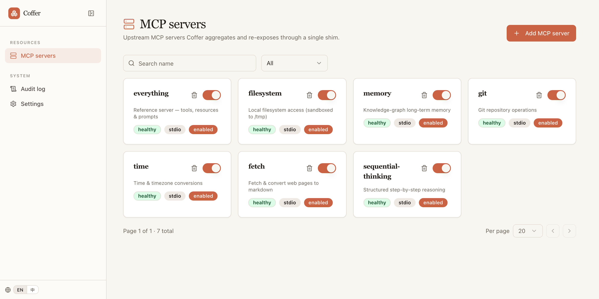
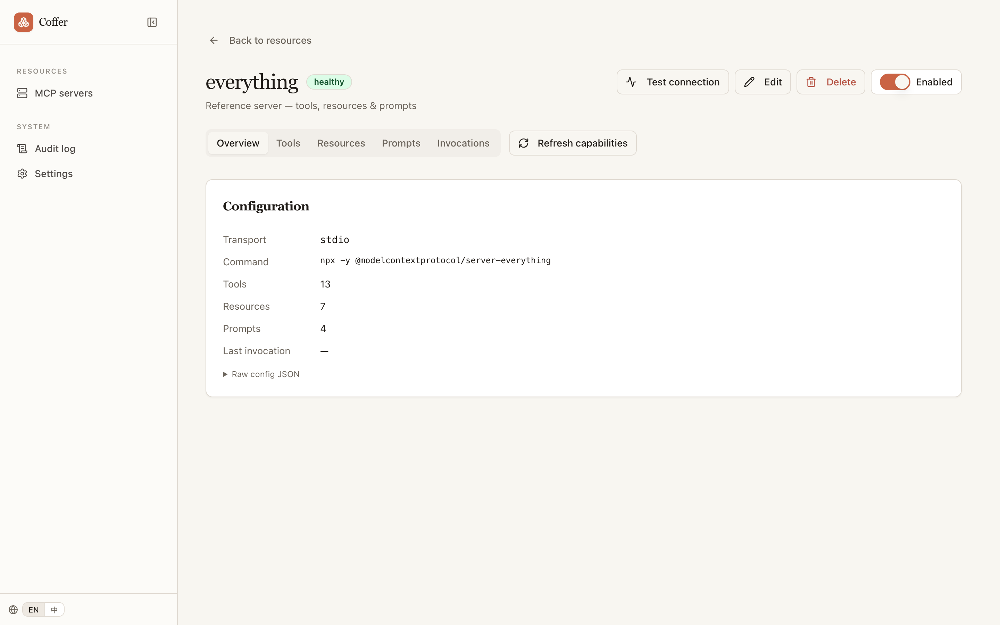
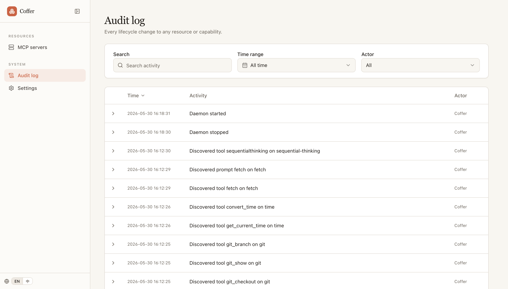

# Coffer

<p align="center">
  <b>English</b> · <a href="./README.zh.md">简体中文</a>
</p>

<p align="center">
  <a href="https://wyx-sg.github.io/Coffer/"></a>
  <a href="./LICENSE"></a>
  
  
  
</p>

> Local-first AI agent vault. Manage all your MCP servers from one place.

Coffer is a daemon + CLI that aggregates upstream MCP servers and re-exposes them to MCP clients (Claude Code, Codex) through a unified, namespaced surface. Configure once; every client sees the same tools. It also keeps an **agent registry** — detect and register your local AI coding agents, edit their config files in-app, and one-click install Coffer's own MCP server into any of them. All state lives on your machine — no cloud accounts, no vendor lock-in.

📖 **Documentation site:** https://wyx-sg.github.io/Coffer/

## Screenshots

<p align="center">
  
</p>

<p align="center">
  
  
</p>

<p align="center">
  <sub>One vault for every MCP server · live health & capabilities · a full audit trail — all local.</sub>
</p>

---

## Download & install

### One-line CLI install (macOS / Linux)

```sh
curl -fsSL --proto '=https' --tlsv1.2 https://wyx-sg.github.io/Coffer/install.sh | sh
```

Installs three binaries — `coffer` (management CLI), `coffer-daemon`, `coffer-mcp-shim` — to
`~/.coffer/bin`. **The daemon auto-starts on first use — no manual start step.** Environment
overrides: `COFFER_INSTALL_DIR`, `COFFER_VERSION`, `COFFER_NO_MODIFY_PATH`.

### Desktop app (most users)

Download the installer from [Releases](https://github.com/wyx-sg/Coffer/releases/latest):

| Platform             | File                              |
| -------------------- | --------------------------------- |
| macOS Apple silicon  | `Coffer_<version>_aarch64.dmg`    |
| Linux x64 (AppImage) | `Coffer_<version>_amd64.AppImage` |
| Linux x64 (deb)      | `coffer_<version>_amd64.deb`      |

Each file has a `.sha256` sibling for verification.

> **macOS (unsigned):** the build ships unsigned (notarisation pending), so macOS may say
> Coffer is "damaged" on first open (it isn't — right-click → Open won't help here). Clear the
> quarantine flag: `xattr -dr com.apple.quarantine /Applications/Coffer.app` — and if it still
> won't open, re-apply an ad-hoc signature: `codesign --force --deep --sign - /Applications/Coffer.app`

### From source (developers)

See [Install from source (developers)](#install-from-source-developers) below.

---

## Install from source (developers)

```bash
git clone https://github.com/wyx-sg/Coffer.git
cd Coffer
python3.12 -m venv .venv && source .venv/bin/activate
pip install -e ./backend[dev]
make verify          # sanity-check the install
```

`pip install` puts both the CLI (`coffer`) and the stdio shim (`coffer-mcp-shim`) on your `PATH`
as console-script entry points — no separate deploy step. The daemon **auto-starts** the first
time you run any `coffer` command or connect an MCP client — `coffer daemon start` exists for
explicit control but is not a required setup step.

---

## Quickstart

Register your first MCP server — using `@modelcontextprotocol/server-filesystem` as the example:

```bash
coffer mcp add filesystem \
  --stdio "npx -y @modelcontextprotocol/server-filesystem /tmp"

coffer mcp list                   # → filesystem  | stdio | enabled
coffer mcp tool list filesystem   # → read_file, write_file, list_directory, …
```

Then point your MCP client at the shim — see **Connect to an MCP client** below.

### Agents

An **agent** is a registered local AI coding agent (supported types: `claude_code`, `codex`).
Coffer can auto-detect installed agents (it lists candidates and asks you to confirm — nothing is
registered automatically), edit each agent's curated config files in-app (format-validated,
atomic write with a `.bak` backup, plus an in-editor find/replace that scrolls to the match), and
one-click install or uninstall Coffer's own MCP server into an agent. The desktop/web UI has an
**Agents** page (list + detail), a detect dialog, the config-file editor, and an MCP-install toggle.

```bash
coffer agent detect               # discover installed agents (confirm before registering)
coffer agent add claude_code      # register one (--name optional; defaults to claude-code)
coffer agent config edit <name> <key>  # edit a curated config file in your $EDITOR
coffer agent mcp install <name>   # install Coffer's MCP server into the agent
```

---

## Connect to an MCP client

Use `coffer-mcp-shim` as the stdio MCP server command. The shim auto-discovers (and if needed, auto-spawns) the daemon — no port or token config required.

### Claude Code

```bash
claude mcp add coffer coffer-mcp-shim
```

### Codex

`~/.codex/config.toml`:

```toml
[mcp_servers.coffer]
command = "coffer-mcp-shim"
```

Restart the client after editing its config. Tools appear namespaced as `<server-name>__<tool-name>` (e.g. `filesystem__read_file`).

---

## Project structure

```
backend/              Python daemon + CLI + shim
  coffer/
    domain/           pure types + business rules (no I/O)
    application/      services + orchestration
    infrastructure/   DB, MCP transports, keychain, daemon discovery
    surfaces/         HTTP (FastAPI) + CLI (Typer) + stdio shim
specs/                Speckit specs (one per feature)
docs/decisions/       Architectural Decision Records (ADRs)
agents/               Workflow, SDD, stack, and testing guides
```

Architecture deep-dive: [.specify/memory/architecture.md](.specify/memory/architecture.md).
ADRs: [docs/decisions/](docs/decisions/).

---

## Developer commands

| Command        | What it does                                                          |
| -------------- | --------------------------------------------------------------------- |
| `make verify`  | Full check: lint, type, unit, integration, contract, acceptance audit |
| `make install` | Install backend deps into the project venv                            |

---

## Contributing

- **Conventional Commits** required — see [agents/workflow.md](agents/workflow.md)
- **Spec-driven development** — every feature starts with a spec under `specs/<id>/` — see [agents/sdd.md](agents/sdd.md)
- **Architecture contracts** — 6 importlinter contracts must stay green (defined in [backend/pyproject.toml](backend/pyproject.toml))
- **Credentials** — all secrets go through `coffer.infrastructure.credentials.keyring_adapter`; never reach the DB in plaintext

---

## License

MIT — see [LICENSE](LICENSE).
