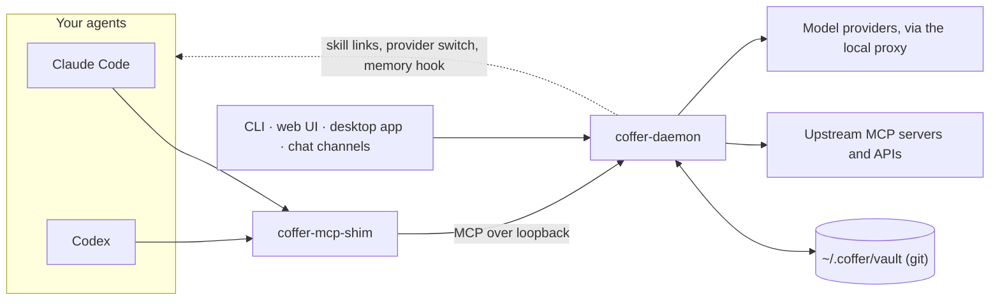

# Coffer

**English** · [简体中文](./README.zh-CN.md)

<p align="center">
  <a href="https://wyx-sg.github.io/Coffer/"></a>
  <a href="./LICENSE"></a>
  
  
  
</p>

> A local-first vault for your AI coding agents. Set up MCP servers, skills, knowledge, memory and model providers once, and every agent on your machine shares them.

Coffer is one daemon on your machine that Claude Code and Codex both connect to. It holds what your agents share — the tools they call, the skills they follow, the notes they read, the keys they use — in a vault of plain files under `~/.coffer`, and delivers each of them into every agent. You manage it from a web UI, a macOS desktop app, or a Telegram or SeaTalk chat; the `coffer` CLI starts the daemon and reads its logs. There is no account and no cloud backend: the daemon listens on `127.0.0.1` only.

📖 **Documentation:** <https://wyx-sg.github.io/Coffer/> ([中文](https://wyx-sg.github.io/Coffer/zh/))

## Why Coffer

Every coding agent keeps its own copy of everything. Claude Code reads MCP servers from `~/.claude.json`, Codex from `~/.codex/config.toml`. Each has its own `skills/` folder, its own memory, and its own copy of your API keys. Add a server to one and forget the other, improve a skill in one folder and not the other, teach one agent a fact the other never learns — the more agents you use, the more copies drift apart.

Coffer replaces the copies with one shared layer beneath the agents:

- **Local-first.** Everything lives in `~/.coffer` on your machine. Cloud services appear only as the model providers and MCP servers you choose to call.
- **The agent's files stay the source of truth.** Coffer reads an agent's config, memory and transcripts where the agent keeps them, and writes only the entries it owns — atomically, with a `.bak` backup. Remove Coffer and your agents keep working.
- **Secrets are ciphertext.** Configuration holds a secret's name, never its value. Values are Fernet-encrypted under a master key you hold, and never reach the vault in plain text, the logs or the audit log.
- **AI-native.** Chores that depend on your machine — installing a missing runtime, diagnosing a failing server, merging a skill update with your edits — are handed to an agent. Coffer writes a prompt with the facts and offers it two ways: **Copy prompt** for your own agent, or **Ask an agent** to open a pre-filled conversation that runs only when you press Send. Coffer never hard-codes one package manager's install steps.

## What it does

| | |
| --- | --- |
| **One MCP endpoint** | Register an upstream MCP server once. Each agent's config holds a single `coffer` entry; tools appear as `<server>__<tool>`, you choose which tools each server exposes and which agents reach it, and every call is recorded (never its arguments). Past a tool budget, `coffer__search_tools` searches the full catalogue. |
| **Custom tools** | Turn any HTTP API into agent tools by importing an OpenAPI spec or describing one request. The gateway makes the request and adds your key on the way out. |
| **One skill library** | Import [AgentSkills](https://agentskills.io) folders once — from a folder, an archive or a git repository — and Coffer links them into each agent's `skills/` directory, keeps the links correct, and tracks upstream updates. The **CLIs** page shows which commands your skills need and which are missing, too old or not logged in. |
| **Knowledge** | Collections of plain Markdown under `~/.coffer/vault/knowledge/`. Agents read them with their own file tools from a generated catalogue, and add to them by writing a file into a collection's `.inbox/`. Nothing is chunked or embedded. An optional curation pass merges new material into the existing documents, with a history you can undo. |
| **Memory** | Coffer reads each agent's own native memory (read-only), distils it into notes per project plus a `global` partition, and delivers them back through a hook — so what Claude Code learned, Codex knows too. |
| **Model providers** | Store a provider profile (base URL and key) once and switch agents to it. Agents talk to Coffer's local model proxy, which adds the key upstream, fails over between connections serving the same model, and meters the usage and cost of what goes through it. No provider key is written into an agent's config. |
| **Conversations and channels** | Drive Claude Code or Codex from the web **Conversations** page, or pair a Telegram or SeaTalk bot and message your agents from your phone — in private chats, groups and threads. |
| **Vault sync** | The vault is a git repository. Point each of your machines at a git remote you own and Coffer pulls and pushes. A clean merge is applied; a conflict stops the round, with nothing changed on either side, until you choose per file — or hand the choice to an agent. A round that would delete a large share of the vault asks first, and every round can be rolled back. Secrets travel as ciphertext only. |
| **Activity and attention** | An audit log of every change, the MCP call log and the daemon log in one place, and an Overview that lists what needs you, most severe first. |

## Install

**Let your agent install it.** Coffer is for people who already work with a coding agent, so the quickest install is to paste this into Claude Code, Codex or any agent that can run commands on your machine:

```text
Install Coffer on this machine by following
https://wyx-sg.github.io/Coffer/start/install — pick the install path that fits
this machine (a release build if one is published for this OS and architecture,
otherwise from source). Ask me before running anything with sudo or editing my
shell profile. When it is installed, check it with `coffer daemon status`.
Then tell me which coding agents it found here (claude-code, codex) and which
config files each one's Connect button on the web UI's Agents page will change,
so I can connect them myself. Do not handle any credentials: if a step needs a
login, tell me what to do instead.
```

The agent reads the install page, picks the path for your machine and checks the result.

> **No tagged release yet.** The desktop app, the one-line installer and the release archives ship with Coffer's first tagged release. Until then, install from source.

**From source** (Python 3.12+, git and Node.js; [ripgrep](https://github.com/BurntSushi/ripgrep) recommended):

```sh
git clone https://github.com/wyx-sg/Coffer.git
cd Coffer
python3.12 -m venv .venv && source .venv/bin/activate
pip install -e ./backend
(cd frontend && npm install && npm run build)   # the web UI the daemon serves
```

**From a release** (macOS on Apple silicon, once published): the desktop app `Coffer-unsigned-<triple>.dmg` from [Releases](https://github.com/wyx-sg/Coffer/releases/latest), which carries the CLI too, or the one-line installer:

```sh
curl -fsSL --proto '=https' --tlsv1.2 https://wyx-sg.github.io/Coffer/install.sh | sh
```

Both put `coffer`, `coffer-daemon` and `coffer-mcp-shim` in `~/.coffer/bin`. The [install guide](https://wyx-sg.github.io/Coffer/start/install) covers every path, the unsigned-app step on macOS, upgrading and uninstalling.

> **macOS (unsigned).** Coffer is not yet notarised, so macOS calls a `.dmg` downloaded in a browser "damaged". It is not; clear the quarantine flag and open it again:
>
> ```sh
> xattr -dr com.apple.quarantine /Applications/Coffer.app
> ```
>
> Binaries extracted from a browser-downloaded release archive need the same: `xattr -dr com.apple.quarantine ~/.coffer/bin`. The one-line installer's binaries are not quarantined.

## Quickstart

```sh
coffer daemon start                  # start the daemon; the web UI is at http://127.0.0.1:38470/, signed in
```

In the web UI (or the desktop app):

1. **Agents**: on the Claude Code row (Codex too), choose **Connect**, review the lines Coffer will write, and apply them.
2. **MCP servers**: **Add server**, paste the server's JSON (for example `filesystem` with `npx -y @modelcontextprotocol/server-filesystem /tmp`), then **Import**.
3. On the server's page, **Test connection** checks it answers; the **Tools** tab lists its tools. From a terminal, `coffer mcp test filesystem` does the same check.

Start a new Claude Code session and its tools are there as `filesystem__read_file` and friends. The [15-minute quickstart](https://wyx-sg.github.io/Coffer/start/quickstart) continues with delivering a skill, and the web UI shows a review of every file change before Coffer writes it.

## How it works


```mermaid
flowchart LR
  subgraph agents["Your agents"]
    CC["Claude Code"]
    CX["Codex"]
  end
  CC --> SHIM["coffer-mcp-shim"]
  CX --> SHIM
  SHIM -->|"MCP over loopback"| D["coffer-daemon"]
  UI["CLI · web UI · desktop app · chat channels"] --> D
  D <--> V[("~/.coffer/vault (git)")]
  D --> UP["Upstream MCP servers and APIs"]
  D --> PR["Model providers, via the local proxy"]
  D -.->|"skill links, provider switch, memory hook"| agents
```

- **`coffer-daemon`** holds all state and serves the MCP endpoint, the management API and the web UI on `127.0.0.1` (port 38470 by default).
- **`coffer-mcp-shim`** is what each agent starts as an ordinary stdio MCP server. It finds the daemon, starting one if needed, and forwards the session.
- **The vault** (`~/.coffer/vault`) is a git repository of plain files: one JSON file per resource, skill folders, knowledge collections, and secrets as ciphertext. You can edit any of it by hand, and every change has a history. Machine-local settings and the history database (`runs.db`) sit beside it.

The [architecture overview](https://wyx-sg.github.io/Coffer/architecture/) explains each part and the reasons behind the design.

## Repository layout

```
backend/        Python daemon, CLI and MCP shim (domain / application / infrastructure / surfaces)
frontend/       React + TypeScript + Vite web UI, served by the daemon
desktop/        Tauri macOS shell: Dock icon, menu-bar tray, bundled binaries
docs-site/      VitePress documentation site, English and Chinese (docs-site/zh/)
openspec/       OpenSpec capability specs and changes
docs/           Architectural decision records, research notes and skill-library design docs
e2e/  evals/    Playwright suites; the AI eval harness
scripts/        Repository gates and maintenance
.agents/        Conventions for contributors and coding agents
```

## Contributing

Coffer is developed spec-first with [OpenSpec](https://github.com/Fission-AI/OpenSpec) and mostly with AI coding agents; [`AGENTS.md`](./AGENTS.md) is the operating manual. `make install` sets up a development environment, `make dev` runs the daemon and the Vite dev server, and `make verify` is the one gate a change must pass. Start with [Contributing](https://wyx-sg.github.io/Coffer/contributing/). Report security issues privately, as the [security policy](./SECURITY.md) describes.

## License

[MIT](./LICENSE)
