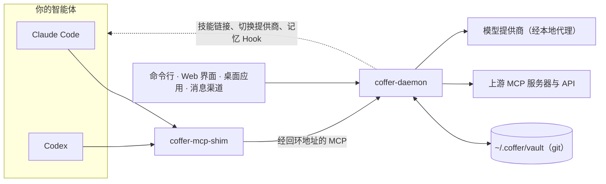

# Coffer

[English](./README.md) · **简体中文**

<p align="center">
  <a href="https://wyx-sg.github.io/Coffer/zh/"></a>
  <a href="./LICENSE"></a>
  
  
  
</p>

> 给 AI 编程智能体用的本地保险库。MCP 服务器、技能、知识、记忆和模型提供商只配一次，本机所有智能体共用。

Coffer 是运行在你机器上的一个守护进程，Claude Code 和 Codex 都连到它。智能体共用的东西——调用的工具、遵循的技能、读的笔记、用的密钥——都放在 `~/.coffer` 下一个由普通文件组成的保险库里，再由 Coffer 投递给每个智能体。你可以用 Web 界面、macOS 桌面应用、`coffer` 命令行，或者在 Telegram、SeaTalk 里管理它。没有账号，也没有云端后台：守护进程只监听 `127.0.0.1`。

📖 **文档：** <https://wyx-sg.github.io/Coffer/zh/>（[English](https://wyx-sg.github.io/Coffer/)）

## 为什么需要 Coffer

每个编程智能体都各存一份。Claude Code 从 `~/.claude.json` 读 MCP 服务器，Codex 从 `~/.codex/config.toml` 读；它们各有自己的 `skills/` 目录、自己的记忆，还各存一份你的 API 密钥。给一个加了服务器却忘了另一个，在一个目录里改进了技能而另一个没跟上，教会一个智能体的事另一个永远不知道——用的智能体越多，这些副本就偏得越远。

Coffer 用智能体之下的一层共享层取代这些副本：

- **本地优先。** 所有东西都在你机器上的 `~/.coffer` 里。云服务只以你自己选择调用的模型提供商和 MCP 服务器的身份出现。
- **智能体自己的文件仍是事实来源。** Coffer 在智能体存放的位置读取它的配置、记忆和对话记录，只写自己负责的条目——原子写入，并留一份 `.bak` 备份。卸掉 Coffer，智能体照常工作。
- **密钥只以密文存放。** 配置里只写密钥的名字，从不写值。值用你持有的主密钥做 Fernet 加密，明文不会进入保险库、日志或审计日志。
- **AI 原生。** 依赖你这台机器环境的杂事——装缺失的运行时、排查出错的服务器、把技能的上游更新和你的修改合并——都交给智能体。Coffer 写好一段讲清事实的提示词，提供两种用法：**复制提示词**交给你自己的智能体，或者**交给智能体**，打开一个预填好的对话，你按下发送才会执行。Coffer 从不写死某个包管理器的安装步骤。

## 功能

| | |
| --- | --- |
| **一个 MCP 端点** | 上游 MCP 服务器只注册一次。每个智能体的配置里只有一个 `coffer` 条目；工具以 `<server>__<tool>` 的名字出现，每个服务器开放哪些工具、哪些智能体能用都由你决定，每次调用都有记录（从不记录参数）。工具数超出预算后，`coffer__search_tools` 可以在完整目录里搜索。 |
| **自定义工具** | 导入 OpenAPI 规范，或描述一个请求，就能把任意 HTTP API 变成智能体的工具。请求由网关发出，出站时带上你的密钥。 |
| **一个技能库** | [AgentSkills](https://agentskills.io) 技能只导入一次——来自文件夹或 git 仓库——Coffer 把它们链接进每个智能体的 `skills/` 目录，保持链接正确，并跟踪上游更新。**命令行工具**页列出技能需要哪些命令，以及哪些缺失、版本太旧或没有登录。 |
| **知识** | `~/.coffer/vault/knowledge/` 下的普通 Markdown 知识集。智能体借助生成的目录，用自己的文件工具读取，通过 `coffer__write` 往里添加。不切块、不做向量化。可选的整理会把新材料合并进已有文档，并保留可撤销的历史。 |
| **记忆** | Coffer 以只读方式读取每个智能体自己的原生记忆，按项目提炼成笔记，另加一个 `global` 分区，再通过 Hook 投递回去——Claude Code 学到的，Codex 也知道。 |
| **模型提供商** | 提供商配置（接入地址和 API 密钥）只存一次，智能体一键切换过去。智能体与 Coffer 的本地模型代理通信，由代理在上游加上 API 密钥、在提供同一模型的连接之间故障切换，并统计用量和订阅额度。提供商的 API 密钥 不会写进智能体的配置。 |
| **对话与消息渠道** | 在 Web 的**对话**页驱动 Claude Code 或 Codex，或者配对一个 Telegram、SeaTalk 机器人，用手机给智能体发消息——私聊、群聊和话题都行。 |
| **保险库同步** | 保险库本身是一个 git 仓库。让你的每台机器指向同一个你自己的 git 远端，Coffer 负责拉取和推送。能干净合并的直接应用；有冲突时这一轮停下，两边都不改动，等你逐个文件选择——也可以把选择交给智能体。一轮同步要删掉保险库很大一部分时会先问你，每一轮都能回滚。密钥只以密文传输。 |
| **活动与待处理事项** | 所有改动的审计日志、MCP 调用记录和守护进程日志集中在一处；总览页按严重程度列出需要你处理的事项。 |

## 安装

**让你的智能体来装。** Coffer 面向已经在用编程智能体的人，所以最快的安装方式是把下面这段话粘贴给 Claude Code、Codex，或任何能在你机器上执行命令的智能体：

```text
按照 https://wyx-sg.github.io/Coffer/zh/start/install 在这台机器上安装 Coffer——
选择适合这台机器的安装方式（如果有适用于这个系统和架构的发布版就用发布版，
否则从源码安装）。运行任何需要 sudo 的命令或修改我的 shell 配置文件之前先问我。
装好后用 `coffer daemon status` 检查。然后对这台机器上装了的每个编程智能体
（claude-code、codex）运行 `coffer agent add <type>` 和 `coffer agent connect <type>`，
运行 connect 之前先告诉我它会改哪些配置文件。不要处理任何凭据：如果某一步需要登录，
告诉我该怎么做。
```

智能体会读安装页面，为你的机器选好安装方式并检查结果。

> **还没有正式发布的版本。** 桌面应用、一行安装脚本和发布包会随 Coffer 的第一个正式版本一起发布。在那之前，请从源码安装。

**从源码安装**（需要 Python 3.12+、git 和 Node.js；推荐安装 [ripgrep](https://github.com/BurntSushi/ripgrep)）：

```sh
git clone https://github.com/wyx-sg/Coffer.git
cd Coffer
python3.12 -m venv .venv && source .venv/bin/activate
pip install -e ./backend
(cd frontend && npm install && npm run build)   # the web UI the daemon serves
```

**从发布版安装**（Apple 芯片的 macOS，发布后可用）：从 [Releases](https://github.com/wyx-sg/Coffer/releases/latest) 下载桌面应用 `Coffer-unsigned-<triple>.dmg`，它同时带有命令行；或者用一行安装脚本：

```sh
curl -fsSL --proto '=https' --tlsv1.2 https://wyx-sg.github.io/Coffer/install.sh | sh
```

两种方式都会把 `coffer`、`coffer-daemon` 和 `coffer-mcp-shim` 放进 `~/.coffer/bin`。[安装指南](https://wyx-sg.github.io/Coffer/zh/start/install)介绍了所有安装方式、macOS 上未签名应用需要的那一步、升级和卸载。

## 快速上手

```sh
coffer open                          # start the daemon and open the web UI, signed in
coffer scan                          # list the agents found on this machine
coffer agent add claude-code         # register Claude Code (Codex: codex)
coffer agent connect claude-code     # add Coffer's one MCP entry to its config

coffer mcp add filesystem --stdio "npx -y @modelcontextprotocol/server-filesystem /tmp"
coffer mcp test filesystem           # check it answers and list its tools
```

新开一个 Claude Code 会话，就能看到 `filesystem__read_file` 等工具。需要守护进程的命令都会自动启动它。[15 分钟快速上手](https://wyx-sg.github.io/Coffer/zh/start/quickstart)接着介绍如何投递技能；这些事在 Web 界面里也都能做，而且 Coffer 写入之前会让你逐一检查每处文件改动。

## 工作原理



- **`coffer-daemon`** 保存全部状态，在 `127.0.0.1`（默认端口 8000）上提供 MCP 端点、管理 API 和 Web 界面。
- **`coffer-mcp-shim`** 是每个智能体当作普通 stdio MCP 服务器启动的程序。它找到守护进程（必要时启动一个），然后转发会话。
- **保险库**（`~/.coffer/vault`）是一个由普通文件组成的 git 仓库：每个资源一个 JSON 文件、技能文件夹、知识集，以及密文形式的密钥。任何文件都可以手工编辑，每次改动都有历史。只属于本机的设置和历史数据库（`runs.db`）放在它旁边。

[架构总览](https://wyx-sg.github.io/Coffer/zh/architecture/)逐一介绍各个部分，以及这样设计的原因。

## 仓库结构

```
backend/        Python daemon, CLI and MCP shim (domain / application / infrastructure / surfaces)
frontend/       React + TypeScript + Vite web UI, served by the daemon
desktop/        Tauri macOS shell: Dock icon, menu-bar tray, bundled binaries
docs-site/      VitePress documentation site, English and Chinese (docs-site/zh/)
openspec/       OpenSpec capability specs and changes
docs/           Architectural decision records and research
e2e/  evals/    Playwright suites; the AI eval harness
scripts/        Repository gates and maintenance
.agents/        Conventions for contributors and coding agents
```

## 参与贡献

Coffer 以规格优先的方式开发，使用 [OpenSpec](https://github.com/Fission-AI/OpenSpec)，大部分代码由 AI 编程智能体编写；[`AGENTS.md`](./AGENTS.md) 是操作手册。`make install` 搭好开发环境，`make dev` 同时运行守护进程和 Vite 开发服务器，`make verify` 是每个改动都必须通过的那道门禁。从[参与贡献](https://wyx-sg.github.io/Coffer/zh/contributing/)开始读。安全问题请按[安全策略](./SECURITY.md)私下报告。

## 许可证

[MIT](./LICENSE)
