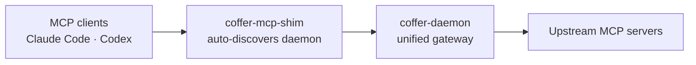
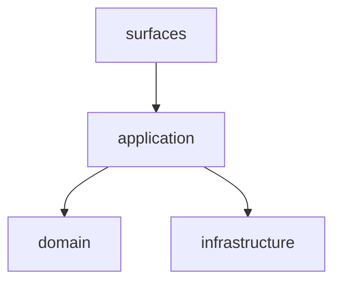

# Coffer Docs Site Implementation Plan

> **For agentic workers:** REQUIRED SUB-SKILL: Use superpowers:subagent-driven-development (recommended) or superpowers:executing-plans to implement this plan task-by-task. Steps use checkbox (`- [ ]`) syntax for tracking.

**Goal:** Build a public, fully bilingual (EN/中文) VitePress documentation portal under `docs-site/` that promotes Coffer and renders all specs/ADRs/architecture/conventions on-site, deployed to GitHub Pages.

**Architecture:** A self-contained VitePress project in `docs-site/`. An authored "receptor layer" (Home, Guide, Architecture overview, Contributing) is hand-written bilingual. A "reference layer" (specs, ADRs, project memory, conventions) is copied in at build time by `scripts/sync-reference.mjs` from the repo's canonical `.md` / `.zh.md` files — single source of truth, no drift. The site reuses spec 002's "Coffer warm" visual language via a theme override. CI builds and deploys via `.github/workflows/pages.yml`.

**Tech Stack:** VitePress 1.x, `vitepress-plugin-mermaid`, Node 22, Node built-in test runner (`node:test`), GitHub Actions Pages.

The authoritative design is [`docs-site/DESIGN.md`](./DESIGN.md). If this plan and the design disagree, fix the design first.

---

## File structure (what gets created)

Everything lives under `docs-site/` except the deploy workflow (GitHub reads workflows only from `.github/workflows/`).

```
docs-site/
  package.json                     # T1  vitepress + mermaid deps, scripts
  .gitignore                       # T1  ignore generated reference/ + dist
  .vitepress/
    config.mts                     # T4  i18n locales, nav/sidebar, search, mermaid, base
    theme/
      index.ts                     # T2  extends default theme, imports custom.css
      custom.css                   # T2  "Coffer warm" CSS variable overrides
  scripts/
    sync-reference.mjs             # T3  copy canonical .md/.zh.md → reference trees
    sync-reference.test.mjs        # T3  node:test unit tests for the sync logic
  index.md                         # T5  EN home (hero A + features + how-it-works + quickstart)
  zh/index.md                      # T5  中文 home
  guide/*.md  zh/guide/*.md        # T6  authored bilingual guide
  architecture/*.md  zh/architecture/*.md   # T7  authored bilingual architecture overview
  contributing/*.md  zh/contributing/*.md   # T8  authored bilingual contributing
  reference/        (generated, git-ignored)        # synced EN
  zh/reference/     (generated, git-ignored)        # synced 中文
.github/workflows/pages.yml        # T9  build + deploy + PR build-check
README.md / README.zh.md           # T10 add a "Documentation site" link
```

---

## Task 1: Scaffold the VitePress project

**Files:**

- Create: `docs-site/package.json`
- Create: `docs-site/.gitignore`
- Create: `docs-site/index.md` (temporary placeholder; replaced in T5)

- [ ] **Step 1: Create `docs-site/package.json`**

```json
{
  "name": "coffer-docs-site",
  "version": "0.0.0",
  "private": true,
  "type": "module",
  "scripts": {
    "sync": "node scripts/sync-reference.mjs",
    "predev": "npm run sync",
    "dev": "vitepress dev",
    "prebuild": "npm run sync",
    "build": "vitepress build",
    "preview": "vitepress preview",
    "test": "node --test"
  },
  "devDependencies": {
    "vitepress": "^1.6.3",
    "vitepress-plugin-mermaid": "^2.0.17",
    "mermaid": "^11.4.1"
  }
}
```

- [ ] **Step 2: Create `docs-site/.gitignore`**

```gitignore
# VitePress build output
.vitepress/dist/
.vitepress/cache/
node_modules/

# Reference layer is generated by scripts/sync-reference.mjs — never commit it
reference/
zh/reference/
```

- [ ] **Step 3: Create a temporary `docs-site/index.md`** (so the first build has a page)

```markdown
# Coffer

Placeholder home — replaced in Task 5.
```

- [ ] **Step 4: Install dependencies**

Run: `cd docs-site && npm install`
Expected: `node_modules/` populated, `package-lock.json` created, no errors.

- [ ] **Step 5: Verify a bare build works** (config comes in T4; VitePress builds with defaults first)

Run: `cd docs-site && npx vitepress build`
Expected: build completes; `docs-site/.vitepress/dist/index.html` exists.

- [ ] **Step 6: Commit**

```bash
git add docs-site/package.json docs-site/package-lock.json docs-site/.gitignore docs-site/index.md
git commit -m "build(docs-site): scaffold VitePress project"
```

---

## Task 2: "Coffer warm" theme override

**Files:**

- Create: `docs-site/.vitepress/theme/index.ts`
- Create: `docs-site/.vitepress/theme/custom.css`

Tokens come from `frontend/src/index.css` (spec 002). VitePress exposes themeable CSS variables (`--vp-c-brand-*`, `--vp-c-bg`, `--vp-c-text-*`, font vars); we remap them to the warm palette.

- [ ] **Step 1: Create `docs-site/.vitepress/theme/index.ts`**

```ts
import DefaultTheme from "vitepress/theme";
import "./custom.css";

export default DefaultTheme;
```

- [ ] **Step 2: Create `docs-site/.vitepress/theme/custom.css`**

```css
/* "Coffer warm" — palette + type from spec 002 (frontend/src/index.css).
   Light-only by design (no dark-mode block). */
@import url("https://fonts.googleapis.com/css2?family=Source+Serif+4:opsz,wght@8..60,400;8..60,600;8..60,700&family=Inter:wght@400;500;600&display=swap");

:root {
  /* brand = clay accent #C96442 */
  --vp-c-brand-1: #b9512f;
  --vp-c-brand-2: #c96442;
  --vp-c-brand-3: #d4795b;
  --vp-c-brand-soft: #f7e9e2;

  /* warm paper surfaces */
  --vp-c-bg: #faf9f5;
  --vp-c-bg-alt: #f4f1e9;
  --vp-c-bg-soft: #f0ebe0;
  --vp-c-bg-elv: #ffffff;

  /* ink + warm-grey text */
  --vp-c-text-1: #1f1b17;
  --vp-c-text-2: #6b645a;
  --vp-c-text-3: #9a9389;

  /* borders */
  --vp-c-border: #e8e4da;
  --vp-c-divider: #e8e4da;
  --vp-c-gutter: #e8e4da;

  /* fonts */
  --vp-font-family-base: "Inter", ui-sans-serif, system-ui, -apple-system,
    sans-serif;
  --vp-font-family-mono: "SFMono-Regular", Menlo, Consolas, monospace;

  /* primary button = clay */
  --vp-button-brand-bg: #c96442;
  --vp-button-brand-hover-bg: #b9512f;
  --vp-button-brand-border: transparent;
  --vp-button-brand-text: #faf9f5;

  /* home hero (Direction A) */
  --vp-home-hero-name-color: #1f1b17;
}

/* serif headings, matching the product */
:root {
  --vp-font-family-heading: "Source Serif 4", Georgia, serif;
}
.VPDoc h1,
.VPDoc h2,
.VPDoc h3,
.VPHero .name,
.VPHero .text {
  font-family: var(--vp-font-family-heading);
  letter-spacing: -0.02em;
}

/* Direction A: restrained, editorial hero */
.VPHero .name {
  font-weight: 700;
}
.VPHero .tagline {
  color: var(--vp-c-text-2);
}
```

- [ ] **Step 3: Verify the theme loads (after T4 config exists, this is re-checked).** For now, lint the CSS by building:

Run: `cd docs-site && npx vitepress build`
Expected: build succeeds (the theme dir is auto-detected); no CSS parse errors in output.

- [ ] **Step 4: Commit**

```bash
git add docs-site/.vitepress/theme/
git commit -m "feat(docs-site): Coffer-warm theme override"
```

---

## Task 3: Reference sync script (TDD)

This is the only real logic in the project, so it is test-driven. It walks the four canonical source areas, copies `.md` → EN tree and `.zh.md` → 中文 tree (dropping the `.zh`), excludes `tasks.md`, rewrites repo-relative links to on-site routes (or GitHub URLs for non-synced targets), and warns when an EN doc has no ZH sibling (copying EN as a fallback).

**Files:**

- Create: `docs-site/scripts/sync-reference.mjs`
- Test: `docs-site/scripts/sync-reference.test.mjs`

- [ ] **Step 1: Write the failing test** — `docs-site/scripts/sync-reference.test.mjs`

```js
import { test } from "node:test";
import assert from "node:assert/strict";
import { classifyFile, rewriteLinks, GH_BLOB } from "./sync-reference.mjs";

test("classifyFile: English .md goes to the EN reference tree", () => {
  const r = classifyFile("specs/001-mcp-gateway/spec.md");
  assert.deepEqual(r, {
    locale: "en",
    dest: "reference/specs/001-mcp-gateway/spec.md",
  });
});

test("classifyFile: .zh.md goes to the zh tree with .zh stripped", () => {
  const r = classifyFile(
    "docs/decisions/ADR-002-code-layout-layer-first.zh.md",
  );
  assert.deepEqual(r, {
    locale: "zh",
    dest: "zh/reference/adr/ADR-002-code-layout-layer-first.md",
  });
});

test("classifyFile: tasks.md is excluded", () => {
  assert.equal(classifyFile("specs/001-mcp-gateway/tasks.md"), null);
});

test("classifyFile: files outside the synced areas are excluded", () => {
  assert.equal(classifyFile("backend/coffer/domain/resource.py"), null);
  assert.equal(classifyFile("README.md"), null);
});

test("classifyFile: a directory README.md becomes index.md", () => {
  assert.deepEqual(classifyFile("docs/decisions/README.md"), {
    locale: "en",
    dest: "reference/adr/index.md",
  });
  assert.deepEqual(classifyFile("docs/decisions/README.zh.md"), {
    locale: "zh",
    dest: "zh/reference/adr/index.md",
  });
});

test("rewriteLinks: cross-doc .md link → site route (extensionless)", () => {
  const src = "specs/001-mcp-gateway/spec.md";
  const out = rewriteLinks("See [data model](./data-model.md).", src);
  assert.equal(
    out,
    "See [data model](/reference/specs/001-mcp-gateway/data-model).",
  );
});

test("rewriteLinks: link to an ADR from architecture → adr route", () => {
  const src = ".specify/memory/architecture.md";
  const out = rewriteLinks(
    "[ADR-002](../../docs/decisions/ADR-002-code-layout-layer-first.md)",
    src,
  );
  assert.equal(
    out,
    "[ADR-002](/reference/adr/ADR-002-code-layout-layer-first)",
  );
});

test("rewriteLinks: anchors and external links pass through unchanged", () => {
  const src = "specs/001-mcp-gateway/spec.md";
  const input =
    "[x](#section) and [y](https://example.com) and [z](mailto:a@b.c)";
  assert.equal(rewriteLinks(input, src), input);
});

test("rewriteLinks: non-synced repo path → GitHub blob URL", () => {
  const src = ".specify/memory/architecture.md";
  const out = rewriteLinks("[code](../../backend/pyproject.toml)", src);
  assert.equal(out, `[code](${GH_BLOB}/backend/pyproject.toml)`);
});

test("rewriteLinks: excluded tasks.md target → GitHub blob URL", () => {
  const src = "specs/001-mcp-gateway/spec.md";
  const out = rewriteLinks("[tasks](./tasks.md)", src);
  assert.equal(out, `[tasks](${GH_BLOB}/specs/001-mcp-gateway/tasks.md)`);
});
```

- [ ] **Step 2: Run the test, verify it fails**

Run: `cd docs-site && node --test scripts/sync-reference.test.mjs`
Expected: FAIL — `Cannot find module './sync-reference.mjs'` / exports undefined.

- [ ] **Step 3: Implement `docs-site/scripts/sync-reference.mjs`**

```js
import { fileURLToPath } from "node:url";
import { dirname, resolve, relative, join, posix } from "node:path";
import {
  readdirSync,
  statSync,
  mkdirSync,
  copyFileSync,
  readFileSync,
  writeFileSync,
  rmSync,
} from "node:fs";

const __dirname = dirname(fileURLToPath(import.meta.url));
export const REPO_ROOT = resolve(__dirname, "..", "..");
export const GH_BLOB = "https://github.com/wyx-sg/Coffer/blob/main";

// repo-relative source dir -> reference area slug
const AREAS = [
  { src: "specs", area: "specs" },
  { src: "docs/decisions", area: "adr" },
  { src: ".specify/memory", area: "project" },
  { src: "agents", area: "conventions" },
];
const EXCLUDED = new Set(["tasks.md", "tasks.zh.md"]);

// Normalise a repo path to posix separators for matching/output.
const toPosix = (p) => p.split("\\").join("/");

// Which area (if any) owns this repo-relative path?
function areaOf(repoPath) {
  const p = toPosix(repoPath);
  for (const { src, area } of AREAS) {
    if (p === src || p.startsWith(src + "/"))
      return { src, area, rest: p.slice(src.length + 1) };
  }
  return null;
}

// Decide destination for a source file, or null if it should be skipped.
export function classifyFile(repoPath) {
  const p = toPosix(repoPath);
  if (!p.endsWith(".md")) return null;
  const base = p.slice(p.lastIndexOf("/") + 1);
  if (EXCLUDED.has(base)) return null;
  const a = areaOf(p);
  if (!a) return null;
  const isZh = p.endsWith(".zh.md");
  let restNoZh = isZh ? a.rest.replace(/\.zh\.md$/, ".md") : a.rest;
  restNoZh = restNoZh.replace(/(^|\/)README\.md$/, "$1index.md"); // dir index → index.md
  return isZh
    ? { locale: "zh", dest: posix.join("zh/reference", a.area, restNoZh) }
    : { locale: "en", dest: posix.join("reference", a.area, restNoZh) };
}

// Map a repo-relative .md target to its on-site route (extensionless), or null.
function routeForTarget(repoPath) {
  const c = classifyFile(repoPath);
  if (!c) return null;
  return "/" + c.dest.replace(/\.md$/, "").replace(/\/index$/, "/");
}

// Rewrite markdown links in `content` whose source file is `srcRepoPath`.
export function rewriteLinks(content, srcRepoPath) {
  const srcDir = posix.dirname(toPosix(srcRepoPath));
  return content.replace(/\]\(([^)]+)\)/g, (whole, target) => {
    const [path, ...rest] = target.split("#");
    const hash = rest.length ? "#" + rest.join("#") : "";
    if (path === "" || /^(https?:|mailto:|\/)/.test(path)) return whole; // external / anchor / already-rooted
    const repoTarget = toPosix(posix.normalize(posix.join(srcDir, path)));
    if (repoTarget.endsWith(".md")) {
      const route = routeForTarget(repoTarget);
      if (route) return `](${route}${hash})`;
    }
    return `](${GH_BLOB}/${repoTarget}${hash})`; // non-synced or non-md → GitHub
  });
}

// ---- side-effecting build step (not imported by tests) ----
function walk(absDir, repoDir, out = []) {
  for (const name of readdirSync(absDir)) {
    const abs = join(absDir, name);
    const rep = posix.join(repoDir, name);
    if (statSync(abs).isDirectory()) walk(abs, rep, out);
    else out.push(rep);
  }
  return out;
}

function run() {
  for (const dir of ["reference", "zh/reference"]) {
    rmSync(resolve(__dirname, "..", dir), { recursive: true, force: true });
  }
  const seenEn = new Set();
  const seenZh = new Set();
  for (const { src } of AREAS) {
    const absSrc = resolve(REPO_ROOT, src);
    try {
      statSync(absSrc);
    } catch {
      continue;
    }
    for (const repoPath of walk(absSrc, src)) {
      const c = classifyFile(repoPath);
      if (!c) continue;
      const content = rewriteLinks(
        readFileSync(resolve(REPO_ROOT, repoPath), "utf8"),
        repoPath,
      );
      const destAbs = resolve(__dirname, "..", c.dest);
      mkdirSync(dirname(destAbs), { recursive: true });
      writeFileSync(destAbs, content);
      (c.locale === "zh" ? seenZh : seenEn).add(c.dest.replace(/^zh\//, ""));
    }
  }
  // Fallback: EN doc with no ZH sibling → copy EN into the zh tree, warn.
  for (const enDest of seenEn) {
    const zhKey = enDest;
    if (!seenZh.has(zhKey)) {
      const from = resolve(__dirname, "..", enDest);
      const to = resolve(__dirname, "..", "zh", enDest);
      mkdirSync(dirname(to), { recursive: true });
      copyFileSync(from, to);
      console.warn(`[sync] no zh translation, using EN fallback: ${enDest}`);
    }
  }
  console.log("[sync] reference layer synced");
}

// Run only when invoked directly (not when imported by the test file).
if (
  process.argv[1] &&
  resolve(process.argv[1]) === fileURLToPath(import.meta.url)
)
  run();
```

- [ ] **Step 4: Run the test, verify it passes**

Run: `cd docs-site && node --test scripts/sync-reference.test.mjs`
Expected: PASS — all 10 tests green.

- [ ] **Step 5: Run the sync against the real repo and eyeball output**

Run: `cd docs-site && npm run sync && ls reference/specs reference/adr zh/reference/specs`
Expected: `reference/specs/001-mcp-gateway/spec.md` etc. exist; `tasks.md` absent; any EN-only doc prints a `[sync] no zh translation` warning.

- [ ] **Step 6: Commit**

```bash
git add docs-site/scripts/
git commit -m "feat(docs-site): build-time reference sync from canonical docs"
```

---

## Task 4: VitePress i18n config (nav, sidebar, search, mermaid)

**Files:**

- Create: `docs-site/.vitepress/config.mts`

- [ ] **Step 1: Create `docs-site/.vitepress/config.mts`**

```ts
import { defineConfig } from "vitepress";
import { withMermaid } from "vitepress-plugin-mermaid";

const enSidebar = [
  {
    text: "Guide",
    items: [
      { text: "Introduction", link: "/guide/introduction" },
      { text: "Getting Started", link: "/guide/getting-started" },
      { text: "Register an MCP server", link: "/guide/register-server" },
      { text: "Connect a client", link: "/guide/connect-client" },
      { text: "Concepts", link: "/guide/concepts" },
    ],
  },
  {
    text: "Architecture",
    items: [
      { text: "Overview", link: "/architecture/overview" },
      { text: "Layering & boundaries", link: "/architecture/layering" },
      { text: "Surfaces", link: "/architecture/surfaces" },
      { text: "Persistence", link: "/architecture/persistence" },
      { text: "Cross-cutting concerns", link: "/architecture/cross-cutting" },
    ],
  },
  {
    text: "Reference",
    items: [
      { text: "Specs", link: "/reference/specs/001-mcp-gateway/spec" },
      { text: "ADRs", link: "/reference/adr/" },
      { text: "Constitution", link: "/reference/project/constitution" },
      { text: "Roadmap", link: "/reference/project/roadmap" },
      { text: "Conventions", link: "/reference/conventions/workflow" },
    ],
  },
  {
    text: "Contributing",
    items: [
      { text: "Contributing", link: "/contributing/" },
      { text: "Security", link: "/contributing/security" },
    ],
  },
];

const zhSidebar = [
  {
    text: "指南",
    items: [
      { text: "介绍", link: "/zh/guide/introduction" },
      { text: "快速开始", link: "/zh/guide/getting-started" },
      { text: "注册 MCP server", link: "/zh/guide/register-server" },
      { text: "接入客户端", link: "/zh/guide/connect-client" },
      { text: "核心概念", link: "/zh/guide/concepts" },
    ],
  },
  {
    text: "架构",
    items: [
      { text: "架构总览", link: "/zh/architecture/overview" },
      { text: "分层与边界", link: "/zh/architecture/layering" },
      { text: "Surfaces", link: "/zh/architecture/surfaces" },
      { text: "持久化", link: "/zh/architecture/persistence" },
      { text: "横切关注点", link: "/zh/architecture/cross-cutting" },
    ],
  },
  {
    text: "参考",
    items: [
      { text: "Specs", link: "/zh/reference/specs/001-mcp-gateway/spec" },
      { text: "ADRs", link: "/zh/reference/adr/" },
      { text: "项目宪法", link: "/zh/reference/project/constitution" },
      { text: "Roadmap", link: "/zh/reference/project/roadmap" },
      { text: "工程规范", link: "/zh/reference/conventions/workflow" },
    ],
  },
  {
    text: "参与贡献",
    items: [
      { text: "贡献指南", link: "/zh/contributing/" },
      { text: "安全", link: "/zh/contributing/security" },
    ],
  },
];

export default withMermaid(
  defineConfig({
    title: "Coffer",
    description:
      "Local-first AI agent vault — manage all your MCP servers from one place.",
    base: "/Coffer/",
    cleanUrls: true,
    lastUpdated: true,
    ignoreDeadLinks: true, // synced reference may link to GitHub blobs; do not fail the build
    themeConfig: {
      search: { provider: "local" },
      socialLinks: [
        { icon: "github", link: "https://github.com/wyx-sg/Coffer" },
      ],
    },
    locales: {
      root: {
        label: "English",
        lang: "en",
        themeConfig: {
          nav: [
            { text: "Guide", link: "/guide/introduction" },
            { text: "Architecture", link: "/architecture/overview" },
            {
              text: "Reference",
              link: "/reference/specs/001-mcp-gateway/spec",
            },
            { text: "Contributing", link: "/contributing/" },
          ],
          sidebar: enSidebar,
        },
      },
      zh: {
        label: "中文",
        lang: "zh-Hans",
        link: "/zh/",
        themeConfig: {
          nav: [
            { text: "指南", link: "/zh/guide/introduction" },
            { text: "架构", link: "/zh/architecture/overview" },
            { text: "参考", link: "/zh/reference/specs/001-mcp-gateway/spec" },
            { text: "参与贡献", link: "/zh/contributing/" },
          ],
          sidebar: zhSidebar,
        },
      },
    },
  }),
);
```

- [ ] **Step 2: Sync + build to verify config + locales resolve**

Run: `cd docs-site && npm run build`
Expected: build succeeds; `dist/index.html` and `dist/zh/index.html` exist; language switcher present.

- [ ] **Step 3: Commit**

```bash
git add docs-site/.vitepress/config.mts
git commit -m "feat(docs-site): bilingual VitePress config (nav, sidebar, search, mermaid)"
```

> **Note on `ignoreDeadLinks`:** the reference layer is generated, so VitePress
> can't statically verify every cross-link. We rely on the sync script's
> rewriting + GitHub fallback instead of VitePress dead-link checking.

---

## Task 5: Bilingual home page (Direction A)

**Files:**

- Modify: `docs-site/index.md` (replace the T1 placeholder)
- Create: `docs-site/zh/index.md`

Direction A = restrained editorial hero, then features grid, then a Mermaid "how it works" diagram, then a quickstart teaser. VitePress `layout: home` renders `hero` + `features` from frontmatter; markdown after the frontmatter renders below them.

- [ ] **Step 1: Write `docs-site/index.md`**

````markdown
---
layout: home
hero:
  name: Coffer
  text: Local-first AI agent vault
  tagline: Manage all your MCP servers from one place. Configure once; every client sees the same tools.
  actions:
    - theme: brand
      text: Get started
      link: /guide/getting-started
    - theme: alt
      text: View on GitHub
      link: https://github.com/wyx-sg/Coffer
features:
  - title: Local-first
    details: All state lives on your machine — no cloud accounts, no vendor lock-in.
  - title: One unified surface
    details: Aggregate upstream MCP servers and re-expose them namespaced as <server>__<tool>.
  - title: Configure once
    details: Claude Code, Codex, and every other MCP client see exactly the same tools.
  - title: Auto-discovering shim
    details: coffer-mcp-shim finds (or spawns) the daemon — no port or token wiring.
  - title: CLI · Web · Desktop
    details: Drive the gateway from a terminal, a web UI, or the desktop app.
---

## How it works


````

## Quickstart

```bash
coffer mcp add filesystem --stdio "npx -y @modelcontextprotocol/server-filesystem /tmp"
claude mcp add coffer coffer-mcp-shim
```

[Read the full guide →](/guide/getting-started)

````

- [ ] **Step 2: Write `docs-site/zh/index.md`** (same structure, 中文 copy)

```markdown
---
layout: home
hero:
  name: Coffer
  text: 本地优先的 AI agent 保险库
  tagline: 一个地方统一管理所有 MCP 服务器。配置一次,每个客户端看到的工具完全一致。
  actions:
    - theme: brand
      text: 快速开始
      link: /zh/guide/getting-started
    - theme: alt
      text: GitHub
      link: https://github.com/wyx-sg/Coffer
features:
  - title: 本地优先
    details: 所有状态都在你自己的机器上 —— 没有云账号,没有厂商锁定。
  - title: 统一接口
    details: 聚合上游 MCP 服务器,以 <server>__<tool> 带命名空间重新暴露。
  - title: 配置一次,处处可用
    details: Claude Code、Codex 及其他 MCP 客户端看到的工具完全一致。
  - title: 自动发现 shim
    details: coffer-mcp-shim 自动发现(必要时拉起)守护进程,无需配置端口或 token。
  - title: CLI · Web · 桌面端
    details: 用终端、Web UI 或桌面应用来驱动网关。
---

## 工作原理

```mermaid
flowchart LR
  C["MCP 客户端<br/>Claude Code · Codex"] --> S["coffer-mcp-shim<br/>自动发现守护进程"]
  S --> D["coffer-daemon<br/>统一网关"]
  D --> U["上游 MCP 服务器"]
````

## 快速上手

```bash
coffer mcp add filesystem --stdio "npx -y @modelcontextprotocol/server-filesystem /tmp"
claude mcp add coffer coffer-mcp-shim
```

[阅读完整指南 →](/zh/guide/getting-started)

````

- [ ] **Step 3: Build and visually verify the home pages**

Run: `cd docs-site && npm run build && npx vitepress preview --port 4173`
Expected: open `http://localhost:4173/Coffer/` and `/Coffer/zh/` — warm hero, clay "Get started" button, 5 feature cards, a rendered Mermaid flow diagram, quickstart code block. Stop the preview with Ctrl-C.

- [ ] **Step 4: Commit**

```bash
git add docs-site/index.md docs-site/zh/index.md
git commit -m "feat(docs-site): bilingual home page (hero + features + how-it-works)"
````

---

## Task 6: Guide pages (authored, bilingual)

**Files (create each in EN + 中文):**

- `docs-site/guide/introduction.md` · `docs-site/zh/guide/introduction.md`
- `docs-site/guide/getting-started.md` · `docs-site/zh/guide/getting-started.md`
- `docs-site/guide/register-server.md` · `docs-site/zh/guide/register-server.md`
- `docs-site/guide/connect-client.md` · `docs-site/zh/guide/connect-client.md`
- `docs-site/guide/concepts.md` · `docs-site/zh/guide/concepts.md`

**Content sources (adapt, do not invent):**

- `introduction` — README.md lines 3–5 (one-liner + paragraph) + the "why" (local-first, configure-once). 中文 from README.zh.md lines 5–7.
- `getting-started` — README.md "Install" (lines 11–20). 中文 from README.zh.md "安装" (lines 13–22).
- `register-server` — README.md "Quickstart" (lines 26–35). 中文 from README.zh.md "快速上手" (28–36).
- `connect-client` — README.md "Connect to an MCP client" (lines 40–59), both Claude Code and Codex blocks. 中文 from README.zh.md (42–61).
- `concepts` — define **resource kind**, **gateway**, **shim**, **local-first** in 1–2 paragraphs each, sourced from `.specify/memory/architecture.md` (Resource framework, Surfaces, Processes sections) and `constitution.md` Principle I.

- [ ] **Step 1: Write all five EN guide pages** using the sources above. Each page: an `# H1` title, short intro sentence, then the adapted content. Use fenced `bash`/`toml` code blocks verbatim from the README so commands stay copy-pasteable.

- [ ] **Step 2: Write all five 中文 guide pages** mirroring the EN structure, copy adapted from the `.zh.md` sources.

- [ ] **Step 3: Build and verify all guide routes resolve**

Run: `cd docs-site && npm run build`
Expected: build succeeds; `dist/guide/getting-started.html` and `dist/zh/guide/getting-started.html` exist; sidebar "Guide" group links all resolve (no warnings about missing pages for the guide section).

- [ ] **Step 4: Commit**

```bash
git add docs-site/guide docs-site/zh/guide
git commit -m "docs(docs-site): bilingual guide pages"
```

---

## Task 7: Architecture overview pages (authored, bilingual)

**Files (EN + 中文):**

- `docs-site/architecture/overview.md` · `…/zh/architecture/overview.md`
- `docs-site/architecture/layering.md` · `…/zh/…`
- `docs-site/architecture/surfaces.md` · `…/zh/…`
- `docs-site/architecture/persistence.md` · `…/zh/…`
- `docs-site/architecture/cross-cutting.md` · `…/zh/…`

**Content sources:** `.specify/memory/architecture.md` (and `architecture.zh.md`) section-by-section — Layering, Resource framework, Code layout, Surfaces, Processes, Persistence, Cross-cutting concerns. Convert the ASCII layering diagram into Mermaid on the `overview` page; link out to the full canonical doc at `/reference/project/architecture`.

- [ ] **Step 1: Write `architecture/overview.md`** with a Mermaid layering diagram:

````markdown
# Architecture overview

Coffer is layered: `surfaces → application → domain`, with `infrastructure`
wired in at composition time.


````

For the canonical, always-current detail see the [Architecture reference](/reference/project/architecture).

````

- [ ] **Step 2: Write the remaining four EN architecture pages** (layering, surfaces, persistence, cross-cutting), each summarising the matching section of `architecture.md` in 1–3 paragraphs + the relevant table, and linking to the canonical reference page.

- [ ] **Step 3: Write all five 中文 architecture pages** from `architecture.zh.md`.

- [ ] **Step 4: Build and verify**

Run: `cd docs-site && npm run build`
Expected: build succeeds; Mermaid diagram renders on `dist/architecture/overview.html`; all sidebar "Architecture" links resolve.

- [ ] **Step 5: Commit**

```bash
git add docs-site/architecture docs-site/zh/architecture
git commit -m "docs(docs-site): bilingual architecture overview"
````

---

## Task 8: Contributing pages (authored, bilingual)

**Files (EN + 中文):**

- `docs-site/contributing/index.md` · `docs-site/zh/contributing/index.md`
- `docs-site/contributing/security.md` · `docs-site/zh/contributing/security.md`

**Content sources:** root `CONTRIBUTING.md`/`.zh.md` and `SECURITY.md`/`.zh.md`. The contributing index summarises Conventional Commits + spec-driven flow and links to the conventions reference (`/reference/conventions/workflow`, `/reference/conventions/sdd`).

- [ ] **Step 1: Write `contributing/index.md` and `contributing/security.md`** (EN), adapted from `CONTRIBUTING.md` and `SECURITY.md`.

- [ ] **Step 2: Write the two 中文 pages** from `CONTRIBUTING.zh.md` and `SECURITY.zh.md`.

- [ ] **Step 3: Build and verify**

Run: `cd docs-site && npm run build`
Expected: build succeeds; `dist/contributing/index.html` and zh variant exist; sidebar "Contributing" links resolve.

- [ ] **Step 4: Commit**

```bash
git add docs-site/contributing docs-site/zh/contributing
git commit -m "docs(docs-site): bilingual contributing pages"
```

---

## Task 9: GitHub Pages deploy workflow

**Files:**

- Create: `.github/workflows/pages.yml`

(GitHub reads workflows only from `.github/workflows/` — this is the one file outside `docs-site/`.)

- [ ] **Step 1: Create `.github/workflows/pages.yml`**

```yaml
name: Docs site

on:
  push:
    branches: [main]
    paths:
      - "docs-site/**"
      - "specs/**"
      - "docs/decisions/**"
      - ".specify/memory/**"
      - "agents/**"
      - ".github/workflows/pages.yml"
  pull_request:
    paths:
      - "docs-site/**"
      - "specs/**"
      - "docs/decisions/**"
      - ".specify/memory/**"
      - "agents/**"
      - ".github/workflows/pages.yml"
  workflow_dispatch:

permissions:
  contents: read

concurrency:
  group: pages-${{ github.ref }}
  cancel-in-progress: true

jobs:
  build:
    runs-on: ubuntu-latest
    steps:
      - uses: actions/checkout@v4
      - uses: actions/setup-node@v4
        with:
          node-version: 22
          cache: npm
          cache-dependency-path: docs-site/package-lock.json
      - run: npm ci
        working-directory: docs-site
      - run: npm test
        working-directory: docs-site
      - run: npm run build
        working-directory: docs-site
      - uses: actions/upload-pages-artifact@v3
        with:
          path: docs-site/.vitepress/dist

  deploy:
    # Deploy only from main; PRs run build (above) as a check and stop here.
    if: github.ref == 'refs/heads/main' && github.event_name != 'pull_request'
    needs: build
    runs-on: ubuntu-latest
    permissions:
      pages: write
      id-token: write
    environment:
      name: github-pages
      url: ${{ steps.deploy.outputs.page_url }}
    steps:
      - id: deploy
        uses: actions/deploy-pages@v4
```

- [ ] **Step 2: Validate the workflow YAML locally**

Run: `cd /Users/xing/Coffer/.claude/worktrees/feature+github-pages && python3 -c "import yaml,sys; yaml.safe_load(open('.github/workflows/pages.yml')); print('yaml ok')"`
Expected: `yaml ok`

- [ ] **Step 3: Commit**

```bash
git add .github/workflows/pages.yml
git commit -m "ci(docs-site): build + deploy to GitHub Pages"
```

- [ ] **Step 4: One-time manual setup (record for whoever merges)** — in GitHub repo **Settings → Pages → Build and deployment → Source = "GitHub Actions"**. This cannot be set from code; without it the deploy job fails. Note it in the PR description.

---

## Task 10: Wire the site into the repo

**Files:**

- Modify: `README.md` (add a documentation-site link near the top)
- Modify: `README.zh.md` (same, 中文)

- [ ] **Step 1: Add a site link to `README.md`** under the tagline (line ~5):

```markdown
📖 **Documentation site:** https://wyx-sg.github.io/Coffer/
```

- [ ] **Step 2: Add the equivalent line to `README.zh.md`:**

```markdown
📖 **文档站点:** https://wyx-sg.github.io/Coffer/
```

- [ ] **Step 3: Commit**

```bash
git add README.md README.zh.md
git commit -m "docs: link the documentation site from the READMEs"
```

---

## Task 11: Final verification

- [ ] **Step 1: Clean build from scratch**

Run: `cd docs-site && rm -rf reference zh/reference .vitepress/dist .vitepress/cache && npm ci && npm test && npm run build`
Expected: tests pass; build succeeds; `dist/index.html`, `dist/zh/index.html`, `dist/reference/specs/001-mcp-gateway/spec.html`, `dist/zh/reference/adr/ADR-001-resource-framework-upfront.html` all exist.

- [ ] **Step 2: Preview and click through**

Run: `cd docs-site && npx vitepress preview --port 4173`
Expected: at `http://localhost:4173/Coffer/` — home, language switch to `/zh/`, search returns results from reference pages, a spec page and an ADR page render in both languages, Mermaid diagrams render. Stop with Ctrl-C.

- [ ] **Step 3: Confirm git status is clean and the generated trees are NOT tracked**

Run: `cd /Users/xing/Coffer/.claude/worktrees/feature+github-pages && git status --short`
Expected: no `docs-site/reference/` or `docs-site/zh/reference/` entries (they are git-ignored); working tree otherwise clean.

---

## Self-review (done while writing)

- **Spec coverage:** Home/hero A (T5), features+how-it-works (T5), Guide (T6), Architecture overview (T7), Reference via sync (T3+T4 sidebar), Contributing (T8), bilingual i18n (T4–T8), Coffer-warm theme (T2), local search + Mermaid + base (T4), build/deploy + PR check (T9), `tasks.md` exclusion + ZH fallback warning (T3). All DESIGN.md sections map to a task.
- **Placeholder scan:** none — the sync script and configs are complete; content tasks cite exact source files/line ranges rather than leaving prose "TBD".
- **Type/name consistency:** `classifyFile`, `rewriteLinks`, `GH_BLOB`, `REPO_ROOT` exports match between `sync-reference.mjs` and its test; area slugs (`specs`/`adr`/`project`/`conventions`) match between the script and the sidebar links in `config.mts`.
- **Known constraint:** `.github/workflows/pages.yml` is the sole file outside `docs-site/` (GitHub platform requirement).

```

```
