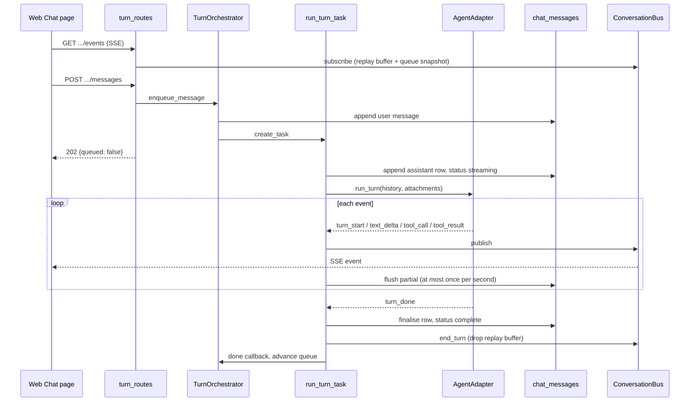
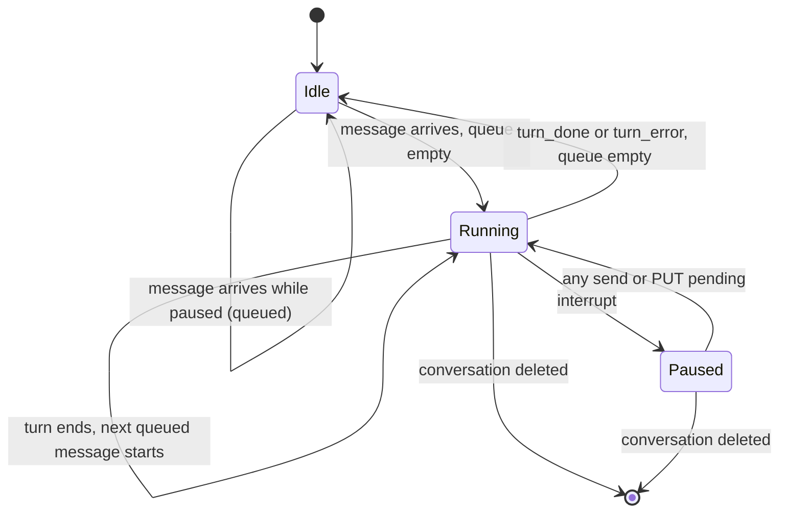
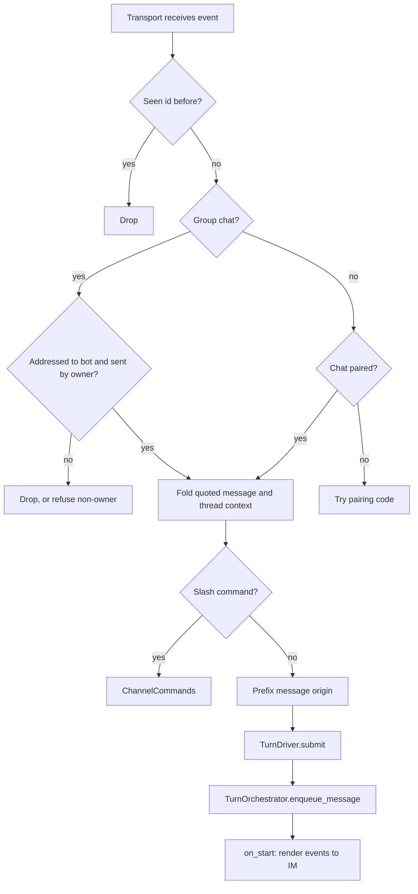

# Chat and turns

This page explains Coffer's turn platform: the conversation model, the orchestrator that runs one turn at a time per conversation, the adapters that drive Claude Code and Codex, the event bus that streams a turn to every surface watching it, and how IM channels plug in as a second client. It is written for engineers who want to understand the mechanism and the reasons behind it. For day-to-day use, see the [Chat guide](/guides/chat) and the [Channels guide](/guides/channels).

## The problem

The owner of a vault wants to talk to their coding agents from more than one place: a phone (through Telegram or SeaTalk) and a desktop browser. Both need the same guarantees. A turn has to reach an agent the same way whoever asked for it. A turn started on the phone has to be visible, interruptible and continuable from the browser. And no turn may end silently, including when the daemon dies halfway through a reply.

There is also a cost constraint. Coffer drives two agents and two IM platforms, and both sets are meant to grow. If each channel had to know about each agent, the integration cost would be N × M. The design keeps it at N + M.

## Design decisions

**One turn platform, several surfaces.** Conversations, the pending queue, the turn lifecycle and the event stream belong to one platform. The web Chat page and every channel are clients of it. Once a message reaches the orchestrator, nothing downstream knows which surface it came from, and an agent cannot tell a phone turn from a browser turn.

**Single owner, one timeline, two screens.** Channels are owner-paired: the "IM peer" is always the vault's owner on their phone. So watching a phone conversation from the browser is continuity for one person, not multi-user collaboration. Coffer has no peer-identity model, no per-user visibility rules and no question of who may interrupt whom. The web page shows every conversation, including the ones a channel opened, with a badge naming the channel it is also reachable on.

**Starting a turn is separate from watching it.** `POST .../messages` starts or queues a turn and returns `202` immediately. All output flows through one subscription, `GET .../events`. The sender is not a special case: "the turn I started" and "the turn my phone started" travel the same code, and a replay buffer ensures the sender misses no early events.

**Send freely; queue, never reject.** A message sent while a turn is running joins a per-conversation FIFO pending queue. Each queued message becomes its own turn. Messages are not merged. The web composer never locks. A channel accepts up to ten pending messages per conversation before it answers "busy" (see [the inbound pipeline](#the-inbound-pipeline)).

**The adapter is self-contained.** The orchestrator gives an adapter the conversation history and the turn's attachments, and nothing else. The adapter brings its own model, tools and configuration. Adding a third agent means registering one provider and one adapter. The conversation schema, the orchestrator and the clients do not change.

**Full permissions, owner pairing as the gate.** Both agents run without per-tool approval (`bypassPermissions` for Claude Code; `never` ask with `danger-full-access` for Codex). The trust boundary is the paired owner driving the conversation, not a tool-by-tool prompt that nobody is present to answer on a phone.

## Conversation model

A conversation is not a [resource](/architecture/resource-framework). It is a row in its own SQLite table, `conversations`, with its messages in `chat_messages`. Chat state does not sync between machines.

| Field | Meaning |
| --- | --- |
| `id` | Opaque conversation id. |
| `agent_key` | The agent the conversation belongs to (`claude_code` or `codex`). There is no storage default: every writer names the agent explicitly. |
| `agent_config` | Provider-owned JSON: `cwd`, `session_id` (the upstream session to resume), `model` and `effort`. |
| `title` | Starts as a placeholder. It is replaced by the first user message's text unless the owner has already renamed the conversation. |
| `archived_at` | `null` while the conversation is active. |
| `channel_uid`, `peer_chat_id` | The optional channel binding: the return address for relaying output to an IM chat. It stores the channel's immutable uid, so it survives a rename. |
| `owner` | `null` for the developer's own conversations. A conversation that another surface owns carries that surface's name and is left out of the Chat list. It can still be read by id. |

A message stores its `role`, an ordered list of content blocks (`text`, `tool_use`, `tool_result`, `attachment`), a `status` (`streaming`, `complete` or `failed`), and, for assistant messages, the `model_id` and token usage when the agent reports them.

The conversation's timeline is the record of what an agent did. Turns are deliberately **not** written to the [audit log](/architecture/observability). A turn is not irreversible, not security-sensitive and not invisible afterwards, so an audit row per turn would only duplicate the timeline.

### Working directory and session

Each turn runs in the conversation's `cwd`. If none was supplied, it runs in the Coffer-managed workspace `~/.coffer/workspace`, which is created on first use. An explicitly supplied `cwd` must be an existing directory, or conversation creation fails before anything is written.

The upstream session id is written back to `agent_config.session_id` after each turn, so the next turn resumes the same Claude Code session or Codex thread. Because the agent's own session already holds the conversation, the platform passes only the most recent **200** messages as history (`HISTORY_LIMIT`). That history is what a fresh session needs. A conversation with thousands of messages is never loaded in full.

If the agent no longer recognises a stored session id, the turn is retried **once** as a fresh session. Only a second failure becomes a turn error. Without this retry, a stale id would make the conversation permanently unusable instead of merely discontinuous.

### Which agent configuration a turn runs against

A turn runs against the config directory of the first enabled agent of its type, in name order. This is the same agent whose models the pickers offer. When that directory is not the type's standard location, the spawned process gets `CLAUDE_CONFIG_DIR=<config_dir>` (Claude Code) or `CODEX_HOME=<config_dir>` (Codex), merged with the daemon's own environment and any key a [model provider](/guides/providers) projects. For the standard location, the environment is left untouched, so the process behaves exactly as when you run the CLI yourself. This matters because Coffer delivers skills and installs its MCP entry into that directory. A turn that read a different directory would not see them.

## The turn orchestrator

`TurnOrchestrator` (`application/chat/turn_orchestrator.py`) is the one entry point for a message, from the web `POST` and from a channel alike. It knows the agent-provider registry and nothing about any specific agent.

Per-conversation state lives in one `TurnState` (`application/chat/turn_state.py`): the event bus, the in-flight `ActiveTurn`, the pending queue and a `paused` flag. The state is process-global and single-daemon by design. It exists only while something needs it (a turn in flight, a queued message or an attached subscriber) and is evicted otherwise, so a daemon that has served ten thousand conversations does not hold ten thousand buses.

### `enqueue_message`

1. Check that the conversation exists (404 otherwise).
2. If no turn is active, the queue is not paused and the queue is empty, start the turn now.
3. Otherwise append a `PendingMessage` (text, attachments, title hint and an optional `on_start` sink) to the queue and broadcast `queue_changed`.
4. Sending a message clears the `paused` flag, so a plain send after an interrupt resumes the held queue.

Starting a turn (`_begin_turn`) reserves the slot synchronously, before any `await`, so two concurrent sends cannot both start a turn. It then asks the registry for the conversation's provider, has it build an adapter, commits the user message (text block plus `AttachmentBlock` references) and spawns the detached turn task. A done-callback on that task calls `_maybe_advance`, which pops the head of the queue and starts its turn.

A queued turn that fails to **start** is neither lost nor retried in a loop. The message goes back to the head of the queue, the queue is paused, and a `turn_error` is published. For a channel message, the orchestrator also hands the channel's renderer a stream that carries the failure and then ends, because a phone has no queue chips to look at.

### Interrupt, delete and shutdown

The ways a turn can end early are told apart by flags on `ActiveTurn`, set by whoever cancels the task:

| Cause | How it is signalled | Outcome |
| --- | --- | --- |
| Owner interrupt (`POST .../interrupt`, `/stop` in a channel) | `interrupted = True`, queue `paused` | `turn_done` with `stop_reason: "interrupted"`; the partial reply is kept as `complete`. |
| Conversation deleted | `discarded = True` | The placeholder row is deleted; the bus closes every subscriber. |
| Daemon shutdown (`stop_all_turns`) | neither flag | `turn_error` `daemon_stopped`; the partial reply is kept as `failed`. |

`stop_all_turns` runs in the daemon's teardown before the database closes. It closes the door first (no turn may start afterwards and every queue is paused, so a cancelled turn's end does not start the next one), cancels every running task, and waits up to five seconds for their writes. A turn that does not settle in time is left to the startup sweep.

## The turn task

`run_turn_task` (`application/chat/turn_runner.py`) drives one adapter to completion. It is a detached `asyncio` task, so it outlives the HTTP request or channel callback that started it. This is why a reply still completes and persists when the browser tab that sent it is closed.

What the task guarantees:

- **A placeholder row before the first event.** An assistant row with status `streaming` is written before the adapter produces anything and is finalised in place when the turn ends: one row, never a duplicate. When the daemon starts, a sweep (`sweep_streaming_messages`) flips every lingering `streaming` row to `failed`. No conversation reopens showing a reply that will never arrive.
- **Throttled partial saves.** `PartialFlusher` writes the accumulated blocks onto the `streaming` row at most once per second (`DEFAULT_PARTIAL_FLUSH_SECONDS = 1.0`). If an event is skipped by the throttle, a trailing write is scheduled for when the interval is up. So text streamed just before a long tool run is on disk within about a second. A daemon killed outright keeps what was streamed up to the last save.
- **An idle watchdog.** An agent can wedge without dying: a hung tool, or a CLI waiting on a prompt nobody will answer. If no event arrives for `COFFER_TURN_IDLE_TIMEOUT_SECONDS` (default `300`; `0` disables it), the wait is cancelled inside the adapter's generator. This runs the adapter's own cancellation path, which interrupts and terminates the subprocess. The turn then ends with `turn_error` `turn_timeout`.
- **No silent completion.** If the adapter's stream ends without `turn_done` or `turn_error`, the task emits `turn_error` `stream_ended` itself. It does not rely on the adapter to do so, because a tick on a reply cut mid-sentence would be a lie.
- **Exactly one terminal event.** A cancellation that lands after a terminal event, for example during the final write, re-runs the finalise under `asyncio.shield` and emits nothing more.

Three turn error codes belong to the platform rather than to an agent: `stream_ended`, `turn_timeout` and `daemon_stopped`.

### Turn and message states

The assistant row a turn writes has its own lifecycle: `streaming` → `complete` (normal end or owner interrupt), or `streaming` → `failed` (adapter error, `stream_ended`, `turn_timeout`, `daemon_stopped`, or the startup sweep after a crash).

## Events and the live mirror

A turn is a sequence of typed events (`domain/chat/events.py`). Each event's `type` is also its SSE event name on the wire, so clients dispatch on one vocabulary with no translation table:

| Event | Payload | Emitted by |
| --- | --- | --- |
| `turn_start` | none | adapter |
| `text_delta` | `text` | adapter |
| `tool_call` | `tool_use_id`, `tool_name`, `tool_input` | adapter |
| `tool_result` | `tool_use_id`, `tool_name`, `output`, `error` | adapter |
| `turn_done` | `prompt_tokens`, `completion_tokens`, `stop_reason` | adapter, or the runner on interrupt |
| `turn_error` | `code`, `message` | adapter or runner |
| `queue_changed` | `pending` (ordered texts) | orchestrator only |

`ConversationBus` (`application/chat/bus.py`) fans each event out to every subscriber queue and keeps two things for late subscribers:

- a **replay buffer** of the current turn's events. It is cleared when a turn begins and dropped when the turn ends, because from then on the content is persisted and a late subscriber loads it from history. Replaying it as well would render the turn twice.
- the **latest** `queue_changed` snapshot only, not its history, because the queue is a conversation-level state and not turn content.

On `subscribe`, the buffer and snapshot are enqueued synchronously before the new queue joins the subscriber set. Because a concurrent `publish` can only run on a later event-loop tick, no live event can arrive ahead of the replay.

The SSE route (`surfaces/http/chat/turn_routes.py`, served with `sse_starlette`) stays open across turns. With no turn running, it holds the connection open and delivers the next turn from whichever surface starts it. It ends when the conversation is deleted (the bus sends its `None` sentinel) or the client disconnects. The web client (`frontend/src/lib/hooks/useChatTurn.ts`) reconnects only when a turn was mid-flight, with linear backoff and a lifetime cap of five reconnects (`MAX_STREAM_RECONNECTS`). After that it surfaces the error rather than hammering the endpoint.

### Routes

| Route | Purpose |
| --- | --- |
| `POST /api/v1/chat/conversations/{id}/messages` | Start or queue a turn. `202 {queued}`; carries no output. |
| `GET /api/v1/chat/conversations/{id}/events` | SSE subscription: replay the in-flight turn, then follow live. |
| `PUT /api/v1/chat/conversations/{id}/pending` | Replace the pending queue (reorder, drop, resume). Unpauses. |
| `POST /api/v1/chat/conversations/{id}/interrupt` | Stop the running turn and pause the queue. `204`. |
| `GET\|PATCH /api/v1/chat/conversations/{id}/agent-config` | Read or set model and reasoning effort; preserves `cwd` and the session id. |
| `GET /api/v1/agent-providers` | Registered agents with display name and availability. |
| `GET /api/v1/agent-providers/{agent_key}/models` | Models offered for an agent; 404 for an unknown key. |

Replacing the queue with `PUT .../pending` reconciles the new texts against the existing entries: each text reuses the first unused entry with the same text. A queue reordered from the browser therefore keeps each channel message's attachments and its channel renderer. Only a text that was not queued before becomes a new, bare entry.

::: info No CLI
Coffer has no `coffer chat` command group. Conversations are reachable over REST, from the web page and from channels. The [chat spec](https://github.com/wyx-sg/Coffer/blob/main/openspec/specs/chat/spec.md) records this as a known gap in the REST and CLI parity rule.
:::

## Agent adapters

The platform seam is two protocols in `application/chat/ports.py`:

- `AgentProvider`, one per agent type: `init_conversation` validates and stores `agent_config`, `build_adapter` builds a configured adapter for one turn, `on_conversation_deleted` tears down agent state, and `availability` reports whether the agent's binary resolves on the daemon's `PATH`. An unavailable agent is listed but cannot be selected.
- `AgentAdapter`, one per turn: `run_turn(history, attachments)` returns an async iterator of events. The adapter must end with a terminal event and must clean up and re-raise on cancellation. It may expose `model_id`, which the runner records on the assistant message.

`AgentProviderRegistry` holds the providers. They are registered at the composition root in `surfaces/http/chat_provider_wiring.py`. No surface names a provider directly.

### Claude Code: the Claude Agent SDK

`ClaudeSdkAgentAdapter` (`infrastructure/chat/claude_sdk_agent.py`) drives Claude Code through `ClaudeSDKClient` from `claude-agent-sdk`. It is the only file that imports the SDK. Each turn builds `ClaudeAgentOptions` with `resume=<session_id>`, `permission_mode="bypassPermissions"`, the reasoning `effort` when one is set, and `include_partial_messages=True`. Coffer's system context is appended to Claude Code's own preset prompt, not substituted for it.

Partial messages are what make a reply grow as it is written. With them enabled, the SDK delivers both the increments and the finished assistant message. The mapping in `claude_sdk_mapping.py` subtracts what was already emitted, so the reply reaches consumers exactly once. On cancellation, the adapter calls `interrupt()` and `disconnect()` and still persists the session id, which the SDK reports early, so an interrupted turn stays resumable.

### Codex: `codex app-server`

`CodexAppServerAdapter` (`infrastructure/chat/codex_agent.py`) drives Codex through `codex app-server`: JSON-RPC 2.0 over stdio, one JSON object per line (NDJSON, not LSP `Content-Length` framing). `CodexRpcClient` (`codex_jsonrpc.py`) demultiplexes responses, server-to-client requests and notifications in one read loop, using only the standard library.

Each turn spawns an app-server process (`codex_app_server.py`), resolving `codex` on `PATH`. The process is registered through `ChildProcess`, so the daemon's startup orphan sweep can clean it up after a crash. The adapter starts its notification pump **before** the handshake, so no notification emitted in response to the handshake is missed. It then runs:

1. `initialize`, then the `initialized` notification.
2. `thread/resume` with the stored thread id, or `thread/start`. Coffer's system context rides in `developerInstructions`, which adds to Codex's base instructions and does not replace them. A rejected resume falls back once to `thread/start`.
3. `turn/start` with the prompt, plus `effort` when one is set. Effort belongs to the turn in Codex's protocol, not to the model name.

Notifications are mapped to platform events by `codex_mapping.py`. On cancellation, the adapter sends `turn/interrupt`, persists the thread id and closes the process.

::: details Why a subprocess per turn rather than a pooled agent
Both adapters open a fresh session per turn and resume the agent's own stored session. The agent's state lives in the agent's own files, not in a long-lived process Coffer would have to supervise, health-check and recover after a daemon restart. The cost is process start-up per turn. The benefit is that a crashed or wedged agent affects exactly one turn, and a daemon restart loses nothing except the in-flight turn.
:::

### What the adapter is told

The appends an agent receives on top of its own system prompt are composed in one place, `compose_system_context` in `infrastructure/chat/adapter_support.py`, shared by both providers and always in this order:

1. For a channel-driven conversation, a note that the agent is on a chat channel, naming the channel.
2. For a channel-driven conversation, the [memory](/architecture/memory) index. The composition root builds the composer (`memory_wiring.memory_context_composer`) and hands it to both providers through `wire_chat`. It returns nothing while the `memory` feature is off, when the index is empty, or when the tree cannot be read. See [Channel turns](/architecture/memory#channel-turns).
3. On every turn, a model note naming the model Coffer put the agent on, or saying the agent's own default is in use, with a few alternatives. An agent cannot see Coffer's choice and invents one when asked, so the note says it outranks the agent's own guess.

A turn from the web Chat page, like a session you start yourself in a terminal, gets memory through the agent's own session-start hook, when you have installed memory delivery. No turn gets it both ways.

## Attachments and document extraction

Attachments enter a conversation two ways. A channel downloads each file under `~/.coffer/channel-media` and hands the orchestrator an `Attachment(path, mime, filename)`. The web composer uploads each file first, to `POST /api/v1/chat/attachments`, and sends the ids it gets back in `attachment_ids` on `POST …/messages`; the route resolves them to the same `Attachment` values and calls the same `TurnOrchestrator.enqueue_message(…, attachments=…)` a channel calls. From there the two are one code path. Either way the chat database holds only a reference (`AttachmentBlock`: `path`, `mime`, `filename`) inside the user message, never the bytes.

### Web uploads

`ChatAttachmentService` (`application/chat/attachments.py`) owns the upload's bounds and the send-time resolution; `FileChatMediaStore` (`infrastructure/chat/media_store.py`) is the `ChatMediaStore` port's file-backed adapter.

- **Bounds.** One file per call, at most 20 MB (`ATTACHMENT_TOO_LARGE`, 413, naming the limit). Starlette spools a multipart body to a temporary file while parsing it, so the route's `_BoundedUploadRoute` acts first: it checks the token, refuses a declared `Content-Length` over the limit plus a 64 KiB multipart allowance with the same 413 before reading the body, and parses the form with `max_files=1` and a handful of fields. A body sent without a declared length is parsed and then refused by the same ceiling on the file's bytes. The type is decided by `upload_mime` in `domain/chat/attachment.py`: a declared image, audio or document type is kept, then a fixed extension table is consulted, and anything whose bytes are UTF-8 without a NUL is text. Anything else is `ATTACHMENT_TYPE_UNSUPPORTED` (415). An image's type is then replaced by what its magic bytes prove (`sniff_image_mime`: PNG, JPEG, GIF, WEBP); one whose bytes are none of those is stored as `application/octet-stream`, never as an image. The table is fixed rather than the stdlib `mimetypes`, which reads the host's mime files.
- **Storage.** Each upload is two flat files under `~/.coffer/chat-media`: the bytes as `<id><ext>`, so a path-native agent still sees the extension, and `<id>.json` with the display name, type, size and stored file name, written after the bytes. The id is 32 hex characters from `uuid4`; the store joins nothing into a path that is not an id of that shape.
- **Send.** A message carries text, up to ten `attachment_ids`, or both. An id that names no stored file is `ATTACHMENT_NOT_FOUND` (422) and nothing is persisted or queued. A message with files and no text persists the stand-in a channel's uncaptioned photo gets (`attachment_note`), because an agent request cannot hold an empty text block, and a conversation it opens is named after the files.
- **Resend.** The page's Retry calls `POST …/messages/{message_id}/resend`: `ChatService.get_user_message` finds the user row (`MESSAGE_NOT_FOUND`, 404, otherwise), `ChatAttachmentService.reattach` rebuilds its text and `Attachment` values from the row's blocks, and the route enqueues them like a send, so a retry carries the original's files whether they came from the page or a channel. A referenced file the media sweep has deleted is `ATTACHMENT_EXPIRED` (410) and nothing is persisted or queued. Before the failed prompt's row has landed, the page instead re-sends its optimistic echo, which keeps the files' upload ids.
- **Retention.** `~/.coffer/chat-media` is pruned by the same 30-day mtime rule as `channel-media`. The rule is `files_to_prune` in the kind-agnostic `domain/retention.py`, the sweep is `prune_media_dir` in `infrastructure/media_retention.py`, and `RetentionService` runs one sweep per directory, reporting each under its own key (`channel_media`, `chat_media`).

The page keeps each composer file's state (uploading, ready, failed) in `useComposerAttachments`, uploads through the shared `call()` helper, and holds **Send** while any file is uploading or failed. The optimistic echo of a sent message carries the files' names and types, so its chips show before the row lands, and an attachment-only echo is matched to its row by those names. There is no image preview: that would need a route serving the bytes back, and the path stays inside the daemon. The decision is recorded in [Chat Attachment Uploads](https://github.com/wyx-sg/Coffer/blob/main/docs/decisions/chat-attachment-uploads.md).

### Materialisation

The turn task does not receive attachments as a parameter. It reads them back from the last user message in the persisted history. That reference is the single source of truth, so it survives a daemon restart and matches what the page shows. The path never reaches the wire: only the adapter, which reads the bytes, sees it.

Each adapter then materialises attachments in its own shape, in this order:

1. **Audio** is transcribed and folded into the prompt, when a speech-to-text connection has been designated (see [internal engine](https://github.com/wyx-sg/Coffer/blob/main/openspec/specs/internal-engine/spec.md)). This is off by default. It is the one place user content may leave the machine for transcription. With no connection, or on any failure, the audio is handed over as an ordinary file.
2. **Documents** (PDF, Word, PowerPoint, Excel and similar) are converted to text by `DocumentExtractor` (`infrastructure/chat/document_extract.py`), which lazily imports the optional `markitdown` library. If the library is missing or extraction fails, the document degrades to a file attachment.
3. **Everything else:** Claude Code receives an image inline, as a base64 `image` block, only when `inline_image_mime` admits it: its bytes sniff as PNG, JPEG, GIF or WEBP, and it is at most 5 MB once base64-encoded (`INLINE_IMAGE_MAX_BYTES`, the Messages API's per-image ceiling). The block's `media_type` is the sniffed type, not the stored one, so a mislabelled channel photo is not rejected as "image does not match media type". Any other file, including an image that fails either check, becomes a text note naming the saved path. The rule is applied at send time, so channel media and web uploads share it. Codex, which is path-native over the app-server protocol, always receives the path note, so it has no inline ceiling to respect.

## Channels as a second surface

A channel is a [resource](/architecture/resource-framework) of kind `channel`: a Telegram bot or SeaTalk app bound to the vault, with credential references, a default agent, an inverted agent scope (the agents this channel may drive), and `runs_on`, the machine whose daemon runs its adapter. The channel layer reaches the turn platform through exactly two seams, `ChatService` for conversations and `TurnOrchestrator.enqueue_message` for turns, in-process, just as the web page does over HTTP.

### Thin adapters over a shared core

A transport implements only `ChannelAdapter` (`application/channel/ports.py`): `start` and `stop`, outbound `send_text`, `open_live_text`, `edit_text` and `update_card`, inbound normalisation into envelopes (`InboundMessage`, `InboundCallback`, `InboundLifecycle`, `InboundStop`), and a `ChannelCapabilities` record. Pairing, the owner gate, commands, queueing, conversation mapping and rendering strategy live in the shared core. The core chooses behaviour from capabilities, never from the adapter's type:

| Capability | Question the core asks |
| --- | --- |
| `supports_live_text` | Is there a surface I can keep updating while the turn runs? |
| `supports_edit` | Can the transport rewrite a message it already delivered? |
| `supports_buttons` | Can it render interactive selection cards? |
| `supports_card_update` | Can it rewrite an already-delivered card? |
| `supports_typing` | Can it show a typing indicator? |
| `max_message_chars` | How long may one outbound message be? |

Both transports answer yes to `supports_live_text` by different means. Telegram edits one message. SeaTalk, which cannot edit a text message, uses its streaming API (`init_stream`/`update_stream`). `LiveTextSurface` (`infrastructure/channel/live_text.py`) holds the rules both share: never call the platform more often than the transport's buffer interval, remember the last snapshot, and stop using a surface after its first failure.

### Transports

- **Telegram** (`infrastructure/channel/telegram*.py`) long-polls the Bot API over raw `httpx`. The update offset is committed only after a dispatch attempt, so a crash re-delivers an update rather than losing it, and a dispatch that raises still advances past a poison update.
- **SeaTalk** (`infrastructure/channel/seatalk*.py`) receives over one outbound websocket connection per channel, held on a thread inside the daemon (`seatalk_ws.py`). The operator supplies the websocket SDK. It is synchronous, so `listen()` runs on a thread Coffer owns, and events cross back to the event loop with `call_soon_threadsafe`. Coffer supervises reconnection itself: exponential backoff from 1 s capped at 30 s, and a flat 60 s after being kicked by another connection for the same app. Nothing is exposed to the network. Outbound calls use plain HTTPS.

Both transports drop redelivered events with a bounded in-memory set of recently seen ids (`SeenIds`, 2048 entries).

### Supervision

`ChannelRuntime` (`application/channel/runtime.py`) is a reconciler that ticks every two seconds. On each tick it computes the wanted set (`application/channel/wanted.py`) by asking three gates in order: the channel is `enabled`, `runs_on` names this machine, and its scope leaves at least one agent to drive. It then starts, stops or restarts adapters to match. REST, CLI and UI never start or stop an adapter directly, which keeps the reported status truthful. Runtime state is keyed by channel uid, so renaming a channel moves nothing that is running. The wanted-set computation is also the one place where the channel's agent uids become the turn platform's agent keys.

### The inbound pipeline

`InboundProcessor.on_message` (`application/channel/inbound.py`) handles every inbound message the same way for every transport:

- **Owner gate and pairing.** A direct chat must match the paired peer. An unpaired chat can only present a pairing code: an 8-character single-use code, one-hour TTL, bounded wrong guesses, held in memory only. Strangers are ignored silently: no reply and no turn, so the bot never reveals it is alive. In a group, a message must be addressed to the bot and come from the owner's sender id. An unprovable sender is refused, never assumed to be the owner.
- **Conversation mapping.** Conversation identity is `(channel, chat, thread)`, stored in `channel_thread_conversations`. A direct chat and each group thread are independent conversations, so concurrent turns in different threads never contend. On first use, `open_conversation` creates an ordinary conversation through `ChatService`, with the thread's sticky `/agent` choice if it is still in scope, otherwise the channel's default agent. If the conversation has been deleted, the next message creates a fresh one.
- **Commands** (`/new`, `/stop`, `/status`, `/help`, plus agent, model and effort switching, and `/save` into a [knowledge](/architecture/knowledge) collection) are handled by `ChannelCommands` and never become turns. Control commands bypass the queue.
- **Turns.** The message text is prefixed with its origin (platform, chat kind and title, thread, sender), so the agent knows where it is answering even after `/agent` swaps it mid-conversation. When the conversation already has `QUEUE_MAX = 10` messages pending, `TurnDriver` drops the new one and replies `⚠️ Busy — message dropped, try again.`, so a flood cannot pile up forever. Otherwise it reacts with a receipt acknowledgement where the transport supports reactions, then calls `enqueue_message` with an `on_start` sink.

### Rendering

When the channel's message reaches the head of the queue, the orchestrator calls `on_start` with a dedicated event queue for that turn. `turn_render.py` drains it. With `supports_live_text`, it keeps one surface growing for the whole turn: tool progress lines first, each describing the call from its input (`⏳ Bash · list the desktop`, `✅ Read · wedding.json`), then the reply text taking over the same surface. Adapters convert Markdown to their platform's format, chunk to `max_message_chars`, retry a rejected formatted message as plain text, and back off on rate limits. A clean success sends no trailing summary, because the reply is the completion signal. Only a failed, interrupted or limit-hit turn sends one. An agent can send a file back by writing a line-anchored `MEDIA:/absolute/path` sentinel, which `turn_media.py` delivers into the originating thread.

The web page watches the same turn on the bus at the same time. This is how the live mirror works for channel conversations: the channel keeps only its renderer hook and never a buffer of its own, and a message queued from the browser behind a phone-started turn runs when that turn ends.

## Concurrency rules

- **One turn per conversation.** The slot is reserved synchronously in `_begin_turn`. Every further message queues. `start_turn`, used where a caller needs a turn now or not at all, raises `TurnInProgress` instead.
- **Many conversations in parallel.** Turns on different conversations, including different threads of one group, run concurrently as independent tasks.
- **Single daemon.** Turn state, queues and buses are in-process. There is no cross-process fan-out, and the pending queue is lost on restart. That is consistent with an in-flight turn being marked failed on restart: an uncommitted message was never a row.
- **Ownership-checked release.** A finishing turn clears only its own `ActiveTurn`, so a start that raced it is never evicted.
- **Retention.** The framework's [retention worker](/architecture/observability#retention) archives conversations idle for 7 days (`conversations_archive`) and deletes archived conversations with their messages 30 days after archiving (`conversations`). Both windows are tunable like any other retained table.

## Trade-offs and alternatives

**One subscription versus a streaming POST.** A POST that streams its own turn, plus a subscription for everyone else, would be two event paths with races between them. The single subscription makes the sender an ordinary subscriber, at the cost of a replay buffer per active conversation.

**Sequential FIFO versus coalescing.** Merging all pending messages into one next turn would give the agent fuller context and use fewer turns. Coffer processes them one by one because the result is predictable, and each queued row maps to exactly one turn.

**An in-memory queue.** Persisting the queue would survive restarts, but restarts are rare, and dropping uncommitted messages matches how an in-flight turn is treated. The startup sweep makes the loss visible rather than silent.

**In-daemon channel adapters versus a separate gateway process.** A channel gateway process would isolate transports better, but would double the process-management surface (detect-or-spawn, PID files, logs) for a single-user daemon. Adapters run as supervised tasks, and SeaTalk's websocket runs as a thread, inside the daemon.

**Channels as MCP servers.** MCP is outbound, from agent to tool; a channel is inbound, from user to agent. Modelling channels as MCP servers would invert the data flow, so Coffer does not do it.

**No approval seat.** Both agents run with full permissions. An approval prompt sent to a phone would stall every turn on a person who is often not looking. Owner pairing is the gate.

## Where it lives in the code

| Path | Responsibility |
| --- | --- |
| [`backend/coffer/domain/chat/`](https://github.com/wyx-sg/Coffer/tree/main/backend/coffer/domain/chat) | `Conversation`, `Message` and blocks, `AgentConfig`, `Attachment`, event types, errors |
| [`backend/coffer/application/chat/turn_orchestrator.py`](https://github.com/wyx-sg/Coffer/blob/main/backend/coffer/application/chat/turn_orchestrator.py) | Queue, start, interrupt, delete, advance |
| [`backend/coffer/application/chat/turn_runner.py`](https://github.com/wyx-sg/Coffer/blob/main/backend/coffer/application/chat/turn_runner.py) | Detached turn task, watchdog, terminal guarantees |
| [`backend/coffer/application/chat/turn_state.py`](https://github.com/wyx-sg/Coffer/blob/main/backend/coffer/application/chat/turn_state.py) | Per-conversation state, eviction, `stop_all_turns` |
| [`backend/coffer/application/chat/turn_persistence.py`](https://github.com/wyx-sg/Coffer/blob/main/backend/coffer/application/chat/turn_persistence.py) | Content accumulation, throttled partial saves, finalise |
| [`backend/coffer/application/chat/bus.py`](https://github.com/wyx-sg/Coffer/blob/main/backend/coffer/application/chat/bus.py) | Fan-out and replay |
| [`backend/coffer/application/chat/ports.py`](https://github.com/wyx-sg/Coffer/blob/main/backend/coffer/application/chat/ports.py), [`registry.py`](https://github.com/wyx-sg/Coffer/blob/main/backend/coffer/application/chat/registry.py) | `AgentProvider`, `AgentAdapter`, `ModelCatalogPort`, the registry |
| [`backend/coffer/infrastructure/chat/`](https://github.com/wyx-sg/Coffer/tree/main/backend/coffer/infrastructure/chat) | Claude SDK and Codex app-server adapters, system-context composition, persistence, document extraction, transcription |
| [`backend/coffer/surfaces/http/chat/`](https://github.com/wyx-sg/Coffer/tree/main/backend/coffer/surfaces/http/chat) | Conversation, turn (SSE) and agent-provider routes |
| [`backend/coffer/surfaces/http/chat_wiring.py`](https://github.com/wyx-sg/Coffer/blob/main/backend/coffer/surfaces/http/chat_wiring.py), [`chat_provider_wiring.py`](https://github.com/wyx-sg/Coffer/blob/main/backend/coffer/surfaces/http/chat_provider_wiring.py) | Composition: repos, registry, orchestrator, startup sweep, idle timeout |
| [`backend/coffer/application/channel/`](https://github.com/wyx-sg/Coffer/tree/main/backend/coffer/application/channel) | Inbound pipeline, pairing, commands, turn driver, renderer, runtime reconciler |
| [`backend/coffer/infrastructure/channel/`](https://github.com/wyx-sg/Coffer/tree/main/backend/coffer/infrastructure/channel) | Telegram and SeaTalk transports, live-text surfaces, Markdown rendering, media |
| [`frontend/src/lib/hooks/useChatTurn.ts`](https://github.com/wyx-sg/Coffer/blob/main/frontend/src/lib/hooks/useChatTurn.ts) | Web subscription and bounded reconnect |

## Related

- Specs: [chat](https://github.com/wyx-sg/Coffer/blob/main/openspec/specs/chat/spec.md), [channels](https://github.com/wyx-sg/Coffer/blob/main/openspec/specs/channels/spec.md), [channels/telegram](https://github.com/wyx-sg/Coffer/blob/main/openspec/specs/channels/telegram/spec.md), [channels/seatalk](https://github.com/wyx-sg/Coffer/blob/main/openspec/specs/channels/seatalk/spec.md)
- Decisions: [Chat Is a Single-Owner Live Mirror](https://github.com/wyx-sg/Coffer/blob/main/docs/decisions/chat-single-owner-live-mirror.md), [Channel Adapter Framework](https://github.com/wyx-sg/Coffer/blob/main/docs/decisions/channel-adapter-framework.md), [Channel Attachments: Bytes on Disk, a Reference in the Message, Materialised per Agent at Send](https://github.com/wyx-sg/Coffer/blob/main/docs/decisions/channel-attachments.md), [The Chat Page Uploads a File First and Sends Its Id, Into a Sibling Media Directory](https://github.com/wyx-sg/Coffer/blob/main/docs/decisions/chat-attachment-uploads.md), [SeaTalk Inbound Over WebSocket](https://github.com/wyx-sg/Coffer/blob/main/docs/decisions/seatalk-websocket-inbound.md), [Coffer's Own Model Is an Internal Engine, Not a Persona or a Tool](https://github.com/wyx-sg/Coffer/blob/main/docs/decisions/coffer-model-is-an-internal-engine.md), [Managed Agents Run With Full Permissions; Owner Pairing Is the Gate](https://github.com/wyx-sg/Coffer/blob/main/docs/decisions/managed-agents-run-with-full-permissions.md)
- Pages: [Daemon and processes](/architecture/daemon), [Persistence](/architecture/persistence), [Memory](/architecture/memory), [Security model](/architecture/security), [Chat guide](/guides/chat), [Channels guide](/guides/channels)
