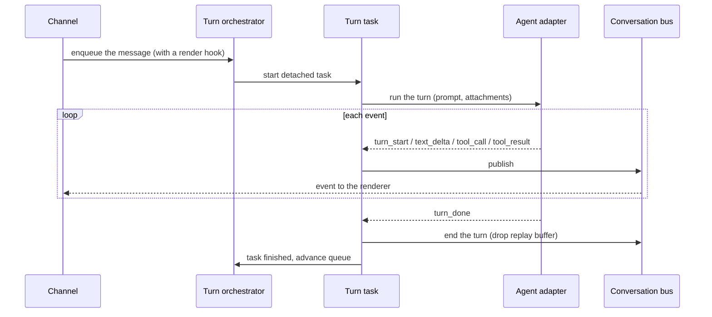
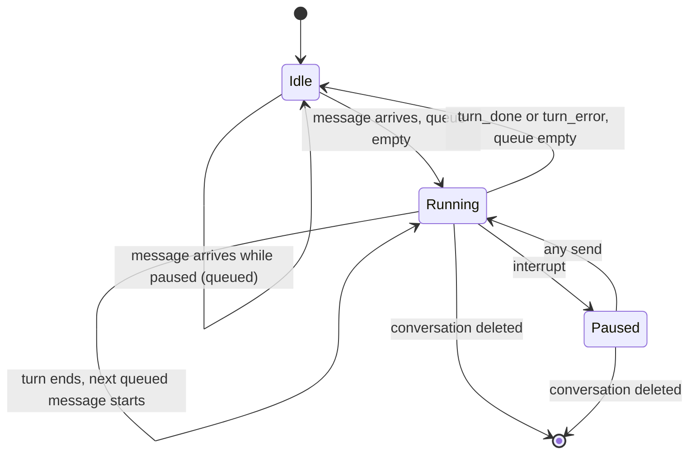
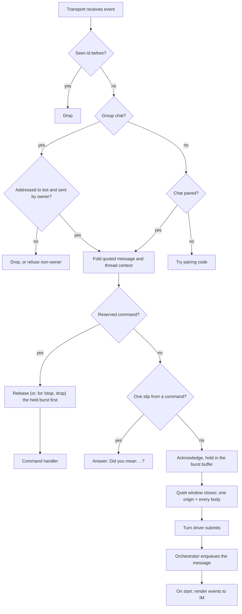

# Chat and turns

This page explains Coffer's turn platform: the conversation index, the orchestrator that runs one turn at a time per conversation, the adapters that drive Claude Code and Codex, the in-memory event bus that streams a turn to the channel that asked for it, how IM channels plug in, and how the Conversations and Sessions lists hand a session to your terminal. It is written for engineers who want to understand the mechanism and the reasons behind it. For day-to-day use, see the [Conversations guide](/guides/chat) and the [Channels guide](/guides/channels).

## The problem

The owner of a vault wants to reach their coding agents from a phone (through Telegram or SeaTalk) while the agents run on the desktop. A turn has to reach an agent the same way whoever asked for it, it has to be interruptible and continuable from the chat, and no turn may end silently, including when the daemon dies halfway through a reply. Coffer also has to stay out of the agents' way: the agents already have their own session records and their own interfaces (the Claude desktop app, the Codex app, a terminal), so Coffer does not rebuild a chat client or keep a second copy of what was said.

There is also a cost constraint. Coffer drives two agents and two IM platforms, and both sets are meant to grow. If each channel had to know about each agent, the integration cost would be N × M. The design keeps it at N + M.

## Design decisions

**One turn platform, channels as its clients.** Conversations, the pending queue, the turn lifecycle and the event stream belong to one platform. Every channel is a client of it. Once a message reaches the orchestrator, nothing downstream knows which channel it came from, and an agent cannot tell a SeaTalk turn from a Telegram turn.

**The agent's own session is the record.** Coffer keeps an index row per conversation (which channel thread, which agent, which directory, which native session id) and nothing that was said. The agent resumes its own session on every turn, so the context lives where the agent keeps it. A person who wants to read or continue a conversation does it in the agent's own interface; Coffer's web UI lists them among every agent's sessions and opens a row's session in the terminal from its Open button.

**Send freely; queue, never reject.** A message sent while a turn is running joins a per-conversation FIFO pending queue. Each queued message becomes its own turn. Messages are not merged. A channel tells each waiting message its place ("⏳ Queued (n)") and accepts up to ten pending messages per conversation; the eleventh is dropped with the reason (see [the inbound pipeline](#the-inbound-pipeline)).

**One session runs in one place.** A session open in a terminal and a channel turn writing to the same session would fork it. Before a turn resumes a session, the daemon looks for a terminal that has it open and, if one does, the channel is told so instead of starting the turn (see [One session, one place](#one-session-one-place)).

**The adapter is self-contained.** The orchestrator gives an adapter the turn's prompt and attachments, and nothing else. The adapter brings its own model, tools and configuration. Adding a third agent means registering one provider and one adapter. The conversation index, the orchestrator and the channels do not change.

**Full permissions, owner pairing as the gate.** Both agents run without per-tool approval (`bypassPermissions` for Claude Code; `never` ask with `danger-full-access` for Codex). The trust boundary is the paired owner driving the conversation, not a tool-by-tool prompt that nobody is present to answer on a phone.

## Conversation model

A conversation is not a [resource](/architecture/resource-framework). It is a row in its own SQLite table of conversations, an index into the agent's own sessions. There is no table of messages: Coffer stores no conversation text. Chat state does not sync between machines.

| Field | Meaning |
| --- | --- |
| `id` | Opaque conversation id. |
| `agent_key` | The agent the conversation belongs to (`claude_code` or `codex`). There is no storage default: every writer names the agent explicitly. |
| `agent_config` | Provider-owned JSON: `cwd`, `session_id` (the agent's own session, to resume) and `model`. |
| `title` | Starts as a placeholder. It is replaced by the first user message's text unless the owner has already renamed the conversation. Renaming also renames the native session. |
| `channel_uid`, `peer_chat_id` | The channel thread that owns the conversation. It stores the channel's immutable uid, so it survives a rename. Every row has one. |

What a turn streams is the typed event union, which is a wire contract and not storage. The agent's own session holds the messages, tool calls and results, and the Sessions list reads them from the agent. Turns are deliberately **not** written to the [audit log](/architecture/observability) either: a turn is not irreversible, not security-sensitive and not invisible afterwards, since the agent's session shows it.

::: warning Old sessions disappear with the agent's clean-up
Because Coffer keeps no copy, a conversation lasts as long as the agent's session does. Claude Code deletes sessions after `cleanupPeriodDays` (about 30 days by default). A channel conversation whose session was cleaned up continues as a fresh session. See [Conversations](/guides/chat#chat-and-the-agent-s-own-sessions) for how to change the setting.
:::

### Working directory and session

Each turn runs in the conversation's `cwd`. If none was supplied, it runs in the Coffer-managed workspace `~/.coffer/content/workspace`, which is created on first use. An explicitly supplied `cwd` must be an existing directory, or conversation creation fails before anything is written.

The upstream session id is written back to `agent_config.session_id` after each turn, so the next turn resumes the same Claude Code session or Codex thread. The platform passes the agent only the new prompt and its attachments, never a history, because the resumed session already holds it. A fresh session (the first turn, or the retry below) starts without history.

If the agent no longer recognises a stored session id, the turn is retried **once** as a fresh session. Only a second failure becomes a turn error. Without this retry, a stale id would make the conversation permanently unusable instead of merely discontinuous.

### Which agent configuration a turn runs against

A turn runs against the config directory of the one registered agent of its type. This is the same agent whose models the pickers offer. When that directory is not the type's standard location, the spawned process gets `CLAUDE_CONFIG_DIR=<config_dir>` (Claude Code) or `CODEX_HOME=<config_dir>` (Codex), merged with the daemon's own environment. No provider key rides the environment: a [model provider](/guides/providers) connection that uses an API key is reached through Coffer's model proxy. For the standard location, the environment is left untouched, so the process behaves exactly as when you run the CLI yourself. This matters because Coffer delivers skills and installs its MCP entry into that directory. A turn that read a different directory would not see them.

## The turn orchestrator

The turn orchestrator is the one entry point for a message, which always comes from a channel. It knows the agent-provider registry and nothing about any specific agent.

Per-conversation state lives in one record: the event bus, the in-flight turn, the pending queue and a paused flag. The state is process-global and single-daemon by design. It exists only while something needs it (a turn in flight, a queued message or an attached subscriber) and is evicted otherwise, so a daemon that has served ten thousand conversations does not hold ten thousand buses.

### Sending a message {#enqueue-message}

1. Check that the conversation exists (404 otherwise).
2. If no turn is active, the queue is not paused and the queue is empty, start the turn now.
3. Otherwise append a pending entry (text, attachments, title hint and an optional start hook, which a channel uses to render the turn) to the queue and broadcast `queue_changed`.
4. Sending a message clears the paused flag, so a plain send after an interrupt resumes the held queue.

Starting a turn reserves the conversation's slot synchronously, before the orchestrator yields to anything else, so two concurrent sends cannot both start a turn. It then asks the registry for the conversation's provider, has it build an adapter and spawns the detached turn task. When that task finishes, the orchestrator pops the head of the queue and starts its turn.

A queued turn that fails to **start** is neither lost nor retried in a loop. The message goes back to the head of the queue, the queue is paused, and a `turn_error` is published to the subscribers attached at that moment. The error belongs to no turn, so it is not kept in the replay buffer. The orchestrator also hands the channel's renderer a stream that carries the failure and then ends, because a phone has no queue chips to look at.

### Interrupt, delete and shutdown

The ways a turn can end early are told apart by marks on the in-flight turn, set by whoever cancels it:

| Cause | How it is signalled | Outcome |
| --- | --- | --- |
| Owner interrupt (`POST .../interrupt`, `/stop` in a channel, **Stop** in the list) | The turn is marked interrupted; the queue is paused | `turn_done` with `stop_reason: "interrupted"`; the output so far is delivered to the channel as events. |
| Conversation deleted | The turn is marked discarded | The turn is cancelled; the bus closes every subscriber. |
| Daemon shutdown | Neither mark | `turn_error` `daemon_stopped`. |

Stopping every turn is a step of the daemon's teardown and runs before the database closes. It closes the door first (no turn may start afterwards and every queue is paused, so a cancelled turn's end does not start the next one), cancels every running turn, and waits up to five seconds for them. A daemon that dies outright leaves nothing behind to clean up: the next channel message resumes the agent's session.

## The turn task

The turn task drives one adapter to completion. It is a detached background task, so it outlives the channel callback that started it.

```mermaid
sequenceDiagram
    participant CH as Channel
    participant O as Turn orchestrator
    participant R as Turn task
    participant A as Agent adapter
    participant Bus as Conversation bus

    CH->>O: enqueue the message (with a render hook)
    O->>R: start detached task
    R->>A: run the turn (prompt, attachments)
    loop each event
        A-->>R: turn_start / text_delta / tool_call / tool_result
        R->>Bus: publish
        Bus-->>CH: event to the renderer
    end
    A-->>R: turn_done
    R->>Bus: end the turn (drop replay buffer)
    R->>O: task finished, advance queue
```

What the task guarantees:

- **Nothing is written for the turn.** The task records the session id the agent reports and bumps the conversation's `updated_at` at the start and at the end. The reply itself exists only as events, and in the agent's own session.
- **An idle watchdog.** An agent can wedge without dying: a hung tool, or a CLI waiting on a prompt nobody will answer. If no event arrives for `COFFER_TURN_IDLE_TIMEOUT_SECONDS` (default `300`; `0` disables it), the wait is cancelled inside the adapter's event stream. This runs the adapter's own cancellation path, which interrupts and terminates the subprocess. The turn then ends with `turn_error` `turn_timeout`.
- **No silent completion.** If the adapter's stream ends without `turn_done` or `turn_error`, the task emits `turn_error` `stream_ended` itself. It does not rely on the adapter to do so, because a tick on a reply cut mid-sentence would be a lie.
- **Exactly one terminal event.** A cancellation that lands after a terminal event re-runs the finalise shielded from further cancellation and emits nothing more.
- **Partial output is delivered, not stored.** An interrupted or failed turn delivers what was produced so far to the channel as events, followed by the terminal event.

Three turn error codes belong to the platform rather than to an agent: `stream_ended`, `turn_timeout` and `daemon_stopped`.

### Turn states

```mermaid
stateDiagram-v2
    [*] --> Idle
    Idle --> Running: message arrives, queue empty
    Idle --> Idle: message arrives while paused (queued)
    Running --> Running: message arrives (queued)
    Running --> Idle: turn_done or turn_error, queue empty
    Running --> Running: turn ends, next queued message starts
    Running --> Paused: interrupt
    Paused --> Running: any send
    Running --> [*]: conversation deleted
    Paused --> [*]: conversation deleted
```

## Events

A turn is a sequence of typed events. Each event's `type` is its name on the wire, so consumers dispatch on one vocabulary with no translation table:

| Event | Payload | Emitted by |
| --- | --- | --- |
| `turn_start` | none | adapter |
| `text_delta` | `text` | adapter |
| `tool_call` | `tool_use_id`, `tool_name`, `tool_input` | adapter |
| `tool_result` | `tool_use_id`, `tool_name`, `output`, `error` | adapter |
| `turn_done` | `prompt_tokens`, `completion_tokens`, `stop_reason` | adapter, or the turn task on interrupt |
| `turn_error` | `code`, `message` | adapter or turn task |
| `queue_changed` | `pending` (ordered texts) | orchestrator only |

The conversation bus fans each event out to every subscriber queue, in memory only, and keeps two things for a late subscriber:

- a **replay buffer** of the current turn's events, cleared when a turn begins and dropped when it ends. Nothing is stored from it, so once a turn is over there is nothing to replay.
- the **latest** `queue_changed` snapshot only, not its history, because the queue is a conversation-level state and not turn content.

When a subscriber attaches, the buffer and snapshot are enqueued synchronously before its queue joins the subscriber set. Because a concurrent publish can only run on a later event-loop tick, no live event can arrive ahead of the replay. The web UI does not subscribe: its lists read `running` and `needs_you` from the turn state and refresh on the change feed.

### Routes

| Route | Purpose |
| --- | --- |
| `GET /api/v1/agent-sessions` | List every managed agent's sessions by latest activity, merged from each agent's own listing; this is what the Conversations page reads. `q` searches title and directory, `source` takes `local` and channel uids, `agent` narrows the agents asked. A row carries `running`, `needs_you`, `cwd` and the channel when a conversation uses the session. |
| `GET\|PATCH\|DELETE /api/v1/chat/conversations/{id}` | Read one; rename (the agent renames its session first); delete (the agent deletes its session first). |
| `POST /api/v1/chat/conversations/{id}/interrupt` | Stop the running turn and pause the queue. `204`. |
| `GET /api/v1/agent-providers` | Registered agents with display name and availability. |
| `GET /api/v1/agent-providers/{agent_key}/models` | Models offered for an agent; 404 for an unknown key. |

Chat has no route that creates a conversation or sends a message: a message enters through a channel, in-process. The sessions of an agent are listed under `GET /api/v1/agents/{uid}/sessions` (see [Native sessions](#native-sessions)), and the Conversations page lists them for all agents at once (see [One list of every agent's sessions](#all-agent-sessions)). There is no route that lists conversations on their own: the channel-only list was removed once the cross-agent listing covered it.

::: info No CLI
Conversations are driven from channels. The CLI has no chat commands, because it carries only what needs it ([chat spec](https://github.com/wyx-sg/Coffer/blob/main/openspec/specs/chat/spec.md)).
:::

## Agent adapters

The platform seam is two contracts:

- An **agent provider**, one per agent type. It validates and stores a new conversation's `agent_config`, builds a configured adapter for one turn, tears down agent state when a conversation is deleted, and reports availability: whether the agent's binary resolves on the user's `PATH` (the login shell's `PATH` merged with the daemon's inherited one) **and** an agent of that type is registered with Coffer. Chat talks to managed agents only, so an unavailable agent is listed but cannot be selected, and a turn for a type with no registered agent is refused (`AGENT_CONFIG_REJECTED`, reason `agent_not_managed`) rather than run against the CLI's default config directory.
- An **agent adapter**, one per turn. Given the prompt and the attachments, it produces an asynchronous stream of events. The adapter must end with a terminal event and must clean up and re-raise on cancellation. It may expose a `model_id`, which it learns while the turn streams (the Claude CLI names it on its assistant messages, the Codex app-server in its thread result). The turn task reads it when it finalises the reply and records it on the assistant message.

A registry holds the providers. They are registered at the composition root. No surface names a provider directly.

### Claude Code: the Claude Agent SDK

The Claude Code adapter drives Claude Code through the client in `claude-agent-sdk`, and it is the only part of Coffer that imports the SDK. Each turn resumes the stored session id, runs in the `bypassPermissions` permission mode, and asks for partial messages. Coffer's system context is appended to Claude Code's own preset prompt, not substituted for it.

Partial messages are what make a reply grow as it is written. With them enabled, the SDK delivers both the increments and the finished assistant message. The mapping to platform events subtracts what was already emitted, so the reply reaches consumers exactly once. On cancellation, the adapter interrupts and disconnects the SDK client and still persists the session id, which the SDK reports early, so an interrupted turn stays resumable.

### Codex: `codex app-server`

The Codex adapter drives Codex through `codex app-server`: JSON-RPC 2.0 over stdio, one JSON object per line (NDJSON, not LSP `Content-Length` framing). One read loop, using only the standard library, demultiplexes responses, server-to-client requests and notifications.

Each turn spawns an app-server process, resolving `codex` on `PATH`. The process is registered as a daemon child process, so the daemon's startup orphan sweep can clean it up after a crash. The adapter starts its notification pump **before** the handshake, so no notification emitted in response to the handshake is missed. It then runs:

1. `initialize`, then the `initialized` notification.
2. `thread/resume` with the stored thread id, or `thread/start`. Coffer's system context rides in `developerInstructions`, which adds to Codex's base instructions and does not replace them. A rejected resume falls back once to `thread/start`.
3. `turn/start` with the prompt. Coffer sends no `effort`, so Codex runs at the effort its own configuration names.

Notifications are mapped to platform events. On cancellation, the adapter sends `turn/interrupt`, persists the thread id and closes the process.

::: details Why a subprocess per turn rather than a pooled agent
Both adapters open a fresh session per turn and resume the agent's own stored session. The agent's state lives in the agent's own files, not in a long-lived process Coffer would have to supervise, health-check and recover after a daemon restart. The cost is process start-up per turn. The benefit is that a crashed or wedged agent affects exactly one turn, and a daemon restart loses nothing except the in-flight turn.
:::

### What the adapter is told

The appends an agent receives on top of its own system prompt are composed in one place, shared by both providers and always in this order:

1. For a channel-driven conversation, a note that the agent is on a chat channel. It names the platform, the chat kind and the channel, says what Markdown renders there, and asks for a reply shaped for a phone (outcome first, no step narration, long content under `## Details`, diagrams as PNG files, a `coffer__ask` call when the agent needs an answer). Chat does not import the channel kind for this: the channel kind publishes a reader that returns the note, built from the conversation's thread row and the rendering notes the running transport declares.
2. For a channel-driven conversation, the [memory](/architecture/memory) index. The composition root builds the memory composer and hands it to both providers, beside the per-prompt retriever that adds the notes a channel turn's message names to its prompt. It returns nothing when the index is empty, or when the tree cannot be read. See [Channel turns](/architecture/memory#channel-turns).
3. On every turn, a model note naming the model Coffer put the agent on, or saying the agent's own default is in use, with a few alternatives. An agent cannot see Coffer's choice and invents one when asked, so the note says it outranks the agent's own guess.

A session you resume from the Conversations page runs in your terminal, like one you start yourself, and gets memory through the agent's own memory hook, when the agent is connected to Coffer. No turn gets it both ways.

## Attachments and document extraction

A channel downloads each file under `~/.coffer/content/channel-media` and hands the orchestrator an attachment (path, mime type, file name). The attachment travels with the turn as a reference; nothing is stored in a message, and the bytes never leave the disk. There is no web upload: the Conversations page does not send messages. The `attachments` retention policy prunes `channel-media` by age (30 days by default; adjustable, or keep forever, under Settings → Data → Local content).

### Materialisation

The attachment is handed to the adapter with the turn rather than re-read from history, so only the adapter, which reads the bytes, sees the path. It never reaches the wire.

Each adapter then materialises attachments in its own shape, in this order:

1. **Audio** is transcribed and folded into the prompt, when a speech-to-text connection has been designated (see [internal engine](https://github.com/wyx-sg/Coffer/blob/main/openspec/specs/internal-engine/spec.md)). This is off by default. It is the one place user content may leave the machine for transcription. With no connection, or on any failure, the audio is handed over as an ordinary file.
2. **Documents** (PDF, Word, PowerPoint, Excel and similar) are converted to text by a document extractor, which lazily imports the optional `markitdown` library. If the library is missing or extraction fails, the document degrades to a file attachment.
3. **Everything else:** Claude Code receives an image inline, as a base64 image block, only when it passes the inline check: its bytes sniff as PNG, JPEG, GIF or WEBP, and it is at most 5 MB once base64-encoded (the Messages API's per-image ceiling). The block's media type is the sniffed type, not the stored one, so a mislabelled channel photo is not rejected as "image does not match media type". Any other file, including an image that fails either check, becomes a text note naming the saved path. Codex, which is path-native over the app-server protocol, always receives the path note, so it has no inline ceiling to respect.

## Channels as a second surface

A channel is a [resource](/architecture/resource-framework) of kind `channel`: a Telegram bot or SeaTalk app bound to the vault, with secret references, a default agent, an inverted agent scope (the agents this channel may drive), and `runs_on`, the machine whose daemon runs its adapter. The channel layer reaches the turn platform through exactly two seams, the chat service for conversations and the orchestrator's enqueue entry point for turns, in-process.

### Thin adapters over a shared core

A transport implements only the channel adapter contract: start and stop; outbound, send a text, open a live-text surface, edit a text and update a card; inbound, normalise platform events into four envelopes (a message, a button callback, a lifecycle event and a stop); and a record of its capabilities. Pairing, the owner gate, commands, queueing, conversation mapping and rendering strategy live in the shared core. The core chooses behaviour from capabilities, never from the adapter's type:

| Capability | Question the core asks |
| --- | --- |
| Live text | Is there a surface I can keep updating while the turn runs? |
| Edit | Can the transport rewrite a message it already delivered? |
| Buttons | Can it render interactive selection cards? |
| Card update | Can it rewrite an already-delivered card? |
| Typing | Can it show a typing indicator? |
| Message length | How long may one outbound message be? |

Both transports answer yes to live text by different means. Telegram edits one message. SeaTalk, which cannot edit a text message, uses its streaming API (`init_stream`/`update_stream`). A shared live-text surface holds the rules both share: never call the platform more often than the transport's buffer interval, remember the last snapshot, and stop using a surface after its first failure.

### Transports

- **Telegram** long-polls the Bot API directly over HTTP, with no bot SDK. The update offset is committed only after a dispatch attempt, so a crash re-delivers an update rather than losing it, and a dispatch that raises still advances past a poison update.
- **SeaTalk** receives over one outbound websocket connection per channel, held on a thread inside the daemon. The operator supplies the websocket SDK. It is synchronous, so its listen loop runs on a thread Coffer owns, and events are handed back to the daemon's event loop thread-safely. Coffer supervises reconnection itself: exponential backoff from 1 s capped at 30 s, and a flat 60 s after being kicked by another connection for the same app. Nothing is exposed to the network. Outbound calls use plain HTTPS.

Both transports drop redelivered events with a bounded in-memory set of recently seen ids (2048 entries).

### Supervision

The channel runtime is a reconciler that ticks every two seconds. On each tick it computes the wanted set by asking three gates in order: the channel is `enabled`, `runs_on` names this machine, and its scope leaves at least one agent to drive. It then starts, stops or restarts adapters to match. REST, CLI and UI never start or stop an adapter themselves, which keeps the reported status truthful; the one explicit request, `POST /channels/{uid}/restart`, asks the runtime to stop and rebuild a channel's adapter now, serialised with the tick. An adapter reads its secret once, when it is built, so the tick also compares a stamp of each secret the channel cites and rebuilds the adapter when a secret is replaced under the same ref. Runtime state is keyed by channel uid, so renaming a channel moves nothing that is running. The wanted-set computation is also the one place where the channel's agent uids become the turn platform's agent keys.

### The inbound pipeline

The inbound processor handles every inbound message the same way for every transport:

```mermaid
flowchart TD
    A["Transport receives event"] --> B{"Seen id before?"}
    B -- yes --> X["Drop"]
    B -- no --> C{"Group chat?"}
    C -- yes --> D{"Addressed to bot and sent by owner?"}
    D -- no --> X2["Drop, or refuse non-owner"]
    D -- yes --> F
    C -- no --> E{"Chat paired?"}
    E -- no --> P["Try pairing code"]
    E -- yes --> F["Fold quoted message and thread context"]
    F --> G{"Reserved command?"}
    H0 --> H["Command handler"]
    G -- yes --> H0["Release (or, for /stop, drop) the held burst first"]
    G -- no --> T{"One slip from a command?"}
    T -- yes --> TY["Answer: Did you mean …?"]
    T -- no --> I["Acknowledge, hold in the burst buffer"]
    I --> I2["Quiet window closes: one origin + every body"]
    I2 --> J["Turn driver submits"]
    J --> K["Orchestrator enqueues the message"]
    K --> L["On start: render events to IM"]
```

- **Owner gate and pairing.** A direct chat must match the paired peer. An unpaired chat can only present a pairing code: an 8-character single-use code, one-hour TTL, bounded wrong guesses, held in memory only. Strangers are ignored silently: no reply and no turn, so the bot never reveals it is alive. In a group, a message must be addressed to the bot and come from the owner's sender id. An unprovable sender is refused, never assumed to be the owner.
- **Conversation mapping.** Conversation identity is `(channel, chat, thread)`, stored in the channel's thread-to-conversation table. A direct chat and each group thread are independent conversations, so concurrent turns in different threads never contend. Each inbound entry resolves a conversation thread id apart from the reply thread id: a direct-chat thread keys to the direct chat's `""` conversation unless `/thread` opened it (its row carries a parallel-thread number) or the transport says direct-chat threads are deliberate rather than casual replies (as on Telegram). Keying uses the conversation thread id; sending uses the reply thread id, so a casual reply-in-thread keeps the direct chat's context and is still answered in its thread. On first use, the channel opens an ordinary conversation through the chat service with the thread's sticky settings (see [Commands and sticky settings](#commands-and-sticky-settings)); a sticky agent that has left the channel's scope gives way to the channel's default agent. If the conversation has been deleted, the next message creates a fresh one.
- **Commands** — the eight reserved words (see [Commands and sticky settings](#commands-and-sticky-settings)) — are handled by the command handler and never become turns. Control commands bypass the queue. Every other text, including one starting with `/`, is a message.
- **Bursts.** A burst buffer holds each `(channel, chat, thread)`'s messages until a quiet window passes (1.5 s after text, 5 s after a forwarded record or bare files) and releases them as one queued inbound: the last message's origin, every body in order, every attachment. The turn driver sends the receipt (a 👀 reaction, else typing) at arrival. A command awaits the release of its key first, and `/stop` drops what is held. Releases of one key are chained, so they reach the queue in order. Ordering before that is the transport's job: SeaTalk chains each chat's websocket ingests, and Telegram's poller already awaits updates one at a time.
- **Turns.** The message text is prefixed with its origin (platform, chat kind and title, thread, sender), so the agent knows where it is answering even after `/new <agent>` swaps the agent between conversations of one thread. When the conversation already has 10 messages pending, the turn driver drops the new one and says why (ten already wait), so a flood cannot pile up forever. Otherwise it enqueues the message with a start hook, and a message that was queued rather than started is answered "⏳ Queued (n)".

### Commands and sticky settings

The commands a phone can send are a small, closed vocabulary: `/new [agent]`, `/stop`, `/model [name] [level]`, `/dir [path|name]`, `/status`, `/resume [n]`, `/thread [title]` and `/help`. Only `/new`, `/stop` and `/help` work in a group, because they control the group's own conversation; the other five answer a group's owner with one private line pointing to a private chat. Keeping the set closed matters because every reserved word is a word the agent can no longer receive; everything outside it — an agent's own `/compact`, a skill's `/review`, a message that opens with a path — passes through as ordinary text.

- **One roster.** The commands live in one roster, and each entry carries its English and Chinese description, and whether it belongs in a group's menu and works there at all. The help text, every registered platform menu, the typo guard and the group rule are all rendered from it, so adding a command is one entry plus its handler and no list can fall behind. The typo guard answers a word within one or two edits of a command with "Did you mean …?" instead of running it or handing it to the agent, because a mistyped `/stop` that reached the agent as a message would be the worst possible outcome.
- **One grammar.** A bare command shows what is in effect (as a card where the transport has buttons), an argument sets it, and `default` resets it. Arguments are names a person reads — an agent's display name, a model's shown name, a directory's base name — never internal keys, and no answer prints an id.
- **Settings belong to the chat thread, not to the conversation.** The per-thread row that maps `(channel, chat, thread)` to its active conversation also holds that thread's chosen agent, model and working directory. A fresh conversation — `/new`, `/dir`, a deleted conversation replaced — opens with them, so clearing the context never throws away the owner's choices. In a group, the group's own row (thread id `""`) holds the group's defaults, which a group thread inherits for whatever it has not set, before falling back to the channel's default agent and configuration.
- **Structural versus parametric.** An agent session is tied to its agent and its directory, so `/new <agent>` and `/dir` open a fresh conversation; the model is re-read every turn, so `/model` applies to the next turn of the same conversation. A model chosen for one agent is cleared when the agent changes, because it names nothing the other agent runs.
- **An allow-list for `/dir`.** A channel's configuration lists the directories `/dir` may reach (each admitting the directories beneath it), beside the default directory new conversations start in (the default agent configuration's `cwd`); with none listed, `/dir` is off. The agent runs with full permissions, so which folders a phone can aim it at is decided at the computer, in advance, and never widened from chat.
- **Per-thread history.** Every conversation a thread opens is recorded against that thread. `/resume` reads only that history, so a chat can return to its own earlier conversations and never reach one from the web or from another chat, even with a forged button value.
- **Group main chat on SeaTalk.** A SeaTalk @mention in a group's main chat roots a new thread, so a setting sent there would configure a thread nobody continues. The transport marks such a message as the group's main chat, and a command there writes the group's defaults instead; `/stop` there interrupts every turn in the group.
- **Cards carry actions.** `/status` and `/help` are cards with Stop, New, Model, Resume and Dir buttons. A button carries the command's name, and a tap runs exactly what typing it runs, through the same owner gate as a message.

### Where a conversation goes after the chat

A conversation a channel opened is listed on the Conversations page among every agent's sessions, but the page never sends into the chat: there is no web reply and no mirror port. What the person does there is open the session (see [Opening a session in a terminal](#opening-a-session-in-a-terminal)) or stop, rename or delete it. A rename or delete goes to the agent's own session first and then to the index row; after a delete the channel's next message opens a fresh conversation.

### Rendering

When the channel's message reaches the head of the queue, the orchestrator calls its start hook with a dedicated event queue for that turn. The channel's turn renderer drains it, and the work splits along four seams:

- **The status model** (pure). It tallies the turn — elapsed time, steps and failures, the latest narration — and draws the status block: `⏳ Working · 2m 14s · 7 steps`, a `💬` narration line, and the newest three step lines. In a direct chat each step line describes its call from its input (`✅ Read · wedding.json`); in a group it names only the tool, since input can carry a command or a query. The reply text is kept as the segments tool calls separate: the open segment is the answer tail, a closed one is narration, and the final reply joins them with paragraph breaks.
- **The live surface.** With live text, one surface grows for the whole turn. Each snapshot is the status block, a `─` rule, then the answer tail; the rule is the one contract with the transport, which clips the answer and never the block, and which may render the two apart (Telegram's rich draft puts the header in `<tg-thinking>`). The renderer redraws on a 10-second tick, the surfaces' own keep-alive cadence, so the clock moves during a silent tool. Each surface has exactly one writer: the turn loop, the tick and the keep-alive only offer snapshots, and every platform write runs under one lock and sends the newest snapshot offered. So a slow write is never overtaken and a keep-alive never re-sends an older snapshot. A snapshot offered inside the buffer interval is written when the interval ends, not dropped. The keep-alive only re-sends when nothing else has written for a whole interval. A surface that persists as the reply opens at once and carries the asker's @mention on every snapshot; scaffolding carries none.
- **The finish.** `MEDIA:` sentinels are uploaded; what the chat cannot show is rewritten, from capabilities: tables to bullets and a CSV where the chat does not render tables, code longer than the transport's inline limit to files; and a `## Details` section goes behind a summary card where the transport has cards but does not collapse details itself. A turn longer than the channel's `notify_after_seconds` whose answer finished a persisting surface sends one ping, because finishing a message created minutes ago notifies nobody.
- **The transport.** Adapters convert Markdown to their platform's format, chunk to the message length limit without cutting a fence, number continuations `(2/3)`, retry a rejected formatted message as plain text, and back off on rate limits. They declare the rest as capabilities: the reaction set (received, working, done, failed, stopped), the mention template (which may carry `{name}`), and the rendering notes for the agent.

A clean success sends no trailing summary, because the reply is the completion signal. A failed, interrupted or limit-hit turn sends one, and a long one's ping carries the same facts in its place.

The channel keeps only its renderer hook and never a buffer of its own. A message sent from the chat behind a running turn queues and runs when that turn ends.

## Native sessions and the terminal {#native-sessions}

Coffer reads and changes an agent's own sessions through the agent, never by parsing its files. The hand-written transcript parser, its summary cache and its warm worker are gone.

### Listing, renaming and deleting

A native-session service in the agent kind talks to a small adapter per agent type: Claude Code through the Agent SDK's session functions (`list_sessions`, `rename_session`, `delete_session`), Codex through a short-lived `codex app-server` (`thread/list` over every source kind, so the sessions Coffer's channels ran are listed too, `thread/name/set`, `thread/delete`). When the registered agent's config directory is not the standard one, the Claude adapter points the SDK at it for the call. The routes are `GET /api/v1/agents/{uid}/sessions` (with `q`, `limit` and a cursor; search matches title and directory), and `PATCH` and `DELETE` on `.../sessions/{session_id}`. A row carries the session id, title, directory and times, and, when a conversation uses the session, its id, `running`, `needs_you` and channel, so both lists share one row and one dialog. Deleting a session that a conversation points at removes the conversation's index row with it. Errors are `AGENT_TYPE_UNSUPPORTED`, `NATIVE_SESSION_NOT_FOUND`, `NATIVE_SESSION_INVALID` and `NATIVE_SESSION_BUSY` (Codex refuses to rename or delete a thread another process has open, such as a Codex App window).

Chat may not import the agent kind, so the chat routes reach rename and delete through a port published at the composition root.

### One list of every agent's sessions {#all-agent-sessions}

The Conversations page reads `GET /api/v1/agent-sessions`. The daemon asks each managed agent's native-session service for its listing concurrently and merges the results by latest activity, so a session started in a terminal, one a channel opened and one made by New conversation sit in one order. The merged page has one opaque cursor, which records, per agent, where that agent's next unread row sits; the answer has no total, because Codex cannot count without reading everything. An agent whose listing fails is left out and named in the answer, and the page shows a line with Retry above the others' sessions. When `source` names only channels, the listing pages the conversation index instead of asking the agents, so a channel conversation that has not run a turn yet (no native session) is still listed, disabled to open.

### Opening a session in a terminal

`POST /api/v1/fs/terminal` takes the terminal, the agent, the directory and at most one of a session to resume or a prompt for a new session; with neither, it starts a blank session, running the agent with no arguments in the directory (the command behind New conversation). `GET /api/v1/fs/terminals` lists the terminals found on the machine, reading nothing but presence, like `/fs/editors`. The client never sends a command line: the daemon builds `cd '<cwd>' && claude --resume <id>` or `codex resume <id>` itself, after checking that the session id is made only of letters, digits and hyphens. A prompt travels in a `0600` file under `~/.coffer/tmp/handoff/` that the command reads and removes, so its text never appears on a command line or in shell history. One small adapter per terminal starts it, with an argument vector and no shell in the daemon: Terminal and iTerm through `osascript`, Warp through a launch configuration, Orca through its CLI, the Linux terminals through their commands, and a custom template split into arguments with `{cwd}` and `{command}` substituted.

### One session, one place {#one-session-one-place}

From the web, a row whose turn is running or waits on a question opens a dialog first: answer in the channel, or stop the turn (the ordinary interrupt, which also cancels the question) and then open the terminal. In the other direction, before a channel turn resumes a native session, the turn platform asks whether a process outside the daemon's own tree carries the session id in its arguments. If one does, the turn does not start and the chat is told the session is open in a terminal; Codex's own "active writer" refusal is mapped to the same reply. A session opened by picking it inside the agent's own list has no id in its arguments and is not seen; Codex's writer lock still protects Codex.

## Concurrency rules

- **One turn per conversation.** The slot is reserved synchronously when a turn begins. Every further message queues; a message is never refused because a turn is running.
- **Many conversations in parallel.** Turns on different conversations, including different threads of one group, run concurrently as independent tasks.
- **Single daemon.** Turn state, queues and buses are in-process. There is no cross-process fan-out, and the pending queue is lost on restart. That is consistent with an in-flight turn being marked failed on restart: an uncommitted message was never a row.
- **Ownership-checked release.** A finishing turn clears only its own in-flight record, so a start that raced it is never evicted.
- **Retention.** Conversations have no retention policy. The index row lives until the person deletes the conversation or its session, or the channel is deleted; the agent's own clean-up decides how long its session lasts.

## Trade-offs and alternatives

**Events to the channel only versus a general subscription.** A streaming route for the web page would be a second event path with races between it and the channel's. With no page that watches a turn, the channel renderer is the only consumer, and the replay buffer exists so that a renderer attached at the start misses nothing.

**Sequential FIFO versus coalescing.** Merging all pending messages into one next turn would give the agent fuller context and use fewer turns. Coffer processes them one by one because the result is predictable, and each queued row maps to exactly one turn.

**An in-memory queue.** Persisting the queue would survive restarts, but restarts are rare, and dropping uncommitted messages matches how an in-flight turn is treated. The startup sweep makes the loss visible rather than silent.

**In-daemon channel adapters versus a separate gateway process.** A channel gateway process would isolate transports better, but would double the process-management surface (detect-or-spawn, PID files, logs) for a single-user daemon. Adapters run as supervised tasks, and SeaTalk's websocket runs as a thread, inside the daemon.

**Channels as MCP servers.** MCP is outbound, from agent to tool; a channel is inbound, from user to agent. Modelling channels as MCP servers would invert the data flow, so Coffer does not do it.

**No approval seat.** Both agents run with full permissions. An approval prompt sent to a phone would stall every turn on a person who is often not looking. Owner pairing is the gate.

## Where it lives in the code

| Package | Responsibility |
| --- | --- |
| `backend/coffer/domain/chat/` | Conversations, agent config, attachments, event types, errors |
| `backend/coffer/application/chat/` | The orchestrator, the turn task and its watchdog, per-conversation state, the bus, the adapter contracts and registry |
| `backend/coffer/infrastructure/chat/` | Claude SDK and Codex app-server adapters, system-context composition, the conversation index, document extraction, transcription |
| `backend/coffer/application/agent/`, `infrastructure/agent/` | The native-session service and its per-agent adapters |
| `backend/coffer/application/fs/` | Opening an agent session in a terminal, the terminal adapters |
| `backend/coffer/surfaces/http/` | Conversation, interrupt, agent-provider, agent-session and `/fs/terminal` routes, and the composition that wires them |
| `backend/coffer/application/channel/` | Inbound pipeline, pairing, commands, turn driver, renderer, runtime reconciler |
| `backend/coffer/infrastructure/channel/` | Telegram and SeaTalk transports, live-text surfaces, Markdown rendering, media |
| `frontend/` | The Conversations and Sessions lists and the terminal hand-off |

## Related

- Specs: [chat](https://github.com/wyx-sg/Coffer/blob/main/openspec/specs/chat/spec.md), [channels](https://github.com/wyx-sg/Coffer/blob/main/openspec/specs/channels/spec.md), [channels/telegram](https://github.com/wyx-sg/Coffer/blob/main/openspec/specs/channels/telegram/spec.md), [channels/seatalk](https://github.com/wyx-sg/Coffer/blob/main/openspec/specs/channels/seatalk/spec.md)
- Decisions: [Chat Is a Single-Owner Live Mirror](https://github.com/wyx-sg/Coffer/blob/main/docs/decisions/chat-single-owner-live-mirror.md), [Channel Adapter Framework](https://github.com/wyx-sg/Coffer/blob/main/docs/decisions/channel-adapter-framework.md), [Channel Attachments: Bytes on Disk, a Reference in the Message, Materialised per Agent at Send](https://github.com/wyx-sg/Coffer/blob/main/docs/decisions/channel-attachments.md), [SeaTalk Inbound Over WebSocket](https://github.com/wyx-sg/Coffer/blob/main/docs/decisions/seatalk-websocket-inbound.md), [Managed Agents Run With Full Permissions; Owner Pairing Is the Gate](https://github.com/wyx-sg/Coffer/blob/main/docs/decisions/managed-agents-run-with-full-permissions.md)
- Pages: [Daemon and processes](/architecture/daemon), [Persistence](/architecture/persistence), [Memory](/architecture/memory), [Security model](/architecture/security), [Chat guide](/guides/chat), [Channels guide](/guides/channels)
