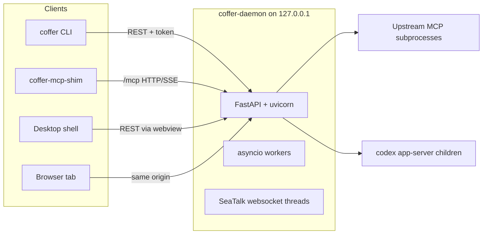
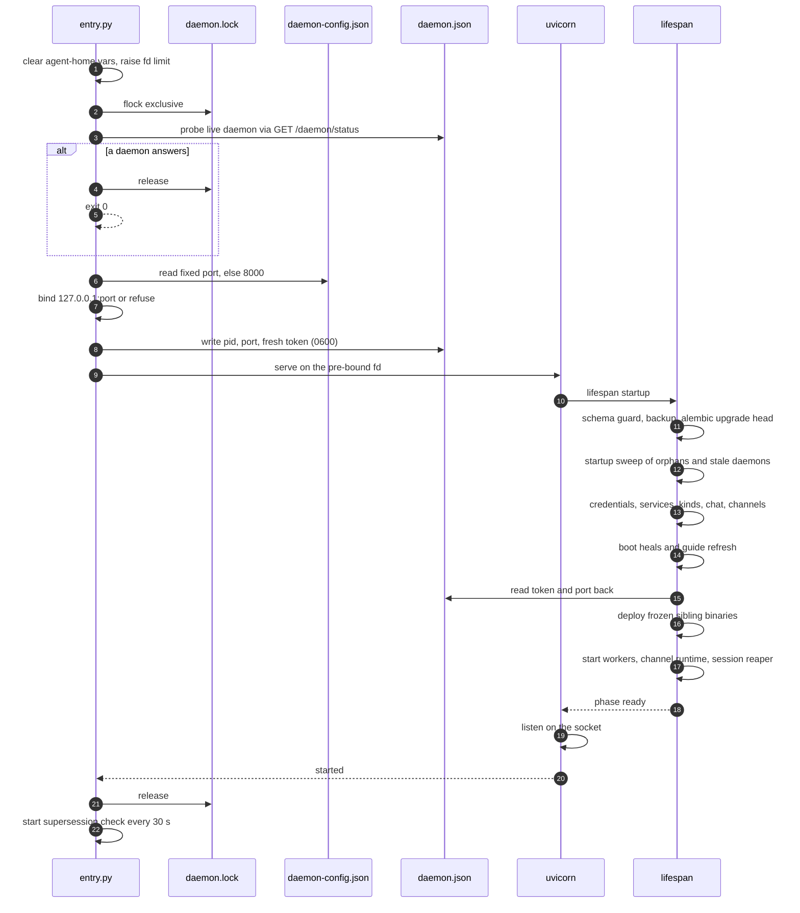
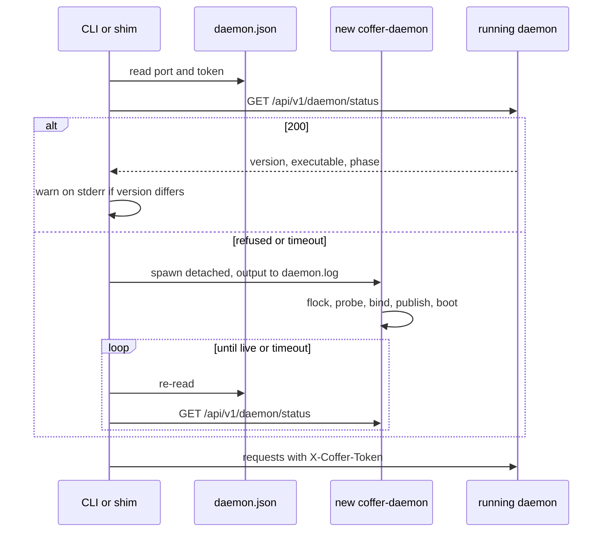
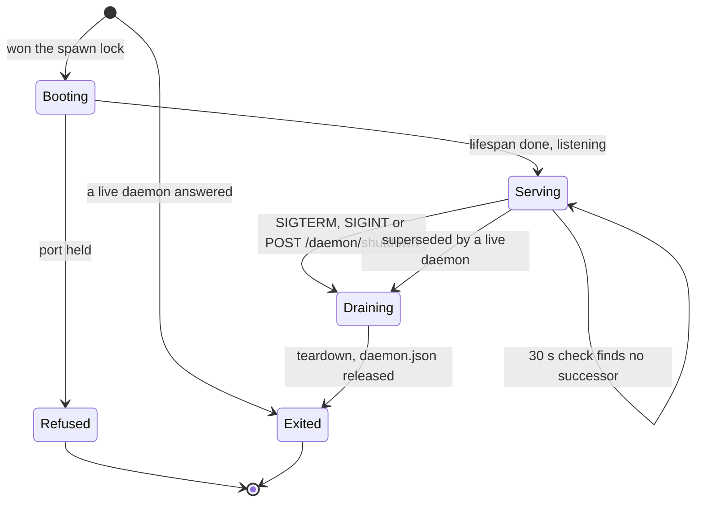

# Daemon and processes

Coffer runs as one long-lived daemon per vault, and every other piece is a client of it: the CLI, the MCP shim an agent launches, the web UI and the desktop shell. This page explains the process model, the exact startup sequence, how a client finds or spawns the daemon without ever producing two, the background workers the daemon runs, and how it stops. It is written for engineers who want to know the mechanism and why it is built this way.

## The problem

A vault has exactly one owner of its state: one SQLite writer, one set of upstream MCP subprocesses, one set of channel connections. But the processes that need that owner come and go on their own schedules. An MCP client starts a shim when an editor opens. A developer runs `coffer skill list` in a terminal. A Telegram message arrives while no window is open. None of these callers should have to know whether Coffer is running, and none of them should ever cause a second daemon, because a second daemon does not fail loudly: it splits the vault's state between two processes and you find out much later.

So the design has to answer four questions:

- Who starts the daemon, and how does a caller find it?
- How do two callers that both find nothing avoid starting two daemons?
- How does a caller know it is talking to the build it expects?
- What keeps the daemon running when nobody has asked for it yet?

## Decisions

| Decision | Reason |
| --- | --- |
| The daemon is an independent, detached process, never a child of its caller. | It must outlive whichever CLI command or shim started it. One client exiting must not take the vault away from the others. |
| Any surface that needs a daemon and finds none spawns one itself (detect-or-spawn). | You never see "start the daemon first". Setup is "run any `coffer` command once". |
| Discovery is one file, `~/.coffer/daemon.json`, mode `0600`. | Every client reads the same answer for port and token. Written atomically, it is never read half-written. |
| The probe, bind, publish and readiness run under one exclusive `flock`, held until the daemon is serving HTTP. | Two racing spawns produce exactly one daemon. |
| Liveness is an HTTP status call, never a TCP connect. | After a crash, an unrelated process can squat the recorded port. |
| The port is fixed (`8000` unless you pin another) and the daemon refuses to start rather than move. | A bookmark to the web UI keeps working, and the browser's per-origin state survives restarts. |
| Version skew is detected and reported, never acted on. | The daemon outlives upgrades. Silently killing it would drop every attached MCP client. |
| The daemon never stands down on its own for want of use. | Agents need it when no Coffer window is open. An idle exit makes the next caller pay a cold start. |

The reasoning is recorded in [Daemon Detect-or-Spawn](https://github.com/wyx-sg/Coffer/blob/main/docs/decisions/daemon-detect-or-spawn.md).

## Processes



| Process | Lifetime | Role |
| --- | --- | --- |
| `coffer-daemon` | Long-lived, one per vault | Serves the REST API (`/api/v1/*`), the MCP endpoint (`/mcp`) and the built web UI on `127.0.0.1:<port>`. It owns all state and is the only SQLite writer. From source it runs as `python -m coffer.infrastructure.daemon.entry`. A frozen build runs the `coffer-daemon` binary. |
| `coffer` CLI | One command | Calls the daemon over loopback HTTP with the token from `daemon.json` and an `X-Coffer-Actor: cli` header, so its mutations are audited as the CLI. |
| `coffer-mcp-shim` | One MCP client session | A stdio ↔ HTTP/SSE forwarder. An agent launches it as a stdio MCP server, and it relays each JSON-RPC line to `/mcp`. See [MCP gateway](/architecture/mcp-gateway). |
| Desktop shell | While the app runs | A Tauri 2 app that hosts the same frontend build as a local asset and hands it the daemon's URL and token over IPC. It detects or spawns the daemon, but the daemon outlives the app: quitting the app does not stop it. See [Desktop app](/guides/desktop-app). |
| Upstream MCP servers | Per client session | Subprocesses the gateway spawns for each `/mcp` session. Each is recorded under `~/.coffer/upstream-pids/` so a later daemon can reap it after a crash. |
| `codex app-server` | Per Codex chat | A long-lived child the chat platform keeps open. It is spawned and recorded through the same path as upstream MCP servers (`infrastructure/daemon/child_process.py`). |
| SeaTalk websocket | Thread inside the daemon | One outbound websocket connection per SeaTalk channel. Nothing listens, and no second process exists. |

There is no separate process for channel inbound traffic. Telegram is polled from the daemon's event loop. SeaTalk's SDK is synchronous, so each SeaTalk channel gets a thread (`seatalk-ws-listen:<name>`) that holds its connection and hands each event back to the loop with `call_soon_threadsafe`. The SDK does not reconnect, so the connector supervises the connection itself. On a failure it backs off exponentially from 1 s up to 30 s. When another registration of the same app kicks it, it waits a flat 60 s, because SeaTalk allows one live connection per app and racing the other holder would only trade the connection back and forth. Because this socket is outbound, the daemon's loopback listener stays the only socket the vault exposes. See [SeaTalk Inbound Over WebSocket](https://github.com/wyx-sg/Coffer/blob/main/docs/decisions/seatalk-websocket-inbound.md).

## Two files: configuration in, runtime state out

The daemon reads one file before it binds and writes another once it has bound. They sit side by side under `~/.coffer/` and are deliberately separate.

| File | Direction | Written by | Contents | Lifetime |
| --- | --- | --- | --- | --- |
| `daemon-config.json` | In | CLI, feature switches, sync machine identity | `port` (optional), `machine_name`, cached `machine_id`, `features` switches, `memory_delivery_withdrawn` | Survives restarts |
| `daemon.json` | Out | The daemon, at start | `version` (schema, currently `1`), `pid`, `port`, `token`, `started_at`, `binary_path` | Unlinked at exit |

`daemon-config.json` cannot live in SQLite, because the port has to be chosen before the database is opened or migrated. It cannot be an environment variable either: whichever caller spawns the daemon passes on its own environment, and a shell profile only reaches your terminal. The file is read with the standard library alone. An unreadable or malformed file logs a warning and reads as "no setting", so a hand-edited typo never keeps the daemon from starting. Writes merge into the existing object and keep keys this build does not know, so a file written by a newer Coffer survives being touched by an older one.

`daemon.json` is written atomically at mode `0600` (`infrastructure/daemon/atomic_write.py`). On exit the daemon unlinks it only while it still records the daemon's own pid, so a daemon that lost a race can never delete the live daemon's discovery file. Every reader treats an absent or malformed file as "no daemon", never as an error.

A sample `daemon.json`:

```json
{
  "version": 1,
  "pid": 48213,
  "port": 8000,
  "token": "q3V0…",
  "started_at": "2026-09-24T08:12:40.118204+00:00",
  "binary_path": "/Users/you/.coffer/bin/0.1.1/coffer-daemon"
}
```

## Startup sequence

Startup happens in two stages. `infrastructure/daemon/entry.py` runs before any web framework code: it wins the vault or exits, binds the socket, and publishes the discovery file. Uvicorn then imports the app, and the FastAPI lifespan in `surfaces/http/app.py` builds everything else. Each wiring step returns what it built and the next step takes it as a parameter, so the order you read in the lifespan is the dependency order.



Step by step:

1. **Environment hygiene.** The daemon removes every agent-home variable it inherited (`CLAUDE_CONFIG_DIR`, `CODEX_HOME`, taken from the agent descriptors). Otherwise a daemon started from a shell that exports one would run agents against that directory while Coffer delivers skills and config into the registered one. It also raises its `RLIMIT_NOFILE` soft limit toward the hard limit, capped at 8192, because a daemon launched by a GUI app inherits a limit of about 256.
2. **Spawn lock.** It takes an exclusive `flock` on `~/.coffer/daemon.lock`. The lock lives on the open descriptor, so the file stays on disk between runs.
3. **Liveness probe.** Under the lock, it calls `GET /api/v1/daemon/status` on the port `daemon.json` records, with a 15 s timeout. The timeout must outlast the slowest status a warming daemon can produce, because a timeout looks exactly like "nobody is live". If a daemon answers, the new process releases the lock and exits 0.
4. **Bind.** It reads the port from `daemon-config.json` (`effective_port()`: the pinned port, else `8000`) and binds exactly `127.0.0.1:<port>` with `SO_REUSEADDR`. It retries four times, 0.3 s apart, so a restart outlasts the outgoing daemon's last moment. If the port is still held, it raises `PortInUse`, prints a message naming the holder's pid and command line, and exits with code 2.
5. **Publish.** It mints a token (`secrets.token_urlsafe(32)`) and writes `daemon.json`. The socket stays open and its file descriptor goes to uvicorn, so the published port is never released and rebound. Otherwise another process could take the port in between and receive the token.
6. **Migrations.** The lifespan runs Alembic off the event loop (`surfaces/http/migrations_runner.py`). If the database's revision is unknown to this build, startup fails with `DB_SCHEMA_TOO_NEW` rather than an opaque Alembic error. If an upgrade is due, the file and its `-wal`/`-shm` companions are first copied to `coffer.db.pre-<revision>`, keeping the three newest copies. A current schema copies nothing. See [Persistence](/architecture/persistence).
7. **Startup sweep.** `orphan_sweep.startup_sweep()` kills every process tree recorded under `~/.coffer/upstream-pids/` that is still alive with the same command line. A frozen build also terminates other daemon processes provably serving this same vault, meaning the same executable name and the same resolved `~/.coffer`. A process whose vault cannot be read is left alone.
8. **Wiring.** The lifespan builds the credential store and master key, the audit and resource services, the retention service, and the internal-engine settings. It creates the builtin-tool registry, wires every resource kind in dependency order (`kind_wiring.py`), then chat, curation and channels. Chat also schedules a one-shot sweep that marks any message left `streaming` by a crash as `failed`.
9. **Boot heals.** Each is best effort: the legacy-keychain migration, the provider projection sweep, skill drift repair, the Claude MCP home migration, memory delivery matched to the `memory` switch, and a re-render of the builtin `coffer-guide` skill from this build.
10. **Identity.** The lifespan reads the token, port and start time back from `daemon.json` into the auth dependency and the status route. A `daemon.json` that exists but cannot be read fails startup. Swallowing that error would leave every authenticated route answering 503 while the status route said ready.
11. **Binary deployment.** A frozen build copies its siblings into `~/.coffer/bin` (see [Binary deployment](#binary-deployment)). From source this does nothing.
12. **Workers.** It starts the background workers, the channel runtime reconciler and the MCP session reaper, then sets the phase to `ready`.

Only after the lifespan returns does uvicorn call `listen()` on the socket, report `started`, and let `entry.py` release the spawn lock. A racing spawn is therefore blocked on the lock for the whole boot, never probing a socket that is bound but not yet answering. When the lock opens, that spawn's probe finds a serving daemon and it exits cleanly. Boot takes several seconds on a real vault (migrations, credential store, upstream warm-up), which is why the probe timeouts are generous.

::: info Status during boot
`GET /api/v1/daemon/status` reports a `status` phase of `starting`, `ready` or `draining`. Because the socket starts listening only after the lifespan has finished, a client in practice sees nothing (connection refused) during boot, then `ready`, then `draining` during teardown.
:::

## Detect-or-spawn

Three surfaces can start a daemon, and all three spawn the same way. `infrastructure/daemon/spawn.py` resolves the command and starts it detached: a new session on POSIX, stdin from `/dev/null`, and stdout and stderr appended to `~/.coffer/logs/daemon.log`. A daemon that refuses to start, for example because its port is taken, explains why in the file every error message points you to.

The daemon command is resolved in this order:

| Build | Candidates, in order |
| --- | --- |
| Source | `[sys.executable, -m, coffer.infrastructure.daemon.entry]` |
| Frozen | `coffer-daemon` beside the running binary, then `coffer-daemon` on `PATH`, then `/Applications/Coffer.app/Contents/MacOS/coffer-daemon` (macOS) |



The surfaces differ only in their budgets and in what they do when the spawn fails:

| Surface | Probe | Spawn wait | On failure |
| --- | --- | --- | --- |
| `coffer …` (any command) | `live_daemon()` | 10 s | Kills the half-started process, prints `daemon failed to start within 10s; check ~/.coffer/logs/daemon.log`, exits 3 |
| `coffer daemon start` | `live_daemon()`, then a trial bind of the planned port | 10 s for `daemon.json` | Prints the port-conflict message before spawning, or the timeout message, and exits 1 |
| `coffer-mcp-shim` | Polls for 1 s | 10 s | Writes `daemon did not come up within 10s` to stderr, exits 3 |
| Desktop shell | Step 1 of its chain | 90 s (`DAEMON_READY_TIMEOUT_SECS`) | Shows the offline banner with the reason |

`coffer daemon start` checks the port before it spawns so that a conflict comes back as an actionable message rather than a boot timeout. The check is a real bind, released immediately. It can only err toward reporting "free", for example through the gap before the daemon's own bind, and a missed conflict still resolves safely as "already running" once the spawned daemon takes the lock.

### The desktop shell's resolution chain

The shell (`desktop/src/resolve.rs`) resolves a daemon in a fixed order:

1. A running daemon named by `~/.coffer/daemon.json` that answers its status call. The shell attaches to it and never spawns.
2. The `coffer-daemon` inside the app bundle.
3. `~/.coffer/bin/coffer-daemon`.
4. `coffer-daemon` on `PATH`.
5. Otherwise, a message telling you to install the CLI.

The liveness check has to come first. Steps 2 to 4 answer "which binary would we spawn", while step 1 answers "should we spawn at all". In the other order, a bundled app would start a second daemon beside the one you already started from a terminal, and under the fixed port that second daemon would refuse to start. The shell spawns detached rather than as a managed sidecar, because a managed sidecar dies with the app, and it gives the child your login shell's `PATH`. Restart from the tray or the offline banner is rate-limited to once every 5 s. It stops the running daemon through `POST /api/v1/daemon/shutdown`, waits up to 8 s for the port to free, and then spawns.

### Shim recovery after a restart

A shim can live for hours, and the daemon may restart underneath it. When a POST to `/mcp` fails to connect, the shim re-reads `daemon.json`. If the port or token changed, it rebinds, drops its old `Mcp-Session-Id`, replays the cached `initialize` envelope against the new daemon, and retries the call once. The agent's MCP client keeps its session.

## Fixed port

The daemon binds one port and never moves off it. With nothing configured that port is `8000`. You can pin another port between 1024 and 65535:

```sh
coffer daemon port show     # the port the next start will bind, and the one in use now
coffer daemon port set 8765 # write it to daemon-config.json
coffer daemon restart       # a running daemon owns its socket; restart to move
coffer daemon port clear    # back to 8000
```

The `port` group works with no daemon running, because you change the port precisely when the daemon cannot start. For that reason the setting has no REST route.

A daemon that scans for a free port breaks two things without saying so: your bookmark to the web UI, and everything the browser has stored against that origin. Refusing to start and naming the process that holds the port is the better failure. When the holder is itself a Coffer daemon, the message says it is most likely your own daemon still warming up rather than telling you to kill it.

::: details Test-harness override
`COFFER_PORT_RANGE_START` / `COFFER_PORT_RANGE_END` bring back a bounded scan (without `SO_REUSEADDR`) so concurrent test daemons do not collide. They outrank your setting so a test run is hermetic. No user-facing surface sets them.
:::

## Version skew

The daemon outlives upgrades, so a newly installed CLI can attach to a daemon from the previous install. The status call reports `version` (the package's `coffer.__version__`) and `executable` (`sys.executable`). `infrastructure/daemon/version_skew.py` compares them with the caller's own build and produces one warning line:

```text
coffer: WARNING: attached to a Coffer daemon at version 0.1.0 (/Users/you/.coffer/bin/0.1.0/coffer-daemon) but this coffer is 0.1.1; run `coffer daemon restart` to serve the current build
```

The CLI prints it on stderr before every command. The shim writes it to stderr and its own log. The desktop shell compares against its crate version (`daemon_version_matches`), and the page it hosts shows a **Daemon out of date** banner with a restart button. None of them refuses to work or kills the daemon: detection, not enforcement, because an automatic kill would drop every MCP session attached to it.

## Background work

Everything that runs outside a request is started in one place, `surfaces/http/background_workers.py`, plus a few tasks the lifespan and entry point own directly. Each worker runs a catch-up pass or a start delay, then loops on an interval. A failing pass is logged and never kills its loop. Each experimental feature's worker reads its switch at the top of every round and skips the round while the feature is off.

| Worker | Code | Cadence | What it does |
| --- | --- | --- | --- |
| Retention | `application/retention_worker.py` | Immediately, then every 6 h | Prunes each registered log-style table to its policy, and ages out files in `~/.coffer/logs/` (including per-process shim logs). |
| Vault converge | `application/sync/worker.py` | First round after 30 s, then on the configured remote's interval (default 1 h). With no remote, or a paused one, it re-checks every 15 min | Runs a converge round with your git remote. A no-op until you configure one, and skipped while `vault_sync` is off. See [Vault sync](/architecture/vault-sync#the-worker). |
| Knowledge curation | `application/knowledge/curate_worker.py` | First sweep after 60 s, then every 60 s by default | Drains each enabled collection's inbox, then documents edited out of band, and re-renders the guide skill. Runs only on the owner machine, and takes the converge round's lock. See [Knowledge](/architecture/knowledge). |
| Memory aggregation | `application/memory/aggregate_worker.py` | Immediately, then hourly by default | Reads each agent's native memory into the derived memory tree. See [Memory](/architecture/memory). |
| Memory distil | `application/memory/distil_worker.py` | First pass after 60 s, then every 6 h by default | Runs the internal-model distil pass over aggregated memory. |
| Transcript warm | `application/agent/transcript_warm_worker.py` | Immediately, then hourly | Keeps the transcript summary cache warm on a thread, so the first visit to an agent's conversations is never the slow one. |
| Channel runtime | `application/channel/runtime.py` | Every 2 s | Reconciles running adapters (Telegram polling, SeaTalk connections) against the channel resources bound to this machine. |
| MCP session reaper | `surfaces/http/mcp/protocol_routes.py` | Every 60 s | Closes `/mcp` sessions idle for more than 30 min, with their per-session supervisors and upstream subprocesses. Tunable with `COFFER_MCP_SESSION_IDLE_S` and `COFFER_MCP_SESSION_REAPER_INTERVAL_S`. |
| Invocation writer | `infrastructure/mcp/invocation_writer.py` | Continuous | Batches MCP invocation-log rows into SQLite off the request path. |
| Supersession check | `infrastructure/daemon/entry.py` | Every 30 s | Stands the daemon down when another live daemon now owns `daemon.json` (see below). |

The curation, aggregation and distil intervals come from the internal-engine settings and are re-read while a worker waits, so a change in **Settings** takes effect without a restart.

Order matters once. Sync is wired before curation starts, because the curation worker takes the converge round's lock, this machine's identity and the pending-round state as parameters. Both rewrite vault content, and an export that caught a curation pass half-way would publish a torn snapshot.

## Standing down

A daemon never exits for want of use, but it does exit when it can prove it has been replaced. Every 30 s it re-reads `daemon.json` and stands down only if the file names a different pid that is a live Coffer daemon. A pid counts as a Coffer daemon when its command line contains `coffer.infrastructure.daemon.entry` or `coffer-daemon`. An absent or malformed file, its own pid, or a dead or recycled pid leaves it serving. Deleting the discovery file must never take the one healthy daemon down with it. A check that fails is logged and retried, never acted on.



## Shutdown

There is one exit path. `SIGTERM` and `SIGINT` run it. `POST /api/v1/daemon/shutdown` (token-gated) answers `204` and then sends `SIGTERM` to its own process, so an API stop and a signal stop cannot diverge. `coffer daemon stop` first confirms the pid in `daemon.json` is still a Coffer daemon. If it is not, it removes the stale file instead of signalling a stranger. Otherwise it sends `SIGTERM` and waits up to 5 s for `daemon.json` to disappear.

Uvicorn then shuts down gracefully with a 10 s bound on open connections. Without that bound, a `/mcp` SSE stream, which never ends on its own, would hold the daemon open forever. The lifespan teardown (`surfaces/http/app_shutdown.py`) sets the phase to `draining` and runs in an order that is load-bearing:

1. Stop the workers: retention, converge, curation, distil, aggregation, transcript warm.
2. Stop the channel runtime, cancelling the reconciler before disposing the adapters so an in-flight tick cannot revive them. Channels go early because they are what starts new turns.
3. Stop the chat turns still running, while the database is still open, so each writes its partial reply as it unwinds.
4. Give the retention worker 2 s to finish a prune, then cancel it.
5. Cancel the session reaper, then drain the buffered invocation writer.
6. Dispose the built-in chat gateway session and every MCP session supervisor, which terminates their upstream subprocesses, then close the `/mcp` session state.
7. Dispose the database engine and clear the active token.

Each step is best effort: a failure is logged with the step's name and does not stop the steps after it. Finally `entry.py` releases `daemon.json` (only if it still names this pid) and closes the socket.

Long-lived children share one termination ladder (`ChildProcess.terminate`): `SIGTERM`, a bounded wait, `SIGKILL`, a bounded wait. The child's pid record is dropped only because the child was reaped here. Upstream MCP wrappers such as `uvx` and `npx` spawn interpreter grandchildren, so the whole process tree is enumerated before any of it is signalled. A crash skips all of this. That is what the pid records and the next daemon's startup sweep are for.

## Binary deployment

A frozen build deploys its siblings (`coffer`, `coffer-daemon`, `coffer-mcp-shim`) into versioned directories under `~/.coffer/bin` during startup, and flips the public names as relative symlinks (`application/binary_deploy.py`). The daemon owns this job because it is the one process every frozen install starts, whether it came from the terminal archive or the `.dmg`. Deploying `coffer-daemon` there is also what lets a frozen shim find a daemon to spawn after a reboot, and what gives the login service a path that survives upgrades. A source install does none of this, because `pip install` already puts `coffer` and `coffer-mcp-shim` on `PATH`.

The copy, sentinel, symlink-flip and pruning rules are described once, in [Distribution and releases](/architecture/distribution#versioned-directories-and-the-symlink-flip).

## Login service

On macOS, `coffer daemon service install` writes a per-user launchd agent, `~/Library/LaunchAgents/dev.coffer.daemon.plist`, so the daemon is running before anything asks for it:

| Key | Value | Why |
| --- | --- | --- |
| `RunAtLoad` | `true` | Up at login, so an agent's first `coffer__*` call of the day does not pay a cold start. |
| `KeepAlive` | `{SuccessfulExit: false}` | A crash is restarted. A clean exit (`coffer daemon stop`, the shell's restart, standing down for a successor) stays down. A plain `KeepAlive: true` would fight each of those. |
| `EnvironmentVariables.PATH` | Your login shell's `PATH` (`$SHELL -l -c`) | A launchd agent otherwise gets a minimal `PATH`, and `npx` / `uvx` upstreams would resolve to nothing. |
| Program | `~/.coffer/bin/coffer-daemon` symlink | A path pinned to a version directory stops working two upgrades later, when that directory is pruned. |
| `StandardOutPath` / `StandardErrorPath` | `~/.coffer/logs/daemon.log` | One log for every writer. |

Install and uninstall work with no daemon running, and are also reachable from the web UI's residency setting (`PUT /api/v1/daemon/residency`). Neither boots a loaded job out. Once launchd has started the daemon, the daemon *is* the job, and `launchctl bootout` would kill the very process answering the settings request. Writing or deleting the plist is enough to decide what happens at the next login, and removing the service leaves a running daemon running.

## Trade-offs and alternatives

- **A daemon per client instead of one shared daemon.** Each MCP client could run its own stdio server with the vault in-process. That gives up the single SQLite writer, the shared upstream supervision and the web UI, and every client would pay the full cold start. Coffer instead runs one daemon and puts the per-client isolation inside it, as per-session upstream subprocesses. See [Session Subprocess Model](https://github.com/wyx-sg/Coffer/blob/main/docs/decisions/session-subprocess-model.md).
- **Releasing the spawn lock at publish time.** This is shorter, but it leaves a sub-second window in which a racing spawn probes a bound-but-not-serving socket, concludes nobody is live and binds a second port. Holding the lock until uvicorn is listening costs the loser a wait of one boot.
- **A dynamic port.** A daemon that scans `8000–8009` never refuses to start, but it silently breaks bookmarks and browser state, and it accumulates orphaned daemons, one per restart, until the range is full. The fixed port turns both failures into one clear message.
- **An idle stand-down.** Exiting after inactivity saves memory but makes the next caller pay a cold start of several seconds, usually an agent in the middle of a task or a channel message that arrives while no window is open. The daemon stays resident, and the login service keeps it available.
- **Auto-restarting a stale daemon on skew.** This would keep builds aligned, but it tears down every attached MCP session without warning. Coffer reports the skew and leaves the restart to you.
- **Loopback plus a token as the whole access model.** Coffer is single-user and local-first, so there is no remote access to guard. The residual risk, a browser page reaching the loopback port through DNS rebinding, is handled by the loopback `Host` check. See [Security model](/architecture/security).

## Where it lives in the code

| Path | Responsibility |
| --- | --- |
| [`infrastructure/daemon/entry.py`](https://github.com/wyx-sg/Coffer/blob/main/backend/coffer/infrastructure/daemon/entry.py) | Process entry: env hygiene, fd limit, serving on the pre-bound fd, supersession check |
| [`infrastructure/daemon/bootstrap.py`](https://github.com/wyx-sg/Coffer/blob/main/backend/coffer/infrastructure/daemon/bootstrap.py) | Spawn lock, liveness probe, bind and publish, `release()` |
| [`infrastructure/daemon/config.py`](https://github.com/wyx-sg/Coffer/blob/main/backend/coffer/infrastructure/daemon/config.py) | `daemon-config.json`: port, machine name and id, feature switches |
| [`infrastructure/daemon/port_alloc.py`](https://github.com/wyx-sg/Coffer/blob/main/backend/coffer/infrastructure/daemon/port_alloc.py) | Fixed-port bind, holder lookup, conflict message, test-only scan |
| [`infrastructure/daemon/pid_lock.py`](https://github.com/wyx-sg/Coffer/blob/main/backend/coffer/infrastructure/daemon/pid_lock.py) | `daemon.json` read and write, `pid_is_coffer_daemon` |
| [`infrastructure/daemon/spawn.py`](https://github.com/wyx-sg/Coffer/blob/main/backend/coffer/infrastructure/daemon/spawn.py) | Spawn-command resolution and the detached spawn |
| [`infrastructure/daemon/version_skew.py`](https://github.com/wyx-sg/Coffer/blob/main/backend/coffer/infrastructure/daemon/version_skew.py) | The skew warning |
| [`infrastructure/daemon/orphan_sweep.py`](https://github.com/wyx-sg/Coffer/blob/main/backend/coffer/infrastructure/daemon/orphan_sweep.py) | Pid records, tree kill, startup sweep of orphans and stale daemons |
| [`infrastructure/daemon/child_process.py`](https://github.com/wyx-sg/Coffer/blob/main/backend/coffer/infrastructure/daemon/child_process.py) | One spawn, record and terminate path for long-lived children |
| [`infrastructure/daemon/login_service.py`](https://github.com/wyx-sg/Coffer/blob/main/backend/coffer/infrastructure/daemon/login_service.py) | launchd agent |
| [`surfaces/http/app.py`](https://github.com/wyx-sg/Coffer/blob/main/backend/coffer/surfaces/http/app.py) | Composition root and lifespan |
| [`surfaces/http/migrations_runner.py`](https://github.com/wyx-sg/Coffer/blob/main/backend/coffer/surfaces/http/migrations_runner.py) | Schema guard, pre-migration backup, `upgrade head` |
| [`surfaces/http/background_workers.py`](https://github.com/wyx-sg/Coffer/blob/main/backend/coffer/surfaces/http/background_workers.py) | Starts every background worker |
| [`surfaces/http/app_shutdown.py`](https://github.com/wyx-sg/Coffer/blob/main/backend/coffer/surfaces/http/app_shutdown.py) | Ordered teardown |
| [`surfaces/http/daemon_routes.py`](https://github.com/wyx-sg/Coffer/blob/main/backend/coffer/surfaces/http/daemon_routes.py) | `/api/v1/daemon/*`: status, residency, shutdown, rotate-token, logs |
| [`application/binary_deploy.py`](https://github.com/wyx-sg/Coffer/blob/main/backend/coffer/application/binary_deploy.py) | Frozen sibling deployment into `~/.coffer/bin` |
| [`surfaces/cli/_client.py`](https://github.com/wyx-sg/Coffer/blob/main/backend/coffer/surfaces/cli/_client.py), [`surfaces/cli/daemon_cmd.py`](https://github.com/wyx-sg/Coffer/blob/main/backend/coffer/surfaces/cli/daemon_cmd.py) | CLI detect-or-spawn and `coffer daemon …` |
| [`surfaces/shim/`](https://github.com/wyx-sg/Coffer/tree/main/backend/coffer/surfaces/shim) | Shim detect-or-spawn, handshake metadata, restart recovery |
| [`desktop/src/resolve.rs`](https://github.com/wyx-sg/Coffer/blob/main/desktop/src/resolve.rs), [`desktop/src/daemon.rs`](https://github.com/wyx-sg/Coffer/blob/main/desktop/src/daemon.rs) | Desktop shell resolution chain, handshake, restart |

## Related

- Specs: [daemon](https://github.com/wyx-sg/Coffer/blob/main/openspec/specs/daemon/spec.md), [desktop-app](https://github.com/wyx-sg/Coffer/blob/main/openspec/specs/desktop-app/spec.md), [experimental-features](https://github.com/wyx-sg/Coffer/blob/main/openspec/specs/experimental-features/spec.md)
- Decision records: [Daemon Detect-or-Spawn](https://github.com/wyx-sg/Coffer/blob/main/docs/decisions/daemon-detect-or-spawn.md), [PyInstaller Distribution](https://github.com/wyx-sg/Coffer/blob/main/docs/decisions/distribution-pyinstaller.md), [The Daemon Serves Its Token in the Page](https://github.com/wyx-sg/Coffer/blob/main/docs/decisions/daemon-serves-the-token-in-the-page.md), [SeaTalk Inbound Over WebSocket](https://github.com/wyx-sg/Coffer/blob/main/docs/decisions/seatalk-websocket-inbound.md), [The Desktop Shell Returns](https://github.com/wyx-sg/Coffer/blob/main/docs/decisions/desktop-shell-over-a-shared-frontend.md)
- Guides: [Running the daemon](/guides/daemon), [Desktop app](/guides/desktop-app), [Troubleshooting](/guides/troubleshooting)
- Reference: [CLI](/reference/cli), [Configuration](/reference/configuration), [Files and directories](/reference/filesystem)
