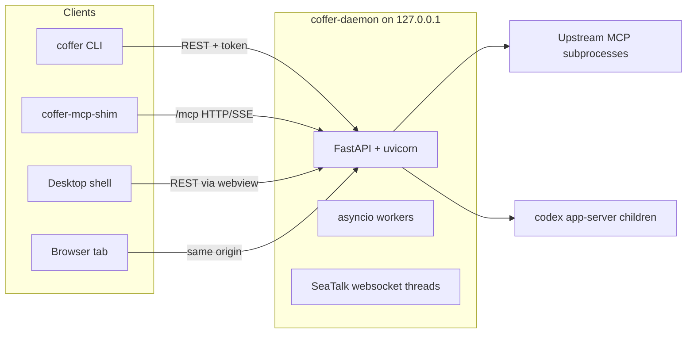
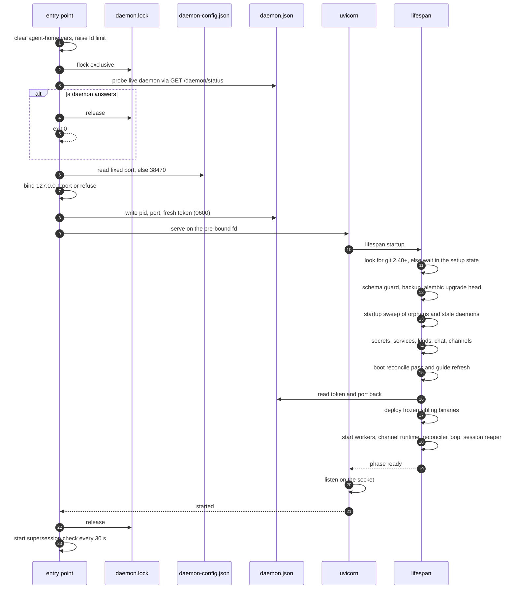
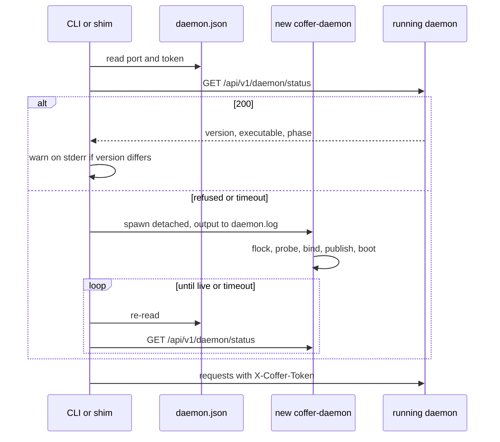
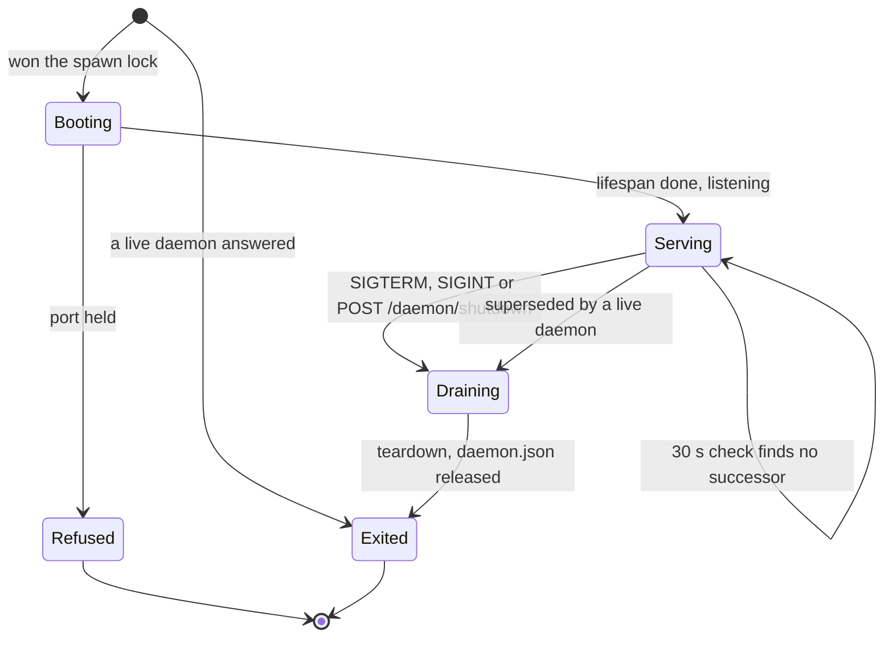

# Daemon and processes

Coffer runs as one long-lived daemon per vault, and every other piece is a client of it: the CLI, the MCP shim an agent launches, the web UI and the desktop shell. This page explains the process model, the exact startup sequence, how a client finds or spawns the daemon without ever producing two, the background workers the daemon runs, and how it stops. It is written for engineers who want to know the mechanism and why it is built this way.

## The problem

A vault has exactly one owner of its state: one SQLite writer, one set of upstream MCP subprocesses, one set of channel connections. But the processes that need that owner come and go on their own schedules. An MCP client starts a shim when an editor opens. A developer runs `coffer daemon status` in a terminal. A Telegram message arrives while no window is open. None of these callers should have to know whether Coffer is running, and none of them should ever cause a second daemon, because a second daemon does not fail loudly: it splits the vault's state between two processes and you find out much later.

So the design has to answer four questions:

- Who starts the daemon, and how does a caller find it?
- How do two callers that both find nothing avoid starting two daemons?
- How does a caller know it is talking to the build it expects?
- What keeps the daemon running when nobody has asked for it yet?

## Decisions

| Decision | Reason |
| --- | --- |
| The daemon is an independent, detached process, never a child of its caller. | It must outlive whichever CLI command or shim started it. One client exiting must not take the vault away from the others. |
| Any surface that needs a daemon and finds none spawns one itself (detect-or-spawn). | You never see "start the daemon first". Setup is "run any `coffer` command once". |
| Discovery is one file, `~/.coffer/daemon.json`, mode `0600`. | Every client reads the same answer for port and token. Written atomically, it is never read half-written. |
| The probe, bind, publish and readiness run under one exclusive `flock`, held until the daemon is serving HTTP. | Two racing spawns produce exactly one daemon. |
| A start waits for that lock for at most two minutes, and a start that meets its own vault's busy daemon on the port leaves as a duplicate. | A boot that hangs, or a daemon too busy to answer, must not turn every later start into one more idle process. |
| An explicit restart forces out a daemon that will not stop; nothing else ever kills a daemon. | A wedged daemon keeps its port, so a polite restart could only fail beside it, and the old process would stay forever. |
| Liveness is an HTTP status call, never a TCP connect. | After a crash, an unrelated process can squat the recorded port. |
| The port is fixed (`38470` unless you pin another) and the daemon refuses to start rather than move. | A bookmark to the web UI keeps working, and the browser's per-origin state survives restarts. |
| Version skew is detected and reported, never acted on. | The daemon outlives upgrades. Silently killing it would drop every attached MCP client. |
| The daemon never stands down on its own for want of use. | Agents need it when no Coffer window is open. An idle exit makes the next caller pay a cold start. |

The reasoning is recorded in [Daemon Detect-or-Spawn](https://github.com/wyx-sg/Coffer/blob/main/docs/decisions/daemon-detect-or-spawn.md).

## Processes


```mermaid
flowchart LR
  subgraph Clients
    CLI["coffer CLI"]
    SHIM["coffer-mcp-shim"]
    DESK["Desktop shell"]
    WEB["Browser tab"]
  end
  subgraph Daemon["coffer-daemon on 127.0.0.1"]
    HTTP["FastAPI + uvicorn"]
    WORK["asyncio workers"]
    WS["SeaTalk websocket threads"]
  end
  UP["Upstream MCP subprocesses"]
  APP["codex app-server children"]
  CLI -- "REST + token" --> HTTP
  SHIM -- "/mcp HTTP/SSE" --> HTTP
  DESK -- "REST via webview" --> HTTP
  WEB -- "same origin" --> HTTP
  HTTP --> UP
  HTTP --> APP
```

| Process | Lifetime | Role |
| --- | --- | --- |
| `coffer-daemon` | Long-lived, one per vault | Serves the REST API (`/api/v1/*`), the MCP endpoint (`/mcp`) and the built web UI on `127.0.0.1:<port>`. It owns all state and is the only SQLite writer. From source it runs as the Python package's daemon entry module. A frozen build runs the `coffer-daemon` binary. |
| Local model proxy | Long-lived, outlives the daemon | `coffer-daemon proxy` in a frozen build (the package's proxy entry module from source), the daemon's only sibling process, on `127.0.0.1:38471`. Agents on an API-key or local provider send their model requests to it; it relays them upstream with the real key and spools usage records the daemon ingests. The daemon spawns it once an agent is routed through it, re-attaches to it after its own restart through `~/.coffer/proxy.json`, and restarts it after a crash. See [The local model proxy](/architecture/model-proxy). |
| `coffer` CLI | One command | Calls the daemon over loopback HTTP with the token from `daemon.json` and an `X-Coffer-Actor: cli` header, so its mutations are audited as the CLI. |
| `coffer-mcp-shim` | One MCP client session | A stdio ↔ HTTP/SSE forwarder. An agent launches it as a stdio MCP server, and it relays each JSON-RPC line to `/mcp`. See [MCP gateway](/architecture/mcp-gateway). |
| Desktop shell | While the app runs | A Tauri 2 app that hosts the same frontend build as a local asset and hands it the daemon's URL and token over IPC. It detects or spawns the daemon, but the daemon outlives the app: quitting the app does not stop it. See [Desktop app](/guides/desktop-app). |
| Upstream MCP servers | Per client session | Subprocesses the gateway spawns for each `/mcp` session. Each is recorded under `~/.coffer/upstream-pids/` so a later daemon can reap it after a crash. |
| `codex app-server` | Per Codex turn | A child the chat platform spawns for the turn and closes when the turn ends. It is spawned and recorded through the same path as upstream MCP servers. |
| SeaTalk websocket | Thread in the daemon, reading a `coffer-seatalk-bridge` child | One outbound websocket connection per SeaTalk channel, held by the bridge process that loads the SDK. Nothing listens. |

Telegram is polled from the daemon's event loop. SeaTalk's SDK is third-party code in a directory an agent can write, so it runs in a separate executable, `coffer-seatalk-bridge`, which has no keychain entitlement and receives the app credentials on standard input; each SeaTalk channel gets its own named thread that reads the bridge's JSON-line events and hands each to the event loop through a thread-safe callback. The SDK does not reconnect, so the connector supervises the connection itself. On a failure it backs off exponentially from 1 s up to 30 s. When another registration of the same app kicks it, it waits a flat 60 s, because SeaTalk allows one live connection per app and racing the other holder would only trade the connection back and forth. Because this socket is outbound, the daemon's loopback listener stays the only socket the vault exposes. See [SeaTalk Inbound Over WebSocket](https://github.com/wyx-sg/Coffer/blob/main/docs/decisions/seatalk-websocket-inbound.md).

## Two files: configuration in, runtime state out

The daemon reads one file before it binds and writes another once it has bound. They sit side by side under `~/.coffer/` and are deliberately separate.

| File | Direction | Written by | Contents | Lifetime |
| --- | --- | --- | --- | --- |
| `daemon-config.json` | In | CLI, feature switches, sync machine identity, the switches on **Settings** and **Settings › About** | `port` (optional), `proxy_port` (optional), `machine_name`, cached `machine_id`, `features` switches, `update_check` (the release check), `record_call_content`, `skill_update_check`, `price_refresh` | Survives restarts |
| `daemon.json` | Out | The daemon, at start | `version` (schema, currently `1`), `pid`, `port`, `token`, `started_at`, `binary_path` | Unlinked at exit |

`daemon-config.json` cannot live in SQLite, because the port has to be chosen before the database is opened or migrated. It cannot be an environment variable either: whichever caller spawns the daemon passes on its own environment, and a shell profile only reaches your terminal. The file is read with the standard library alone. An unreadable or malformed file logs a warning and reads as "no setting", so a hand-edited typo never keeps the daemon from starting. Writes merge into the existing object and keep keys this build does not know, so a file written by a newer Coffer survives being touched by an older one.

`daemon.json` is written atomically at mode `0600`. On exit the daemon unlinks it only while it still records the daemon's own pid, so a daemon that lost a race can never delete the live daemon's discovery file. Every reader treats an absent or malformed file as "no daemon", never as an error.

A sample `daemon.json`:

```json
{
  "version": 1,
  "pid": 48213,
  "port": 38470,
  "token": "q3V0…",
  "started_at": "2026-09-24T08:12:40.118204+00:00",
  "binary_path": "/Users/you/.coffer/bin/0.1.1/coffer-daemon"
}
```

## Startup sequence

Startup happens in two stages. The daemon's process entry point runs before any web framework code: it wins the vault or exits, binds the socket, and publishes the discovery file. Uvicorn then imports the app, and the FastAPI lifespan (the app's startup and shutdown hook, in the HTTP surface's composition root) builds everything else. Each wiring step returns what it built and the next step takes it as a parameter, so the order you read in the lifespan is the dependency order.


```mermaid
sequenceDiagram
  autonumber
  participant E as entry point
  participant L as daemon.lock
  participant C as daemon-config.json
  participant J as daemon.json
  participant U as uvicorn
  participant A as lifespan
  E->>E: clear agent-home vars, raise fd limit
  E->>L: flock exclusive
  E->>J: probe live daemon via GET /daemon/status
  alt a daemon answers
    E->>L: release
    E-->>E: exit 0
  end
  E->>C: read fixed port, else 38470
  E->>E: bind 127.0.0.1:port or refuse
  E->>J: write pid, port, fresh token (0600)
  E->>U: serve on the pre-bound fd
  U->>A: lifespan startup
  A->>A: look for git 2.40+, else wait in the setup state
  A->>A: schema guard, backup, alembic upgrade head
  A->>A: startup sweep of orphans and stale daemons
  A->>A: secrets, services, kinds, chat, channels
  A->>A: boot reconcile pass and guide refresh
  A->>J: read token and port back
  A->>A: deploy frozen sibling binaries
  A->>A: start workers, channel runtime, reconciler loop, session reaper
  A-->>U: phase ready
  U->>U: listen on the socket
  U-->>E: started
  E->>L: release
  E->>E: start supersession check every 30 s
```

Step by step (two arguments skip all of it: `--version` prints the package version, the same line `coffer --version` prints, and exits; `proxy` runs the [local model proxy](/architecture/model-proxy) instead):

1. **Environment hygiene.** A signed build first drops the proxy and CA variables it inherited and takes its proxy settings from the OS instead, so an agent cannot point the daemon's network clients at its own proxy. The daemon then removes every agent-home variable it inherited (`CLAUDE_CONFIG_DIR`, `CODEX_HOME`, taken from the agent descriptors). Otherwise a daemon started from a shell that exports one would run agents against that directory while Coffer delivers skills and config into the registered one. It also raises its `RLIMIT_NOFILE` soft limit toward the hard limit, capped at 8192, because a daemon launched by a GUI app inherits a limit of about 256.
2. **Spawn lock.** It takes an exclusive `flock` on `~/.coffer/daemon.lock` and writes its pid into the file. The lock lives on the open descriptor, so the file stays on disk between runs. The wait is bounded at two minutes: a holder that has not finished booting by then is stuck, and queueing behind it would only add one more idle process for every CLI command, shim, desktop launch and login-service restart. A start that gives up logs the holder's pid and exits 0.
3. **Liveness probe.** Under the lock, it calls `GET /api/v1/daemon/status` on the port `daemon.json` records, with a 15 s timeout. The timeout must outlast the slowest status a warming daemon can produce, because a timeout looks exactly like "nobody is live". If a daemon answers, the new process releases the lock, logs "already running" and exits 0. That line, and every other duplicate exit before logging is configured, is a warning, because only warnings reach the daemon log at that point and a duplicate start must leave a trace.
4. **Bind.** It reads the port from `daemon-config.json` (the pinned port, else `38470`) and binds exactly `127.0.0.1:<port>` with `SO_REUSEADDR`. It retries four times, 0.3 s apart, so a restart outlasts the outgoing daemon's last moment. If the port is still held, it fails with a port-in-use error, prints a message naming the holder's pid and command line, and exits with code 2. When the holder is a Coffer daemon serving this same vault — one too busy to answer the probe in 15 s — the start is a duplicate rather than a failure: it logs that the daemon is already running but busy and exits 0, so the login service does not restart it every few seconds.
5. **Publish.** It mints a fresh random token (URL-safe, from 32 random bytes) and writes `daemon.json`. The socket stays open and its file descriptor goes to uvicorn, so the published port is never released and rebound. Otherwise another process could take the port in between and receive the token.
6. **Git.** Before anything else the lifespan looks for git 2.40 or later: on the daemon's own `PATH`, then on the login shell's, because a daemon started from the Dock or by an editor's MCP shim gets a truncated one. A git found only on the login shell's `PATH` is put first on the daemon's. With none, nothing below runs and the daemon waits for git instead; see [Waiting for git](#waiting-for-git).
7. **Migrations.** The lifespan runs Alembic on `runs.db` off the event loop. If the database's revision is unknown to this build, startup fails with `DB_SCHEMA_TOO_NEW` rather than an opaque Alembic error. If an upgrade is due, the file and its `-wal`/`-shm` companions are first copied to `runs.db.pre-<revision>`, keeping the three newest copies. A current schema copies nothing. See [Persistence](/architecture/persistence).
8. **Startup sweep.** The startup sweep kills every process tree recorded under `~/.coffer/upstream-pids/` that is still alive with the same command line. A frozen build also terminates other daemon processes provably serving this same vault, meaning the same executable name and the same resolved `~/.coffer`. A process whose vault cannot be read is left alone. The sweep also removes `~/.coffer/derived/cache/agent`, the transcript summary cache an earlier version kept.
9. **Wiring.** The lifespan opens the vault repository, starts the vault scanner that settles hand edits, and builds the secret store and master key, the audit and resource services, the retention service, and the internal-engine settings document (the aggregate and distil upkeep and the speech-to-text model). It creates the builtin-tool registry, wires every resource kind in dependency order, then chat, the knowledge sweep and channels. Chat also schedules a one-shot sweep that marks any message left `streaming` by a crash as `failed`.
10. **Boot pass.** The reconciler runs one boot pass over every target it converges: the agents' MCP entries, skill links, provider projections and memory delivery hooks. What it repairs is audited, and a failing pass is logged and never fails startup. Then the builtin `coffer-guide` skill is re-rendered from this build.
11. **Identity.** The lifespan reads the token, port and start time back from `daemon.json` into the auth dependency and the status route. A `daemon.json` that exists but cannot be read fails startup. Swallowing that error would leave every authenticated route answering 503 while the status route said ready.
12. **Binary deployment.** A frozen build copies its siblings into `~/.coffer/bin` (see [Binary deployment](#binary-deployment)). From source this does nothing.
13. **Workers.** It starts the background workers, the channel runtime, the reconciler's periodic loop, the attention watch and the MCP session reaper, then sets the phase to `ready`. The vault scanner, the model proxy supervisor, the usage loops and the price refresh were already started by their kinds' wiring in step 9.

Only after the lifespan returns does uvicorn start listening on the socket, report `started`, and let the entry point release the spawn lock. A racing spawn is therefore blocked on the lock for the whole boot, never probing a socket that is bound but not yet answering. When the lock opens, that spawn's probe finds a serving daemon and it exits cleanly. Boot takes several seconds on a real vault (migrations, secret store, upstream warm-up), which is why the probe timeouts are generous.

::: info Status during boot
`GET /api/v1/daemon/status` reports a `status` phase of `ready` or `draining`, or `setup` while it [waits for git](#waiting-for-git). There is no starting phase: the socket starts listening only after the lifespan has finished, so a client sees a refused connection during boot, then `ready`. When shutdown begins, the daemon's own uvicorn server (a small subclass in the entry point) flips the phase to `draining` and keeps its listener open for about a second before closing it, so a poller can actually observe the phase. The entry point also closes its own copy of the listening socket as soon as uvicorn has its dup, so the port never stays in LISTEN with nobody accepting through the teardown. After that a connection is refused. A client that has just spawned a daemon therefore waits a bounded time for the probe to answer instead of reading a refused connection as a failure.
:::

### Waiting for git

The vault is a git repository, so a daemon without a usable git cannot open it. Refusing to start would leave every client saying only "offline", so the daemon starts anyway, in a **setup state**:

- It runs none of the lifespan's wiring — no migrations, vault, kinds, workers or MCP sessions — and reads its token and port back from `daemon.json`, so the page, the CLI and the desktop shell can talk to it. Its status reports `status: "setup"` and a `setup` object: the reason (`git_missing` or `git_too_old`), the version found and the one needed, a message, and the install or update hand-off.
- A middleware inside CORS answers every other `/api/` route and `/mcp` with 503 `GIT_NEEDED`, carrying the same message and hand-off, except the status, `POST /daemon/setup/check`, restart and shutdown. The CLI prints that refusal as it prints any error with a hand-off, and exits 10; the shim passes it to the agent whole.
- The web UI shows the setup screen in place of every page. **Check again** asks `POST /daemon/setup/check` to look again (both `PATH`s, never cached). Once git is there, the page restarts the daemon the way its host restarts it — the desktop shell from outside, a browser through `POST /daemon/restart` — and the successor starts normally.

Recovery is a restart rather than wiring the vault into the running process. The lifespan is one context whose order is its dependency order and whose teardown is its `finally`, and uvicorn already reports the app as started; finishing the boot later from a request would need a second lifecycle with its own teardown and its own "ready" moment. A restart reuses what already carries a new token and port to the page and the shell. The desktop shell needs nothing new: the setup state answers the status probe with 200, so the launch handshake succeeds and loads the page.

## Detect-or-spawn

Three surfaces can start a daemon, and all three spawn the same way, through one shared spawn helper that resolves the command and starts it detached: a new session on POSIX, stdin from `/dev/null`, and stdout and stderr appended to `~/.coffer/logs/daemon.log`. A daemon that refuses to start, for example because its port is taken, explains why in the file every error message points you to. That file is rotated at 10 MB (three backups kept). Because the detached daemon's own stdout and stderr are descriptors on it, the rotating handler moves those descriptors to the new file after each rollover; otherwise a traceback written straight to stderr would end up in a rotated-away copy that nothing reads. uvicorn is started with its own logging configuration switched off, so its records go through the same JSON handler as everything else.

The daemon command is resolved in this order:

| Build | Candidates, in order |
| --- | --- |
| Source | The Python interpreter the caller is running, started on the package's daemon entry module |
| Frozen | `coffer-daemon` beside the running binary, then `coffer-daemon` on `PATH`, then `/Applications/Coffer.app/Contents/MacOS/coffer-daemon` (macOS) |


```mermaid
sequenceDiagram
  participant S as CLI or shim
  participant J as daemon.json
  participant D as new coffer-daemon
  participant R as running daemon
  S->>J: read port and token
  S->>R: GET /api/v1/daemon/status
  alt 200
    R-->>S: version, executable, phase
    S->>S: warn on stderr if version differs
  else refused or timeout
    S->>D: spawn detached, output to daemon.log
    D->>D: flock, probe, bind, publish, boot
    loop until live or timeout
      S->>J: re-read
      S->>D: GET /api/v1/daemon/status
    end
  end
  S->>R: requests with X-Coffer-Token
```

The surfaces differ only in their budgets and in what they do when the spawn fails:

| Surface | Probe | Spawn wait | On failure |
| --- | --- | --- | --- |
| `coffer …` (any command except `coffer daemon status`) | The shared liveness probe (status call) | 30 s | Prints `daemon failed to start within 30s; check ~/.coffer/logs/daemon.log`, exits 3 |
| `coffer daemon start` | The shared liveness probe, then a trial bind of the planned port | 30 s for the new daemon to answer its status call (`daemon.json` alone does not count) | Prints the port-conflict message before spawning, `daemon exited at startup (code N); check daemon.log` if the child ends first (a refused vault migration); a daemon waiting for git starts, and the command then prints why, or the timeout message, and exits 1 |
| `coffer-mcp-shim` | Polls for 15 s when `daemon.json` names a running Coffer daemon, else for 1 s | 10 s | Writes `daemon did not come up within 10s` to stderr, exits 3 |
| Desktop shell | Step 1 of its chain | 90 s | Shows the offline banner with the reason |

No surface kills a daemon it stopped waiting for. A slow boot then finishes on its own, and one that cannot finish leaves through the spawn lock's bounded wait. A kill would also miss: in the one-file build the process a caller started is the bootloader, and killing it leaves the daemon it unpacked running unseen. The shim waits as long as the liveness probe for a daemon that is running but has not answered, because a busy daemon used to get one more spawn from every MCP session that opened while it was busy.

`coffer daemon status` is the one command that never spawns: it runs the same liveness probe and, when nothing answers, prints `not running` (`{"status": "stopped"}` with `--json`) and exits 3, so asking about the daemon never changes the answer. With a daemon serving, it also lists every other daemon process of the same vault (`other_daemon_pids` under `--json`): a source or frozen daemon whose `HOME` resolves to this `~/.coffer`, never the model proxy, and a one-file bootloader together with its child counted once.

`coffer daemon start` checks the port before it spawns so that a conflict comes back as an actionable message rather than a boot timeout. The check is a real bind, released immediately. It can only err toward reporting "free", for example through the gap before the daemon's own bind, and a missed conflict still resolves safely as "already running" once the spawned daemon takes the lock.

### The desktop shell's resolution chain

The shell resolves a daemon in a fixed order:

1. A running daemon named by `~/.coffer/daemon.json` that answers its status call. The shell attaches to it and never spawns.
2. The `coffer-daemon` inside the app bundle.
3. `~/.coffer/bin/coffer-daemon`.
4. `coffer-daemon` on `PATH`.
5. Otherwise, a message saying this copy of Coffer is probably damaged or incomplete. It lists where the shell looked, points at the install page to download Coffer again, and carries a prompt you can hand to your coding agent.

The liveness check has to come first. Steps 2 to 4 answer "which binary would we spawn", while step 1 answers "should we spawn at all". In the other order, a bundled app would start a second daemon beside the one you already started from a terminal, and under the fixed port that second daemon would refuse to start. The shell spawns detached rather than as a managed sidecar, because a managed sidecar dies with the app, and it gives the child your login shell's `PATH`. Restart from the tray or the offline banner is rate-limited to once every 5 s. It stops the running daemon through `POST /api/v1/daemon/shutdown`, waits up to 8 s for the port to free, and then spawns. A daemon that does not answer its status call within 15 s, or that answers the shutdown request but keeps its port, is forced out first: the shell sends `SIGTERM` to the pid `daemon.json` records once `ps` shows a Coffer daemon command line (never `coffer-daemon proxy`), then `SIGKILL` after 5 s, and waits for the port. A discovery file that names no live Coffer daemon is left alone and the shell goes straight to spawning.

### A restart asked from a browser

A page in a browser is served by the daemon, so it cannot stop the daemon and start another from outside. `POST /api/v1/daemon/restart` has the daemon do both halves itself. It spawns its successor with the ordinary spawn command, detached, with its own environment plus `COFFER_DAEMON_PREDECESSOR_PID`, answers `202` with the port the successor binds, and only after the answer is sent sends itself `SIGTERM` for the ordinary graceful exit. The successor waits for that pid to exit (up to 60 s) before it takes the spawn lock, then starts like any daemon. If the old daemon has not exited after that wait it is wedged, and the successor kills its process tree before going on, so a restart neither yields two daemons nor leaves the old one holding the port. A frozen successor is started with `PYINSTALLER_RESET_ENVIRONMENT=1`, so it unpacks its own files instead of relying on the ones its predecessor removes on exit. The login service is not asked to restart it, because it restarts only failed exits and exists only when Start at login is on. The page then reloads from the successor's origin to pick up the new token.

### Shim recovery after a restart

A shim can live for hours, and the daemon may restart underneath it. When a POST to `/mcp` fails to connect, the shim re-reads `daemon.json`. If the port or token changed, it rebinds, drops its old `Mcp-Session-Id`, replays the cached `initialize` envelope against the new daemon, and retries the call once. The agent's MCP client keeps its session.

## Fixed port

The daemon binds one port and never moves off it. With nothing configured that port is `38470`. You can pin another port between 1024 and 65535:

```sh
coffer config get daemon.port      # the port the next start will bind
coffer config set daemon.port 8765 # write it to daemon-config.json
coffer daemon restart              # a running daemon owns its socket; restart to move
coffer config unset daemon.port    # back to 38470
```

The `daemon.port` key works with no daemon running, because you change the port precisely when the daemon cannot start. For that reason `coffer config set daemon.port` writes straight into the pre-bind settings file rather than through a route, and `coffer config` carries only keys of that kind. The web UI reaches the same file through the running daemon: `GET /api/v1/daemon/port` returns the saved port, the bound one and whether a restart is pending, and `PUT /api/v1/daemon/port` saves the next start's port, refusing one that cannot be bound.

A daemon that scans for a free port breaks two things without saying so: your bookmark to the web UI, and everything the browser has stored against that origin. Refusing to start and naming the process that holds the port is the better failure. When the holder is itself a Coffer daemon, the message says it is most likely your own daemon still warming up rather than telling you to kill it.

::: details Test-harness override
`COFFER_PORT_RANGE_START` / `COFFER_PORT_RANGE_END` bring back a bounded scan (without `SO_REUSEADDR`) so concurrent test daemons do not collide. They outrank your setting so a test run is hermetic. No user-facing surface sets them.

`COFFER_DAEMON_EXIT_WITH_PID` ties a test daemon to its runner: the daemon checks every 2 s and shuts down once that pid has exited. A daemon never idles out, so without it a test run killed before its teardown left its daemon running for good. The e2e daemon script passes Playwright's pid, and tests that start a shim pass their own. The daemon removes the variable from its environment, so nothing it spawns inherits it.
:::

## Version skew

The daemon outlives upgrades, so a newly installed CLI can attach to a daemon from the previous install. The status call reports `version` (the installed Coffer package's version) and `executable` (the path of the interpreter or binary the daemon runs as). One shared check compares them with the caller's own build and produces one warning line:

```text
coffer: WARNING: attached to a Coffer daemon at version 0.1.0 (/Users/you/.coffer/bin/0.1.0/coffer-daemon) but this coffer is 0.1.1; run `coffer daemon restart` to serve the current build
```

The CLI prints it on stderr before every command. The shim writes it to stderr and its own log. The desktop shell compares against its own build version, and the page it hosts shows a **Daemon out of date** banner with a restart button. None of them refuses to work or kills the daemon: detection, not enforcement, because an automatic kill would drop every MCP session attached to it.

## Background work

The periodic workers that belong to no single kind start in one place, the HTTP surface's background-worker launcher. A kind that owns a loop starts it in its own wiring, and the lifespan and entry point own a few tasks directly. Each worker runs a catch-up pass or a start delay, then loops on an interval. A failing pass is logged and never kills its loop. A worker that belongs to an experimental feature reads its switch at the top of every round and skips the round while the feature is off: the knowledge sweep and distil and aggregate each do. Usage ingest, the price refresh and the sync converge worker belong to no experimental feature and check no switch.

| Worker | Cadence | What it does |
| --- | --- | --- |
| Retention | Immediately, then every 6 h | Prunes each registered log-style table to its policy, and ages out files in `~/.coffer/logs/` (including per-process shim logs). |
| Vault sync | First round after 30 s, then on the configured remote's interval (default 1 h). With no remote, or a paused one, it re-checks every minute | Runs a sync round with your git remote. A no-op until you configure one. See [Vault sync](/architecture/vault-sync#the-worker). |
| Knowledge sweep | Immediately, then every 60 s | Files each document dropped into a collection's hidden `.inbox/` as a source under `sources/`, moves loose Markdown outside `pages/` and `sources/` into `pages/`, commits edits found on disk as `disk` writes, and re-renders the guide skill. Runs on every machine. See [Knowledge](/architecture/knowledge). |
| Memory aggregation | Immediately, then hourly by default | Reads each agent's native memory into the derived memory tree. See [Memory](/architecture/memory). |
| Memory distil | First pass after 60 s, then every 6 h by default | Turns each new raw entry in the aggregated memory into a note and renders the index. No model is involved. |
| Channel runtime | Every 2 s | Reconciles running adapters (Telegram polling, SeaTalk connections) against the channel resources bound to this machine. |
| MCP session reaper | Every 60 s | Closes `/mcp` sessions idle for more than 30 min, with their per-session supervisors and upstream subprocesses. Tunable with `COFFER_MCP_SESSION_IDLE_S` and `COFFER_MCP_SESSION_REAPER_INTERVAL_S`. |
| Invocation writer | Continuous | Batches MCP invocation-log rows into SQLite off the request path. |
| Unpack keep-alive | Immediately, then every 6 h | Frozen builds only. Refreshes the timestamps of the files the one-file binary unpacked into `$TMPDIR/_MEI*`, so the OS temp cleaner (macOS removes files unused for about 3 days) cannot delete the CA bundle and libraries from under a long-running daemon. |
| Supersession check | Every 30 s, run by the entry point | Stands the daemon down when another live daemon now owns `daemon.json` (see below). |
| Vault scanner | A boot scan, then on file events and every 60 s | Settles hand edits in the vault into commits. |
| Reconciler | Every 60 s, sooner on a hint | Converges agents' MCP entries, skill links, provider projections and delivery hooks, and records open drift. |
| Attention watch | Every 30 s, sooner on a hint | Recomputes the Overview's "needs you" list and publishes changes on `GET /api/v1/events`. |
| Model proxy supervisor | Every 5 s | Finds the [local model proxy](/architecture/model-proxy), or spawns it once an agent is routed through it, pushes it its state and restarts it with backoff if it dies. |
| Usage ingest | Every 2 s | Empties the proxy's usage spool into `runs.db`. |
| Price refresh | First after 60 s, then daily | Refreshes the model price list used to estimate cost. |
| Provider health | Once at boot, then every 30 min, and again on each edit to a connection | Lists each enabled model provider's models to tell whether its endpoint answers and accepts the key, and feeds the providers' attention items. |
| Release check | First after 60 s, then daily | Installer binaries only. Asks GitHub for the latest Coffer release and reports a newer one on **Settings › About**. Off when `update_check` is off or `COFFER_UPDATE_CHECK=off`. See [Distribution](/architecture/distribution#how-the-installer-s-binaries-update). |

The aggregation and distil intervals come from the internal-engine settings and are re-read while a worker waits, so a change in **Settings** takes effect without a restart. The sweep's 60 s interval is fixed.

## Standing down

A daemon never exits for want of use, but it does exit when it can prove it has been replaced. Every 30 s it re-reads `daemon.json` and stands down only if the file names a different pid that is a live Coffer daemon. A pid counts as a Coffer daemon when its command line names the daemon's entry module (a source run) or `coffer-daemon` (a frozen build). An absent or malformed file, its own pid, or a dead or recycled pid leaves it serving. Deleting the discovery file must never take the one healthy daemon down with it. A check that fails is logged and retried, never acted on.


```mermaid
stateDiagram-v2
  [*] --> Booting: won the spawn lock
  [*] --> Exited: a live daemon answered
  Booting --> Refused: port held
  Booting --> Serving: lifespan done, listening
  Serving --> Serving: 30 s check finds no successor
  Serving --> Draining: SIGTERM, SIGINT or POST /daemon/shutdown
  Serving --> Draining: superseded by a live daemon
  Draining --> Exited: teardown, daemon.json released
  Refused --> [*]
  Exited --> [*]
```

## Shutdown

There is one exit path. `SIGTERM` and `SIGINT` run it. `POST /api/v1/daemon/shutdown` (token-gated) answers `204` and then sends `SIGTERM` to its own process, so an API stop and a signal stop cannot diverge. `coffer daemon stop` first confirms the pid in `daemon.json` is still a Coffer daemon. If it is not, it removes the stale file instead of signalling a stranger. Otherwise it sends `SIGTERM` and waits up to 15 s for `daemon.json` to disappear, then reports a daemon that has not exited and leaves it alone. `coffer daemon restart` goes one step further: after the same 15 s it kills the daemon's process tree — only once the pid is proven to be a Coffer daemon serving this vault — and removes the discovery file the killed daemon could not.

Uvicorn then shuts down gracefully with a 10 s bound on open connections. Without that bound, a `/mcp` SSE stream, which never ends on its own, would hold the daemon open forever. The lifespan teardown runs in an order that is load-bearing:

1. Cancel the reconciler's loop first, because a pass writes into agents' config files and must not start while the rest goes down, then the attention watch.
2. Stop the workers: retention, sync, the knowledge sweep, distil, aggregation, and the skill update check (which also removes staged sources).
3. Stop the channel runtime, cancelling the reconciler before disposing the adapters so an in-flight tick cannot revive them. Channels go early because they are what starts new turns.
4. Stop the chat turns still running, while the database is still open, so each writes its partial reply as it unwinds.
5. Give the retention worker 2 s to finish a prune, then cancel it.
6. Cancel the session reaper, then drain the buffered invocation writer.
7. Stop supervising the model proxy (the proxy itself keeps running, so agents' in-flight model streams survive a restart), then stop the price refresh and the usage loops.
8. Dispose every MCP session supervisor, including the process-wide one behind the management routes, which terminates their upstream subprocesses, then close the `/mcp` session state.
9. Cancel, with a bound, every supervised background task its owner did not stop above, such as the release check, before the database it may be writing to goes.
10. Dispose the database engine and clear the active token.
11. Stop the vault scanner, then dispose the derived database.

Each step is best effort: a failure is logged with the step's name and does not stop the steps after it. Finally the entry point releases `daemon.json` (only if it still names this pid) and closes the socket. Once nothing serves, it deletes `~/.coffer` if an uninstall asked for the data to go, and last it boots out a start-at-login job that an uninstall removed while this daemon was running under it.

Long-lived children share one termination ladder: `SIGTERM`, a bounded wait, `SIGKILL`, a bounded wait. The child's pid record is dropped only because the child was reaped here. Upstream MCP wrappers such as `uvx` and `npx` spawn interpreter grandchildren, so the whole process tree is enumerated before any of it is signalled. A crash skips all of this. That is what the pid records and the next daemon's startup sweep are for.

## Binary deployment

A frozen build deploys its siblings (`coffer`, `coffer-daemon`, `coffer-mcp-shim`, `coffer-seatalk-bridge`) into versioned directories under `~/.coffer/bin` during startup, and flips the public names as relative symlinks. The daemon owns this job because it is the one process every frozen install starts, whether it came from the terminal archive or the `.dmg`. Deploying `coffer-daemon` there is also what lets a frozen shim find a daemon to spawn after a reboot, and what gives the login service a path that survives upgrades. A source install does none of this, because `pip install` already puts `coffer` and `coffer-mcp-shim` on `PATH`.

The copy, sentinel, symlink-flip and pruning rules are described once, in [Distribution and releases](/architecture/distribution#versioned-directories-and-the-symlink-flip).

## Login service

On macOS, turning on **Start at login** (**Settings › Daemon**) writes a per-user launchd agent, `~/Library/LaunchAgents/dev.coffer.daemon.plist`, so the daemon is running before anything asks for it:

| Key | Value | Why |
| --- | --- | --- |
| `RunAtLoad` | `true` | Up at login, so an agent's first `coffer__*` call of the day does not pay a cold start. |
| `KeepAlive` | `{SuccessfulExit: false}` | A crash is restarted. A clean exit (`coffer daemon stop`, the shell's restart, standing down for a successor) stays down. A plain `KeepAlive: true` would fight each of those. |
| `EnvironmentVariables.PATH` | Your login shell's `PATH` (`$SHELL -l -c`) | A launchd agent otherwise gets a minimal `PATH`, and `npx` / `uvx` upstreams would resolve to nothing. |
| Program | `~/.coffer/bin/coffer-daemon` symlink | A path pinned to a version directory stops working two upgrades later, when that directory is pruned. |
| `StandardOutPath` / `StandardErrorPath` | `~/.coffer/logs/daemon.log` | One log for every writer. |

Turning it on and off is the web UI's residency setting (`PUT /api/v1/daemon/residency`). Uninstall deletes the plist and then boots the job out, with one exception that keeps the request alive. Once launchd has started the daemon, the daemon *is* the job, and `launchctl bootout` would kill the very process answering the settings request. So when a process is running under the job, the uninstall leaves it running and the daemon boots its own job out as it exits (the last step of the entry point). Without that, launchd would go on restarting a crashed daemon from the definition it still holds after the user switched Start at login off. A loaded job with nothing running under it is booted out at once.

## Trade-offs and alternatives

- **A daemon per client instead of one shared daemon.** Each MCP client could run its own stdio server with the vault in-process. That gives up the single SQLite writer, the shared upstream supervision and the web UI, and every client would pay the full cold start. Coffer instead runs one daemon and puts the per-client isolation inside it, as per-session upstream subprocesses. See [Session Subprocess Model](https://github.com/wyx-sg/Coffer/blob/main/docs/decisions/session-subprocess-model.md).
- **Releasing the spawn lock at publish time.** This is shorter, but it leaves a sub-second window in which a racing spawn probes a bound-but-not-serving socket, concludes nobody is live and binds a second port. Holding the lock until uvicorn is listening costs the loser a wait of one boot.
- **A dynamic port.** A daemon that scans `8000–8009` never refuses to start, but it silently breaks bookmarks and browser state, and it accumulates orphaned daemons, one per restart, until the range is full. The fixed port turns both failures into one clear message.
- **An idle stand-down.** Exiting after inactivity saves memory but makes the next caller pay a cold start of several seconds, usually an agent in the middle of a task or a channel message that arrives while no window is open. The daemon stays resident, and the login service keeps it available.
- **Auto-restarting a stale daemon on skew.** This would keep builds aligned, but it tears down every attached MCP session without warning. Coffer reports the skew and leaves the restart to you.
- **Loopback plus a token as the whole access model.** Coffer is single-user and local-first, so there is no remote access to guard. The residual risk, a browser page reaching the loopback port through DNS rebinding, is handled by the loopback `Host` check. See [Security model](/architecture/security).

## Where it lives in the code

| Place | Responsibility |
| --- | --- |
| The `daemon` package in the infrastructure layer | Process entry and environment hygiene, the spawn lock, liveness probe, fixed-port bind and publish, `daemon-config.json` and `daemon.json`, spawn-command resolution, the skew warning, pid records and the startup sweep, the long-lived child path, the self-restart, the unpack keep-alive, the launchd agent, the release check, the uninstall data purge |
| The HTTP surface | Composition root and lifespan, the startup migration step, the background-worker launcher, ordered teardown, the `/api/v1/daemon/*` routes (status, residency, shutdown, restart, rotate-token, logs, port, setup/check, upgrade, upgrade/check, upgrade/auto-check, uninstall). `coffer update` and the release check are described in [Distribution](/architecture/distribution#how-the-installer-s-binaries-update) |
| The application layer | Frozen sibling deployment into `~/.coffer/bin` |
| The CLI surface | CLI detect-or-spawn and `coffer daemon …` |
| The shim surface | Shim detect-or-spawn, handshake metadata, restart recovery |
| The desktop shell (`desktop/`) | Resolution chain, handshake, restart |

## Related

- Specs: [daemon](https://github.com/wyx-sg/Coffer/blob/main/openspec/specs/daemon/spec.md), [desktop-app](https://github.com/wyx-sg/Coffer/blob/main/openspec/specs/desktop-app/spec.md), [experimental-features](https://github.com/wyx-sg/Coffer/blob/main/openspec/specs/experimental-features/spec.md)
- Decision records: [Daemon Detect-or-Spawn](https://github.com/wyx-sg/Coffer/blob/main/docs/decisions/daemon-detect-or-spawn.md), [PyInstaller Distribution](https://github.com/wyx-sg/Coffer/blob/main/docs/decisions/distribution-pyinstaller.md), [A Per-Start Token, Handed to the Page by Whoever Hosts It, Behind a Loopback Host Guard](https://github.com/wyx-sg/Coffer/blob/main/docs/decisions/daemon-auth-and-origin-guard.md), [SeaTalk Inbound Over WebSocket](https://github.com/wyx-sg/Coffer/blob/main/docs/decisions/seatalk-websocket-inbound.md), [The Desktop Shell Returns](https://github.com/wyx-sg/Coffer/blob/main/docs/decisions/desktop-shell-over-a-shared-frontend.md)
- Guides: [Running the daemon](/guides/daemon), [Desktop app](/guides/desktop-app), [Troubleshooting](/guides/troubleshooting)
- Reference: [CLI](/reference/cli), [Configuration](/reference/configuration), [Files and directories](/reference/filesystem)
