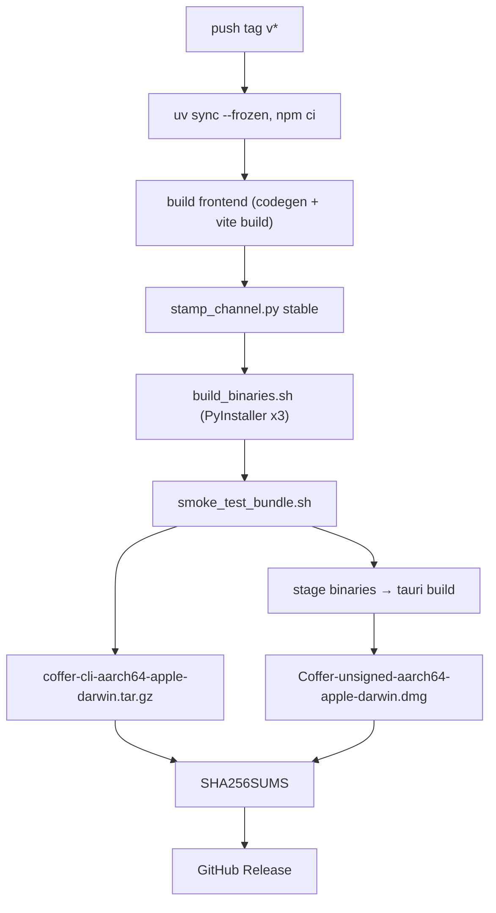
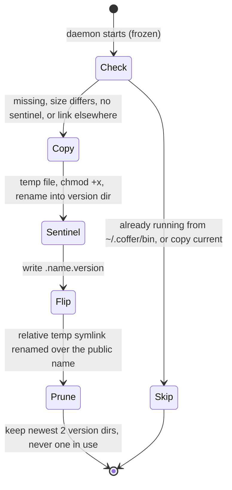
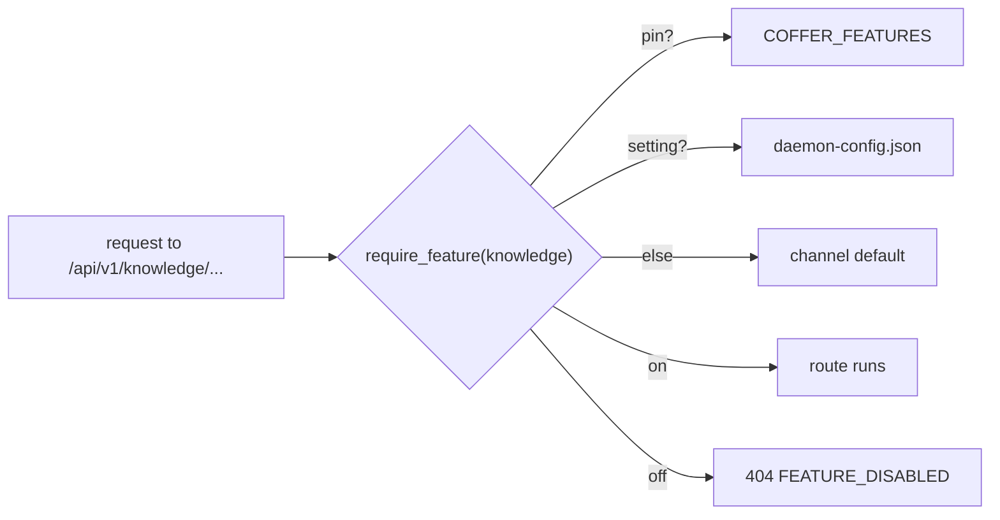

# Distribution and releases

This page explains how Coffer's Python code reaches a machine with no Python on it: the three frozen binaries, the release workflow that produces them, the two download tiers, how a new build is installed beside the old one, and how the release channel decides which experimental features are on. It is for contributors who build or release Coffer and for anyone who wants to know what is actually on their disk.

## The problem

Coffer is a Python program, but its users are people running AI coding agents, not Python developers. A distribution that asks them to install the right Python, create a virtual environment and recover from a wheel build error loses most of them before the first run. At the same time:

- **Three processes have to find each other.** The MCP client launches `coffer-mcp-shim`; the shim has to find and, if needed, start `coffer-daemon`; the `coffer` CLI has to do the same.
- **Upgrades must not break the running system.** A daemon may be running, and an MCP client may be about to spawn a shim, at the moment a new build lands.
- **Unfinished features must ship without harming people who did not ask for them.** A single release line serves both the owner's daily testing and everyone else.
- **Coffer is self-distributed and unsigned.** There is no paid Apple Developer ID behind it, which has consequences for Gatekeeper and for the keychain.

## Design decisions

| Decision | Reason |
| --- | --- |
| Freeze each entry point with PyInstaller into a single-file executable | Runs on a clean machine with no Python; one build serves CLI use, MCP-client spawn and direct download. |
| Ship three binaries, always together | The shim and the CLI find `coffer-daemon` as a sibling, so co-location is the discovery mechanism. |
| Two download tiers built in one job from the same binaries | The desktop app cannot drift from the CLI archive it wraps. |
| The daemon deploys its siblings into versioned directories under `~/.coffer/bin` and flips symlinks | A deploy never overwrites a binary that may be running, and the previous build stays for a manual rollback. |
| A release channel (`stable` or `dev`) stamped into the build | Experimental features default off for tagged releases and on for everything else, without a release branch. |
| Experimental features gated at request time, per machine | Switching a feature takes effect without a restart and never deletes what it holds. |
| Unsigned builds, with the credential store designed around it | Coffer does not gate its user experience on a paid Apple account. |

## The binaries

| Binary | Entry point | Spec file | What it contains |
| --- | --- | --- | --- |
| `coffer-daemon` | `coffer/infrastructure/daemon/entry.py` | [`backend/coffer-daemon.spec`](https://github.com/wyx-sg/Coffer/blob/main/backend/coffer-daemon.spec) | The whole backend: FastAPI and uvicorn, SQLAlchemy and aiosqlite, alembic with its migration scripts as data files, the MCP SDK, document converters, model SDKs, and the built web UI when `frontend/dist/index.html` exists at build time. |
| `coffer-mcp-shim` | `coffer/surfaces/shim/main.py` | [`backend/coffer-mcp-shim.spec`](https://github.com/wyx-sg/Coffer/blob/main/backend/coffer-mcp-shim.spec) | The stdio-to-HTTP bridge an MCP client launches. Excludes FastAPI, uvicorn, SQLAlchemy, alembic and structlog, so it starts quickly for clients that spawn it every session. |
| `coffer` | `coffer/surfaces/cli/main.py` | [`backend/coffer.spec`](https://github.com/wyx-sg/Coffer/blob/main/backend/coffer.spec) | The Typer CLI, httpx, and the `keyring` backends. Excludes the server stack and the MCP SDK. |

Each spec is a single-file `EXE` with `console=True` and `upx=False`, and each freezes the interpreter option `-X utf8` in. That option matters only for the shipped binary: an unfrozen interpreter in the C locale turns UTF-8 mode on by itself, but a frozen binary started from Finder or launchd with no `LANG` would otherwise fall back to ASCII.

PyInstaller finds imports by static analysis, so anything imported lazily inside a function — document converters, model SDKs — is pinned in the spec's `hiddenimports`, and package data files are collected explicitly. [`scripts/check_pyinstaller_specs.py`](https://github.com/wyx-sg/Coffer/blob/main/scripts/check_pyinstaller_specs.py) runs in `make lint` and fails when a spec's entry script or a `datas` source path no longer exists, or when a spec loses `-X utf8`. No CI job other than the release runs PyInstaller, so this check is what keeps the specs level with the tree between releases.

### Building locally

```sh
make bundle-binaries        # runs scripts/build_binaries.sh → dist/coffer, dist/coffer-daemon, dist/coffer-mcp-shim
bash scripts/smoke_test_bundle.sh dist
```

[`scripts/build_binaries.sh`](https://github.com/wyx-sg/Coffer/blob/main/scripts/build_binaries.sh) runs PyInstaller from `backend/` (where the specs' relative paths resolve) with output redirected to the repository's `dist/` and `build/`. It detects the host's target triple (`aarch64-apple-darwin`, `x86_64-apple-darwin`, the Linux and Windows triples) for naming, but builds only for the host.

[`scripts/smoke_test_bundle.sh`](https://github.com/wyx-sg/Coffer/blob/main/scripts/smoke_test_bundle.sh) starts the bundled daemon under an isolated `HOME`, waits for `daemon.json` and `/api/v1/daemon/status`, checks that `/` serves the bundled web UI, then sends one JSON-RPC `initialize` through the bundled shim and expects a reply within 15 seconds.

## The release workflow

[`.github/workflows/release.yml`](https://github.com/wyx-sg/Coffer/blob/main/.github/workflows/release.yml) runs on a pushed `v*` tag (and on manual dispatch, which builds artifacts without publishing). It has one build job on a `macos-14` runner for `aarch64-apple-darwin`, and one publish job.



1. Install the backend from `backend/uv.lock` with `uv sync --frozen`, so the tagged build uses exactly the locked dependency set.
2. Build the frontend (`npm run codegen`, `npm run build`). The daemon spec picks up `frontend/dist` as the served web UI.
3. On a tag, run `scripts/stamp_channel.py stable` (see [Release channels](#release-channels)).
4. Freeze the three binaries and run the smoke test against `dist/`.
5. Package `coffer`, `coffer-daemon` and `coffer-mcp-shim` into `coffer-cli-<triple>.tar.gz`.
6. Copy the same three files to `desktop/binaries/<name>-<triple>` and run `tauri build`, producing the `.dmg`, published as `Coffer-unsigned-<triple>.dmg`.
7. Write `SHA256SUMS` over every artifact, then create (or update, with `--clobber`) the GitHub Release for the tag.

Only macOS on Apple Silicon is published. The specs and build script are cross-platform, so widening the release matrix is a workflow change rather than a redesign.

Versions are kept in several files that must agree exactly — the Python package, the frontend `package.json` and lockfile, the desktop crate and `tauri.conf.json` among them. [`scripts/bump_version.py`](https://github.com/wyx-sg/Coffer/blob/main/scripts/bump_version.py) rewrites all of them in one step, and an integration test pins that they agree. The desktop app compares its own version with the `version` reported by `/api/v1/daemon/status`; when they differ, the web UI shows a **Daemon out of date** banner with a restart action.

## The desktop bundle

The desktop app is a Tauri 2 shell around the same web UI the daemon serves ([`desktop/tauri.conf.json`](https://github.com/wyx-sg/Coffer/blob/main/desktop/tauri.conf.json)). It bundles `app` and `dmg` targets, loads `frontend/dist` as local assets, and lists the three binaries as `externalBin`. Tauri resolves each `binaries/<name>` entry to `binaries/<name>-<target-triple>` and places it in `Coffer.app/Contents/MacOS/`, next to the app's own executable.

When the app starts, it resolves a daemon in a fixed order: an already-running daemon named by `~/.coffer/daemon.json` (attached to, never re-spawned); the binary inside the app bundle; `~/.coffer/bin/coffer-daemon`; `coffer-daemon` on `PATH`; otherwise a message telling you to install the CLI. The shell never writes to `~/.coffer/bin` itself — the daemon it starts does that (next section). Installing the app therefore installs the CLI too.

| Target | What it does |
| --- | --- |
| `make desktop` | Builds the frontend, runs `make bundle-binaries`, stages the binaries under the host triple, and runs `tauri build`. Produces an unsigned `.app` and `.dmg` under `desktop/target/release/bundle/`. Takes roughly 50 minutes, mostly PyInstaller. |
| `make desktop-stage-binaries` | Stages placeholder scripts for any missing `externalBin` entry, so `cargo` can compile the crate without a frozen build. |
| `make desktop-lint` | `cargo check` and `cargo clippy -D warnings`. |
| `make desktop-test` | `cargo test`. |

The `desktop` GitHub workflow runs `desktop-lint` and `desktop-test` on Ubuntu for changes under `desktop/`; it never bundles. None of the desktop targets are part of `make verify`, because they need a Rust toolchain.

See [Desktop app](/guides/desktop-app) for using it.

## Installing into `~/.coffer/bin`

### The one-line installer

[`install.sh`](https://github.com/wyx-sg/Coffer/blob/main/docs-site/public/install.sh) is served from the documentation site and is POSIX `sh`:

```sh
curl -fsSL --proto '=https' --tlsv1.2 https://wyx-sg.github.io/Coffer/install.sh | sh
```

It accepts only macOS on `arm64` and points everyone else at a source install. It downloads `coffer-cli-aarch64-apple-darwin.tar.gz` and `SHA256SUMS` from the latest release (or the tag in `COFFER_VERSION`), verifies the archive's checksum, copies the three binaries into `COFFER_INSTALL_DIR` (default `~/.coffer/bin`), and — unless `COFFER_NO_MODIFY_PATH=1` — appends a `PATH` line to your shell profile (`.zshrc`, `.bash_profile`, fish's `config.fish`, or `.profile`) if the directory is not already on `PATH`. A binary downloaded by `curl` is never quarantined, so this path needs no `xattr` step. See [Install](/start/install).

### Versioned directories and the symlink flip

Every frozen daemon, whichever tier it came from, deploys its sibling binaries at startup ([`application/binary_deploy.py`](https://github.com/wyx-sg/Coffer/blob/main/backend/coffer/application/binary_deploy.py)). A source install skips this, because `pip install` already put the console scripts on `PATH`.

```text
~/.coffer/bin/
├── coffer            -> 0.2.0/coffer
├── coffer-daemon     -> 0.2.0/coffer-daemon
├── coffer-mcp-shim   -> 0.2.0/coffer-mcp-shim
├── 0.2.0/
│   ├── coffer-daemon
│   ├── .coffer-daemon.version
│   └── …
└── 0.1.1/            the previous build, kept for rollback
```



For each of `coffer`, `coffer-daemon` and `coffer-mcp-shim`:

1. **Decide.** A deploy is needed when `~/.coffer/bin/<version>/<name>` is missing, differs in size from the running build's sibling, lacks its `.<name>.version` sentinel (a copy that never completed), or the public name does not point at it. Modification time is not used: it records when a build was extracted, not what it contains.
2. **Copy.** The binary is copied to a temporary name, made executable, and renamed into the version directory. The sentinel is written last, so a sentinel means a complete copy.
3. **Flip.** A relative symlink is created under a temporary name and renamed over `~/.coffer/bin/<name>`. A concurrent `exec` sees either the old binary or the new one, never a partial file.
4. **Retire and prune.** A public symlink into a version directory under a name this build no longer ships is removed. Version directories beyond the newest two are deleted, except any directory a public symlink still points into.

Deployment is best-effort: a binary that cannot be copied is logged and skipped, and the daemon starts anyway. To roll back by hand, point the three symlinks at the previous version directory.

Before running database migrations, the daemon also copies `coffer.db` (and its `-wal`/`-shm` files) to `coffer.db.pre-<revision>`, keeping the three most recent copies. See [Persistence](/architecture/persistence).

::: warning
`install.sh` copies plain files into `~/.coffer/bin`. A daemon running from `~/.coffer/bin` itself skips the deploy, so an installer-only machine has no version directories until a build from another location (such as the desktop app) starts a daemon.
:::

## Release channels

Every build carries a channel in [`backend/coffer/build_channel.py`](https://github.com/wyx-sg/Coffer/blob/main/backend/coffer/build_channel.py):

```python
CHANNEL: Literal["stable", "dev"] = "dev"
```

The repository always says `dev`. The release workflow runs `scripts/stamp_channel.py stable` before PyInstaller on a tag, so only a tagged release is `stable`. Whether the binary is frozen is not the signal: the owner's own testing build is frozen too and stays `dev`. The channel is reported as `channel` by `/api/v1/daemon/status`, and its only effect is the default state of experimental features.

## Experimental features

An experimental feature is a capability that ships in every build but is switched off by default on `stable`. The registry in [`backend/coffer/domain/features.py`](https://github.com/wyx-sg/Coffer/blob/main/backend/coffer/domain/features.py) is the one list; anything not in it is always on.

| Key | REST prefix it owns | Resource kind it owns |
| --- | --- | --- |
| `vault_sync` | `/api/v1/sync` | |
| `knowledge` | `/api/v1/knowledge` | `knowledge` |
| `memory` | `/api/v1/memory` | `memory` |

A feature's state is resolved on every read, highest precedence first:

1. a pin from the `COFFER_FEATURES` environment variable (`key=on|off`, comma-separated), fixed for the daemon's lifetime;
2. the machine's own setting, stored in `~/.coffer/daemon-config.json`;
3. the channel default — on for `dev`, off for `stable`.



The gates are request-time:

- Every router whose prefix falls under a feature's prefix is mounted with a `require_feature` dependency. The routes stay registered, so the OpenAPI document never changes with the switch, and a switch takes effect on the next request.
- The kind-agnostic `/api/v1/resources` routes refuse a resource whose kind a switched-off feature owns, and leave such resources out of lists.
- The MCP gateway drops the feature's builtin tools from the tool list and answers a call to one as an unknown tool; the handshake instructions and the `coffer-guide` skill stop naming them.
- CLI commands reach the daemon over the gated routes and print one line naming `coffer daemon features enable <key>`, then exit 1.
- Background passes owned by the feature skip their rounds.

Switching a feature off never deletes, moves or rewrites what it holds; switching it back on resumes from the same state. Features change with **Settings → General**, `coffer daemon features enable|disable <key>`, or `PUT /api/v1/daemon/features/{key}`; a pinned feature refuses the change with `409 FEATURE_PINNED`. A feature leaves the registry once it is ready, and its gates are deleted with it. See [Experimental features](/guides/experimental-features).

## Code signing and the keychain

Coffer's builds are not signed or notarised, because both require a paid Apple Developer ID.

- **Gatekeeper.** macOS quarantines a downloaded archive or `.dmg`. Clear it with `xattr -dr com.apple.quarantine <extracted-directory>`, or `xattr -dr com.apple.quarantine /Applications/Coffer.app` after dragging the app across. The one-line installer's download is not quarantined. The release notes and the `.dmg` file name (`Coffer-unsigned-…`) say this up front.
- **The keychain.** macOS ties a keychain item's access list to the signature of the binary that created it, so every unsigned rebuild would re-prompt for every secret stored there. This is why Coffer keeps secrets as ciphertext in its database under one master key in a `0600` file by default, with the keychain as an opt-in. The reasoning is in [Security model](/architecture/security#the-master-key).

## Trade-offs and alternatives

**Requiring Python.** Publishing to PyPI and asking users to `pipx install` would avoid PyInstaller entirely. It fails the "clean machine" requirement and moves dependency-resolution errors onto users. Source install stays available for contributors.

**Size and start-up.** A frozen binary is large (tens of megabytes each) and starts slower than a system interpreter. The daemon starts once and stays up, and the shim excludes the server stack to keep its start-up short, so the cost is paid rarely.

**A release branch for unfinished work.** Keeping experimental work on a branch would keep `stable` clean, but every fix would need to land twice and the owner would not be testing what users run. The channel stamp plus per-machine switches gives one codebase with different defaults.

**Overwriting binaries in place.** Simpler, but a deploy could replace a file a running process is about to `exec`, and a bad build would leave nothing to return to. Versioned directories cost one extra copy on disk.

**Per-secret keychain storage with code signing.** A stable signing identity would keep keychain access lists valid across builds, but it needs a paid Apple Team ID. Envelope encryption removes the prompts without any signing dependency.

## Where it lives in the code

| Path | What it does |
| --- | --- |
| [`backend/coffer-daemon.spec`](https://github.com/wyx-sg/Coffer/blob/main/backend/coffer-daemon.spec), [`coffer-mcp-shim.spec`](https://github.com/wyx-sg/Coffer/blob/main/backend/coffer-mcp-shim.spec), [`coffer.spec`](https://github.com/wyx-sg/Coffer/blob/main/backend/coffer.spec) | PyInstaller specs |
| [`scripts/build_binaries.sh`](https://github.com/wyx-sg/Coffer/blob/main/scripts/build_binaries.sh) | freezes all three binaries into `dist/` |
| [`scripts/smoke_test_bundle.sh`](https://github.com/wyx-sg/Coffer/blob/main/scripts/smoke_test_bundle.sh) | post-build daemon and shim round-trip |
| [`scripts/check_pyinstaller_specs.py`](https://github.com/wyx-sg/Coffer/blob/main/scripts/check_pyinstaller_specs.py) | lint gate for stale spec paths and `-X utf8` |
| [`scripts/stamp_channel.py`](https://github.com/wyx-sg/Coffer/blob/main/scripts/stamp_channel.py), [`backend/coffer/build_channel.py`](https://github.com/wyx-sg/Coffer/blob/main/backend/coffer/build_channel.py) | release channel |
| [`scripts/bump_version.py`](https://github.com/wyx-sg/Coffer/blob/main/scripts/bump_version.py) | sets the version in every file that carries it |
| [`.github/workflows/release.yml`](https://github.com/wyx-sg/Coffer/blob/main/.github/workflows/release.yml) | release build and publish |
| [`.github/workflows/desktop.yml`](https://github.com/wyx-sg/Coffer/blob/main/.github/workflows/desktop.yml) | desktop crate check, clippy and tests |
| [`desktop/tauri.conf.json`](https://github.com/wyx-sg/Coffer/blob/main/desktop/tauri.conf.json), [`desktop/src/resolve.rs`](https://github.com/wyx-sg/Coffer/blob/main/desktop/src/resolve.rs) | bundle config and daemon resolution order |
| [`docs-site/public/install.sh`](https://github.com/wyx-sg/Coffer/blob/main/docs-site/public/install.sh) | one-line installer |
| [`backend/coffer/application/binary_deploy.py`](https://github.com/wyx-sg/Coffer/blob/main/backend/coffer/application/binary_deploy.py) | versioned deploy and symlink flip |
| [`backend/coffer/surfaces/http/migrations_runner.py`](https://github.com/wyx-sg/Coffer/blob/main/backend/coffer/surfaces/http/migrations_runner.py) | pre-migration database copy |
| [`backend/coffer/domain/features.py`](https://github.com/wyx-sg/Coffer/blob/main/backend/coffer/domain/features.py), [`application/features.py`](https://github.com/wyx-sg/Coffer/blob/main/backend/coffer/application/features.py), [`surfaces/http/feature_dependencies.py`](https://github.com/wyx-sg/Coffer/blob/main/backend/coffer/surfaces/http/feature_dependencies.py) | feature registry, state resolution, request-time gates |

## Related

- Guides: [Install](/start/install), [Desktop app](/guides/desktop-app), [Running the daemon](/guides/daemon), [Experimental features](/guides/experimental-features)
- Reference: [Files and directories](/reference/filesystem), [Configuration](/reference/configuration)
- Architecture: [Daemon and processes](/architecture/daemon), [Security model](/architecture/security), [Persistence](/architecture/persistence)
- Decision records: [Distribution — PyInstaller-Bundled Daemon, Shim, and CLI](https://github.com/wyx-sg/Coffer/blob/main/docs/decisions/distribution-pyinstaller.md), [Daemon Detect-or-Spawn Pattern](https://github.com/wyx-sg/Coffer/blob/main/docs/decisions/daemon-detect-or-spawn.md), [The Desktop Shell Returns, Owning Only What a Browser Cannot Do](https://github.com/wyx-sg/Coffer/blob/main/docs/decisions/desktop-shell-over-a-shared-frontend.md), [Experimental Features Instead of a Release Branch](https://github.com/wyx-sg/Coffer/blob/main/docs/decisions/experimental-features-instead-of-a-release-branch.md), [Envelope-Encrypted Credential Store](https://github.com/wyx-sg/Coffer/blob/main/docs/decisions/envelope-encrypted-credential-store.md)
- Specs: [daemon](https://github.com/wyx-sg/Coffer/blob/main/openspec/specs/daemon/spec.md), [desktop-app](https://github.com/wyx-sg/Coffer/blob/main/openspec/specs/desktop-app/spec.md), [experimental-features](https://github.com/wyx-sg/Coffer/blob/main/openspec/specs/experimental-features/spec.md)
