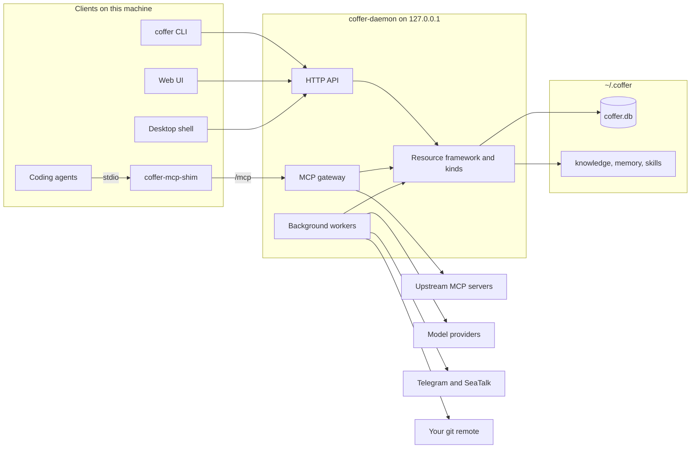

# Architecture overview

This page is the map of the architecture section: one diagram of every moving part, the processes that run, how the four main data flows cross them, and the technology underneath. It is written for engineers who want to understand how Coffer is built and why, before reading any one subsystem in depth.

## The problem Coffer's architecture solves

A developer who uses more than one AI coding agent accumulates the same assets several times over: MCP server registrations, API keys, skills, notes about their environment, and whatever each agent has learned. Each agent keeps its own copy in its own format, and nothing keeps them level.

Coffer is one local process that holds those assets once and hands them to every agent through the channels the agents already speak: an MCP endpoint, files in the agent's own skills directory, and entries in the agent's own config files. Everything it holds lives on your machine. The architecture follows from three requirements:

- **One owner of state.** A single long-lived daemon owns the database, the credential store and every file tree, so there is exactly one writer.
- **Many thin entry points.** Agents, the CLI, the web UI and the desktop app are all clients of that daemon over loopback HTTP. None of them holds state of its own.
- **The agent's own files stay authoritative.** Coffer reads an agent's configuration, memory and transcripts where the agent keeps them, and writes only documented surfaces, so uninstalling Coffer leaves each agent working.

## Coffer in one diagram

The container view below shows every process and store, and what talks to what. Solid arrows are calls; the daemon's internal parts are grouped in the middle.

What each box is:

| Part | What it is |
| --- | --- |
| Coding agents | Claude Code and Codex, the two agent types Coffer registers. Each reaches Coffer through an MCP server entry Coffer writes into its config, and reads skills Coffer delivers into its skills directory. |
| `coffer-mcp-shim` | A small stdio-to-HTTP forwarder the agent launches as an MCP server. It finds (or starts) the daemon and relays JSON-RPC to `/mcp`, stamping the agent's identity onto the handshake. |
| `coffer` CLI | A Typer application. Every command is an HTTP call to the daemon; the CLI never opens the database or the credential store itself. |
| Web UI | A React single-page app, built to static files that the daemon serves from its own origin. |
| Desktop shell | A Tauri 2 app that hosts the same built frontend in a native window with a tray icon. It supplies the page its daemon address and token over IPC and starts the daemon when none is running. |
| HTTP API | FastAPI routes under `/api/v1/*`: the management plane every client uses. |
| MCP gateway | The `/mcp` endpoint. It aggregates every enabled upstream MCP server behind one endpoint, adds Coffer's builtin tools, and filters what each agent sees by reach. See [MCP gateway](/architecture/mcp-gateway). |
| Resource framework and kinds | The kind-agnostic core that gives every user-managed thing — an MCP server, a skill, a channel — one identity, lifecycle, audit trail and reach, plus the seven kinds plugged into it. See [Resource framework](/architecture/resource-framework). |
| Background workers | In-process asyncio loops: retention pruning, knowledge curation, memory aggregation and distillation, vault sync rounds, the transcript-cache warm-up, the MCP session reaper, and the channel runtime that holds Telegram polling and SeaTalk websocket connections. The full list with cadences is in [Daemon and processes](/architecture/daemon#background-work). |
| `coffer.db` | SQLite, the system of record for control-plane state: resources, audit, credentials (as ciphertext), chat history, sync bookkeeping. See [Persistence](/architecture/persistence). |
| knowledge, memory, skills | Plain file trees under `~/.coffer/`. Knowledge collections and memory partitions are Markdown; skills are master bundles delivered into each agent. |
| Upstream MCP servers | The servers you register — stdio subprocesses or HTTP endpoints — started per client session. |
| Model providers | Anthropic, OpenAI-compatible and Ollama endpoints Coffer's own passes run on, and the provider profiles it projects into agents. |
| Telegram and SeaTalk | Messaging platforms a channel binds to. Coffer reaches them only with outbound connections. |
| Your git remote | An optional repository you own that the vault converges with. |

## Processes

Coffer runs as a small set of cooperating processes. Only one of them holds state.

| Process | Lifetime | Role |
| --- | --- | --- |
| `coffer-daemon` | Long-lived. Serves until you stop it or another daemon supersedes it; never stands down on its own. | Owns all state and is the single SQLite writer. Binds `127.0.0.1` on the port you pinned in `~/.coffer/daemon-config.json`, else `8000`, and refuses to start (naming the holder) if it cannot bind that port. |
| `coffer-mcp-shim` | One per MCP client session. | Forwards stdio to the daemon's `/mcp` endpoint; detect-or-spawns the daemon; recovers when the daemon restarts. |
| `coffer` | One per command. | Calls the daemon over loopback; detect-or-spawns it; warns on stderr when the daemon's version differs from its own. |
| Desktop shell | While the app runs. | Hosts the frontend, supplies credentials over IPC, detect-or-spawns and restarts the daemon. Quitting it does not stop the daemon. |
| Upstream MCP servers | Per client session, per server. | Spawned by the gateway's per-session supervisor and reaped when the session closes. |
| Agent runtimes | Per chat turn or conversation. | The Claude Agent SDK and the Codex app-server, started by the chat platform to run a turn. |

The CLI, the shim and the desktop shell all discover the daemon through `~/.coffer/daemon.json` (pid, port, token; mode `0600`), which the daemon writes at start and removes at exit. A spawn lock on `~/.coffer/daemon.lock` makes concurrent detect-or-spawn attempts converge on one daemon. On macOS, `coffer daemon service install` registers the daemon as a login service. The full lifecycle is in [Daemon and processes](/architecture/daemon).

## Main data flows

### An agent's tool call

The agent calls a tool on its `coffer` MCP server. The shim forwards the JSON-RPC message to `POST /mcp` with the daemon token. The gateway resolves the session — each downstream client session gets its own set of upstream subprocesses — and routes a namespaced name such as `github__create_issue` to the `github` server's session, or answers a `coffer__*` builtin itself. Before listing or calling, the gateway checks the server's reach against the agent uid the shim reported at the handshake, so a server scoped away from this agent presents no tools. When the full tool list would exceed the configured budget, the gateway lists a subset and `coffer__search_tools` finds the rest. Details: [MCP gateway](/architecture/mcp-gateway).

### A chat turn

You send a message on the **Chat** page, or a paired owner sends one from Telegram or SeaTalk. Both surfaces call the same turn orchestrator, which starts the turn when the conversation is idle or queues the message behind the running one. The orchestrator asks the agent-provider registry for the conversation's agent, builds an adapter (Claude Agent SDK or Codex app-server), and publishes every event to a per-conversation bus that the web page and the channel renderer both subscribe to. Once a message reaches the orchestrator, nothing downstream knows which surface it came from. Details: [Chat and turns](/architecture/chat).

### A skill delivery

A skill is a master folder under `~/.coffer/skills/<name>/` and a `skill` resource row. It reaches an agent if and only if the skill is enabled and the agent is inside its scope. Any change to either — enabling, disabling, widening or narrowing the scope — reconciles every agent: Coffer links the master folder into `<config_dir>/skills/` (symlink, junction or copy fallback), or reclaims a copy that is no longer in reach. A boot-time drift check repairs links someone broke by hand. Coffer's own manual, `coffer-guide`, is delivered by exactly the same code. Details: [Skills](/guides/skills).

### A sync round

When you configure a git remote you own, a worker runs converge rounds on the remote's interval, hourly by default. A round serializes the vault differentially into a git working tree (`~/.coffer/sync` by default) and commits it, merges the remote branch, applies the diff between what this vault last provably held and the merge result back into the vault path by path, then pushes and advances a machine-local pointer. Resource documents travel without their reach, credentials travel only as Fernet ciphertext and only when you opt in, and a round that would delete more than its configured share holds for your confirmation. Details: [Vault sync](/architecture/vault-sync).

## The design in eleven decisions

Most of Coffer's shape follows from a handful of decisions. Each one below is argued in full on the page it links to, with the alternatives that lost.

| Decision | Why | Page |
| --- | --- | --- |
| One resident daemon per vault; every other process is a client that finds it or spawns it. | One SQLite writer and one set of upstream processes, with no "start the daemon first" step. An idle exit would make an agent's next call pay a cold start. | [Daemon and processes](/architecture/daemon) |
| Loopback, a per-start token and a `Host` check are the whole access model. | Coffer serves one person on one machine. Binding `127.0.0.1` stops remote hosts; the `Host` check stops a web page that re-points its own DNS name at loopback. | [Security model](/architecture/security) |
| Every managed thing is a Resource with an immutable `uid`; behaviour stays inside its kind. | Identity, lifecycle, audit and reach are the same for every kind and are built once. Invoking a tool and delivering a skill have nothing in common, so they are not unified. | [Resource framework](/architecture/resource-framework) |
| Reach is machine-local and enforced where the asking agent is known. | A permission merged through sync would let another machine's round decide what this one exposes. A central gate would sit on every kind's read path. | [Resource framework](/architecture/resource-framework#reach) |
| Each MCP client session gets its own lazily started upstream processes. | MCP is a per-session protocol. Sharing an upstream across clients would mean re-implementing capability negotiation and notification routing inside the gateway. | [MCP gateway](/architecture/mcp-gateway) |
| The gateway lists a usage-ranked slice of tools and offers search for the rest. | Past roughly 30 to 50 tools a model picks tools less reliably. Tiering decides what is listed, never what may be called. | [MCP gateway](/architecture/mcp-gateway#budget-driven-tiering) |
| Knowledge is plain Markdown with no index; its catalogue reaches agents as a skill. | Agents read files all day and rarely call a retrieval tool. Nothing derived can disagree with the files. | [Knowledge](/architecture/knowledge) |
| Memory is aggregated read-only from each agent's own files and never written back. | Each agent keeps its own memory loop untouched, and everything Coffer derives can be deleted and rebuilt. | [Memory](/architecture/memory) |
| Sync is git: three-way merge arbitrates, every diff is taken against a local pointer, and a guard holds large deletions. | A shared base is the only way to tell "never had it" from "deleted it". Your remote stays an ordinary repository you can inspect. | [Vault sync](/architecture/vault-sync) |
| Secrets are Fernet ciphertext under one master key, kept in a `0600` file by default. | Coffer's builds are unsigned, and macOS re-prompts for every keychain item a new build touches. One key in a file removes the prompts; the keychain stays an opt-in. | [Security model](/architecture/security#the-credential-store) |
| Unfinished features ship in every build, switched off on `stable`, instead of living on a branch. | One line of development, and the owner tests exactly what users run. Switching a feature off hides it and keeps its data. | [Distribution and releases](/architecture/distribution#experimental-features) |

### What Coffer deliberately is not

The same decisions rule things out, and knowing them saves proposing them:

- **Not a hosted service.** There is no Coffer account and no cloud endpoint. The only remote is a git repository you own, and any one machine can rebuild it.
- **Not an agent.** Coffer's own model calls are internal passes (curation, distillation, conflict resolution). The Chat page drives your installed agents; Coffer has no chat persona of its own.
- **Not a retrieval engine.** Coffer embeds nothing and keeps no vector or full-text index. An import contract bans embedding libraries from the codebase.
- **Not a policy engine.** Coffer does not approve individual tool calls. Curation happens ahead of time, through per-tool switches and reach, and a channel obeys only its paired owner.
- **Not a plugin platform.** Kinds are wired explicitly at the composition root. A plugin contract needs several concrete implementations to design against, and a single-user tool has no ecosystem to serve.

The rules behind all of this are stated, with their rationale, in [Design principles](/architecture/design-principles).

## Tech stack

Versions are the ones pinned in [`backend/uv.lock`](https://github.com/wyx-sg/Coffer/blob/main/backend/uv.lock), [`frontend/package.json`](https://github.com/wyx-sg/Coffer/blob/main/frontend/package.json) and [`desktop/Cargo.toml`](https://github.com/wyx-sg/Coffer/blob/main/desktop/Cargo.toml).

| Layer | Technology | Used for |
| --- | --- | --- |
| Language | Python 3.12+ | Daemon, CLI and shim. |
| HTTP | FastAPI 0.141, Uvicorn 0.52 | REST API, the `/mcp` endpoint, serving the web UI. |
| Validation | Pydantic 2.13 | Every config schema and wire model; JSON columns are validated on the way in and out. |
| Persistence | SQLAlchemy 2.0 (async) over aiosqlite, Alembic 1.18 | The SQLite system of record and its migrations. |
| Credentials | `cryptography` (Fernet), `keyring` 25 | Envelope encryption; `keyring` only for the opt-in keychain master key. |
| MCP | `mcp` SDK 2.2 | The gateway as an MCP server and as a client of upstream servers. |
| Coffer's own model calls | LangChain 1.3, LangGraph 1.2 (`langchain-anthropic`, `-openai`, `-ollama`) | Knowledge curation, memory distillation, sync conflict resolution. |
| Agent turns | Claude Agent SDK 0.2, Codex app-server | Running a chat turn in Claude Code or Codex. |
| Documents | MarkItDown 0.1 | Uploaded documents and channel attachments to Markdown or text. |
| CLI | Typer 0.26, Rich | The `coffer` command. |
| Logging | structlog 26.1 | One JSON line per record under `~/.coffer/logs/`. |
| Frontend | React 18, TypeScript 5, Vite 5, React Router 6, TanStack Query 5 | The web UI. |
| UI kit | Tailwind CSS 3, shadcn/ui over Radix primitives, lucide-react | Components and styling. |
| API client | openapi-typescript, openapi-fetch | Wire types generated from each spec's OpenAPI contract. |
| i18n | i18next, react-i18next | English and Simplified Chinese interface. |
| Desktop | Tauri 2 (Rust 2021) | The native shell and tray. |
| Packaging | PyInstaller | Frozen `coffer-daemon`, `coffer-mcp-shim` and `coffer` binaries. |

## Reading guide

The rest of the section is organised from the foundations outward.

**Foundations** explain the ideas everything else rests on.

- [Design principles](/architecture/design-principles) — the rules the codebase keeps, each with its rationale and what it rules out.
- [Resource framework](/architecture/resource-framework) — the one abstraction every managed thing shares: identity, lifecycle, audit and reach.
- [Layering and code layout](/architecture/layering) — the four layers, the import contracts that enforce them, and where code goes.

**Runtime** covers the processes and how requests move through them.

- [Daemon and processes](/architecture/daemon) — detect-or-spawn, the discovery file, residency, version skew.
- [MCP gateway](/architecture/mcp-gateway) — aggregation, per-session upstreams, tiering and tool search.
- [Chat and turns](/architecture/chat) — the turn platform shared by the Chat page and every channel.
- [Persistence](/architecture/persistence) — SQLite, migrations, and what lives on disk instead.

**Subsystems** are the three features with the most design behind them.

- [Knowledge](/architecture/knowledge), [Memory](/architecture/memory), [Vault sync](/architecture/vault-sync).

**Cross-cutting** concerns apply everywhere.

- [Security model](/architecture/security), [Observability](/architecture/observability), [Distribution and releases](/architecture/distribution), and the index of [decision records](/architecture/decisions).

## Where it lives in the code

| Path | Contents |
| --- | --- |
| [`backend/coffer/`](https://github.com/wyx-sg/Coffer/tree/main/backend/coffer) | The daemon, CLI and shim, in four layers. |
| [`backend/coffer/surfaces/http/app.py`](https://github.com/wyx-sg/Coffer/blob/main/backend/coffer/surfaces/http/app.py) | The composition root: migrations, wiring, workers. |
| [`frontend/src/`](https://github.com/wyx-sg/Coffer/tree/main/frontend/src) | The web UI. |
| [`desktop/`](https://github.com/wyx-sg/Coffer/tree/main/desktop) | The Tauri shell. |
| [`openspec/specs/`](https://github.com/wyx-sg/Coffer/tree/main/openspec/specs) | The product contract, one spec per capability. |
| [`docs/decisions/`](https://github.com/wyx-sg/Coffer/tree/main/docs/decisions) | Architecture decision records. |
