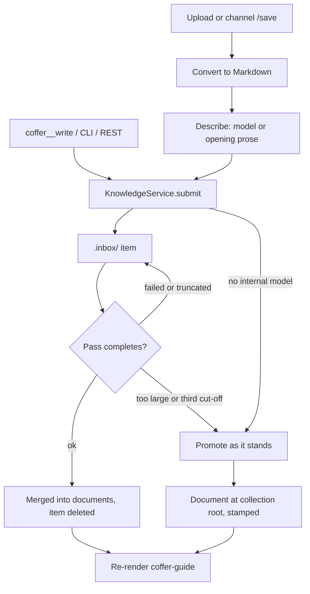
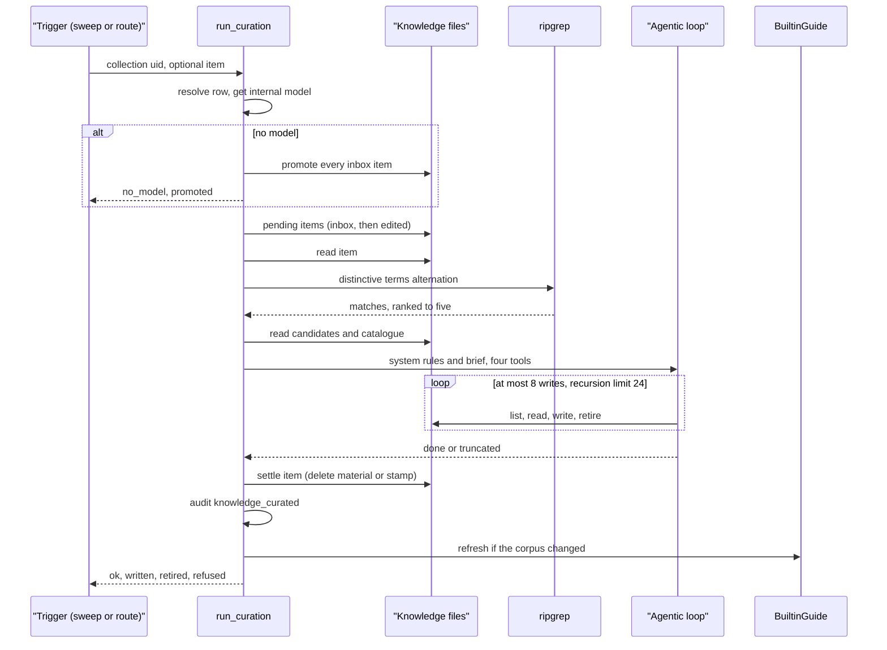
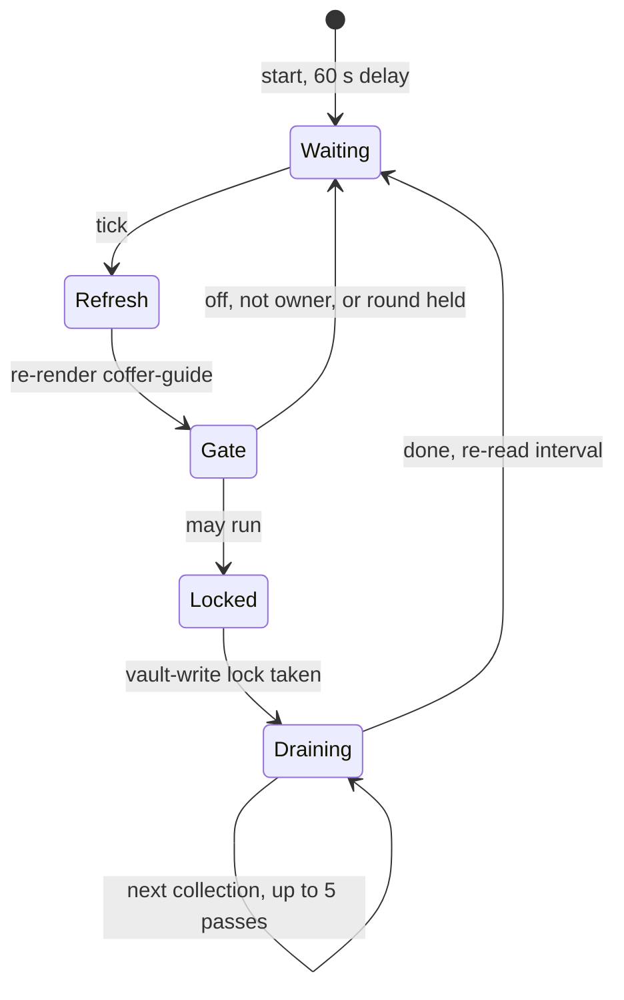

# Knowledge

This page explains how Coffer's knowledge layer is built: why it is plain files with no index, how new material becomes documents through the curation pass, how the catalogue reaches agents through the `coffer-guide` skill, and how it coexists with vault sync. It is for engineers who want the mechanism and the reasoning. For day-to-day use, see the [Knowledge guide](/guides/knowledge).

::: info Experimental feature
Knowledge is an [experimental feature](/guides/experimental-features) (`knowledge`). It is off by default on the stable channel and on for development builds. Switching it off hides its routes, its builtin tool and its section of the guide skill. It keeps every file.
:::

## The problem

Knowledge is what a developer has learned about their working environment: which team owns a service, the conventions of a repository, a trap and how to avoid it. Several agents need to read it, and people and agents both need to add to it. Three failure modes shaped the design:

- **Copies diverge.** If each agent keeps its own notes, what one learns in the morning is invisible to another in the afternoon.
- **Retrieval tools go unused.** A tool an agent has to remember to call is not retrieval. An audit of 448 Claude Code sessions, taken after a corpus had been built behind a set of knowledge tools and a delivered skill, found that the skill had never been loaded and no knowledge tool had ever been called. Every agent Coffer supports already has `Read` and `Grep`, and uses them constantly.
- **Hand-maintained links rot.** In the same corpus, 343 of 398 internal file references were dead, each one a file name written into prose and broken by a later rename.

Knowledge is also distinct from [memory](/architecture/memory). Knowledge is about the world and arrives because someone put it there. It is organised by collection and pulled through a skill. Memory is about the user and their projects. It accrues on its own and is aggregated from the agents' native memory.

## Design decisions

| Decision | Reason |
| --- | --- |
| A collection is one directory tree of Markdown files under `~/.coffer/knowledge/<collection>/`. | Every agent reads the same bytes, so no copy can diverge. A person's edit in their own editor is live on the next read. |
| No index of any kind: no table, no FTS, no vectors, no cache. | Nothing derived can disagree with the files. There is nothing to rebuild or reconcile. |
| A file's path is its identity. | A readable slug is what a person sees in a file manager and what an agent sees in a grep result. |
| Metadata lives in YAML frontmatter. | Only the file is visible to every writer: people, agents and Coffer. |
| New knowledge arrives as material in a hidden `.inbox/` and is merged by a curation pass. | A collection grows by integration rather than by adding one file per upload. |
| A person's edit is never reverted. The pass carries it outward. | People and Coffer's model co-author one tree. The rule protects the person, not a separate directory. |
| No document may name another knowledge file. This is enforced at the write. | Paths move as the corpus is reorganised. The catalogue resolves subjects to paths, and the catalogue is generated. |
| No retrieval tool. The catalogue rides in Coffer's own skill. | Agents read files with the tools they already use. The layer's job is to put the right absolute paths in front of the model. |
| One agent-facing tool, `coffer__write`. | Writing is where an agent needs Coffer: the collection, the inbox, the frontmatter and the audit entry are Coffer's to decide. |
| `enabled` is the only gate. There is no per-agent reach. | The skill hands every agent the whole knowledge root. A per-agent filter would narrow a list while still disclosing the root. |

## The collection tree

```text
~/.coffer/knowledge/
├── payments/                     # one collection = one knowledge Resource
│   ├── README.md                 # the collection's own description
│   ├── session-ownership.md      # a document
│   ├── infra/
│   │   └── cache.md              # nesting is allowed and means nothing
│   └── .inbox/                   # material waiting to be merged (hidden)
│       └── rate-limit-change.md
└── personal/
    └── ...
```

- **A collection** is a top-level directory and one row of kind `knowledge` in the kind-agnostic `resources` table. You create it deliberately, with `coffer knowledge create`, `POST /api/v1/knowledge/collections` or the web UI. Reads, writes and working directories never provision one, and nothing derives a boundary from an agent's cwd. The knowledge layer adds no table to `coffer.db`.
- **The README** sits at the collection root. Its first paragraph is the collection's description. It is read from disk on every listing and is never stored in the database, because a copy in a row would be wrong the first time a person edited the file. The README is never listed as a document, counted or curated.
- **Nesting** is chosen by whoever files a document, a person or curation. Coffer assigns folders no meaning.
- **Hidden entries** (dot-prefixed) are excluded from every listing, count and catalogue. Coffer writes exactly one: `.inbox/`.

### Path as identity

File names are slugs derived from the title (`infrastructure/knowledge/naming.py`). The slug is NFKC-normalised and lower-cased. CJK characters are kept, because a transliteration would be a name nobody recognises. It is capped at 80 characters. A collision appends `-2`, `-3` and so on:

```text
payments/session-ownership.md
payments/session-ownership-2.md
```

Frontmatter carries no `id` key, and nothing maps ids to paths.

### Frontmatter

```yaml
---
title: Session ownership
description: Which team owns the session service and how to reach them.
actor: user
created_at: '2026-09-20T08:14:03.512+00:00'
updated_at: '2026-09-22T10:02:41.107+00:00'
coffer_curated_at: '2026-09-22T10:02:41.107+00:00'
reviewed_by: alice          # a key a person added; always preserved
---
```

Coffer writes six keys, in a fixed order: `title`, `description`, `actor` (`agent` or `user`), `created_at`, `updated_at` and `coffer_curated_at`. Any other key a person added is kept, with its parsed value unchanged, whenever Coffer rewrites or stamps the file (`infrastructure/knowledge/fs.py`). This matters because stamping is unattended. Dropping an unknown key would quietly delete a person's `tags:`.

### One module owns every path

`infrastructure/knowledge/paths.py` is the only module that builds a path. Every segment passes a guard that refuses empty, all-dot, dot-prefixed and non-allowlisted segments, so `payments/.inbox/x.md` is not addressable from any surface. The resolved path is also checked against the knowledge root on its nearest existing ancestor, so a symlinked directory inside the root cannot carry a write out of it. Writes go through a sibling temp file opened with `O_EXCL | O_NOFOLLOW`, followed by one atomic rename. `$COFFER_KNOWLEDGE_ROOT` relocates the root.

## From material to document

Every entrance submits **material** into the collection's inbox. None of them writes a document.

| Entrance | Surface |
| --- | --- |
| `coffer__write` | MCP builtin tool, called by an agent |
| `coffer knowledge write`, `POST /api/v1/knowledge/material` | CLI and REST |
| `coffer knowledge upload`, `POST /api/v1/knowledge/upload`, the Knowledge page | Upload, converted to Markdown first |
| `/save <collection>` after an attachment | A paired [channel](/architecture/chat) owner |



### Submission

`KnowledgeService.submit` (`application/knowledge/service.py`) checks that the collection exists and is enabled, then writes one inbox item. The item has the same frontmatter and Markdown shape as a document and is named by the title's slug. It never overwrites an existing item, because two submissions with the same title are two pieces of material. A submission is a plain file write, with no model, conversion or indexing step. It records one `knowledge_written` audit event.

The answer says what happened to the material:

- `pending`, with no path, when it waits in the inbox. An inbox address disappears once the material is merged, so Coffer does not report it.
- `written`, with a document path, when there is no internal model to merge it. In that case the material is **promoted** on the spot: it becomes a document at the collection root, as it stands, stamped as curated. Knowledge must not wait in a hidden directory for a model connection nobody configured.

`coffer__write` takes `collection`, `title`, `description` and an optional `body`. It takes no path, folder or lane. The gateway injects the calling agent from the session's handshake identity. See [MCP gateway](/architecture/mcp-gateway). A write that names an unknown or disabled collection is refused with the list of collections that are available. That is exactly what the agent's own delivered skill already lists, and it turns a dead end into a correction.

### Uploads

`IngestService` (`application/knowledge/ingest.py`) does four things in order:

1. **Bounds the upload.** It takes one file per call, up to 20 MiB (`MAX_UPLOAD_BYTES`). It refuses unknown collections before paying for conversion.
2. **Converts it.** `infrastructure/knowledge/converters/registry.py` dispatches by extension. Passthrough (Markdown, text and source files) runs first, then CSV, then MarkItDown for everything else. An unsupported type is refused with `INGEST_REJECTED` and `reason: unsupported_type`. A conversion that yields no text, such as an image-only PDF, is refused too. Nothing is written in either case.
3. **Describes it.** The description comes from the internal model when one is configured and answers in time. Otherwise it is the document's first prose paragraph, and failing that its title. The description is never empty, because it is what the catalogue shows an agent.
4. **Submits the Markdown as material** with `actor: user`.

Neither the original bytes nor the extracted text is kept as a file. The upload carries its knowledge, and once the knowledge is merged the carrier has nothing left to say. The trade-off is that a bad conversion cannot be redone from a copy Coffer kept. You re-upload from your own copy.

`markitdown` is imported lazily. An import-linter contract confines it to the knowledge converters and the channel's document extraction.

### Direct edits

Writing, editing or deleting a document directly, in your editor or with an agent's own file tools, is a complete way to change knowledge. No import or registration step is needed, and the change is live on the next read. The sweep notices the edit by modification time and carries it into the rest of the collection. Deleting a document is a person's action on the REST, CLI and web surfaces. No agent-facing tool deletes anything. There is also no route that writes a document: a person edits documents in their own editor.

## The curation pass

Curation turns material into knowledge and carries an edit in one document through to the rest. It is a bounded agentic loop that runs on Coffer's internal model connection (see `coffer engine model`). It is implemented in `application/knowledge/curate.py` and driven by a LangGraph ReAct loop in `infrastructure/llm/agentic_reorg.py`. The knowledge package reaches the loop only through the `AgenticCurationPort` protocol, so it never imports LangChain.

### What a pass sees

A pass takes **one item**: one piece of material, or one document edited since curation last saw it. Its context is bounded:

- **The item, in full.** An item longer than 120,000 characters (`MAX_SOURCE_CHARS`) is never shown to the model. See [Outcomes](#outcomes).
- **At most five candidate documents, in full** (`DEFAULT_CANDIDATE_LIMIT`).
- **The collection's whole catalogue** of paths, titles and descriptions.

The rules go in the system turn, which is identical on every pass so a provider can cache it. The brief, which can run to tens of kilobytes, goes in the user turn.

### Candidate selection

There is no index, so `application/knowledge/candidates.py` selects candidates literally:

1. It extracts up to 24 distinctive terms from the item, most specific first: backticked identifiers, dotted service names, ALL-CAPS constants, words from the title and headings, and CJK runs. Short terms and a short stopword list are dropped. Latin terms need 4 characters and CJK terms need 2.
2. It joins them into one escaped alternation and runs it over the collection's documents with ripgrep.
3. It ranks documents by hit count and keeps the top five. The item itself and the README are never candidates. The inbox is never searched, because ripgrep skips hidden directories.

The selection is crude on purpose. Getting it wrong is survivable because the catalogue is also in the prompt: a model handed five irrelevant candidates can still see that none of them owns the subject and open a new document.

### Ripgrep and the Python fallback

`infrastructure/knowledge/grep.py` runs `rg --json --no-hidden` with a 5-second timeout and a cap of 200 matches. `--no-hidden` is passed explicitly because a user's `$RIPGREP_CONFIG_PATH` could otherwise enable hidden files. An rg exit code of 2 surfaces as an invalid pattern rather than "no matches". A timeout kills rg and reports truncation.

On a machine without `rg`, `grep_fallback.py` walks the same files in a worker thread with the same rules: line-by-line regex, per-file cap, hidden entries and binary files skipped, and the same wall-clock budget. The switch is logged once per process. This is the only place literal matching survives in the layer, and nothing outside the daemon process can reach it.

### The four tools

`application/knowledge/curate_tools.py` builds the pass's entire tool surface, fenced to one collection's documents:

| Tool | What it does | Enforced in code |
| --- | --- | --- |
| `list_documents` | Every document with its title and description. | Documents only: never the inbox or the README. |
| `read_document` | One document in full. | The path must be a document of this collection. |
| `write_document` | Replaces a document at `path`, or creates one named from its title, in an optional `folder`. | Counts against the write limit. Refuses a body that references a knowledge file. Stamps `coffer_curated_at`. |
| `retire_document` | Deletes a document whose content this pass has already written elsewhere. | Counts as a write. Refused unless the pass has seen the document and has since written a *different* document. |

These tools are internal. They are not registered on the MCP gateway or in the builtin tool registry.

**The write limit.** A pass may make at most eight writes (`MAX_WRITES_PER_PASS`), and a retire counts as one. After that, every write answers with an error telling the model to stop. One item can never trigger a corpus-wide rewrite.

**No internal references.** Before writing, `offending_reference` scans the body for tokens that look like Markdown file names. It refuses the write if a token starts with `<collection>/` or its basename matches a file this collection holds. A document may still mention another repository's `AGENTS.md`, because refusing that would be a rule the model cannot satisfy. The check lives in code because asking for it in a prompt is what produced the dead references.

**The retire rule.** Code cannot prove that facts moved. It can refuse every retire for which they could not have: before any write, of a document the pass never saw, or where the only write since was to the document itself.

**Folder spelling.** A model shown `payments/x.md` naturally answers `folder="payments"`. The tool strips a leading collection segment rather than creating `payments/payments/x.md`.

### Precedence rules

Two rules cannot be adjudicated by code, so they live in the system prompt (`application/knowledge/curate_prompt.py`):

- **The newer statement wins.** When new material contradicts a document, the document is corrected, and the superseded statement stays legible with the date it changed, for example "(previously recorded as X; corrected 2026-09-20)".
- **A person's edit stands.** When the item is a document someone edited, what they wrote is the truth. The pass must not revert or reword it. It carries the edit outward: correcting other documents that disagree, and moving a section that belongs elsewhere.

The prompt also says: lose nothing and integrate rather than regenerate, read before you write, organise by subject rather than by provenance, and give every document a description that states the question it answers.

### A pass, end to end



### Settling an item

An item is settled only after its pass completes. Merged material is deleted from the inbox. An edited document is stamped with `coffer_curated_at`, and nothing else in it changes. A pass that raises, or that the recursion limit cuts off, leaves the item as it was, so a later sweep retries it rather than losing it.

**The stamp is the watermark.** `fs.edited_documents` compares each document's modification time with its own `coffer_curated_at`. A document with no stamp, or whose mtime is newer than its stamp, is owed a pass. There is no state file and no table. When Coffer writes a stamp, it also sets the file's mtime to the stamp (`_align_mtime`), so the stamping itself does not count as an edit. Every document curation writes is stamped as it is written, so a pass's own output is not handed back as an edit. Any later edit by a person moves the mtime past the stamp again.

### Outcomes

Every outcome is a `status`, and `POST /api/v1/knowledge/collections/{uid}/curate` answers 200 for all of them:

| Status | Meaning |
| --- | --- |
| `ok` | The pass ran and settled its item. Reports `written`, `retired`, `refused`, `model`, `candidates` and document counts before and after. |
| `no_model` | No internal connection. Every inbox item was promoted as it stands (`promoted`). |
| `up_to_date` | Nothing pending. Nothing ran and nothing was touched. |
| `too_large` | The item exceeds `limit`. Material is promoted as it stands (`promoted`). An edited document is stamped (`stamped`). The model saw nothing. |
| `truncated` | The recursion limit cut the pass off. Its writes stay and the item stays owed. On the third consecutive cut-off of the same item, `gave_up` is `true` and the item is promoted or stamped. |
| `failed` | The loop raised. The item is unchanged. |

The route answers 404 for an unknown or disabled collection and 409 `UPKEEP_ALREADY_RUNNING` while a pass over the same collection is in flight. Consecutive cut-offs are counted in memory (`TruncationLedger` in `curate_settle.py`), so nothing is written into the synced tree to hold the count. A restart resets it, which costs at most three passes per item per restart.

Every pass that ran, cut off or not, records one `knowledge_curated` audit event. Curation has no review step, so the audit log is where a person sees that something rewrote the corpus.

## The sweep

`CurationWorker` (`application/knowledge/curate_worker.py`) is an asyncio task started by `surfaces/http/curation_wiring.py`. It follows the same shape as the retention worker.



On each tick the worker does the following:

1. **Re-renders the guide skill**, before and regardless of the gate. Creating, deleting, enabling or disabling a collection changes what every agent is told, even on a machine where curation is off or that is not the owner. A render that produces the same bytes writes nothing.
2. **Checks the gate** (`curation_may_run`). The `knowledge` feature must be on, `auto_curate_enabled` must be on (the default), and `curate_owner_machine_id` must name this machine or be unset. With the `vault_sync` feature on, the pass also does not run while a converge round is waiting on the user for a held deletion or an unresolved conflict. With `vault_sync` off, only the pass's own switch is read, because a single-machine vault has nobody to duplicate its work.
3. **Takes the vault-write lock**, the same `asyncio.Lock` a converge round holds. See [Locking with sync](#locking-with-sync).
4. **Drains each enabled collection**, identified by uid. Pending items are all inbox material, oldest first, then edited documents, oldest first. The worker claims the collection in the in-process upkeep-run registry and skips it if a manual pass holds it. It re-reads the pending list inside the claim, pushes items cut off last time behind the rest, and runs at most five passes (`MAX_PASSES_PER_SWEEP`). `no_model` or `failed` ends that collection's sweep. `truncated` does not, so one stubborn item cannot starve the rest.
5. **Waits for the next tick.** The interval defaults to 60 seconds. It is re-read while the wait runs, so a change made with `coffer engine upkeep` or in Settings applies within a slice rather than after a wait committed at boot.

A failed sweep is logged and never ends the loop. Shutdown cancels the task without waiting on a pass. The watermark makes a sweep idempotent, so the next boot picks up whatever was left.

### The owner machine

A pass rewrites synced content unattended. If two machines curated the same corpus, each would merge the same material into a *different* document. Git would merge both additions cleanly, and the vault would hold the same knowledge twice with no conflict reported. So curation runs on one machine only.

`auto_curate_enabled` and `curate_owner_machine_id` live in `internal_engine_config`, and the sweep reads both on every tick. No owner means a single-machine vault, where "here" is the only answer. An owner naming a machine the registry does not know stops curation everywhere. That is the safe direction: no curation costs waiting material, while curation everywhere costs silent duplication. You can inspect and change the owner with `coffer engine curate-owner show|set|clear`.

### Manual passes

`coffer knowledge curate` and the Knowledge page's curate action call the same `CurationPass` object the worker uses. The route claims the collection first, so a second request is refused immediately with 409 rather than blocking. It then takes the vault-write lock. Without a named document, the pass takes the oldest pending item.

## Locking with sync

A curation pass and a [vault sync](/architecture/vault-sync) converge round both write the vault. An export taken halfway through a rewrite is a torn snapshot that git would read as a deliberate change. So both take the one lock owned by the converge service. `sync_wiring.py` hands it to the knowledge surface (`set_vault_write_lock`) for the manual route, and `start_curation_worker` passes it to the worker. On a vault with no sync wired, there is nothing to interleave with and no lock is taken.

Two locks are in play, at different scopes:

| Lock | Scope | Collision it prevents |
| --- | --- | --- |
| Upkeep-run claim (`application/upkeep_runs.py`) | One collection, in-process | A manual pass and the sweep over the same collection |
| Vault-write lock (the converge service's lock) | The whole vault | A pass and a converge round |

## The coffer-guide skill

The catalogue reaches agents through `coffer-guide`, Coffer's own skill. It is an ordinary `skill` Resource: one master folder under `~/.coffer/skills/coffer-guide/`, one row with a `builtin` source, and delivered into each agent as the same directory link any imported skill uses. See [Skills](/guides/skills). The knowledge layer contributes the **text** and nothing else.

### Rendering

`application/knowledge/guide_render.py` is pure: text in, text out, with no port and no filesystem access beyond its own package asset. It renders:

- **The frontmatter description.** This is the only part that is always in a model's context. It names Coffer and its builtin tools, and the subjects the enabled collections cover, each taken from the first sentence of the collection's README. It is capped at 1024 characters, the tightest limit among skill importers, by dropping whole subjects from the tail rather than cutting a sentence. It is emitted through a YAML dumper with unlimited width, so a README containing `: ` or ` #` cannot break or silently truncate the block.
- **The body.** First comes the hand-written manual shipped as package data (`application/knowledge/skill_assets/coffer-guide.md`). It covers the builtin tools, the tool-tiering contract, that Coffer never writes an agent's memory, and that no Coffer tool waits on an approval. The generated catalogue follows: the knowledge root, and for each enabled collection every document's collection-relative path, title and description. The manual tells the agent to read files with its own tools, to use `coffer__write` for durable facts, and that it may edit a document directly.

The manual marks spans with `<!-- when:knowledge -->` and `<!-- when:memory -->`. A span is dropped whole while its experimental feature is off, so the guide never documents a tool the gateway would answer as unknown.

A body is paid for only when a model opens it; a description is resident in every session. That is why Coffer ships one skill rather than a set. A catalogue entry costs roughly 40 tokens; one measured catalogue of 58 documents came to about 5.2K tokens.

### Deterministic, byte-identical output

The rendered `SKILL.md` is a pure function of the build and the catalogue it is given. No absolute home directory, timestamp or build path enters it. The knowledge root is written as `~/.coffer/knowledge` when it sits in its default place. A root relocated with `COFFER_KNOWLEDGE_ROOT` is written out in full, because an accurate path matters more than a stable one.

Determinism pays off locally. `BuiltinSkillSeed.seed` compares the rendered text with the master folder, and if they are identical it writes, audits and re-delivers nothing. A boot or sweep tick that changed nothing therefore leaves no trace, and the row's `version_hash` means "the content moved" rather than "time passed".

### Why it is withheld from sync

The guide lists the *enabled* collections, and `enabled` is machine-local reach. Two machines with identical knowledge but different collections switched on render different bytes, each correct where it is. If either published its copy, the other would overwrite it, re-render on its next tick and publish back, producing a commit and an audit event per tick on both machines indefinitely. So the skill kind declares this one row derived (`Kind.converges_row` in `application/skill/kind.py`), and vault sync leaves both the row and its master folder alone in both directions. Each machine renders its own. See [Vault sync](/architecture/vault-sync).

### The join and its triggers

The knowledge and skill kinds may not import each other. `surfaces/http/guide_wiring.py` is the one composition-root module where the renderer and the skill kind's seed meet, and the seam is a Markdown string. `BuiltinGuide.refresh` serialises concurrent calls with a lock and never raises: a failed render or write leaves the previous master in place. It runs:

- at boot, after the skill drift heal and before the background workers start;
- after any curation pass that changed the corpus;
- when a collection is created, deleted, enabled or disabled;
- on every sweep tick, so a document someone added by hand is catalogued;
- when the `knowledge` or `memory` feature is switched.

## Why no retrieval tool and no embeddings

The layer exposes one tool, `coffer__write`. It has no `list`, `grep`, `read`, `search` or `delete` tool. The session audit showed that such tools were never called, while `Read` and `Grep` are used all day. So the effort goes into what the agent is told, through a skill description that carries matchable subjects and a body that carries absolute paths. The gateway's `initialize` instructions name the builtin tools and point at the skill. They carry no catalogue.

Coffer embeds nothing. It has no vector store, no embedding model and no FTS index. An import-linter contract bans `llama_index`, `mem0`, `chromadb`, `sentence_transformers`, `sqlite_vec` and `fastembed` repository-wide. Each of those libraries wants to own a derived store, and a derived store can diverge from the files. The design relies on a model reading a catalogue, which works while the catalogue fits in context: into the hundreds of documents. Literal matching is a placeholder, not a verdict against semantic retrieval. Semantic retrieval is expected to return once the knowledge and memory design settles, built for the need rather than bolted on.

## Trade-offs

- **Curation rewrites the only copy.** There is no pristine lane to rebuild from. The safeguards are: a person's edit is never reverted, the eight-write limit, one pass per collection, an audit event per pass, and, where vault sync is configured, the vault's git history. A bad merge is repaired by editing the document.
- **Material waits until a pass runs.** An agent cannot read the inbox. The one-minute sweep and promotion when no model is configured keep the wait short.
- **User content can leave the machine.** The internal model connection is the one place it does. Curation and an upload's generated description are the only things this layer sends there.
- **`enabled` is not access control.** An agent with shell tools can read any file under the knowledge root. A disabled collection is one no skill names, not one no process can open.
- **Losing read tools loses read telemetry.** `mcp_invocations` records writes only. The agents' own transcripts are the retroactive measure of reads.

## Where it lives in the code

| Path | Responsibility |
| --- | --- |
| [`application/knowledge/service.py`](https://github.com/wyx-sg/Coffer/blob/main/backend/coffer/application/knowledge/service.py) | Collections, submission, promotion when no model is configured, reads for human surfaces, candidate matching |
| [`application/knowledge/builtin_tools.py`](https://github.com/wyx-sg/Coffer/blob/main/backend/coffer/application/knowledge/builtin_tools.py) | `coffer__write` |
| [`application/knowledge/ingest.py`](https://github.com/wyx-sg/Coffer/blob/main/backend/coffer/application/knowledge/ingest.py) | Upload bounds, conversion, description |
| [`application/knowledge/curate.py`](https://github.com/wyx-sg/Coffer/blob/main/backend/coffer/application/knowledge/curate.py) | One pass: brief, loop, outcomes, audit |
| [`application/knowledge/candidates.py`](https://github.com/wyx-sg/Coffer/blob/main/backend/coffer/application/knowledge/candidates.py) | Distinctive terms and candidate ranking |
| [`application/knowledge/curate_tools.py`](https://github.com/wyx-sg/Coffer/blob/main/backend/coffer/application/knowledge/curate_tools.py) | The four fenced tools, write limit, reference check, retire rule |
| [`application/knowledge/curate_settle.py`](https://github.com/wyx-sg/Coffer/blob/main/backend/coffer/application/knowledge/curate_settle.py) | Pending items, settle, promote, give up, truncation ledger |
| [`application/knowledge/curate_prompt.py`](https://github.com/wyx-sg/Coffer/blob/main/backend/coffer/application/knowledge/curate_prompt.py) | The system rules |
| [`application/knowledge/curate_worker.py`](https://github.com/wyx-sg/Coffer/blob/main/backend/coffer/application/knowledge/curate_worker.py) | The interval sweep |
| [`application/knowledge/guide_render.py`](https://github.com/wyx-sg/Coffer/blob/main/backend/coffer/application/knowledge/guide_render.py), [`skill_assets/`](https://github.com/wyx-sg/Coffer/tree/main/backend/coffer/application/knowledge/skill_assets) | `coffer-guide` text |
| [`infrastructure/knowledge/`](https://github.com/wyx-sg/Coffer/tree/main/backend/coffer/infrastructure/knowledge) | `paths.py`, `fs.py`, `frontmatter.py`, `naming.py`, `catalogue.py`, `grep.py`, `grep_fallback.py`, `converters/` |
| [`infrastructure/llm/agentic_reorg.py`](https://github.com/wyx-sg/Coffer/blob/main/backend/coffer/infrastructure/llm/agentic_reorg.py) | The LangGraph loop behind `AgenticCurationPort` |
| [`surfaces/http/curation_wiring.py`](https://github.com/wyx-sg/Coffer/blob/main/backend/coffer/surfaces/http/curation_wiring.py) | Pass construction, owner gate, worker start |
| [`surfaces/http/guide_wiring.py`](https://github.com/wyx-sg/Coffer/blob/main/backend/coffer/surfaces/http/guide_wiring.py) | Renderer to skill-seed join |
| [`surfaces/http/knowledge/`](https://github.com/wyx-sg/Coffer/tree/main/backend/coffer/surfaces/http/knowledge) | `/api/v1/knowledge` routes, vault-write lock provider |

All paths are under `backend/coffer/`.

## Related

- Spec: [knowledge](https://github.com/wyx-sg/Coffer/blob/main/openspec/specs/knowledge/spec.md), [internal-engine](https://github.com/wyx-sg/Coffer/blob/main/openspec/specs/internal-engine/spec.md), [skill-manager](https://github.com/wyx-sg/Coffer/blob/main/openspec/specs/skill-manager/spec.md)
- Decisions: [Knowledge Is Plain Files](https://github.com/wyx-sg/Coffer/blob/main/docs/decisions/knowledge-is-plain-files.md), [Coffer Ships Its Own Skill](https://github.com/wyx-sg/Coffer/blob/main/docs/decisions/coffer-ships-its-own-skill.md), [Principles → Governance](/architecture/principles#governance), [Knowledge Is a Directory of Markdown Files, Not an Index](https://github.com/wyx-sg/Coffer/blob/main/docs/decisions/knowledge-is-plain-files.md)
- Pages: [Knowledge guide](/guides/knowledge), [Memory](/architecture/memory), [Vault sync](/architecture/vault-sync), [MCP gateway](/architecture/mcp-gateway), [Resource framework](/architecture/resource-framework), [MCP tools reference](/reference/mcp-tools)
