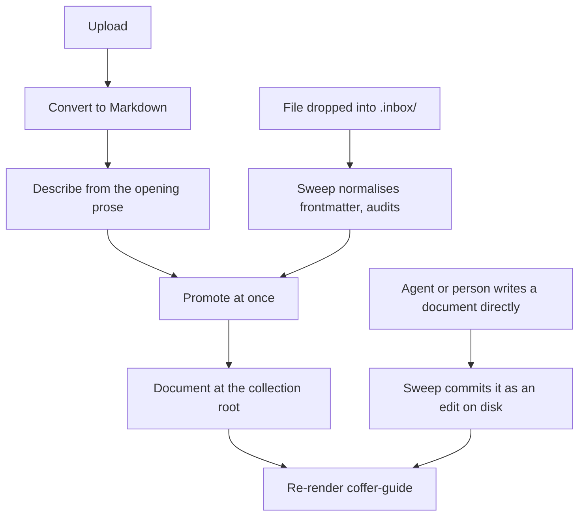
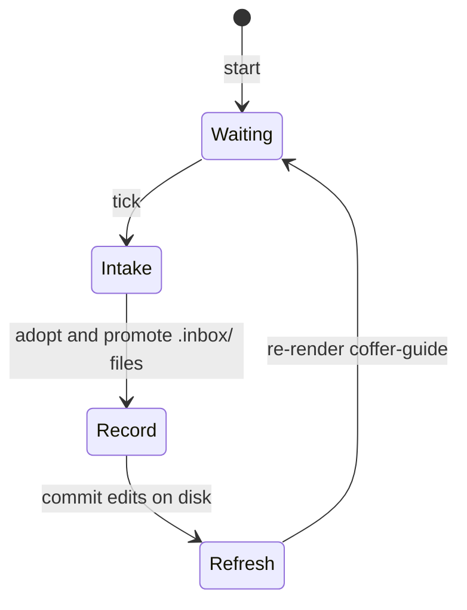

# Knowledge

This page explains how Coffer's knowledge layer is built: why it is plain files with no index, how new material becomes documents at once, how an agent writes and tidies those documents by rules the `coffer-guide` skill teaches, how every write is kept as a version you can restore, how the catalogue reaches agents through that skill, and how it coexists with vault sync. It is for engineers who want the mechanism and the reasoning. For day-to-day use, see the [Knowledge guide](/guides/knowledge).

## The problem

Knowledge is what a developer has learned about their working environment: which team owns a service, the conventions of a repository, a pitfall and how to avoid it. Several agents need to read it, and people and agents both need to add to it. Three failure modes shaped the design:

- **Copies diverge.** If each agent keeps its own notes, what one learns in the morning is invisible to another in the afternoon.
- **Retrieval tools go unused.** A tool an agent has to remember to call is not retrieval. An audit of 448 Claude Code sessions, taken after a corpus had been built behind a set of knowledge tools and a delivered skill, found that the skill had never been loaded and no knowledge tool had ever been called. Every agent Coffer supports already has `Read` and `Grep`, and uses them constantly.
- **Hand-maintained links rot.** In the same corpus, 343 of 398 internal file references were dead, each one a file name written into prose and broken by a later rename.

Knowledge is also distinct from [memory](/architecture/memory). Knowledge is about the world and arrives because someone put it there. It is organised by collection and pulled through a skill. Memory is about the user and their projects. It accrues on its own and is aggregated from the agents' native memory.

## Design decisions

| Decision | Reason |
| --- | --- |
| A collection is one directory tree of Markdown files under `~/.coffer/vault/knowledge/<collection>/`. | Every agent reads the same bytes, so no copy can diverge. An edit made in any editor is live on the next read. |
| No index of any kind: no table, no FTS, no vectors, no cache. | Nothing derived can disagree with the files. There is nothing to rebuild or reconcile. |
| A file's path is its identity. | A readable slug is what a person sees in a file manager and what an agent sees in a grep result. |
| Metadata lives in YAML frontmatter. | Only the file is visible to every writer: people, agents and Coffer. |
| Material is promoted to a document at once. An upload becomes a document as it arrives, and a file dropped into a hidden `.inbox/` is adopted by the next sweep. | Nothing waits for a model connection or a pass. What was submitted is readable by every agent within the minute. |
| Coffer runs no model over knowledge. Where a fact belongs, which documents answer the same question and which statement is stale are judged by the agent, by rules the `coffer-guide` skill teaches. | The agent a person already uses has file tools, a stronger model and the person watching. A second, unattended model of Coffer's own needed its own connection, and without one its work did not happen. |
| Tidying starts only when a person presses **Tidy**. Coffer starts no agent run of its own. | An unattended agent run would spend the person's quota without their knowledge and leave conversations nobody started. |
| Every accepted write is one git commit naming its writer. | Agents rewrite the only copy. A history of who changed what makes every change inspectable and every version restorable. |
| The newer statement wins unless the older one is shown to be right. No writer is exempt. | A statement is judged by when it was made and the evidence behind it, never by who wrote it: a person's edit and an agent's can both be stale or wrong. History and restore are the recovery path. |
| No document may name another knowledge file. The guide teaches it as a writing rule. | Paths move as the corpus is reorganised. The catalogue resolves subjects to paths, and the catalogue is generated. |
| No retrieval tool. The catalogue rides in Coffer's own skill. | Agents read files with the tools they already use. The layer's job is to put the right absolute paths in front of the model. |
| Agents add knowledge by writing into a collection's documents with their own file tools. No agent-facing tool: Coffer's only built-in MCP tool is `coffer__search_tools`. | Agents already write files. The guide tells them where, and the sweep commits what they changed. |
| No gate per collection: no per-agent reach and no enabled switch. Every collection is served to every agent. | The skill hands every agent the whole knowledge root. A per-agent filter or a switched-off collection would narrow a list while still disclosing the root. |

## The collection tree

```text
~/.coffer/vault/knowledge/          # inside the vault repository
├── payments/                     # one collection = one knowledge Resource
│   ├── README.md                 # the collection's own description
│   ├── session-ownership.md      # a document
│   ├── infra/
│   │   └── cache.md              # nesting is allowed and means nothing
│   └── .inbox/                   # drop zone, adopted by the sweep (hidden)
│       └── rate-limit-change.md
└── personal/
    └── ...
```

- **A collection** is a top-level directory and one resource of kind `knowledge`, filed as `vault/resources/knowledge/<name>.json`. A person creates it deliberately, in the web UI. Reads, writes, files an agent drops elsewhere and working directories never provision one, and nothing derives a boundary from an agent's cwd. The knowledge layer adds no table anywhere.
- **The README** sits at the collection root. Its first paragraph is the collection's description. It is read from disk on every listing and never copied into the resource file, because a copy would be wrong the first time a person edited the README. The README is never listed as a document or counted. A collection has no title of its own: every surface shows it by its folder name, and the resource update refuses a title. Editing the description in the web UI rewrites exactly that first paragraph and leaves the rest of the README alone, as one commit naming the user; the guide skill is re-rendered afterwards, because the description is how an agent recognises the collection.
- **Nesting** is chosen by whoever files a document, a person or an agent. Coffer assigns folders no meaning.
- **Hidden entries** (dot-prefixed) are excluded from every document count and from the catalogue, and no surface lists or reads one. Inside a collection the one Coffer reads is `.inbox/`, a drop zone: a Markdown file left there is adopted and promoted by the next sweep. The vault repository's `.git/info/exclude` ignores every other hidden entry inside a collection, so it is neither committed nor synced.

### Path as identity

File names are slugs derived from the title. The slug is NFKC-normalised and lower-cased. CJK characters are kept, because a transliteration would be a name nobody recognises. It is capped at 80 characters. A collision appends `-2`, `-3` and so on:

```text
payments/session-ownership.md
payments/session-ownership-2.md
```

Frontmatter carries no `id` key, and nothing maps ids to paths.

### Frontmatter

```yaml
---
title: Session ownership
description: Which team owns the session service and how to reach them.
actor: user
created_at: '2026-09-20T08:14:03.512+00:00'
updated_at: '2026-09-22T10:02:41.107+00:00'
reviewed_by: alice          # a key a person added; always preserved
---
```

Coffer writes five keys, in a fixed order: `title`, `description`, `actor` (`agent` or `user`), `created_at` and `updated_at`. Any other key a person added is kept, with its parsed value unchanged, whenever Coffer rewrites the file. This matters because agents and Coffer's own saves rewrite documents, and dropping an unknown key would quietly delete a person's `tags:`.

### One module owns every path

One module in the knowledge infrastructure builds every path; nothing else constructs one. Every segment passes a guard that refuses empty, all-dot, dot-prefixed and non-allowlisted segments, so `payments/.inbox/x.md` is not addressable from any surface. The resolved path is also checked against the knowledge root on its nearest existing ancestor, so a symlinked directory inside the root cannot carry a write out of it. Writes go through a sibling temp file opened with `O_EXCL | O_NOFOLLOW`, followed by one atomic rename, and are committed through the vault's one writer. The root is always `~/.coffer/vault/knowledge`; there is no override.

## From material to document

Every entrance ends in a document. None of them waits.

| Entrance | Surface |
| --- | --- |
| Upload, converted to Markdown first | The Knowledge page |
| A document written straight into a collection | An agent's own file tools, or a person's editor |
| A Markdown file dropped into `<collection>/.inbox/` | An agent outside Coffer, another machine, or an older guide; the sweep adopts it |

There is no entrance that creates a document at a path, and the web UI has no form for typing one in: a person writes through the editor (a save of an existing document's body) or uploads.


```mermaid
flowchart TD
  U["Upload"] --> C["Convert to Markdown"]
  C --> D["Describe from the opening prose"]
  D --> S["Promote at once"]
  W["File dropped into .inbox/"] --> N["Sweep normalises frontmatter, audits"]
  N --> S
  S --> DOC["Document at the collection root"]
  E["Agent or person writes a document directly"] --> DISK["Sweep commits it as an edit on disk"]
  DOC --> G["Re-render coffer-guide"]
  DISK --> G
```

### Submission

An upload checks that the collection exists, then writes one document at the collection's root. Its body is the submitted text as it stands. Its frontmatter is filled from the text: `title` from the first `# ` heading (else the file name), `description` from the first prose paragraph (else the title), and `actor` for whoever submitted it. It is named by its title's slug and never overwrites an existing document, because two submissions with the same title are two documents. The commit names whoever submitted it, and one `knowledge_written` audit event is recorded. Coffer then announces the collection on the daemon's event stream as a `knowledge` event, because documents change without any write to the collection's row.

Nothing is merged into another document by Coffer. Where a fact belongs among the existing documents is tidying, which an agent does (see [Tidying is the agent's job](#tidying-is-the-agent-s-job)). A promoted document stands as it arrived.

The answer to an upload carries the new document's path.

### A file dropped into the inbox

An agent that follows the guide writes into the collection's documents directly. A file can still arrive at `<collection>/.inbox/<any-name>.md`, from an agent outside Coffer, from another machine's older build, or from an older guide. The sweep recognises a new inbox file that no Coffer surface wrote and **normalises** it, then promotes it by the same operation a submission uses:

- `title` is kept, else the first `# ` heading, else the file name's stem.
- `description` is kept, else the first prose paragraph, else the title, the same fallback an upload uses.
- `actor` is kept as written, because it is self-reported, else `agent`.
- `created_at` and `updated_at` are kept, else the time the sweep saw the file.
- Every other key the writer set is kept.

One `knowledge_written` audit event is recorded per file, marked when the actor came from the file. A Markdown file in a top-level directory that is not a collection is left alone and never catalogued, because only a person creates a collection. A non-Markdown file in an inbox is left in place, logged, and not promoted.

### Uploads

An upload goes through four steps, in order:

1. **Bounds the upload.** It takes one file per call, up to 20 MiB. It refuses unknown collections before paying for conversion.
2. **Converts it.** A converter registry dispatches by extension. Passthrough (Markdown, text and source files) runs first, then CSV, then MarkItDown for everything else. An unsupported type is refused with `INGEST_REJECTED` and `reason: unsupported_type`. A conversion that yields no text, such as an image-only PDF, is refused too. Nothing is written in either case.
3. **Describes it.** The description is the document's first prose paragraph, and failing that its title. It is never empty, because it is what the catalogue shows an agent. No model writes it.
4. **Promotes the Markdown** with `actor: user`.

Neither the original bytes nor the extracted text is kept as a file beside the document. The trade-off is that a bad conversion cannot be redone from a copy Coffer kept. You re-upload from your own copy.

`markitdown` is imported lazily. An import-linter contract confines it to the knowledge converters and the channel's document extraction.

### Direct edits

Writing, editing or deleting a document directly, in your editor or with an agent's own file tools, is a complete way to change knowledge. No import or registration step is needed, and the change is live on the next read. The sweep commits it as an edit on disk (see [History](#history)). Deleting a document through Coffer is a person's action in the web UI. Coffer offers no tool that deletes anything.

The web UI can also edit a document in place. A save replaces a document's **body** and keeps its frontmatter. Reading a document yields a fingerprint of the file, and the save must send back the one the editor loaded: a file that changed on disk since, whether by a person's own editor or an agent, is refused as a conflict and left untouched. The refusal carries the document as it is on disk now, its body and its fingerprint, so the editor can offer Reload, Compare and Copy my text without a second save over the file; saving the person's text again needs the new fingerprint. Each save records one `knowledge_edited` audit event and is one commit naming the user (see [History](#history)).

## Tidying is the agent's job

Putting a fact where it belongs, folding documents that answer the same question into one, splitting one that answers several, and correcting what is wrong are judgements. Coffer makes none of them. The agent the person already works with has file tools and the person watching, so the judgement lives in the `coffer-guide` skill it loads, and the person starts it with one button. See the decision [Tidying Knowledge and Memory Is the Agent's Job](https://github.com/wyx-sg/Coffer/blob/main/docs/decisions/tidying-knowledge-and-memory-is-the-agents-job.md).

### What the guide teaches

While the knowledge feature is on, the guide's knowledge sections carry two instructions.

**Writing something down.** When an agent learns something durable, it puts the fact straight into the collection's documents with its own file tools, by six rules:

1. **Find its home.** Read the catalogue and grep the collection for the subject. Fold the fact into the document that owns it, in the section it belongs in, and create a file only when no document owns the subject.
2. **Lose nothing.** Integrate; never regenerate. Every fact already in a rewritten document survives.
3. **Organise by subject, never by provenance.** No sections like "Added today".
4. **The newer statement wins unless the older one is shown to be right** by a source, a date, a command's output or the code, whoever wrote either. The superseded statement stays legible, with the date it was corrected.
5. **Never name another knowledge file.** Paths move; name the subject in prose.
6. **Give every document frontmatter**: a `title`, a one-line `description` saying what question the document answers, and `actor: agent`. Keys a person added are left alone.

**Tidying a collection.** When asked to tidy, the agent works through one collection at a time: read the README and every document's title and description, then the documents in full; merge documents that answer the same question, split one that answers several, fix what is wrong or contradictory, and rewrite a description that does not say what question its document answers; then report what it merged, split, corrected and deleted.

Code enforces none of these rules. They are prose in the skill, and the guard against a bad edit is the history, not a refusal at a write.

### The Tidy hand-off

The daemon writes the prompt, from the same hand-off module every other hand-off uses. Reading a collection carries `tidy_handoff`, which names the collection, gives its absolute path and its document count, and tells the agent to follow the guide's "Tidying a collection" section. A second route returns the same kind of prompt for every collection at once: it names the knowledge root and each collection with its path and count, and asks the agent to tidy them one at a time.

The web UI offers **Tidy** on a collection's page and **Tidy all** in the Knowledge page's header. Pressing either starts the default hand-off agent in the preferred terminal with that prompt as its first message, through the same path as every other hand-off. With no managed agent available the button offers **Copy prompt** only. The person pressed a button named for the job, the prompt only edits Coffer's own files, and the tree is recoverable from its history.

### Nothing tidies unattended

Tidy runs only when a person presses it or asks their own agent. Scheduling agent runs would need loop-proofing against Coffer's own hooks, would spend the person's quota without their knowledge, and would leave conversations nobody started. The mechanical sweep stays on its timer; tidying does not.

### Precedence

Two rules are about judgement and so live in the guide, not in code:

- **The newer statement wins, unless the older one is shown to be right.** When new material contradicts a document, the document is corrected unless a source, a date, a command's output or the code shows the older statement is right. The superseded statement stays legible with the date it changed, for example "(previously recorded as X; corrected 2026-09-20)".
- **No writer is exempt.** A person, an agent and a tidy are judged by when a statement was made and the evidence behind it, never by who wrote it.

What protects the data is mechanical. A save from the web UI is refused when the file changed since it was loaded, so an agent's edit is never silently reverted. A rewrite that Coffer itself makes keeps every frontmatter key it did not set. Every agent edit is a version in the history, and a version can be restored.

## The sweep

The sweep is a background asyncio task in the daemon. It follows the same shape as the retention worker, and it calls no model.


```mermaid
stateDiagram-v2
  [*] --> Waiting: start
  Waiting --> Intake: tick
  Intake --> Record: adopt and promote .inbox/ files
  Record --> Refresh: commit edits on disk
  Refresh --> Waiting: re-render coffer-guide
```

On each tick, once a minute, the worker does exactly three things:

1. **Adopts and promotes `.inbox/` files.** Each new Markdown file in a collection's inbox is normalised and becomes a document at the collection root (see [A file dropped into the inbox](#a-file-dropped-into-the-inbox)). Whatever it promotes, it announces as a `knowledge` event.
2. **Commits edits on disk.** Anything changed in the tree since the last commit, such as a person's editor or an agent's file tools, is committed as an edit on disk through the vault writer, so the history stays current and nothing an agent wrote is counted as Coffer's.
3. **Re-renders the guide skill**, so a document added by hand is catalogued. A render that produces the same bytes writes nothing.

A failed duty is logged and never ends the loop. While the `knowledge` feature is switched off the sweep skips its rounds, and the collections stay on disk untouched. Shutdown cancels the task without waiting.

The sweep runs on every machine. It writes only what it promotes, and that write goes through the vault's ordinary writer like any other, so it holds nothing against a [vault sync](/architecture/vault-sync) round and waits for none. Because it rewrites no existing document, two machines sweeping the same vault cannot fold the same item into two different documents.

## History

Every accepted write to a collection is one git commit naming its **writer**, following the decision that every vault write is a validated commit naming its writer. A document's history is therefore a list of versions, each with a writer, a time and a diff, and any change can be inspected and any version restored.

### Writers

| Writer | What it covers |
| --- | --- |
| `user` | A person's save, delete or restore, and collection create, rename and remove. |
| `agent` | An agent's submission promoted on arrival, naming the agent. |
| `curation` | A commit an earlier version of Coffer made as a curation pass. It stays in the history under this label. |
| `sync` | Paths that vault sync applied. |
| `disk` | Anything else found changed in the tree: a person's own editor, an agent's own file tools. |

Changes made outside Coffer are never counted as Coffer's. The vault's scanner commits whatever a person or an agent's own tools changed as **Edited on disk** once the file has been quiet, and it does the same at every sweep tick and before every history read.

### Where it lives

The history is the vault repository's own: collections sit under `knowledge/` in `~/.coffer/vault`, so a document's history is that file's history in the one repository, and the knowledge routes read it from there.

Knowledge commits carry the vault's trailers plus the knowledge ones (`Coffer-Writer`, `Coffer-Operation`, `Coffer-Actor`, `Coffer-Agent`, `Coffer-Collection`, `Coffer-Item`, `Coffer-Status`, `Coffer-Restored-From`). Git runs with the user's global and system configuration pinned to `/dev/null`, so a personal hook, signing rule or alias cannot change what is recorded. The vault needs git: without it the daemon [waits for git](/architecture/daemon#waiting-for-git) and hands the install to an agent.

### Reading and restoring a document

A document's versions are listed newest first with their writer and time, and each version's diff can be read. Restoring a version writes that version's bytes back as a new commit naming the user; the history before it stays intact. A deleted document is restored the same way, from the version before its deletion.

A delete, of one document or of a whole collection, is itself a change in the feed, listing every file it removed. Restoring it reads each removed file from the commit before the delete and writes it back byte for byte, as one new commit naming the user and carrying `Coffer-Restored-From`. A document goes back into its collection. A collection gets a new resource file under its old name, then its documents, its README and any files still in its inbox. Nothing is written when the restore would overwrite: a document at the same path or a collection of the same name is refused, as is restoring a change that is not a delete. A restore records a `knowledge_edited` audit event naming the delete it undid.

### Recent changes

One feed lists the changes across every collection, or one, newest first. Each change carries its writer, its time, its collections and, for each document it touched, whether the document was added, modified or removed with its line counts. One change can be read in full, with each document's diff.

## The coffer-guide skill

The catalogue reaches agents through `coffer-guide`, Coffer's own skill. It is an ordinary `skill` Resource: one master folder under `~/.coffer/derived/skills/coffer-guide/`, one derived resource file with a `builtin` source, and delivered into each agent as the same directory link any imported skill uses. See [Skills](/guides/skills). The knowledge layer contributes the **text** and nothing else.

### Rendering

The renderer is pure: text in, text out, with no port and no filesystem access beyond its own package asset. It renders:

- **The frontmatter description.** This is the only part that is always in a model's context. It names Coffer and its builtin tools, the subjects the collections cover, each taken from the first sentence of the collection's README, and, while knowledge is on, that the skill teaches how to write and tidy knowledge and memory, so an agent asked to organise either recognises it. It is capped at 1024 characters, the tightest limit among skill importers, by dropping whole subjects from the tail rather than cutting a sentence. It is emitted through a YAML dumper with unlimited width, so a README containing `: ` or ` #` cannot break or silently truncate the block.
- **The body.** First comes the hand-written manual shipped as package data. It covers the built-in tool, the tool-tiering contract, both roots, that Coffer never writes an agent's memory, and that no Coffer tool waits on an approval. While the knowledge feature is on it also carries the two instructions of [Tidying is the agent's job](#tidying-is-the-agent-s-job): writing something down, and tidying a collection. The generated catalogue follows: the knowledge root, and for each collection every document's collection-relative path, title and description. The manual tells the agent to read files with its own tools and to write what it learns straight into the collection's documents.

A body is paid for only when a model opens it; a description is resident in every session. That is why Coffer ships one skill rather than a set. A catalogue entry costs roughly 40 tokens; one measured catalogue of 58 documents came to about 5.2K tokens.

### Deterministic, byte-identical output

The rendered `SKILL.md` is a pure function of the build and the catalogue it is given. No absolute home directory, timestamp or build path enters it. The knowledge root is written as `~/.coffer/vault/knowledge`.

Determinism pays off locally. The skill kind's builtin seeding step compares the rendered text with the master folder, and if they are identical it writes, audits and re-delivers nothing. A boot or sweep tick that changed nothing therefore leaves no trace, and the resource's version hash means "the content moved" rather than "time passed".

### Why it is withheld from sync

The guide depends on this machine's own inputs: where its knowledge root and memory root sit. Two machines with identical knowledge but different roots render different bytes, each correct where it is. If either published its copy, the other would overwrite it, re-render on its next tick and publish back, producing a commit and an audit event per tick on both machines indefinitely. So the skill kind files this one resource in the derived class: its resource file and its folder live under `~/.coffer/derived/`, outside the vault repository, so sync cannot carry them in either direction. Each machine renders its own. See [Vault sync](/architecture/vault-sync).

### The join and its triggers

The knowledge and skill kinds may not import each other. The renderer and the skill kind's seed meet in exactly one module of the composition root, and the seam is a Markdown string. The refresh serialises concurrent calls with a lock and never raises: a failed render or write leaves the previous master in place. It runs:

- at boot, after the skill drift heal and before the background workers start;
- after the sweep promotes a file or a submission arrives;
- when a collection is created or deleted;
- on every sweep tick, so a document someone added by hand is catalogued.

## Why no retrieval tool and no embeddings

The layer exposes no tool. Coffer's only built-in MCP tool is `coffer__search_tools`, which finds upstream tools; there is no `list`, `grep`, `read`, `search`, `write` or `delete` tool for knowledge. The session audit showed that such tools were never called, while `Read`, `Grep`, `Edit` and `Write` are used all day. So reading is a file read and writing is a file write, and the effort goes into what the agent is told, through a skill description that carries matchable subjects and a body that carries absolute paths and the writing and tidying rules. The gateway's `initialize` instructions name the built-in tool and point at the skill. They carry no catalogue.

Coffer embeds nothing. It has no vector store, no embedding model and no FTS index. An import-linter contract bans `llama_index`, `mem0`, `chromadb`, `sentence_transformers`, `sqlite_vec` and `fastembed` repository-wide. Each of those libraries wants to own a derived store, and a derived store can diverge from the files. The design relies on a model reading a catalogue, which works while the catalogue fits in context: into the hundreds of documents. Literal matching is a placeholder, not a verdict against semantic retrieval. Semantic retrieval is expected to return once the knowledge and memory design settles, built for the need rather than bolted on.

## Trade-offs

- **Agents rewrite documents, and Coffer reviews nothing before they do.** The safeguards are the ones any file edit has: every change is a version naming its writer, any document can be restored to any version, and a tidy ends with the agent's own report of what it merged, split, corrected and deleted. A tidy that went wrong is repaired by restoring versions.
- **Notes duplicate until someone tidies.** A fact an agent writes beside an existing one, or a document promoted from an upload, stands as it arrived. The person sees the overlap and the **Tidy** button, and nothing merges documents behind their back.
- **The history grows with every write.** Nothing prunes it. It sits beside the documents and holds text that was later folded away or deleted.
- **User content can leave the machine only through the agent the person chose.** Coffer sends no knowledge to any model. Tidy sends it to the agent's own provider, as every conversation does.
- **Nothing here is access control.** An agent with shell tools can read any file under the knowledge root. Every collection is named to every agent; the only way to keep a collection from agents is to delete it.
- **Agents' own file tools leave no read telemetry.** Coffer sees neither the reads nor the writes an agent makes with its own tools. The agents' own transcripts are the retroactive measure of reads, and the vault history names what changed on disk.
- **A filed item's actor is self-reported.** The sweep keeps the `actor` an agent wrote; nothing verifies it.

## Where it lives in the code

| Package | Responsibility |
| --- | --- |
| `application/knowledge/` | Collections, submission and promotion, normalising a dropped inbox file, uploads, the sweep, the tidy prompts, history reads, restore, recent changes, and the `coffer-guide` text |
| `infrastructure/knowledge/` | Paths and their guards, file reads and writes, frontmatter, naming, the catalogue, the history repository, converters |
| `domain/handoff` | The one place every hand-off prompt, Tidy included, is rendered |
| `surfaces/http/` | Sweep wiring and start; the renderer-to-skill-seed join; the web UI's knowledge and history routes |

All paths are under `backend/coffer/`.

## Related

- Spec: [knowledge](https://github.com/wyx-sg/Coffer/blob/main/openspec/specs/knowledge/spec.md), [skill-manager](https://github.com/wyx-sg/Coffer/blob/main/openspec/specs/skill-manager/spec.md)
- Decisions: [Knowledge Is a Directory of Markdown Files, Not an Index](https://github.com/wyx-sg/Coffer/blob/main/docs/decisions/knowledge-is-plain-files.md), [Tidying Knowledge and Memory Is the Agent's Job](https://github.com/wyx-sg/Coffer/blob/main/docs/decisions/tidying-knowledge-and-memory-is-the-agents-job.md), [Every Vault Write Is One Validated, Compare-and-Swap Commit That Names Its Writer](https://github.com/wyx-sg/Coffer/blob/main/docs/decisions/every-vault-write-is-a-validated-commit-naming-its-writer.md), [Coffer Ships Its Own Skill](https://github.com/wyx-sg/Coffer/blob/main/docs/decisions/coffer-ships-its-own-skill.md), [Principles → Governance](/architecture/principles#governance)
- Pages: [Knowledge guide](/guides/knowledge), [Memory](/architecture/memory), [Vault sync](/architecture/vault-sync), [MCP gateway](/architecture/mcp-gateway), [Resource framework](/architecture/resource-framework), [MCP tools reference](/reference/mcp-tools)
