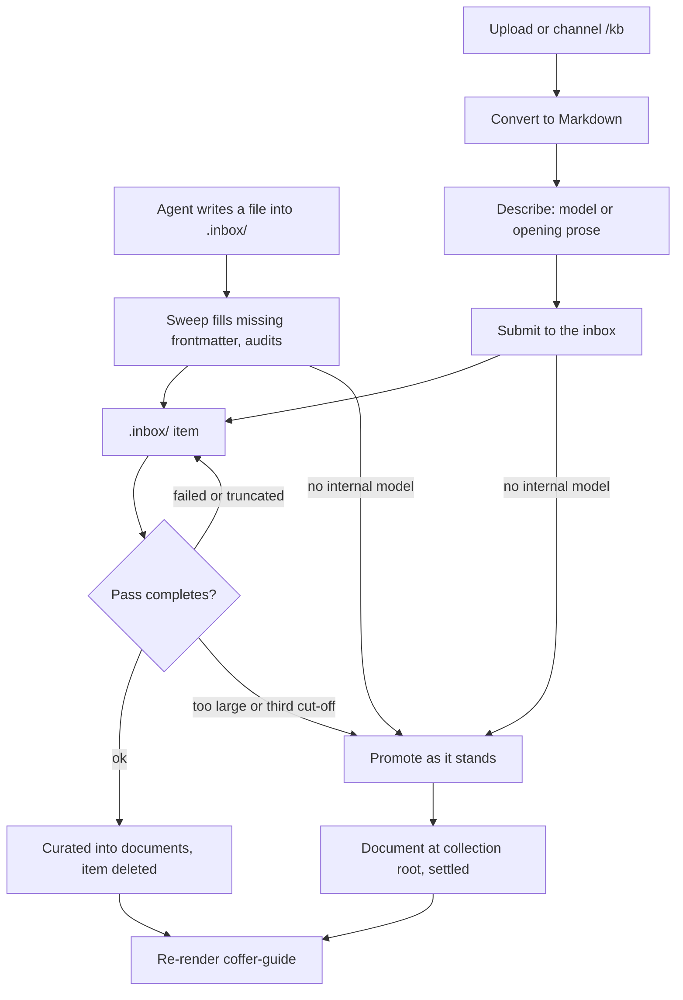
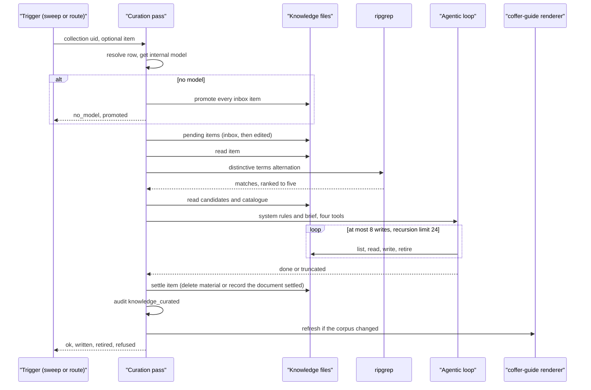
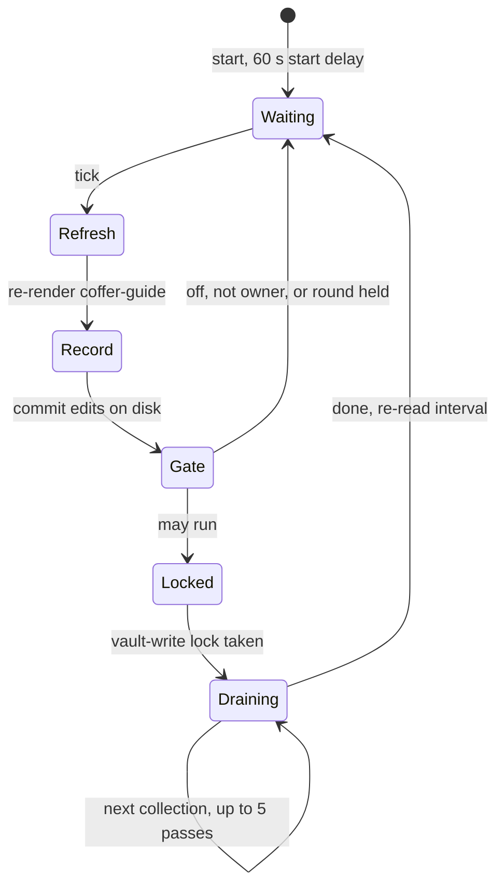

# Knowledge

This page explains how Coffer's knowledge layer is built: why it is plain files with no index, how new material becomes documents through curation, how every write is kept as a version you can restore or undo, how the catalogue reaches agents through the `coffer-guide` skill, and how it coexists with vault sync. It is for engineers who want the mechanism and the reasoning. For day-to-day use, see the [Knowledge guide](/guides/knowledge).

## The problem

Knowledge is what a developer has learned about their working environment: which team owns a service, the conventions of a repository, a pitfall and how to avoid it. Several agents need to read it, and people and agents both need to add to it. Three failure modes shaped the design:

- **Copies diverge.** If each agent keeps its own notes, what one learns in the morning is invisible to another in the afternoon.
- **Retrieval tools go unused.** A tool an agent has to remember to call is not retrieval. An audit of 448 Claude Code sessions, taken after a corpus had been built behind a set of knowledge tools and a delivered skill, found that the skill had never been loaded and no knowledge tool had ever been called. Every agent Coffer supports already has `Read` and `Grep`, and uses them constantly.
- **Hand-maintained links rot.** In the same corpus, 343 of 398 internal file references were dead, each one a file name written into prose and broken by a later rename.

Knowledge is also distinct from [memory](/architecture/memory). Knowledge is about the world and arrives because someone put it there. It is organised by collection and pulled through a skill. Memory is about the user and their projects. It accrues on its own and is aggregated from the agents' native memory.

## Design decisions

| Decision | Reason |
| --- | --- |
| A collection is one directory tree of Markdown files under `~/.coffer/vault/knowledge/<collection>/`. | Every agent reads the same bytes, so no copy can diverge. An edit made in any editor is live on the next read. |
| No index of any kind: no table, no FTS, no vectors, no cache. | Nothing derived can disagree with the files. There is nothing to rebuild or reconcile. |
| A file's path is its identity. | A readable slug is what a person sees in a file manager and what an agent sees in a grep result. |
| Metadata lives in YAML frontmatter. | Only the file is visible to every writer: people, agents and Coffer. |
| New knowledge arrives as material in a hidden `.inbox/` and a curation pass folds it into the documents. | A collection grows by integration rather than by adding one file per upload. |
| Every accepted write is one git commit naming its writer. | Curation rewrites the only copy unattended. A history of who changed what makes every change inspectable, every version restorable and every pass reversible. |
| The newer statement wins unless the older one is shown to be right. No writer is exempt, and the pass carries an edit outward as a newer statement. | A statement is judged by when it was made and the evidence behind it, never by who wrote it: a person's edit, an agent's and a pass's can all be stale or wrong. History, restore and undo are the recovery path. |
| No document may name another knowledge file. This is enforced at the write. | Paths move as the corpus is reorganised. The catalogue resolves subjects to paths, and the catalogue is generated. |
| No retrieval tool. The catalogue rides in Coffer's own skill. | Agents read files with the tools they already use. The layer's job is to put the right absolute paths in front of the model. |
| Agents add knowledge by writing a Markdown file into a collection's `.inbox/`. No agent-facing tool: Coffer's only built-in MCP tool is `coffer__search_tools`. | Agents already write files with their own tools. The sweep fills the frontmatter, audits the item and curates it, so the agent needs to know only the directory. |
| No gate per collection: no per-agent reach and no enabled switch. Every collection is served to every agent. | The skill hands every agent the whole knowledge root. A per-agent filter or a switched-off collection would narrow a list while still disclosing the root. |

## The collection tree

```text
~/.coffer/vault/knowledge/          # inside the vault repository
├── payments/                     # one collection = one knowledge Resource
│   ├── README.md                 # the collection's own description
│   ├── session-ownership.md      # a document
│   ├── infra/
│   │   └── cache.md              # nesting is allowed and means nothing
│   └── .inbox/                   # material waiting to be curated (hidden)
│       └── rate-limit-change.md
└── personal/
    └── ...
```

- **A collection** is a top-level directory and one resource of kind `knowledge`, filed as `vault/resources/knowledge/<name>.json`. A person creates it deliberately, in the web UI. Reads, writes, files an agent drops elsewhere and working directories never provision one, and nothing derives a boundary from an agent's cwd. The knowledge layer adds no table anywhere.
- **The README** sits at the collection root. Its first paragraph is the collection's description. It is read from disk on every listing and never copied into the resource file, because a copy would be wrong the first time a person edited the README. The README is never listed as a document, counted or curated. A collection has no title of its own: every surface shows it by its folder name, and the resource update refuses a title. Editing the description in the web UI rewrites exactly that first paragraph and leaves the rest of the README alone, as one commit naming the user; the guide skill is re-rendered afterwards, because the description is how an agent recognises the collection.
- **Nesting** is chosen by whoever files a document, a person or curation. Coffer assigns folders no meaning.
- **Hidden entries** (dot-prefixed) are excluded from every document count and from the catalogue. Inside a collection Coffer writes exactly one: `.inbox/`. The vault repository's `.git/info/exclude` ignores every other hidden entry inside a collection, so it is neither committed nor synced. The tree view lists a collection root's `.inbox/` as a directory and the read view reads its items, so a person can see what is waiting; no other hidden entry is listed or readable, and no Coffer surface edits or deletes an inbox item. An agent adds one by writing a file there.

### Path as identity

File names are slugs derived from the title. The slug is NFKC-normalised and lower-cased. CJK characters are kept, because a transliteration would be a name nobody recognises. It is capped at 80 characters. A collision appends `-2`, `-3` and so on:

```text
payments/session-ownership.md
payments/session-ownership-2.md
```

Frontmatter carries no `id` key, and nothing maps ids to paths.

### Frontmatter

```yaml
---
title: Session ownership
description: Which team owns the session service and how to reach them.
actor: user
created_at: '2026-09-20T08:14:03.512+00:00'
updated_at: '2026-09-22T10:02:41.107+00:00'
reviewed_by: alice          # a key a person added; always preserved
---
```

Coffer writes five keys, in a fixed order: `title`, `description`, `actor` (`agent` or `user`), `created_at` and `updated_at`. Any other key a person added is kept, with its parsed value unchanged, whenever Coffer rewrites the file. This matters because curation rewrites documents unattended. Dropping an unknown key would quietly delete a person's `tags:`.

### One module owns every path

One module in the knowledge infrastructure builds every path; nothing else constructs one. Every segment passes a guard that refuses empty, all-dot, dot-prefixed and non-allowlisted segments, so `payments/.inbox/x.md` is not addressable from any surface. The resolved path is also checked against the knowledge root on its nearest existing ancestor, so a symlinked directory inside the root cannot carry a write out of it. Writes go through a sibling temp file opened with `O_EXCL | O_NOFOLLOW`, followed by one atomic rename, and are committed through the vault's one writer. The root is always `~/.coffer/vault/knowledge`; there is no override.

## From material to document

Every entrance puts **material** into the collection's inbox. None of them writes a document.

| Entrance | Surface |
| --- | --- |
| A Markdown file written into `<collection>/.inbox/` | An agent's own file tools; the sweep normalises it |
| Upload, converted to Markdown first | The Knowledge page |
| `/kb <collection>` after an attachment | A paired [channel](/architecture/chat) owner |

There is no entrance that creates a document at a path, and the web UI has no form for typing one in: a person writes through the editor (a save of an existing document's body) or uploads, so the inbox and the same curation decide where new knowledge belongs.


```mermaid
flowchart TD
  W["Agent writes a file into .inbox/"] --> N["Sweep fills missing frontmatter, audits"]
  U["Upload or channel /kb"] --> C["Convert to Markdown"]
  C --> D["Describe: model or opening prose"]
  D --> S["Submit to the inbox"]
  S --> I[".inbox/ item"]
  N --> I
  S -->|"no internal model"| P["Promote as it stands"]
  N -->|"no internal model"| P
  I --> Q{"Pass completes?"}
  Q -->|"ok"| M["Curated into documents, item deleted"]
  Q -->|"failed or truncated"| I
  Q -->|"too large or third cut-off"| P
  P --> DOC["Document at collection root, settled"]
  M --> G["Re-render coffer-guide"]
  DOC --> G
```

### Submission

Submission by upload or `/kb` checks that the collection exists, then writes one inbox item. The item has the same frontmatter and Markdown shape as a document and is named by the title's slug. It never overwrites an existing item, because two submissions with the same title are two pieces of material. A submission is a plain file write, with no model, conversion or indexing step. It records one `knowledge_written` audit event.

The answer says what happened to the material:

- `pending`, with no path, when it waits in the inbox. An inbox address disappears once the material is curated, so Coffer does not report it.
- `written`, with a document path, when there is no internal model to curate it. In that case the material is **promoted** on the spot: it becomes a document at the collection root, as it stands, recorded as settled. Knowledge must not wait in a hidden directory for a model connection nobody configured.

### An agent's inbox file

An agent calls nothing. It writes a Markdown file at `<collection>/.inbox/<any-name>.md` with its own file tools, frontmatter optional; the `coffer-guide` skill tells it the path and lists the collections that exist. The sweep recognises a new inbox file that no Coffer surface wrote and **normalises** it before committing it as an edit on disk:

- `title` is kept, else the first `# ` heading, else the file name's stem.
- `description` is kept, else the first prose paragraph, else the title, the same fallback an upload uses.
- `actor` is kept as written, because it is self-reported, else `agent`.
- `created_at` and `updated_at` are kept, else the time the sweep saw the file.
- Every other key the writer set is kept.

One `knowledge_written` audit event is recorded per item, marked when the actor came from the file. From then on the item is material like any other. A Markdown file in a top-level directory that is not a collection is left alone and never catalogued, because only a person creates a collection. A non-Markdown file in an inbox is left in place, logged, and not curated.

Coffer deliberately offers no write tool for this. The file is the interface an agent already uses, the directory is the only thing it must know, and the sweep supplies the parts it would otherwise have to get right.

### Uploads

An upload goes through four steps, in order:

1. **Bounds the upload.** It takes one file per call, up to 20 MiB. It refuses unknown collections before paying for conversion.
2. **Converts it.** A converter registry dispatches by extension. Passthrough (Markdown, text and source files) runs first, then CSV, then MarkItDown for everything else. An unsupported type is refused with `INGEST_REJECTED` and `reason: unsupported_type`. A conversion that yields no text, such as an image-only PDF, is refused too. Nothing is written in either case.
3. **Describes it.** The description comes from the internal model when one is configured and answers in time. Otherwise it is the document's first prose paragraph, and failing that its title. The description is never empty, because it is what the catalogue shows an agent.
4. **Submits the Markdown as material** with `actor: user`.

Neither the original bytes nor the extracted text is kept as a file. The upload carries its knowledge, and once the knowledge is curated the carrier has nothing left to say. The trade-off is that a bad conversion cannot be redone from a copy Coffer kept. You re-upload from your own copy.

`markitdown` is imported lazily. An import-linter contract confines it to the knowledge converters and the channel's document extraction.

### Direct edits

Writing, editing or deleting a document directly, in your editor or with an agent's own file tools, is a complete way to change knowledge. No import or registration step is needed, and the change is live on the next read. The sweep notices the edit by its content (see [Settling an item](#settling-an-item) below) and carries it into the rest of the collection as a newer statement. Deleting a document through Coffer is a person's action in the web UI. Coffer offers no tool that deletes anything.

The web UI can also edit a document in place. A save replaces a document's **body** and keeps its frontmatter. Reading a document yields a fingerprint of the file, and the save must send back the one the editor loaded: a file that changed on disk since, whether by a person's own editor or a curation pass, is refused as a conflict and left untouched. The refusal carries the document as it is on disk now, its body and its fingerprint, so the editor can offer Reload, Compare and Copy my text without a second save over the file; saving the person's text again needs the new fingerprint. The save is a `user` commit, so the sweep carries it outward like any edit made in an editor. An inbox item, the README and any path outside a document are refused. Each save records one `knowledge_edited` audit event and is one commit naming the user (see [History](#history)). An edit made in an editor or with an agent's file tools is committed too, as an edit on disk.

## The curation pass

Curation turns material into knowledge and carries an edit in one document through to the rest. A **pass** curates one item; a **run** drains a collection by running passes one after another. It is a bounded agentic loop that runs on Coffer's internal model connection (see `coffer config set engine.model`). It is driven by a LangGraph ReAct loop that lives in the LLM infrastructure. The knowledge package reaches the loop only through a narrow port it defines, so it never imports LangChain.

### What a pass sees

A pass takes **one item**: one piece of material, or one document edited since curation last saw it. Its context is bounded:

- **The item, in full.** An item longer than 120,000 characters is never shown to the model. See [Outcomes](#outcomes).
- **At most five candidate documents, in full.**
- **The collection's whole catalogue** of paths, titles and descriptions.

The rules go in the system turn, which is identical on every pass so a provider can cache it. The brief, which can run to tens of kilobytes, goes in the user turn.

### Candidate selection

There is no index, so candidates are selected literally:

1. It extracts up to 24 distinctive terms from the item, most specific first: backticked identifiers, dotted service names, ALL-CAPS constants, words from the title and headings, and CJK runs. Short terms and a short stopword list are dropped. Latin terms need 4 characters and CJK terms need 2.
2. It joins them into one escaped alternation and runs it over the collection's documents with ripgrep.
3. It ranks documents by hit count and keeps the top five. The item itself and the collection's own README are never candidates (a README in a subfolder is an ordinary document). The inbox is never searched, because ripgrep skips hidden directories.

The selection is crude on purpose. Getting it wrong is survivable because the catalogue is also in the prompt: a model handed five irrelevant candidates can still see that none of them owns the subject and open a new document.

### Ripgrep and the Python fallback

The search runs `rg --json --no-hidden` with a 5-second timeout and a cap of 200 matches. `--no-hidden` is passed explicitly because a user's `$RIPGREP_CONFIG_PATH` could otherwise enable hidden files. An rg exit code of 2 surfaces as an invalid pattern rather than "no matches". A timeout kills rg and reports truncation.

On a machine without `rg`, a pure-Python fallback walks the same files in a worker thread with the same rules: line-by-line regex, per-file cap, hidden entries and binary files skipped, and the same wall-clock budget. The switch is logged once per process. This is the only place literal matching survives in the layer, and nothing outside the daemon process can reach it.

### The four tools

A pass has four tools and nothing else. Together they are its entire tool surface, fenced to one collection's documents:

| Tool | What it does | Enforced in code |
| --- | --- | --- |
| `list_documents` | Every document with its title and description. | Documents only: never the inbox or the README. |
| `read_document` | One document in full. | The path must be a document of this collection. |
| `write_document` | Replaces a document at `path`, or creates one named from its title, in an optional `folder`. | Counts against the write limit. Refuses a body that references a knowledge file. Recorded as settled. |
| `retire_document` | Deletes a document whose content this pass has already written elsewhere. | Counts as a write. Refused unless the pass has seen the document and has since written a *different* document. |

These tools are internal. They are not registered on the MCP gateway or in the builtin tool registry.

**The write limit.** A pass may make at most eight writes, and a retire counts as one. After that, every write answers with an error telling the model to stop. One item can never trigger a corpus-wide rewrite.

**No internal references.** Before writing, the tool scans the body for tokens that look like Markdown file names. It refuses the write if a token starts with `<collection>/` or its basename matches a file this collection holds. A document may still mention another repository's `AGENTS.md`, because refusing that would be a rule the model cannot satisfy. The check lives in code because asking for it in a prompt is what produced the dead references.

**The retire rule.** Code cannot prove that facts moved. It can refuse every retire for which they could not have: before any write, of a document the pass never saw, or where the only write since was to the document itself.

**Folder spelling.** A model shown `payments/x.md` naturally answers `folder="payments"`. The tool strips a leading collection segment rather than creating `payments/payments/x.md`.

### Precedence rules

Two rules cannot be adjudicated by code, so they live in the system prompt:

- **The newer statement wins, unless the older one is shown to be right.** When new material contradicts a document, the document is corrected unless a source, a date, a command's output or the code shows the older statement is right. The superseded statement stays legible with the date it changed, for example "(previously recorded as X; corrected 2026-09-20)".
- **No writer is exempt.** A person, an agent and a pass are judged by when a statement was made and the evidence behind it, never by who wrote it. When the item is a document someone edited, the pass carries the edit outward as a newer statement: correcting other documents that disagree, and moving a section that belongs elsewhere. The edited document is not protected from a later item that corrects it by the same rule.

Two guards protect data rather than a writer, so code enforces them: a pass never overwrites a document whose bytes changed after it read them (the write is refused and counted in `refused`, so an edit made while a pass runs is never silently reverted), and a rewrite keeps every frontmatter key it did not set.

The prompt also says: lose nothing and integrate rather than regenerate, read before you write, organise by subject rather than by provenance, and give every document a description that states the question it answers.

### A pass, end to end


```mermaid
sequenceDiagram
  participant T as "Trigger (sweep or route)"
  participant P as "Curation pass"
  participant FS as "Knowledge files"
  participant RG as ripgrep
  participant L as "Agentic loop"
  participant G as "coffer-guide renderer"
  T->>P: collection uid, optional item
  P->>P: resolve row, get internal model
  alt no model
    P->>FS: promote every inbox item
    P-->>T: no_model, promoted
  end
  P->>FS: pending items (inbox, then edited)
  P->>FS: read item
  P->>RG: distinctive terms alternation
  RG-->>P: matches, ranked to five
  P->>FS: read candidates and catalogue
  P->>L: system rules and brief, four tools
  loop at most 8 writes, recursion limit 24
    L->>FS: list, read, write, retire
  end
  L-->>P: done or truncated
  P->>FS: settle item (delete material or record the document settled)
  P->>P: audit knowledge_curated
  P->>G: refresh if the corpus changed
  P-->>T: ok, written, retired, refused
```

### Settling an item

An item is settled only after its pass completes. Curated material is deleted from the inbox; its text stays in the history, because the inbox is tracked there. The whole pass, its writes and the settling together, is one commit (see [History](#history)). An edited document is recorded as settled, and nothing in it changes. A pass that raises, or that the recursion limit cuts off, leaves the item as it was, so a later sweep retries it rather than losing it.

**Content is the watermark, never a modification time.** `local/curation.json` records, per document, the blob it had when curation last settled it. A document is owed a pass when its blob at `HEAD` differs from the settled one and the newest commit that touched it is not a `curation` or `sync` write: a person's edit or an agent's is carried outward, while Coffer's own output and another machine's already-curated change are not. A checkout, a backup restore or a clock change that only moves modification times makes nothing pending. The file is machine-local and can be rebuilt by letting curation look at everything once.

### Outcomes

Every pass outcome is a `status` (see [Manual runs](#manual-runs) for how a run reports its passes):

| Status | Meaning |
| --- | --- |
| `ok` | The pass ran and settled its item. Reports `written`, `retired`, `refused`, `model`, `candidates` and document counts before and after. |
| `no_model` | No internal connection. Every inbox item was promoted as it stands (`promoted`). |
| `up_to_date` | Nothing pending. Nothing ran and nothing was touched. |
| `too_large` | The item exceeds `limit`. Material is promoted as it stands (`promoted`). An edited document is recorded as settled (`stamped`). The model saw nothing. |
| `truncated` | The recursion limit cut the pass off. Its writes stay and the item stays owed. On the third consecutive cut-off of the same item, `gave_up` is `true` and the item is promoted or settled. |
| `failed` | The loop raised. The item is unchanged. |

A run over a collection that is already in flight is refused with `UPKEEP_ALREADY_RUNNING`. Consecutive cut-offs are counted in memory, so nothing is written into the synced tree to hold the count. A restart resets it, which costs at most three passes per item per restart.

Every pass that ran, cut off or not, records one `knowledge_curated` audit event. Curation has no review step, so the history and the audit log are where a person sees that something rewrote the corpus, and a pass they disagree with can be undone as a whole.

## The sweep

The sweep is a background asyncio task in the daemon, started when the HTTP surface wires up curation. It follows the same shape as the retention worker.


```mermaid
stateDiagram-v2
  [*] --> Waiting: start, 60 s start delay
  Waiting --> Refresh: tick
  Refresh --> Record: re-render coffer-guide
  Record --> Gate: commit edits on disk
  Gate --> Waiting: off, not owner, or round held
  Gate --> Locked: may run
  Locked --> Draining: vault-write lock taken
  Draining --> Draining: next collection, up to 5 passes
  Draining --> Waiting: done, re-read interval
```

On each tick the worker does the following:

1. **Re-renders the guide skill**, before and regardless of the gate. Creating or deleting a collection changes what every agent is told, even on a machine where curation is off or that is not the owner. A render that produces the same bytes writes nothing.
2. **Settles edits on disk.** Anything changed in the tree since the last commit, such as a person's editor or an agent's file tools, is committed as an edit on disk through the vault writer, whether or not the gate lets curation run, so the history stays current.
3. **Checks the gate.** `auto_curate_enabled` must be on (the default), and `curate_owner_machine_id` must name this machine or be unset. The pass also does not run while a sync round is waiting on the user: stopped on a conflict, held for deletions, or waiting on a join's choices.
4. **Takes the vault-write lock for each pass**, the same lock a sync round holds, never for the whole sweep. See [Locking with sync](#locking-with-sync).
5. **Works through each collection**, identified by uid; every collection is listed. Pending items are all inbox material, oldest first, then edited documents, oldest first. The worker claims the collection in the in-process upkeep-run registry and skips it if a manual run holds it. It re-reads the pending list inside the claim, pushes items cut off last time behind the rest, and runs at most five passes. `no_model` or `failed` ends that collection's sweep. `truncated` does not, so one stubborn item cannot starve the rest.
6. **Waits for the next tick.** The interval defaults to one hour; a manual run drains a collection at once when something is wanted sooner. It is re-read while the wait runs, so a change made with `coffer config set engine.upkeep.curate.interval` or in the Knowledge page's Automatic popover applies within a slice rather than after a wait committed at boot.

A failed sweep is logged and never ends the loop. Shutdown cancels the task without waiting on a pass. The watermark makes a sweep idempotent, so the next boot picks up whatever was left.

### The owner machine

A pass rewrites synced content unattended. If two machines curated the same corpus, each would fold the same material into a *different* document. Git would merge both additions cleanly, and the vault would hold the same knowledge twice with no conflict reported. So curation runs on one machine only.

`auto_curate_enabled` and `curate_owner_machine_id` live in the synced engine settings document, `vault/state/settings/internal-engine.json`, and the sweep reads both on every tick. No owner means a single-machine vault, where "here" is the only answer. An owner naming a machine the registry does not know stops curation everywhere. That is the safe direction: no curation costs waiting material, while curation everywhere costs silent duplication. You can inspect and change the owner with `coffer config get|set|unset engine.curate_owner`.

### Manual runs

The Knowledge page's **Curate now** runs the same pass the worker uses, through a drain that runs passes one after another. A collection is claimed first, so a second request is refused immediately with `UPKEEP_ALREADY_RUNNING` rather than blocking. A run is also refused with `KNOWLEDGE_CURATION_HELD` while a sync round waits for a person; the owner-machine gate is the sweep's alone, because pressing the button is choosing this machine.

A run reads the pending list **once**: inbox items oldest first, then documents edited out of band. It then runs one pass per item, one at a time, each still bounded to eight writes, until nothing that was pending is left. It takes the vault-write lock for each pass rather than for the whole run, so a sync round can interleave between passes. A pass refuses to overwrite a document whose bytes changed after it read them, and counts the refusal in `refused`. Items that arrive during the run wait for the next run or sweep, which keeps *m* in "n of m" fixed.

| Pass outcome | What the run does |
| --- | --- |
| `ok`, `too_large`, `truncated` | Goes on to the next item. A truncated item stays pending. |
| `failed` | Stops. The rest stay pending for the next run or sweep. |
| `no_model` | Stops. That one pass has promoted the whole inbox. |

The answer lists every pass's outcome in order, with the run's own `status` (`ok`, `failed`, `no_model` or `up_to_date` when nothing was pending) and `total`. While the run is in flight its progress (`done` of `total`) is readable on the daemon's list of runs in flight, and after each pass a `change` event naming the kind `knowledge` and the collection's uid is published on the daemon's event stream, so an open page refreshes as the corpus moves.

A run can also be limited to one document: exactly one pass over that document, with anything else pending left pending.

## Locking with sync

A curation pass and a [vault sync](/architecture/vault-sync) round both write the vault. A merge checked out halfway through a rewrite would land on a torn state. So both take the one lock owned by the sync service: the manual route and the worker each take it once per pass, never for a whole run or sweep.

Two locks are in play, at different scopes:

| Lock | Scope | Collision it prevents |
| --- | --- | --- |
| Upkeep-run claim (the in-process upkeep-run registry) | One collection, in-process | A manual run and the sweep over the same collection |
| Vault-write lock (the sync service's lock) | The whole vault | A pass and a sync round |

## History

Every accepted write to a collection is one git commit naming its **writer**, following the decision that every vault write is a validated commit naming its writer. A document's history is therefore a list of versions, each with a writer, a time and a diff, and a curation pass is a single change that can be inspected and undone.

### Writers

| Writer | What it covers |
| --- | --- |
| `user` | A person's save, delete, restore or undo, and collection create, rename and remove. |
| `agent` | An agent's submission promoted on arrival because no model is set, naming the agent. |
| `curation` | One commit per pass, naming the item it curated and who submitted that item: the agent, taken from the item's `knowledge_written` audit event, or `user`. |
| `sync` | Paths that vault sync applied. |
| `disk` | Anything else found changed in the tree: a person's own editor, an agent's own file tools. |

Changes made outside Coffer are never counted as Coffer's. The vault's scanner commits whatever a person or an agent's own tools changed as **Edited on disk** once the file has been quiet, and it does the same at every sweep tick and before every history read. A curation pass holds its commit open while it runs; the documents it has touched are its own meanwhile, and an edit-on-disk commit leaves them alone.

Submissions waiting in the inbox are commits as well, because the inbox is tracked: once a pass consumes an item, its text is still recoverable from the history. Those commits are not shown as changes, since material that has not been curated has not changed any document yet.

### Where it lives

The history is the vault repository's own: collections sit under `knowledge/` in `~/.coffer/vault`, so a document's history is that file's history in the one repository, and the knowledge routes read it from there. A home upgraded from an earlier Coffer had its knowledge history folded in by `coffer migrate`, every commit kept with its message, author and date.

Knowledge commits carry the vault's trailers plus the knowledge ones (`Coffer-Writer`, `Coffer-Operation`, `Coffer-Actor`, `Coffer-Agent`, `Coffer-Collection`, `Coffer-Item`, `Coffer-Status`, `Coffer-Restored-From`, `Coffer-Undoes`). Git runs with the user's global and system configuration pinned to `/dev/null`, so a personal hook, signing rule or alias cannot change what is recorded. The vault needs git: a machine without it fails at startup with the install step named.

### Reading and restoring a document

A document's versions are listed newest first with their writer and time, and each version's diff can be read. Restoring a version writes that version's bytes back as a new commit naming the user; the history before it stays intact. The restore is a person's change, so the sweep carries it outward like any other edit. A deleted document is restored the same way, from the version before its deletion.

A delete, of one document or of a whole collection, is itself a change in the feed, listing every file it removed. Restoring it reads each removed file from the commit before the delete and writes it back byte for byte, as one new commit naming the user and carrying `Coffer-Restored-From`. A document goes back into its collection. A collection gets a new resource file under its old name, then its documents, its README and the items that were waiting in its inbox; the inbox items come back as items, so curation still owes them a pass. Nothing is written when the restore would overwrite: a document at the same path or a collection of the same name is refused, as is restoring a change that is not a delete. A restore records a `knowledge_edited` audit event naming the delete it undid.

### Recent changes

One feed lists the changes across every collection, or one, newest first. Each change carries its writer, its time, its collections and, for each document it touched, whether the document was added, modified or removed with its line counts. Inbox-only commits are left out of the feed; the items still waiting in each inbox are shown beside it with their title, who submitted them and when. One change can be read in full, with each document's diff, so a pass can be inspected before it is undone.

### Undoing a pass

A curation pass is undone as a whole:

- Every document the pass wrote or retired goes back to its exact bytes before the pass, and documents it created are removed, as one new commit naming the user.
- Each restored document is recorded as settled in `local/curation.json`, so the sweep does not read the undo as an edit and redo the pass.
- The item a pass merged is not put back in the inbox; its text stays in the history. An item a pass promoted as it stood (`no_model`, `too_large`, or given up on) is put back in the inbox, because removing the document it became would otherwise lose it.
- When any later commit touched one of the pass's documents, the undo is refused naming that document, and nothing is written. Overwriting a later change would lose it.

Only a pass can be undone this way; any single version is restored instead.

## The coffer-guide skill

The catalogue reaches agents through `coffer-guide`, Coffer's own skill. It is an ordinary `skill` Resource: one master folder under `~/.coffer/derived/skills/coffer-guide/`, one derived resource file with a `builtin` source, and delivered into each agent as the same directory link any imported skill uses. See [Skills](/guides/skills). The knowledge layer contributes the **text** and nothing else.

### Rendering

The renderer is pure: text in, text out, with no port and no filesystem access beyond its own package asset. It renders:

- **The frontmatter description.** This is the only part that is always in a model's context. It names Coffer and its builtin tools, and the subjects the collections cover, each taken from the first sentence of the collection's README. It is capped at 1024 characters, the tightest limit among skill importers, by dropping whole subjects from the tail rather than cutting a sentence. It is emitted through a YAML dumper with unlimited width, so a README containing `: ` or ` #` cannot break or silently truncate the block.
- **The body.** First comes the hand-written manual shipped as package data. It covers the built-in tool, the tool-tiering contract, both roots, that Coffer never writes an agent's memory, and that no Coffer tool waits on an approval. The generated catalogue follows: the knowledge root, and for each collection every document's collection-relative path, title and description. The manual tells the agent to read files with its own tools, to write a Markdown file into a collection's `.inbox/` when it learns something durable, and that it may also edit a document directly.

A body is paid for only when a model opens it; a description is resident in every session. That is why Coffer ships one skill rather than a set. A catalogue entry costs roughly 40 tokens; one measured catalogue of 58 documents came to about 5.2K tokens.

### Deterministic, byte-identical output

The rendered `SKILL.md` is a pure function of the build and the catalogue it is given. No absolute home directory, timestamp or build path enters it. The knowledge root is written as `~/.coffer/vault/knowledge`.

Determinism pays off locally. The skill kind's builtin seeding step compares the rendered text with the master folder, and if they are identical it writes, audits and re-delivers nothing. A boot or sweep tick that changed nothing therefore leaves no trace, and the resource's version hash means "the content moved" rather than "time passed".

### Why it is withheld from sync

The guide depends on this machine's own inputs: where its knowledge root and memory root sit. Two machines with identical knowledge but different roots render different bytes, each correct where it is. If either published its copy, the other would overwrite it, re-render on its next tick and publish back, producing a commit and an audit event per tick on both machines indefinitely. So the skill kind files this one resource in the derived class: its resource file and its folder live under `~/.coffer/derived/`, outside the vault repository, so sync cannot carry them in either direction. Each machine renders its own. See [Vault sync](/architecture/vault-sync).

### The join and its triggers

The knowledge and skill kinds may not import each other. The renderer and the skill kind's seed meet in exactly one module of the composition root, and the seam is a Markdown string. The refresh serialises concurrent calls with a lock and never raises: a failed render or write leaves the previous master in place. It runs:

- at boot, after the skill drift heal and before the background workers start;
- after any curation pass that changed the corpus;
- when a collection is created or deleted;
- on every sweep tick, so a document someone added by hand is catalogued.

## Why no retrieval tool and no embeddings

The layer exposes no tool. Coffer's only built-in MCP tool is `coffer__search_tools`, which finds upstream tools; there is no `list`, `grep`, `read`, `search`, `write` or `delete` tool for knowledge. The session audit showed that such tools were never called, while `Read`, `Grep`, `Edit` and `Write` are used all day. So reading is a file read and writing is a file write, and the effort goes into what the agent is told, through a skill description that carries matchable subjects and a body that carries absolute paths and the inbox rule. The gateway's `initialize` instructions name the built-in tool and point at the skill. They carry no catalogue.

Coffer embeds nothing. It has no vector store, no embedding model and no FTS index. An import-linter contract bans `llama_index`, `mem0`, `chromadb`, `sentence_transformers`, `sqlite_vec` and `fastembed` repository-wide. Each of those libraries wants to own a derived store, and a derived store can diverge from the files. The design relies on a model reading a catalogue, which works while the catalogue fits in context: into the hundreds of documents. Literal matching is a placeholder, not a verdict against semantic retrieval. Semantic retrieval is expected to return once the knowledge and memory design settles, built for the need rather than bolted on.

## Trade-offs

- **Curation rewrites documents unattended.** There is no review step before a pass writes. The safeguards are: no pass overwrites a file that changed after it read it, the eight-write limit, one pass per collection at a time, an audit event per pass, and the history: every pass is one change that can be read in full and undone as a whole, and any document can be restored to any version. An undo refuses to overwrite a later change, so a pass that others have built on is repaired by editing or restoring a document instead.
- **Material waits until a pass runs.** The hidden inbox is not catalogued, so an item is not yet knowledge an agent finds. The hourly sweep, manual runs, and promotion when no model is configured keep the wait short.
- **The history grows with every write.** Nothing prunes it. It sits beside the documents and holds text that curation has since folded away or that was deleted.
- **User content can leave the machine.** The internal model connection is the one place it does. Curation and an upload's generated description are the only things this layer sends there.
- **Nothing here is access control.** An agent with shell tools can read any file under the knowledge root. Every collection is named to every agent; the only way to keep a collection from agents is to delete it.
- **Agents' own file tools leave no read telemetry.** Coffer sees neither the reads nor the writes an agent makes with its own tools. The agents' own transcripts are the retroactive measure of reads, and the vault history names what changed on disk.
- **A filed item's actor is self-reported.** The sweep keeps the `actor` an agent wrote; nothing verifies it.

## Where it lives in the code

| Package | Responsibility |
| --- | --- |
| `application/knowledge/` | Collections, submission, normalising an agent's inbox file, promotion when no model is configured, uploads, the curation pass (candidates, the four fenced tools, the system rules, settling), manual runs, the sweep, history reads, restore, recent changes and undo, and the `coffer-guide` text |
| `infrastructure/knowledge/` | Paths and their guards, file reads and writes, frontmatter, naming, the catalogue, ripgrep and its fallback, the history repository, converters |
| `infrastructure/llm/` | The LangGraph loop behind the curation port |
| `surfaces/http/` | Pass construction, the owner gate and worker start; the renderer-to-skill-seed join; the web UI's knowledge and history routes and the vault-write lock provider |

All paths are under `backend/coffer/`.

## Related

- Spec: [knowledge](https://github.com/wyx-sg/Coffer/blob/main/openspec/specs/knowledge/spec.md), [internal-engine](https://github.com/wyx-sg/Coffer/blob/main/openspec/specs/internal-engine/spec.md), [skill-manager](https://github.com/wyx-sg/Coffer/blob/main/openspec/specs/skill-manager/spec.md)
- Decisions: [Knowledge Is a Directory of Markdown Files, Not an Index](https://github.com/wyx-sg/Coffer/blob/main/docs/decisions/knowledge-is-plain-files.md), [Every Vault Write Is One Validated, Compare-and-Swap Commit That Names Its Writer](https://github.com/wyx-sg/Coffer/blob/main/docs/decisions/every-vault-write-is-a-validated-commit-naming-its-writer.md), [Coffer Ships Its Own Skill](https://github.com/wyx-sg/Coffer/blob/main/docs/decisions/coffer-ships-its-own-skill.md), [Principles → Governance](/architecture/principles#governance)
- Pages: [Knowledge guide](/guides/knowledge), [Memory](/architecture/memory), [Vault sync](/architecture/vault-sync), [MCP gateway](/architecture/mcp-gateway), [Resource framework](/architecture/resource-framework), [MCP tools reference](/reference/mcp-tools)
