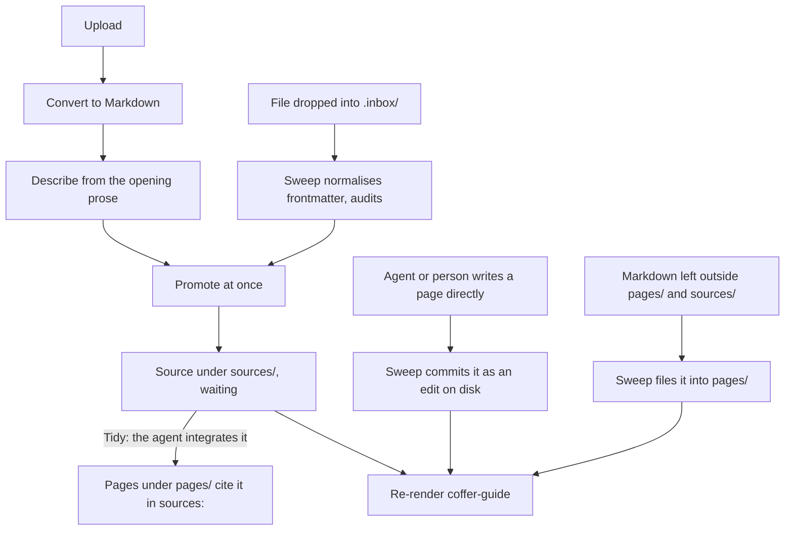
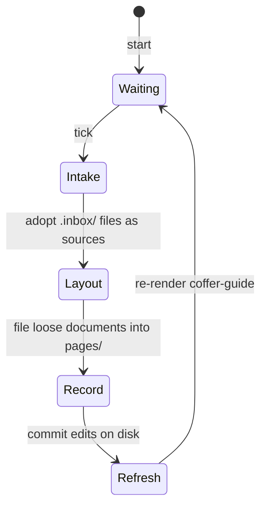

# Knowledge

This page explains how Coffer's knowledge layer is built: why it is plain files with no index, how a collection is a wiki of pages compiled from kept sources, how new material becomes a source at once, how pages link and how Coffer checks them, how an agent writes, integrates, tidies and checks by rules the `coffer-guide` skill teaches, how every write is kept as a version git can show and an agent can bring back, how the catalogue reaches agents through that skill, and how it coexists with vault sync. It is for engineers who want the mechanism and the reasoning. For day-to-day use, see the [Knowledge guide](/guides/knowledge).

## The problem

Knowledge is what a developer has learned about their working environment: which team owns a service, the conventions of a repository, a pitfall and how to avoid it. Several agents need to read it, and people and agents both need to add to it. Four failure modes shaped the design:

- **Copies diverge.** If each agent keeps its own notes, what one learns in the morning is invisible to another in the afternoon.
- **Retrieval tools go unused.** A tool an agent has to remember to call is not retrieval. An audit of 448 Claude Code sessions, taken after a corpus had been built behind a set of knowledge tools and a delivered skill, found that the skill had never been loaded and no knowledge tool had ever been called. Every agent Coffer supports already has `Read` and `Grep`, and uses them constantly.
- **Hand-maintained links rot.** In the same corpus, 343 of 398 internal file references were dead, each one a file name written into prose and broken by a later rename.
- **Free-form documents do not compound.** When every upload stood alone as one more document, was rewritten in place as it was tidied into the rest, and documents were forbidden to name each other, a collection grew as a pile of carriers rather than as subjects: nothing recorded which uploads had been folded in, nothing traced a statement to its origin, and an agent found related material only by grepping for words.

Knowledge is also distinct from [memory](/architecture/memory). Knowledge is about the world and arrives because someone put it there. It is organised by collection and pulled through a skill. Memory is about the user and their projects. It accrues on its own and is aggregated from the agents' native memory.

## Design decisions

| Decision | Reason |
| --- | --- |
| A collection is one directory tree of Markdown files under `~/.coffer/vault/knowledge/<collection>/`. | Every agent reads the same bytes, so no copy can diverge. An edit made in any editor is live on the next read. |
| Each collection is a wiki: a `README.md` schema, kept `sources/` and edited `pages/`. | The LLM Wiki pattern: material is kept as it arrived, and the agent compiles it into pages about subjects that accumulate. See [Knowledge Is a Wiki of Pages Compiled From Kept Sources](https://github.com/wyx-sg/Coffer/blob/main/docs/decisions/knowledge-is-a-wiki-of-pages-compiled-from-kept-sources.md). |
| No index of any kind: no table, no FTS, no vectors, no cache. The link graph and the check are rebuilt from the files on every read. | Nothing derived can disagree with the files. There is nothing to rebuild or reconcile. |
| A file's path is where it is; a page's or a source's slug, its file name, is what links use. | A readable slug is what a person sees in a file manager and what an agent sees in a grep result, and it survives the folder moves a tidy makes. |
| Metadata lives in YAML frontmatter. | Only the file is visible to every writer: people, agents and Coffer. |
| An upload is kept as its converted Markdown only; the uploaded file is not stored. Sources are never edited. | The collection stays one tree of Markdown every agent can read, the sync repository carries no binaries, and a statement in a page can be traced back to the source it cites. |
| Material becomes a source at once. An upload is kept as it arrives, and a file dropped into a hidden `.inbox/` is kept by the next sweep. | Nothing waits for a model connection or a pass. What was submitted is readable by every agent within the minute. |
| Which sources wait is derived from the pages' `sources:` lists. | A manifest of what was ingested would be a second record that can disagree with the pages. |
| Pages link by `[[slug]]`, never by path, and Coffer resolves every link on read. | Paths move as the corpus is reorganised; a slug moves only with a rename, and a link a rename breaks is reported at once instead of rotting silently. |
| Coffer computes mechanical findings on every read and fixes none of them. Judgement is handed to the agent's **Check**, which reports and changes nothing. | Dead links and missing frontmatter are facts a walk can find; contradictions and staleness are judgements. Separate unattended maintenance passes were seen to undo each other. |
| Coffer runs no model over knowledge. Where a fact belongs, which pages answer the same question and which statement is stale are judged by the agent, by rules the `coffer-guide` skill teaches. | The agent a person already uses has file tools, a stronger model and the person watching. A second, unattended model of Coffer's own needed its own connection, and without one its work did not happen. |
| Tidying and checking start only when a person presses **Tidy** or **Check with agent**. Coffer starts no agent run of its own. | An unattended agent run would spend the person's quota without their knowledge and leave conversations nobody started. |
| Coffer moves a file only to keep the layout. | A Markdown document left outside `pages/` and `sources/` is a page in the wrong place; filing it is mechanical, one commit, and rewrites no content. |
| Every accepted write is one git commit naming its writer. | Agents rewrite the only copy. A history of who changed what makes every change inspectable and every version one `git` or one hand-off to an agent away, and it is the collection's change log. |
| The newer statement wins unless the older one is shown to be right. No writer is exempt. | A statement is judged by when it was made and the evidence behind it, never by who wrote it: a person's edit and an agent's can both be stale or wrong. The vault's history and a restore from the history drawer are the recovery path. |
| No retrieval tool. The catalogue rides in Coffer's own skill. | Agents read files with the tools they already use. The layer's job is to put the right absolute paths in front of the model. |
| Agents add knowledge by writing a collection's pages with their own file tools. No agent-facing tool: Coffer's only always-listed built-in MCP tool is `coffer__search_tools`. | Agents already write files. The guide tells them where, and the sweep commits what they changed. |
| No gate per collection: no per-agent reach and no enabled switch. Every collection is served to every agent. | The skill hands every agent the whole knowledge root. A per-agent filter or a switched-off collection would narrow a list while still disclosing the root. |

## The collection tree

```text
~/.coffer/vault/knowledge/             # inside the vault repository
├── payments/                        # one collection = one knowledge Resource
│   ├── README.md                    # the schema; first paragraph is the description
│   ├── sources/
│   │   ├── q3-review.md             # a source: converted Markdown + frontmatter
│   │   └── oncall-notes.md          # a source from a Markdown upload
│   ├── pages/
│   │   ├── session-ownership.md     # a page
│   │   └── infra/
│   │       └── cache.md             # nesting is allowed and means nothing
│   └── .inbox/                      # drop zone, adopted into sources/ by the sweep (hidden)
│       └── rate-limit-change.md
└── personal/
    └── ...
```

- **A collection** is a top-level directory and one resource of kind `knowledge`, filed as `vault/resources/knowledge/<name>.json`. A person creates it deliberately, in the web UI. Reads, writes, files an agent drops elsewhere and working directories never provision one, and nothing derives a boundary from an agent's cwd. The knowledge layer adds no table anywhere.
- **The README** sits at the collection root and is the collection's schema. Its first paragraph is the collection's description. It is read from disk on every listing and never copied into the resource file, because a copy would be wrong the first time a person edited the README. What it says about page types and conventions takes precedence over the guide's defaults, as the guide tells agents. The README is never listed as a page or a source, or counted. A collection has no title of its own: every surface shows it by its folder name, and the resource update refuses a title. Editing the description in the web UI rewrites exactly that first paragraph and leaves the rest of the README alone, as one commit naming the user; the guide skill is re-rendered afterwards, because the description is how an agent recognises the collection.
- **What a file is** follows from where it is. The path module's `kind_of` says `page` for a Markdown file under `pages/`, `source` for one under `sources/`, and `file` for anything else, which is listed but neither catalogued nor checked.
- **Nesting** inside `pages/` and `sources/` is chosen by whoever files a page, a person or an agent. Coffer assigns those folders no meaning; `pages/` and `sources/` are the only directories that mean anything.
- **Hidden entries** (dot-prefixed) are excluded from every count, from the catalogue and from the check, and no surface lists or reads one. Inside a collection the one Coffer reads is `.inbox/`, a drop zone: a Markdown file left there is adopted as a source by the next sweep. The vault repository's `.git/info/exclude` ignores every other hidden entry inside a collection, so it is neither committed nor synced. `.history/` and `.raw/` do not exist: replaced text is in the git history, and an upload is kept only as its Markdown source in `sources/`.

### Path and slug

File names are slugs derived from the title. The slug is NFKC-normalised and lower-cased. CJK characters are kept, because a transliteration would be a name nobody recognises. It is capped at 80 characters. A collision appends `-2`, `-3` and so on:

```text
payments/pages/session-ownership.md
payments/pages/session-ownership-2.md
```

A file's path is its identity; frontmatter carries no `id` key, and nothing maps ids to paths. A page's or a source's **slug** is its file name without `.md`, and it is the name links use (see [Links and the check](#links-and-the-check)). Two pages sharing a slug, in different folders, is a finding, not something Coffer resolves.

### Frontmatter

A page:

```yaml
---
title: Session ownership
type: concept
description: Which team owns the session service and how to reach them.
sources: [q3-review, oncall-notes]
aliases: [sessions]
actor: agent
created_at: '2026-09-20T08:14:03.512+00:00'
updated_at: '2026-09-22T10:02:41.107+00:00'
reviewed_by: alice          # a key a person added; always preserved
---
```

A source:

```yaml
---
title: Q3 review
description: The quarterly review of the payments gateway.
actor: user
created_at: '2026-10-01T09:00:00.000+00:00'
updated_at: '2026-10-01T09:00:00.000+00:00'
---
```

Coffer writes a source's keys, in a fixed order: `title`, `description`, `actor` (`agent` or `user`), `created_at` and `updated_at`. The one key an agent may add to a source is `ingest: skipped`. Coffer writes no page: a page's `title`, `type`, `description`, `sources` (source slugs), `aliases`, `actor` and timestamps are written by whoever writes the page, as the guide teaches. The default page types are `concept`, `entity`, `how-to`, `decision` and `overview`; Coffer accepts any non-empty string, so a README that defines its own types wins. Any other key a person added is kept, with its parsed value unchanged, whenever Coffer rewrites a file. This matters because dropping an unknown key would quietly delete a person's `tags:`.

Frontmatter parsing degrades rather than raising: a file with no fence, or with malformed YAML inside one, yields empty frontmatter and its body, so one hand-edited file with a stray colon cannot break a whole collection walk.

### One module owns every path

One module in the knowledge infrastructure (`infrastructure/knowledge/paths.py`) builds every path and names `pages/` and `sources/`; nothing else constructs one. Every segment passes a guard that refuses empty, all-dot, dot-prefixed and non-allowlisted segments, so `payments/.inbox/x.md` is not addressable from any surface. The resolved path is also checked against the knowledge root on its nearest existing ancestor, so a symlinked directory inside the root cannot carry a write out of it. Writes go through a sibling temp file opened with `O_EXCL | O_NOFOLLOW`, followed by one atomic rename, and are committed through the vault's one writer. The root is always `~/.coffer/vault/knowledge`; there is no override.

## From material to source

Every entrance Coffer serves ends in a source. None of them waits. Pages are written by people and agents, not by Coffer.

| Entrance | Surface | Ends in |
| --- | --- | --- |
| Upload, converted to Markdown first | The Knowledge page, `coffer knowledge upload` | A source (its Markdown only) |
| A Markdown file dropped into `<collection>/.inbox/` | An agent outside Coffer, another machine, or an older guide; the sweep adopts it | A source |
| A page written straight into `pages/` | An agent's own file tools, or a person's editor | A page, committed as an edit on disk |

There is no entrance that creates a page at a path, and the web UI has no form for typing one in: a person writes in their own editor or uploads. The web UI shows every file read-only and opens it in the editor.


```mermaid
flowchart TD
  U["Upload"] --> C["Convert to Markdown"]
  C --> D["Describe from the opening prose"]
  D --> S["Promote at once"]
  W["File dropped into .inbox/"] --> N["Sweep normalises frontmatter, audits"]
  N --> S
  S --> SRC["Source under sources/, waiting"]
  SRC -->|Tidy: the agent integrates it| P["Pages under pages/ cite it in sources:"]
  E["Agent or person writes a page directly"] --> DISK["Sweep commits it as an edit on disk"]
  L["Markdown left outside pages/ and sources/"] --> M["Sweep files it into pages/"]
  SRC --> G["Re-render coffer-guide"]
  DISK --> G
  M --> G
```

### Submission

An upload checks that the collection exists, then writes one source under the collection's `sources/`. Its body is the converted text as it stands. Its frontmatter is filled from the text: `title` from the first `# ` heading (else the file name), `description` from the first prose paragraph (else the title), and `actor` for whoever submitted it. It is named by its title's slug and never overwrites an existing source, because two submissions with the same title are two sources. The commit names whoever submitted it, and one `knowledge_written` audit event is recorded. Coffer then announces the collection on the daemon's event stream as a `knowledge` event, because files change without any write to the collection's row.

Nothing is merged into a page by Coffer. Compiling a source into the pages is the agent's work when the person presses **Tidy** (see [Tidying is the agent's job](#tidying-is-the-agent-s-job)); until then the source waits.

The answer to an upload carries the new source's path.

### A file dropped into the inbox

A file can arrive at `<collection>/.inbox/<any-name>.md`, from an agent outside Coffer, from another machine's older build, or from an older guide. The sweep recognises a new inbox file that no Coffer surface wrote and **normalises** it, then promotes it into `sources/` by the same operation a submission uses:

- `title` is kept, else the first `# ` heading, else the file name's stem.
- `description` is kept, else the first prose paragraph, else the title, the same fallback an upload uses.
- `actor` is kept as written, because it is self-reported, else `agent`.
- `created_at` and `updated_at` are kept, else the time the sweep saw the file.
- Every other key the writer set is kept.

One `knowledge_written` audit event is recorded per file, marked when the actor came from the file. A Markdown file in a top-level directory that is not a collection is left alone and never catalogued, because only a person creates a collection. A non-Markdown file in an inbox is left in place, logged, and not promoted.

### Uploads

An upload goes through four steps, in order:

1. **Bounds the upload.** It takes one file per call, up to 20 MiB, and no folder. It refuses unknown collections before paying for conversion.
2. **Converts it.** A converter registry dispatches by extension. Passthrough (Markdown, text and source files) runs first, then CSV, then MarkItDown for everything else. An unsupported type is refused with `INGEST_REJECTED` and `reason: unsupported_type`. A conversion that yields no text, such as an image-only PDF, is refused too. Nothing is written in either case: no source and no inbox file.
3. **Describes it.** The description is the source's first prose paragraph, and failing that its title. It is never empty. No model writes it.
4. **Promotes the Markdown** with `actor: user` as `sources/<slug>.md`. A collision suffixes the source's name (`-2`).

Only the Markdown is kept: the uploaded file itself is not stored, whichever converter ran. The collection stays one tree of Markdown every agent can read, and the sync repository carries no binaries. The 20 MiB ceiling stays.

`markitdown` is imported lazily. An import-linter contract confines it to the knowledge converters and the channel's document extraction.

### Direct edits

Writing, editing or deleting a page directly, in your editor or with an agent's own file tools, is a complete way to change knowledge. No import or registration step is needed, and the change is live on the next read. The sweep commits it as an edit on disk (see [History](#history)). Deleting a page or a source through Coffer is a person's action in the web UI. Coffer offers no tool that deletes anything.

The web UI does not edit files: a file's pane is read-only (Preview and Source) with **Open in editor** and **Reveal in Finder**, so there is no save route, no file fingerprint and no stale-save refusal. Coffer's route table has nothing that writes a page's text.

## Links and the check

`infrastructure/knowledge/wiki.py` walks one collection's `pages/` and `sources/` once and builds an in-memory `WikiGraph`: every page with its parsed frontmatter and outbound links, every source with whether it is skipped, and the maps that resolve a name to a file. Nothing is stored; every read builds it again. A collection is hundreds of files at most, and a walk takes milliseconds.

### Links

A link is `[[target]]` or `[[target|text]]` anywhere in a page's body outside code spans and fenced blocks, so a link written as an example is not a link. `target` resolves against every page's slug, every page's `aliases` and every source's slug. Matching ignores case and Unicode width, the same NFKC normalisation file names get, and tolerates a trailing `.md` or a leading folder, so a link written as a path still resolves. A target that names nothing is **dead**; one that names more than one distinct file is **ambiguous**. A page's `sources:` entries resolve against source slugs only; an entry that names none is a **missing source**.

A page's read carries each link with the path it resolves to, or none, and each source entry with its path and title; a source's read carries the pages that cite it and whether it waits. A tree listing carries each file's kind and whether a source waits, so the web UI marks a waiting source without a second call.

### Waiting sources

A source **waits** while no page lists its slug in `sources:` and its frontmatter does not set `ingest: skipped`. That is derived from the pages on every read; Coffer keeps no other record of what was integrated. A page citing a source is what integrating it means.

### The mechanical check

From the graph Coffer computes a collection's findings on every read, keeps none of them and fixes none of them:

| Finding | Rule |
| --- | --- |
| `dead_link` | A link that resolves to nothing, with the page and the target. |
| `ambiguous_link` | A link that resolves to more than one file. |
| `duplicate_slug` | Two pages share a slug, or an alias names two pages. |
| `missing_source` | A `sources:` entry that names no source. |
| `incomplete_page` | A page missing `title`, `type` or `description`. |
| `unsourced_page` | A page with no `sources:`. |
| `orphan_page` | A page no other page links to, when the collection holds two or more pages. Pages whose `type` is `overview` are exempt: an overview is an entry point. |
| `waiting_source` | A waiting source. |

`GET /api/v1/knowledge/collections/{uid}/check` returns the findings and the check hand-off, and `coffer knowledge check` prints them. The collection listing carries `page_count`, `source_count`, `waiting_source_count` and `finding_count`, computed per collection with one walk each, and both hand-offs. No route fixes a finding.

## Tidying is the agent's job

Compiling a source into pages, putting a fact where it belongs, folding pages that answer the same question into one, splitting one that answers several, and correcting what is wrong are judgements. Coffer makes none of them. The agent the person already works with has file tools and the person watching, so the judgement lives in the `coffer-guide` skill it loads, and the person starts it with one button. See the decision [Tidying Knowledge and Memory Is the Agent's Job](https://github.com/wyx-sg/Coffer/blob/main/docs/decisions/tidying-knowledge-and-memory-is-the-agents-job.md).

### What the guide teaches

While the knowledge feature is on, the guide's knowledge sections describe the layout — the README as the schema whose page types and conventions win over the guide's defaults, kept `sources/` and edited `pages/` — and carry four instructions.

**Writing a page.** When an agent learns something durable, it puts the fact straight into the collection's pages with its own file tools, by seven rules:

1. **Find its home.** Read the catalogue and grep `pages/` for the subject. Fold the fact into the page that owns it, in the section it belongs in, and create a page under `pages/` only when no page owns the subject.
2. **Lose nothing.** Integrate; never regenerate. Every fact already in a rewritten page survives.
3. **Organise by subject, never by provenance.** No sections like "Added today".
4. **The newer statement wins unless the older one is shown to be right** by a source, a date, a command's output or the code, whoever wrote either. The superseded statement stays legible, with the date it was corrected.
5. **Link pages by `[[slug]]`, never by path.** When renaming a page, update the links to it or keep its old slug in `aliases`.
6. **Never edit a source**, except to add `ingest: skipped`.
7. **Give every page frontmatter**: a `title`, a `type`, a one-line `description` saying what question the page answers, its `sources`, any `aliases`, and `actor: agent`. Keys a person added are left alone.

**Integrating sources.** Read each waiting source in full, oldest first, and the README; fold what it says into the pages that own its subjects, create pages for subjects with none, add the source's slug to the `sources` of every page changed with it, and mark a source with nothing worth keeping `ingest: skipped`.

**Tidying a collection.** One collection at a time: integrate its waiting sources first; read the README and every page's title and description, then the pages in full; merge pages that answer the same question, keeping every fact and every source and the merged-away slug in the survivor's `aliases`; split one that answers several, linking the parts; fix what is wrong or contradictory, the dead links Coffer reports, and a description that does not say what question its page answers; then report which sources were integrated or skipped, and what was merged, split, corrected and deleted.

**Checking a collection.** Change nothing; read the README, the pages and, where a claim needs it, the sources they cite; report contradictions, stale statements, subjects covered twice and subjects that deserve a page of their own, and Coffer's mechanical findings with what to do about each.

Code enforces none of these rules. They are prose in the skill, and the guard against a bad edit is the history and the mechanical check, not a refusal at a write.

### The Tidy hand-off

The daemon writes the prompt, from the same hand-off module every other hand-off uses (`application/knowledge/tidy_handoff.py`, rendered by `domain/handoff`). Reading a collection carries `tidy_handoff`, which names the collection, gives its absolute path, its page count and its waiting-source count, and tells the agent to integrate the waiting sources by the guide's "Integrating sources" section and then to follow "Tidying a collection". `GET /api/v1/knowledge/tidy-handoff` returns the same kind of prompt for every collection at once: it names the knowledge root and each collection with its path and counts, and asks the agent to work through them one at a time by the same two sections.

The web UI offers **Tidy** on a collection's page and **Tidy all** in the Knowledge page's header. Pressing either starts the default hand-off agent in the preferred terminal with that prompt as its first message, through the same path as every other hand-off. With no managed agent available the button offers **Copy prompt** only. The person pressed a button named for the job, the prompt only edits Coffer's own files, and the tree is recoverable from its history.

### The Check hand-off

Reading a collection also carries `check_handoff`, from the same module. It names the collection and its absolute path, carries its mechanical findings grouped by kind with their paths (at most 40 lines, then how many were left out), and tells the agent to follow "Checking a collection" and to change nothing: no file is written, moved or deleted. The collection page offers **Check with agent** beside **Tidy** and sends the prompt the same way. A check is a report for the person, who then decides what to fix and may press Tidy.

### Nothing tidies unattended

Tidy and Check run only when a person presses them or asks their own agent. Scheduling agent runs would need loop-proofing against Coffer's own hooks, would spend the person's quota without their knowledge, and would leave conversations nobody started. The mechanical sweep and the mechanical check stay Coffer's; judgement does not.

### Precedence

Two rules are about judgement and so live in the guide, not in code:

- **The newer statement wins, unless the older one is shown to be right.** When new material contradicts a page, the page is corrected unless a source, a date, a command's output or the code shows the older statement is right. The superseded statement stays legible with the date it changed, for example "(previously recorded as X; corrected 2026-09-20)".
- **No writer is exempt.** A person, an agent and a tidy are judged by when a statement was made and the evidence behind it, never by who wrote it.

What protects the data is mechanical. Coffer saves no text of a person's on the page, so a stale copy in the browser cannot revert an agent's edit. A rewrite that Coffer itself makes keeps every frontmatter key it did not set. Every agent edit is a version in the history, and a version can be restored from the file's history drawer.

## The sweep

The sweep is a background asyncio task in the daemon. It follows the same shape as the retention worker, and it calls no model.


```mermaid
stateDiagram-v2
  [*] --> Waiting: start
  Waiting --> Intake: tick
  Intake --> Layout: adopt .inbox/ files as sources
  Layout --> Record: file loose documents into pages/
  Record --> Refresh: commit edits on disk
  Refresh --> Waiting: re-render coffer-guide
```

On each tick, once a minute, the worker does exactly four things:

1. **Adopts `.inbox/` files.** Each new Markdown file in a collection's inbox is normalised and kept as a source under `sources/` (see [A file dropped into the inbox](#a-file-dropped-into-the-inbox)). Whatever it promotes, it announces as a `knowledge` event.
2. **Files loose documents.** A Markdown file in a collection outside `pages/`, `sources/` and hidden entries, other than the root `README.md`, untouched for 60 seconds, is moved to `pages/<same relative path>`, suffixed on a collision. All of a tick's moves for one collection are one commit by the `daemon` writer with the `layout` operation, and the text is never rewritten. The quiet minute keeps a file an agent is still writing from being moved from under it. This is how a collection made before pages and sources existed converges on the first sweep after an upgrade, and how an agent that writes to the wrong place is corrected within a minute. `infrastructure/knowledge/layout.py` finds and moves the files; `application/knowledge/layout.py` makes the commit.
3. **Commits edits on disk.** Anything changed in the tree since the last commit, such as a person's editor or an agent's file tools, is committed as an edit on disk through the vault writer, so the history stays current and nothing an agent wrote is counted as Coffer's.
4. **Re-renders the guide skill**, so a page added by hand is catalogued. A render that produces the same bytes writes nothing.

A failed duty is logged and never ends the loop; one file that cannot be moved is logged and skipped. While the `knowledge` feature is switched off the sweep skips its rounds, and the collections stay on disk untouched. Shutdown cancels the task without waiting.

The sweep runs on every machine. It writes only what it promotes and the moves it makes, and those writes go through the vault's ordinary writer like any other, so it holds nothing against a [vault sync](/architecture/vault-sync) round and waits for none. Because it rewrites the content of no file, two machines sweeping the same vault cannot fold the same item into two different pages.

## History

Every accepted write to a collection is one git commit naming its **writer**, following the decision that every vault write is a validated commit naming its writer. A file's history is therefore a list of versions, each with a writer, a time and a diff, read with git, and any version can be brought back. A collection's history is its change log; there is no `log.md` to keep.

### Writers

| Writer | What it covers |
| --- | --- |
| `user` | A person's upload, delete or undo of a delete, a collection's description edit, and collection create, rename and remove. |
| `agent` | An agent's submission promoted on arrival, naming the agent, such as a file it dropped into the inbox. |
| `daemon` | The sweep filing loose documents into `pages/` (operation `layout`). The web UI shows it as **Coffer**. |
| `curation` | A commit an earlier version of Coffer made as a curation pass. It stays in the history under this label. |
| `sync` | Paths that vault sync applied. |
| `disk` | Anything else found changed in the tree: a person's own editor, an agent's own file tools. |

Changes made outside Coffer are never counted as Coffer's. The vault's scanner commits whatever a person or an agent's own tools changed as **Edited on disk** once the file has been quiet, and it does the same at every sweep tick and before every read of the changes feed.

### Where it lives

The history is the vault repository's own: collections sit under `knowledge/` in `~/.coffer/vault`, so a file's history is that file's history in the one repository, read with `git -C ~/.coffer/vault log -p -- knowledge/<collection>/<path>`. Coffer's knowledge routes read it for the changes feed (`GET /api/v1/knowledge/changes`, filterable to one collection), which a collection page's **Change log** lists and a delete's undo reads.

Knowledge commits carry the vault's trailers plus the knowledge ones (`Coffer-Writer`, `Coffer-Operation`, `Coffer-Actor`, `Coffer-Agent`, `Coffer-Collection`, `Coffer-Item`, `Coffer-Status`, `Coffer-Restored-From`). Git runs with the user's global and system configuration pinned to `/dev/null`, so a personal hook, signing rule or alias cannot change what is recorded. The vault needs git: without it the daemon [waits for git](/architecture/daemon#waiting-for-git) and hands the install to an agent.

### Undoing a delete, and older versions

A file's **History** button opens a drawer beside the file (`?history=1` in the address) that lists its versions, shows the diff of the chosen one and restores it, through `GET /api/v1/vault/history`, `GET /api/v1/vault/diff` and `POST /api/v1/vault/restore` (see [Persistence](/architecture/persistence)). The file stays in view while the drawer is open, and the old `/history` path segment redirects to the drawer. A restore is Coffer's own write: one new commit by the user with `Coffer-Operation: restore` and `Coffer-Restored-From: <commit>`, recorded as a `vault_file_restored` audit event. It is refused with `VAULT_FILE_STALE` when the file changed since the history was read; the history before it stays intact. A deleted file has no pane to open a drawer from once the delete's toast is gone, but its versions stay in the vault's git history, so git can bring it back from the version before its deletion.

A delete has its own undo, while the toast's **Undo** is open. A delete, of one file or of a whole collection, is itself a change in the feed, listing every file it removed. Undo (`POST /knowledge/changes/{version}/restore`) reads each removed file from the commit before the delete and writes it back byte for byte, as one new commit naming the user and carrying `Coffer-Restored-From`. A file goes back into its collection. A collection gets its pages, its sources, its README and any files still in its inbox first, then a new resource file under its old name last, so a failure part-way leaves no row and no partial directory. Nothing is written when the restore would overwrite: a file at the same path or a collection of the same name is refused, as is restoring a change that is not a delete. A restore records a `knowledge_edited` audit event naming the delete it undid. Because a collection's registration cannot be brought back from git, **Delete collection** asks first; a file delete does not, since its file is one restore away.

## The coffer-guide skill

The catalogue reaches agents through `coffer-guide`, Coffer's own skill. It is an ordinary `skill` Resource: one master folder under `~/.coffer/derived/skills/coffer-guide/`, one derived resource file with a `builtin` source, and delivered into each agent as the same directory link any imported skill uses. See [Skills](/guides/skills). The knowledge layer contributes the **text** and nothing else.

### Rendering

The renderer (`application/knowledge/guide_render.py`) is pure: text in, text out, with no port and no filesystem access beyond its own package asset. It renders:

- **The frontmatter description.** This is the only part that is always in a model's context. It names Coffer and its builtin tools, the subjects the collections cover, each taken from the first sentence of the collection's README, and, while knowledge is on, that the skill teaches how to write, tidy and check knowledge and memory, so an agent asked to organise either recognises it. It is capped at 1024 characters, the tightest limit among skill importers, by dropping whole subjects from the tail rather than cutting a sentence. It is emitted through a YAML dumper with unlimited width, so a README containing `: ` or ` #` cannot break or silently truncate the block.
- **The body.** First comes the hand-written manual shipped as package data. It covers the built-in tool, the tool-tiering contract, both roots, that Coffer never writes an agent's memory, and that no Coffer tool waits on an approval. While the knowledge feature is on it also carries the layout and the four instructions of [Tidying is the agent's job](#tidying-is-the-agent-s-job). The generated catalogue follows: the knowledge root, and for each collection its README's path, its pages grouped by `type` (an untyped page under "untyped") with each page's collection-relative path, title and description, its sources waiting to be integrated with their paths and titles, and how many sources it holds in all. The manual tells the agent to read files with its own tools, to grep `sources/` for an exact fact a page does not carry, and to write what it learns straight into the collection's pages.

A body is paid for only when a model opens it; a description is resident in every session. That is why Coffer ships one skill rather than a set. A catalogue entry costs roughly 40 tokens; one measured catalogue of 58 documents came to about 5.2K tokens. The catalogue has a budget of 60,000 characters: past it, the whole catalogue drops every description; past it again, it lists only each collection's page, source and waiting counts and the directories to search. Either way it says it was shortened.

### Deterministic, byte-identical output

The rendered `SKILL.md` is a pure function of the build and the catalogue it is given. No absolute home directory, timestamp or build path enters it. The knowledge root is written as `~/.coffer/vault/knowledge`.

Determinism pays off locally. The skill kind's builtin seeding step compares the rendered text with the master folder, and if they are identical it writes, audits and re-delivers nothing. A boot or sweep tick that changed nothing therefore leaves no trace, and the resource's version hash means "the content moved" rather than "time passed".

### Why it is withheld from sync

The guide depends on this machine's own inputs: where its knowledge root and memory root sit. Two machines with identical knowledge but different roots render different bytes, each correct where it is. If either published its copy, the other would overwrite it, re-render on its next tick and publish back, producing a commit and an audit event per tick on both machines indefinitely. So the skill kind files this one resource in the derived class: its resource file and its folder live under `~/.coffer/derived/`, outside the vault repository, so sync cannot carry them in either direction. Each machine renders its own. See [Vault sync](/architecture/vault-sync).

### The join and its triggers

The knowledge and skill kinds may not import each other. The renderer and the skill kind's seed meet in exactly one module of the composition root, and the seam is a Markdown string. The refresh serialises concurrent calls with a lock and never raises: a failed render or write leaves the previous master in place. It runs:

- at boot, after the skill drift heal and before the background workers start;
- after the sweep adopts or files a file, or a submission arrives;
- when a collection is created or deleted;
- on every sweep tick, so a page someone added by hand is catalogued.

## Why no retrieval tool and no embeddings

The layer exposes no tool. Coffer's only always-listed built-in MCP tool is `coffer__search_tools`, which finds upstream tools; there is no `list`, `grep`, `read`, `search`, `write` or `delete` tool for knowledge. The session audit showed that such tools were never called, while `Read`, `Grep`, `Edit` and `Write` are used all day. So reading is a file read and writing is a file write, and the effort goes into what the agent is told, through a skill description that carries matchable subjects and a body that carries absolute paths and the writing, integrating, tidying and checking rules. The gateway's `initialize` instructions name the built-in tool and point at the skill. They carry no catalogue.

Coffer embeds nothing. It has no vector store, no embedding model and no FTS index. An import-linter contract bans `llama_index`, `mem0`, `chromadb`, `sentence_transformers`, `sqlite_vec` and `fastembed` repository-wide. Each of those libraries wants to own a derived store, and a derived store can diverge from the files. A knowledge graph store (GraphRAG and its kind) was rejected for the same reason: typed `[[links]]` in plain Markdown give most of the relational benefit without a database a person cannot open. The design relies on a model reading a catalogue, which works while the catalogue fits in context: into the hundreds of pages, with the budget above shortening it past that. Literal matching is a placeholder, not a verdict against semantic retrieval. Semantic retrieval may return later only as a disposable sidecar over files that remain the truth.

## Trade-offs

- **Agents rewrite pages, and Coffer reviews nothing before they do.** The safeguards are the ones any file edit has, plus the check: every change is a version naming its writer, any file can be brought back to any version from its history drawer or through git, the mechanical check reports a broken link or a page missing its sources at once, and a tidy ends with the agent's own report of what it integrated, merged, split, corrected and deleted. A tidy that went wrong is repaired by restoring a version from before it.
- **Sources wait until someone tidies.** An upload or a dropped file stands as a source until the agent integrates it. The person sees the waiting count and the **Tidy** button, and nothing compiles pages behind their back.
- **Compiling costs agent tokens.** An ingest is expensive compared with retrieving from raw sources, so the guide keeps grep over `sources/` as the fallback for an exact fact.
- **A bad conversion cannot be checked against the uploaded file.** Coffer keeps only the Markdown; the person keeps the file they uploaded.
- **The sweep moves files.** Filing a loose document changes its path. Links use slugs, not paths, and the catalogue is regenerated, so nothing refers to the old path but a person's memory; the move is one commit and can be restored.
- **The history grows with every write.** Nothing prunes it. It sits beside the files and holds text that was later folded away or deleted.
- **User content can leave the machine only through the agent the person chose.** Coffer sends no knowledge to any model. Tidy and Check send it to the agent's own provider, as every conversation does.
- **Nothing here is access control.** An agent with shell tools can read any file under the knowledge root. Every collection is named to every agent; the only way to keep a collection from agents is to delete it.
- **Agents' own file tools leave no read telemetry.** Coffer sees neither the reads nor the writes an agent makes with its own tools. The agents' own transcripts are the retroactive measure of reads, and the vault history names what changed on disk.
- **A filed item's actor is self-reported.** The sweep keeps the `actor` an agent wrote; nothing verifies it. Frontmatter on a page is advisory: a page with no sources is a finding, not an error.

## Where it lives in the code

| Package | Responsibility |
| --- | --- |
| `application/knowledge/` | Collections, submission and promotion into `sources/`, normalising a dropped inbox file, uploads, the sweep and its layout duty (`layout.py`), the tidy and check prompts (`tidy_handoff.py`), the changes feed, undoing a delete, and the `coffer-guide` text and catalogue (`guide_render.py`) |
| `infrastructure/knowledge/` | Paths, their guards and what kind a file is, file reads and writes, frontmatter, naming, the catalogue, the wiki graph, links and findings (`wiki.py`), finding and moving loose documents (`layout.py`), the history repository, converters |
| `domain/handoff` | The one place every hand-off prompt, Tidy and Check included, is rendered |
| `surfaces/http/` | Sweep wiring and start; the renderer-to-skill-seed join; the web UI's knowledge routes, the check route and the history hand-off |

All paths are under `backend/coffer/`.

## Related

- Spec: [knowledge](https://github.com/wyx-sg/Coffer/blob/main/openspec/specs/knowledge/spec.md), [knowledge data model](https://github.com/wyx-sg/Coffer/blob/main/openspec/specs/knowledge/data-model.md), [skill-manager](https://github.com/wyx-sg/Coffer/blob/main/openspec/specs/skill-manager/spec.md)
- Decisions: [Knowledge Is a Wiki of Pages Compiled From Kept Sources](https://github.com/wyx-sg/Coffer/blob/main/docs/decisions/knowledge-is-a-wiki-of-pages-compiled-from-kept-sources.md), [Knowledge Is a Directory of Markdown Files, Not an Index](https://github.com/wyx-sg/Coffer/blob/main/docs/decisions/knowledge-is-plain-files.md), [Tidying Knowledge and Memory Is the Agent's Job](https://github.com/wyx-sg/Coffer/blob/main/docs/decisions/tidying-knowledge-and-memory-is-the-agents-job.md), [Every Vault Write Is One Validated, Compare-and-Swap Commit That Names Its Writer](https://github.com/wyx-sg/Coffer/blob/main/docs/decisions/every-vault-write-is-a-validated-commit-naming-its-writer.md), [Coffer Ships Its Own Skill](https://github.com/wyx-sg/Coffer/blob/main/docs/decisions/coffer-ships-its-own-skill.md), [Principles → Governance](/architecture/principles#governance)
- Research: [Knowledge structures](https://github.com/wyx-sg/Coffer/blob/main/docs/research/knowledge-structures.md)
- Pages: [Knowledge guide](/guides/knowledge), [Memory](/architecture/memory), [Vault sync](/architecture/vault-sync), [MCP gateway](/architecture/mcp-gateway), [Resource framework](/architecture/resource-framework), [MCP tools reference](/reference/mcp-tools), [`coffer knowledge`](/reference/cli/knowledge)
