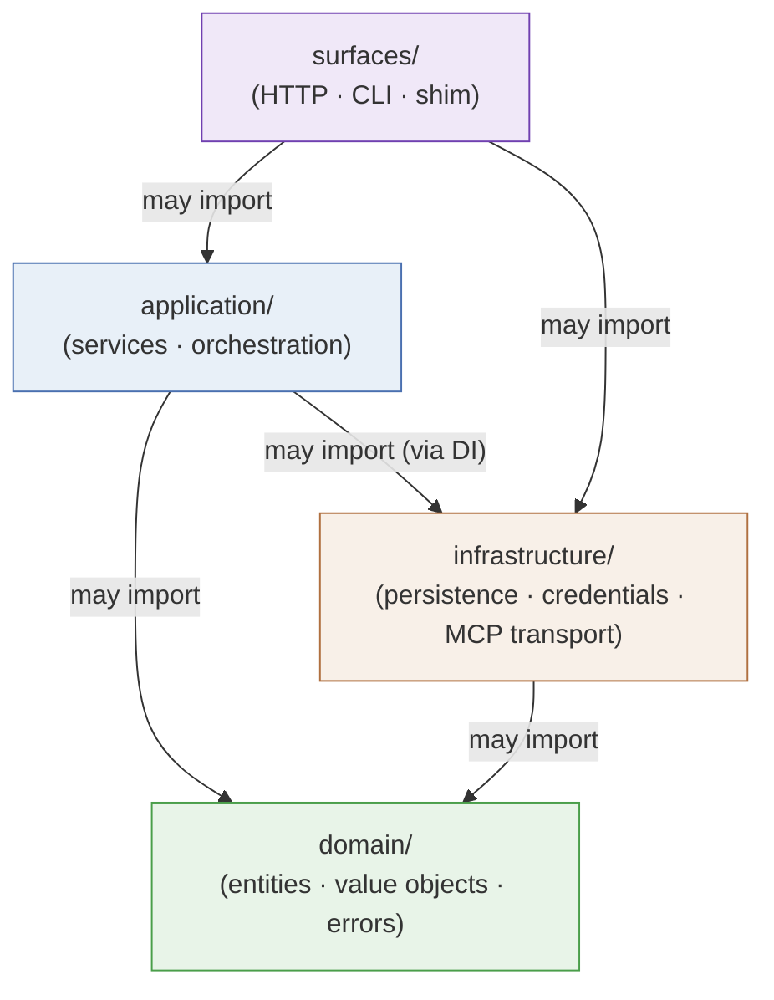

# Layering & Code Boundaries

::: tip Mental model
The four layers of Coffer's codebase are not just an organisational preference — they encode a strict, machine-checked contract about who may call whom. `domain` knows nothing about databases, HTTP, or MCP transport. `infrastructure` is never imported by business logic. The composition root wires everything together once, explicitly, with no global state. Follow the import arrows, and the architecture tells you the full picture.
:::

## The problem this solves

Without enforced layering, a codebase tends to develop circular imports, accidental coupling between unrelated concerns, and untestable business logic that pulls in database sessions or HTTP clients. Coffer's layering exists to prevent exactly these failure modes: the domain layer can be tested with no database, no MCP server, and no OS keychain in sight. Application services can be tested by injecting test doubles for infrastructure. Every layer has a well-defined job that does not bleed into its neighbours.

## The four layers

The constitutional layering diagram is:

```
surfaces  →  application  →  domain
                   ↓
            infrastructure
```

Arrows show the allowed import direction. `surfaces` may import `application`; `application` may import `domain`; both may import `infrastructure`. The reverse is never allowed: `domain` never imports anything from above it, and `infrastructure` is wired in at the composition root, not imported by application or domain code directly.

### domain/

The domain layer contains the kind-agnostic entities and protocols that define what Coffer manages at the conceptual level. This includes `resource.py` (the Resource entity, `ResourceRef`, kind protocol interfaces), `audit.py` (the `AuditEvent` value object), `errors.py` (the canonical error hierarchy), and the `mcp/` subdirectory for MCP-specific value objects (tool schemas, capability descriptors, session state models).

::: warning Absolute invariant
`domain/` may NOT import from `infrastructure/`, `surfaces/`, or any external SDK. No SQLAlchemy, no FastAPI, no `keyring`, no `httpx` — none of these appear anywhere in the domain layer. If a domain entity needs to validate a URL, it uses Python's standard library. If it needs to represent a credential, it holds a string reference, not a keychain handle.
:::

This restriction is not just architectural taste — it is what makes the domain layer universally testable. A `pytest` test that exercises domain logic imports only pure Python; it never touches a database, spawns a subprocess, or reaches the network.

### application/

The application layer orchestrates domain entities with infrastructure and surfaces. It defines the services that implement Coffer's use cases: `resource_service.py` for kind-agnostic CRUD (create/read/update/enable/disable/delete for resources of any kind), `audit_service.py` for recording lifecycle events, `retention_service.py` for the background log-pruning worker, and `application/mcp/` for MCP-specific application services (session management, capability curation, invocation recording).

Application services receive their infrastructure dependencies as constructor arguments (repositories, keychain adapters, upstream clients) — they do not instantiate them. This is the dependency-inversion pattern: the application layer defines what it needs (via interfaces or protocol classes in `domain/`), and the composition root provides the concrete implementation.

::: warning Absolute invariant
`application/` may NOT import from `surfaces/`. An application service must never know whether it is being called from an HTTP request, a CLI command, or a test fixture. This is what allows the same `resource_service.register()` call to be invoked identically from the FastAPI route handler, the Typer CLI command, and the integration test suite.
:::

### infrastructure/

The infrastructure layer contains all external-I/O-performing code: the SQLAlchemy ORM models and Alembic migrations (`infrastructure/persistence/`), the encrypted credential store and master-key manager (`infrastructure/credentials/` — the single place in the entire codebase allowed to import `keyring`), daemon discovery utilities (`infrastructure/daemon/`), and the MCP upstream transport implementations (`infrastructure/mcp/` — subprocess management for stdio upstreams, and an HTTP client for HTTP-transport upstreams).

Infrastructure is wired into the system at the composition root, not imported by domain or application code. Application services receive infrastructure objects as injected dependencies. This means you can swap the real SQLAlchemy repository for a test double (an in-memory dictionary or a SQLite `:memory:` database) without changing a line of application or domain code.

The credential module deserves special mention: `infrastructure/credentials/` is the only location in the entire codebase that may import `keyring` (now confined to the master key and the legacy migration). All other code accesses credentials via opaque string references. This single-point-of-access rule is what makes it mechanically verifiable that secret material never reaches any other layer.

### surfaces/

The surfaces layer adapts external protocols to application calls. It contains the FastAPI application (`surfaces/http/`), the Typer CLI (`surfaces/cli/`), and the stdio shim entry point (`surfaces/shim/`). Surfaces are thin: they parse requests, call application services, and format responses. They contain no business logic.

The two composition roots — `surfaces/http/app.py` for the daemon's HTTP server, and `surfaces/cli/main.py` for the CLI — are the only places where all four layers meet. Each kind is registered explicitly at the composition root via a `KindModule` dataclass, which bundles together the kind's domain entities, application services, infrastructure implementations, and surface route/command handlers. There is no global kind registry and no import-time side effects. Adding a new kind means creating its subdirectories in each layer and adding one `KindModule` registration at the composition root.

## Import rules as invariants

The two critical invariants, stated precisely:

::: warning Import rule 1 — domain isolation
`domain/` may NOT import `infrastructure/`, `surfaces/`, or any external SDK. Violation means domain logic has acquired an I/O dependency that cannot be unit-tested without real infrastructure.
:::

::: warning Import rule 2 — application isolation from surfaces
`application/` may NOT import `surfaces/`. Violation means business logic has acquired a surface dependency, making it impossible to call the same logic from a different surface (e.g., a test) without going through an HTTP or CLI stack.
:::

A third rule governs cross-kind dependencies within a layer: a kind-specific module (`domain/mcp/`, `application/mcp/`, etc.) may not import a different kind's module (`domain/other_kind/`). Cross-kind coupling at the layer level would mean one kind's correctness depends on another's implementation, breaking the clean-extension guarantee.

The "extract cross-cutting modules only when a second feature needs them" rule (from the constitution) is a corollary: shared utilities that live at the layer root (like `domain/errors.py`) are only promoted there when more than one kind genuinely needs them. Premature extraction bloats the shared surface and makes the next kind's author cargo-cult patterns that may not apply.

## Enforcement

These rules are not advisory. They are enforced by two complementary mechanisms in CI:

**importlinter contracts** — declared in `backend/pyproject.toml`, these contracts define the forbidden import pairs and are run as part of `make verify`. A contract violation fails the build with a precise error naming the forbidden import chain. Two families of rules are enforced: layered direction (the four-layer hierarchy) and cross-kind isolation (no `domain/mcp` importing `domain/other_kind`). The "only `infrastructure/credentials/` may import `keyring`" rule is enforced as an importlinter contract (Contract 4 in `backend/pyproject.toml`).

**`scripts/check_*.py`** — supplementary Python scripts that enforce architectural rules that importlinter cannot express as simple import graphs, such as the "no cross-cutting extraction before the second feature" rule.

Both are run on every PR. The combination means that any import that violates the four-layer contract or the single-credential-access rule is caught before merge, not discovered in a code review.

## Code layout (ADR-002)

The layer-first layout is specified by [ADR-002](/reference/adr/ADR-002-code-layout-layer-first). The full directory tree:

```
backend/coffer/
├── domain/                       # kind-agnostic entities + kind protocol
│   ├── resource.py
│   ├── audit.py
│   ├── errors.py
│   └── mcp/                      # MCP-specific value objects
├── application/
│   ├── resource_service.py       # kind-agnostic CRUD; takes kinds dict
│   ├── audit_service.py
│   ├── retention_service.py
│   └── mcp/                      # MCP-specific application services
├── infrastructure/
│   ├── persistence/              # SQLAlchemy + Alembic (central metadata)
│   ├── credentials/              # encrypted credential store + master key — only place importing `keyring`
│   ├── daemon/                   # pid_lock, port allocation
│   └── mcp/                      # subprocess transport, HTTP upstream client
└── surfaces/
    ├── http/
    │   ├── app.py                # composition root — wires all KindModules
    │   ├── resource_routes.py
    │   └── mcp/                  # MCP HTTP/SSE routes and session handling
    ├── cli/
    │   ├── main.py               # composition root — Typer wiring
    │   ├── resource_cmd.py
    │   └── mcp.py
    └── shim/                     # coffer-mcp-shim stdio entry point
```

Within each layer, the root files are kind-agnostic. Kind-specific code lives under named subdirectories (`domain/mcp/`, `application/mcp/`, etc.). When a new kind arrives, its directories appear at each layer without altering the kind-agnostic root files.

### Why layer-first, not feature-first (vertical slices)?

ADR-002 considered and rejected the vertical-slice alternative — a `kinds/` top-level directory where each kind would contain its own `domain/`, `application/`, `infrastructure/`, and `surfaces/` subtree.

The rejection rests on three observations:

1. **A fifth top-level concept.** Vertical slices introduce `kinds/` alongside the constitutional four layers. Every architecture document would need to explain both organisational axes simultaneously, and every contributor would face the "does this belong in the shared layer root or in `kinds/<x>/<layer>/`?" dual-decision on every cross-kind extraction.

2. **Misapplied pattern.** Vertical slices fit large codebases where team isolation, independent deploy cadence, or microservice extraction is the goal. None of these apply to a single-user local-first application. The benefit (IDE discoverability) largely evaporates under search; the cost (layout duality) does not.

3. **Small kinds pay no ceremony.** A simple future kind might be a single `domain/profile.py` file. In a layer-first layout that is exactly what it looks like. In a vertical-slice layout it becomes `kinds/profile/domain/profile.py` — four levels of directories for one file.

The layer-first layout mirrors the constitutional layering diagram directly in the file system. Reading the architecture document and reading the directory tree produce the same mental picture.

### Composition root — no global registry

The `KindModule` dataclass is the key to keeping the composition root explicit without ceremony. Each kind constructs one `KindModule` that bundles:

- Its domain entities and protocol implementations
- Its application service class (with the injection sites it requires)
- Its infrastructure implementations (repository, transport, etc.)
- Its surface contributions (HTTP sub-router, CLI subcommand group)

The composition root reads this list, instantiates services in dependency order, and mounts routes and commands. No kind is "discovered" by scanning directories, no `__init__.py` side effect registers it, and removing a kind's `KindModule` from the composition root cleanly removes the kind from the system.

## Mermaid: allowed import directions



Cross-kind imports within a layer are also forbidden: `domain/mcp/` may not import `domain/some_other_kind/`, and vice versa.

---

**See also:** [ADR-002: Code layout — layer-first](/reference/adr/ADR-002-code-layout-layer-first), [Architecture reference](/reference/project/architecture)
