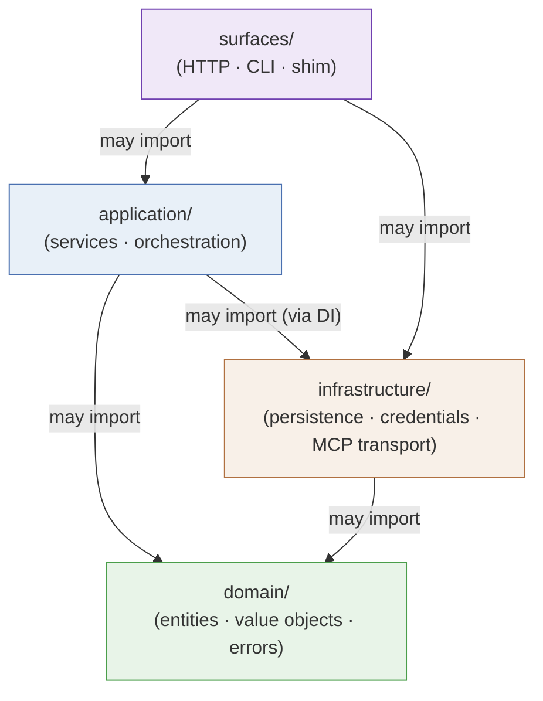

# Layering & Code Boundaries

::: tip Mental model
The four layers of Coffer's codebase are not just an organisational preference — they encode a strict, machine-checked contract about who may call whom. `domain` knows nothing about databases, HTTP, or MCP transport. `infrastructure` is never imported by business logic. The composition root wires everything together once, explicitly, with no global state. Follow the import arrows, and the architecture tells you the full picture.
:::

## The problem this solves

Without enforced layering, a codebase tends to develop circular imports, accidental coupling between unrelated concerns, and untestable business logic that pulls in database sessions or HTTP clients. Coffer's layering exists to prevent exactly these failure modes: the domain layer can be tested with no database, no MCP server, and no OS keychain in sight. Application services can be tested by injecting test doubles for infrastructure. Every layer has a well-defined job that does not bleed into its neighbours.

## The four layers

The constitutional layering diagram is:

```
surfaces  →  application  →  domain
                   ↓
            infrastructure
```

Arrows show the allowed import direction. `surfaces` may import `application`; `application` may import `domain`; both may import `infrastructure`. The reverse is never allowed: `domain` never imports anything from above it, and `infrastructure` is wired in at the composition root, not imported by application or domain code directly.

### domain/

The domain layer contains the kind-agnostic entities and protocols that define what Coffer manages at the conceptual level. This includes `resource.py` (the Resource entity, `ResourceRef`, and the frozen `Kind` record every kind's factory returns), `audit.py` (the `AuditEventType` enum and the `AuditEntry` record), `errors.py` (the canonical error hierarchy), and one subdirectory per kind for that kind's value objects — `mcp/` (tool schemas, capability descriptors, session state models), `agent/`, `skill/`, `knowledge/`, `memory/`, `provider/`, `channel/` — plus the cross-cutting `chat/` and `sync/`.

::: warning Absolute invariant
`domain/` may NOT import from `infrastructure/`, `surfaces/`, or any external SDK. No SQLAlchemy, no FastAPI, no `keyring`, no `httpx` — none of these appear anywhere in the domain layer. If a domain entity needs to validate a URL, it uses Python's standard library. If it needs to represent a credential, it holds a string reference, not a keychain handle.
:::

This restriction is not just architectural taste — it is what makes the domain layer universally testable. A `pytest` test that exercises domain logic imports only pure Python; it never touches a database, spawns a subprocess, or reaches the network.

### application/

The application layer orchestrates domain entities with infrastructure and surfaces. It defines the services that implement Coffer's use cases: `resource_service.py` for kind-agnostic CRUD (create/read/update/enable/disable/delete for resources of any kind), `audit_service.py` for recording lifecycle events, `retention_service.py` for the background log-pruning worker, and one subdirectory per kind — `application/mcp/` (session management, capability curation, invocation recording), `application/agent/`, `application/skill/`, `application/knowledge/`, `application/memory/`, `application/provider/`, and `application/channel/`. Alongside the kinds sit cross-cutting service slices that are **not** kinds: `application/chat/` (the turn platform the channels run agents on — the `TurnOrchestrator` and its turn state), `application/sync/` (convergence of the vault with a user-owned git remote), `application/credentials/` (the shared `CredentialResolver`), and `application/fs/` (filesystem-browse).

Application services receive their infrastructure dependencies as constructor arguments (repositories, keychain adapters, upstream clients) — they do not instantiate them. This is the dependency-inversion pattern: the application layer defines what it needs (via interfaces or protocol classes in `domain/`), and the composition root provides the concrete implementation.

::: warning Absolute invariant
`application/` may NOT import from `surfaces/`. An application service must never know whether it is being called from an HTTP request, a CLI command, or a test fixture. This is what allows the same `resource_service.register()` call to be invoked identically from the FastAPI route handler, the Typer CLI command, and the integration test suite.
:::

### infrastructure/

The infrastructure layer contains all external-I/O-performing code: the SQLAlchemy ORM models and Alembic migrations (`infrastructure/persistence/`), the encrypted credential store and master-key manager (`infrastructure/credentials/` — the single place in the entire codebase allowed to import `keyring`), daemon discovery and the pre-database config file (`infrastructure/daemon/`), the MCP upstream transport implementations (`infrastructure/mcp/` — subprocess management for stdio upstreams, and an HTTP client for HTTP-transport upstreams), and per-kind I/O modules: `infrastructure/agent/` (agent config-file store), `infrastructure/skill/` (master store, drift engine), `infrastructure/channel/` (Telegram/SeaTalk transports, peer repo, render), `infrastructure/knowledge/` (the on-disk path layout, frontmatter parsing, file I/O, the document converters, and the `ripgrep` wrapper), `infrastructure/memory/` (the partition path layout and the per-agent native-memory readers), `infrastructure/provider/` (the connection introspector), and `infrastructure/chat/` (the Claude Code and Codex agent drivers, the gateway tool provider, and turn persistence). Two cross-cutting slices are not kinds: `infrastructure/sync/` (the git mirror the vault converges through, and this machine's identity) and `infrastructure/llm/` (the internal engine's model clients, remote transcription, and the agentic reorganise loop the tidy and organise passes run on).

Two kind-agnostic packages sit beside the kinds. `infrastructure/agent_files/` holds readers of an agent's own on-disk transcripts, shared by the agent and memory kinds. `infrastructure/net/` holds the SSRF guard — and it is worth being exact about its reach, because the honest statement is narrower than the module's name suggests: `check_url` has exactly **one** caller, `infrastructure/provider/introspector.py`. It is not a chokepoint every outbound URL passes through, and nothing enforces that it becomes one. See [Outbound HTTP](/architecture/security#outbound-http-one-guarded-path-and-the-rest) for what is and is not covered.

Infrastructure is wired into the system at the composition root, not imported by domain or application code. Application services receive infrastructure objects as injected dependencies. This means you can swap the real SQLAlchemy repository for a test double (an in-memory dictionary or a SQLite `:memory:` database) without changing a line of application or domain code.

The credential module deserves special mention: `infrastructure/credentials/` is the only location in the entire codebase that may import `keyring` (now confined to the master key and the legacy migration). All other code accesses credentials via opaque string references. This single-point-of-access rule is what makes it mechanically verifiable that secret material never reaches any other layer.

### surfaces/

The surfaces layer adapts external protocols to application calls. It contains the FastAPI application (`surfaces/http/`), the Typer CLI (`surfaces/cli/`), the stdio shim entry point (`surfaces/shim/`), and the channel callback listener (`surfaces/callback/` — the `coffer-callback` process that receives SeaTalk webhooks). Surfaces are thin: they parse requests, call application services, and format responses. They contain no business logic.

The two composition roots — `surfaces/http/app.py` for the daemon's HTTP server, and `surfaces/cli/main.py` for the CLI — are the only places where all four layers meet. Each kind exposes one factory — `make_<kind>_kind()` in `application/<kind>/kind.py` — that returns a frozen `Kind` (`domain/resource.py`): the kind's identity, config schema and lifecycle hooks, and nothing else. The composition root does the wiring itself, explicitly: `surfaces/http/app.py` hands off to `kind_wiring.py` and the per-kind `*_wiring.py` modules, each of which builds that kind's infrastructure and services, registers its routers, and returns a typed dataclass (`AgentSkillWiring`, `ProviderWiring`, `KnowledgeWiring`, `MemoryWiring`, `McpWiring`, `KindWirings`, `ChatWiring`, `BackgroundWorkers`) that `app.py` passes forward to the next step; the factories' `Kind` records populate `app.state.kinds`. `surfaces/cli/main.py` mounts the Typer groups the same way. Route handlers reach their services through per-kind FastAPI dependency modules (`surfaces/http/{agent,workspace,skill,provider}_dependencies.py`, `surfaces/http/{chat,knowledge,memory,mcp}/dependencies.py`); `surfaces/http/dependencies.py` keeps only the kind-agnostic getters. There is no global kind registry and no import-time side effects. Adding a new kind means creating its subdirectories in each layer, writing its factory, and adding one wiring module the composition root calls.

## Import rules as invariants

The two critical invariants, stated precisely:

::: warning Import rule 1 — domain isolation
`domain/` may NOT import `infrastructure/`, `surfaces/`, or any external SDK. Violation means domain logic has acquired an I/O dependency that cannot be unit-tested without real infrastructure.
:::

::: warning Import rule 2 — application isolation from surfaces
`application/` may NOT import `surfaces/`. Violation means business logic has acquired a surface dependency, making it impossible to call the same logic from a different surface (e.g., a test) without going through an HTTP or CLI stack.
:::

A third rule governs cross-kind dependencies within a layer: a kind-specific module (`domain/mcp/`, `application/mcp/`, etc.) may not import a different kind's module (`domain/other_kind/`). Cross-kind coupling at the layer level would mean one kind's correctness depends on another's implementation, breaking the clean-extension guarantee.

The "extract cross-cutting modules only when a second feature needs them" rule (from the constitution) is a corollary: shared utilities that live at the layer root (like `domain/errors.py`) are only promoted there when more than one kind genuinely needs them. Premature extraction bloats the shared surface and makes the next kind's author cargo-cult patterns that may not apply.

## Enforcement

These rules are not advisory. They are enforced by two complementary mechanisms in CI:

**importlinter contracts** — declared in `backend/pyproject.toml`, these contracts define the forbidden import pairs and are run as part of `make verify`. A contract violation fails the build with a precise error naming the forbidden import chain. Two families of rules are enforced: layered direction (the four-layer hierarchy) and cross-kind isolation (no `domain/mcp` importing `domain/other_kind`). The "only `infrastructure/credentials/` may import `keyring`" rule is enforced as an importlinter contract.

The "application does not import infrastructure" contract carries a small, named set of exemptions, each written out in the contract's own comment with the reasoning that earned it. They share one shape: the infrastructure in question is a **substrate**, not an engine — path layout, frontmatter parsing, file I/O, the `ripgrep` wrapper, one single-key table's upsert — with nothing behind it that a port/adapter pair would abstract away. `application/knowledge/` composing `infrastructure/knowledge/` is the canonical case: once knowledge became a directory of files, what was left to import was thin enough that routing it through a port would be pure ceremony. Every import not on that list is still a build failure.

**`scripts/check_*.py`** — supplementary Python scripts that enforce architectural rules that importlinter cannot express as simple import graphs, such as the "no cross-cutting extraction before the second feature" rule.

Both are run on every PR. The combination means that any import that violates the four-layer contract or the single-credential-access rule is caught before merge, not discovered in a code review.

## Code layout (ADR code-layout-layer-first)

The layer-first layout is specified by [Layer-First Code Layout](/reference/adr/code-layout-layer-first). The full directory tree:

```
backend/coffer/
├── domain/                       # kind-agnostic entities + kind protocol
│   ├── resource.py               # Resource, Kind (frozen record each factory returns), ResourceRef
│   ├── audit.py
│   ├── errors.py
│   ├── mcp/                      # MCP-specific value objects
│   ├── agent/                    # agent config value objects
│   ├── skill/                    # skill value objects
│   ├── channel/                  # channel config, envelopes, signing
│   ├── knowledge/                # collection config + entry/document value objects
│   ├── memory/                   # partition + fact value objects
│   ├── provider/                 # connection protocol + projection value objects
│   ├── chat/                     # chat turn / message value objects
│   └── sync/                     # sync value objects
├── application/
│   ├── resource_service.py       # kind-agnostic CRUD; takes kinds dict
│   ├── audit_service.py
│   ├── retention_service.py
│   ├── mcp/                      # MCP-specific application services
│   ├── agent/                    # agent services + make_agent_kind
│   ├── skill/                    # skill services + make_skill_kind
│   ├── channel/                  # adapter protocol, pairing, inbound runtime
│   ├── knowledge/                # collection, file, ingest + search services
│   ├── memory/                   # aggregation, organise, recall, context + make_memory_kind
│   ├── chat/                     # TurnOrchestrator, turn state
│   ├── provider/                 # provider ports, introspection + make_provider_kind
│   ├── sync/                     # cross-cutting — vault convergence with a git remote (not a kind)
│   ├── credentials/              # cross-cutting — CredentialResolver (refs → secrets)
│   └── fs/                       # cross-cutting — filesystem-browse service
├── infrastructure/
│   ├── persistence/              # SQLAlchemy + Alembic (central metadata)
│   ├── daemon/                   # pid_lock, port binding, daemon-config.json
│   ├── mcp/                      # subprocess transport, HTTP upstream client
│   ├── agent/                    # agent config-file store
│   ├── skill/                    # master store, drift engine
│   ├── channel/                  # telegram/seatalk transports, peer repo, render
│   ├── knowledge/                # path layout, frontmatter, file store, converters, ripgrep
│   ├── memory/                   # partition path layout + per-agent native-memory readers
│   ├── chat/                     # the Claude Code and Codex drivers, gateway tool provider
│   ├── provider/                 # provider introspector (the one `check_url` caller)
│   ├── net/                      # kind-agnostic — the SSRF guard (one call site; see Security)
│   ├── agent_files/              # kind-agnostic — readers of an agent's own transcripts (agent + memory)
│   ├── logging/                  # kind-agnostic — structlog setup, eval capture
│   ├── llm/                      # cross-cutting — internal-engine models, transcription, reorganise loop
│   ├── sync/                     # cross-cutting — git mirror the vault converges through (not a kind)
│   └── credentials/              # cross-cutting — encrypted credential store + master key — only place importing `keyring`
└── surfaces/
    ├── http/
    │   ├── app.py                # composition root — wires every kind's factory and wiring module
    │   ├── routing.py            # the one place every sub-router is imported and mounted
    │   ├── kind_wiring.py        # + per-kind *_wiring.py — each returns a typed dataclass app.py passes on
    │   ├── dependencies.py       # kind-agnostic getters; per-kind *_dependencies.py sit beside the routes
    │   ├── resource_routes.py
    │   ├── mcp/                  # MCP HTTP/SSE routes and session handling
    │   ├── knowledge/            # collections, tree, file, grep, search, upload, tidy
    │   ├── memory/               # partitions, facts, files, sync, organise, context, delivery
    │   └── chat/                 # conversations, turns, agent providers
    ├── cli/
    │   ├── main.py               # composition root — Typer wiring
    │   ├── resource_cmd.py
    │   ├── daemon_cmd.py         # + daemon_port_cmd.py — the one group that needs no daemon
    │   └── mcp.py
    ├── callback/                 # coffer-callback channel listener (separate process)
    └── shim/                     # coffer-mcp-shim stdio entry point
```

The `desktop/` crate sits outside `backend/coffer/` entirely — it is Rust, it imports nothing from any of these layers, and it reaches the daemon over the same loopback HTTP every other surface uses. See [Surfaces](/architecture/surfaces#desktop-shell-cofferapp).

Within each layer, the root files are kind-agnostic. Kind-specific code lives under named subdirectories — `mcp/`, `agent/`, `skill/`, `knowledge/`, `memory/`, `provider/`, `channel/` — one per kind, mirrored across `domain/`, `application/`, `infrastructure/`, and (where the kind has its own route package) `surfaces/http/`. When a new kind arrives, its directories appear at each layer without altering the kind-agnostic root files.

A handful of slices are **cross-cutting, not kinds**: `application/sync/` + `infrastructure/sync/` (bidirectional convergence of the vault with a user-owned git remote), `application/credentials/` + `infrastructure/credentials/` (credential resolution and the encrypted store), `application/chat/` + `infrastructure/chat/` (the turn platform that drives the user's own coding agents), `infrastructure/llm/` (the internal engine's model clients and the loop the unattended passes run on), and `application/fs/` (filesystem-browse). These follow the same layering rules as kinds but have no `Kind` factory and no entry in `app.state.kinds` — they are shared services used across kinds.

### Why layer-first, not feature-first (vertical slices)?

The [Layer-First Code Layout](/reference/adr/code-layout-layer-first) ADR considered and rejected the vertical-slice alternative — a `kinds/` top-level directory where each kind would contain its own `domain/`, `application/`, `infrastructure/`, and `surfaces/` subtree.

The rejection rests on three observations:

1. **A fifth top-level concept.** Vertical slices introduce `kinds/` alongside the constitutional four layers. Every architecture document would need to explain both organisational axes simultaneously, and every contributor would face the "does this belong in the shared layer root or in `kinds/<x>/<layer>/`?" dual-decision on every cross-kind extraction.

2. **Misapplied pattern.** Vertical slices fit large codebases where team isolation, independent deploy cadence, or microservice extraction is the goal. None of these apply to a single-user local-first application. The benefit (IDE discoverability) largely evaporates under search; the cost (layout duality) does not.

3. **Small kinds pay no ceremony.** A simple future kind might be a single `domain/profile.py` file. In a layer-first layout that is exactly what it looks like. In a vertical-slice layout it becomes `kinds/profile/domain/profile.py` — four levels of directories for one file.

The layer-first layout mirrors the constitutional layering diagram directly in the file system. Reading the architecture document and reading the directory tree produce the same mental picture.

### Composition root — no global registry

Two things keep the composition root explicit without ceremony. First, each kind's `make_<kind>_kind()` factory returns a frozen `Kind` — the record the kind-agnostic services (`resource_service.py`, audit, retention, the resource list) consume; it carries the kind's name, config schema and lifecycle hooks and nothing else. Second, each kind has one wiring module at the composition root (`kind_wiring.py` plus the per-kind `*_wiring.py` files under `surfaces/http/`) that:

- instantiates its infrastructure implementations (repository, transport, store)
- constructs its application services with those injected
- registers its HTTP sub-router (and, in `surfaces/cli/main.py`, its Typer subcommand group)
- returns a typed dataclass (`AgentSkillWiring`, `ProviderWiring`, `KnowledgeWiring`, `MemoryWiring`, `McpWiring`, `KindWirings`, `ChatWiring`, `BackgroundWorkers`) holding what later steps need

`app.py` calls these in dependency order, passes each result forward explicitly — never through an untyped hub — and fills `app.state.kinds` from the factories. No kind is "discovered" by scanning directories, no `__init__.py` side effect registers it, and deleting a kind's factory and wiring module cleanly removes the kind from the system.

## Mermaid: allowed import directions



Cross-kind imports within a layer are also forbidden: `domain/mcp/` may not import `domain/some_other_kind/`, and vice versa.

---

**See also:** [Code layout — layer-first](/reference/adr/code-layout-layer-first), [Architecture reference](/reference/project/architecture)
