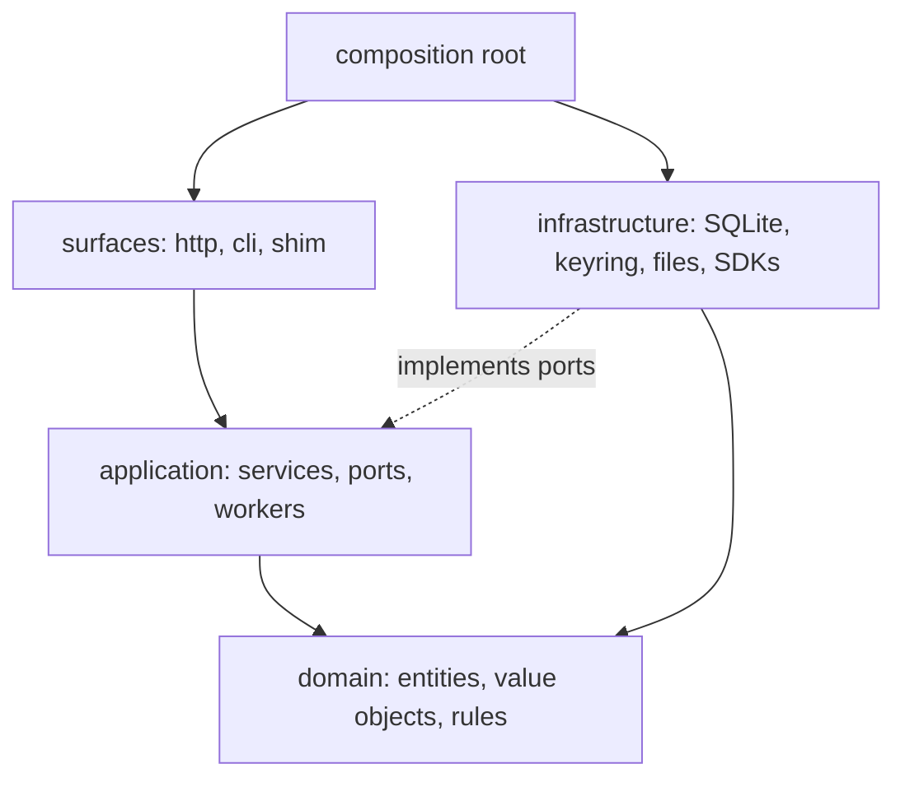
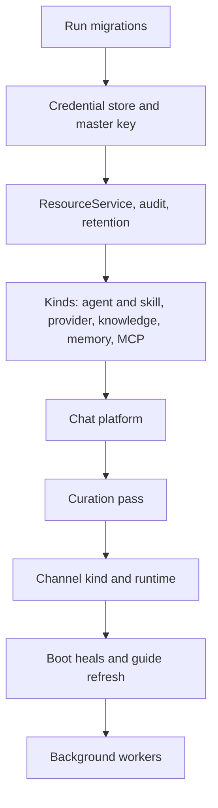

# Layering and code layout

Coffer's backend is a layered application: surfaces call application services, application services work with pure domain objects, and infrastructure adapts to ports the application defines. This page explains the layers, the import contracts that make them more than a convention, how the composition root wires each kind explicitly, where code goes in the tree, and the gates that fail the build when the structure slips. Read it before adding a module, a kind, or a dependency.

## The problem it solves

Coffer has seven resource kinds, a turn platform, a sync engine and four surfaces (REST, MCP, CLI, shim), and much of it is written together with AI coding agents. Without enforced boundaries, a codebase like that erodes in predictable ways: a route reaches into SQLAlchemy directly, one kind imports another kind's service because it was convenient, an SDK leaks from the one adapter that needed it into the domain. Each shortcut is small; together they make every change touch everything.

Coffer answers with two rule families, both checked on every build:

1. **Layering:** dependencies point inward, from surfaces to application to domain, with infrastructure plugged in from the outside.
2. **Kind isolation:** no kind imports another kind. Only the composition root sees two kinds at once.

## The layers



| Layer | Holds | May import |
| --- | --- | --- |
| `domain/` | Entities, value objects and pure rules: `Resource`, `Kind`, `Scope`, audit event names, error codes, each kind's config schemas and domain logic. | The standard library and Pydantic. Nothing else from the project, and none of FastAPI, SQLAlchemy, `sqlite3`, httpx, `keyring` or anyio. |
| `application/` | Use-case services, the ports (Python `Protocol`s) they need, background workers, the kind factories. | `domain/`. Not `surfaces/`, and not `infrastructure/` — with two named exceptions for the knowledge and memory file substrates. |
| `infrastructure/` | Adapters: persistence, the credential store, subprocess and HTTP clients, git, file-tree I/O, LLM and agent SDK wrappers. | `domain/`, `application/` ports. Not `surfaces/`. |
| `surfaces/` | Entry points: the FastAPI app and routes, the Typer CLI, the stdio shim, plus the composition root that wires everything. | Everything below. |

The architectural style is fixed by [`docs/principles.md`](https://github.com/wyx-sg/Coffer/blob/main/docs/principles.md); the choice of a layer-first layout over vertical slices is explained in [Layer-First Code Layout](https://github.com/wyx-sg/Coffer/blob/main/docs/decisions/code-layout-layer-first.md).

### Why layer-first with kind subdirectories

Each layer holds kind-agnostic modules at its root and one subdirectory per kind: `domain/skill/`, `application/skill/`, `infrastructure/skill/`, and `surfaces/http/skill_routes.py`. A kind's code therefore spans four directories. The alternative — a `kinds/<kind>/{domain,application,infrastructure,surfaces}` vertical slice — was rejected because it adds a fifth top-level concept beside the four layers, and turns every extraction of shared code into two questions ("which layer?" and "inside the kind or outside?") instead of one. Vertical slices pay off for team isolation and independent deploys, neither of which a single-user local app has. Editor search makes a kind's four directories easy to walk.

## The import contracts

The rules are [import-linter](https://github.com/seddonym/import-linter) contracts in [`backend/pyproject.toml`](https://github.com/wyx-sg/Coffer/blob/main/backend/pyproject.toml), run by `make lint`. Imports inside `if TYPE_CHECKING:` blocks do not count, so a port may be *typed* with another kind's class without executing any of its code. In plain words:

| Contract | What it says |
| --- | --- |
| Layered architecture: surfaces > application > domain | Imports flow inward only. A domain module never imports an application module; an application module never imports a surface. |
| Infrastructure does not import surfaces | Adapters never reach back up into routes or CLI commands. This is why, for example, the daemon entry point reads `daemon.json` itself rather than asking a route module. |
| Application does not import infrastructure | Application code depends on ports it defines. Exceptions: `application.knowledge` may import `infrastructure.knowledge`, and `application.memory` may import `infrastructure.memory`, because both substrates are thin file-I/O helpers with no engine behind them, where a port would be ceremony. |
| Domain is pure | Domain imports no other project layer and none of `fastapi`, `sqlalchemy`, `sqlite3`, `httpx`, `keyring` or `anyio`. |
| keyring confined to infrastructure | Surfaces and application never import `keyring` directly. |
| CLI does not access the keychain directly | `surfaces.cli` may not import `infrastructure.credentials` at all. The CLI reaches secrets only through the daemon's HTTP API, so the daemon is the only reader of the master key on each machine. |
| Cross-kind imports forbidden (one per kind) | Nine symmetric contracts — `mcp`, `agent`, `skill`, `knowledge`, `channel`, `chat`, `provider`, `memory`, `sync` — each forbidding that area's modules from importing any other area's modules. Named exceptions cover pure domain vocabulary only: `provider` and `memory` may read `domain.agent`, and `channel` may read `domain.chat`. `domain.knowledge` and `infrastructure.knowledge` are shared substrate. |
| Kind-agnostic core does not import kind-specific code | `resource_service`, `resource_scope_ops` and `resource_delete_ops`, `AuditService`, the retention service and worker, the builtin tool registry, Coffer's own engine modules, `domain.resource`, `domain.scope`, `domain.audit`, the shared infrastructure packages, the generic dependency providers and the generic routes may import no kind. The one sanctioned exception is Alembic's `migrations/env.py`, which imports every kind's ORM models into one metadata. |
| Engine confinement: markitdown | Only the channel attachment extractor and the knowledge upload converter may import `markitdown` (or `docling`). |
| Dropped engines banned everywhere | `llama_index`, `mem0`, `chromadb`, `sentence_transformers`, `sqlite_vec` and `fastembed` may not be imported anywhere. Coffer embeds nothing, and a reintroduction has to be a deliberate change to this contract. |
| LangGraph and LangChain confined to infrastructure/llm | Coffer's own model calls go through `infrastructure/llm/`. Domain, application, and the chat, MCP, channel, knowledge, persistence, credentials, daemon and logging infrastructure packages may not import `langgraph` or any `langchain*` package; they reach a model through injected ports. |
| Claude Agent SDK confined | Domain, application and the other infrastructure packages may not import `claude_agent_sdk`. Its homes are `infrastructure/chat` (the agent adapters) and `infrastructure/agent` (reading the installed agent's catalogue). |

When two kinds genuinely need the same code, it moves to a kind-agnostic package at the layer root: [`infrastructure/net/`](https://github.com/wyx-sg/Coffer/tree/main/backend/coffer/infrastructure/net) (the SSRF guard), [`infrastructure/agent_files/`](https://github.com/wyx-sg/Coffer/tree/main/backend/coffer/infrastructure/agent_files) (agent transcript readers shared by `agent` and `memory`), [`domain/connection.py`](https://github.com/wyx-sg/Coffer/blob/main/backend/coffer/domain/connection.py). Everything else crosses between kinds through a port the consuming kind declares and the composition root satisfies — for example `application.chat.ports.ModelCatalogPort`, which the chat platform uses to read the agent kind's model catalogue without importing it.

## The composition root

The composition root is the only code allowed to see every kind. It is [`surfaces/http/app.py`](https://github.com/wyx-sg/Coffer/blob/main/backend/coffer/surfaces/http/app.py) for the daemon and [`surfaces/cli/main.py`](https://github.com/wyx-sg/Coffer/blob/main/backend/coffer/surfaces/cli/main.py) for the CLI.

### Explicit per-kind wiring

There is no plugin discovery, no global registry and no import-time side effect. Each kind has a factory, `make_<kind>_kind()` in `application/<kind>/kind.py`, that returns a frozen [`Kind`](/architecture/resource-framework#kind). A per-kind wiring module in `surfaces/http/` builds the kind's services, calls the factory, and stores the result in the per-app dict `app.state.kinds`:

| Wiring module | Sets |
| --- | --- |
| `agent_skill_wiring.py` | `"agent"`, `"skill"` |
| `provider_wiring.py` | `"provider"` |
| `knowledge_wiring.py` | `"knowledge"` |
| `memory_wiring.py` | `"memory"` |
| `app_mcp_composition.py` | `"mcp_server"` |
| `channel_wiring.py` | `"channel"` |

`ResourceService` is constructed with a reference to that same dict and reads it for every dispatch.

### Wiring order is the dependency order

The daemon's lifespan runs a fixed sequence, and each step *returns* a small frozen dataclass of what it built, which the next step takes as a parameter. No step discovers an earlier one through `app.state`, so the argument lists are the dependency graph.



[`kind_wiring.py`](https://github.com/wyx-sg/Coffer/blob/main/backend/coffer/surfaces/http/kind_wiring.py) orders the kinds themselves: provider after agent, because it projects into each agent's config; memory before MCP, so the gateway can advertise `coffer__recall`; MCP last, so it picks up every builtin tool the others registered. The chat platform is wired after all kinds because its internal gateway session needs the complete builtin tool registry; the channel kind comes after chat because it drives turns through chat's handles. What each kind contributes to sync — import gates, post-import hooks, synced state areas — is collected in one `SyncContributions` object and handed to the sync worker at the end.

HTTP routers are included from one table in [`surfaces/http/routing.py`](https://github.com/wyx-sg/Coffer/blob/main/backend/coffer/surfaces/http/routing.py), which also puts every router under an experimental feature's prefix behind that feature's request-time gate. Typer groups are added in `surfaces/cli/main.py`.

### Dependency providers

FastAPI dependencies are plain module-level `set_*` / `get_*` pairs over module-global singletons. The composition root calls each setter once at startup; routes name the getter as a `Depends()` target; a getter called before its setter raises rather than hand a route `None`. [`surfaces/http/dependencies.py`](https://github.com/wyx-sg/Coffer/blob/main/backend/coffer/surfaces/http/dependencies.py) holds only the kind-agnostic core (actor, resource service, audit, retention, internal-engine config). Each kind publishes its own concretely typed pairs from its own module — `surfaces/http/mcp/dependencies.py`, `agent_dependencies.py`, `skill_dependencies.py`, `provider_dependencies.py`, and so on — so nothing in the core is typed `Any` and nothing there can pull in a kind. Tests override the same setters.

## The code tree

```text
backend/coffer/
├── build_channel.py        # CHANNEL = "dev"; the release workflow stamps "stable"
├── main.py                 # ASGI entry: create_app()
├── domain/                 # pure; imports nothing from other layers
│   ├── resource.py         # Resource, Kind, name validation
│   ├── scope.py            # Scope and is_active, the one reach predicate
│   ├── audit.py            # audit event vocabulary
│   ├── errors.py           # error hierarchy and codes
│   ├── features.py         # experimental-feature registry
│   └── mcp/ agent/ skill/ knowledge/ channel/ chat/ memory/ provider/ sync/
├── application/
│   ├── resource_service.py # kind-agnostic CRUD, plus resource_*_ops.py
│   ├── audit_service.py
│   ├── retention_*.py      # registry, service, worker
│   ├── builtin_tools.py    # BuiltinTool and its registry
│   ├── features.py         # FeatureService: pin, machine setting, channel default
│   ├── upkeep_runs.py      # passes in flight, in process
│   ├── credentials/        # ref-to-secret resolver
│   ├── engine/             # which model Coffer's own passes run on
│   ├── fs/                 # browse, pick, open, editor
│   └── mcp/ agent/ skill/ knowledge/ channel/ chat/ memory/ provider/ sync/
│                           # each kind: services, ports, make_<kind>_kind()
├── infrastructure/
│   ├── persistence/        # SQLAlchemy engine, ORM models, repos, Alembic
│   ├── credentials/        # encrypted store, master key; the only keyring user
│   ├── daemon/             # bootstrap, port, spawn, pid lock, daemon-config.json
│   ├── net/                # SSRF guard
│   ├── logging/            # structlog setup, log files
│   ├── llm/                # LangChain models, completion, transcription
│   ├── agent_files/        # agent transcript readers shared by two kinds
│   └── mcp/ agent/ skill/ knowledge/ channel/ chat/ memory/ provider/ sync/
└── surfaces/
    ├── http/               # FastAPI app, composition root, routes, *_wiring.py
    │   └── chat/ knowledge/ mcp/ memory/
    ├── cli/                # Typer app and one module per command group
    └── shim/               # coffer-mcp-shim
```

`scripts/check_architecture_doc.py` keeps the tree in [`docs/architecture.md`](https://github.com/wyx-sg/Coffer/blob/main/docs/architecture.md) level with the real package list, so a package added or removed without updating the document fails the build.

### Where a new piece of code goes

| You are adding | Put it in |
| --- | --- |
| A value object or rule with no I/O | `domain/<kind>/` |
| A use case, or a port it needs | `application/<kind>/` |
| An adapter for a database table, file tree, subprocess or SDK | `infrastructure/<kind>/`, implementing the port |
| A route or CLI command | `surfaces/http/<kind>_routes.py` or `surfaces/cli/<kind>_cmd.py` |
| Wiring the above together | the kind's `surfaces/http/<kind>_wiring.py` |
| Something a second kind now needs too | a kind-agnostic module at the layer root |
| A schema change | a new Alembic migration under `infrastructure/persistence/migrations/versions/` |

## The frontend

The web UI in [`frontend/src/`](https://github.com/wyx-sg/Coffer/tree/main/frontend/src) is React 18 with TypeScript, Vite, React Router 6 and TanStack Query 5, styled with Tailwind over shadcn/ui and Radix primitives. It owns no API of its own: every screen renders over a capability's REST contract. The full conventions are in [`.agents/frontend.md`](https://github.com/wyx-sg/Coffer/blob/main/.agents/frontend.md) and [Frontend](/contributing/frontend).

| Path | Contents |
| --- | --- |
| `pages/` | One page per route, list and detail (`AgentsPage.tsx`, `AgentDetailPage.tsx`, …). Detail pages are code-split with `lazyPage()`. |
| `components/<feature>/` | Feature components, dialogs and tables. Shared primitives such as `DataTable`, `PageHeader` and `ScopeControl` sit at the root; shadcn components under `components/ui/`. |
| `lib/hooks/` | Every query and mutation for a feature in one `useX.ts` file. Components never call `useQuery` directly. |
| `lib/api/` | Request functions per feature, and `queryKeys.ts` for every query key. |
| `lib/api/generated/` | TypeScript types generated by `npm run codegen` from each spec's `contracts/api.openapi.yaml`. `npm run lint` fails if they drift from the contracts. |
| `router.tsx` | Every route, addressed by uid (`/agents/:uid`, `/mcp-servers/:uid`). |
| `i18n/locales/` | `en.json` and `zh.json`, one flat catalogue per language. |

There is no per-kind UI registry. A kind that needs a UI adds pages, a component folder, a hooks file, an API module and a route, the same as any other feature.

The same built `frontend/dist` runs in three hosts, and each is a credential *supplier*, not a code path: the daemon injects `window.__COFFER_TOKEN__` into the `index.html` it serves, the desktop shell supplies the same values over IPC, and the Vite dev server reads them from `~/.coffer/daemon.json`. See [Security model](/architecture/security#the-api-token).

## Gates that keep it honest

A structure that is only a convention erodes one convenient shortcut at a time, so every rule on this page is checked by a gate that `make verify` runs, locally and in CI. These are the gates that hold the *structure*:

| Gate | What it enforces |
| --- | --- |
| `lint-imports` | Every import contract above. |
| [`scripts/check_file_sizes.py`](https://github.com/wyx-sg/Coffer/blob/main/scripts/check_file_sizes.py) | File-size ceilings: backend Python and desktop Rust at most 400 lines; frontend pages 200, components 250, hooks and utilities 300. Generated files are exempt. |
| [`scripts/check_response_models.py`](https://github.com/wyx-sg/Coffer/blob/main/scripts/check_response_models.py) | Every FastAPI route declares `response_model=` (or `response_class=` for streaming and no-body responses), so no route returns an undeclared `dict`. |
| [`scripts/check_architecture_doc.py`](https://github.com/wyx-sg/Coffer/blob/main/scripts/check_architecture_doc.py) | The code-layout tree and the builtin-tool list in `docs/architecture.md` match the code. |
| `make verify-contract` | The runtime OpenAPI document matches each spec's hand-written contract. |
| `mypy --strict` | Full static typing of `backend/coffer`, so a port and its adapter cannot silently disagree. |

The complete list of gates `make verify` runs, including the spec, documentation and frontend gates, is in [Testing](/contributing/testing#what-make-verify-runs).

The 400-line ceiling shapes the backend visibly: `ResourceService` delegates to `resource_scope_ops.py`, `resource_rename_ops.py`, `resource_delete_ops.py` and `resource_kind_ops.py`, and the composition root is split across `app.py`, `kind_wiring.py`, `routing.py`, `middleware.py` and the per-kind wiring modules.

## Trade-offs

- **A kind spans four directories.** Accepted for one mental model of dependency direction; editor search closes the navigation gap.
- **Two rule families to maintain.** The cross-kind contracts are nine near-identical blocks kept symmetric by hand: every kind appears as a source in its own contract and as forbidden in every other.
- **Explicit wiring is verbose.** Every kind's services are constructed by hand in its wiring module. In exchange there is no discovery order to reason about and no import side effect that registers something by accident.

## Where it lives in the code

| Path | Contents |
| --- | --- |
| [`backend/pyproject.toml`](https://github.com/wyx-sg/Coffer/blob/main/backend/pyproject.toml) | The import-linter contracts, under `[tool.importlinter]`. |
| [`backend/coffer/surfaces/http/app.py`](https://github.com/wyx-sg/Coffer/blob/main/backend/coffer/surfaces/http/app.py) | The daemon's composition root and lifespan. |
| [`backend/coffer/surfaces/http/kind_wiring.py`](https://github.com/wyx-sg/Coffer/blob/main/backend/coffer/surfaces/http/kind_wiring.py) | Kind wiring order. |
| [`backend/coffer/surfaces/http/routing.py`](https://github.com/wyx-sg/Coffer/blob/main/backend/coffer/surfaces/http/routing.py) | The router table. |
| [`backend/coffer/surfaces/cli/main.py`](https://github.com/wyx-sg/Coffer/blob/main/backend/coffer/surfaces/cli/main.py) | The CLI's composition root. |
| [`Makefile`](https://github.com/wyx-sg/Coffer/blob/main/Makefile) | `make lint`, `make verify` and the other gates. |
| [`.agents/stack.md`](https://github.com/wyx-sg/Coffer/blob/main/.agents/stack.md) | Stack and code-style rules. |

## Related

- [Layer-First Code Layout](https://github.com/wyx-sg/Coffer/blob/main/docs/decisions/code-layout-layer-first.md)
- [Resource Framework Designed Upfront](https://github.com/wyx-sg/Coffer/blob/main/docs/decisions/resource-framework-upfront.md)
- [Resource framework](/architecture/resource-framework)
- [Design principles](/architecture/design-principles#extract-on-second-use)
- [Testing](/contributing/testing)
