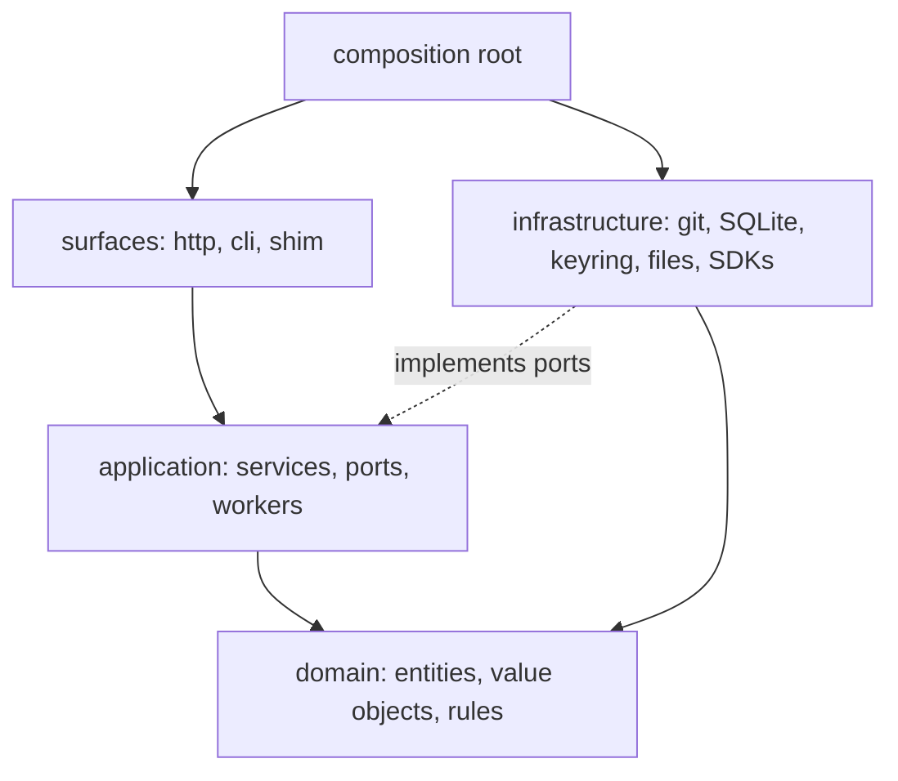
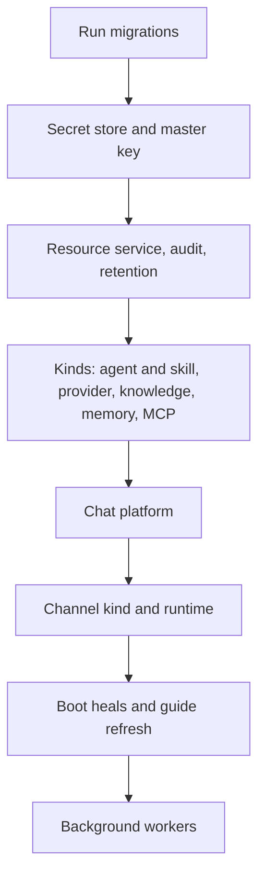

# Layering and code layout

Coffer's backend is a layered application: surfaces call application services, application services work with pure domain objects, and infrastructure adapts to ports the application defines. This page explains the layers, the import contracts that make them more than a convention, how the composition root wires each kind explicitly, where code goes in the tree, and the gates that fail the build when the structure slips. Read it before adding a module, a kind, or a dependency.

## The problem it solves

Coffer has seven resource kinds, a turn platform, a sync engine and four surfaces (REST, MCP, CLI, shim), and much of it is written together with AI coding agents. Without enforced boundaries, a codebase like that erodes in predictable ways: a route reaches into SQLAlchemy directly, one kind imports another kind's service because it was convenient, an SDK leaks from the one adapter that needed it into the domain. Each shortcut is small; together they make every change touch everything.

Coffer answers with two rule families, both checked on every build:

1. **Layering:** dependencies point inward, from surfaces to application to domain, with infrastructure plugged in from the outside.
2. **Kind isolation:** no kind imports another kind. Only the composition root sees two kinds at once.

## The layers


```mermaid
flowchart TB
  S["surfaces: http, cli, shim"]
  A["application: services, ports, workers"]
  D["domain: entities, value objects, rules"]
  I["infrastructure: git, SQLite, keyring, files, SDKs"]
  CR["composition root"]
  S --> A
  A --> D
  I -.->|implements ports| A
  I --> D
  CR --> S
  CR --> I
```

| Layer | Holds | May import |
| --- | --- | --- |
| `domain/` | Entities, value objects and pure rules: resources, kinds, scope, audit event names, error codes, each kind's config schemas and domain logic. | The standard library and Pydantic. Nothing else from the project, and none of FastAPI, SQLAlchemy, `sqlite3`, httpx, `keyring` or anyio. |
| `application/` | Use-case services, the ports (typed Python protocols) they need, background workers, the kind factories. | `domain/`. Not `surfaces/`, and not `infrastructure/` — with three named exceptions: the knowledge and memory file substrates, and the binary deployer's one read of the vault's home. |
| `infrastructure/` | Adapters: persistence, the secret store, subprocess and HTTP clients, git, file-tree I/O, LLM and agent SDK wrappers. | `domain/`, `application/` ports. Not `surfaces/`. |
| `surfaces/` | Entry points: the FastAPI app and routes, the Typer CLI, the stdio shim, plus the composition root that wires everything. | Everything below. |

The architectural style is fixed by [Principles](/architecture/principles); the choice of a layer-first layout over vertical slices is explained in [Layer-First Code Layout](https://github.com/wyx-sg/Coffer/blob/main/docs/decisions/code-layout-layer-first.md).

### Why layer-first with kind subdirectories

Each layer holds kind-agnostic modules at its root and one subdirectory per kind: `domain/skill/`, `application/skill/`, `infrastructure/skill/`, and the skill routes in `surfaces/http/`. A kind's code therefore spans four directories. The alternative — a `kinds/<kind>/{domain,application,infrastructure,surfaces}` vertical slice — was rejected because it adds a fifth top-level concept beside the four layers, and turns every extraction of shared code into two questions ("which layer?" and "inside the kind or outside?") instead of one. Vertical slices pay off for team isolation and independent deploys, neither of which a single-user local app has. Editor search makes a kind's four directories easy to walk.

## The import contracts

The rules are [import-linter](https://github.com/seddonym/import-linter) contracts in the backend's `pyproject.toml`, run by `make lint`. Imports that exist only for the type checker (inside `if TYPE_CHECKING:` blocks) do not count, so a port may be *typed* with another kind's types without executing any of its code. In plain words:

| Contract | What it says |
| --- | --- |
| Layered architecture: surfaces > application > domain | Imports flow inward only. A domain module never imports an application module; an application module never imports a surface. |
| Infrastructure does not import surfaces | Adapters never reach back up into routes or CLI commands. This is why, for example, the daemon entry point reads `daemon.json` itself rather than asking a route module. |
| Application does not import infrastructure | Application code depends on ports it defines. Exceptions: `application.knowledge` may import `infrastructure.knowledge`, and `application.memory` may import `infrastructure.memory`, because both substrates are thin file-I/O helpers with no engine behind them, where a port would be ceremony; and `application.binary_deploy` may read `infrastructure.vault.home`, the one module that names every path under `~/.coffer`. |
| Domain is pure | Domain imports no other project layer and none of `fastapi`, `sqlalchemy`, `sqlite3`, `httpx`, `keyring` or `anyio`. |
| keyring confined to infrastructure | Surfaces and application never import `keyring` directly. |
| CLI does not import the HTTP surface | `surfaces.cli` may not import `surfaces.http`. The CLI is a client of the daemon's HTTP API, not a sibling of its routes. |
| CLI does not access the keychain directly | `surfaces.cli` may not import `infrastructure.secret` at all. The CLI reaches secrets only through the daemon's HTTP API, so the daemon is the only reader of the master key on each machine. |
| Cross-kind imports forbidden (one per kind) | Nine symmetric contracts — `mcp`, `agent`, `skill`, `knowledge`, `channel`, `chat`, `provider`, `memory`, `sync` — each forbidding that area's modules from importing any other area's modules. Named exceptions cover pure domain vocabulary only: `provider` and `memory` may read `domain.agent`, and `channel` may read `domain.chat`. `domain.knowledge` and `infrastructure.knowledge` are shared substrate. |
| Kind-agnostic core does not import kind-specific code | The resource service and its scope, enable, delete, rename, title and kind helpers, the repository ports, the reconciler, the attention list and the event stream, the audit service, the retention service and worker, the builtin tool registry, Coffer's own engine modules, the domain's resource, reconcile, scope and audit modules, the shared infrastructure packages, the generic dependency providers and the generic routes may import no kind. Two sanctioned exceptions: Alembic's migration environment, which imports every kind's ORM models into one metadata, and the one-time vault migration, which reads every area to move its data. |
| Engine confinement: markitdown | Only the channel attachment extractor and the knowledge upload converter may import `markitdown` (or `docling`). |
| Dropped engines banned everywhere | `llama_index`, `mem0`, `chromadb`, `sentence_transformers`, `sqlite_vec`, `fastembed`, `langgraph` and the `langchain*` packages may not be imported anywhere. Coffer embeds nothing and runs no chat model of its own (its one model call is a plain HTTP speech-to-text request), and a reintroduction has to be a deliberate change to this contract. |
| Claude Agent SDK confined | Domain, application and the other infrastructure packages may not import `claude_agent_sdk`. Its homes are `infrastructure/chat` (the agent adapters) and `infrastructure/agent` (reading the installed agent's catalogue). |

When two kinds genuinely need the same code, it moves to a kind-agnostic package or module at the layer root: `infrastructure/net/` (the SSRF guard), `infrastructure/agent_files/` (agent transcript readers shared by `agent` and `memory`), and a small hook-trust module at the domain root (the hook-trust values the `memory` kind reports and the `agent` kind's hooks listing shows). Everything else crosses between kinds through a port the consuming kind declares and the composition root satisfies — for example the model-catalogue port the chat platform declares, which it uses to read the agent kind's model catalogue without importing it.

## The composition root

The composition root is the only code allowed to see every kind. For the daemon it is the HTTP app in `surfaces/http/`; for the CLI it is the CLI's main module in `surfaces/cli/`.

### Explicit per-kind wiring

There is no plugin discovery, no global registry and no import-time side effect. Each registered kind has a factory in its own application package, named after that package, that takes the services the kind needs and returns a frozen [kind](/architecture/resource-framework#kind). The registry key can differ from the package name: the MCP kind registers as `"mcp_server"`. Chat and sync register no kind. A per-kind wiring module in `surfaces/http/` builds the kind's services, calls the factory, and stores the result in a per-app table of kinds. One wiring module registers `"agent"` and `"skill"` together; `"provider"`, `"knowledge"`, `"memory"`, `"mcp_server"` and `"channel"` each have their own.

The resource service is constructed with a reference to that same table and reads it for every dispatch.

### Wiring order is the dependency order

The daemon's lifespan runs a fixed sequence, and each step *returns* a small frozen record of what it built, which the next step takes as a parameter. No step discovers an earlier one through shared app state, so the argument lists are the dependency graph.


```mermaid
flowchart TB
  M["Run migrations"] --> C["Secret store and master key"]
  C --> R["Resource service, audit, retention"]
  R --> K["Kinds: agent and skill, provider, knowledge, memory, MCP"]
  K --> CH["Chat platform"]
  CH --> CN["Channel kind and runtime"]
  CN --> H["Boot heals and guide refresh"]
  H --> W["Background workers"]
```

The kind-wiring step orders the kinds themselves: provider after agent, because it projects into each agent's config; memory before MCP, so the gateway's handshake can name the memory root; MCP last, so it picks up every builtin tool the others registered. The chat platform is wired after all kinds because its internal gateway session needs the complete builtin tool registry; the channel kind comes after chat because it drives turns through chat's handles. Sync needs nothing from any kind: it moves the vault repository's files, and after a round that changed something the reconciler runs one pass so each kind re-projects what arrived.

HTTP routers are included from one router table in `surfaces/http/`, which also puts every router under an experimental feature's prefix behind that feature's request-time gate. Typer groups are added in the CLI's main module; the management commands under `surfaces/cli/commands/` add themselves to those groups when the main module loads them, recording each command's route in the CLI's command registry.

### Dependency providers

FastAPI dependencies are plain module-level setter and getter pairs over module-global singletons. The composition root calls each setter once at startup; routes name the getter as their FastAPI dependency; a getter called before its setter raises rather than hand a route `None`. The core dependency module holds only the kind-agnostic core (actor, resource service, audit, retention, internal-engine config). Each kind publishes its own concretely typed pairs from its own dependency module, so nothing in the core is typed `Any` and nothing there can pull in a kind. Tests override the same setters.

## The code tree

```text
backend/coffer/
├── build_channel.py        # build stamp: COMMIT, and CHANNEL "dev" (the release workflow stamps "stable", which hardens host/CORS checks)
├── main.py                 # ASGI entry: create_app()
├── domain/                 # pure; imports nothing from other layers
│   ├── resource.py         # Resource, Kind, name validation
│   ├── scope.py            # Scope and is_active, the one reach predicate
│   ├── audit.py            # audit event vocabulary
│   ├── errors.py           # error hierarchy and codes
│   ├── features.py         # experimental-feature registry
│   ├── reconcile.py        # the reconciler's items, differences and pure diff
│   ├── pagination.py       # the opaque cursor growing lists page by
│   ├── mcp/                # tool search and tiering, server config
│   ├── agent/              # agent config, facets, model catalogue
│   ├── skill/              # skill bundle values
│   ├── knowledge/          # catalogue and file values
│   ├── channel/            # channel config, envelopes
│   ├── chat/               # conversation, message, attachment, turn events
│   ├── memory/             # note, partition, budget, reader protocol
│   ├── provider/           # provider config, projection rules, local runtimes
│   ├── model_proxy/        # the state the daemon pushes the model proxy
│   ├── usage/              # usage records, stream usage readers, prices, ranges
│   ├── vault/              # layout, storage classes, documents, format versions, writers
│   └── sync/               # round statuses, stops, joins, the deletion breaker, machines
├── application/            # each kind package holds its services, ports and make_<kind>_kind()
│   ├── resource_service.py # kind-agnostic CRUD, plus resource_*_ops.py
│   ├── audit_service.py
│   ├── retention_service.py # plus retention_registry.py, retention_worker.py
│   ├── builtin_tools.py    # BuiltinTool and its registry
│   ├── features.py         # FeatureService: pin, machine setting, default off
│   ├── upkeep_runs.py      # passes in flight, in process
│   ├── attention.py        # the cross-kind "needs you" list and its source port
│   ├── reconcile/          # the unified reconciler: target port, loop, hints, drift source
│   ├── events/             # the change feed: numbered hints, replay buffer, attention watch
│   ├── runtime/            # supervised background tasks, event-loop lag probe, correlation ids
│   ├── secret/             # ref-to-secret resolver
│   ├── engine/             # Coffer's own settings and speech-to-text resolution
│   ├── fs/                 # browse, pick, open, editor
│   ├── mcp/                # gateway, supervisor, discovery, search_tools
│   ├── agent/              # agent services
│   ├── skill/              # skill services, builtin-skill seed
│   ├── knowledge/          # intake and upload ingest, wiki layout, change history, tidy hand-off, sweep, guide rendering
│   ├── channel/            # adapter protocol, pairing, inbound, runtime
│   ├── chat/               # turn orchestrator, runner, conversation service
│   ├── memory/             # aggregate, mechanical distil, tidy hand-off, delivery, session-start context
│   ├── provider/           # provider service, projection, projection target, proxy tokens and state
│   ├── usage/              # usage ingest and reports
│   ├── vault/              # validation rules, problems
│   └── sync/               # the thin round, answers, join, rollback, worker
├── infrastructure/
│   ├── persistence/        # runs.db (SQLAlchemy, Alembic) and derived.db
│   ├── vault/              # the vault repository, its one writer, scanner, stores, the upgrade
│   ├── secret/             # encrypted store, master key; the only keyring user
│   ├── daemon/             # bootstrap, port, spawn, pid lock, daemon-config.json
│   ├── net/                # SSRF guard
│   ├── platform/           # the only code that knows the host OS
│   ├── logging/            # structlog setup, log files
│   ├── media_retention.py  # age sweep for the two attachment media dirs
│   ├── llm/                # speech-to-text over HTTP
│   ├── agent_files/        # agent transcript readers shared by two kinds
│   ├── mcp/                # upstream subprocess and HTTP clients
│   ├── agent/              # agent config-file store
│   ├── skill/              # master store, delivery engine
│   ├── knowledge/          # paths, file tree, frontmatter, ripgrep
│   ├── channel/            # Telegram and SeaTalk transports
│   ├── chat/               # Claude SDK and Codex adapters, persistence
│   ├── memory/             # native-memory readers, store
│   ├── provider/           # provider introspector, local-runtime detection
│   ├── model_proxy/        # the local model proxy process and its supervisor
│   ├── usage/              # the proxy's usage spool, as the daemon reads it
│   └── sync/               # git over the vault, machine id and descriptor, local sync state
└── surfaces/
    ├── http/               # FastAPI app, composition root, routes, *_wiring.py
    │   └── chat/ knowledge/ mcp/ memory/
    ├── cli/                # Typer app and one module per command group
    └── shim/               # coffer-mcp-shim
```

The `check_architecture_doc.py` gate keeps the tree on this page level with the real package list, so a package added or removed without updating the document fails the build.

### Where a new piece of code goes

| You are adding | Put it in |
| --- | --- |
| A value object or rule with no I/O | `domain/<kind>/` |
| A use case, or a port it needs | `application/<kind>/` |
| An adapter for a database table, file tree, subprocess or SDK | `infrastructure/<kind>/`, implementing the port |
| A route or CLI command | the kind's routes module in `surfaces/http/`, or its command module in `surfaces/cli/`; a kind's lifecycle verbs come from a shared CLI helper, so its module adds only what is specific to it |
| Wiring the above together | the kind's wiring module in `surfaces/http/` |
| Something a second kind now needs too | a kind-agnostic module at the layer root |
| Behaviour that differs by operating system | the platform part of the infrastructure layer, which the application reaches through its platform port ([Platform port](/architecture/platform)) |
| A schema change | a new Alembic revision, stacked on the baseline, in the persistence package's `migrations/versions/` directory |

## The frontend

The web UI in `frontend/src/` is React 18 with TypeScript, Vite, React Router 6 and TanStack Query 5, styled with Tailwind over shadcn/ui and Radix primitives. It owns no API of its own: every screen renders over a capability's REST contract. The full conventions are in [`.agents/frontend.md`](https://github.com/wyx-sg/Coffer/blob/main/.agents/frontend.md) and [Frontend](/contributing/frontend).

| Path | Contents |
| --- | --- |
| `pages/` | One page per route, list and detail. Detail pages are code-split and load lazily. |
| `components/<feature>/` | Feature components, dialogs and tables. Shared primitives such as the data table, the page header and the scope control sit at the root; shadcn components under `components/ui/`. |
| `lib/hooks/` | Every query and mutation for a feature in one hooks file. Components never call TanStack Query directly. |
| `lib/api/` | Request functions per feature, and one module that holds every query key. |
| `lib/api/generated/` | TypeScript types generated by `npm run codegen` from each spec's `contracts/api.openapi.yaml`, which is itself generated from the backend's models. `npm run lint` fails if they drift from the contracts. |
| The router | Every route, addressed by the identity a kind keeps (`/agents/:type`, `/mcp-servers/:name`, `/channels/:uid`). |
| `i18n/locales/` | `en.json` and `zh.json`, one flat catalogue per language. |

There is no per-kind UI registry. A kind that needs a UI adds pages, a component folder, a hooks file, an API module and a route, the same as any other feature.

The same built `frontend/dist` runs in three hosts, and each is a credential *supplier*, not a code path: the daemon injects the API token into the `index.html` it serves, the desktop shell supplies the same values over IPC, and the Vite dev server reads them from `~/.coffer/daemon.json`. See [Security model](/architecture/security#the-api-token).

## Gates that keep it honest

A structure that is only a convention erodes one convenient shortcut at a time, so every rule on this page is checked by a gate that `make verify` runs, locally and in CI. These are the gates that hold the *structure*:

| Gate | What it enforces |
| --- | --- |
| `lint-imports` | Every import contract above. |
| `check_file_sizes.py` | File-size ceilings: backend Python and desktop Rust at most 400 lines; frontend pages 200, components 250, hooks and utilities 300. Generated files are exempt. |
| `check_response_models.py` | Every FastAPI route declares its response model (or a response class for streaming and no-body responses), so no route returns an undeclared `dict`. |
| `check_architecture_doc.py` | The code-layout tree on this page and the builtin-tool list across the architecture pages match the code. |
| Platform-check gate | No code outside the platform part asks which operating system it runs on. See [Platform port](/architecture/platform). |
| Contract freshness (`make lint`) | Each spec's contract is exactly what the backend's models generate, and every served route belongs to a spec. Regenerate with `make contracts`. |
| `make verify-contract` | Route ownership and MCP protocol conformance. |
| `mypy --strict` | Full static typing of `backend/coffer`, so a port and its adapter cannot silently disagree. |

The complete list of gates `make verify` runs, including the spec, documentation and frontend gates, is in [Testing](/contributing/testing#what-make-verify-runs).

The 400-line ceiling shapes the backend visibly: the resource service delegates its scope, rename, delete and kind operations to separate helper modules, and the composition root is split across the app itself, the kind wiring, the router table, the middleware and the per-kind wiring modules.

## Trade-offs

- **A kind spans four directories.** Accepted for one mental model of dependency direction; editor search closes the navigation gap.
- **Two rule families to maintain.** The cross-kind contracts are nine near-identical blocks kept symmetric by hand: every kind appears as a source in its own contract and as forbidden in every other.
- **Explicit wiring is verbose.** Every kind's services are constructed by hand in its wiring module. In exchange there is no discovery order to reason about and no import side effect that registers something by accident.

## Where it lives in the code

| Path | Contents |
| --- | --- |
| `backend/pyproject.toml` | The import-linter contracts, under `[tool.importlinter]`. |
| `backend/coffer/surfaces/http/` | The daemon's composition root and lifespan, the kind wiring order and the router table. |
| `backend/coffer/surfaces/cli/` | The CLI's composition root. |
| `Makefile` | `make lint`, `make verify` and the other gates. |
| [`.agents/stack.md`](https://github.com/wyx-sg/Coffer/blob/main/.agents/stack.md) | Stack and code-style rules. |

## Related

- [Layer-First Code Layout](https://github.com/wyx-sg/Coffer/blob/main/docs/decisions/code-layout-layer-first.md)
- [Resource Framework Designed Upfront](https://github.com/wyx-sg/Coffer/blob/main/docs/decisions/resource-framework-upfront.md)
- [Resource framework](/architecture/resource-framework)
- [Design principles](/architecture/design-principles#extract-on-second-use)
- [Testing](/contributing/testing)
