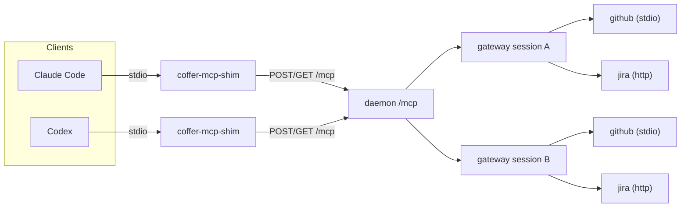
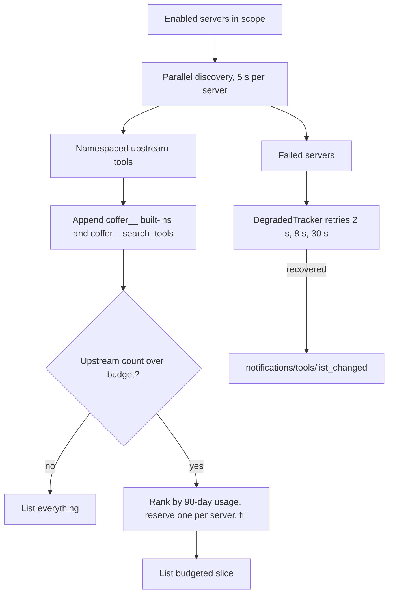
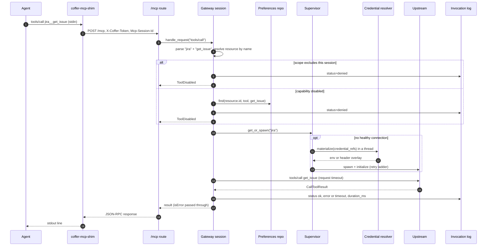
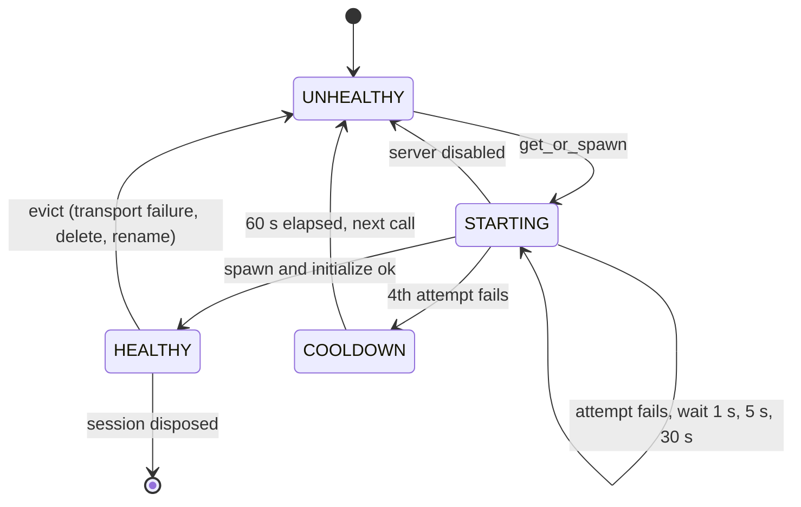

# MCP gateway

This page explains how the daemon turns many upstream MCP servers into one MCP server that every agent connects to. It is for engineers who want the mechanism behind `/mcp` and `coffer-mcp-shim`: how sessions are created, why each session owns its own upstream processes, how the tool list is merged and trimmed, and what happens on every `tools/call`.

## The problem

A developer who uses several coding agents registers the same MCP servers in each agent's own config file, with the same secrets pasted into each. Every agent then spawns its own copies, and each copy sees a different subset of what the developer set up.

The gateway replaces that with one registration per server. Each agent's config holds exactly one MCP entry, `coffer`, which launches `coffer-mcp-shim`. Behind it, the daemon aggregates every enabled upstream server's tools, resources and prompts, applies the owner's curation (per-capability toggles, per-agent scope), and records each call it forwards.

Aggregation brings its own problem. Once a user registers a handful of servers, the merged catalogue passes the point where a model picks tools reliably, which is roughly 30 to 50 tools. The gateway handles this in two ways. It lists a budgeted slice of the catalogue, and it offers a search tool that reaches the rest.

## Design decisions

| Decision | Reason |
| --- | --- |
| Coffer is one MCP server downstream and an MCP client upstream. | Every agent needs one config entry, and the gateway is free to rewrite, filter and log in between. |
| Each downstream session gets its own upstream processes. | MCP is a per-session protocol. Sharing one upstream session between clients would mean re-implementing capability negotiation and notification routing inside the gateway. |
| Upstreams are spawned lazily. | Sessions start fast, and a server the agent never touches costs nothing. |
| Names are rewritten to `<server>__<name>` and `coffer://<server>/<uri>`. | Two servers that both expose `search` never collide. `__` was chosen because `:`, `.`, `/` and `-` are all legal inside upstream tool names. |
| Capabilities are discovered live, and only preferences are stored. | An upstream upgrade cannot leave a stale copy of its schema in the database. The user's enable or disable decision survives upgrades and temporary disappearances. |
| Listing is budgeted, and calling is not. | Tiering decides what the model sees. It never decides what the model may call. |
| The agent's identity is taken once, at the handshake. | Scope gating and built-in tool attribution need one identity per session that a client cannot change call by call. |
| Invocations are logged without arguments or results. | The log exists to show which capability ran, when, for how long and with what outcome. Payloads may contain secrets. |

## Topology



Session A and session B each hold their own `github` process. With N connected clients and M enabled servers, the worst case is N × M upstream connections. On a single-user machine N is usually two or three, and only servers that a session actually lists or calls are started.

## The endpoint and the shim

### `/mcp`

The daemon mounts `/mcp` at its root on `127.0.0.1:<port>`. The implementation is `surfaces/http/mcp/protocol_routes.py`. Every request must carry the daemon token in `X-Coffer-Token` (the same token as the REST API). A wrong or missing token gets `401`. The loopback `Host` guard applies here as it does to every other route.

- **`POST /mcp`** takes one JSON-RPC envelope. On the first request without an `Mcp-Session-Id` header, the daemon allocates a UUID and returns it in that header. Every later request carries it. Handling depends on the envelope:
  - `initialize` is answered by the gateway session itself, and `ping` returns `{}`.
  - A message with no `id` is a notification. It gets `202` with no body.
  - A message with an `id` but no `method` is the client's reply to a request the server initiated (`sampling/createMessage` or `roots/list`). It is matched to the waiting future and acknowledged with a bodiless `202`.
  - A batch (a top-level array) is refused with `-32600`.
- **`GET /mcp`** opens a Server-Sent Events stream for server-to-client messages. It requires `Mcp-Session-Id`. Messages wait in a per-session queue capped at 1000 entries. When the queue is full, the oldest message is dropped.

When the SSE stream closes, the session stays open, because the shim reconnects routinely. Sessions end in three ways: the idle reaper, daemon shutdown, or disposal. The reaper wakes every 60 seconds and drops any session that has seen no POST and no upstream traffic for 30 minutes. You can change both values with `COFFER_MCP_SESSION_REAPER_INTERVAL_S` and `COFFER_MCP_SESSION_IDLE_S`. Before disposing a session, the reaper waits up to about 5 seconds for in-flight POSTs to finish, so a running request never sees a half-disposed session.

### `coffer-mcp-shim`

Agents speak stdio MCP, so `coffer-mcp-shim` (`surfaces/shim/`) bridges stdio to `/mcp`:

1. **Find a daemon, or start one.** The shim reads `~/.coffer/daemon.json` and probes `GET /api/v1/daemon/status`. If no daemon answers within 1 second, it spawns one detached and waits up to 10 seconds. If the daemon still does not come up, the shim exits with code `3` and points at `~/.coffer/logs/daemon.log`. If the daemon reports a different version from the shim, the shim prints a one-line warning on stderr and carries on. See [Daemon and processes](/architecture/daemon).
2. **Stamp the handshake.** In the `initialize` envelope, the shim writes `params._meta["coffer/cwd"]` (its launch directory). If it was launched with `--agent-uid <uid>`, it also writes `params._meta["coffer/agent-uid"]`. It caches the envelope for later replay.
3. **Pump stdin.** Each stdin line is POSTed as its own task. A slow `tools/call` therefore cannot block a `ping` behind it. The line limit is 64 MiB.
4. **Drain SSE.** The shim holds `GET /mcp` open and writes each `data:` payload to stdout. If the stream drops, it reconnects with a backoff that starts at 0.5 seconds and grows to at most 5 seconds.
5. **Recover from a daemon restart.** If a POST fails to connect, the shim re-reads `daemon.json`. If a live daemon now answers at a different port or with a different token, the shim rebinds, replays the cached `initialize` (without forwarding the second reply), and retries the call once.

Stdout is the MCP wire, so the shim validates every reply before writing it. An HTTP error or a non-JSON body becomes a synthesized JSON-RPC error with code `-32603` for that request id. Diagnostics go to `~/.coffer/logs/shim-<pid>-<epoch>.log`, never to stdout.

The Coffer-MCP install (see [Agents](/guides/agents)) writes the `coffer` entry with the absolute shim path and `--agent-uid <uid>`. The argument parser has `allow_abbrev=False`. An entry written with the older `--agent <name>` flag therefore reports no identity, instead of passing a name where a uid belongs.

## Sessions and identity

`MCPGatewaySession` (`application/mcp/gateway.py`) is the per-session routing object. The composition root (`surfaces/http/app_mcp_composition.py`) builds one per session id. Each session gets:

- a fresh `SubprocessSupervisor`, which owns this session's upstream connections,
- a fresh `CapabilityDiscovery`, which holds the live lists and a 60-second cache,
- the shared preference repository, invocation repository and `BuiltinToolRegistry`.

On `initialize`, the session records the client's declared capabilities, the launch cwd, and the agent uid from `_meta["coffer/agent-uid"]`. The identity is fixed for the life of the connection. It is used in two places:

- **Scope.** `gateway_scope.enabled_mcp_servers` lists enabled `mcp_server` resources and keeps those where `is_active(scope, agent_uid)` holds. A `null` scope admits every session. A scoped server admits only the agents whose uids it names. A session that reported no identity sees only unscoped servers. It sees strictly less, never more.
- **Built-in attribution.** The session resolves the uid to the agent's current name on every built-in call. It writes that name into the call as the `agent` argument, and first removes any `agent` the client supplied. No built-in tool advertises `agent` in its schema.

::: info Trust boundary
The identity is self-reported, not verified. Any local process that holds the token can open `/mcp` and claim any uid. This is acceptable under the loopback-only, single-user posture described in [Security model](/architecture/security).
:::

The `initialize` reply declares `tools`, `resources` and `prompts`, each with `listChanged: true`, and protocol version `2025-06-18`. It also carries an `instructions` string capped at 800 characters (`gateway_instructions.py`). The string says what Coffer is, names each built-in tool the session currently lists, and points to the `coffer-guide` skill for everything else. When the session's last `tools/list` left tools unlisted, the string adds one sentence with the number of unlisted tools and says that every one of them is still callable.

## Discovery and namespacing

`CapabilityDiscovery` (`application/mcp/discovery.py`) asks the upstream for `tools/list`, `resources/list` and `prompts/list`. It caches each list per (session, server, type) for 60 seconds and rewrites names through `domain/mcp/namespace.py`:

| Capability | Upstream | Presented |
| --- | --- | --- |
| Tool | `get_issue` | `jira__get_issue` |
| Prompt | `summarize` | `jira__summarize` |
| Resource | `file:///notes.md` | `coffer://jira/file:///notes.md` |

Parsing splits on the first `__`, so the kind refuses any server name that contains `__`. An upstream that answers `resources/list` or `prompts/list` with `-32601` (method not found) is treated as having none of that capability. It is not treated as failing.

Each cold fetch also reconciles preferences in `mcp_capability_preferences`, keyed on the server's surrogate id. Newly seen keys are inserted as enabled. Existing keys get their `last_seen_at` updated. Keys that have disappeared are left in place, so a tool you disabled stays disabled if it vanishes and comes back. Preference rows are read fresh on every list, so a toggle takes effect immediately, whatever the cache holds.

When a discovery request fails for any reason other than a timeout or method-not-found, discovery evicts the connection, spawns a fresh one and retries once. A connection that dies silently is repaired on the next list, without a daemon restart.

## `tools/list`: aggregate, add built-ins, tier



**Fan-out.** `gateway_aggregate_lists.py` queries every visible server concurrently with `asyncio.gather`, and gives each one a hard budget of `PER_SERVER_LIST_TIMEOUT = 5.0` seconds. A server that times out or is unavailable is left out and logged by name. So is a server whose credential cannot be resolved (`CredentialMissing`, `CredentialLocked`). The rest of the list is unaffected. Without this budget, one dead upstream could hold the whole response for the supervisor's full retry ladder.

**Degraded recovery.** Clients cache `tools/list`, and a server that never connected cannot send `list_changed`. So `DegradedTracker` (`gateway_recovery.py`) keeps the names of the servers that failed. It retries them in the background after 2, 8 and 30 seconds. On the first recovery, it invalidates that server's cached tool list and sends `notifications/tools/list_changed` downstream, and the client re-lists.

**Built-ins.** Next, the list gains every built-in the registry currently holds, prefixed `coffer__`, plus `coffer__search_tools`.

### Budget-driven tiering

The policy is the pure function `select_listed_tools` in `domain/mcp/tool_tiering.py`. `application/mcp/gateway_tiering.py` feeds it usage counts:

1. Split the list into built-ins (names starting with `coffer__`) and upstream tools. Built-ins are always listed and do not count against the budget.
2. If the number of upstream tools is at most the budget (`DEFAULT_BUDGET = 50`), list them all.
3. Otherwise, rank the upstream tools by invocation count over the trailing window (`DEFAULT_WINDOW_DAYS = 90`), highest first. Ties keep catalogue order: servers in listing order, and each server's tools in its own `tools/list` order.
4. Walk the ranking and take each server's first (best-ranked) tool, so every visible server keeps at least one listed tool. If there are more servers than budget slots, the budget wins, and the slice spans as many servers as fit.
5. Fill any remaining slots from the ranking in order.
6. Emit the chosen tools in their original catalogue order. The number left out becomes `hidden_count`, which the next `initialize` instructions report.

Usage comes from `MCPInvocationRepo.usage_counts(since=…)`. That is one grouped query over `mcp_invocations` for `capability_type = 'tool'`, joined to `resources` on uid, so the counts follow a server's current name even after a rename. Calls of every status count. An errored call still shows that the agent reached for that tool.

Tiering only affects what is listed:

- `tools/call` gates on the capability preference and on scope, never on list membership. An unlisted tool routes exactly like a listed one.
- `coffer__search_tools` searches the untiered catalogue.
- Tiering fails open. `COFFER_TOOL_TIERING=off` lists everything. So does any exception from the usage query. Only the literal value `off` disables tiering, so a typo keeps it on. A budget or window value that is missing, non-numeric or not positive falls back to its default.

::: tip Why usage, not configuration
A fresh vault has no history but also few tools, so it takes the under-budget branch and sees everything. Usage only shapes the list once there is enough of it to matter. Manual allowlists do nothing until someone configures them, and the unconfigured default is where overload hurts most.
:::

## `coffer__search_tools`

`coffer__search_tools` is the gateway's own tool. It is answered in `application/mcp/gateway_builtin.py` and `gateway_tool_search.py`, not through the registry, because its data is the live aggregation.

```text
coffer__search_tools(query: string, top_k?: integer = 5, 1..20)
  -> { tools: [{ name, description, inputSchema, score }], total_searched }
```

It aggregates the visible servers' tools without tiering, removes every `coffer__` tool, and ranks the rest with `rank_tools` in `domain/mcp/tool_search.py`. The ranker is a deterministic BM25-lite:

- **Tokens.** camelCase boundaries are split, the text is lower-cased, and `[a-z0-9]+` runs are kept. The name text is `"<server> <tool>"`. The namespace is split off first so the server token counts once, not twice.
- **Term frequency.** Each name token adds `3.0` (`_NAME_WEIGHT`), and each description token adds `1.0`. A document's length is the sum of its weights.
- **Score.** For each distinct query term `t` present in the tool:
  `idf(t) = ln(1 + (N - df + 0.5) / (df + 0.5))`, and the term adds
  `idf(t) · f · (k1 + 1) / (f + k1 · (1 - b + b · len / avg_len))`, with `k1 = 1.5` and `b = 0.75`.
- **Output.** Zero-score tools are dropped. Ties keep catalogue order. The top `top_k` are returned (default 5, clamped to 1–20). The per-catalogue index is memoised with `lru_cache(maxsize=8)`, keyed on the catalogue tuple.

The results are real upstream schemas under the names the agent calls directly. The tool never invokes anything for the agent. Servers that fail discovery during a search are skipped, not retried. The `tools/list` path owns retries.

## Built-in tools

`BuiltinToolRegistry` (`application/builtin_tools.py`) is an in-process registry that the composition root fills at startup. Each slice declares a `BuiltinTool(name, description, input_schema, handler, feature)` with a bare name. The gateway lists it as `coffer__<name>`. The registry refuses duplicate names and names that already carry the prefix.

| Tool | Declared in | Experimental feature |
| --- | --- | --- |
| `coffer__write` | `application/knowledge/builtin_tools.py` | `knowledge` |
| `coffer__recall` | `application/memory/builtin_recall_tool.py` | `memory` |
| `coffer__diagnose` | `application/diagnostics.py` | none |
| `coffer__search_tools` | `application/mcp/gateway_tool_search.py` (gateway-owned) | none |

The registry checks the feature on every read. While a feature is off, its tool is absent from `tools/list` and from the `initialize` text. A call to it falls through to upstream routing and fails as an unknown tool would. See [Experimental features](/guides/experimental-features).

Before a built-in handler runs, `inject_session_context` sets `agent` as described above. It also fills `cwd` when the tool's schema declares that property and the client left it empty. The handler's return value is wrapped as a `CallToolResult`: JSON text in `content`, the same object in `structuredContent`, and `isError: false`. An exception inside a handler becomes an in-band `isError: true` result, not a JSON-RPC error, so the model can read it and correct itself. The text shows Coffer-authored and `ValueError` messages, and only the class name for any other exception. For tool behaviour, see [MCP tools](/reference/mcp-tools).

## Lifecycle of a `tools/call`



The pipeline is `_invoke` in `application/mcp/gateway_handlers.py`, which `resources/read` and `prompts/get` share. It differs only in the parser and the upstream method:

1. **Parse.** Split the namespaced name or URI. A malformed one is refused as `ToolDisabled` ("unrecognised tool name").
2. **Resolve.** Look up the `mcp_server` row by the server name the client sent. From here on, everything stored or compared uses identity: the uid for the log, the scope for the gate, and the surrogate id for preferences.
3. **Scope gate.** The call is re-checked with `is_active(resource.scope, session_agent_uid)`. The list already hid the server, but a client that knows the name could still call it. A refusal is logged as `denied` and raised as `ToolDisabled`, the same error a disabled capability gets.
4. **Capability gate.** A preference row with `enabled = false` refuses the call the same way. A missing row counts as enabled.
5. **Connection.** `supervisor.get_or_spawn(server)` returns a live connection, starting one if needed. The session subscribes to that upstream's notifications and server-initiated requests.
6. **Forward.** Send the call with the original name, bounded by the server's request timeout.
7. **Record.** In a `finally` block, write one row with the elapsed time.

### Credential materialisation

Server config never holds a secret. `StdioTransport.env` and `HttpTransport.headers` reject values that look like tokens (`Bearer …`, `ghp_…`, `sk-…`, JWT prefixes, and similar). Secrets are named in `credential_refs`, a map from an env var or header name to a credential ref.

At spawn time, `CredentialResolver.materialize` runs in a worker thread and turns the refs into plaintext from the encrypted store:

- **stdio.** The child's environment is the MCP SDK's minimal default allowlist (`PATH`, `HOME`, `SHELL` and similar), plus the server's static `env`, plus the materialised secrets. The daemon's own `os.environ` is not inherited, so an upstream cannot read tokens the daemon was started with.
- **HTTP.** The static headers are merged with the materialised headers on the client.

The plaintext lives only in the child's environment or the in-memory HTTP client. It is never persisted or logged. A missing ref raises `CredentialMissing`, which is not retried. See [Credentials](/guides/credentials) and [Security model](/architecture/security).

## Supervision

Each session's `SubprocessSupervisor` (`application/mcp/supervisor.py`) keeps one entry per server name.



- **Retry ladder.** Up to four attempts, with waits of 1, 5 and 30 seconds between them (`_RETRY_DELAYS_SECONDS`). Only transient spawn failures are retried: `UpstreamUnavailable`, `UpstreamTimeout`, `OSError`, `ConnectionError` and `TimeoutError`. A config error, a credential error or a cancellation stops the ladder at once. Each attempt is bounded by the server's `spawn_timeout_seconds` (default 30, range 5–120).
- **Cooldown.** After the fourth failure, the entry enters `COOLDOWN` for 60 seconds. Calls during the cooldown fail fast with `UpstreamUnavailable`. The cooldown is checked both before and after taking the per-server spawn lock, so callers queued behind one failing ladder do not each re-run it.
- **Concurrency.** At most 4 cold starts run at once per supervisor (`COFFER_MCP_MAX_CONCURRENT_SPAWNS`). The slot is held only during build and initialize, never during a backoff sleep.
- **Eviction.** `evict` takes no lock. It bumps a generation counter and closes the current connection. A spawn that finishes after an eviction sees the changed generation, closes its new connection and raises. Deleting or renaming a server therefore never waits on a slow ladder. The kind's `on_delete` and `on_rename` hooks evict the server from every live session's supervisor and from the process-wide supervisor that backs the management routes.
- **Crash recovery.** A `tools/call` that fails on the transport evicts the connection, and the next call respawns the server. A transport failure is any non-`MCPError` exception, or an `MCPError` with `CONNECTION_CLOSED`. A well-formed `MCPError` means the upstream answered, so the connection is kept. A timeout does not evict either.
- **Teardown.** A stdio close waits up to 10 seconds for the SDK's own shutdown, which escalates SIGTERM to SIGKILL. The shim then kills every PID recorded for that connection, along with its descendants. Each spawn records a PID file under `~/.coffer/upstream-pids/`, keyed by the server's uid. At startup, the daemon sweeps any files left by a crash.
- **Logs.** Each stdio upstream's stderr goes to its own file, `~/.coffer/logs/upstream/<name>.log`, not to `daemon.log`.

The daemon also runs one process-wide supervisor and discovery for the management routes: `GET …/capabilities`, `POST …/refresh` and the capability toggles. `POST /api/v1/resources/mcp_server/{uid}/test` builds a fresh connection and writes the result to the per-uid health row. Scope never gates these routes, so you can always test a server that no session is allowed to see.

## Notifications and server-initiated requests

The session subscribes lazily to each upstream it touches:

- `notifications/tools/list_changed`, `resources/list_changed` and `prompts/list_changed` invalidate that slice of the session's cache and are forwarded downstream.
- `notifications/resources/updated` is forwarded with its URI rewritten to `coffer://<server>/…`.
- `notifications/message` and `notifications/progress` are dropped. A long tool call is still protected: it is sent with a read timeout that each progress event resets.
- `sampling/createMessage` and `roots/list` from an upstream are relayed over SSE to this session's own client and matched to the client's reply by id, with a 30-second timeout. Sampling is relayed only if the client declared `sampling` at `initialize`.

## Invocation logging

Every routed call, including a built-in one, writes one `mcp_invocations` row in the `finally` block of `_invoke`: which capability ran, for how long, with what `status` (`ok`, `error`, `timeout` or `denied`) and from which session. Arguments and results are never stored, and error text is reduced to a Coffer-authored summary, because an upstream's message can echo a secret back, for example an auth failure that quotes the key. Built-in tools are logged under the reserved uid `coffer`.

The row's columns, the exact meaning of each status, the buffered writer and retention are described once, in [Observability](/architecture/observability#the-mcp-invocation-log). You read the log per server (`coffer mcp invocations <server>`) or across all servers (`coffer mcp invocations`); see [Activity and audit](/guides/activity).

::: warning Status side effect
`GET …/{uid}/status` reads the persisted health row from **Test** first. If there is no health row, it derives the status from the most recent invocation, and any status other than `ok` reads as `failing`. A tool that returns `isError` therefore marks its server as failing until the next successful call or test.
:::

## Error propagation

`surfaces/http/mcp/protocol_routes.py` turns exceptions into JSON-RPC errors:

| Raised | JSON-RPC error |
| --- | --- |
| `ToolDisabled` (disabled capability, out of scope, malformed name) | `-32000`, Coffer's message |
| Any other `CofferError` (`UpstreamUnavailable`, `UpstreamTimeout`, `CredentialMissing`, `ResourceNotFound`, …) | `-32603`, Coffer's message |
| Anything else, including an upstream `MCPError` | `-32603`, `internal error: <ClassName>` |

An upstream's in-band `isError` result is not an error at this layer. It passes through unchanged as a successful JSON-RPC response. Transport failures between the shim and the daemon become `-32603` errors that the shim synthesizes, so the client never hangs on a dead socket.

## Trade-offs and alternatives

- **One upstream session shared across clients.** Rejected. Clients declare different capabilities, and a shared session would force the gateway to invent answers or proxy state mid-stream. Routing `list_changed`, progress tokens and sampling requests to the right client becomes a bookkeeping layer of its own. The cost of not sharing is N × M processes, which is small at single-user scale. A daemon-wide pool has the same problems and also ties every session's state to one pool.
- **Eager spawn at session start.** Rejected. It adds latency at the moment users notice it most, and it wastes processes when a client only uses two of ten servers. Lazy spawn plus the 60-second list cache warms up just as well.
- **Leave deferral to the client.** Measured and rejected. Given about 125 tools from one server, a client moved the whole `coffer` namespace behind its own deferral, including `coffer__search_tools`. The client has no usage signal. Coffer does.
- **Hide every upstream tool behind search.** Rejected. It adds a search round-trip to every routine call of the tools an agent uses constantly.
- **An LLM router that picks and calls the tool.** Rejected. It adds a second model call to every tool use, puts an unauditable hop in the call path, and a router with little context selects worse than the main agent. Search returns real schemas and leaves the choice to the agent.
- **Embedding-based search.** Coffer embeds nothing. The keyword ranker is deterministic, local, needs no model, and is covered by an offline retrieval eval.
- **Self-reinforcing usage.** A tool that is never called ranks low, so it stays unlisted and uncalled. The per-server floor and full-catalogue search are the counterweights. A new tool on a busy server is still reachable only through search until it gets used.
- **No per-call human approval.** The gateway forwards every call that passes the capability and scope gates. There is no approval prompt. Curation happens ahead of time, through toggles and scope.

::: warning Behaviours worth knowing
- Disabling a server removes it from listings and stops new spawns. A session that already holds a connection to it keeps that connection. The call path checks scope and capability preferences, not the server's `enabled` flag. Likewise, a config edit (a new command, URL or credential ref) reaches a session only after its connection is evicted or the session ends. Only delete and rename evict.
- A spawn that fails, or a server in cooldown, fails the call with `UpstreamUnavailable`. No invocation row is written, because `get_or_spawn` runs before the logged section of `_invoke`.
:::

## Where it lives in the code

| Path | Responsibility |
| --- | --- |
| [`surfaces/http/mcp/protocol_routes.py`](https://github.com/wyx-sg/Coffer/blob/main/backend/coffer/surfaces/http/mcp/protocol_routes.py) | `/mcp` POST/GET, session table, SSE queue, idle reaper, JSON-RPC error mapping |
| [`surfaces/shim/`](https://github.com/wyx-sg/Coffer/tree/main/backend/coffer/surfaces/shim) | `coffer-mcp-shim`: detect-or-spawn, handshake `_meta`, stdin pump, SSE drain, restart recovery |
| [`surfaces/http/app_mcp_composition.py`](https://github.com/wyx-sg/Coffer/blob/main/backend/coffer/surfaces/http/app_mcp_composition.py) | Session factory, per-session and process-wide supervisors, reaper env knobs |
| [`application/mcp/gateway.py`](https://github.com/wyx-sg/Coffer/blob/main/backend/coffer/application/mcp/gateway.py) | `MCPGatewaySession`: handshake, dispatch, subscriptions, disposal |
| [`application/mcp/gateway_handlers.py`](https://github.com/wyx-sg/Coffer/blob/main/backend/coffer/application/mcp/gateway_handlers.py) | The shared invoke pipeline, gates, eviction rule, invocation recording |
| [`application/mcp/gateway_aggregate_lists.py`](https://github.com/wyx-sg/Coffer/blob/main/backend/coffer/application/mcp/gateway_aggregate_lists.py), [`gateway_tools_list.py`](https://github.com/wyx-sg/Coffer/blob/main/backend/coffer/application/mcp/gateway_tools_list.py), [`gateway_recovery.py`](https://github.com/wyx-sg/Coffer/blob/main/backend/coffer/application/mcp/gateway_recovery.py) | Parallel fan-out, listing composition, degraded-server retry |
| [`application/mcp/gateway_tiering.py`](https://github.com/wyx-sg/Coffer/blob/main/backend/coffer/application/mcp/gateway_tiering.py), [`tiering_config.py`](https://github.com/wyx-sg/Coffer/blob/main/backend/coffer/application/mcp/tiering_config.py) | Usage query, fail-open rule, env knobs |
| [`application/mcp/gateway_builtin.py`](https://github.com/wyx-sg/Coffer/blob/main/backend/coffer/application/mcp/gateway_builtin.py), [`gateway_tool_search.py`](https://github.com/wyx-sg/Coffer/blob/main/backend/coffer/application/mcp/gateway_tool_search.py) | Built-in dispatch, identity injection, `coffer__search_tools` |
| [`application/mcp/gateway_instructions.py`](https://github.com/wyx-sg/Coffer/blob/main/backend/coffer/application/mcp/gateway_instructions.py) | `initialize` result and instructions text |
| [`application/mcp/gateway_notifications.py`](https://github.com/wyx-sg/Coffer/blob/main/backend/coffer/application/mcp/gateway_notifications.py), [`gateway_server_requests.py`](https://github.com/wyx-sg/Coffer/blob/main/backend/coffer/application/mcp/gateway_server_requests.py) | Upstream notifications, sampling and roots relay |
| [`application/mcp/supervisor.py`](https://github.com/wyx-sg/Coffer/blob/main/backend/coffer/application/mcp/supervisor.py), [`discovery.py`](https://github.com/wyx-sg/Coffer/blob/main/backend/coffer/application/mcp/discovery.py) | Spawn, retry, cooldown, eviction; live lists, cache, preference reconcile |
| [`application/builtin_tools.py`](https://github.com/wyx-sg/Coffer/blob/main/backend/coffer/application/builtin_tools.py) | `BuiltinTool` and `BuiltinToolRegistry` |
| [`application/credentials/resolver.py`](https://github.com/wyx-sg/Coffer/blob/main/backend/coffer/application/credentials/resolver.py) | Credential ref materialisation |
| [`domain/mcp/`](https://github.com/wyx-sg/Coffer/tree/main/backend/coffer/domain/mcp) | Namespacing, server config, BM25-lite ranker, tiering policy |
| [`infrastructure/mcp/`](https://github.com/wyx-sg/Coffer/tree/main/backend/coffer/infrastructure/mcp) | stdio and HTTP upstream connections, dispatch table, persistence, buffered invocation writer |

## Related

- Spec: [mcp-gateway](https://github.com/wyx-sg/Coffer/blob/main/openspec/specs/mcp-gateway/spec.md), and the scope contract in [resource-framework](https://github.com/wyx-sg/Coffer/blob/main/openspec/specs/resource-framework/spec.md)
- Decisions: [One Upstream Subprocess Set Per Session](https://github.com/wyx-sg/Coffer/blob/main/docs/decisions/session-subprocess-model.md), [Budget-Driven Tool Tiering](https://github.com/wyx-sg/Coffer/blob/main/docs/decisions/budget-driven-tool-tiering.md), [Tool Retrieval for Aggregation Overload](https://github.com/wyx-sg/Coffer/blob/main/docs/decisions/tool-retrieval-for-overload.md), [Capability State Model](https://github.com/wyx-sg/Coffer/blob/main/docs/decisions/capability-state-model.md), [Per-Agent Resource Scope](https://github.com/wyx-sg/Coffer/blob/main/docs/decisions/per-agent-resource-scope.md), [Envelope-Encrypted Credentials](https://github.com/wyx-sg/Coffer/blob/main/docs/decisions/envelope-encrypted-credential-store.md)
- Pages: [Daemon and processes](/architecture/daemon), [Resource framework](/architecture/resource-framework), [Security model](/architecture/security), [Observability](/architecture/observability), [MCP servers](/guides/mcp-servers), [Connect a client](/guides/connect-a-client), [MCP tools](/reference/mcp-tools)
