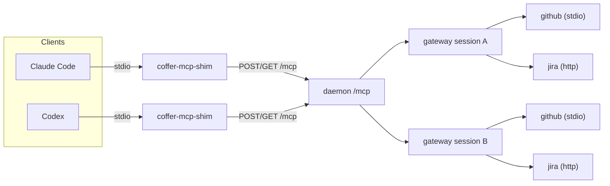
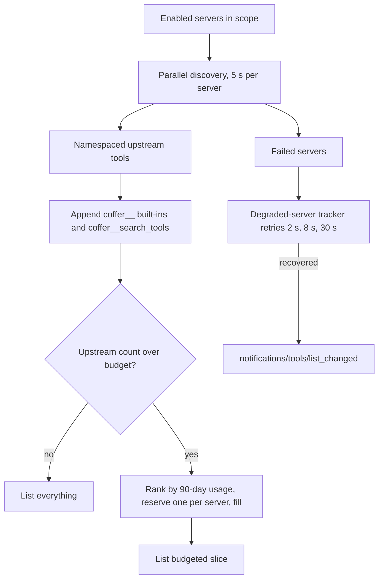
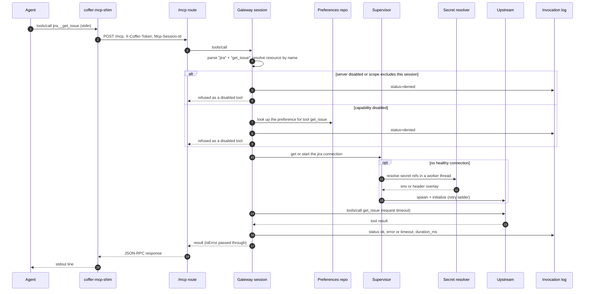
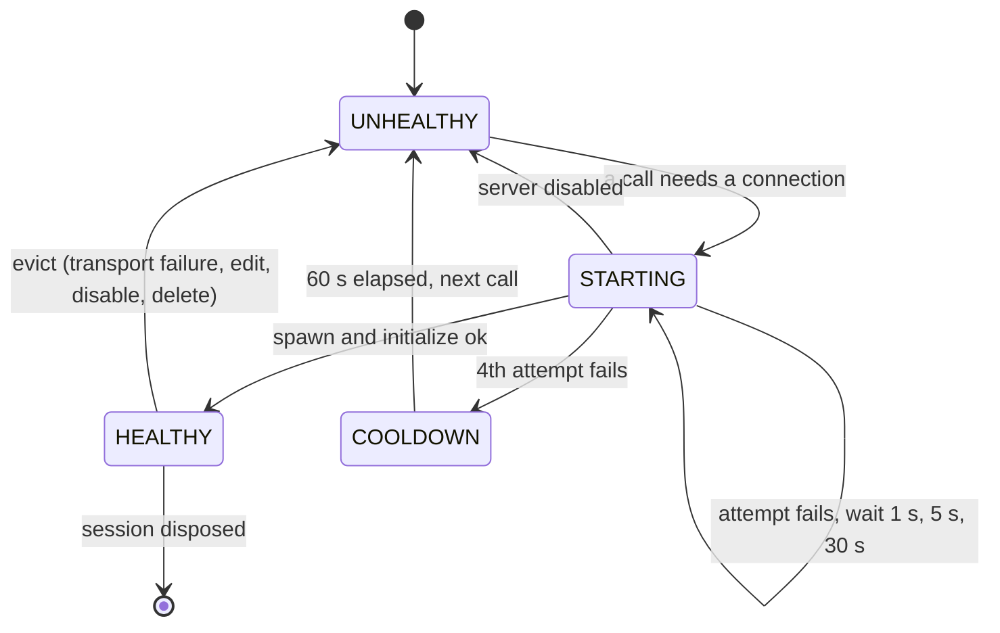

# MCP gateway

This page explains how the daemon turns many upstream MCP servers into one MCP server that every agent connects to. It is for engineers who want the mechanism behind `/mcp` and `coffer-mcp-shim`: how sessions are created, why each session owns its own upstream processes, how the tool list is merged and trimmed, and what happens on every `tools/call`.

## The problem

A developer who uses several coding agents registers the same MCP servers in each agent's own config file, with the same secrets pasted into each. Every agent then spawns its own copies, and each copy sees a different subset of what the developer set up.

The gateway replaces that with one registration per server. Each agent's config holds exactly one MCP entry, `coffer`, which launches `coffer-mcp-shim`. Behind it, the daemon aggregates every enabled upstream server's tools, resources and prompts, applies the owner's curation (per-capability toggles, per-agent scope), and records each call it forwards.

Aggregation brings its own problem. Once a user registers a handful of servers, the merged catalogue passes the point where a model picks tools reliably, which is roughly 30 to 50 tools. The gateway handles this in two ways. It lists a budgeted slice of the catalogue, and it offers a search tool that reaches the rest.

## Design decisions

| Decision | Reason |
| --- | --- |
| Coffer is one MCP server downstream and an MCP client upstream. | Every agent needs one config entry, and the gateway is free to rewrite, filter and log in between. |
| Each downstream session gets its own upstream processes. | MCP is a per-session protocol. Sharing one upstream session between clients would mean re-implementing capability negotiation and notification routing inside the gateway. |
| Upstreams are spawned lazily. | Sessions start fast, and a server the agent never touches costs nothing. |
| Names are rewritten to `<server>__<name>` and `coffer://<server>/<uri>`. | Two servers that both expose `search` never collide. `__` was chosen because `:`, `.`, `/` and `-` are all legal inside upstream tool names. |
| Capabilities are discovered live, and only preferences are stored. | An upstream upgrade cannot leave a stale copy of its schema behind. The user's enable or disable decision survives upgrades and temporary disappearances. |
| Listing is budgeted, and calling is not. | Tiering decides what the model sees. It never decides what the model may call. |
| The agent's identity is taken once, at the handshake. | Scope gating and built-in tool attribution need one identity per session that a client cannot change call by call. |
| Invocations are logged without arguments or results. | The log exists to show which capability ran, when, for how long and with what outcome. Payloads may contain secrets. |
| A custom tool is a third upstream transport, not a new kind. | An HTTP request the gateway makes itself gets namespacing, the reach and disabled gates, logging, audit and sync for free; a separate kind would duplicate all of it. |

## Topology


```mermaid
flowchart LR
  subgraph Clients
    CC["Claude Code"]
    CX["Codex"]
  end
  CC -->|stdio| S1["coffer-mcp-shim"]
  CX -->|stdio| S2["coffer-mcp-shim"]
  S1 -->|"POST/GET /mcp"| D["daemon /mcp"]
  S2 -->|"POST/GET /mcp"| D
  D --> G1["gateway session A"]
  D --> G2["gateway session B"]
  G1 --> U1["github (stdio)"]
  G1 --> U2["jira (http)"]
  G2 --> U3["github (stdio)"]
  G2 --> U4["jira (http)"]
```

Session A and session B each hold their own `github` process. With N connected clients and M enabled servers, the worst case is N × M upstream connections. On a single-user machine N is usually two or three, and only servers that a session actually lists or calls are started.

## The endpoint and the shim

### `/mcp`

The daemon mounts `/mcp` at its root on `127.0.0.1:<port>`. Every request must carry the daemon token in `X-Coffer-Token` (the same token as the REST API). A wrong or missing token gets `401`. The loopback `Host` guard applies here as it does to every other route.

- **`POST /mcp`** takes one JSON-RPC envelope. On the first request without an `Mcp-Session-Id` header, the daemon allocates a UUID and returns it in that header. Every later request carries it. Handling depends on the envelope:
  - `initialize` is answered by the gateway session itself, and `ping` returns `{}`.
  - A message with no `id` is a notification. It gets `202` with no body.
  - A message with an `id` but no `method` is the client's reply to a request the server initiated (`sampling/createMessage` or `roots/list`). It is matched to the server request that is waiting for it and acknowledged with a bodiless `202`.
  - A batch (a top-level array) is refused with `-32600`.
- **`GET /mcp`** opens a Server-Sent Events stream for server-to-client messages. It requires `Mcp-Session-Id`. Messages wait in a per-session queue capped at 1000 entries. When the queue is full, the oldest message is dropped.

When the SSE stream closes, the session stays open, because the shim reconnects routinely. Sessions end in three ways: the idle reaper, daemon shutdown, or disposal. The reaper wakes every 60 seconds and drops any session that has seen no POST and no upstream traffic for 30 minutes. You can change both values with `COFFER_MCP_SESSION_REAPER_INTERVAL_S` and `COFFER_MCP_SESSION_IDLE_S`. Before disposing a session, the reaper waits up to about 5 seconds for in-flight POSTs to finish, so a running request never sees a half-disposed session.

### `coffer-mcp-shim`

Agents speak stdio MCP, so `coffer-mcp-shim` bridges stdio to `/mcp`:

1. **Find a daemon, or start one.** The shim reads `~/.coffer/daemon.json` and probes `GET /api/v1/daemon/status`. If no daemon answers within 1 second, it spawns one detached and waits up to 10 seconds. If the daemon still does not come up, the shim exits with code `3` and points at `~/.coffer/logs/daemon.log`. If the daemon reports a different version from the shim, the shim prints a one-line warning on stderr and carries on. See [Daemon and processes](/architecture/daemon).
2. **Stamp the handshake.** In the `initialize` envelope, the shim writes `params._meta["coffer/cwd"]` (its launch directory). If it was launched with `--agent-uid <uid>`, it also writes `params._meta["coffer/agent-uid"]`. It caches the envelope for later replay.
3. **Pump stdin.** Each stdin line is POSTed as its own task. A slow `tools/call` therefore cannot block a `ping` behind it. The line limit is 64 MiB.
4. **Drain SSE.** The shim holds `GET /mcp` open and writes each `data:` payload to stdout. If the stream drops, it reconnects with a backoff that starts at 0.5 seconds and grows to at most 5 seconds.
5. **Recover from a daemon restart.** If a POST fails in transport, the shim re-reads `daemon.json`. If a live daemon now answers at a different port or with a different token, the shim rebinds, replays the cached `initialize` (without forwarding the second reply), and retries the call once. A 401 from the old daemon (a restart on the same port rotates the token) is handled the same way. The retry never runs a tool twice: a `tools/call` is resent only when the connection was refused or timed out, which means the old daemon never saw it. If the POST failed after the request was sent (a read timeout, a reset mid-response, a protocol error), the old daemon may already have run the tool. The shim still rebinds so later calls work, but it answers that request with a `-32603` error saying the daemon restarted mid-call and the call may or may not have run. Every other method is resent, because it has no side effect.

Stdout is the MCP wire, so the shim validates every reply before writing it. An HTTP error or a non-JSON body becomes a synthesized JSON-RPC error with code `-32603` for that request id. Diagnostics go to `~/.coffer/logs/shim-<pid>-<epoch>.log`, never to stdout.

The Coffer-MCP install (see [Agents](/guides/agents)) writes the `coffer` entry with the absolute shim path and `--agent-uid <uid>`. The argument parser accepts no abbreviated options, so a prefix such as `--agent` is never read as `--agent-uid`: such an entry reports no identity, instead of passing a name where a uid belongs.

## Sessions and identity

The gateway session is the per-session routing object. The composition root builds one per session id. Each session gets:

- a fresh supervisor, which owns this session's upstream connections,
- a fresh discovery, which holds the live lists and a 60-second cache,
- the shared capability preferences, the invocation log and the built-in tool registry.

On `initialize`, the session records the client's declared capabilities, the launch cwd, and the agent uid from `_meta["coffer/agent-uid"]`. The identity is fixed for the life of the connection. It is used in two places:

- **Scope.** The session lists the enabled `mcp_server` resources and keeps those whose scope admits its agent uid. A `null` scope admits every session. A scoped server admits only the agents whose uids it names. A session that reported no identity sees only unscoped servers. It sees strictly less, never more.
- **Built-in attribution.** The session resolves the uid to the agent's current name on every built-in call. It writes that name into the call as the `agent` argument, and first removes any `agent` the client supplied. No built-in tool advertises `agent` in its schema.

::: info Trust boundary
The identity is self-reported, not verified. Any local process that holds the token can open `/mcp` and claim any uid. This is acceptable under the loopback-only, single-user posture described in [Security model](/architecture/security).
:::

The `initialize` reply declares `tools`, `resources` and `prompts`, each with `listChanged: true`, and protocol version `2025-06-18`. It also carries an `instructions` string capped at 800 characters. The string says what Coffer is, names each built-in tool the session currently lists, says where the agent reads what Coffer has no tool for — the memory root to search with its own file tools and the `coffer log` readers for Coffer's own records — and points to the `coffer-guide` skill for everything else. When the session's last `tools/list` left tools unlisted, the string adds one sentence with the number of unlisted tools and says that every one of them is still callable.

## Discovery and namespacing

Discovery asks the upstream for `tools/list`, `resources/list` and `prompts/list`. It caches each list per (session, server, type) for 60 seconds and rewrites names into the gateway's namespace:

| Capability | Upstream | Presented |
| --- | --- | --- |
| Tool | `get_issue` | `jira__get_issue` |
| Prompt | `summarize` | `jira__summarize` |
| Resource | `file:///notes.md` | `coffer://jira/file:///notes.md` |

Parsing splits on the first `__`, so the kind refuses any server name that contains `__`. Because the server name is the prefix of every tool name an agent sees, and agents' permission rules and skills quote it, the name is fixed once registered: a change is refused with `409 NAME_IMMUTABLE`. A server carries no display title beside it; its description is the free note. A client adds its own prefix on top — Claude Code shows `mcp__coffer__<server>__<tool>` — and model provider APIs cap a tool name at 64 characters (Cursor drops tools above 60). So a server name is capped at 24 characters, which leaves 25 for the upstream tool name, and each discovered capability row carries `client_name_length`, the length of `mcp__coffer__<server>__<tool>`; the **Tools** tab and `coffer mcp cap list` flag rows above 64. An upstream that answers `resources/list` or `prompts/list` with `-32601` (method not found) is treated as having none of that capability. It is not treated as failing.

Each cold fetch also records when each capability was first and last seen, in `derived.db`, keyed on the server's uid. Your switches are a separate vault document, `state/mcp-preferences/<server>.json`, which lists only the capabilities you switched off, so a tool you disabled stays disabled if it vanishes and comes back, and the switch travels with vault sync. Preferences are read fresh on every list, so a toggle takes effect immediately, whatever the cache holds.

When a discovery request fails for any reason other than a timeout or method-not-found, discovery evicts the connection, spawns a fresh one and retries once. A connection that dies silently is repaired on the next list, without a daemon restart.

## `tools/list`: aggregate, add built-ins, tier


```mermaid
flowchart TD
  A["Enabled servers in scope"] --> B["Parallel discovery, 5 s per server"]
  B --> C["Namespaced upstream tools"]
  B --> F["Failed servers"]
  C --> D["Append coffer__ built-ins and coffer__search_tools"]
  D --> E{"Upstream count over budget?"}
  E -->|no| L["List everything"]
  E -->|yes| T["Rank by 90-day usage, reserve one per server, fill"]
  T --> L2["List budgeted slice"]
  F --> R["Degraded-server tracker retries 2 s, 8 s, 30 s"]
  R -->|recovered| N["notifications/tools/list_changed"]
```

**Fan-out.** The gateway queries every visible server concurrently, and gives each one a hard budget of 5 seconds. A server that times out or is unavailable is left out and logged by name. So is a server whose secret cannot be resolved (the secret is missing, or the store is locked). The rest of the list is unaffected. Without this budget, one dead upstream could hold the whole response for the supervisor's full retry ladder.

**Degraded recovery.** Clients cache `tools/list`, and a server that never connected cannot send `list_changed`. So a degraded-server tracker keeps the names of the servers that failed. It retries them in the background after 2, 8 and 30 seconds. On the first recovery, it invalidates that server's cached tool list and sends `notifications/tools/list_changed` downstream, and the client re-lists.

**Built-ins.** Next, the list gains every built-in the registry currently holds, prefixed `coffer__`, plus `coffer__search_tools`.

### Budget-driven tiering

The policy is a pure function in the MCP domain package; the gateway feeds it usage counts:

1. Split the list into built-ins (names starting with `coffer__`) and upstream tools. Built-ins are always listed and do not count against the budget.
2. If the number of upstream tools is at most the budget (50 by default, `COFFER_TOOL_TIERING_BUDGET`), list them all.
3. Otherwise, rank the upstream tools by invocation count over the trailing window (90 days by default, `COFFER_TOOL_TIERING_WINDOW_DAYS`), highest first. Ties keep catalogue order: servers in listing order, and each server's tools in its own `tools/list` order.
4. Walk the ranking and take each server's first (best-ranked) tool, so every visible server keeps at least one listed tool. If there are more servers than budget slots, the budget wins, and the slice spans as many servers as fit.
5. Fill any remaining slots from the ranking in order.
6. Emit the chosen tools in their original catalogue order. The number left out is remembered, and the next `initialize` instructions report it.

Usage comes from one grouped query over the invocation log (`mcp_invocations`) for tool calls since the window start, joined to the resources table on uid, so the counts belong to the registered server rather than to whatever name a call carried. Calls of every status count. An errored call still shows that the agent reached for that tool.

Tiering only affects what is listed:

- `tools/call` gates on the capability preference and on scope, never on list membership. An unlisted tool routes exactly like a listed one.
- `coffer__search_tools` searches the untiered catalogue.
- Tiering fails open. `COFFER_TOOL_TIERING=off` lists everything. So does any exception from the usage query. Only the literal value `off` disables tiering, so a typo keeps it on. A budget or window value that is missing, non-numeric or not positive falls back to its default.

::: tip Why usage, not configuration
A fresh vault has no history but also few tools, so it takes the under-budget branch and sees everything. Usage only shapes the list once there is enough of it to matter. Manual allowlists do nothing until someone configures them, and the unconfigured default is where overload hurts most.
:::

## `coffer__search_tools`

`coffer__search_tools` is the gateway's own tool. It is answered by the gateway itself, not through the built-in registry, because its data is the live aggregation.

```text
coffer__search_tools(query: string, top_k?: integer = 5, 1..20)
  -> { tools: [{ name, description, inputSchema, score }], total_searched }
```

It aggregates the visible servers' tools without tiering, removes every `coffer__` tool, and ranks the rest. The ranker is a deterministic BM25-lite:

- **Tokens.** camelCase boundaries are split, the text is lower-cased, and `[a-z0-9]+` runs are kept. The name text is `"<server> <tool>"`. The namespace is split off first so the server token counts once, not twice.
- **Term frequency.** Each name token adds `3.0`, and each description token adds `1.0`. A document's length is the sum of its weights.
- **Score.** For each distinct query term `t` present in the tool:
  `idf(t) = ln(1 + (N - df + 0.5) / (df + 0.5))`, and the term adds
  `idf(t) · f · (k1 + 1) / (f + k1 · (1 - b + b · len / avg_len))`, with `k1 = 1.5` and `b = 0.75`.
- **Output.** Zero-score tools are dropped. Ties keep catalogue order. The top `top_k` are returned (default 5, clamped to 1–20). The index built for a catalogue is memoised, keyed on the exact catalogue, for up to 8 catalogues.

The results are real upstream schemas under the names the agent calls directly. The tool never invokes anything for the agent. Servers that fail discovery during a search are skipped, not retried. The `tools/list` path owns retries.

## Built-in tools

The built-in tool registry is an in-process registry that the composition root fills at startup. Each slice declares a built-in tool with a bare name, a description, an input schema, a handler and, optionally, the experimental feature it belongs to. The gateway lists it as `coffer__<name>`. The registry refuses duplicate names and names that already carry the prefix.

| Tool | Declared by |
| --- | --- |
| `coffer__write` | The knowledge slice |
| `coffer__search_tools` | The gateway itself (gateway-owned) |

No built-in tool belongs to an experimental feature right now. For one that does, the registry checks the feature on every read: while the feature is off, its tool is absent from `tools/list` and from the `initialize` text. A call to it falls through to upstream routing and fails as an unknown tool would. See [Experimental features](/guides/experimental-features).

Before a built-in handler runs, the gateway sets `agent` as described above. It also fills `cwd` when the tool's schema declares that property and the client left it empty. The handler's return value is wrapped as an MCP tool result: JSON text in `content`, the same object in `structuredContent`, and `isError: false`. An exception inside a handler becomes an in-band `isError: true` result, not a JSON-RPC error, so the model can read it and correct itself. The text shows the message of a Coffer-authored error or an invalid-value error, and only the exception's type name for any other exception. For tool behaviour, see [MCP tools](/reference/mcp-tools).

## Lifecycle of a `tools/call`


```mermaid
sequenceDiagram
  autonumber
  participant A as Agent
  participant S as coffer-mcp-shim
  participant R as /mcp route
  participant G as Gateway session
  participant P as Preferences repo
  participant V as Supervisor
  participant C as Secret resolver
  participant U as Upstream
  participant L as Invocation log
  A->>S: tools/call jira__get_issue (stdin)
  S->>R: POST /mcp, X-Coffer-Token, Mcp-Session-Id
  R->>G: tools/call
  G->>G: parse "jira" + "get_issue", resolve resource by name
  alt server disabled or scope excludes this session
    G->>L: status=denied
    G-->>R: refused as a disabled tool
  else capability disabled
    G->>P: look up the preference for tool get_issue
    G->>L: status=denied
    G-->>R: refused as a disabled tool
  end
  G->>V: get or start the jira connection
  opt no healthy connection
    V->>C: resolve secret refs in a worker thread
    C-->>V: env or header overlay
    V->>U: spawn + initialize (retry ladder)
  end
  G->>U: tools/call get_issue (request timeout)
  U-->>G: tool result
  G->>L: status ok, error or timeout, duration_ms
  G-->>R: result (isError passed through)
  R-->>S: JSON-RPC response
  S-->>A: stdout line
```

`resources/read` and `prompts/get` share the same pipeline. It differs only in the parser and the upstream method:

1. **Parse.** Split the namespaced name or URI. A malformed one is refused as a disabled tool ("unrecognised tool name").
2. **Resolve.** Look up the `mcp_server` row by the server name the client sent. From here on, everything stored or compared uses identity: the uid for the log, the scope for the gate, and the uid for preferences.
3. **Enabled gate.** A server whose `enabled` flag is off is refused on every call, logged as `denied` and refused as a disabled tool. The listings already hide it, but a session that listed the server before it was disabled still holds its names.
4. **Scope gate.** The call is re-checked against the server's scope and the session's agent uid. The list already hid the server, but a client that knows the name could still call it. A refusal is logged as `denied` and refused as a disabled tool, the same error a disabled capability gets.
5. **Capability gate.** A preference row with `enabled = false` refuses the call the same way. A missing row counts as enabled.
6. **Connection.** The session's supervisor returns a live connection, starting one if needed. The session subscribes to that upstream's notifications and server-initiated requests. The clock is already running here, so a call that fails because the upstream would not start is recorded too.
7. **Forward.** Send the call with the original name, bounded by the server's request timeout.
8. **Record.** Whether the call succeeded or failed, write one row with the elapsed time.

### Secret materialisation

Server config never holds a secret. A stdio server's `env` and an HTTP server's `headers` reject values that look like tokens (`Bearer …`, `ghp_…`, `sk-…`, JWT prefixes, and similar). Secrets are named in `secret_refs`, a map from an env var or header name to a secret ref.

At spawn time, the secret resolver runs in a worker thread and turns the refs into plaintext from the encrypted store:

- **stdio.** The child's environment is the MCP SDK's minimal default allowlist (`PATH`, `HOME`, `SHELL` and similar), plus the server's static `env`, plus the materialised secrets. The daemon's own environment is not inherited, so an upstream cannot read tokens the daemon was started with.
- **HTTP.** The static headers are merged with the materialised headers on the client.

The plaintext lives only in the child's environment or the in-memory HTTP client. It is never persisted or logged. A missing ref fails with a missing-secret error, which is not retried. See [Secret store](/guides/secret-store) and [Security model](/architecture/security).

## Supervision

Each session's supervisor keeps one entry per server name.


```mermaid
stateDiagram-v2
  [*] --> UNHEALTHY
  UNHEALTHY --> STARTING: a call needs a connection
  STARTING --> HEALTHY: spawn and initialize ok
  STARTING --> STARTING: attempt fails, wait 1 s, 5 s, 30 s
  STARTING --> COOLDOWN: 4th attempt fails
  STARTING --> UNHEALTHY: server disabled
  COOLDOWN --> UNHEALTHY: 60 s elapsed, next call
  HEALTHY --> UNHEALTHY: evict (transport failure, edit, disable, delete)
  HEALTHY --> [*]: session disposed
```

- **Retry ladder.** Up to four attempts, with waits of 1, 5 and 30 seconds between them. Only transient spawn failures are retried: the upstream being unavailable or timing out, and operating-system, connection and timeout errors. A config error, a secret error or a cancellation stops the ladder at once. Each attempt is bounded by the server's `spawn_timeout_seconds` (default 30, range 5–120).
- **Cooldown.** After the fourth failure, the entry enters a cooldown for 60 seconds. Calls during the cooldown fail fast as upstream unavailable. The cooldown is checked both before and after taking the per-server spawn lock, so callers queued behind one failing ladder do not each re-run it.
- **Concurrency.** At most 4 cold starts run at once per supervisor (`COFFER_MCP_MAX_CONCURRENT_SPAWNS`). The slot is held only during build and initialize, never during a backoff sleep.
- **Eviction.** Eviction takes no lock. It bumps a generation counter and closes the current connection. A spawn that finishes after an eviction sees the changed generation, closes its new connection and raises. Deleting, disabling or editing a server therefore never waits on a slow ladder. The kind's delete, disable and config-edit hooks evict the server from every live session's supervisor and from the process-wide supervisor that backs the management routes. After a config edit, the next call spawns the server with the new command, URL or secret refs; re-enabling needs nothing, because the next call spawns afresh.
- **Crash recovery.** A `tools/call` that fails on the transport evicts the connection, and the next call respawns the server. A transport failure is any exception that is not an MCP protocol error, or an MCP error saying the connection closed. Any other well-formed MCP error means the upstream answered, so the connection is kept. A timeout does not evict either, and neither does a failure to obtain a connection in the first place.
- **Teardown.** A stdio close waits up to 10 seconds for the SDK's own shutdown, which escalates SIGTERM to SIGKILL. The shim then kills every PID recorded for that connection, along with its descendants. Each spawn records a PID file under `~/.coffer/upstream-pids/`, keyed by the server's uid. At startup, the daemon sweeps any files left by a crash.
- **Logs.** Each stdio upstream's stderr goes to its own file, `~/.coffer/logs/upstream/<name>.log`, not to `daemon.log`.

The daemon also runs one process-wide supervisor and discovery for the management routes: `GET …/capabilities`, `POST …/refresh` and the capability toggles. Scope never gates these routes, so you can always test a server that no session is allowed to see.

### Testing a server

One probe serves both tests: `POST /api/v1/resources/mcp_server/{uid}/test` for a registered server, and `POST /api/v1/resources/mcp_server/test-config` for a config the Add dialog has not saved. It builds a fresh connection outside every supervisor, runs `initialize` and `tools/list` (and counts resources and prompts when the server declares them), and answers with the tools, the counts, the newest 20 stderr lines and, on failure, a code: `url_refused`, `spawn_failed`, `exited` (with the exit status), `timeout`, `initialize_failed`, `connect_failed` or `stored_secret_not_released`.

- **Time limit.** The whole test ends within 30 seconds; the server's own spawn and request timeouts are capped by it.
- **Process group.** A stdio server runs under `/bin/sh`, which waits for it and prints its exit status on stderr, so an early exit reports its code. Its stderr goes to a private temporary file rather than the server's log. When the test ends — passed, failed, out of time, or the client gone (the route watches for the disconnect and cancels) — the whole process group is sent SIGTERM and then SIGKILL, which also reaches a grandchild the server forked after its parent exited.
- **Secrets.** A registered server's test releases its secrets through its approved binding, as a spawn would. An unsaved config is never given a stored secret: a config citing a stored secret (`secret_refs` in the test request) is not started and answers `stored_secret_not_released`. Values typed into the form's secret rows are set for this test only, and every one is redacted from the stderr lines and the message.
- **What is kept.** The registered test writes the outcome to the server's health row, as before. The unsaved test writes nothing — no resource, health row, invocation or audit event. A URL typed into the form passes the SSRF guard first (see [Security → Outbound requests](/architecture/security#outbound-requests)).

### The built-in `coffer` server

The MCP servers page lists Coffer's own endpoint last, under Built-in. It is not a resource: `GET /api/v1/mcp/builtin` describes it from what the daemon knows — the bound port (`http://127.0.0.1:<port>/mcp`), the built-in tool list above (switched-off features' tools left out), the agents whose MCP config holds Coffer's entry (supplied by the composition root, since the MCP kind may not read the agent kind), and the last 24 hours of calls logged under the reserved uid `coffer`. Its Invocations tab reads `GET /api/v1/mcp/invocations?uid=coffer`.

## Notifications and server-initiated requests

The session subscribes lazily to each upstream it touches:

- `notifications/tools/list_changed`, `resources/list_changed` and `prompts/list_changed` invalidate that slice of the session's cache and are forwarded downstream.
- `notifications/resources/updated` is forwarded with its URI rewritten to `coffer://<server>/…`.
- `notifications/message` and `notifications/progress` are dropped. A long tool call is still protected: it is sent with a read timeout that each progress event resets.
- `sampling/createMessage` and `roots/list` from an upstream are relayed over SSE to this session's own client and matched to the client's reply by id, with a 30-second timeout. Sampling is relayed only if the client declared `sampling` at `initialize`.

## Invocation logging

Every routed call, including a built-in one, writes one `mcp_invocations` row whether it succeeds or fails: which capability ran, for how long, with what `status` (`ok`, `error`, `timeout` or `denied`), from which session, and for which agent when the session reported one (`agent_uid`). Arguments and results are never stored, and error text is reduced to a Coffer-authored summary (for a well-formed JSON-RPC error from the upstream, only its numeric code: `upstream answered with a JSON-RPC error (code -32602)`), because an upstream's message can echo a secret back, for example an auth failure that quotes the key. Built-in tools are logged under the reserved uid `coffer`.

The row's columns, the exact meaning of each status, the buffered writer and retention are described once, in [Observability](/architecture/observability#the-mcp-invocation-log). You read the log per server (`coffer log mcp --server <server>`) or across all servers (`coffer log mcp`); see [Activity and audit](/guides/activity).

### Server status

`GET …/{uid}/status` reads the persisted health row from **Test** first. If there is no health row, it derives the status from the most recent of the last 20 invocations that reached the server; `denied` rows are skipped, because a refused call says nothing about the upstream. An `error` the upstream answered, whether an `isError` tool result or a well-formed JSON-RPC error, is the tool failing over a healthy connection and reads as `healthy`. Only a `timeout` or an `error` where the upstream did not answer (it would not start, the transport died, the process crashed) reads as `failing`. With no such row, the server is `healthy` if it has discovered capabilities and `unknown` otherwise.

## Error propagation

The `/mcp` route turns failures into JSON-RPC errors:

| Failure | JSON-RPC error |
| --- | --- |
| A refused tool (disabled server or capability, out of scope, malformed name) | `-32000`, Coffer's message |
| Any other Coffer error (upstream unavailable or timed out, a missing secret, a resource not found, …) | `-32603`, Coffer's message |
| Anything else, including an MCP error from the upstream | `-32603`, `internal error: <ClassName>` |

An upstream's in-band `isError` result is not an error at this layer. It passes through unchanged as a successful JSON-RPC response. Transport failures between the shim and the daemon become `-32603` errors that the shim synthesizes, so the client never hangs on a dead socket.

## Custom tools: the HTTP API transport

A **custom-tool group** is an `mcp_server` whose transport is `http_api`. Its config holds a base URL, static headers, an auth header and prefix, the one secret ref that header carries, a timeout and a list of tools; each tool is a method, a path template, headers, a body template, a JSON Schema for its arguments, an on/off switch and a changes-data flag. The user-facing side is the [Custom tools guide](/guides/custom-tools).

### Principles

- **Same pipeline, different last hop.** Everything between the agent and the upstream is the gateway's ordinary path. Only the "connection" differs: it is an in-process adapter with the same connection contract as any upstream (start and initialise, send a request, close). It answers `tools/list` from the config and makes the HTTP request on `tools/call`; `resources/list` and `prompts/list` answer *method not found*, which discovery already reads as "none".
- **A value can fill a request, never reshape it.** Request rendering percent-encodes every path hole with no safe characters, drops a query pair whose argument is absent, and fills a body template with JSON values (JSON-escaped text inside a string). A path that is not a path, or a hole the schema does not declare, is refused when the tool is saved.
- **The secret has one way out.** It arrives in the adapter's header overlay, materialised by the supervisor through the guarded resolver for the destination *this group at this base URL*; it is added last, after every tool header; redirects are never followed, so it never reaches a host nobody configured; and its value is masked as `***` in whatever the upstream sends back.
- **Bounded by construction.** One HTTP client per call, the group's timeout (1–300 s), at most 1 MiB of response read by streaming.

### What is where

| Piece | Where | Why there |
| --- | --- | --- |
| Definition and tools | The server's config, under its transport | It travels with sync like every server's definition, and the tool switch travels like a capability toggle does. |
| Reach override | `~/.coffer/local/tool-reach.json` | Reach is machine-local; an override narrows the group's scope for one tool. |
| The per-tool gate | The gateway, per session | Computes, per session, the switched-off and out-of-reach tools; `tools/list` and `coffer__search_tools` drop them and `tools/call` refuses them as `denied` — the same shape as a disabled capability. |
| Annotations | Each discovered tool's annotations, copied to its listing entry | A tool that changes data is listed `readOnlyHint: false, destructiveHint: true`, any other `readOnlyHint: true`; every upstream's own annotations are passed through too. |
| Management | The MCP application package, the custom-tool REST routes and the `coffer tool` CLI group | Every write goes through the resource service, so validation, the missing-secret probe, audit and the eviction of live connections come with it. |
| OpenAPI | A pure reader in the MCP domain package, and a fetcher in the MCP infrastructure package | The document is read into draft tools; a URL is fetched through the SSRF guard (5 MiB, 20 s, redirects re-checked). |

### The secret boundary

The destination is the group; its **target** is `http_api <base_url>` and its slot is the auth header's name, so binding a stored secret, moving the base URL and renaming the header each wait for a person's approval in the desktop app. A group reports its secret as `present`, `missing` or `pending_approval` with the approval ids, and a withheld secret makes the agent's call fail with `SECRET_BINDING_PENDING` having sent nothing. A standalone secret a group binds is never released when the group is deleted: it belongs to the Secrets page.

### Testing a request

A request test runs one draft tool with the same request building and sending as a call, and records nothing. There are two entry points:

- **A saved group** (`POST /api/v1/custom-tools/{name}/test`) materialises its secret through the group's approved binding, exactly as a call would.
- **A group not saved yet** (`POST /api/v1/custom-tools/test`, the group's base URL, headers and timeout inline). It has no binding, so no stored secret is sent and the auth header is left off. Its base URL was typed into a form, so it passes the SSRF guard before anything is sent (see [Security → Outbound requests](/architecture/security#outbound-requests)); an address that is refused, or does not resolve, is reported as not tested.

When no answer came back, a result says how it failed: `request` (the request could not be built), `timeout`, `connect` or `blocked`. A re-import preview also names the kept tools whose request the spec changed — a newly required argument, or a moved method, path or body template — and a reading carries each operation's first tag so the import form can group them.

### Health

A group's health is read, not stored: `off` while disabled, `failing` when its last call in 24 hours failed or timed out, `attention` while its secret is missing or waits for approval, `healthy` after a successful last call, `idle` otherwise. The 24-hour counts per group and per tool come from `mcp_invocations`.

## Trade-offs and alternatives

- **One upstream session shared across clients.** Rejected. Clients declare different capabilities, and a shared session would force the gateway to invent answers or proxy state mid-stream. Routing `list_changed`, progress tokens and sampling requests to the right client becomes a bookkeeping layer of its own. The cost of not sharing is N × M processes, which is small at single-user scale. A daemon-wide pool has the same problems and also ties every session's state to one pool.
- **Eager spawn at session start.** Rejected. It adds latency at the moment users notice it most, and it wastes processes when a client only uses two of ten servers. Lazy spawn plus the 60-second list cache warms up just as well.
- **Leave deferral to the client.** Measured and rejected. Given about 125 tools from one server, a client moved the whole `coffer` namespace behind its own deferral, including `coffer__search_tools`. The client has no usage signal. Coffer does.
- **Hide every upstream tool behind search.** Rejected. It adds a search round-trip to every routine call of the tools an agent uses constantly.
- **An LLM router that picks and calls the tool.** Rejected. It adds a second model call to every tool use, puts an unauditable hop in the call path, and a router with little context selects worse than the main agent. Search returns real schemas and leaves the choice to the agent.
- **Embedding-based search.** Coffer embeds nothing. The keyword ranker is deterministic, local, needs no model, and is covered by an offline retrieval eval.
- **Self-reinforcing usage.** A tool that is never called ranks low, so it stays unlisted and uncalled. The per-server floor and full-catalogue search are the counterweights. A new tool on a busy server is still reachable only through search until it gets used.
- **No per-call human approval.** The gateway forwards every call that passes the capability and scope gates. There is no approval prompt. Curation happens ahead of time, through toggles and scope.

::: warning Behaviours worth knowing
- A config edit evicts before the write is committed. A call that lands in the one-write window between the eviction and the commit respawns from the old config, and that connection stays cached until the next edit, disable, crash or session end.
- A spawn that fails, or a server in cooldown, fails the call as upstream unavailable and writes an `error` row, which marks the server `failing` in its status.
:::

## Where it lives in the code

| Package | Responsibility |
| --- | --- |
| `surfaces/http/mcp/` | `/mcp` POST/GET, session table, SSE queue, idle reaper, JSON-RPC error mapping, custom-tool routes |
| `surfaces/shim/` | `coffer-mcp-shim`: detect-or-spawn, handshake `_meta`, stdin pump, SSE drain, restart recovery |
| `surfaces/http/` | The session factory, per-session and process-wide supervisors, reaper env knobs, the built-in server's agent list |
| `application/mcp/` | Gateway sessions (handshake, dispatch, subscriptions, disposal), the shared invoke pipeline and its gates, parallel fan-out, degraded-server retry, tiering, built-in dispatch and identity injection, `coffer__search_tools`, `initialize` instructions, notification and sampling relay, supervision, discovery, custom-tool groups and the per-tool gate |
| `application/` root and `application/secret/` | The built-in tool registry; secret ref materialisation |
| `domain/mcp/` | Namespacing, server config, the HTTP API transport and its request rendering, OpenAPI reading, BM25-lite ranker, tiering policy |
| `infrastructure/mcp/` | stdio, HTTP and HTTP API upstream connections, the test probe, dispatch table, OpenAPI fetch, persistence, buffered invocation writer |

## Related

- Spec: [mcp-gateway](https://github.com/wyx-sg/Coffer/blob/main/openspec/specs/mcp-gateway/spec.md), and the scope contract in [resource-framework](https://github.com/wyx-sg/Coffer/blob/main/openspec/specs/resource-framework/spec.md)
- Decisions: [One Upstream Subprocess Set Per Session](https://github.com/wyx-sg/Coffer/blob/main/docs/decisions/session-subprocess-model.md), [Tool Overload: List a Usage-Ranked Slice, Search the Rest](https://github.com/wyx-sg/Coffer/blob/main/docs/decisions/tool-overload-tier-the-list-search-the-rest.md), [Capability State Model](https://github.com/wyx-sg/Coffer/blob/main/docs/decisions/capability-state-model.md), [Per-Agent Resource Scope](https://github.com/wyx-sg/Coffer/blob/main/docs/decisions/per-agent-resource-scope.md), [Envelope-Encrypted Secrets](https://github.com/wyx-sg/Coffer/blob/main/docs/decisions/envelope-encrypted-credential-store.md)
- Pages: [Daemon and processes](/architecture/daemon), [Resource framework](/architecture/resource-framework), [Security model](/architecture/security), [Observability](/architecture/observability), [MCP servers](/guides/mcp-servers), [Connect a client](/guides/connect-a-client), [MCP tools](/reference/mcp-tools)
