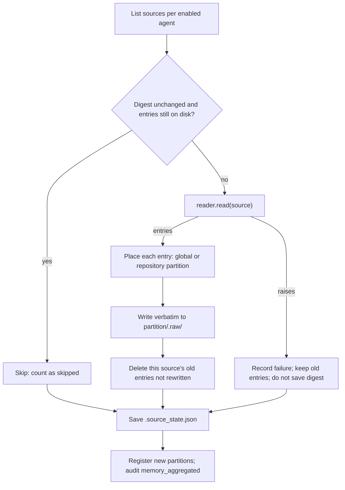
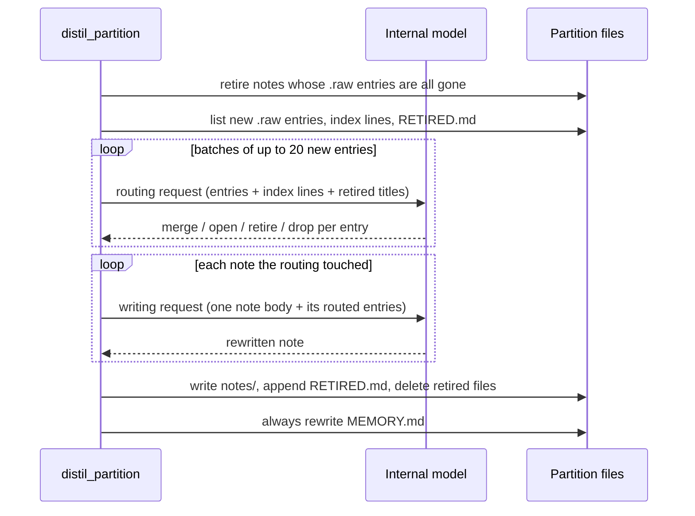
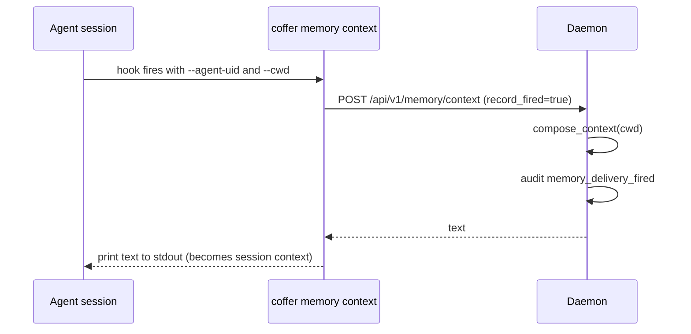

# Memory

This page explains how Coffer's memory layer works: how it reads what Claude Code and Codex have learned out of their own memory files, distils that into notes of its own, and hands the result back to every agent. It is written for engineers who want the mechanism and the reasoning behind it. For the task-oriented view, see the [Memory guide](/guides/memory).

::: info Experimental
Memory is an [experimental feature](/guides/experimental-features) (key `memory`). On a stable build it is off until you switch it on. While it is off, the workers skip their rounds, `coffer__recall` leaves `tools/list`, and the delivery hooks are withdrawn from every agent.
:::

## The problem

Every coding agent keeps its own memory, and none of them can see another's. Claude Code writes one Markdown file per fact under each project. Codex distils its rollouts into task groups and a profile. Both do this well, but the knowledge stays in each agent's own directory, so you end up teaching Codex what Claude Code already knows.

Coffer's answer has three parts:

1. **Read** each agent's native memory, and never write to it.
2. **Distil** what it read into notes of its own: one topic per file, filed by repository, plus one `global` partition for what is about you.
3. **Deliver** the index of those notes to every agent at session start, with the absolute path where the note bodies live. The agent reads a body the same way it reads its own memory: as a file.

What Claude Code learns in the morning, Codex has in its index when it opens the same repository in the afternoon. Coffer does not write into Codex's memory to make that happen. It hands Codex the index line.

Memory is not [knowledge](/architecture/knowledge). Knowledge is what a person or an agent wrote down about the world, and agents pull it on demand through the `coffer-guide` catalogue. Memory is what agents learned while working, and the whole tree can be rebuilt from the agents' own copies. Its index is the one thing Coffer hands a session at start, through a hook you install per agent, so it is an explicit exception to Coffer's [pull, not push](/architecture/design-principles#pull-not-push) rule rather than a silent one.

## Design decisions

### Aggregate, never write back

Coffer reads native memory and never creates, modifies, moves, deletes or reformats a file in it. It also never disables or reconfigures an agent's native memory. There are two reasons for this:

- **No agent's own loop is disturbed.** Each agent keeps managing its memory exactly as its vendor designed. Coffer never holds a second copy that could drift from the first, so nothing has to be reconciled.
- **The whole store becomes disposable.** Everything under `~/.coffer/memory/` is derived. You can delete it, and the next aggregation and distil passes rebuild an *equivalent* set of notes: the same subjects from the same sources, possibly in different words. That is what makes it safe for the distil pass to rewrite notes aggressively.

The one file Coffer does write into an agent's configuration is a hook entry in the agent's *settings*. That file is not memory, and Coffer writes the entry only when you install delivery (see [Delivery](#delivery)).

### Four directories with one writer each

A partition is a top-level directory under `~/.coffer/memory/`:

```
~/.coffer/memory/
├── .source_state.json        ← last-seen digest per native source file
├── global/
│   ├── MEMORY.md             ← the index: what a session is given
│   ├── notes/                ← Coffer's own notes, one topic per file
│   ├── RETIRED.md            ← what was retired, and why
│   └── .raw/                 ← what was read out of the agents, verbatim
└── coffer/
    └── …
```

| Path | Written by | Role |
| --- | --- | --- |
| `.raw/` | aggregation only | Faithful. Each agent's own words, one file per entry, stamped with the agent, the native path and the read time. |
| `notes/` | distil only | Useful. Coffer's own prose, one topic per file, with provenance naming every raw entry behind it. |
| `MEMORY.md` | distil only | Findable. One line per note, grouped by type, newest first. |
| `RETIRED.md` | distil only | Makes a retirement stick. The next distil pass reads it as an exclusion list. |

Because each directory has exactly one writer, you can re-run a bad distillation without reading the agents again: `.raw/` still holds everything they said. The rule is checkable in the code. `infrastructure/memory/raw_store.py` holds the only write path into `.raw/`, and the distil pass does not import it for writing.

`$COFFER_MEMORY_ROOT` overrides the root. The test suite sets it so that a test can never rewrite a developer's real memory tree.

### A partition is a repository

A partition is identified by a **repository**, not by a path. The main checkout, its worktrees and a second clone all file into one partition. `domain/memory/repository.py` derives the identity key:

- When the repository has a remote, the key is the normalised remote URL. The normaliser drops the scheme, the user, the port, a trailing `.git` and a trailing slash, and lowercases the host. It keeps the case of the path, because `owner/Repo` and `owner/repo` are different repositories on most forges. So `git@host:owner/repo.git` and `https://host/owner/repo` produce the same key.
- A repository with no remote falls back to its own root path. A prefix on the key keeps a path from ever colliding with a URL.

A partition gets a readable slug, never an opaque id. The slug comes from the repository's name. If two repositories share a name, Coffer prefixes parent path segments until the slug is unique, so two checkouts named `api` become `work-api` and `personal-api`. The partition's `resources` row records `repository_key` and `repository_path` in its config, and `MEMORY.md` restates the repository path in its header so that anyone browsing the folder knows which project it belongs to.

Three routes lead to `global`:

- An entry whose type is `user` goes to `global` whichever repository it was learned in. It describes the person, not a project. A `feedback` entry has no route of its own: learned in a repository, it files into that repository's partition, because a standing instruction given there ("run the gates before pushing here") binds that repository, and filing it globally would hand it to every other project's sessions.
- An entry with no working directory, or whose working directory is your home directory, goes to `global`.
- An entry learned in a directory that is inside no repository goes to `global`'s `.raw/`. No partition is created for that directory. The distil pass then judges the entry on its merits and either keeps it in `global` or keeps nothing.

Only aggregation creates partitions. The `memory` kind sets `generic_create_allowed=False`, and `MemoryService` registers a new row through the lifecycle opt-in. Composing a context or calling recall never creates one. A partition whose recorded repository no longer exists on disk is reported as `unresolvable` in the partition list, and you can still delete it. Aggregation itself never deletes a partition.

### No per-agent reach

Most resource kinds carry a per-agent **reach** (see [Resource framework](/architecture/resource-framework)). Memory does not: its kind leaves `supports_scope` at `False`. Every **enabled** partition is served to **every** agent, on both paths Coffer serves: delivery and recall. `enabled` is the only gate.

This is deliberate. A per-agent default is the natural thing to reach for, namely "scope a partition to the agents it was aggregated from". But that default is exactly the opposite of what this layer is for. A partition filled only from Claude Code would be withheld from Codex working in the same repository, and Codex is the agent that has not learned it yet. Reach would not be a real boundary anyway. A note is a plain file that any local process can open, so `enabled` decides what Coffer *serves*, not what a process can read.

### Nothing converges

The memory tree is derived from the agents installed on *this* machine, so it never reaches the [vault-sync](/architecture/vault-sync) remote. The `memory` kind is the only kind that sets `converges=False`. The exporter withholds its rows, and the applier refuses a memory document that arrives. Neither the files nor the resource row leave the machine. Each machine aggregates its own agents.

### No table of its own

Notes, raw entries, the index, the retirement record and the per-source digests are all files. Partition metadata lives in the kind-agnostic `resources` table. The layer adds no table.

## Reading native memory

Each supported agent has one reader, implementing the `MemoryReader` protocol in `domain/memory/reader.py`. The protocol has two steps:

- `sources(config_dir)` lists the agent's memory files and hashes each one, without parsing it.
- `read(source)` parses one file into `RawEntry` values: title, description, type, verbatim body, anchor, project root, and optional search terms.

Splitting the two steps is what lets aggregation skip an unchanged file before paying to parse it. Coffer reads only agents that are **registered and enabled**, at paths derived from each agent's own `config_dir`.

| | Claude Code (`readers/claude_code.py`) | Codex (`readers/codex.py`) |
| --- | --- | --- |
| Files read | `<config_dir>/projects/<slug>/memory/*.md` | `<config_dir>/memories/MEMORY.md` and `memory_summary.md` |
| One entry per | fact file | populated bullet section of a task group (`User preferences`, `Reusable knowledge`, `Failures and how to do differently`), plus the profile and profile preferences in the summary |
| Title and description | frontmatter `name` and `description` | derived from the bullet; the distil pass rewrites it anyway |
| Type | `metadata.type` mapped to `feedback` / `project` / `user`; `reference` is skipped as knowledge rather than memory | group preferences → `user`; knowledge and failures → `project`; profile → `user` with an empty project root |
| Project root | the `cwd` recorded in a sibling session transcript, falling back to decoding the project slug | the task group's `applies_to: cwd=…` line |
| Search terms | none, because the format states none | from `## What's in Memory` in the summary, joined to task groups by conservative token coverage |
| Ignored | the agent's own `MEMORY.md` index | `## General Tips`, the rollout-reference subsections, `raw_memories.md`, `rollout_summaries/` |

Neither reader opens session transcripts or rollouts as a source. Both agents already distil their own sessions, and Coffer starts from that output. The Claude Code reader reads a transcript's recorded `cwd` for one purpose only: finding an entry's project root.

Codex's search-term join is deliberately conservative. Codex rewords a group's title in its summary, so an exact title match finds almost nothing. The reader matches on token coverage instead, and attaches terms only when exactly one group clears the bar *and* exactly one summary topic claims that group. A wrong attribution is worse than none.

A reader that cannot parse a file raises `UnreadableMemory` with the file's path. Aggregation isolates that failure to the one file. The pass reports the failure with the agent, the path and the reason, the other sources still aggregate, and nothing the broken source produced earlier is pruned. Aggregation also isolates unexpected exceptions from a reader the same way.

## The aggregation pass

`application/memory/aggregate.py` holds the pass as a pure function over plain values and the derived tree. `MemoryService.aggregate` wraps it with the database parts: it lists the enabled agents and the existing partition rows, registers the new partitions, and records one `memory_aggregated` audit event.



### Skipping unchanged sources

`.source_state.json` holds a `{native_path: sha256}` map under `digests`, with a `version` beside it, at the memory root, written atomically after every pass. A source is skipped only when **both** of these hold:

1. Its digest matches the recorded one.
2. The raw entries it produced are still on disk.

The second condition is what makes the tree truly derived. If you delete a partition's directories and leave the digest file behind, the next pass sees the entries are missing, re-reads the sources, and rebuilds everything. A digest match alone never suppresses a rebuild. The price of this rule is small: a source that legitimately yields no entries is re-parsed on every pass.

If the digest file is lost or corrupt, the next pass re-parses everything. Correctness is not affected.

The `version` is the version of the filing rules (`STATE_VERSION` in `infrastructure/memory/source_state.py`). A digest says a source is unchanged, not that the rule that placed its entries is, so a build that changes where an entry belongs bumps the version. A file written under another version reads as empty: the next pass re-reads every source once, files its entries under the current rules, and removes the ones it wrote elsewhere before.

### Stable raw entries

A raw entry's file name is an origin key: the first 16 hex characters of a SHA-256 over `(agent, native_path, anchor)`. The anchor is the entry's position inside its source, such as the fact file's `name`, or a content hash for a Codex bullet. A second read of an unchanged source therefore overwrites the same files rather than adding near-duplicates. When the agent deletes a bullet from its own memory, the re-read no longer produces that entry, and the pass deletes the stale file from `.raw/`.

Aggregation never compares two agents' entries. Two agents describing one lesson rarely share any phrasing, so a literal comparison would merge nothing. Merging by meaning is the distil pass's job.

## The distil pass

The distil pass turns a partition's new raw entries into notes and rewrites `MEMORY.md`. It runs on its own interval as an upkeep pass of the internal engine, not after each aggregation, and sweeps every partition that holds raw entries it has not yet distilled; a partition with nothing new costs no model call. The pass runs on the [internal engine](/guides/providers) connection when one is configured. It is incremental: no single model request ever carries all of a partition's note bodies.

Before anything is routed, the pass retires every note none of whose `origins` is still under `.raw/` (see [Notes whose sources are gone](#notes-whose-sources-are-gone)). An entry counts as new when its id appears neither in any note's provenance (`origins`) nor in any `RETIRED.md` record.



### Two stages

1. **Routing.** One request per batch of up to 20 new entries, each entry's text capped at 2,000 characters. The request carries the batch, the partition's **index lines**, and the titles in `RETIRED.md`, but no note body. For each entry the model answers with one of four actions:
   - **merge** into a named existing note,
   - **open** a new note (optionally joined by another entry in the same batch, which is how two agents' first accounts of one lesson become one note),
   - **retire** a note the entry contradicts,
   - **drop**: keep nothing.
2. **Writing.** One request per note that the routing touched. It carries that note's current body and the entries routed to it, and returns the rewritten note.

So a partition of 100 notes that gained three entries costs one routing request over 100 index lines and at most three small writing requests.

### Retirements stick

A retirement deletes the note's file from `notes/` and appends a record to `RETIRED.md`: the title, the reason, the replacing note if there is one, and the raw entry ids the record excludes. A drop is recorded the same way. This is the one mechanism that makes a deletion hold. The material behind a retired note still lives in the agent's own memory, outside Coffer's control, so the next aggregation reads it again. Without the record, the next distil pass would re-open the note.

### Notes whose sources are gone

Aggregation deletes a raw entry when its source stops producing it: the agent removed the fact from its own memory, or placement now files the entry into a different partition (a `feedback` entry that carries a project root, for example, moves from `global` to that project). A note built only from such entries has nothing left under it, so every distil pass, including the mechanical one, retires it first: the file leaves `notes/` and `RETIRED.md` gains a record with the reason and `sources_gone: true`. A note with at least one surviving origin is left alone.

This record is not an exclusion. It names no entry ids, and its title is not sent to routing among the retired subjects, because nobody judged the note untrue. If the material comes back, it is distilled like any new entry.

### Degrading safely

- **No internal connection.** `_distil_mechanically` is a synchronous function that has no completion port to call a model with. Each new entry becomes a note of its own, carrying the source's title, description, text, type and search terms, and the index is written from their frontmatter. The result is thinner, but it still works.
- **Malformed model output.** An unknown slug, a non-JSON answer, or an action naming an entry outside the batch is logged and skipped. The affected entries stay in `.raw/` for the next pass. The pass never raises for bad output.
- **`MEMORY.md` is written on every path**, including when nothing changed and when every model call failed. Delivery comes from the index, so a partition without one would deliver nothing.

Each pass records a `memory_distilled` audit event with the counts `merged`, `opened`, `retired` and `dropped`, and `model_used`.

### One pass per partition

The interval worker and the manual trigger (`POST /api/v1/memory/partitions/{uid}/distil`, `coffer memory distil`) both claim the partition's **uid** in the shared upkeep-runs registry. A manual request that arrives while a pass is running is refused with `UPKEEP_ALREADY_RUNNING` (409). The worker skips a busy partition and returns to it on its next sweep. The registry lives in memory, one per daemon.

## The index line

`application/memory/index.py` renders one line per note. `MEMORY.md` and delivery both use it, so the two can never disagree:

```md
- **Worktrees for parallel sessions** (`worktree-for-parallel-sessions.md`) — Another session edits the main checkout; work in a git worktree. · look up: worktree, parallel session
```

A line carries the note's conclusion, not a pointer to it, so reading the index is usually the end of the errand. It names the file relatively, because the directory is stated once per surface. It repeats the source's own search terms when the source supplied any. Both surfaces sort by one definition of "newest", `index.recency`: the note's `updated_at`, falling back to `created_at` and then to origin timestamps. It is a fallback chain rather than a `max()`: right after a rebuild, every origin shares one capture time, and a `max()` would collapse the ordering.

## Delivery

Delivery hands a session the index. `compose_context` in `application/memory/context.py` builds the payload for a working directory:

1. It resolves `cwd` to a partition by the longest recorded `repository_path` that contains it. A worktree therefore resolves to its repository's partition. An unknown directory resolves to `global`.
2. It emits, in order: a `## Coffer memory` header, `global`'s lines under *Known about you:*, the current repository's lines, and a closing line giving the absolute path of the `notes/` directory with the instruction to read a note as a file.
3. It names no tool. Every consumer is a local process that already reads files.

The payload is bounded by a ceiling of 12,000 estimated tokens (`DEFAULT_CEILING_TOKENS`), sized for a whole index rather than a handful of lines. It rarely binds. When it does, the **current repository's lines are spent first** and `global` gets what is left. Within each section the oldest lines drop first, and a notice states how many were dropped and which directory holds them. A trim therefore still leaves every note reachable as a file. With nothing to deliver, the text is empty rather than a bare header.

Composing a context and calling recall send nothing anywhere. Note content leaves the machine only through the distil pass's internal connection.

### Hooks for the agents you drive yourself

Delivery reaches an agent through the agent's own hook mechanism, calling Coffer's CLI:

```sh
: coffer-memory; coffer memory context --agent-uid <uid> --cwd "$PWD"
```

| Agent | File | Event | Notes |
| --- | --- | --- | --- |
| Claude Code | `settings.json` (`settings` key) | `SessionStart`, matcher `startup\|resume\|clear\|compact` | 10 s timeout |
| Codex | `hooks.json` (`hooks` key) | `UserPromptSubmit` | Codex has no session-start event, so the command carries a once-per-session guard: a flag file under `$TMPDIR` keyed by `$PPID` |

The leading `: coffer-memory;` is a shell no-op that carries the marker. Coffer finds, replaces and removes its own entry by that marker, and never touches another tool's hooks on the same event. Installing is always an explicit act (`coffer memory delivery-install`, or the agent's detail page). It is idempotent, and removing the entry deletes empty event arrays and an empty `hooks` key after itself. The agent is named by its immutable uid, because a hook string may sit in a settings file for months while you rename the agent.



The CLI command is silent on every failure. If no daemon is running, or the daemon answers with an error, the command prints nothing, so a hook never breaks a session. Each real fire records a `memory_delivery_fired` audit event. A management preview leaves `record_fired` false. The per-agent delivery status reports only whether the hook is installed. Whether it *fires* is a stream of events, which you read on the [Activity](/guides/activity) page.

### Keeping hooks current

Detection matches the marker and never reads the arguments. A hook whose command went stale, for example because a CLI flag changed, therefore still reads as installed, while failing at every session start. At boot the daemon compares each installed command with the command the running build would install, and rewrites the ones that differ (`DeliveryService.heal_drift`). The repair runs best-effort per agent and never installs a hook for an agent that has none.

The same reconcile follows the `memory` feature switch (`application/memory/delivery_switch.py`). Switching memory off removes the hook from every agent and records their uids in `daemon-config.json`. Switching it back on reinstalls the hook into exactly those agents, then heals stale commands.

### Channel turns

A turn that arrives from Telegram or SeaTalk runs no session-start hook, so the memory payload travels in its system prompt instead. `memory_context_composer` in `surfaces/http/memory_wiring.py` closes over `MemoryService` and the feature switch; `wire_chat` hands it to both agent providers, and `compose_system_context` in `infrastructure/chat/adapter_support.py` calls it only for a channel-driven turn, with the conversation's working directory. It runs the same `compose_context` the hook uses, so a channel turn gets the same index and notes path a terminal session would.

The composer answers nothing, and the turn carries no memory header, while the `memory` feature is off (read per turn), when the composed index is empty, or when the tree cannot be read (logged; memory is an append to the turn, not a precondition of it). A turn from the web Chat page gets no append: it receives memory through the agent's own hook, so no turn gets it twice.

## Recall

`coffer__recall` is the layer's one builtin MCP tool (see [MCP tools](/reference/mcp-tools)). It **locates** notes and does not return their bodies:

- It takes one `query` string and scans every enabled partition's `notes/`. A match is a case-insensitive substring match over each note's body, title, description and search terms.
- It returns up to 10 matches, sorted by path, each with its absolute `path`, `title`, `description`, `type` and `partition`. There is no score and no ranking. The caller reads the file itself.
- It never sees a retired note or a raw entry. It reads only what `notes/` holds, so this exclusion is structural rather than a filter.
- It needs no internal connection. The asking agent's identity reaches the handler, like every builtin's, but the handler ignores it: every agent gets the same answer.

Recall is for finding a note in a partition the session was *not* opened in. For the current repository, the index is already in the session's context. There is no `remember` tool. An agent records something the way it always does, and Coffer reads it on the next pass. A recall call produces the usual `mcp_invocations` row, which records nothing about the query or the results.

## Workers and scheduling

Both passes run as asyncio tasks that the daemon starts from `surfaces/http/memory_wiring.py`:

| Worker | First pass | Default interval | Audit actor |
| --- | --- | --- | --- |
| `AggregateWorker` | immediately on start | 1 hour | `system:memory-aggregate-worker` |
| `DistilWorker` | after 60 s | 6 hours | `system:memory-distil-worker` |

Both are on by default. They read the agents' files and write only the derived tree, so an unattended run carries no risk. Each pass reads its switch and interval from the internal-engine configuration (`aggregate`, `distil`) **per pass**, so a change in Settings applies without a restart. While the `memory` feature is off, both skip their rounds. A failed pass is logged and never ends the loop. On shutdown, a pending pass is dropped, because the next boot sweeps everything again. You can also trigger aggregation by hand with `coffer memory sync` or `POST /api/v1/memory/sync`.

## Trade-offs and alternatives

- **Projecting a Coffer-owned store into each agent's memory.** This would give ambient loading for free, but only by writing, symlinking or disabling another tool's memory. That is intrusive, hard to understand, and fragile against vendor changes. Aggregation leaves each agent's loop untouched and pays for it with a hook.
- **Storing the sources' words verbatim as the product.** This keeps quotes exact, but Codex's untitled bullets would become notes whose title, description and body were the same sentence. Coffer keeps verbatim text in `.raw/`, where provenance points at it, and writes the notes in its own words.
- **A budgeted digest plus a search tool.** Agents do not call a tool to find something they have not been shown. Both supported hosts solve retrieval the same way: they load a whole index and read a body as a file. Coffer copies that shape, and keeps recall only as a locator for other partitions.
- **Literal de-duplication across agents.** Two agents never phrase a lesson the same way, so a literal comparison merges nothing. Merging is a judgement about meaning, made by the distil model.
- **Keying partitions on working directories.** This splits a repository across its worktrees, orphans partitions when directories disappear, and turns scratch folders into permanent partitions. Keying on the repository avoids all three.
- **A third reader abstraction.** Two readers are written as two readers. A third agent gets an adapter against the existing `MemoryReader` and `DeliveryAdapter` protocols, not a capability matrix.

## Where it lives in the code

| Concern | Path |
| --- | --- |
| Reader protocol, `RawEntry`, `SourceFile` | [`domain/memory/reader.py`](https://github.com/wyx-sg/Coffer/blob/main/backend/coffer/domain/memory/reader.py) |
| Note, origin key, note types | [`domain/memory/note.py`](https://github.com/wyx-sg/Coffer/blob/main/backend/coffer/domain/memory/note.py) |
| Repository identity, partition slugs | [`domain/memory/repository.py`](https://github.com/wyx-sg/Coffer/blob/main/backend/coffer/domain/memory/repository.py), [`domain/memory/partition.py`](https://github.com/wyx-sg/Coffer/blob/main/backend/coffer/domain/memory/partition.py) |
| Hook marker and install transform | [`domain/memory/delivery.py`](https://github.com/wyx-sg/Coffer/blob/main/backend/coffer/domain/memory/delivery.py) |
| Aggregation pass and worker | [`application/memory/aggregate.py`](https://github.com/wyx-sg/Coffer/blob/main/backend/coffer/application/memory/aggregate.py), [`aggregate_worker.py`](https://github.com/wyx-sg/Coffer/blob/main/backend/coffer/application/memory/aggregate_worker.py) |
| Which partition an entry files into | [`application/memory/placement.py`](https://github.com/wyx-sg/Coffer/blob/main/backend/coffer/application/memory/placement.py) |
| Distil pass (routing, plan, write, apply) and worker | [`application/memory/distil.py`](https://github.com/wyx-sg/Coffer/blob/main/backend/coffer/application/memory/distil.py) and its `distil_*.py` siblings |
| Index rendering | [`application/memory/index.py`](https://github.com/wyx-sg/Coffer/blob/main/backend/coffer/application/memory/index.py) |
| Context composition | [`application/memory/context.py`](https://github.com/wyx-sg/Coffer/blob/main/backend/coffer/application/memory/context.py) |
| Delivery service and feature-switch reconcile | [`application/memory/delivery.py`](https://github.com/wyx-sg/Coffer/blob/main/backend/coffer/application/memory/delivery.py), [`delivery_switch.py`](https://github.com/wyx-sg/Coffer/blob/main/backend/coffer/application/memory/delivery_switch.py) |
| Recall service and builtin tool | [`application/memory/recall.py`](https://github.com/wyx-sg/Coffer/blob/main/backend/coffer/application/memory/recall.py), [`builtin_recall_tool.py`](https://github.com/wyx-sg/Coffer/blob/main/backend/coffer/application/memory/builtin_recall_tool.py) |
| Kind (`converges=False`, no scope) and service | [`application/memory/kind.py`](https://github.com/wyx-sg/Coffer/blob/main/backend/coffer/application/memory/kind.py), [`service.py`](https://github.com/wyx-sg/Coffer/blob/main/backend/coffer/application/memory/service.py) |
| Native-memory readers | [`infrastructure/memory/readers/`](https://github.com/wyx-sg/Coffer/tree/main/backend/coffer/infrastructure/memory/readers) |
| Hook adapters per agent | [`infrastructure/memory/delivery/`](https://github.com/wyx-sg/Coffer/tree/main/backend/coffer/infrastructure/memory/delivery) |
| Paths, raw store, note store, digest cache | [`infrastructure/memory/`](https://github.com/wyx-sg/Coffer/tree/main/backend/coffer/infrastructure/memory) |
| Transcript `cwd` lookup shared with the agent kind | [`infrastructure/agent_files/claude_code_transcripts.py`](https://github.com/wyx-sg/Coffer/blob/main/backend/coffer/infrastructure/agent_files/claude_code_transcripts.py) |
| Wiring, workers, boot heal, the channel-turn composer | [`surfaces/http/memory_wiring.py`](https://github.com/wyx-sg/Coffer/blob/main/backend/coffer/surfaces/http/memory_wiring.py) |
| REST routes | [`surfaces/http/memory/`](https://github.com/wyx-sg/Coffer/tree/main/backend/coffer/surfaces/http/memory) |
| CLI | [`surfaces/cli/memory_cmd.py`](https://github.com/wyx-sg/Coffer/blob/main/backend/coffer/surfaces/cli/memory_cmd.py) |

## Related

- Spec: [memory](https://github.com/wyx-sg/Coffer/blob/main/openspec/specs/memory/spec.md), [internal-engine](https://github.com/wyx-sg/Coffer/blob/main/openspec/specs/internal-engine/spec.md)
- Decision records: [Aggregate the agents' memory; never write it](https://github.com/wyx-sg/Coffer/blob/main/docs/decisions/aggregate-agent-memory-never-write-it.md), [Aggregate the Agents' Memory; Never Write It](https://github.com/wyx-sg/Coffer/blob/main/docs/decisions/aggregate-agent-memory-never-write-it.md)
- [Memory guide](/guides/memory) · [Knowledge architecture](/architecture/knowledge) · [Vault sync](/architecture/vault-sync) · [MCP gateway](/architecture/mcp-gateway) · [Chat and turns](/architecture/chat)
