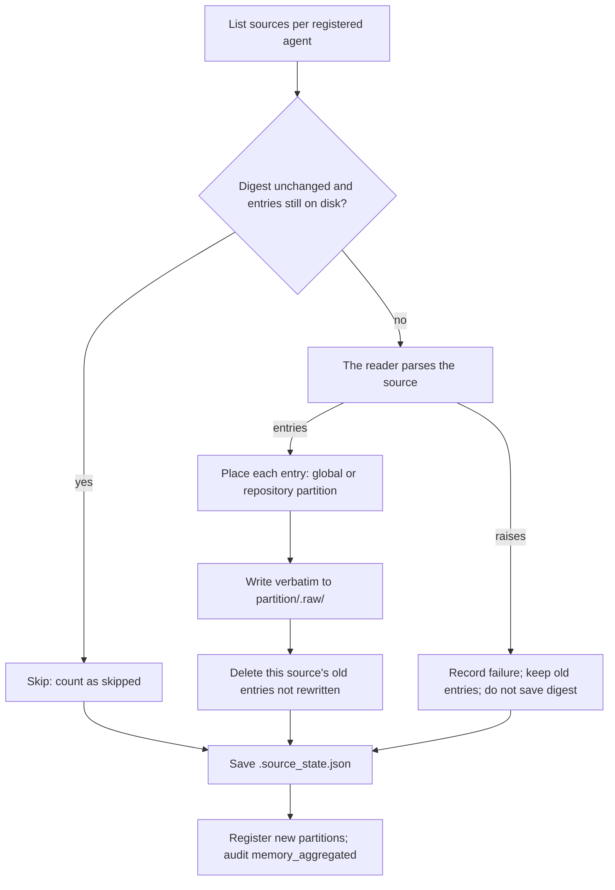
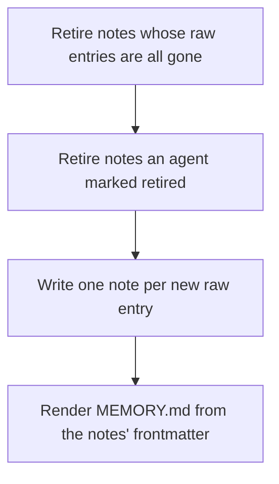
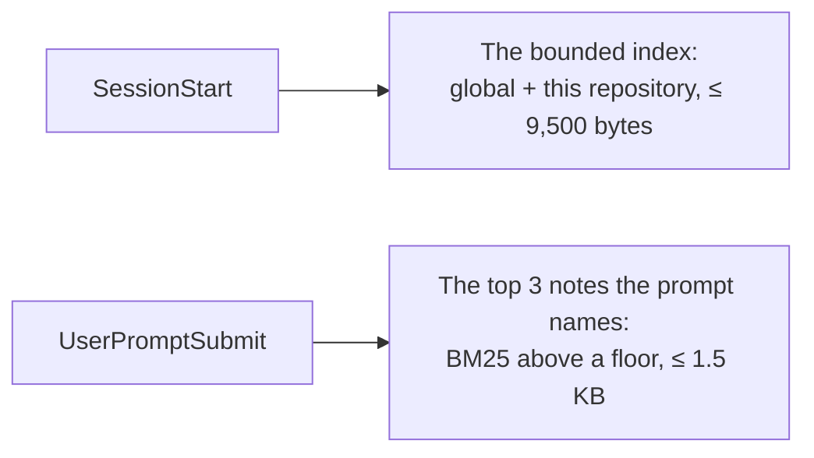
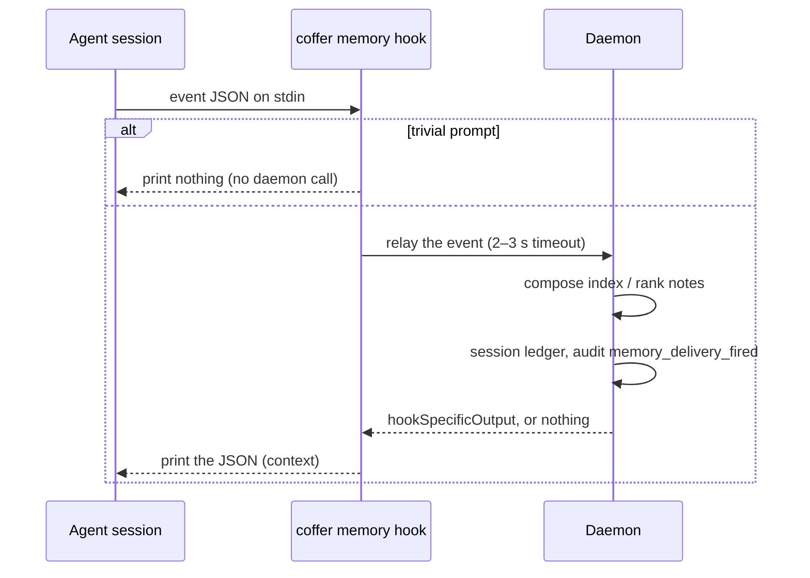

# Memory

This page explains how Coffer's memory layer works: how it reads what Claude Code and Codex have learned out of their own memory files, turns that into notes of its own, has an agent tidy them on request, and hands the result back to every agent. It is written for engineers who want the mechanism and the reasoning behind it. For the task-oriented view, see the [Memory guide](/guides/memory).

## The problem

Every coding agent keeps its own memory, and none of them can see another's. Claude Code writes one Markdown file per fact under each project. Codex distils its rollouts into task groups and a profile. Both do this well, but the knowledge stays in each agent's own directory, so you end up teaching Codex what Claude Code already knows.

Coffer's answer has three parts:

1. **Read** each agent's native memory, and never write to it.
2. **Distil** what it read into notes of its own: one note per entry, filed by repository, plus one `global` partition for what is about you. Merging notes about one subject and retiring ones that are no longer true is **tidying**, which your agent does when you press **Tidy**.
3. **Deliver** those notes back to every agent at two moments: the index at session start, and the few notes a prompt names as it is sent. Every delivery names the absolute path of the note, and the agent reads a body the same way it reads its own memory: as a file.

What Claude Code learns in the morning, Codex has in its index when it opens the same repository in the afternoon. Coffer does not write into Codex's memory to make that happen. It hands Codex the index line.

Memory is not [knowledge](/architecture/knowledge). Knowledge is what a person or an agent wrote down about the world, and agents pull it on demand through the `coffer-guide` catalogue. Memory is what agents learned while working, and the whole tree can be rebuilt from the agents' own copies. Memory is handed to a session, through hooks you install per agent, so it is an explicit exception to Coffer's [pull, not push](/architecture/design-principles#pull-not-push) rule rather than a silent one. The ADR [Memory Reaches a Session at Two Moments](https://github.com/wyx-sg/Coffer/blob/main/docs/decisions/memory-reaches-a-session-at-prompt-time-and-before-a-known-trap.md) states the exception: the index at session start, and the notes a prompt names. Knowledge stays pull.

## Design decisions

### Aggregate, never write back

Coffer reads native memory and never creates, modifies, moves, deletes or reformats a file in it. It also never disables or reconfigures an agent's native memory. There are two reasons for this:

- **No agent's own loop is disturbed.** Each agent keeps managing its memory exactly as its vendor designed. Coffer never holds a second copy that could drift from the first, so nothing has to be reconciled.
- **The whole store becomes disposable.** Everything under `~/.coffer/derived/memory/` is derived. You can delete it, and the next aggregation and distil passes rebuild an *equivalent* set of notes: the same subjects from the same sources. Only what an agent or a person did to the notes afterwards (an edit, a merge, a retirement) is not reproduced.

The one file Coffer does write into an agent's configuration is its hook entries in the agent's *settings*. That file is not memory, and Coffer writes the entries only when you connect the agent to Coffer (see [Delivery](#delivery)).

### Four directories, one role each

A partition is a top-level directory under `~/.coffer/derived/memory/`:

```
~/.coffer/derived/memory/
├── .source_state.json        ← last-seen digest per native source file
├── global/
│   ├── MEMORY.md             ← the index: what a session is given
│   ├── notes/                ← Coffer's own notes, one topic per file
│   ├── RETIRED.md            ← what was retired, and why
│   └── .raw/                 ← what was read out of the agents, verbatim
└── coffer/
    └── …
```

| Path | Written by | Role |
| --- | --- | --- |
| `.raw/` | aggregation only | Faithful. Each agent's own words, one file per entry, stamped with the agent, the native path and the read time. It is the distil pass's input only: the web UI does not list or read it. |
| `notes/` | distil, and edits by people or agents | Useful. One note per file, with provenance naming every raw entry behind it. A person can edit a note in the web UI or on disk (see [Editing a note](#editing-a-note)), and an agent tidies them (see [Tidying](#tidying-is-the-agent-s-job)). |
| `MEMORY.md` | distil only | Findable. One line per note, newest first (the same lines and order delivery uses). |
| `RETIRED.md` | distil only | Makes a retirement stick. The next distil pass reads it as an exclusion list. An agent never writes it; it marks a note and the pass records the retirement. |

Because `.raw/` has exactly one writer and nothing else touches it, you can re-run a bad distillation without reading the agents again: `.raw/` still holds everything they said. The rule is checkable in the code: exactly one module writes into `.raw/`, and the distil pass never uses it to write.

The memory root is always `~/.coffer/derived/memory/`, in the derived storage class (see [Persistence](/architecture/persistence)); there is no override. The test suite gives every test its own `HOME`, so a test can never rewrite a developer's real memory tree.

### A partition is a repository

A partition is identified by a **repository**, not by a path. The main checkout, its worktrees and a second clone all file into one partition. The identity key is derived like this:

- When the repository has a remote, the key is the normalised remote URL. The normaliser drops the scheme, the user, the port, a trailing `.git` and a trailing slash, and lowercases the host. It keeps the case of the path, because `owner/Repo` and `owner/repo` are different repositories on most forges. So `git@host:owner/repo.git` and `https://host/owner/repo` produce the same key.
- A repository with no remote falls back to its own root path. A prefix on the key keeps a path from ever colliding with a URL.

A partition gets a readable slug, never an opaque id. The slug comes from the repository's name. If two repositories share a name, Coffer prefixes parent path segments until the slug is unique, so two checkouts named `api` become `work-api` and `personal-api`. The partition's resource file (`~/.coffer/derived/resources/memory/<slug>.json`) records `repository_key` and `repository_path` in its config, and `MEMORY.md` restates the repository path in its header so that anyone browsing the folder knows which project it belongs to.

Three routes lead to `global`:

- An entry whose type is `user` goes to `global` whichever repository it was learned in. It describes the person, not a project. A `feedback` entry has no route of its own: learned in a repository, it files into that repository's partition, because a standing instruction given there ("run the gates before pushing here") binds that repository, and filing it globally would hand it to every other project's sessions.
- An entry with no working directory, or whose working directory is your home directory, goes to `global`.
- An entry learned in a directory that is inside no repository goes to `global`'s `.raw/`. No partition is created for that directory. The distil pass then makes it a note in `global`, like any other entry.

Only aggregation creates partitions. The `memory` kind refuses the generic create route, and the memory service registers a new partition itself, through the resource lifecycle's opt-in. Composing a context never creates one. A partition whose recorded repository no longer exists on disk is reported as `unresolvable` in the partition list, and you can still delete it. Aggregation itself never deletes a partition.

### No per-agent reach and no switch

Most resource kinds carry a per-agent **reach** (see [Resource framework](/architecture/resource-framework)). Memory does not: its kind declares no per-agent scope, and it declares itself not toggleable, so a partition has no enabled switch either and the generic enable/disable route refuses one with `RESOURCE_NOT_TOGGLEABLE`. **Every** partition is delivered to **every** agent. The notes themselves are files under the memory root.

This is deliberate. A per-agent default is the natural thing to reach for, namely "scope a partition to the agents it was aggregated from". But that default is exactly the opposite of what this layer is for. A partition filled only from Claude Code would be withheld from Codex working in the same repository, and Codex is the agent that has not learned it yet. Reach would not be a real boundary anyway. A note is a plain file that any local process can open, so no switch on a partition could decide more than what Coffer *serves*; a disabled partition was still a file any agent could read.

### Nothing syncs

The memory tree is derived from the agents installed on *this* machine, so it never reaches the [vault-sync](/architecture/vault-sync) remote. The `memory` kind declares the derived storage class: its resource files and the whole tree live under `~/.coffer/derived/`, outside the vault repository, so there is nothing for sync to carry. Each machine aggregates its own agents.

### No table of its own

Notes, raw entries, the index, the retirement record and the per-source digests are all files. Partition metadata lives in the partition's derived resource file. The layer adds no table.

## Reading native memory

Each supported agent has one reader, and every reader follows the same two-step contract:

- **List the sources**: list the agent's memory files and hash each one, without parsing it.
- **Read a source**: parse one file into raw entries: title, description, type, verbatim body, anchor, project root, and optional search terms.

Splitting the two steps is what lets aggregation skip an unchanged file before paying to parse it. Coffer reads only agents that are **registered**, at paths derived from each agent's own config directory (`config_dir` below).

| | Claude Code | Codex |
| --- | --- | --- |
| Files read | `<config_dir>/projects/<slug>/memory/*.md` | `<config_dir>/memories/MEMORY.md` and `memory_summary.md` |
| One entry per | fact file | populated bullet section of a task group (`User preferences`, `Reusable knowledge`, `Failures and how to do differently`), plus the profile and profile preferences in the summary |
| Title and description | frontmatter `name` and `description` | derived from the bullet |
| Type | `metadata.type` mapped to `feedback` / `project` / `user`; `reference` is skipped as knowledge rather than memory | group preferences → `user`; knowledge and failures → `project`; profile → `user` with an empty project root |
| Project root | the `cwd` recorded in a sibling session transcript, falling back to decoding the project slug | the task group's `applies_to: cwd=…` line |
| Search terms | none, because the format states none | from `## What's in Memory` in the summary, joined to task groups by conservative token coverage |
| Ignored | the agent's own `MEMORY.md` index | `## General Tips`, the rollout-reference subsections, `raw_memories.md`, `rollout_summaries/` |

Neither reader opens session transcripts or rollouts as a source. Both agents already distil their own sessions, and Coffer starts from that output. The Claude Code reader reads a transcript's recorded `cwd` for one purpose only: finding an entry's project root (accepted only when Claude Code's encoding of that `cwd` is exactly the project's folder name, and looked up once per project per pass).

Codex's search-term join is deliberately conservative. Codex rewords a group's title in its summary, so an exact title match finds almost nothing. The reader matches on token coverage instead, and attaches terms only when exactly one group clears the bar *and* exactly one summary topic claims that group. A wrong attribution is worse than none.

A reader that cannot parse a file reports it as unreadable, with the file's path. Aggregation isolates that failure to the one file. The pass reports the failure with the agent, the path and the reason, the other sources still aggregate, and nothing the broken source produced earlier is pruned. Aggregation also isolates unexpected exceptions from a reader the same way.

## The aggregation pass

The pass itself is a pure function over plain values and the derived tree. The memory service wraps it with the resource parts: it lists the registered agents and the existing partition rows, registers the new partitions, and records one `memory_aggregated` audit event.


```mermaid
flowchart TD
  A["List sources per registered agent"] --> B{"Digest unchanged and entries still on disk?"}
  B -- yes --> S["Skip: count as skipped"]
  B -- no --> R["The reader parses the source"]
  R -- raises --> F["Record failure; keep old entries; do not save digest"]
  R -- entries --> P["Place each entry: global or repository partition"]
  P --> W["Write verbatim to partition/.raw/"]
  W --> D["Delete this source's old entries not rewritten"]
  S --> X["Save .source_state.json"]
  D --> X
  F --> X
  X --> Y["Register new partitions; audit memory_aggregated"]
```

### Skipping unchanged sources

`.source_state.json` holds a `{native_path: sha256}` map under `digests`, with a `version` beside it, at the memory root, written atomically after every pass. A source is skipped only when **both** of these hold:

1. Its digest matches the recorded one.
2. The raw entries it produced are still on disk.

The second condition is what makes the tree truly derived. If you delete a partition's directories and leave the digest file behind, the next pass sees the entries are missing, re-reads the sources, and rebuilds everything. A digest match alone never suppresses a rebuild. The price of this rule is small: a source that legitimately yields no entries is re-parsed on every pass.

If the digest file is lost or corrupt, the next pass re-parses everything. Correctness is not affected.

The `version` is the version of the filing rules. A digest says a source is unchanged, not that the rule that placed its entries is, so a build that changes where an entry belongs bumps the version. A file written under another version reads as empty: the next pass re-reads every source once, files its entries under the current rules, and removes the ones it wrote elsewhere before.

### Stable raw entries

A raw entry's file name is an origin key: the first 16 hex characters of a SHA-256 over `(agent, native_path, anchor)`. The anchor is the entry's position inside its source, such as the fact file's `name`, or a content hash for a Codex bullet. A second read of an unchanged source therefore overwrites the same files rather than adding near-duplicates. When the agent deletes a bullet from its own memory, the re-read no longer produces that entry, and the pass deletes the stale file from `.raw/`. When the agent deletes a whole source file, the file is never listed again, so the pass sweeps what an agent's deleted files once produced the same way, but only for a registered, enabled agent whose config directory is still there: an unmounted directory proves nothing about its files, and a disabled agent keeps what it contributed.

Aggregation never compares two agents' entries. Two agents describing one lesson rarely share any phrasing, so a literal comparison would merge nothing. Merging by meaning is tidying, which an agent does.

## The distil pass

The distil pass turns a partition's new raw entries into notes and rewrites `MEMORY.md`. It is **mechanical**: it calls no model and sends no file content anywhere. It runs on its own interval as an upkeep pass, not after each aggregation, and sweeps every partition that holds raw entries it has not yet distilled; a partition with nothing new and nothing to retire costs nothing.

An entry counts as new when its id appears neither in any note's provenance (`origins`) nor in any `RETIRED.md` record. For each partition the pass does four things, in order:


```mermaid
flowchart TD
  A["Retire notes whose raw entries are all gone"] --> B["Retire notes an agent marked retired"]
  B --> C["Write one note per new raw entry"]
  C --> D["Render MEMORY.md from the notes' frontmatter"]
```

1. **Retire notes whose sources are gone** (see [Notes whose sources are gone](#notes-whose-sources-are-gone)).
2. **Retire notes an agent marked.** A note whose frontmatter carries `retired: <reason>` is recorded in `RETIRED.md`, deleted from `notes/`, and left out of the index (see [Retirements stick](#retirements-stick)).
3. **Write a note for every new entry.** Each raw entry becomes one note of its own, as it stands: the entry's title, description, type, body, search terms and origin, with `created_at` and `updated_at`. A later entry on a topic a note already covers opens a note of its own beside it. Collapsing the two is tidying, which an agent does (see [Tidying is the agent's job](#tidying-is-the-agent-s-job)).
4. **Render `MEMORY.md`** from the notes' frontmatter, on every path, including when nothing changed. Session-start delivery comes from the index, so a partition without one would deliver nothing.

The pass never writes under `.raw/`; the two passes own two directories, which is what lets a distil pass be re-run without reading the agents again. Each pass records a `memory_distilled` audit event with the counts of notes it `opened` and `retired`, and announces the partition on the daemon's event stream as a `memory` event, because notes change without any write to the partition's row.

### Retirements stick

A retirement deletes the note's file from `notes/` and appends a record to `RETIRED.md`: the title, the reason, the replacing note if there is one, and the raw entry ids the record excludes. This is the one mechanism that makes a deletion hold. The material behind a retired note still lives in the agent's own memory, outside Coffer's control, so the next aggregation reads it again. Without the record, the next distil pass would open the note again.

An agent cannot compute raw entry ids, so it does not write the record. It marks the note instead: `retired: <reason>` in the note's frontmatter, and optionally `replaced_by: <slug>`. The next distil pass reads the mark, copies the note's own `origins` into the record as the entry ids, deletes the file and re-renders the index. Merging two notes needs no mark: the survivor carries the merged note's `origins`, and an entry already in some note's `origins` is accounted for.

### Notes whose sources are gone

Aggregation deletes a raw entry when its source stops producing it: the agent removed the fact from its own memory, or placement now files the entry into a different partition (a `feedback` entry that carries a project root, for example, moves from `global` to that project). A note built only from such entries has nothing left under it, so every distil pass retires it first: the file leaves `notes/` and `RETIRED.md` gains a record with the reason and `sources_gone: true`. A note with at least one surviving origin is left alone, and so is a note that names no origin.

This record is not an exclusion. It names no entry ids, because nobody judged the note untrue. If the material comes back, it is distilled like any new entry.

### Editing a note

A person can edit a note: the web UI's **Edit** replaces the note's body and keeps its frontmatter, and editing the file under `notes/` in any editor needs nothing from Coffer. The web UI's save carries a fingerprint of the note as it was read. If the note changed since (an agent merged or rewrote it, or the file was edited on disk), the save is refused and the editor is handed the note as it is now, so nothing is overwritten and nothing is lost.

An edited note is the note, not a suggestion. The distil pass never rewrites an existing note's body, so the edit persists until the note is retired or the derived tree is deleted.

A person can also delete a note. The web UI's **Delete…** asks first, then retires the note rather than only removing its file: it appends a `RETIRED.md` record with the reason `Deleted by hand` carrying the note's own origin entry ids, removes the file and re-renders `MEMORY.md`. The sources behind the note still live in the agent's own memory, so without the record the next distil pass would recreate it; with it, those entries count as accounted for. The deletion is audited as `memory_note_deleted` (actor: the user), and the memory then shows in the partition's read-only **Retired** group.

The derived tree stays disposable. Deleting it and rebuilding reproduces the notes from the agents' own memory, one note per entry, and loses every edit, merge and retirement, which is why the guide says so.

### One pass per partition

The interval worker and Update memory (the web UI's button, which runs aggregation and then distil) both claim the partition's **uid** in the shared upkeep-runs registry. Update memory reports a partition whose pass is already running under `skipped` and distils the rest. The worker skips a busy partition and returns to it on its next sweep. The registry lives in memory, one per daemon.

## Tidying is the agent's job

Two agents rarely phrase a lesson the same way, so a partition collects near-duplicates: one note per memory each agent wrote. Merging them is a judgement about meaning, and so is deciding that a note is no longer true. Coffer makes neither. The `coffer-guide` skill teaches the agent to do both, and a person starts it with one button. See the decision [Tidying Knowledge and Memory Is the Agent's Job](https://github.com/wyx-sg/Coffer/blob/main/docs/decisions/tidying-knowledge-and-memory-is-the-agents-job.md).

### What the guide teaches

While the memory feature is on, the guide's memory section tells the agent to work through one partition at a time under the memory root, reading the partition's `MEMORY.md` and then the notes in full before changing them, and to:

- **Merge** notes about the same subject. It rewrites the surviving note so it holds every fact of both, **appends every entry of the merged note's `origins:` list to the survivor's `origins:`**, unchanged, and deletes the merged file. The `origins` are how Coffer knows a memory is already accounted for: a dropped origin brings the merged note back on the next update.
- **Retire** a note that is no longer true by adding `retired:` with the reason, and `replaced_by:` with the surviving note's file name when there is one. It does not delete the file, because the memory the note came from still lives in an agent's own memory and a deleted note would come back. The next distil pass records the retirement and removes the file.
- Let the **newer statement win** where two notes disagree, unless the older one is shown to be right by a source, a date, a command's output or the code, whoever wrote either.
- Keep one topic and a one-line `description` per note, because the index a session receives is built from it.
- Leave `.raw/`, `MEMORY.md`, `RETIRED.md` and the agents' own memory files alone.

### The Tidy hand-off

The daemon writes the prompt. Reading a partition carries `tidy_handoff`, which names the partition, its absolute directory and the guide section to follow. `GET /api/v1/memory/tidy-handoff` returns one prompt for every partition: it names the memory root and each partition with its notes directory and note count, and asks the agent to tidy them one at a time.

The web UI offers **Tidy** on a partition's page and **Tidy all** in the Memory page's header. Each opens a new conversation on the default managed agent with that prompt and sends it at once. With no managed agent available it offers **Copy prompt** only. Nothing tidies a partition unattended: the aggregate and distil timers keep running, but they never merge or retire a note on their own.

## The index line

One renderer writes one line per note. `MEMORY.md` and delivery both use it, so the two can never disagree:

```md
- **Worktrees for parallel sessions** (`worktree-for-parallel-sessions.md`) — Another session edits the main checkout; work in a git worktree. · look up: worktree, parallel session
```

A line carries the note's conclusion, not a pointer to it, so reading the index is usually the end of the errand. It names the file relatively, because the directory is stated once per surface. It repeats the source's own search terms when the source supplied any. Both surfaces sort by one shared definition of "newest": the note's `updated_at`, falling back to `created_at` and then to origin timestamps. It is a fallback chain rather than the latest of the three: right after a rebuild, every origin shares one capture time, and taking the latest would collapse the ordering.

## Delivery

Memory reaches a session at **two moments**, through **two hook events**:


```mermaid
flowchart LR
  S["SessionStart"] --> I["The bounded index:<br/>global + this repository, ≤ 9,500 bytes"]
  P["UserPromptSubmit"] --> R["The top 3 notes the prompt names:<br/>BM25 above a floor, ≤ 1.5 KB"]
```

1. **At session start**, the bounded index of `global` and the current repository, naming where the note bodies live.
2. **At each substantive prompt**, the few notes that prompt names, ranked lexically.

The design, the options weighed and the evidence are in the ADR [Memory Reaches a Session at Two Moments](https://github.com/wyx-sg/Coffer/blob/main/docs/decisions/memory-reaches-a-session-at-prompt-time-and-before-a-known-trap.md).

### Why two moments

The ADR measured delivery on 107 hand-checked moments from real sessions where an agent needed something a store already held. Two different failures accounted for most misses:

- **Never delivered.** The fact existed, but it never reached the session. The index had been truncated, the session resolved to the wrong partition, or Coffer never reached that agent at all. Retrieval at the prompt addresses this half.
- **Delivered and not acted on.** The rule was in context, read at session start, and broken anyway twenty turns later. This half is not something delivery can fix: an agent weighs what it was given, and the answer for a standing rule that applies to every reply is the instructions the agent loads on every turn (see [Rules about every turn are not memory's job](#rules-about-every-turn-are-not-memory-s-job)).

Each layer covers what the other cannot: the index covers the first message, and retrieval covers the rules a prompt names.

### At session start: the bounded index

Composing the context builds the session-start payload for a working directory:

1. It resolves `cwd` to a partition by the longest recorded `repository_path` that contains it. A worktree therefore resolves to its repository's partition. An unknown directory resolves to `global`.
2. It emits, in order: a `## Coffer memory` header, `global`'s lines under *Known about you:*, the current repository's lines, a line giving the absolute path of the `notes/` directory with the instruction to read a note as a file, and a line naming the memory root to search for a note from another repository.
3. It names no tool. Every consumer is a local process that already reads files.

The payload has two bounds:

- **A token ceiling** of 12,000 estimated tokens, sized for a whole index rather than for a handful of lines.
- **A byte ceiling** of 9,500 UTF-8 bytes for anything an installed hook prints. Both agents cut a hook's output that is longer, and both cuts lose the lines that matter:
  - **Claude Code** keeps a hook's output inline up to about 10,000 characters. Past that, it saves the output to a file and shows the model a ~2 KB preview, which holds the newest few `global` lines and nothing about the repository.
  - **Codex** keeps `additionalContext` up to 2,500 tokens, counted as UTF-8 bytes / 4. Past that, it keeps the head and the tail and cuts the middle.

  A text never has more characters than bytes, so one byte figure satisfies both agents. A real vault's index is 30–45 KB, so at session start this ceiling is the one that binds.

When a ceiling binds, the **current repository's lines are spent first** and `global` gets what is left. Within each section the oldest lines drop first, and a notice states how many were dropped and which directory holds them. A trim therefore still leaves every note reachable as a file. With nothing to deliver, the text is empty rather than a bare header.

Composing a context sends nothing anywhere. Coffer calls no model over memory on any path.

### At each prompt: lexical retrieval

On `UserPromptSubmit`, the daemon ranks the notes of the session's repository partition and of `global` against the prompt, and adds the best few to the session.

- **What is ranked.** Each note's title, description, search terms and body, as one document.
- **How.** Okapi BM25 over word tokens, with CJK text split into overlapping two-character bigrams, so a Chinese prompt finds a Chinese note without a word segmenter. A small stopword list drops words too common to say anything.
- **What is delivered.** The **top three** notes that score at or above a **relevance floor of 4.0**, skipping any note this session was already given, within **1,500 UTF-8 bytes** for the whole delivery including its header. A note that would overflow the budget is skipped, not cut.
- **When nothing is.** A prompt of fewer than three words, or a bare nudge such as `continue`, `ok` or `继续`, retrieves nothing. So does a prompt whose best match is under the floor.

The floor was calibrated on the eval set against a real-size store, where a note shares rare words with the prompt that names it. BM25 weighs each word by how rare it is across the whole store, and scores over a store of only a handful of notes stay low, so such a store rarely clears the floor. That is intended. The floor keeps a prompt that only shares common words with a note from bringing it in, and a store grows past it as the agents learn.

**The index is derived and held in memory.** The daemon builds one ranking index per repository partition together with `global`, and rebuilds it when either partition's `notes/` changes by file name, modification time or size. It is never written to disk, and nothing chunks or embeds a note. The notes stay the only copy; the index is a view of them, like `MEMORY.md`. Embeddings were measured and rejected: three points of recall on the eval set did not pay for a 2.2 GB local model, and the product had already dropped embeddings for literal search.

### How a delivered note is worded

Every note delivered at a prompt reads as **provenance plus fact**. It names the note's file, and states its title and description as "the user's standing rule is: …" for a `feedback` note, or as "a fact they recorded: …" for anything else:

```text
Coffer memory, a note recorded for this user (/Users/you/.coffer/derived/memory/coffer/notes/frontend-vitest-needs-node-20.md): the user's standing rule is: Frontend vitest needs Node 20 — run make verify under Node 20; 22 and 24 exit 1 with every test green.
```

The wording is deliberate. In an earlier round of the eval, a note phrased as an imperative ("delete the branch and the worktree") was quoted back to the user as a prompt injection. Stated as the user's standing rule, 0 of 72 runs flagged a note. Delivered text is never an instruction to the agent.

### One command on two hook entries

Delivery reaches an agent through the agent's own hook mechanism. Coffer's hook is **two entries**, one per event, and both run the same internal command, calling Coffer's CLI **by absolute path**:

```sh
: coffer-memory; /Users/you/.coffer/bin/coffer memory hook --agent-uid <uid> --cwd "$PWD"
```

`coffer memory hook` is an internal entry point run by the installed hook; it is hidden from the CLI help, because a person never types it, and it is the only `coffer memory` command there is.

| Event | Matcher | Entry timeout | What it can answer |
| --- | --- | --- | --- |
| `SessionStart` | `startup\|resume\|clear\|compact` | 10 s | the bounded index, as `additionalContext` |
| `UserPromptSubmit` | none | 5 s | the retrieved notes, as `additionalContext` |

Both agents get the same two entries: Claude Code in `settings.json`, Codex in `hooks.json`. Both hand their hook the event as JSON on stdin in the same shape (`hook_event_name`, `session_id`, `cwd`, `prompt`), and both read the same `hookSpecificOutput` JSON back on every event. So the hook command reads the event from stdin, relays it to the daemon, and prints what comes back. `--cwd "$PWD"` is only the fallback for an event whose input carries no `cwd`. One command for every event means one string to judge for staleness and one hash shape per entry for Codex. The partition's Delivered tab in the web UI shows the session-start text each agent is given.

The path is the one the composition root resolves, preferring the stable `~/.coffer/bin/coffer` over the version directory behind it. A bare `coffer` is not enough, because a hook runs under whatever shell the agent starts. Codex runs hooks under `/bin/zsh` without the user's rc files, so `~/.coffer/bin` is not on that shell's `PATH`. Claude Code started from the Dock does not inherit the login shell's `PATH` either.

The leading `: coffer-memory;` is a shell no-op that carries the marker. Coffer finds, replaces and removes its own entries by that marker, and never touches another tool's hooks on the same events. An install or a remove first sweeps Coffer's marked entries off **every** event, so a marked entry on any other event is never left behind. Installing is always an explicit act: the hook is one part of the agent's Coffer connection (**Connect** on the agent's page; see [Agents](/guides/agents#connect-an-agent-to-coffer)). It is idempotent, and removing the entries deletes empty event arrays and an empty `hooks` key after itself. The agent is named by its immutable uid, because a hook string may sit in a settings file for months while you rename the agent.


```mermaid
sequenceDiagram
  participant A as Agent session
  participant C as coffer memory hook
  participant D as Daemon
  A->>C: event JSON on stdin
  alt trivial prompt
    C-->>A: print nothing (no daemon call)
  else
    C->>D: relay the event (2–3 s timeout)
    D->>D: compose index / rank notes
    D->>D: session ledger, audit memory_delivery_fired
    D-->>C: hookSpecificOutput, or nothing
    C-->>A: print the JSON (context)
  end
```

### Failing open

Memory never stops a prompt because Coffer is down. The CLI prints nothing and exits 0 when no daemon is running, when the daemon does not answer in time (3 seconds at session start, 2 seconds for a prompt, both under the entry's own timeout), or when it answers with an error or with anything the CLI cannot read.

A fire that cannot deliver anything never contacts the daemon at all. The CLI answers a trivial prompt locally with the same test the daemon uses, so a conversation that is just moving along costs a process start, not a round-trip. The daemon still decides everything that depends on state: which partition the session is in and whether this session already had the note.

### The per-session ledger

One promise rests on remembering what each session was given: a note retrieved for one prompt is not retrieved again in the same session. The daemon keeps this in a **per-session ledger in memory**, keyed on the `session_id` the agent hands its hook (or, for a channel turn, `conversation:<id>`) and bounded to the 2,048 most recent sessions.

It is never keyed on a process id. Every session of one Codex app-server shares a parent pid, so a ledger keyed on `$PPID` would work only for the first session of each app-server under Codex Desktop and the IDE hosts.

The ledger survives a daemon restart without a table of its own. Every fire that delivered something is already a `memory_delivery_fired` audit event naming its session and its notes. Before a new daemon answers its first prompt, it reads the fires of the last seven days back, oldest first, into the ledger. A running session therefore is not given a note again after a restart. A session idle for more than seven days is treated as new. If the audit log cannot be read, the failure is logged and the ledger starts empty; the cost is one repeated line.

### Audit and the delivery views

Every **delivering** fire is one `memory_delivery_fired` audit event naming the agent as both the resource and the actor, with details giving its `moment` (`session_start` or `prompt`), the `session_id` and the notes it carried as `<partition>/<slug>`. The event never carries a note's text. A session start is recorded on every fire; a prompt fire only when it delivered a note. A person's edit to a note is audited as `memory_note_edited`, and a hand deletion as `memory_note_deleted`, each naming the partition, the note and the user.

The web UI's read-only **Delivered view** of one partition answers what an agent is given:

- **The Delivered view** of one partition. The **exact** session-start text each agent is given in that partition's repository, composed by the same function and under the same ceiling as the hook. It is shown as rendered Markdown by default, with a Raw toggle for the exact text; in the rendered view each entry links to the memory it came from on its partition's page. Reading it records nothing.

The view does not say whether a hook is installed or trusted. That is a property of the agent's Coffer connection and lives on the agent's page: its connection status and its Hooks tab. The hook's own status likewise reports installation only and carries no last-fired time. Whether it *fires* is a stream of events, which you read on the [Activity](/guides/activity) page.

### Codex's approval

Codex runs a hook only after the user has reviewed it, and records each approval in `config.toml`, one record per entry:

```toml
[hooks.state."/Users/you/.codex/hooks.json:session_start:1:0"]
trusted_hash = "sha256:…"
```

The key is the file, the event, the matcher group's position and the handler's position. The hash covers a normalised form of the entry's definition. An entry with no matching hash is skipped silently: no error, no event. With two entries, the user approves two records in `/hooks`, and every change to Coffer's command needs the approvals again. Until then, Codex skips the entries it has no approval for.

Coffer computes each hash the way Codex does and reads the records. Its hook is trusted only when **every** entry is; otherwise its trust is that of the first entry, in file order, that is not. It never writes a record:

- **It is Codex's review gate.** A tool that installs a hook and then approves that hook itself removes the one point at which the user looks at what will run.
- **A stale copy of the algorithm must fail visibly.** If Coffer wrote hashes and its copy of the algorithm went stale, Coffer would report the hook as approved while Codex skipped it, which is the failure this section exists to prevent. Reading with a stale algorithm fails the visible way instead: Coffer says "needs approval" while Codex actually runs the hook.

The result is Coffer's hook's **trust**: `trusted`, `untrusted`, `modified` (approved for an earlier command), `disabled`, `unknown`, or `not_required` for Claude Code, which runs every hook in its settings. It appears on the agent's Hooks tab and as an attention item. The remedy is always the same: open Codex, run `/hooks`, and trust each of Coffer's two entries.

### Keeping hooks current

Detection matches the marker and never reads the arguments. A hook whose command went stale, for example because a CLI flag changed, therefore still reads as installed, while failing at every fire. So the hook is a target of the [reconciler](/architecture/reconciler). On every pass (at start, every minute, and soon after any agent changes), it compares each installed hook with what the running build would install: the **set of events** its entries sit on, and each entry's whole command. It rewrites the hooks that differ into the two current entries. One unreadable settings file is reported as blocked without stopping the others.

For Codex, the target also compares trust. A current hook that Codex will not run differs only in trust. That difference is reported as `hook_untrusted` (or `hook_disabled`, or `hook_trust_unknown`) on the attention list, with the remedy, and is never written.

An ordinary pass never installs a hook: a connected agent missing it is reported, and reads as partly connected until it is connected again.

### Channel turns

Coffer drives a turn that arrives from Telegram or SeaTalk itself, so it composes that turn's memory itself. When the daemon wires up chat, it hands both agent providers two memory callbacks, and both share one turn-retrieval service:

- **The index callback** answers the index. The chat adapter calls it while it composes the system prompt, only for a channel-driven turn, with the conversation's working directory. It runs the same context composition the hook uses, so a channel turn gets the same index and notes path in its system prompt that a terminal session would. The delivery is recorded as a `session_start` fire of the answering agent, with event `ChannelTurn`.
- **The retrieval callback** answers the notes the prompt names. The provider binds it to the turn only for a channel-driven turn, and the adapter adds what it returns after the user's text in the prompt it sends — where a `UserPromptSubmit` hook's context lands, so the notes stay in the agent's own session. The turn-retrieval service calls the same retrieval service the hook answers through, with `conversation:<id>` as the session id, so a note is given once per conversation; it records the delivery as a `prompt` fire of the answering agent, with event `ChannelTurn`. The message stored in the conversation is the user's own text.

Each callback answers nothing when it finds nothing, or when the tree cannot be read (logged; memory is an addition to the turn, not a precondition of it).

The agent process Coffer spawns for that turn still loads the agent's own settings: the Agent SDK reads the user's `settings.json`, and `codex app-server` runs a trusted `hooks.json`. So on a connected agent, Coffer's hook fires inside a channel turn as well, and without a rule of its own it would hand the agent the index and the notes a second time, from a ledger keyed on the agent's session id that never saw the turn's, and audit each prompt twice. Each moment therefore has one owner. The provider sets `COFFER_CHANNEL_TURN=1` in the environment of a channel turn's process (merged over the daemon's own), the agent hands that environment to every hook it runs, and `coffer memory hook` answers nothing on `SessionStart` or `UserPromptSubmit` when it sees the mark. It does not contact the daemon, so nothing is recorded.

A turn from the web Conversations page is not marked and gets neither closure. It receives memory through the agent's own hook, so no turn gets memory both ways.

### Rules about every turn are not memory's job

A rule about **every** reply, such as the language to answer in or a tone, is not something retrieval can deliver at the right moment. No prompt names it. In the eval, "reply in Chinese" failed under every delivery condition. Such a rule belongs in the instructions the agent loads on every turn, `CLAUDE.md` or `AGENTS.md`, which you own. Coffer never writes those files, for the same reason it never writes an agent's native memory: installing or firing the memory hook leaves them byte-identical.

## Finding a note in another partition

The memory layer has no MCP tool. A note is a Markdown file, and every partition's `notes/` sits under one **memory root** (`~/.coffer/derived/memory/`), so one search with the agent's own file tools covers every partition. The session-start payload names that root, and the `coffer-guide` skill names it beside the knowledge root. For the current repository the index is already in the session's context; the root is for a note from a partition the session was *not* opened in.

A search over the files never sees a raw entry or a retired note as a note: raw entries live under `.raw/`, and retired notes leave `notes/` for `RETIRED.md`. There is no `remember` tool either. An agent records something the way it always does, and Coffer reads it on the next pass.

## Workers and scheduling

Both passes run as background tasks that the daemon starts at boot:

| Worker | First pass | Default interval | Audit actor |
| --- | --- | --- | --- |
| Aggregation | immediately on start | 1 hour | `system:memory-aggregate-worker` |
| Distil | after 60 s | 6 hours | `system:memory-distil-worker` |

Both are on by default. They read the agents' files and write only the derived tree, so an unattended run carries no risk. Each pass reads its switch and interval from the engine's upkeep settings (`aggregate`, `distil`) **per pass**, so a change in Settings applies without a restart. A failed pass is logged and never ends the loop. On shutdown, a pending pass is dropped, because the next boot sweeps everything again. You can also run both by hand in one action: the web UI's **Update memory** button aggregates, then distils every partition left holding undistilled raw entries. A partition whose distil pass is already running is reported as `skipped` rather than failing the call. The answer carries what the aggregation wrote and the `distilled` and `skipped` partitions.

## Trade-offs and alternatives

- **Projecting a Coffer-owned store into each agent's memory.** This would give ambient loading for free, but only by writing, symlinking or disabling another tool's memory. That is intrusive, hard to understand, and fragile against vendor changes. Aggregation leaves each agent's loop untouched and pays for it with a hook.
- **Running a Coffer-owned model to merge and rewrite notes.** This merged duplicates before the person saw them, but it needed a separate model connection the person had to configure, ran unattended, and fell back to a mechanical path when none was set. The agent the person already uses does the same judgement with file tools, a stronger model and the person watching. Each raw entry becomes a note as it stands, and `.raw/` keeps the verbatim text beside it.
- **A budgeted digest plus a search tool.** Agents do not call a tool to find something they have not been shown: Coffer's earlier recall tool was called five times in its life. Both supported hosts load an index and read a body as a file. Coffer copies that shape, and names the memory root so a note from another partition is one search away.
- **The whole index at session start, untruncated.** In replay it reached the most needs, but 30–45 KB cannot pass through either agent's hook output, and even delivered in full, half the rules in context were ignored. Hence the bounded index plus retrieval.
- **Embeddings for ranking.** Embeddings gained three points of recall for a 2.2 GB model. The ranker stays lexical until the eval set shows a replacement earns its cost.
- **Literal de-duplication across agents.** Two agents never phrase a lesson the same way, so a literal comparison merges nothing. Merging is a judgement about meaning, made by the agent that tidies.
- **Tidying on a timer.** An unattended agent run would need loop-proofing against Coffer's own hooks, would spend the person's quota without their knowledge and would leave conversations nobody started. Until someone presses Tidy, near-duplicate notes stay, the index is budgeted so delivery truncates sooner, and that is accepted: the person can see the duplicates and the button.
- **Keying partitions on working directories.** This splits a repository across its worktrees, orphans partitions when directories disappear, and turns scratch folders into permanent partitions. Keying on the repository avoids all three.
- **A third reader abstraction.** Two readers are written as two readers. A third agent gets an adapter against the existing reader and delivery-adapter contracts, not a capability matrix.

## Where it lives {#where-it-lives-in-the-code}

| Concern | Where |
| --- | --- |
| Repository identity, notes, the ranker, the hook entries and the delivered wording | the domain layer's `memory` package |
| Aggregation, placement, distil, the index, context composition, delivery, the session ledger, the delivery views and the delivery-hook reconcile target | the application layer's `memory` package |
| Native-memory readers, per-agent hook adapters, and the files under the memory root | the infrastructure layer's `memory` package |
| Workers, wiring, the channel-turn callbacks, the web UI's own routes and the hook route | the HTTP surface |
| The internal `coffer memory hook` entry point | the CLI surface |

## Related

- Spec: [memory](https://github.com/wyx-sg/Coffer/blob/main/openspec/specs/memory/spec.md)
- Decision records: [Aggregate the agents' memory; never write it](https://github.com/wyx-sg/Coffer/blob/main/docs/decisions/aggregate-agent-memory-never-write-it.md), [Memory reaches a session at two moments](https://github.com/wyx-sg/Coffer/blob/main/docs/decisions/memory-reaches-a-session-at-prompt-time-and-before-a-known-trap.md), [Tidying Knowledge and Memory Is the Agent's Job](https://github.com/wyx-sg/Coffer/blob/main/docs/decisions/tidying-knowledge-and-memory-is-the-agents-job.md)
- [Memory guide](/guides/memory) · [Knowledge architecture](/architecture/knowledge) · [Vault sync](/architecture/vault-sync) · [MCP gateway](/architecture/mcp-gateway) · [Chat and turns](/architecture/chat)
