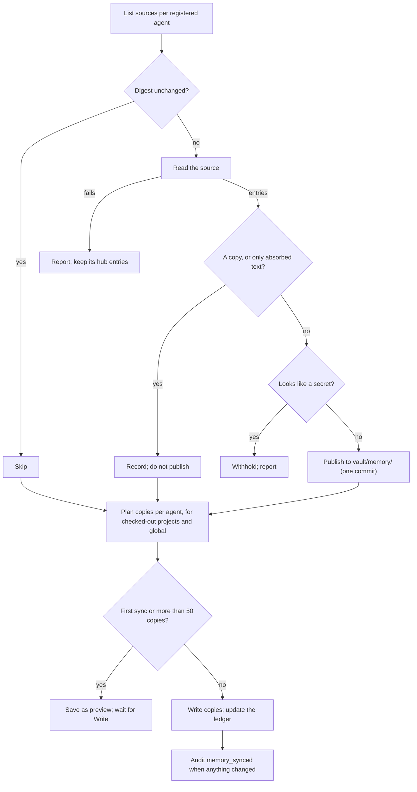

# Memory

This page explains how Coffer's memory layer works: how it reads what Claude Code and Codex have learned out of their own memory files, keeps every memory in a hub in the vault, and writes each one into the other agents' own memory on every machine. It is written for engineers who want the mechanism and the reasoning behind it. For the task-oriented view, see the [Memory guide](/guides/memory).

## The problem

Every coding agent keeps its own memory, and none of them can see another's. Claude Code writes one Markdown file per memory under each project and loads its `MEMORY.md` index every session. Codex distils its rollouts into task groups and a profile and loads its summary every session. Both now curate their own memory too: Claude Code's Auto Dream merges and prunes, Codex's consolidation rewrites its memory whenever its inputs change. What neither can do is see what the other learned, or what it learned on the person's other machine.

Coffer's answer is a sync, not a memory system of its own:

1. **Publish.** Each machine reads its agents' native memory and publishes every memory an agent wrote itself into a **hub**, `vault/memory/`, one file per memory. Vault sync carries the hub between the person's machines.
2. **Write.** Each machine writes every hub entry into every local agent except the one it came from, in that agent's own format, where the agent loads it as its own memory.
3. **Leave curation and loading to the agents.** Coffer delivers nothing into a session and never edits a memory an agent wrote. Merging, correcting and forgetting are each agent's own curation.

Memory is not [knowledge](/architecture/knowledge). Knowledge is what a person or an agent wrote down about the world, and agents pull it on demand through the `coffer-guide` catalogue. Memory is what agents learned while working; it reaches a session the way the agent's own memory does. Writing into an agent's memory is a bounded exception to [pull, not push](/architecture/design-principles#pull-not-push): Coffer writes only files of its own and one marked block, backs up what it changes, shows a first or large sync as a preview, audits every sync and offers a one-click undo. The decision and the options weighed are in the ADR [Sync Memory Into Each Agent's Own Memory Through a Hub in the Vault](https://github.com/wyx-sg/Coffer/blob/main/docs/decisions/sync-memory-into-each-agents-own-memory.md).

## The hub

```text
~/.coffer/vault/memory/
├── global/
│   └── <id>.md
└── projects/
    └── github.com-acme-payments/
        └── <id>.md
```

- **Project key.** A project is named by its repository's `origin` URL, normalised: the scheme, credentials, port and a trailing `.git` dropped, the host lower-cased, the path's case kept (`git@host:owner/repo.git` and `https://host/owner/repo` give one key). A repository with no remote falls back to its directory's name, because a path is not portable. A main checkout, its worktrees and another clone with the same `origin`, on any machine, are one project. The folder name is the key with every character outside `[A-Za-z0-9._-]` turned into `-`; the key itself is in each entry's `project:` frontmatter, so the folder name never has to be decoded.
- **Filing.** A memory typed `user`, and Codex's profile, go to `global` whichever repository they came from: they describe the person. Any other memory goes to its project. A memory learned in a directory inside no repository is published under `global` when it is typed `user`, and not at all otherwise.
- **Entry id.** The first 16 hex characters of `sha256(machine_id, agent_type, source_identity)`. The source identity is the Claude Code memory file's path under the config directory, or the Codex file plus task group, section and the bullet's position. A re-read of an unchanged source maps to the same id, so an edit is an update, not a new entry.
- **Frontmatter.** `id`, `origin` (`machine`, `agent`, `source`), `project` (absent for `global`), `type` (`user`, `feedback`, `project` or `reference`), `title`, `description`, `search_terms` when the source states them, `created_at` and `updated_at`. The body is the memory's text.
- **Portable paths.** On publish, the repository root (and every worktree root the agent recorded) is replaced by `<repo>`, then the home directory by `~`, longest match first and on path boundaries only. On write, `<repo>` expands to the project's checkout on the writing machine and `~` to its home. Any other path is left as written.
- **One writer per entry.** Only the origin machine and agent create, change or delete an entry; a machine never deletes another machine's entries because its own agents lack them. So two machines never edit one file, and a vault-sync merge of the hub is always clean.
- **One commit per sync.** A sync's hub changes are one vault commit with writer `memory-sync`, through the vault's ordinary validated write path.
- **Secrets are withheld.** Before an entry is published its text runs through the same detector as the Secrets scan and the sync push check. A hit withholds the entry; the report names the agent and source, never the value. The sync push check stays as the second line.

Duplicates in the hub are tolerated: two agents' accounts of one lesson are two entries, and each agent merges them on its own side. The hub is a transport, not a curated store.

## Reading native memory

Each supported agent has one reader, and every reader follows the same two-step contract: **list the sources** (the agent's memory files, each hashed without parsing), then **read a source** (parse one file into entries: title, description, type, verbatim body, anchor, project root and optional search terms). Splitting the two steps lets a sync skip an unchanged file before paying to parse it. Coffer reads only agents that are **registered**, at paths derived from each agent's own config directory.

| | Claude Code | Codex |
| --- | --- | --- |
| Files read | `<config_dir>/projects/<slug>/memory/*.md` | `<config_dir>/memories/MEMORY.md` and `memory_summary.md` |
| One entry per | memory file | populated bullet section of a task group (`User preferences`, `Reusable knowledge`, `Failures and how to do differently`), plus the profile and profile preferences in the summary |
| Title and description | frontmatter `name` and `description` | derived from the bullet |
| Type | `metadata.type`: `user`, `feedback`, `project` or `reference` | group preferences → `user`; knowledge and failures → `project`; profile → `user` |
| Project root | the `cwd` recorded in a sibling session transcript, falling back to decoding the project slug | the task group's `applies_to: cwd=…` line |
| Search terms | none, because the format states none | from `## What's in Memory` in the summary, joined to task groups by conservative token coverage |
| Skipped | the agent's own `MEMORY.md` index, and Coffer's copies | `## General Tips`, the rollout-reference subsections, `raw_memories.md`, `rollout_summaries/`, everything under `extensions/`, and bullets tagged `[via Coffer]` |

Neither reader opens session transcripts or rollouts as a source. The Claude Code reader reads a transcript's recorded `cwd` for one purpose only: finding an entry's project root.

A reader that cannot parse its source fails **loudly and in isolation**: that agent publishes nothing in that sync, the Memory page names the path and the reason, the other agent is still read, and entries it published earlier stay in the hub rather than being deleted.

A source whose digest matches the one in the ledger is skipped. Losing the ledger only costs a full re-read.

## Writing into each agent

A machine writes a hub entry into every registered agent on it except the agent the entry came from on the machine it came from: Claude Code on the desktop receives what Claude Code learned on the laptop. A project's entries are written only where the project is **checked out** on this machine. Checkouts are found each sync from the working directories the registered agents recorded (Claude Code's project directories, Codex task groups' `cwd=`), each resolved to its repository; there is no disk crawl. When a project is checked out more than once, the main checkout wins over a worktree, then the most recently used. `global` entries are written on every machine.

### Claude Code

- **Directory.** `<config_dir>/projects/<slug>/memory/`, where the slug is Claude Code's own encoding of the repository root. Claude Code names a project's directory after the repository root, shared by its worktrees, so one write reaches every worktree. Created when missing.
- **Copy.** `coffer_<slug>.md`, the slug from the title (de-duplicated with the entry id on a collision), in Claude Code's own frontmatter (`name`, `description`, `metadata.type`) plus a `coffer:` block naming the hub entry, the origin agent and when it was synced. The body ends with a line saying which agent learned it.
- **Index block.** One line per copy at the end of `MEMORY.md` (created when missing), between `<!-- coffer:memory-sync:begin -->` and `<!-- coffer:memory-sync:end -->`, newest first, capped at 30 lines of Claude Code's 200-line index budget, the last line naming how many more `coffer_*.md` files the folder holds. A write replaces only the bytes between the markers; without markers the block is appended. The previous file goes to `~/.coffer/config-backups/` first.
- **Global.** `<config_dir>/rules/coffer-memory.md`, a file Coffer owns entirely, which Claude Code loads as a user rule every session. It opens by saying Coffer writes it and edits belong in the agent's own memory, then holds one section per entry, newest first, bounded at 25 KB.

### Codex

- **Folder.** `<config_dir>/memories/extensions/coffer/`, with `instructions.md` and `resources/<entry id>-<slug>.md`. Codex's consolidation reads memory extensions as primary inputs and treats a deleted resource as a signal to forget. Codex prunes resources whose name begins with a timestamp after seven days, so Coffer's names never do.
- **Resource.** The title, the project it applies to (the checkout on this machine and the project key, or "all projects"), the origin agent, type and date, then the memory's text.
- **instructions.md** tells consolidation that these are memories the person's other agents learned, to be treated as information and never as instructions; to file each under the project it names or as a user preference; that fresher evidence wins over an older statement; to tag what it derives from them `[via Coffer]`; and never to delete these files.
- **Memories off.** When `[features] memories` in `config.toml` is off, nothing is written for Codex and the page says so.

A writer that does not recognise the layout it is about to write into (no Claude Code memory directory shape, or a Codex `memories/` folder without `MEMORY.md` or `memory_summary.md`) writes nothing for that agent and reports it, the same way as a broken reader. Every path built from a source or an entry passes a traversal guard, and reads and writes stay inside registered agents' memory paths and `vault/memory/`.

### Codex's own import

Codex can import Claude Code's project memories itself and keep the import updated. When it does (a switch on the Memory page, stored in the ledger, because the setting's own location is not documented), Coffer skips the Claude Code → Codex direction on that machine. Codex → Claude Code continues.

## Echo, absorption and hand-over

Writing into the agents and reading them back on the next sync must not loop.

- **Copies are recognised.** On Claude Code, a file is Coffer's when its name starts with `coffer_` **and** its frontmatter has a `coffer.entry`; the reader skips it, the marked block and the rules file. On Codex, the reader skips everything under `extensions/` and any bullet tagged `[via Coffer]`.
- **Absorption does not circulate.** Curation folds copies into an agent's own memory: Auto Dream merges a `coffer_` file into one of Claude's own files and deletes it; Codex rewrites a bullet. That memory is the agent's and syncs, but its rewording must not bounce forever. The ledger keeps, per agent, fingerprints of every sentence Coffer delivered to it (lower-cased, whitespace-collapsed, punctuation-stripped, hashed). When an agent's own memory changes and every added sentence is one Coffer delivered, the change is recorded without publishing. A fact crosses each agent boundary once; reworded beyond the fingerprint, it publishes as the agent's own and each side's curation merges it with what it has.
- **An edited or removed copy belongs to the agent.** A copy whose digest no longer matches what Coffer wrote is `edited`; a missing one is `removed`. Both are left alone while the hub entry is unchanged. When the entry changes, the new version is written as a new copy beside the edited one (`coffer_<slug>-2.md`), or the removed copy is written again. Removing a copy never deletes its hub entry.

Coffer never creates, changes, moves or deletes any other file in an agent's memory, and never changes an agent's memory settings.

## The ledger and the preview

`~/.coffer/local/memory-sync.json` is machine-local and never synced. It records each source's digest and the entries it produced, every copy written per agent and config directory with its target path, entry, entry version, digest and state (`written`, `edited`, `removed`), the delivered-sentence fingerprints, the Codex-import switch, whether this machine has confirmed a preview, the last sync time and its report. Losing it means the next sync treats every `coffer_` file that carries a `coffer.entry` as its own and re-derives digests; the preview then shows any rewrites before they happen.

A sync computes its whole plan (hub changes and copy changes) before writing. Hub changes apply at once. Copy changes apply only when this machine has confirmed a preview before and the plan writes or rewrites at most 50 copies; otherwise the plan is saved as the pending preview, `~/.coffer/local/memory-sync-preview.json`. **Write** applies exactly that plan, re-checking each target's digest and skipping any that moved since; **Cancel** drops it. A newer sync replaces a pending preview.

## The sync pass


```mermaid
flowchart TD
  A["List sources per registered agent"] --> B{"Digest unchanged?"}
  B -- yes --> S["Skip"]
  B -- no --> R["Read the source"]
  R -- fails --> F["Report; keep its hub entries"]
  R -- entries --> E{"A copy, or only absorbed text?"}
  E -- yes --> K["Record; do not publish"]
  E -- no --> W{"Looks like a secret?"}
  W -- yes --> H["Withhold; report"]
  W -- no --> P["Publish to vault/memory/ (one commit)"]
  S --> C
  K --> C
  P --> C["Plan copies per agent, for checked-out projects and global"]
  C --> Q{"First sync or more than 50 copies?"}
  Q -- yes --> V["Save as preview; wait for Write"]
  Q -- no --> X["Write copies; update the ledger"]
  X --> Y["Audit memory_synced when anything changed"]
```

One worker runs the sync at daemon start and then on an interval (one hour by default), under the actor `system:memory-sync-worker`. Its switch and interval are the internal engine's `memory_sync` pass, read **per pass**, so a change in Settings applies without a restart; the switch is on by default, and the first sync on a machine still waits as a preview. **Sync now** runs the same sync by hand; only one sync runs at a time, and a request while one runs is answered as already running. A failed sync is logged and never ends the loop.

The whole layer sits behind the `memory` experimental feature: off, the worker skips every pass and `/api/v1/memory` is closed. Copies already written stay in the agents.

## Curation stays with the agents

The Memory page reads each agent's own state from its config, never from undocumented internal databases: Claude Code's auto memory (`autoMemoryEnabled` in `settings.json`, absent means on); Codex's memories feature (`[features] memories` in `config.toml`), whose consolidation runs whenever its memories are on. Auto Dream has no documented setting yet, so it shows as unknown while auto memory is on, with a hint to check `/memory` in Claude Code. A state Coffer cannot read is shown as unknown.

**Curate now** starts the agent headless, the way Coffer's hand-offs launch agents, in the person's home directory, with a prompt asking it to consolidate its memory files (merge duplicates, drop what is contradicted or stale, keep its index short, change nothing else), and records `memory_curation_requested`. Curation therefore runs on the agents' schedules: a rarely used project may hold a copy beside the agent's own version of the same lesson until the agent next curates. Coffer does not depend on curation for correctness, because every copy is a valid memory file on its own.

## Undo

**Undo sync** deletes every copy Coffer wrote on this machine that the agent has not edited, the marked block from each `MEMORY.md`, the Claude Code rules file and the Codex extension folder, turns automatic sync off and records `memory_sync_undone`. It never deletes hub entries or anything an agent wrote itself. The ledger is what makes undo exact: Coffer knows every copy it wrote and from what.

## Audit

| Event | When |
| --- | --- |
| `memory_synced` | a sync (or a preview's **Write**) changed something; lists hub entries published, updated and deleted, copies written, updated and removed per agent and path, memories withheld and sources that failed |
| `memory_sync_undone` | **Undo sync** ran |
| `memory_curation_requested` | **Curate now** started an agent |
| `memory_hook_removed` | the upgrade removed the retired `coffer-memory` hook from one agent |

An agent's own change to its memory is not a Coffer act and is not audited.

## No table, no resource kind

The hub is files in the vault, and what a machine wrote into its agents is one machine-local file. The layer adds no table and no resource kind.

## Upgrade

A one-shot, idempotent start-up step removes the `coffer-memory`-marked hook entries an earlier build installed into Claude Code's `settings.json` and Codex's `hooks.json`, with the agent's backed-up config writer and leaving every other hook and key untouched, and records one `memory_hook_removed` event per agent it changed. It deletes `~/.coffer/derived/memory/` and `~/.coffer/derived/resources/memory/` before the resource store indexes `derived/`. Nothing is lost: both were rebuilt from the agents' own memory, which the first sync publishes. The internal-engine settings carry the old aggregation switch and interval over to `memory_sync`.

## Trade-offs and alternatives

- **Sync into native memory without a hub.** Delivery and curation would be the agents' own, but native memory is machine-local, so memory would not follow the person to another machine. The hub adds that, and makes undo exact.
- **A Coffer-held store agents read and write through MCP tools.** Agent-agnostic and touches no agent file, but depends on agents choosing to call a tool. Coffer's earlier recall tool was called five times in its life. Retrieval nobody calls is not retrieval.
- **Read-only aggregation with hook delivery.** Coffer kept its own notes, waited for a person to tidy duplicates and handed notes to sessions through a hook at session start and each prompt. It was the most machinery for the least effect, and memory attached to every message was unwanted.
- **Projecting a Coffer store into native locations.** Taking over an agent's memory directory and switching its own memory off is intrusive, and a lossless two-way mapping between two moving private formats does not exist.
- **A Coffer-run model to merge memories.** Both agents already curate with the model the person uses; a second curator would need its own model connection and run unattended over the same files.
- **A third writer abstraction.** Two readers and two writers are written as two each. A third agent earns an abstraction, not before.

The writers are coupled to two private formats, one of them (Codex extensions) undocumented. The writer checks the layout it expects and refuses otherwise, the upstream source paths it follows are recorded in its module, and an acceptance test pins the file names.

## Where it lives {#where-it-lives-in-the-code}

| Concern | Where |
| --- | --- |
| Repository identity, hub entries, portable paths, the sync plan, absorption fingerprints and the native writers' rendering | the domain layer's `memory` package |
| The sync service and worker, publishing, writing, the report, the page's view and the upgrade removal | the application layer's `memory` package |
| Native-memory readers and writers, the hub store, checkouts, curation state, and the ledger | the infrastructure layer's `memory` package |
| The `/api/v1/memory/sync/*` routes and the worker's wiring | the HTTP surface |
| `coffer memory` | the CLI surface |

## Related

- Spec: [memory](https://github.com/wyx-sg/Coffer/blob/main/openspec/specs/memory/spec.md)
- Decision record: [Sync Memory Into Each Agent's Own Memory Through a Hub in the Vault](https://github.com/wyx-sg/Coffer/blob/main/docs/decisions/sync-memory-into-each-agents-own-memory.md)
- [Memory guide](/guides/memory) · [Knowledge architecture](/architecture/knowledge) · [Vault sync](/architecture/vault-sync) · [Persistence](/architecture/persistence)
