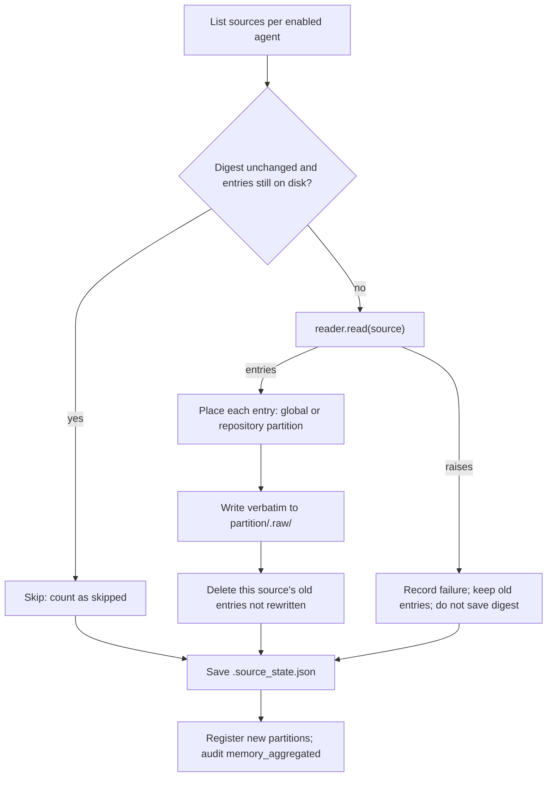
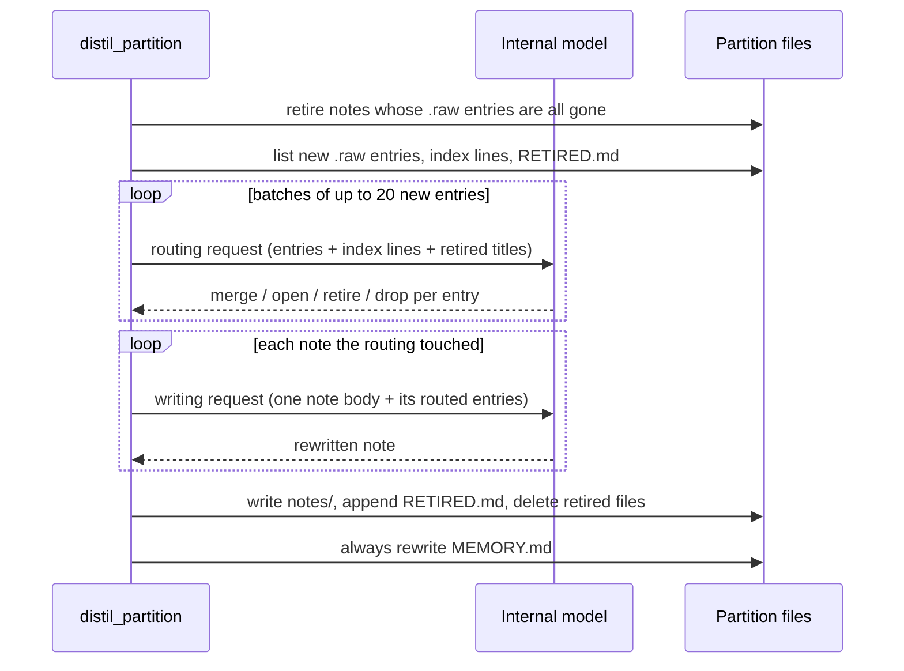
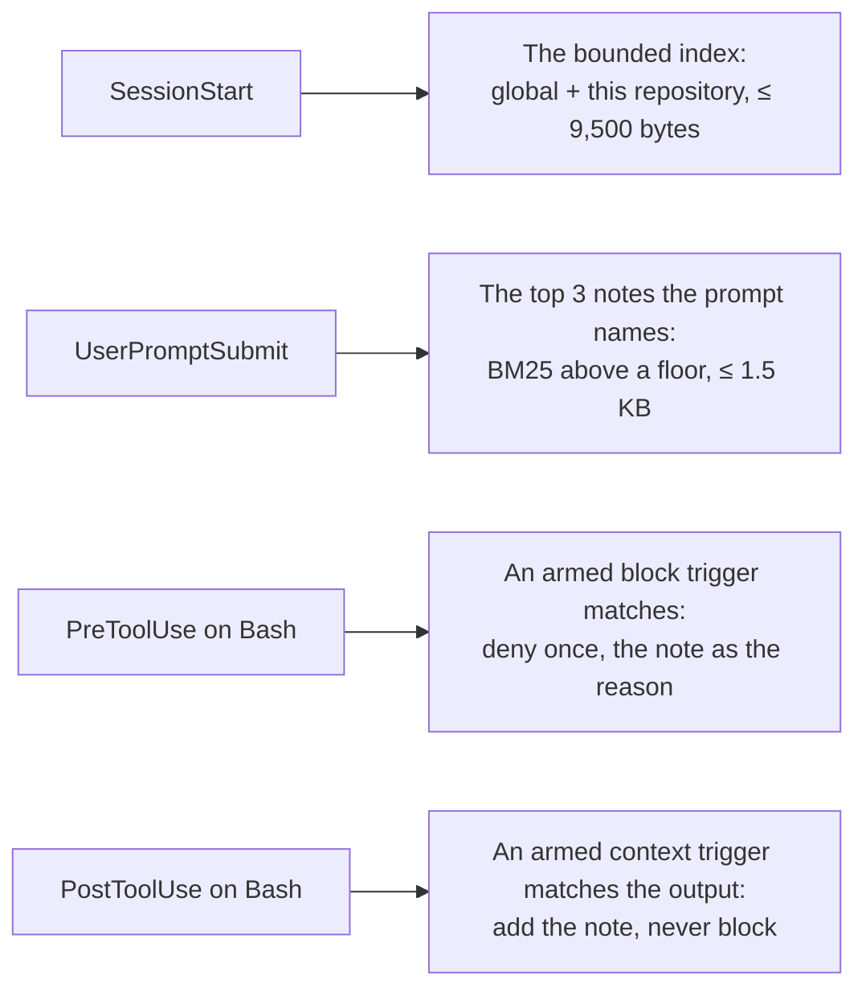
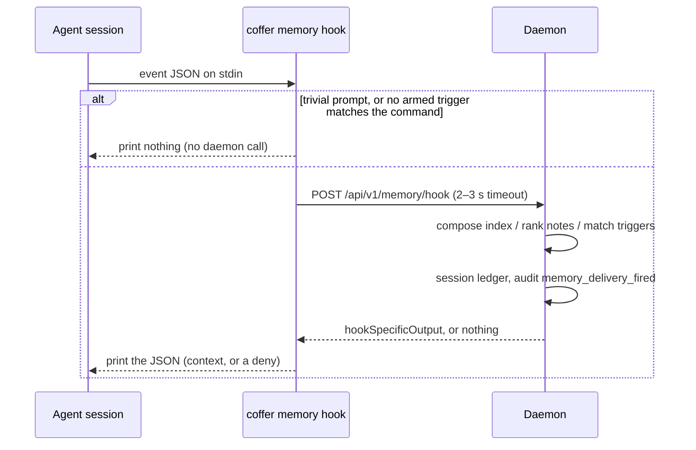

# Memory

This page explains how Coffer's memory layer works: how it reads what Claude Code and Codex have learned out of their own memory files, distils that into notes of its own, and hands the result back to every agent. It is written for engineers who want the mechanism and the reasoning behind it. For the task-oriented view, see the [Memory guide](/guides/memory).

::: info Experimental
Memory is an [experimental feature](/guides/experimental-features) (key `memory`). On a stable build it is off until you switch it on. While it is off, the workers skip their rounds, the gateway stops naming the memory root, and the delivery hooks are withdrawn from every agent.
:::

## The problem

Every coding agent keeps its own memory, and none of them can see another's. Claude Code writes one Markdown file per fact under each project. Codex distils its rollouts into task groups and a profile. Both do this well, but the knowledge stays in each agent's own directory, so you end up teaching Codex what Claude Code already knows.

Coffer's answer has three parts:

1. **Read** each agent's native memory, and never write to it.
2. **Distil** what it read into notes of its own: one topic per file, filed by repository, plus one `global` partition for what is about you.
3. **Deliver** those notes back to every agent at three moments: the index at session start, the few notes a prompt names as it is sent, and, before a command a person has marked as a known trap, the note that says why. Every delivery names the absolute path of the note, and the agent reads a body the same way it reads its own memory: as a file.

What Claude Code learns in the morning, Codex has in its index when it opens the same repository in the afternoon. Coffer does not write into Codex's memory to make that happen. It hands Codex the index line.

Memory is not [knowledge](/architecture/knowledge). Knowledge is what a person or an agent wrote down about the world, and agents pull it on demand through the `coffer-guide` catalogue. Memory is what agents learned while working, and the whole tree can be rebuilt from the agents' own copies. Memory is handed to a session, through hooks you install per agent, so it is an explicit exception to Coffer's [pull, not push](/architecture/design-principles#pull-not-push) rule rather than a silent one. That exception used to be the index at session start alone. The ADR [Memory Reaches a Session at Three Moments](https://github.com/wyx-sg/Coffer/blob/main/docs/decisions/memory-reaches-a-session-at-prompt-time-and-before-a-known-trap.md), still **Proposed**, widens it to each prompt and to a known trap, and proposes revising the principle for memory; the principles pages still state it as it stood, pending that amendment. Knowledge stays pull.

## Design decisions

### Aggregate, never write back

Coffer reads native memory and never creates, modifies, moves, deletes or reformats a file in it. It also never disables or reconfigures an agent's native memory. There are two reasons for this:

- **No agent's own loop is disturbed.** Each agent keeps managing its memory exactly as its vendor designed. Coffer never holds a second copy that could drift from the first, so nothing has to be reconciled.
- **The whole store becomes disposable.** Everything under `~/.coffer/memory/` is derived. You can delete it, and the next aggregation and distil passes rebuild an *equivalent* set of notes: the same subjects from the same sources, possibly in different words. That is what makes it safe for the distil pass to rewrite notes aggressively.

The one file Coffer does write into an agent's configuration is its hook entries in the agent's *settings*. That file is not memory, and Coffer writes the entries only when you connect the agent to Coffer (see [Delivery](#delivery)).

### Four directories with one writer each

A partition is a top-level directory under `~/.coffer/memory/`:

```
~/.coffer/memory/
├── .source_state.json        ← last-seen digest per native source file
├── global/
│   ├── MEMORY.md             ← the index: what a session is given
│   ├── notes/                ← Coffer's own notes, one topic per file
│   ├── RETIRED.md            ← what was retired, and why
│   └── .raw/                 ← what was read out of the agents, verbatim
└── coffer/
    └── …
```

| Path | Written by | Role |
| --- | --- | --- |
| `.raw/` | aggregation only | Faithful. Each agent's own words, one file per entry, stamped with the agent, the native path and the read time. It is the distil pass's input only: the web UI's tree and the partition file routes do not list or read it. |
| `notes/` | distil only | Useful. Coffer's own prose, one topic per file, with provenance naming every raw entry behind it. |
| `MEMORY.md` | distil only | Findable. One line per note, grouped by type, newest first. |
| `RETIRED.md` | distil only | Makes a retirement stick. The next distil pass reads it as an exclusion list. |

Because each directory has exactly one writer, you can re-run a bad distillation without reading the agents again: `.raw/` still holds everything they said. The rule is checkable in the code. `infrastructure/memory/raw_store.py` holds the only write path into `.raw/`, and the distil pass does not import it for writing.

`$COFFER_MEMORY_ROOT` overrides the root. The test suite sets it so that a test can never rewrite a developer's real memory tree.

### A partition is a repository

A partition is identified by a **repository**, not by a path. The main checkout, its worktrees and a second clone all file into one partition. `domain/memory/repository.py` derives the identity key:

- When the repository has a remote, the key is the normalised remote URL. The normaliser drops the scheme, the user, the port, a trailing `.git` and a trailing slash, and lowercases the host. It keeps the case of the path, because `owner/Repo` and `owner/repo` are different repositories on most forges. So `git@host:owner/repo.git` and `https://host/owner/repo` produce the same key.
- A repository with no remote falls back to its own root path. A prefix on the key keeps a path from ever colliding with a URL.

A partition gets a readable slug, never an opaque id. The slug comes from the repository's name. If two repositories share a name, Coffer prefixes parent path segments until the slug is unique, so two checkouts named `api` become `work-api` and `personal-api`. The partition's `resources` row records `repository_key` and `repository_path` in its config, and `MEMORY.md` restates the repository path in its header so that anyone browsing the folder knows which project it belongs to.

Three routes lead to `global`:

- An entry whose type is `user` goes to `global` whichever repository it was learned in. It describes the person, not a project. A `feedback` entry has no route of its own: learned in a repository, it files into that repository's partition, because a standing instruction given there ("run the gates before pushing here") binds that repository, and filing it globally would hand it to every other project's sessions.
- An entry with no working directory, or whose working directory is your home directory, goes to `global`.
- An entry learned in a directory that is inside no repository goes to `global`'s `.raw/`. No partition is created for that directory. The distil pass then judges the entry on its merits and either keeps it in `global` or keeps nothing.

Only aggregation creates partitions. The `memory` kind sets `generic_create_allowed=False`, and `MemoryService` registers a new row through the lifecycle opt-in. Composing a context never creates one. A partition whose recorded repository no longer exists on disk is reported as `unresolvable` in the partition list, and you can still delete it. Aggregation itself never deletes a partition.

### No per-agent reach and no switch

Most resource kinds carry a per-agent **reach** (see [Resource framework](/architecture/resource-framework)). Memory does not: its kind leaves `supports_scope` at `False`, and it declares `toggleable=False`, so a partition has no enabled switch either and the generic enable/disable route refuses one with `RESOURCE_NOT_TOGGLEABLE`. **Every** partition is delivered to **every** agent. The `memory` experimental feature switches the whole layer, and the notes themselves are files under the memory root either way.

This is deliberate. A per-agent default is the natural thing to reach for, namely "scope a partition to the agents it was aggregated from". But that default is exactly the opposite of what this layer is for. A partition filled only from Claude Code would be withheld from Codex working in the same repository, and Codex is the agent that has not learned it yet. Reach would not be a real boundary anyway. A note is a plain file that any local process can open, so no switch on a partition could decide more than what Coffer *serves*; a disabled partition was still a file any agent could read.

### Nothing converges

The memory tree is derived from the agents installed on *this* machine, so it never reaches the [vault-sync](/architecture/vault-sync) remote. The `memory` kind is the only kind that sets `converges=False`. The exporter withholds its rows, and the applier refuses a memory document that arrives. Neither the files nor the resource row leave the machine. Each machine aggregates its own agents.

### No table of its own

Notes, raw entries, the index, the retirement record and the per-source digests are all files. Partition metadata lives in the kind-agnostic `resources` table. The layer adds no table.

## Reading native memory

Each supported agent has one reader, implementing the `MemoryReader` protocol in `domain/memory/reader.py`. The protocol has two steps:

- `sources(config_dir)` lists the agent's memory files and hashes each one, without parsing it.
- `read(source)` parses one file into `RawEntry` values: title, description, type, verbatim body, anchor, project root, and optional search terms.

Splitting the two steps is what lets aggregation skip an unchanged file before paying to parse it. Coffer reads only agents that are **registered and enabled**, at paths derived from each agent's own `config_dir`.

| | Claude Code (`readers/claude_code.py`) | Codex (`readers/codex.py`) |
| --- | --- | --- |
| Files read | `<config_dir>/projects/<slug>/memory/*.md` | `<config_dir>/memories/MEMORY.md` and `memory_summary.md` |
| One entry per | fact file | populated bullet section of a task group (`User preferences`, `Reusable knowledge`, `Failures and how to do differently`), plus the profile and profile preferences in the summary |
| Title and description | frontmatter `name` and `description` | derived from the bullet; the distil pass rewrites it anyway |
| Type | `metadata.type` mapped to `feedback` / `project` / `user`; `reference` is skipped as knowledge rather than memory | group preferences → `user`; knowledge and failures → `project`; profile → `user` with an empty project root |
| Project root | the `cwd` recorded in a sibling session transcript, falling back to decoding the project slug | the task group's `applies_to: cwd=…` line |
| Search terms | none, because the format states none | from `## What's in Memory` in the summary, joined to task groups by conservative token coverage |
| Ignored | the agent's own `MEMORY.md` index | `## General Tips`, the rollout-reference subsections, `raw_memories.md`, `rollout_summaries/` |

Neither reader opens session transcripts or rollouts as a source. Both agents already distil their own sessions, and Coffer starts from that output. The Claude Code reader reads a transcript's recorded `cwd` for one purpose only: finding an entry's project root.

Codex's search-term join is deliberately conservative. Codex rewords a group's title in its summary, so an exact title match finds almost nothing. The reader matches on token coverage instead, and attaches terms only when exactly one group clears the bar *and* exactly one summary topic claims that group. A wrong attribution is worse than none.

A reader that cannot parse a file raises `UnreadableMemory` with the file's path. Aggregation isolates that failure to the one file. The pass reports the failure with the agent, the path and the reason, the other sources still aggregate, and nothing the broken source produced earlier is pruned. Aggregation also isolates unexpected exceptions from a reader the same way.

## The aggregation pass

`application/memory/aggregate.py` holds the pass as a pure function over plain values and the derived tree. `MemoryService.aggregate` wraps it with the database parts: it lists the enabled agents and the existing partition rows, registers the new partitions, and records one `memory_aggregated` audit event.


```mermaid
flowchart TD
  A["List sources per enabled agent"] --> B{"Digest unchanged and entries still on disk?"}
  B -- yes --> S["Skip: count as skipped"]
  B -- no --> R["reader.read(source)"]
  R -- raises --> F["Record failure; keep old entries; do not save digest"]
  R -- entries --> P["Place each entry: global or repository partition"]
  P --> W["Write verbatim to partition/.raw/"]
  W --> D["Delete this source's old entries not rewritten"]
  S --> X["Save .source_state.json"]
  D --> X
  F --> X
  X --> Y["Register new partitions; audit memory_aggregated"]
```

### Skipping unchanged sources

`.source_state.json` holds a `{native_path: sha256}` map under `digests`, with a `version` beside it, at the memory root, written atomically after every pass. A source is skipped only when **both** of these hold:

1. Its digest matches the recorded one.
2. The raw entries it produced are still on disk.

The second condition is what makes the tree truly derived. If you delete a partition's directories and leave the digest file behind, the next pass sees the entries are missing, re-reads the sources, and rebuilds everything. A digest match alone never suppresses a rebuild. The price of this rule is small: a source that legitimately yields no entries is re-parsed on every pass.

If the digest file is lost or corrupt, the next pass re-parses everything. Correctness is not affected.

The `version` is the version of the filing rules (`STATE_VERSION` in `infrastructure/memory/source_state.py`). A digest says a source is unchanged, not that the rule that placed its entries is, so a build that changes where an entry belongs bumps the version. A file written under another version reads as empty: the next pass re-reads every source once, files its entries under the current rules, and removes the ones it wrote elsewhere before.

### Stable raw entries

A raw entry's file name is an origin key: the first 16 hex characters of a SHA-256 over `(agent, native_path, anchor)`. The anchor is the entry's position inside its source, such as the fact file's `name`, or a content hash for a Codex bullet. A second read of an unchanged source therefore overwrites the same files rather than adding near-duplicates. When the agent deletes a bullet from its own memory, the re-read no longer produces that entry, and the pass deletes the stale file from `.raw/`.

Aggregation never compares two agents' entries. Two agents describing one lesson rarely share any phrasing, so a literal comparison would merge nothing. Merging by meaning is the distil pass's job.

## The distil pass

The distil pass turns a partition's new raw entries into notes and rewrites `MEMORY.md`. It runs on its own interval as an upkeep pass of the internal engine, not after each aggregation, and sweeps every partition that holds raw entries it has not yet distilled; a partition with nothing new costs no model call. The pass runs on the [internal engine](/guides/providers) connection when one is configured. It is incremental: no single model request ever carries all of a partition's note bodies.

Before anything is routed, the pass retires every note none of whose `origins` is still under `.raw/` (see [Notes whose sources are gone](#notes-whose-sources-are-gone)). An entry counts as new when its id appears neither in any note's provenance (`origins`) nor in any `RETIRED.md` record.


```mermaid
sequenceDiagram
  participant P as distil_partition
  participant M as Internal model
  participant FS as Partition files
  P->>FS: retire notes whose .raw entries are all gone
  P->>FS: list new .raw entries, index lines, RETIRED.md
  loop batches of up to 20 new entries
    P->>M: routing request (entries + index lines + retired titles)
    M-->>P: merge / open / retire / drop per entry
  end
  loop each note the routing touched
    P->>M: writing request (one note body + its routed entries)
    M-->>P: rewritten note
  end
  P->>FS: write notes/, append RETIRED.md, delete retired files
  P->>FS: always rewrite MEMORY.md
```

### Two stages

1. **Routing.** One request per batch of up to 20 new entries, each entry's text capped at 2,000 characters. The request carries the batch, the partition's **index lines**, and the titles in `RETIRED.md`, but no note body. For each entry the model answers with one of four actions:
   - **merge** into a named existing note,
   - **open** a new note (optionally joined by another entry in the same batch, which is how two agents' first accounts of one lesson become one note),
   - **retire** a note the entry contradicts,
   - **drop**: keep nothing.
2. **Writing.** One request per note that the routing touched. It carries that note's current body and the entries routed to it, and returns the rewritten note.

So a partition of 100 notes that gained three entries costs one routing request over 100 index lines and at most three small writing requests.

### Retirements stick

A retirement deletes the note's file from `notes/` and appends a record to `RETIRED.md`: the title, the reason, the replacing note if there is one, and the raw entry ids the record excludes. A drop is recorded the same way. This is the one mechanism that makes a deletion hold. The material behind a retired note still lives in the agent's own memory, outside Coffer's control, so the next aggregation reads it again. Without the record, the next distil pass would re-open the note.

### Notes whose sources are gone

Aggregation deletes a raw entry when its source stops producing it: the agent removed the fact from its own memory, or placement now files the entry into a different partition (a `feedback` entry that carries a project root, for example, moves from `global` to that project). A note built only from such entries has nothing left under it, so every distil pass, including the mechanical one, retires it first: the file leaves `notes/` and `RETIRED.md` gains a record with the reason and `sources_gone: true`. A note with at least one surviving origin is left alone.

This record is not an exclusion. It names no entry ids, and its title is not sent to routing among the retired subjects, because nobody judged the note untrue. If the material comes back, it is distilled like any new entry.

### Degrading safely

- **No internal connection.** `_distil_mechanically` is a synchronous function that has no completion port to call a model with. Each new entry becomes a note of its own, carrying the source's title, description, text, type and search terms, and the index is written from their frontmatter. The result is thinner, but it still works.
- **Malformed model output.** An unknown slug, a non-JSON answer, or an action naming an entry outside the batch is logged and skipped. The affected entries stay in `.raw/` for the next pass. The pass never raises for bad output.
- **`MEMORY.md` is written on every path**, including when nothing changed and when every model call failed. Session-start delivery comes from the index, so a partition without one would deliver nothing at session start.

Each pass records a `memory_distilled` audit event with the counts `merged`, `opened`, `retired` and `dropped`, and `model_used`.

### One pass per partition

The interval worker and Update memory (`POST /api/v1/memory/sync`, `coffer memory sync`) both claim the partition's **uid** in the shared upkeep-runs registry. Update memory reports a partition whose pass is already running under `skipped` and distils the rest. The worker skips a busy partition and returns to it on its next sweep. The registry lives in memory, one per daemon.

## The index line

`application/memory/index.py` renders one line per note. `MEMORY.md` and delivery both use it, so the two can never disagree:

```md
- **Worktrees for parallel sessions** (`worktree-for-parallel-sessions.md`) — Another session edits the main checkout; work in a git worktree. · look up: worktree, parallel session
```

A line carries the note's conclusion, not a pointer to it, so reading the index is usually the end of the errand. It names the file relatively, because the directory is stated once per surface. It repeats the source's own search terms when the source supplied any. Both surfaces sort by one definition of "newest", `index.recency`: the note's `updated_at`, falling back to `created_at` and then to origin timestamps. It is a fallback chain rather than a `max()`: right after a rebuild, every origin shares one capture time, and a `max()` would collapse the ordering.

## Delivery

Memory reaches a session at **three moments**, through **four hook events**:


```mermaid
flowchart LR
  S["SessionStart"] --> I["The bounded index:<br/>global + this repository, ≤ 9,500 bytes"]
  P["UserPromptSubmit"] --> R["The top 3 notes the prompt names:<br/>BM25 above a floor, ≤ 1.5 KB"]
  B["PreToolUse on Bash"] --> G["An armed block trigger matches:<br/>deny once, the note as the reason"]
  A["PostToolUse on Bash"] --> E["An armed context trigger matches the output:<br/>add the note, never block"]
```

1. **At session start**, the bounded index of `global` and the current repository, naming where the note bodies live.
2. **At each substantive prompt**, the few notes that prompt names, ranked lexically.
3. **Before a known trap**, the note a person tied to a command, delivered as the reason that command is held once. The same trigger mechanism also adds a note *after* a command whose output shows a known error.

The design, the options weighed and the evidence are in the ADR [Memory Reaches a Session at Three Moments](https://github.com/wyx-sg/Coffer/blob/main/docs/decisions/memory-reaches-a-session-at-prompt-time-and-before-a-known-trap.md). Its status is **Proposed**.

### Why three moments

The ADR measured delivery on 107 hand-checked moments from real sessions where an agent needed something a store already held. Two different failures accounted for most misses, in roughly equal parts:

- **Never delivered.** The fact existed, but it never reached the session. The index had been truncated, the session resolved to the wrong partition, or Coffer never reached that agent at all. Only retrieval at the prompt fixed this half.
- **Delivered and not acted on.** The rule was in context, read at session start, and broken anyway twenty turns later. Only matching at the command reached this half, and it was also the only thing that caught a known trap repeated, the largest single category.

In live runs on six traps that had bitten before, the session-start index alone avoided the mistake on the first attempt in 1 of 18 runs. Retrieval and the guard together avoided it in 18 of 18, at about 320 injected tokens a run. Each layer covers what the others cannot: the index covers the first message, retrieval covers the rules a prompt names, and the guard covers the traps that live in a command.

### At session start: the bounded index

`compose_context` in `application/memory/context.py` builds the session-start payload for a working directory:

1. It resolves `cwd` to a partition by the longest recorded `repository_path` that contains it. A worktree therefore resolves to its repository's partition. An unknown directory resolves to `global`.
2. It emits, in order: a `## Coffer memory` header, `global`'s lines under *Known about you:*, the current repository's lines, a line giving the absolute path of the `notes/` directory with the instruction to read a note as a file, and a line naming the memory root to search for a note from another repository.
3. It names no tool. Every consumer is a local process that already reads files.

The payload has two bounds:

- **A token ceiling** of 12,000 estimated tokens (`DEFAULT_CEILING_TOKENS`), sized for a whole index rather than for a handful of lines.
- **A byte ceiling** of 9,500 UTF-8 bytes (`DELIVERY_CEILING_BYTES`) for anything an installed hook prints. Both agents cut a hook's output that is longer, and both cuts lose the lines that matter:
  - **Claude Code** keeps a hook's output inline up to about 10,000 characters. Past that, it saves the output to a file and shows the model a ~2 KB preview, which holds the newest few `global` lines and nothing about the repository.
  - **Codex** keeps `additionalContext` up to 2,500 tokens, counted as UTF-8 bytes / 4. Past that, it keeps the head and the tail and cuts the middle.

  A text never has more characters than bytes, so one byte figure satisfies both agents. A real vault's index is 30–45 KB, so at session start this ceiling is the one that binds.

When a ceiling binds, the **current repository's lines are spent first** and `global` gets what is left. Within each section the oldest lines drop first, and a notice states how many were dropped and which directory holds them. A trim therefore still leaves every note reachable as a file. With nothing to deliver, the text is empty rather than a bare header.

Composing a context sends nothing anywhere. Note content leaves the machine only through the distil pass's internal connection.

### At each prompt: lexical retrieval

On `UserPromptSubmit`, the daemon ranks the notes of the session's repository partition and of `global` against the prompt, and adds the best few to the session. `domain/memory/retrieval.py` holds the ranker and `application/memory/retrieval.py` the service around it.

- **What is ranked.** Each note's title, description, search terms and body, as one document.
- **How.** Okapi BM25 over word tokens, with CJK text split into overlapping two-character bigrams, so a Chinese prompt finds a Chinese note without a word segmenter. A small stopword list drops words too common to say anything.
- **What is delivered.** The **top three** notes that score at or above a **relevance floor of 4.0**, skipping any note this session was already given, within **1,500 UTF-8 bytes** for the whole delivery including its header. A note that would overflow the budget is skipped, not cut.
- **When nothing is.** A prompt of fewer than three words, or a bare nudge such as `continue`, `ok` or `继续`, retrieves nothing. So does a prompt whose best match is under the floor.

The floor was calibrated on the eval set against a real-size store, where a note shares rare words with the prompt that names it. BM25 weighs each word by how rare it is across the whole store, and scores over a store of only a handful of notes stay low, so such a store rarely clears the floor. That is intended. The floor keeps a prompt that only shares common words with a note from bringing it in, and a store grows past it as the agents learn.

**The index is derived and held in memory.** The daemon builds one ranking index per repository partition together with `global`, and rebuilds it when either partition's `notes/` changes by file name, modification time or size. It is never written to disk, and nothing chunks or embeds a note. The notes stay the only copy; the index is a view of them, like `MEMORY.md`. Embeddings were measured and rejected: three points of recall on the eval set did not pay for a 2.2 GB local model, and the product had already dropped embeddings for literal search.

### Before a known trap: the guard

A **trigger** is a person's mark that one note is a known trap tied to a command. Triggers are authored content, not derived memory, so they live in the vault, one Markdown file each, beside the derived tree rather than inside it. Deleting and rebuilding `~/.coffer/memory/` keeps every trigger.

```md
---
id: frontend-vitest-needs-node-20-3fa1c2
note: coffer/frontend-vitest-needs-node-20
kind: block
command: ^make verify
unless: v20
error: ''
armed_by: cli
armed_at: '2026-09-30T08:12:03+00:00'
proposed_by: ''
created: '2026-09-30T08:12:03+00:00'
---
```

The file is `~/.coffer/vault/memory-triggers/<id>.md`. Its frontmatter names the note as `<partition>/<slug>`, the `kind`, the `command`, `unless` and `error` patterns (Python regular expressions), who proposed it, who armed it and when, and when it was created. An optional body is the reason shown if the note itself is gone. A file that does not parse is skipped and logged, so one bad file never stops the others.

There are two kinds:

- **`block`** holds a command. On `PreToolUse` for the shell, the command's `command` pattern is matched against each shell segment that **executes**: the segments between `&&`, `||`, `;`, `|`, newlines, `(` and `$(`, each with any `VAR=value` prefix stripped and the program reduced to its base name. The pattern is matched **from the start** of each segment's program and arguments — or, when the program is an interpreter running a script (`bash`, `sh`, `zsh`, `python3`, `node`, …), from the script's base name — so it sees only what runs: `e2e` holds `bash scripts/e2e.sh` and passes `cat scripts/e2e.sh`, and `make\s+verify` passes `echo make verify is slow`. The `unless` pattern is matched against the whole command, prefixes included. When it matches, the command already does what the note asks (`PATH=…/v20…/bin:$PATH make verify`), and the trigger stays quiet.
- **`context`** never blocks. On `PostToolUse` for the shell, when the command's output shows the `error` pattern (and the `command` pattern too, if the trigger has one), the note is added to the session as context.

The first command in a session that a `block` trigger matches is **denied once**, through the agent's own deny decision, with the note as the reason and a line saying it is held once. The same trigger never holds another command in that session, so the agent's next attempt passes and a deliberate re-run is never stuck. A `context` trigger also fires at most once per session. A fire that carries no `session_id` holds nothing, because "once per session" needs a session to count in.

A trigger applies only to sessions that can **reach its note**: a `global` note's trigger in every session, a repository note's trigger only in that repository's sessions.

**Only a person arms a trigger.** A trigger a person writes (`coffer memory trigger add`, `POST /api/v1/memory/triggers`) is armed by that person as it is written. The distil pass may **propose** one: while rewriting a note it judges a known trap tied to a specific command, the writing stage may return a command pattern and an `unless` pattern. The proposal is filed unarmed, with `proposed_by: distil` and no `armed_by`, and it does nothing until a person arms it. Proposals are deduplicated on note, kind and patterns. Automatically derived triggers were measured and rejected: broad ones fired about 25 notes per session with less than one relevant, and pruned ones lost the very commands the traps live on. Precision is the whole value of something that can block. **Nothing is seeded**: a fresh vault has no trigger until a person writes one or distil proposes one.

A trigger names its note rather than copying it, so the reason shown is always the note's current substance. When distil rewrites the note, the trigger's message follows.

### How a delivered note is worded

Every note delivered at a prompt, before a command or after one reads as **provenance plus fact**. It names the note's file, and states its title and description as "the user's standing rule is: …" for a `feedback` note, or as "a fact they recorded: …" for anything else:

```text
Coffer memory, a note recorded for this user (/Users/you/.coffer/memory/coffer/notes/frontend-vitest-needs-node-20.md): the user's standing rule is: Frontend vitest needs Node 20 — run make verify under Node 20; 22 and 24 exit 1 with every test green. (Held once by a Coffer memory trigger so you can adjust; run it again if it is still what you intend.)
```

The wording is deliberate. In an earlier round of the eval, a note phrased as an imperative ("delete the branch and the worktree") and delivered just before a command was quoted back to the user as a prompt injection. Stated as the user's standing rule, 0 of 72 runs flagged a note. Delivered text is never an instruction to the agent, and nothing delivered at command time asks for a destructive step.

### One command on four hook entries

Delivery reaches an agent through the agent's own hook mechanism. Coffer's hook is **four entries**, one per event, and every entry runs the same command, calling Coffer's CLI **by absolute path**:

```sh
: coffer-memory; /Users/you/.coffer/bin/coffer memory hook --agent-uid <uid> --cwd "$PWD"
```

| Event | Matcher | Entry timeout | What it can answer |
| --- | --- | --- | --- |
| `SessionStart` | `startup\|resume\|clear\|compact` | 10 s | the bounded index, as `additionalContext` |
| `UserPromptSubmit` | none | 5 s | the retrieved notes, as `additionalContext` |
| `PreToolUse` | `Bash` | 5 s | `permissionDecision: "deny"` with the note as `permissionDecisionReason` |
| `PostToolUse` | `Bash` | 5 s | the note, as `additionalContext` |

Both agents get the same four entries: Claude Code in `settings.json`, Codex in `hooks.json`. Both hand their hook the event as JSON on stdin in the same shape (`hook_event_name`, `session_id`, `cwd`, `prompt`, and for the shell `tool_name: "Bash"`, `tool_input.command` and `tool_response`), and both read the same `hookSpecificOutput` JSON back on every event. So `coffer memory hook` reads the event from stdin, relays it to the daemon's `POST /api/v1/memory/hook`, and prints what comes back. `--cwd "$PWD"` is only the fallback for an event whose input carries no `cwd`. One command for every event means one string to judge for staleness and one hash shape per entry for Codex. `coffer memory context` stays as the command that composes the session-start text alone.

**Why a deny, not a reminder.** A `PreToolUse` hook can also answer with `additionalContext`, which would never interrupt the agent. But Claude Code delivers `PreToolUse` context **after** the command has run, together with its result, so a reminder there can only help the agent recover; it cannot stop the first attempt. Only `permissionDecision: "deny"` does. Codex honours the same deny and shows the model `Command blocked by PreToolUse hook: <reason>`. After a command is the right time for an error's context, which is why the `context` kind sits on `PostToolUse`.

The path is the one the composition root resolves, preferring the stable `~/.coffer/bin/coffer` over the version directory behind it. A bare `coffer` is not enough, because a hook runs under whatever shell the agent starts. Codex runs hooks under `/bin/zsh` without the user's rc files, so `~/.coffer/bin` is not on that shell's `PATH`. Claude Code started from the Dock does not inherit the login shell's `PATH` either.

The leading `: coffer-memory;` is a shell no-op that carries the marker. Coffer finds, replaces and removes its own entries by that marker, and never touches another tool's hooks on the same events. An install or a remove first sweeps Coffer's marked entries off **every** event, so an older build's entry on another event is never left behind. Installing is always an explicit act: the hook is one part of the agent's Coffer connection (`coffer agent connect`, or **Connect to Coffer** on the agent's page; see [Agents](/guides/agents#connect-an-agent-to-coffer)). It is idempotent, and removing the entries deletes empty event arrays and an empty `hooks` key after itself. The agent is named by its immutable uid, because a hook string may sit in a settings file for months while you rename the agent.


```mermaid
sequenceDiagram
  participant A as Agent session
  participant C as coffer memory hook
  participant D as Daemon
  A->>C: event JSON on stdin
  alt trivial prompt, or no armed trigger matches the command
    C-->>A: print nothing (no daemon call)
  else
    C->>D: POST /api/v1/memory/hook (2–3 s timeout)
    D->>D: compose index / rank notes / match triggers
    D->>D: session ledger, audit memory_delivery_fired
    D-->>C: hookSpecificOutput, or nothing
    C-->>A: print the JSON (context, or a deny)
  end
```

### Failing open

Memory never stops a prompt or a command because Coffer is down. The CLI prints nothing and exits 0 when no daemon is running, when the daemon does not answer in time (3 seconds at session start, 2 seconds for a prompt or a command, both under the entry's own timeout), or when it answers with an error or with anything the CLI cannot read.

A fire that cannot deliver anything never contacts the daemon at all. The CLI answers a trivial prompt locally with the same test the daemon uses, and it reads the armed triggers in `vault/memory-triggers/` itself, so a shell command that no armed trigger matches costs a process start and a directory read, not a round-trip. The daemon still decides everything that depends on state: which partition the session is in, whether the note is reachable from it, and whether this session already had it.

### The per-session ledger

Two promises rest on remembering what each session was given: a note retrieved for one prompt is not retrieved again in the same session, and a trigger holds or adds at most once per session. The daemon keeps both in a **per-session ledger in memory**, keyed on the `session_id` the agent hands its hook and bounded to the 2,048 most recent sessions.

It is never keyed on a process id. Every session of one Codex app-server shares a parent pid, which is how an earlier build's Codex hook, guarded on `$PPID`, fired only for the first session of each app-server under Codex Desktop and the IDE hosts.

A daemon restart forgets the ledger. After one, a running session may be given a note it already had, or have a trigger hold one more command. That was chosen over a table: the harm is one repeated line or one extra deny, and the memory layer adds no table.

### Audit and the delivery views

Every **delivering** fire is one `memory_delivery_fired` audit event naming the agent as both the resource and the actor, with details giving its `moment` (`session_start`, `prompt`, `guard` or `error`), the `session_id`, the notes it carried as `<partition>/<slug>` and, for a trigger, the trigger's id. The event never carries a note's text. A session start is recorded on every fire; a prompt, guard or error fire only when it delivered a note. Trigger acts are audited too: `memory_trigger_added`, `memory_trigger_proposed`, `memory_trigger_armed`, `memory_trigger_disarmed` and `memory_trigger_deleted`, each naming the trigger and its note.

Two read-only **delivery views** turn that record into answers. Both are on REST and on the CLI (`coffer memory delivered`):

- **The overview** (`GET /api/v1/memory/deliveries`, `coffer memory delivered`). For every agent with a delivery hook, over the last seven days: how many times memory reached it, the same count by moment, when it last did, and how many **distinct notes** its sessions opened. That last number is read off the file paths the agent's tool calls named: a path under the memory root that names a note counts, and nothing a note, a tool result or a message says is read. A transcript line is parsed only when it mentions the memory root at all, and each transcript's answer is cached by modification time and size. When the agent's transcripts cannot be read, the count is reported as **unavailable**, never as zero. Aggregation still reads no transcript; this is observability over file paths.
- **The Delivered view** of one partition (`GET /api/v1/memory/partitions/{uid}/delivered`, `coffer memory delivered <partition>`). The **exact** session-start text each agent is given in that partition's repository, composed by the same function and under the same ceiling as the hook. Reading it records nothing.

Neither view says whether a hook is installed or trusted. That is a property of the agent's Coffer connection and lives on the agent's page: its connection status, its Hooks tab, `coffer agent show` and `coffer agent hooks`. The hook's own status likewise reports installation only and carries no last-fired time. Whether it *fires* is a stream of events, which you read in the delivery views or on the [Activity](/guides/activity) page.

### Codex's approval

Codex runs a hook only after the user has reviewed it, and records each approval in `config.toml`, one record per entry:

```toml
[hooks.state."/Users/you/.codex/hooks.json:session_start:1:0"]
trusted_hash = "sha256:…"
```

The key is the file, the event, the matcher group's position and the handler's position. The hash covers a normalised form of the entry's definition. An entry with no matching hash is skipped silently: no error, no event. With four entries, the user approves four records in `/hooks`, and every change to Coffer's command needs the approvals again. Until then, Codex skips the entries it has no approval for.

Coffer computes each hash the way Codex does and reads the records. Its hook is trusted only when **every** entry is; otherwise its trust is that of the first entry, in file order, that is not. It never writes a record:

- **It is Codex's review gate.** A tool that installs a hook and then approves that hook itself removes the one point at which the user looks at what will run.
- **A stale copy of the algorithm must fail visibly.** If Coffer wrote hashes and its copy of the algorithm went stale, Coffer would report the hook as approved while Codex skipped it, which is the failure this section exists to prevent. Reading with a stale algorithm fails the visible way instead: Coffer says "needs approval" while Codex actually runs the hook.

The result is Coffer's hook's **trust**: `trusted`, `untrusted`, `modified` (approved for an earlier command), `disabled`, `unknown`, or `not_required` for Claude Code, which runs every hook in its settings. It appears in `coffer agent hooks`, `GET /api/v1/agents/{uid}/hooks`, the agent's Hooks tab, and as an attention item. The remedy is always the same: open Codex, run `/hooks`, and trust each of Coffer's four entries.

### Keeping hooks current

Detection matches the marker and never reads the arguments. A hook whose command went stale, for example because a CLI flag changed, therefore still reads as installed, while failing at every fire. So the hook is a target of the [reconciler](/architecture/reconciler). On every pass (at start, every minute, and soon after any agent changes), it compares each installed hook with what the running build would install: the **set of events** its entries sit on, and each entry's whole command. It rewrites the hooks that differ. That comparison is also the migration: an older build's single `SessionStart` entry running `coffer memory context`, or an even older Codex entry on `UserPromptSubmit`, differs in both events and command, so an ordinary pass rewrites it into the four current entries. One unreadable settings file is reported as blocked without stopping the others.

For Codex, the target also compares trust. A current hook that Codex will not run differs only in trust. That difference is reported as `hook_untrusted` (or `hook_disabled`, or `hook_trust_unknown`) on the attention list, with the remedy, and is never written.

The same target follows the `memory` feature switch. Switching memory off removes the hook from every agent. Switching it back on installs the hook into every agent connected to Coffer — every agent carrying the gateway MCP entry, a list the composition root hands in from the agent kind — and repairs stale commands. An ordinary pass never installs a hook: a connected agent missing it is reported, and reads as partly connected until it is connected again.

### Channel turns

A turn that arrives from Telegram or SeaTalk runs no session-start hook, so the memory payload travels in its system prompt instead. `memory_context_composer` in `surfaces/http/memory_wiring.py` closes over `MemoryService` and the feature switch; `wire_chat` hands it to both agent providers, and `compose_system_context` in `infrastructure/chat/adapter_support.py` calls it only for a channel-driven turn, with the conversation's working directory. It runs the same `compose_context` the hook uses, so a channel turn gets the same index and notes path a terminal session would. The system-prompt append carries the session-start index only; prompt-time retrieval and the guard are not composed into it.

The composer answers nothing, and the turn carries no memory header, while the `memory` feature is off (read per turn), when the composed index is empty, or when the tree cannot be read (logged; memory is an append to the turn, not a precondition of it). A turn from the web Conversations page gets no append: it receives memory through the agent's own hook, so no turn gets it twice.

### Rules about every turn are not memory's job

A rule about **every** reply, such as the language to answer in or a tone, is not something retrieval or a trigger can deliver. No prompt names it and no command trips it. In the eval, "reply in Chinese" failed under every delivery condition. Such a rule belongs in the instructions the agent loads on every turn, `CLAUDE.md` or `AGENTS.md`, which you own. Coffer never writes those files, for the same reason it never writes an agent's native memory: installing or firing the memory hook leaves them byte-identical.

## Finding a note in another partition

The memory layer has no MCP tool. A note is a Markdown file, and every partition's `notes/` sits under one **memory root** (`~/.coffer/memory/`, printed by `coffer path memory`), so one search with the agent's own file tools covers every partition. The delivered payload names that root, and so does the gateway's `initialize` text while the `memory` feature is on. For the current repository the index is already in the session's context; the root is for a note from a partition the session was *not* opened in.

A search over the files never sees a raw entry or a retired note as a note: raw entries live under `.raw/`, and retired notes leave `notes/` for `RETIRED.md`. There is no `remember` tool either. An agent records something the way it always does, and Coffer reads it on the next pass.

## Workers and scheduling

Both passes run as asyncio tasks that the daemon starts from `surfaces/http/memory_wiring.py`:

| Worker | First pass | Default interval | Audit actor |
| --- | --- | --- | --- |
| `AggregateWorker` | immediately on start | 1 hour | `system:memory-aggregate-worker` |
| `DistilWorker` | after 60 s | 6 hours | `system:memory-distil-worker` |

Both are on by default. They read the agents' files and write only the derived tree, so an unattended run carries no risk. Each pass reads its switch and interval from the internal-engine configuration (`aggregate`, `distil`) **per pass**, so a change in Settings applies without a restart. While the `memory` feature is off, both skip their rounds. A failed pass is logged and never ends the loop. On shutdown, a pending pass is dropped, because the next boot sweeps everything again. You can also run both by hand in one action: `coffer memory sync`, `POST /api/v1/memory/sync` or the web UI's **Update memory** button (`application/memory/update.py`) aggregates, then distils every partition left holding undistilled raw entries. A partition whose distil pass is already running is reported as `skipped` rather than failing the call. The answer carries what the aggregation wrote and the `distilled` and `skipped` partitions.

## Trade-offs and alternatives

- **Projecting a Coffer-owned store into each agent's memory.** This would give ambient loading for free, but only by writing, symlinking or disabling another tool's memory. That is intrusive, hard to understand, and fragile against vendor changes. Aggregation leaves each agent's loop untouched and pays for it with a hook.
- **Storing the sources' words verbatim as the product.** This keeps quotes exact, but Codex's untitled bullets would become notes whose title, description and body were the same sentence. Coffer keeps verbatim text in `.raw/`, where provenance points at it, and writes the notes in its own words.
- **A budgeted digest plus a search tool.** Agents do not call a tool to find something they have not been shown: Coffer's earlier recall tool was called five times in its life. Both supported hosts load an index and read a body as a file. Coffer copies that shape, and names the memory root so a note from another partition is one search away.
- **The whole index at session start, untruncated.** In replay it reached the most needs, but 30–45 KB cannot pass through either agent's hook output, and even delivered in full, half the rules in context were ignored. Hence the bounded index plus retrieval and the guard.
- **A reminder at `PreToolUse` instead of a deny.** Claude Code delivers that context after the command has run, so it can only help recovery. It survives as the `context` trigger on `PostToolUse`, where after is the right time.
- **Embeddings for ranking, or triggers derived from the notes' text.** Embeddings gained three points of recall for a 2.2 GB model; derived triggers were either noisy or missed the traps. The ranker stays lexical and triggers stay authored until the eval set shows a replacement earns its cost.
- **Literal de-duplication across agents.** Two agents never phrase a lesson the same way, so a literal comparison merges nothing. Merging is a judgement about meaning, made by the distil model.
- **Keying partitions on working directories.** This splits a repository across its worktrees, orphans partitions when directories disappear, and turns scratch folders into permanent partitions. Keying on the repository avoids all three.
- **A third reader abstraction.** Two readers are written as two readers. A third agent gets an adapter against the existing `MemoryReader` and `DeliveryAdapter` protocols, not a capability matrix.

## Where it lives in the code

| Concern | Path |
| --- | --- |
| Reader protocol, `RawEntry`, `SourceFile` | [`domain/memory/reader.py`](https://github.com/wyx-sg/Coffer/blob/main/backend/coffer/domain/memory/reader.py) |
| Note, origin key, note types | [`domain/memory/note.py`](https://github.com/wyx-sg/Coffer/blob/main/backend/coffer/domain/memory/note.py) |
| Repository identity, partition slugs | [`domain/memory/repository.py`](https://github.com/wyx-sg/Coffer/blob/main/backend/coffer/domain/memory/repository.py), [`domain/memory/partition.py`](https://github.com/wyx-sg/Coffer/blob/main/backend/coffer/domain/memory/partition.py) |
| Hook marker, the four entries, install transform and hook ceiling | [`domain/memory/hook_entries.py`](https://github.com/wyx-sg/Coffer/blob/main/backend/coffer/domain/memory/hook_entries.py), [`domain/memory/delivery.py`](https://github.com/wyx-sg/Coffer/blob/main/backend/coffer/domain/memory/delivery.py) |
| Ranker, trigger matching, delivered wording | [`domain/memory/retrieval.py`](https://github.com/wyx-sg/Coffer/blob/main/backend/coffer/domain/memory/retrieval.py), [`domain/memory/trigger.py`](https://github.com/wyx-sg/Coffer/blob/main/backend/coffer/domain/memory/trigger.py), [`domain/memory/hook_output.py`](https://github.com/wyx-sg/Coffer/blob/main/backend/coffer/domain/memory/hook_output.py) |
| Answering a hook fire, retrieval, triggers, session ledger, delivery views | [`application/memory/hook_service.py`](https://github.com/wyx-sg/Coffer/blob/main/backend/coffer/application/memory/hook_service.py), [`retrieval.py`](https://github.com/wyx-sg/Coffer/blob/main/backend/coffer/application/memory/retrieval.py), [`triggers.py`](https://github.com/wyx-sg/Coffer/blob/main/backend/coffer/application/memory/triggers.py), [`session_ledger.py`](https://github.com/wyx-sg/Coffer/blob/main/backend/coffer/application/memory/session_ledger.py), [`delivery_stats.py`](https://github.com/wyx-sg/Coffer/blob/main/backend/coffer/application/memory/delivery_stats.py) |
| Aggregation pass and worker | [`application/memory/aggregate.py`](https://github.com/wyx-sg/Coffer/blob/main/backend/coffer/application/memory/aggregate.py), [`aggregate_worker.py`](https://github.com/wyx-sg/Coffer/blob/main/backend/coffer/application/memory/aggregate_worker.py) |
| Which partition an entry files into | [`application/memory/placement.py`](https://github.com/wyx-sg/Coffer/blob/main/backend/coffer/application/memory/placement.py) |
| Distil pass (routing, plan, write, apply) and worker | [`application/memory/distil.py`](https://github.com/wyx-sg/Coffer/blob/main/backend/coffer/application/memory/distil.py) and its `distil_*.py` siblings |
| Index rendering | [`application/memory/index.py`](https://github.com/wyx-sg/Coffer/blob/main/backend/coffer/application/memory/index.py) |
| Context composition | [`application/memory/context.py`](https://github.com/wyx-sg/Coffer/blob/main/backend/coffer/application/memory/context.py) |
| Delivery service and the delivery-hook reconcile target | [`application/memory/delivery.py`](https://github.com/wyx-sg/Coffer/blob/main/backend/coffer/application/memory/delivery.py), [`delivery_reconcile.py`](https://github.com/wyx-sg/Coffer/blob/main/backend/coffer/application/memory/delivery_reconcile.py) |
| Kind (`converges=False`, no scope) and service | [`application/memory/kind.py`](https://github.com/wyx-sg/Coffer/blob/main/backend/coffer/application/memory/kind.py), [`service.py`](https://github.com/wyx-sg/Coffer/blob/main/backend/coffer/application/memory/service.py) |
| Native-memory readers | [`infrastructure/memory/readers/`](https://github.com/wyx-sg/Coffer/tree/main/backend/coffer/infrastructure/memory/readers) |
| Hook adapters per agent | [`infrastructure/memory/delivery/`](https://github.com/wyx-sg/Coffer/tree/main/backend/coffer/infrastructure/memory/delivery) |
| Paths, raw store, note store, digest cache, trigger files, notes-read count | [`infrastructure/memory/`](https://github.com/wyx-sg/Coffer/tree/main/backend/coffer/infrastructure/memory) |
| Transcript `cwd` lookup shared with the agent kind | [`infrastructure/agent_files/claude_code_transcripts.py`](https://github.com/wyx-sg/Coffer/blob/main/backend/coffer/infrastructure/agent_files/claude_code_transcripts.py) |
| Wiring, workers, the delivery-hook target, the channel-turn composer | [`surfaces/http/memory_wiring.py`](https://github.com/wyx-sg/Coffer/blob/main/backend/coffer/surfaces/http/memory_wiring.py) |
| REST routes | [`surfaces/http/memory/`](https://github.com/wyx-sg/Coffer/tree/main/backend/coffer/surfaces/http/memory) |
| CLI | [`surfaces/cli/memory_cmd.py`](https://github.com/wyx-sg/Coffer/blob/main/backend/coffer/surfaces/cli/memory_cmd.py), [`memory_hook_cmd.py`](https://github.com/wyx-sg/Coffer/blob/main/backend/coffer/surfaces/cli/memory_hook_cmd.py) (`hook`, `trigger`, `delivered`) |

## Related

- Spec: [memory](https://github.com/wyx-sg/Coffer/blob/main/openspec/specs/memory/spec.md), [internal-engine](https://github.com/wyx-sg/Coffer/blob/main/openspec/specs/internal-engine/spec.md)
- Decision records: [Aggregate the agents' memory; never write it](https://github.com/wyx-sg/Coffer/blob/main/docs/decisions/aggregate-agent-memory-never-write-it.md), [Memory reaches a session at three moments](https://github.com/wyx-sg/Coffer/blob/main/docs/decisions/memory-reaches-a-session-at-prompt-time-and-before-a-known-trap.md) (Proposed)
- [Memory guide](/guides/memory) · [Knowledge architecture](/architecture/knowledge) · [Vault sync](/architecture/vault-sync) · [MCP gateway](/architecture/mcp-gateway) · [Chat and turns](/architecture/chat)
