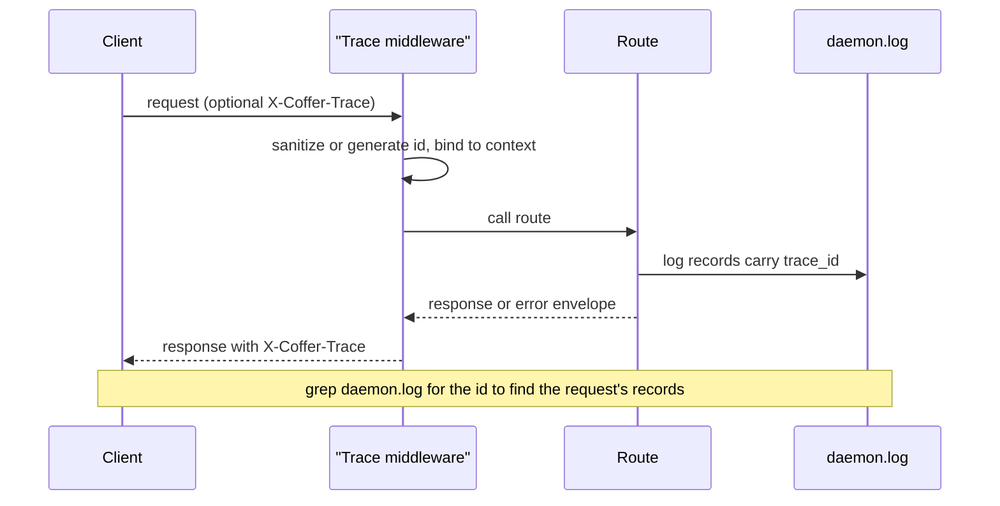
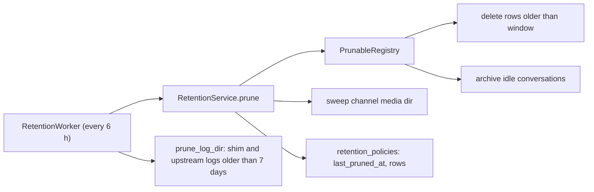
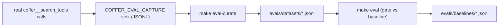

# Observability

This page explains the records Coffer keeps about itself, how they are written, how long they live, and how people and agents read them. It is for contributors changing any of these paths, and for operators who want to know exactly what a log line or an audit row means.

## The problem

Coffer is a background process that other programs talk to. When something goes wrong, the person noticing it is usually looking at an agent's chat window, not at Coffer. That shapes the requirements:

- **The answer has to be reachable from where the failure shows up.** An agent that sees a failed tool call should be able to ask Coffer what happened, without the user hunting for a file.
- **"What changed" and "what happened" are different questions.** A credential that stopped resolving might be a configuration change (someone deleted it) or a runtime fault (the upstream refused it). Both records are needed, and they need to line up on one timeline.
- **Nothing observable may leak a secret.** Coffer holds credentials for every upstream it proxies. Logs, audit rows and invocation rows are written far more often than they are read, and they have to be safe by construction.
- **Records must not grow without bound.** A local tool that fills the disk after a year of use has failed its user.

## Design decisions

| Decision | Reason |
| --- | --- |
| One log file, `daemon.log`, one JSON object per line | Every reader (the Activity page, `coffer__diagnose`, a human with `grep`) parses the same fields. |
| A trace id on every HTTP request, echoed as `X-Coffer-Trace` | A failed response can be tied to the exact log lines it produced. |
| A separate, structured audit log in SQLite | "What changed, and who changed it" needs filtering by resource, kind and event type, and has to survive a rename. |
| An invocation log for proxied MCP calls, with no payloads | Latency and outcome per call are useful; arguments and results can carry secrets and stay out. |
| One retention mechanism for every log-like table and log file | Bounded growth without a separate cleanup job per feature. |
| The main reader is an MCP tool, `coffer__diagnose` | The realistic reader at the moment of failure is an agent that already has Coffer's tools in hand. |
| Eval capture is a separate, opt-in sink | Curating eval cases needs request text, which the shared database deliberately never stores. |

## The daemon log

### One format

Coffer's own modules log through the standard library (`logging.getLogger`). The root logger's handlers use a `structlog.stdlib.ProcessorFormatter`, so every record — Coffer's own, and those of libraries running inside the daemon such as the MCP SDK, asyncio and alembic — leaves as one JSON object with the same fields:

| Field | Source |
| --- | --- |
| `event` | the log message (Coffer uses dotted event names, such as `mcp.upstream.spawn_failed`) |
| `timestamp` | the record's own creation time, UTC ISO-8601 with a trailing `Z` |
| `level` | `debug`, `info`, `warning`, `error` or `critical` |
| `logger` | the module that logged it |
| `trace_id` | the current request's trace id, or `-` outside a request |
| any `extra={...}` keys | whatever the call site passed |
| `exception` | the rendered traceback, kept inside the same line |

A real line looks like this:

```json
{"event": "mcp.upstream.spawn_failed", "logger": "coffer.application.mcp.supervisor", "level": "warning", "timestamp": "2026-09-24T13:50:15.869933Z", "server": "smart", "attempt": 1, "error": "upstream init failed: ConnectError", "trace_id": "44e10b60da1b4f26"}
```

`structlog` is also configured to route through the same handlers, so a future call site that uses `structlog.get_logger()` produces the same shape rather than printing to stdout.

The timestamp comes from the `LogRecord`, not from the clock at format time. That keeps one record at one time even when two handlers format it, and it keeps timestamps lexically sortable, which the readers rely on for their `since` filter.

### One writer per file

`daemon.log` has two writers by design:

1. The daemon's rotating file handler (`RotatingFileHandler`, 10 MB per file, 3 backups: `daemon.log.1` … `daemon.log.3`).
2. The daemon process's own output. The CLI's detect-or-spawn, `coffer daemon start` and the MCP shim open `daemon.log` for append and hand it to the child as stdout and stderr; the desktop app redirects the daemon it spawns into the same file. A daemon that refuses to start (a port already taken, for example) prints why into the file the error message tells you to check.

A stderr handler would therefore write every record twice. The daemon attaches its stderr handler only when stderr is *not* the same file as `daemon.log` (compared by device and inode), which is the foreground case — a terminal or a test — where it is the only way to see output.

The desktop shell writes its own few records (which daemon binary it chose, a failed restart from the tray) into the same `daemon.log`, as one-line JSON in the same shape.

### Other log files

| File | Written by | Rotation and cleanup |
| --- | --- | --- |
| `~/.coffer/logs/daemon.log` (+ `.1`–`.3`) | daemon, detached daemon's stdio, desktop shell | rotated at 10 MB; never deleted by the pruner |
| `~/.coffer/logs/upstream/<server>.log` | stderr of each stdio MCP server, one file per registered server | rolled to `<server>.log.1` at 2 MB when opened; `.log.1` files older than 7 days are pruned |
| `~/.coffer/logs/shim-<pid>-<epoch>.log` | one per `coffer-mcp-shim` process, created only when the shim logs something | pruned after 7 days |
| `~/.coffer/eval-capture.jsonl` | eval capture, only when opted in | never pruned |

Upstream MCP servers get their own files because they are far chattier than Coffer; with their stderr in `daemon.log`, rotation would push Coffer's own records out within weeks. `COFFER_LOG_DIR` moves the whole log directory — daemon, upstream and shim logs alike; see [Configuration](/reference/configuration) and [Files and directories](/reference/filesystem).

### The tolerant reader

Because `daemon.log` is also the stdio of the daemon's children, it is never guaranteed to be pure JSON. `application/log_reader.py` is the one reader both the Activity page and `coffer__diagnose` use. It:

- reads only the last 512 KiB of the file, so a 10 MB log is never pulled into memory;
- strips ANSI colour and cursor sequences;
- parses Coffer's JSON first, then the other shapes actually seen in the file: uvicorn's `ERROR:    …`, `LEVEL - logger - message`, `LEVEL [logger] message`, and rich-formatted `[mm/dd/yy HH:MM:SS] LEVEL …` panels from FastMCP-based upstreams;
- normalises every level spelling (`WARN`, `WARNI`, `CRITI`, `FATAL`, …) onto one vocabulary;
- folds traceback lines and panel borders into the record above them (`continuation`), so one failure is one row;
- keeps any line it cannot parse, verbatim, under `raw` — and treats an unreadable level as passing every level filter, because an unparseable line is most often a traceback.

The HTTP route `GET /api/v1/daemon/logs` exposes this reader with `since`, `level` (a severity floor), `errors_only` and `limit` (1–500, default 100), newest first. It requires the API token; `GET /api/v1/daemon/status` does not, because it doubles as a readiness probe.

## Trace ids

Every HTTP request gets a trace id before anything else runs. `surfaces/http/trace.py` is a raw ASGI middleware (not `BaseHTTPMiddleware`, which buffers and would interfere with the long-lived streams `/mcp` serves) that:

1. takes the client's `X-Coffer-Trace` request header if present, strips it to `[A-Za-z0-9._:-]` and 64 characters, or generates a fresh 16-hex-character id;
2. binds it to a context variable that the log formatter reads for every record the request produces;
3. adds `X-Coffer-Trace` to the response (error responses already carry the same value);
4. clears the context variable when the request ends, so a background task that outlives it does not log a stale id.

Coffer's own CLI and MCP shim send no `X-Coffer-Trace`, so each of their requests gets a fresh id. The header is there for a client that wants several calls to read as one story in the log.

The trace middleware is outermost in the stack — outside the loopback host guard and CORS — so even a request refused with `421 HOST_NOT_LOOPBACK` carries a trace id that matches the log record explaining the refusal. See [Security model](/architecture/security) for the host guard.



Records logged outside a request — background workers, the MCP session reaper — carry `trace_id: "-"`. Work done while serving an `/mcp` request, such as spawning an upstream server, carries that request's id.

## The audit log

The audit log answers "what changed, and who changed it". It lives in the `audit_log` table of `~/.coffer/coffer.db`.

### Shape of a row

| Column | Meaning |
| --- | --- |
| `timestamp` | when the event happened (UTC) |
| `event_type` | one value from the vocabulary below |
| `actor` | who caused it: `cli`, `api`, `ui`, `system`, or another short lowercase identifier |
| `resource_id` | the resource's row id, or empty for an event that names no resource |
| `resource_kind`, `resource_name` | the label the resource carried **at the time** |
| `details` | event-specific fields, already redacted |

Two decisions shape this:

- **Identity and label are stored separately.** A resource's trail is queried by its id, so renaming a resource leaves its history intact, and old rows keep the name that was true when they were written. There is no way to audit an event by label alone; see [Resource framework](/architecture/resource-framework).
- **Redaction happens before storage, per kind.** Each resource kind can supply an `audit_redactor` that strips secret fields from a configuration before it becomes `details`. The MCP server kind uses one to drop the `env` and `headers` maps from its transport, keeping only credential references.

The actor comes from the `X-Coffer-Actor` request header, which must match `^[a-z][a-z0-9_-]{0,31}$`; a missing header means `api`, and anything else is rejected with `400`.

Every audit event is also written to `daemon.log` as an `info` line carrying the event type, resource name, kind, uid and actor — but not `details`, so the redactor stays the only place that decides which fields are secret.

### Event vocabulary

The vocabulary is a closed enumeration, `AuditEventType` in `backend/coffer/domain/audit.py`.

| Area | Events |
| --- | --- |
| Resources | `resource_created`, `resource_updated`, `resource_enabled`, `resource_disabled`, `resource_deleted`, `resource_renamed`, `resource_scope_updated` |
| MCP capabilities | `capability_enabled`, `capability_disabled` |
| Daemon | `token_rotated`, `daemon_residency_updated`, `retention_updated`, `internal_engine_model_set` |
| Credentials | `credential_set`, `credential_read`, `credential_deleted`, `credential_migrated`, `master_key_relocated` |
| Agents | `agent_config_file_written`, `agent_config_file_deleted`, `agent_mcp_installed`, `agent_mcp_uninstalled`, `agent_mcp_entry_removed`, `agent_mcp_entry_adopted`, `agent_plugin_toggled`, `agent_plugin_uninstalled` |
| Skills | `skill_imported`, `skill_updated`, `skill_bound`, `skill_unbound`, `skill_relinked`, `skill_drift_remediated`, `skill_adopted`, `skill_unmanaged_deleted` |
| Knowledge | `knowledge_written`, `knowledge_deleted`, `knowledge_curated` |
| Memory | `memory_aggregated`, `memory_distilled`, `memory_delivery_installed`, `memory_delivery_removed`, `memory_delivery_fired` |
| Channels | `channel_pairing_issued`, `channel_paired` |
| Vault sync | `sync_run`, `sync_confirmed`, `sync_rejected`, `sync_rolled_back`, `sync_machine_removed`, `master_key_exported`, `master_key_imported` |
| Providers | `provider_switched`, `provider_internal_default_set`, `provider_transcribe_default_set`, `provider_projection_refused` |

`credential_read` is recorded when a secret value is read out through the management API (`GET /api/v1/credentials/{ref}`), with the reference only — never the value. Decrypting a secret to spawn an upstream is not an audit event.

You read the audit log from the **Changes** tab of the Activity page, with `coffer audit list` (`--kind`, `--name`, `--event-type`, `--since`, `--limit`, `--json`), or through `GET /api/v1/audit`. See [Activity and audit](/guides/activity).

## The MCP invocation log

Every call the gateway proxies — a tool call, a resource read, a prompt get — writes one row to `mcp_invocations`:

| Column | Meaning |
| --- | --- |
| `timestamp` | when the call started |
| `resource_uid` | the MCP server's uid; `coffer` for a builtin `coffer__*` tool; `deleted:…` for a server removed since |
| `capability_type`, `capability_key` | `tool` / `resource` / `prompt`, and the upstream's own name for it |
| `duration_ms` | wall time of the upstream request |
| `status` | `ok`, `error`, `timeout` or `denied` |
| `error_message` | a Coffer-authored summary, never the upstream's result text |
| `session_id` | the `/mcp` session the call came from |

What `status` means:

- `ok` — the upstream answered and the result was not an error.
- `error` — the upstream would not start (a failed spawn, or a server in cooldown), the request raised (a transport failure, or a JSON-RPC error from the upstream), or the upstream returned a well-formed tool result with `isError: true`. When the upstream answered, the row stores a fixed marker rather than its text: `upstream tool returned an error result (isError)` for an `isError` result, `upstream answered with a JSON-RPC error (code <n>)` for a JSON-RPC error. The error text is upstream-controlled and may echo arguments or secrets. The markers are also how the server status route tells a failing tool (the server is up) from a failing server. A builtin tool that raises is also `error`, with the exception's class name or Coffer's own message, truncated to 200 characters.
- `timeout` — the upstream did not answer within its timeout.
- `denied` — the call was refused before reaching the upstream: the server is disabled, the server is out of [reach](/architecture/resource-framework#reach) for the calling agent, or the user disabled that tool. Duration is `0`.

Resource reads and prompt gets have no in-band error flag, so for them only a raised error counts as `error`.

Rows are keyed by uid rather than name so a server's history survives a rename, and a deleted server's rows stay readable. The table is not a foreign key for the same reason.

Writes are buffered: an in-memory queue (up to 5,000 rows) is flushed by a writer task every 50 ms or every 50 rows, whichever comes first, so a tool-heavy session does not pay an SQLite commit per call. When the queue is full, callers wait rather than drop rows.

You read it on the **MCP calls** tab of the Activity page, per server on the server's detail page, with `coffer mcp invocations`, or through `GET /api/v1/mcp/invocations` and `GET /api/v1/resources/mcp_server/{uid}/invocations`.

## Retention

Everything log-like is bounded by one mechanism.

`application/retention_registry.py` defines `PrunableTable`, a declarative description of a table the retention worker sweeps: its policy key, timestamp column, default window, display name, and an `action` of `delete` or `archive`. The composition root registers every such table in one `PrunableRegistry`, and the SQL allowlist the repository accepts is derived from those registrations, so a table cannot be pruned unless it is registered.

| Policy (`name`) | Table | Timestamp column | Default | Action |
| --- | --- | --- | --- | --- |
| `audit_log` | `audit_log` | `timestamp` | 365 days | delete |
| `mcp_invocations` | `mcp_invocations` | `timestamp` | 30 days | delete |
| `sync_runs` | `sync_runs` | `finished_at` | 90 days | delete |
| `conversations_archive` | `conversations` | `updated_at` | 7 days | archive (sets `archived_at`) |
| `conversations` | `conversations` | `archived_at` | 30 days | delete (with messages) |

Chat conversations use the two-stage form: idle threads are archived first, and archived threads are deleted later.



- `RetentionService.initialize_defaults` seeds a `retention_policies` row for each registered table at startup and never overwrites one you changed.
- `RetentionWorker` runs a prune immediately at startup (catch-up), then every 6 hours. A failing prune is logged and the worker keeps going.
- A full prune also sweeps the channel media directory, and the worker prunes old shim and upstream log files on the same cadence. `daemon.log` itself is bounded by its own rotation and is never deleted.
- A window of "none" disables pruning for that table. Changing a window records `retention_updated` in the audit log.

You manage policies with `coffer retention list`, `coffer retention set` and `coffer retention prune-now`, or through `/api/v1/retention/policies` and `POST /api/v1/retention/prune`.

## `coffer__diagnose`

`coffer__diagnose` is a builtin MCP tool that returns Coffer's recent history as two correlated, newest-first timelines:

- `changes` — the audit log (what changed, who changed it);
- `log` — the daemon log, through the same tolerant reader as the Activity page.

It exists because the realistic reader of these records is an agent at the moment something broke. An agent that hits a `CREDENTIAL_MISSING` error does not know whether it needs "what changed" or "what failed", so the tool answers both at once.

| Argument | Default | Limits | Effect |
| --- | --- | --- | --- |
| `since_minutes` | 60 | 1–10080 (7 days) | how far back to look |
| `errors_only` | `false` | | keep only error-level log records (and unreadable lines); the audit side is unaffected |
| `event_type` | | | filter the audit side to one event type |
| `resource_kind` | | | filter the audit side to one kind |
| `resource_name` | | requires `resource_kind` | filter the audit side to one resource by its current name; its whole trail comes back, including rows written under older names |
| `limit` | 40 | 1–200 | maximum entries per timeline |

A filter that cannot be resolved — a name without a kind, or a name that no resource of that kind has — is an error rather than being silently ignored, because an unfiltered answer would look like "nothing happened to this resource". The tool is read-only and returns no secret values: audit details are redacted before storage, and log records carry none by construction. Its full schema is in [MCP tools](/reference/mcp-tools).

## Eval capture

Coffer's deterministic tests prove the plumbing. The quality of its non-deterministic behaviour — above all, how well `coffer__search_tools` ranks upstream tools — is measured by the eval harness in [`evals/`](https://github.com/wyx-sg/Coffer/tree/main/evals), and grown from real usage by an opt-in capture sink.



- **Capture.** When `COFFER_EVAL_CAPTURE` is set for the daemon, each `coffer__search_tools` call appends one line — the query and the ranked tool names that came back — to a JSONL file: `~/.coffer/eval-capture.jsonl` for `1`/`true`/`yes`, or the path given. The capture logger does not propagate, so these lines never reach `daemon.log`. Nothing is written when the variable is unset. Tool arguments and results are never captured.
- **Curate.** `make eval-curate` (`python -m evals.curate`) reads the sink, drops queries the dataset already covers, and asks you to mark which returned tools were relevant. Confirmed cases are appended to `evals/datasets/tool_search.jsonl` tagged `"source": "captured"`.
- **Gate.** `make eval` runs the deterministic tool-search suite (recall@k and MRR over the same ranker the gateway uses) and fails when a score drops below the committed baseline minus tolerance. The `evals` GitHub workflow runs it on pushes and pull requests that touch `evals/` or the MCP, knowledge or memory code. `make eval-routing` adds a model-bearing tool-routing suite, which needs a model endpoint and stays out of CI.

The invocation log's honest `error` status for in-band tool errors is what makes it usable as a signal here: a log that recorded failed tool calls as `ok` could not tell a good routing decision from a bad one.

## Trade-offs and alternatives

**Payloads in the invocation log.** Recording arguments and results would make debugging a single call easier. Coffer does not, because both routinely carry credentials, personal data and file contents, and the log is retained for a month and read by any agent with `coffer__diagnose`. The fixed error marker for in-band tool errors follows the same rule.

**A log file per writer.** Giving the desktop shell or a detached daemon's stdio their own files would keep `daemon.log` pure JSON. Coffer keeps one file and a tolerant reader instead, because every "check the log" message points at one path and a second file is a place nobody is told to look. Upstream MCP servers are the exception, because their volume would evict Coffer's own records.

**Structured logging through structlog's own API.** Converting over a hundred `logging.getLogger` call sites buys nothing the stdlib formatter does not already provide. The formatter runs structlog's processors over stdlib records, so the file has one shape with no call-site churn.

**Audit events in the daemon log only.** A log line cannot be filtered by resource id or survive rotation for a year. The table is the record; the log line is a convenience for whoever is tailing the file.

**A metrics or tracing backend.** Coffer runs on one machine for one person. Exporting OpenTelemetry spans or Prometheus metrics would add a dependency and a second process for a question `coffer__diagnose` already answers locally.

## Where it lives in the code

| Path | What it does |
| --- | --- |
| [`backend/coffer/infrastructure/logging/setup.py`](https://github.com/wyx-sg/Coffer/blob/main/backend/coffer/infrastructure/logging/setup.py) | JSON formatter, rotating file handler, stderr rule, trace id context |
| [`backend/coffer/infrastructure/logging/files.py`](https://github.com/wyx-sg/Coffer/blob/main/backend/coffer/infrastructure/logging/files.py) | log directory, per-upstream stderr files, log-file pruning |
| [`backend/coffer/application/log_reader.py`](https://github.com/wyx-sg/Coffer/blob/main/backend/coffer/application/log_reader.py) | tolerant tail reader shared by the Activity page and `coffer__diagnose` |
| [`backend/coffer/surfaces/http/trace.py`](https://github.com/wyx-sg/Coffer/blob/main/backend/coffer/surfaces/http/trace.py) | trace id middleware |
| [`backend/coffer/surfaces/http/middleware.py`](https://github.com/wyx-sg/Coffer/blob/main/backend/coffer/surfaces/http/middleware.py) | middleware order |
| [`backend/coffer/domain/audit.py`](https://github.com/wyx-sg/Coffer/blob/main/backend/coffer/domain/audit.py) | audit entry and event vocabulary |
| [`backend/coffer/application/audit_service.py`](https://github.com/wyx-sg/Coffer/blob/main/backend/coffer/application/audit_service.py) | recording and querying audit rows |
| [`backend/coffer/application/mcp/gateway_handlers.py`](https://github.com/wyx-sg/Coffer/blob/main/backend/coffer/application/mcp/gateway_handlers.py) | invocation status for proxied calls |
| [`backend/coffer/application/mcp/gateway_builtin.py`](https://github.com/wyx-sg/Coffer/blob/main/backend/coffer/application/mcp/gateway_builtin.py) | invocation rows for builtin tools, eval capture hook |
| [`backend/coffer/infrastructure/mcp/invocation_writer.py`](https://github.com/wyx-sg/Coffer/blob/main/backend/coffer/infrastructure/mcp/invocation_writer.py) | `mcp_invocations` table and buffered writer |
| [`backend/coffer/application/retention_registry.py`](https://github.com/wyx-sg/Coffer/blob/main/backend/coffer/application/retention_registry.py) | `PrunableTable` and `PrunableRegistry` |
| [`backend/coffer/application/retention_service.py`](https://github.com/wyx-sg/Coffer/blob/main/backend/coffer/application/retention_service.py), [`retention_worker.py`](https://github.com/wyx-sg/Coffer/blob/main/backend/coffer/application/retention_worker.py) | prune logic and cadence |
| [`backend/coffer/surfaces/http/app_mcp_composition.py`](https://github.com/wyx-sg/Coffer/blob/main/backend/coffer/surfaces/http/app_mcp_composition.py) | the registered prunable tables |
| [`backend/coffer/application/diagnostics.py`](https://github.com/wyx-sg/Coffer/blob/main/backend/coffer/application/diagnostics.py) | `coffer__diagnose` |
| [`backend/coffer/application/eval_capture.py`](https://github.com/wyx-sg/Coffer/blob/main/backend/coffer/application/eval_capture.py), [`infrastructure/logging/eval_capture.py`](https://github.com/wyx-sg/Coffer/blob/main/backend/coffer/infrastructure/logging/eval_capture.py) | eval capture emit and sink |
| [`evals/`](https://github.com/wyx-sg/Coffer/tree/main/evals) | eval harness, datasets, baselines, curate CLI |

## Related

- Guides: [Activity and audit](/guides/activity), [Troubleshooting](/guides/troubleshooting), [Running the daemon](/guides/daemon)
- Reference: [MCP tools](/reference/mcp-tools), [Files and directories](/reference/filesystem), [Configuration](/reference/configuration), [Error codes](/reference/error-codes)
- Architecture: [MCP gateway](/architecture/mcp-gateway), [Security model](/architecture/security), [Persistence](/architecture/persistence)
- Decision records: [Evals: Opt-In Capture, Hand Curation, and a Deterministic Regression Gate](https://github.com/wyx-sg/Coffer/blob/main/docs/decisions/eval-capture-and-regression-gate.md), [the agent harness guide](https://github.com/wyx-sg/Coffer/blob/main/.agents/harness.md), [Resource Identity Is an Immutable UID](https://github.com/wyx-sg/Coffer/blob/main/docs/decisions/resource-identity-is-an-immutable-uid.md)
- Specs: [daemon](https://github.com/wyx-sg/Coffer/blob/main/openspec/specs/daemon/spec.md), [mcp-gateway](https://github.com/wyx-sg/Coffer/blob/main/openspec/specs/mcp-gateway/spec.md), [resource-framework](https://github.com/wyx-sg/Coffer/blob/main/openspec/specs/resource-framework/spec.md)
