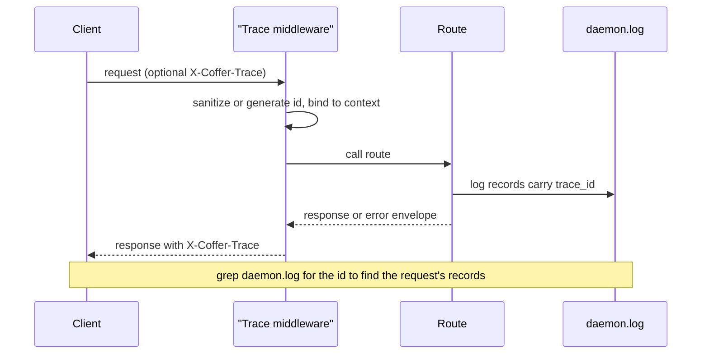
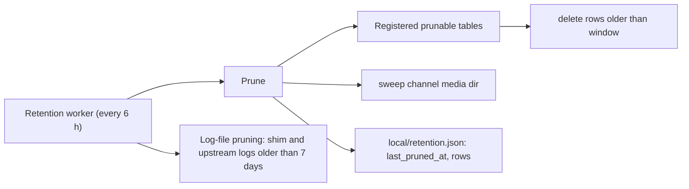
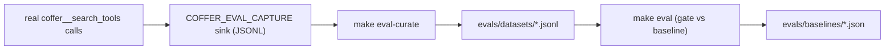

# Observability

This page explains the records Coffer keeps about itself, how they are written, how long they live, and how people and agents read them. It is for contributors changing any of these paths, and for operators who want to know exactly what a log line or an audit row means.

## The problem

Coffer is a background process that other programs talk to. When something goes wrong, the person noticing it is usually looking at an agent's chat window, not at Coffer. That shapes the requirements:

- **The answer has to be reachable from where the failure shows up.** An agent that sees a failed tool call should be able to ask Coffer what happened, without the user hunting for a file.
- **"What changed" and "what happened" are different questions.** A secret that stopped resolving might be a configuration change (someone deleted it) or a runtime fault (the upstream refused it). Both records are needed, and they need to line up on one timeline.
- **Nothing observable may leak a secret.** Coffer holds secrets for every upstream it proxies. Logs, audit rows and invocation rows are written far more often than they are read, and they have to be safe by construction.
- **Records must not grow without bound.** A local tool that fills the disk after a year of use has failed its user.

## Design decisions

| Decision | Reason |
| --- | --- |
| One log file, `daemon.log`, one JSON object per line | Every reader (the Activity page, `coffer log daemon`, an agent or a human with `grep`) parses the same fields. |
| A trace id on every HTTP request and every turn, echoed as `X-Coffer-Trace` and stored on audit rows and MCP invocations | A failed response can be tied to the exact log lines it produced, and one request's or turn's audit rows, MCP calls and log lines read as one story. |
| Every background task runs under one supervisor that names it, logs its crash and counts it | A task that raises is reported the moment it dies, instead of never; a channel adapter that crashes is restarted alone. |
| An event-loop lag probe on the status | One synchronous call blocking the loop stalls everything at once; the lag makes that visible as itself. |
| A separate, structured audit log in SQLite | "What changed, and who changed it" needs filtering by resource, kind and event type, and has to survive a rename. |
| An invocation log for proxied MCP calls, with no payloads | Latency and outcome per call are useful; arguments and results can carry secrets and stay out. |
| One retention mechanism for every log-like table and log file | Bounded growth without a separate cleanup job per feature. |
| Records are read through the CLI (`coffer log`) and the log file (`coffer path logs`), not through an MCP tool | The realistic reader at the moment of failure is an agent with a shell and its own file tools; finding a record needs no extra tool in every session's tool list. |
| Eval capture is a separate, opt-in sink | Curating eval cases needs request text, which the shared database deliberately never stores. |

## The daemon log

### One format

Coffer's own modules log through Python's standard logging library. Every handler on the root logger formats records with structlog's formatter for standard-library records, so every record — Coffer's own, and those of libraries running inside the daemon such as the MCP SDK, asyncio and alembic — leaves as one JSON object with the same fields:

| Field | Source |
| --- | --- |
| `event` | the log message (Coffer uses dotted event names, such as `mcp.upstream.spawn_failed`) |
| `timestamp` | the record's own creation time, UTC ISO-8601 with a trailing `Z` |
| `level` | `debug`, `info`, `warning`, `error` or `critical` |
| `logger` | the module that logged it |
| `trace_id` | the current request's or turn's trace id, or `-` outside both |
| `session_id` | the MCP session, on a line written while serving a `/mcp` call |
| `conversation_id`, `turn_id` | the chat conversation and the turn, on a line written inside a chat or channel turn |
| any `extra={...}` keys | whatever the call site passed |
| `exception` | the rendered traceback, kept inside the same line |

A real line looks like this:

```json
{"event": "mcp.upstream.spawn_failed", "logger": "coffer.application.mcp.supervisor", "level": "warning", "timestamp": "2026-09-24T13:50:15.869933Z", "server": "smart", "attempt": 1, "error": "upstream init failed: ConnectError", "trace_id": "44e10b60da1b4f26"}
```

The daemon does not write the HTTP client libraries' INFO request lines (`httpx`, `httpcore`) to `daemon.log`: they carry the full request URL, and a Telegram bot token travels in the URL path.

`structlog` is also configured to route through the same handlers, so future code that logs through structlog's own API produces the same shape rather than printing to stdout.

The timestamp is the moment the record was created, not the clock at format time. That keeps one record at one time even when two handlers format it, and it keeps timestamps lexically sortable, which the readers rely on for their `since` filter.

### One writer per file

`daemon.log` has two writers by design:

1. The daemon's rotating file handler (10 MB per file, 3 backups: `daemon.log.1` … `daemon.log.3`).
2. The daemon process's own output. The CLI's detect-or-spawn, `coffer daemon start` and the MCP shim open `daemon.log` for append and hand it to the child as stdout and stderr; the desktop app redirects the daemon it spawns into the same file. A daemon that refuses to start (a port already taken, for example) prints why into the file the error message tells you to check.

A stderr handler would therefore write every record twice. The daemon attaches its stderr handler only when stderr is *not* the same file as `daemon.log` (compared by device and inode), which is the foreground case — a terminal or a test — where it is the only way to see output.

The desktop shell writes its own few records (which daemon binary it chose, a failed restart from the menu bar, a failed update check or install) into the same `daemon.log`, as one-line JSON in the same shape.

### Other log files

| File | Written by | Rotation and cleanup |
| --- | --- | --- |
| `~/.coffer/logs/daemon.log` (+ `.1`–`.3`) | daemon, detached daemon's stdio, desktop shell | rotated at 10 MB; never deleted by the pruner |
| `~/.coffer/logs/upstream/<server>.log` | stderr of each stdio MCP server, one file per registered server | rolled to `<server>.log.1` at 2 MB when opened; `.log.1` files older than 7 days are pruned |
| `~/.coffer/logs/shim-<pid>-<epoch>.log` | one per `coffer-mcp-shim` process, created only when the shim logs something | pruned after 7 days |
| `~/.coffer/eval-capture.jsonl` | eval capture, only when opted in | never pruned |

Upstream MCP servers get their own files because they are far chattier than Coffer; with their stderr in `daemon.log`, rotation would push Coffer's own records out within weeks. `COFFER_LOG_DIR` moves the whole log directory — daemon, upstream and shim logs alike; see [Configuration](/reference/configuration) and [Files and directories](/reference/filesystem).

### The tolerant reader

Because `daemon.log` is also the stdio of the daemon's children, it is never guaranteed to be pure JSON. One reader, in the application layer, serves both the Activity page and `coffer log daemon`. It:

- reads only the last 512 KiB of the file, so a 10 MB log is never pulled into memory;
- strips ANSI colour and cursor sequences;
- parses Coffer's JSON first, then the other shapes actually seen in the file: uvicorn's `ERROR:    …`, `LEVEL - logger - message`, and rich-formatted `[mm/dd/yy HH:MM:SS] LEVEL …` panels from FastMCP-based upstreams;
- normalises every level spelling (`WARN`, `WARNING`, `FATAL`, …) onto one vocabulary;
- folds traceback lines and panel borders into the record above them (`continuation`), so one failure is one row;
- keeps any line it cannot parse, verbatim, under `raw` — and treats an unreadable level as passing every level filter, because an unparseable line is most often a traceback.

The HTTP route `GET /api/v1/daemon/logs` exposes this reader with `since`, `level` (a severity floor), `errors_only`, `trace_id` (only the lines of one request or turn) and `limit` (1–500, default 100), newest first. It requires the API token; `GET /api/v1/daemon/status` does not, because it doubles as a readiness probe.

## Trace ids

Every HTTP request gets a trace id before anything else runs. The trace middleware in the HTTP surface is a raw ASGI middleware (not Starlette's convenience middleware base, which buffers and would interfere with the long-lived streams `/mcp` serves). It:

1. takes the client's `X-Coffer-Trace` request header if present, strips it to `[A-Za-z0-9._:-]` and 64 characters, or generates a fresh 16-hex-character id;
2. binds it to a context variable that the log formatter reads for every record the request produces;
3. adds `X-Coffer-Trace` to the response (error responses already carry the same value);
4. clears the context variable when the request ends, so a background task that outlives it does not log a stale id.

Coffer's own CLI and MCP shim send no `X-Coffer-Trace`, so each of their requests gets a fresh id. The header is there for a client that wants several calls to read as one story in the log.

The trace middleware is outermost in the stack — outside the Host and Origin guard and CORS — so even a request refused with `403 HOST_NOT_ALLOWED` or `403 ORIGIN_NOT_ALLOWED` carries a trace id that matches the log record explaining the refusal. See [Security model](/architecture/security) for the guard.


```mermaid
sequenceDiagram
    participant C as Client
    participant T as "Trace middleware"
    participant R as Route
    participant L as daemon.log
    C->>T: request (optional X-Coffer-Trace)
    T->>T: sanitize or generate id, bind to context
    T->>R: call route
    R->>L: log records carry trace_id
    R-->>T: response or error envelope
    T-->>C: response with X-Coffer-Trace
    Note over C,L: grep daemon.log for the id to find the request's records
```

Records logged outside a request — background workers, the MCP session reaper — carry `trace_id: "-"`. Work done while serving an `/mcp` request, such as spawning an upstream server, carries that request's id.

### One id across the three records

The id is not only for `daemon.log`. `application/runtime/correlation.py` holds the correlation of the current unit of work in one context variable — `trace_id`, plus `session_id` inside an `/mcp` call and `conversation_id` and `turn_id` inside a turn — and every record written while it is bound inherits it:

| Record | Carries |
| --- | --- |
| a `daemon.log` line | `trace_id` always; `session_id`, `conversation_id`, `turn_id` when bound |
| an `audit_log` row | `trace_id`, and `conversation_id` and `turn_id` for a row a turn wrote |
| an `mcp_invocations` row | `trace_id` beside its `session_id` |

A turn binds its ids around the spawn of its task: a fresh `turn_id`, the conversation's id, and the trace id of the request that started it — or, for a channel message that arrived over a websocket or a long poll with no request behind it, the turn's own id as its trace id. Because `asyncio` copies the context into every task it creates, the turn's renderer and anything else it starts carry the same ids with no parameter threaded through.

So "what else did this request do?" is one filter on each record: `GET /api/v1/audit?trace_id=…`, `GET /api/v1/mcp/invocations?trace_id=…` and `GET /api/v1/daemon/logs?trace_id=…`, or `--trace <id>` on `coffer log audit`, `coffer log mcp` and `coffer log daemon`. The Activity page's record drawer shows a change's and a call's trace id.

## The audit log

The audit log answers "what changed, and who changed it". It lives in the `audit_log` table of `~/.coffer/runs.db`, the history database.

### Shape of a row

| Column | Meaning |
| --- | --- |
| `timestamp` | when the event happened (UTC) |
| `event_type` | one value from the vocabulary below |
| `actor` | who caused it: `cli`, `api`, `ui`, `system`, or another short lowercase identifier |
| `resource_uid` | the resource's uid, or empty for an event that names no resource or whose resource was deleted |
| `resource_kind`, `resource_name` | the label the resource carried **at the time** |
| `details` | event-specific fields, already redacted |
| `trace_id` | the request's or turn's correlation id; empty for a row written with none bound, such as a boot pass |
| `conversation_id`, `turn_id` | the chat conversation and turn, for a row a turn wrote |

Two decisions shape this:

- **Identity and label are stored separately.** A resource's trail is queried by its uid, so renaming a resource leaves its history intact, and old rows keep the name that was true when they were written. There is no way to audit an event by label alone; see [Resource framework](/architecture/resource-framework).
- **Redaction happens before storage, per kind.** Each resource kind can supply an audit redactor that strips secret fields from a configuration before it becomes `details`. The MCP server kind uses one to drop the `env` and `headers` maps from its transport, keeping only secret references.

The actor comes from the `X-Coffer-Actor` request header, which must match `^[a-z][a-z0-9_-]{0,31}$`; a missing header means `api`, and anything else is rejected with `400`.

Every audit event is also written to `daemon.log` as an `info` line carrying the event type, resource name, kind, uid and actor — but not `details`, so the redactor stays the only place that decides which fields are secret.

### Event vocabulary

The vocabulary is a closed enumeration, defined in the domain layer.

| Area | Events |
| --- | --- |
| Resources | `resource_created`, `resource_updated`, `resource_enabled`, `resource_disabled`, `resource_deleted`, `resource_renamed`, `resource_scope_updated` |
| MCP capabilities | `capability_enabled`, `capability_disabled` |
| Daemon | `token_rotated`, `daemon_residency_updated`, `daemon_restarted`, `retention_updated`, `internal_engine_model_set` |
| Secrets | `secret_set`, `secret_revealed`, `secret_deleted`, `master_key_relocated`, `secret_resolved`, `secret_local_access_revoked`, `secret_approval_requested`, `secret_approval_approved`, `secret_approval_rejected` |
| Agents | `agent_mcp_installed`, `agent_mcp_uninstalled`, `agent_mcp_entry_removed`, `agent_mcp_entry_adopted`, `agent_plugin_toggled`, `agent_plugin_uninstalled` |
| Skills | `skill_imported`, `skill_updated`, `skill_update_merged`, `skill_bound`, `skill_unbound`, `skill_relinked`, `skill_drift_remediated`, `skill_adopted`, `skill_unmanaged_deleted` |
| Knowledge | `knowledge_written`, `knowledge_edited`, `knowledge_deleted` |
| Memory | `memory_aggregated`, `memory_distilled`, `memory_delivery_installed`, `memory_delivery_removed`, `memory_delivery_fired`, `memory_trigger_added`, `memory_trigger_proposed`, `memory_trigger_armed`, `memory_trigger_disarmed`, `memory_trigger_deleted` |
| Channels | `channel_pairing_issued`, `channel_paired` |
| Vault files | `vault_file_edited` (a hand edit committed as `disk`, by a person) |
| Vault sync | `sync_run`, `sync_confirmed`, `sync_rejected`, `sync_rolled_back`, `sync_machine_removed`, `sync_plaintext_pushed`, `master_key_exported`, `master_key_imported` |
| Providers | `provider_switched`, `provider_transcribe_default_set`, `provider_projection_refused` |

No secret event carries a secret value; each records the ref, the standalone secret's name or the destination only.

Three events are no longer recorded, because the web UI no longer edits an agent's config file or a memory note: `agent_config_file_written`, `agent_config_file_deleted` and `memory_note_edited`. Rows already in the log keep their labels in the Activity page, so they still read in plain words. `vault_file_restored` is recorded: restoring a version from a History tab is Coffer's own write. An edit made on disk, or a restore an agent commits itself, is a vault commit naming `Coffer-Writer: disk` or `agent`; the vault's git history answers who changed the file.

- `secret_revealed` — a person revealed or copied a value in the desktop app, behind a presence check. It is the only way a value is shown, since no route, command or tool returns one.
- `secret_resolved` — `coffer run` resolved a standalone secret into one child process. The row names the secret, the program and the working directory, never the value or the rest of the command line.
- `secret_local_access_revoked` — a person revoked a standalone secret's grant to local programs, so `coffer run` can no longer resolve it. Granting is recorded as an ordinary approval.
- `secret_approval_requested`, `secret_approval_approved`, `secret_approval_rejected` — a secret waited to be sent somewhere new (or a value in use waited to be replaced, or the protection waited to be switched off), and a person answered. See [Secrets](/guides/secrets#approvals).
- `master_key_exported` — the desktop app wrote a key backup, behind a presence check. No command or route exports the key.

Decrypting a secret to spawn an upstream is not an audit event.

You read the audit log from the **Changes** tab of the Activity page, with `coffer log audit` (`--kind`, `--name`, `--event-type`, `--since`, `--limit`, `--json`), or through `GET /api/v1/audit`. See [Activity and audit](/guides/activity).

## The MCP invocation log

Every call the gateway proxies — a tool call, a resource read, a prompt get — writes one row to `mcp_invocations`:

| Column | Meaning |
| --- | --- |
| `timestamp` | when the call started |
| `resource_uid` | the MCP server's uid; `coffer` for a builtin `coffer__*` tool; a server removed since keeps its uid, with no name |
| `capability_type`, `capability_key` | `tool` / `resource` / `prompt`, and the upstream's own name for it |
| `duration_ms` | wall time of the upstream request |
| `status` | `ok`, `error`, `timeout` or `denied` |
| `error_message` | a Coffer-authored summary, never the upstream's result text |
| `session_id` | the `/mcp` session the call came from |
| `agent_uid` | the agent whose session made the call, as its shim reported it on `initialize`; empty when the session reported none (a hand-configured shim, a bare MCP client) |
| `trace_id` | the `/mcp` request's trace id; the audit rows and log lines the call caused carry the same one |

What `status` means:

- `ok` — the upstream answered and the result was not an error.
- `error` — the upstream would not start (a failed spawn, or a server in cooldown), the request raised (a transport failure, or a JSON-RPC error from the upstream), or the upstream returned a well-formed tool result with `isError: true`. When the upstream answered, the row stores a fixed marker rather than its text: `upstream tool returned an error result (isError)` for an `isError` result, `upstream answered with a JSON-RPC error (code <n>)` for a JSON-RPC error. The error text is upstream-controlled and may echo arguments or secrets. The markers are also how the server status route tells a failing tool (the server is up) from a failing server. A builtin tool that raises is also `error`, with the exception's class name or Coffer's own message, truncated to 200 characters.
- `timeout` — the upstream did not answer within its timeout.
- `denied` — the call was refused before reaching the upstream: the server is disabled, the server is out of [reach](/architecture/resource-framework#reach) for the calling agent, or the user disabled that tool. Duration is `0`.

Resource reads and prompt gets have no in-band error flag, so for them only a raised error counts as `error`.

Rows are keyed by uid rather than name, so a server's history belongs to that registration and not to a later server registered under the same name, and a deleted server's rows stay readable. The table is not a foreign key for the same reason.

Writes are buffered: an in-memory queue (up to 5,000 rows) is flushed by a writer task every 50 ms or every 50 rows, whichever comes first, so a tool-heavy session does not pay an SQLite commit per call. When the queue is full, callers wait rather than drop rows.

You read it on the **Tool calls** tab of the Activity page, per server on the server's detail page, with `coffer log mcp [--server <name>]`, or through `GET /api/v1/mcp/invocations` and `GET /api/v1/resources/mcp_server/{uid}/invocations`. Both routes page newest first by cursor, take `agent_uid` to show one agent's calls and `trace_id` to show one request's, and answer each row with its `id`. Their answer, like the audit log's, carries `total`: how many rows match the filters across every page, so a filtered view can say how big it is without paging to the end.

## Retention

Everything log-like is bounded by one mechanism.

Every table the retention worker sweeps is described declaratively: its policy key, timestamp column, default window, display name, and an action of `delete` or `archive`. The composition root registers every such description in one registry, and the SQL allowlist the repository accepts is derived from those registrations, so a table cannot be pruned unless it is registered.

| Policy (`name`) | Table | Timestamp column | Default | Action |
| --- | --- | --- | --- | --- |
| `audit_log` | `audit_log` | `timestamp` | 365 days | delete |
| `mcp_invocations` | `mcp_invocations` | `timestamp` | 30 days | delete |
| `sync_runs` | `sync_runs` | `finished_at` | 90 days | delete |


```mermaid
flowchart LR
    W["Retention worker (every 6 h)"] --> S["Prune"]
    S --> R["Registered prunable tables"]
    R --> T1["delete rows older than window"]
    S --> M["sweep channel media dir"]
    W --> F["Log-file pruning: shim and upstream logs older than 7 days"]
    S --> P["local/retention.json: last_pruned_at, rows"]
```

- At startup the retention service seeds a policy for each registered table in `~/.coffer/local/retention.json` and never overwrites one you changed. An entry in the file for a policy that is no longer registered, such as the removed conversation policies, is dropped at startup.
- The retention worker runs a prune immediately at startup (catch-up), then every 6 hours. A failing prune is logged and the worker keeps going.
- A full prune also sweeps the channel media directory, and the worker prunes old shim and upstream log files on the same cadence. `daemon.log` itself is bounded by its own rotation and is never deleted.
- A window of "none" disables pruning for that table. Changing a window records `retention_updated` in the audit log.

You manage policies from **Settings → Data**, or through `/api/v1/retention/policies` and `POST /api/v1/retention/prune`.

## Reading the records: `coffer log` and `coffer path logs`

The realistic reader of these records is often an agent at the moment something broke, working in a shell. It reads them the way a person does, with the CLI and its own file tools:

| Command | Reads |
| --- | --- |
| `coffer log audit [--kind] [--name] [--event-type] [--since] [--trace] [--limit] [--json]` | the audit log, newest first |
| `coffer log mcp [--server] [--status ok\|error] [--since] [--trace] [--limit] [--json]` | the MCP invocation log, newest first |
| `coffer log daemon [--errors] [--since] [--trace] [--limit] [--json]` | the tail of `daemon.log`, through the same tolerant reader as the Activity page |
| `coffer daemon status [--json]` | the event-loop lag and the background task counts, beside the daemon's version and port |
| `coffer path logs` | the log directory and the `daemon.log` in it, for `grep` or `tail` |

`--since` takes an ISO 8601 instant or an age such as `30m`, `1h` or `2d`. A filter that cannot be resolved — a name without a kind, or a name that no resource of that kind has — is an error rather than being silently ignored, because an unfiltered answer would look like "nothing happened to this resource". Every command is read-only and prints no secret values: audit details are redacted before storage, and log records carry none by construction.

An agent that hits a `SECRET_MISSING` error does not know whether it needs "what changed" or "what failed", so it runs `coffer log audit --since 1h` and `coffer log daemon --errors --since 1h`, or greps the file `coffer path logs` names for the response's trace id. Given that id, `coffer log audit --trace <id>`, `coffer log mcp --trace <id>` and `coffer log daemon --trace <id>` return exactly that request's records.

## Background tasks and event-loop lag

Everything the daemon does runs on one `asyncio` event loop, and much of it runs as background tasks: each channel adapter's inbound loop, each turn and its renderer, the reconciler and the periodic workers. Two things about that loop used to be invisible.

**A task that crashed said nothing.** A bare `asyncio.create_task` whose coroutine raises keeps the exception until something retrieves it — and for a fire-and-forget task nothing does, so it surfaced, if at all, as "Task exception was never retrieved" when the task was garbage-collected. `application/runtime/supervisor.py` is the one way the daemon starts background work now:

- `spawn(coro, name=…)` starts a named task. If it raises, a `runtime.task.crashed` line with the task's name, the exception class and the traceback reaches `daemon.log` the moment it ends, and the crash is counted.
- `spawn_restarting(factory, name=…)` is for a long-lived loop whose owner wants it back. After a crash it is run again, after a backoff that doubles from 1 s to a 60 s cap. The channel runtime, each Telegram channel's poll loop (`telegram-poll:<channel>`), each SeaTalk channel's websocket supervisor (`seatalk-ws:<channel>`) and the periodic workers run this way, so one adapter's crash restarts that adapter's loop and nothing else. The SeaTalk SDK's blocking `listen()` stays on its own thread; the supervised part is the asyncio loop that owns and restarts it.
- At shutdown, after each owner has stopped its own tasks in the teardown's order, the supervisor cancels whatever is still running, bounded by a timeout.

Tasks a function awaits or cancels before it returns — the two sides of an `asyncio.wait` race, a shielded write, a per-request pump — are structured concurrency, not background work, and stay bare. `scripts/check_bare_tasks.py` (run by `make lint`) counts `create_task` and `ensure_future` calls per file and fails on any file that makes more than its allow-list entry, each entry stating why its calls are awaited in place. A new bare task therefore fails lint until it moves onto the supervisor or is argued onto the list.

**A blocked loop looked like general slowness.** One synchronous call on the loop — a large file walk, a subprocess wait — stalls every request, channel and turn at once. `application/runtime/loop_lag.py` sleeps for 0.5 s at a time and records how much later than asked the loop woke it, keeping five minutes of samples.

`GET /api/v1/daemon/status` carries both in its `runtime` block, and `coffer daemon status` prints them:

```json
"runtime": {
  "loop_lag_p99_ms": 1.84,
  "loop_lag_max_ms": 12.6,
  "loop_lag_samples": 600,
  "loop_lag_window_seconds": 300.0,
  "tasks_running": 14,
  "task_crashes": 1,
  "last_crash": {"task": "telegram-poll:family", "error": "RuntimeError", "at": "2026-10-01T08:12:03Z", "restarting": true}
}
```

An idle daemon reads a millisecond or two. A p99 in the hundreds means something is blocking the loop; the daemon log around the maximum usually says what. The status route answers without a token, so `last_crash` carries only the exception's class; its message and traceback are in `daemon.log` under `runtime.task.crashed`.

## Eval capture

Coffer's deterministic tests prove the plumbing. The quality of its non-deterministic behaviour — above all, how well `coffer__search_tools` ranks upstream tools — is measured by the eval harness in the repository's `evals/` directory, and grown from real usage by an opt-in capture sink.


```mermaid
flowchart LR
    U["real coffer__search_tools calls"] --> C["COFFER_EVAL_CAPTURE sink (JSONL)"]
    C --> K["make eval-curate"]
    K --> D["evals/datasets/*.jsonl"]
    D --> G["make eval (gate vs baseline)"]
    G --> B["evals/baselines/*.json"]
```

- **Capture.** When `COFFER_EVAL_CAPTURE` is set for the daemon, each `coffer__search_tools` call appends one line — the query and the ranked tool names that came back — to a JSONL file: `~/.coffer/eval-capture.jsonl` for `1`/`true`/`yes`, or the path given. The capture logger does not propagate, so these lines never reach `daemon.log`. Nothing is written when the variable is unset. Tool arguments and results are never captured.
- **Curate.** `make eval-curate` reads the sink, drops queries the dataset already covers, and asks you to mark which returned tools were relevant. Confirmed cases are appended to `evals/datasets/tool_search.jsonl` tagged `"source": "captured"`.
- **Gate.** `make eval` runs the deterministic tool-search suite (recall@k and MRR over the same ranker the gateway uses) and fails when a score drops below the committed baseline minus tolerance. The `evals` GitHub workflow runs it on pushes and pull requests that touch `evals/` or the MCP, knowledge or memory code. `make eval-routing` adds a model-bearing tool-routing suite, which needs a model endpoint and stays out of CI.

The invocation log's honest `error` status for in-band tool errors is what makes it usable as a signal here: a log that recorded failed tool calls as `ok` could not tell a good routing decision from a bad one.

## Trade-offs and alternatives

**Payloads in the invocation log.** Recording arguments and results would make debugging a single call easier. Coffer does not, because both routinely carry secrets, personal data and file contents, and the log is retained for a month and readable by any agent through `coffer log mcp`. The fixed error marker for in-band tool errors follows the same rule.

**A log file per writer.** Giving the desktop shell or a detached daemon's stdio their own files would keep `daemon.log` pure JSON. Coffer keeps one file and a tolerant reader instead, because every "check the log" message points at one path and a second file is a place nobody is told to look. Upstream MCP servers are the exception, because their volume would evict Coffer's own records.

**Structured logging through structlog's own API.** Converting over a hundred call sites that use the standard logging library buys nothing the stdlib formatter does not already provide. The formatter runs structlog's processors over stdlib records, so the file has one shape with no call-site churn.

**Audit events in the daemon log only.** A log line cannot be filtered by resource id or survive rotation for a year. The table is the record; the log line is a convenience for whoever is tailing the file.

**A metrics or tracing backend.** Coffer runs on one machine for one person. Exporting OpenTelemetry spans or Prometheus metrics would add a dependency and a second process for a question `coffer log` already answers locally. The correlation ids borrow the one idea worth having from tracing — a single id carried across every record of a request — without the backend.

## Where it lives in the code

| Package | What it does |
| --- | --- |
| `infrastructure/logging/` | JSON formatter, rotating file handler, stderr rule, trace id context, log directory, per-upstream stderr files, log-file pruning, eval capture sink |
| `application/runtime/` | correlation ids of the current unit of work (trace, session, conversation, turn), supervised background tasks, the event-loop lag probe |
| the application layer | tolerant tail reader shared by the Activity page and `coffer log daemon`; recording and querying audit rows; prunable tables, prune logic and cadence; eval capture emit |
| the MCP gateway, in `application/mcp/` | invocation status for proxied calls; invocation rows for builtin tools; eval capture hook |
| `infrastructure/mcp/` | `mcp_invocations` table and buffered writer |
| `domain/` | audit entry and event vocabulary |
| the HTTP surface | trace id middleware, middleware order, and the registered prunable tables (composition root) |
| the CLI surface | `coffer log` and `coffer path` |
| `evals/` | eval harness, datasets, baselines, curate CLI |

## Related

- Guides: [Activity and audit](/guides/activity), [Troubleshooting](/guides/troubleshooting), [Running the daemon](/guides/daemon)
- Reference: [MCP tools](/reference/mcp-tools), [Files and directories](/reference/filesystem), [Configuration](/reference/configuration), [Error codes](/reference/error-codes)
- Architecture: [MCP gateway](/architecture/mcp-gateway), [Security model](/architecture/security), [Persistence](/architecture/persistence)
- Decision records: [Background Work Runs Supervised, and Every Record Carries One Correlation Id](https://github.com/wyx-sg/Coffer/blob/main/docs/decisions/background-work-runs-supervised-and-correlated.md), [Evals: Opt-In Capture, Hand Curation, and a Deterministic Regression Gate](https://github.com/wyx-sg/Coffer/blob/main/docs/decisions/eval-capture-and-regression-gate.md), [the agent harness guide](https://github.com/wyx-sg/Coffer/blob/main/.agents/harness.md), [A Resource's Identity Is the `uid` Inside Its File; Path and Name Are Location and Label](https://github.com/wyx-sg/Coffer/blob/main/docs/decisions/identity-is-the-uid-inside-the-file.md)
- Specs: [daemon](https://github.com/wyx-sg/Coffer/blob/main/openspec/specs/daemon/spec.md), [mcp-gateway](https://github.com/wyx-sg/Coffer/blob/main/openspec/specs/mcp-gateway/spec.md), [resource-framework](https://github.com/wyx-sg/Coffer/blob/main/openspec/specs/resource-framework/spec.md)
