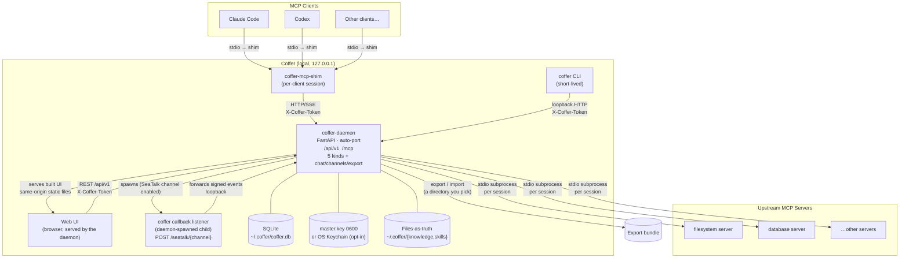

# System Overview

::: tip Mental model
Coffer is a local-first AI agent vault: a long-lived local daemon that holds a developer's accumulated AI assets on-device and lets any AI agent (Claude Code, Codex, future ones) read and contribute through one safe interface. The vault spans five resource kinds — `mcp_server`, `agent`, `skill`, `knowledge`, and `channel` — over a kind-agnostic Resource framework, plus cross-cutting features (in-process and CLI-agent chat, messaging channels, multi-machine sync). The MCP gateway is one of those kinds: register an upstream server once and every MCP client connects to the same daemon and sees the same namespaced tools, with names like `filesystem__read_file`. All state lives locally in SQLite (secrets as Fernet ciphertext), with a single master key in a `0600` file beside the DB (OS keychain opt-in). The daemon binds to `127.0.0.1` only — nothing is reachable from outside your machine.
:::

## System topology

The diagram below shows how the pieces fit together. The daemon owns all vault state across the six resource kinds; for the MCP gateway kind, clients do not connect to upstream servers directly — they connect to the Coffer daemon, which manages upstream connections on their behalf. A separate callback listener process serves signed channel webhooks when a SeaTalk channel is enabled.



## Named components and interfaces

| Component                      | Type                                             | Role                                                                                                                                                                                                                                                                                                                  |
| ------------------------------ | ------------------------------------------------ | --------------------------------------------------------------------------------------------------------------------------------------------------------------------------------------------------------------------------------------------------------------------------------------------------------------------- |
| `coffer-daemon`                | Long-lived process                               | FastAPI service on `127.0.0.1:<auto-port>`. Owns all state across the five resource kinds and the cross-cutting features (chat, channels, export/import). Single SQLite writer.                                                                                                                                                 |
| Resource kinds                 | Daemon-hosted abstraction                        | Five kinds over one kind-agnostic Resource framework: `mcp_server` (gateway upstreams), `agent` (registered coding agents), `skill` (master skill bundles delivered into agents), `knowledge` (the files-as-truth + SQLite-retrieval store of entries and ingested documents), `channel` (Telegram/SeaTalk bindings). |
| Chat / channels / export-import | Cross-cutting daemon features                   | In-process LangGraph chat agent plus Claude Code/Codex CLI agents (spec 008); messaging channels relaying chat from IM apps (ADR-014); one-shot vault export to a directory and import of one back (ADR-016). Not kinds — they span the kinds.                                                                               |
| `coffer` callback listener     | Daemon-spawned child process                     | Serves only signed channel webhooks (`POST /seatalk/{channel}`) on a loopback port behind a user-run tunnel; verifies the SeaTalk signature and forwards events to the daemon. Runs while a SeaTalk channel is enabled (ADR-014).                                                                                     |
| `coffer-mcp-shim`              | Short-lived process (one per MCP client session) | Bridges MCP client stdio ↔ daemon HTTP/SSE. Detects a running daemon or spawns one.                                                                                                                                                                                                                                   |
| `coffer` CLI                   | Short-lived child process                        | User-facing management commands. Calls the daemon over loopback HTTP.                                                                                                                                                                                                                                                 |
| Web UI                         | Browser process                                  | Management interface. In production the daemon serves the built UI itself, as static files at its own loopback origin — same-origin with the REST API; `coffer open` launches the browser and hands the page a token via a single-use code. In development, the Vite dev server at `http://localhost:5173` serves it instead.                                                                                                                                                   |
| REST API (`/api/v1`)           | HTTP surface on daemon                           | Management plane: CRUD for resources, audit log, settings. Token + CORS authenticated.                                                                                                                                                                                                                                |
| MCP endpoint (`/mcp`)          | HTTP/SSE surface on daemon                       | MCP JSON-RPC endpoint. This is what the shim connects to. Forwards namespaced tool calls to upstream subprocesses.                                                                                                                                                                                                    |
| SQLite (`~/.coffer/coffer.db`) | Persistent store                                 | Control-plane state: resource registrations, capability preferences, audit log, retention policies, and secrets as Fernet ciphertext in the `credentials` table. WAL mode, single writer.                                                                                                                             |
| `master.key` / OS Keychain     | Master-key store                                 | The single Fernet master key. Default: a `0600` `~/.coffer/master.key` file beside the DB; OS keychain is an opt-in. Secrets are decrypted with it and materialized into the upstream env / headers at spawn time.                                                                                                    |
| `~/.coffer/daemon.json`        | Discovery file (mode 0600)                       | PID + port + token. Written by the daemon on startup; read by shim and CLI to locate a running daemon.                                                                                                                                                                                                                |

## Authentication model

All surfaces that communicate with the daemon carry an `X-Coffer-Token` header. The token is generated when the daemon starts and written to `~/.coffer/daemon.json` (mode `0600`). Because the file is owner-readable only and the daemon binds to loopback, the effective trust boundary is the local user account.

## All state under `~/.coffer/`

Every persistent artifact lives in one directory:

```
~/.coffer/
├── daemon.json          # discovery: PID + port + token (0600)
├── coffer.db            # SQLite: control-plane state + rebuildable retrieval index
├── master.key           # Fernet master key (0600; keychain opt-in moves it out)
├── knowledge/           # knowledge files-as-truth, one dir per scope:
│                        #   <scope>/{knowledge,inbox,rules,handoff,superseded,.raw}/
├── skills/              # canonical master skill store
├── bin/                 # co-located coffer binaries (daemon/shim/CLI)
├── logs/
│   ├── daemon.log       # structured JSON logs from the daemon
│   ├── upstream/        # one file per upstream MCP server's stderr
│   └── shim-*.log       # one per shim process; pruned after 7 days
└── upstream-pids/       # PID files for upstream subprocesses (swept on restart)
```

This single-directory layout means a complete backup of your Coffer state is one `cp -r ~/.coffer/ backup/` away.

## Reading map

The pages that follow each explore one slice of the system in depth:

| Page                                                   | Topic                                                                     |
| ------------------------------------------------------ | ------------------------------------------------------------------------- |
| [Daemon & processes](/architecture/processes)          | Process model, detect-or-spawn, upstream subprocess lifecycle             |
| [Resource framework](/architecture/resource-framework) | The kind-agnostic abstraction that unifies identity, lifecycle, and audit |
| [Layering & boundaries](/architecture/layering)        | Import rules, layer responsibilities, enforcement                         |
| [Surfaces](/architecture/surfaces)                     | REST API, MCP endpoint, CLI, stdio shim, Web UI                           |
| [Request lifecycle](/architecture/request-lifecycle)   | End-to-end trace of a tool call from client to upstream                   |
| [Persistence](/architecture/persistence)               | SQLite schema, WAL, Alembic, JSON field handling                          |
| [Security](/architecture/security)                     | Token auth, encrypted credential store, SSRF guard, loopback enforcement  |
| [Observability](/architecture/observability)           | Structured logging, trace IDs, audit log, retention                       |
| [Distribution](/architecture/distribution)             | Package layout, install, platform support                                 |

---

**See also:** [Architecture reference](/reference/project/architecture)
