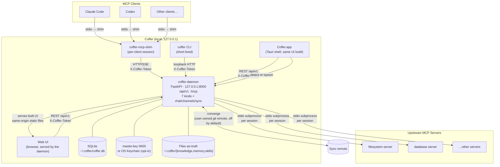

# System Overview

::: tip Mental model
Coffer is a local-first AI agent vault: a long-lived local daemon that holds a developer's accumulated AI assets on-device and lets any AI agent (Claude Code, Codex, future ones) read and contribute through one safe interface. The vault spans **seven** resource kinds — `mcp_server`, `agent`, `skill`, `knowledge`, `memory`, `provider`, and `channel` — over a kind-agnostic Resource framework, plus cross-cutting features (the turn platform that drives your registered coding agents behind those channels, and bidirectional convergence of the vault with a git remote you own). The MCP gateway is one of those kinds: register an upstream server once and every MCP client connects to the same daemon and sees the same namespaced tools, with names like `filesystem__read_file`. All state lives locally in SQLite (secrets as Fernet ciphertext), with a single master key in a `0600` file beside the DB (OS keychain opt-in). The daemon binds to `127.0.0.1:8000` only — a fixed port it refuses to start without — so nothing is reachable from outside your machine.
:::

## System topology

The diagram below shows how the pieces fit together. The daemon owns all vault state across the seven resource kinds; for the MCP gateway kind, clients do not connect to upstream servers directly — they connect to the Coffer daemon, which manages upstream connections on their behalf. Channels receive inbound messages without anything listening for them — Telegram by long polling, SeaTalk over an outbound websocket connection the daemon holds itself — and a native desktop shell hosts the same web UI in a window.



## Named components and interfaces

| Component                      | Type                                             | Role                                                                                                                                                                                                                                                                                                                  |
| ------------------------------ | ------------------------------------------------ | --------------------------------------------------------------------------------------------------------------------------------------------------------------------------------------------------------------------------------------------------------------------------------------------------------------------- |
| `coffer-daemon`                | Long-lived process                               | FastAPI service on `127.0.0.1:8000` — a fixed port it refuses to start without, changeable with `coffer daemon port set`. Owns all state across the seven resource kinds and the cross-cutting features (chat, channels, sync). Single SQLite writer.                                                                                                                                                 |
| Resource kinds                 | Daemon-hosted abstraction                        | Seven kinds over one kind-agnostic Resource framework: `mcp_server` (gateway upstreams), `agent` (registered coding agents), `skill` (master skill bundles delivered into agents), `knowledge` (one tree of Markdown documents per collection that people and Coffer's curation pass write together), `memory` (notes aggregated out of the agents' own native memory), `provider` (vendor endpoints and their keys), `channel` (Telegram/SeaTalk bindings). |
| Chat / channels / sync | Cross-cutting daemon features                   | The turn platform running Claude Code/Codex agents; messaging channels relaying chat from IM apps (ADR channel-adapter-framework); bidirectional convergence of the vault with a user-owned git remote (ADR vault-sync). Not kinds — they span the kinds.                                                                               |
| `coffer-mcp-shim`              | Short-lived process (one per MCP client session) | Bridges MCP client stdio ↔ daemon HTTP/SSE. Detects a running daemon or spawns one.                                                                                                                                                                                                                                   |
| `coffer` CLI                   | Short-lived child process                        | User-facing management commands. Calls the daemon over loopback HTTP.                                                                                                                                                                                                                                                 |
| Web UI                         | Browser process                                  | Management interface. In production the daemon serves the built UI itself, as static files at its own loopback origin — same-origin with the REST API; the daemon injects its live token into the `index.html` it serves, so any page it serves is authenticated; `coffer open` only resolves the daemon's current port and launches the browser there. In development, the Vite dev server at `http://localhost:5173` serves it instead.                                                                                                                                                   |
| `Coffer.app` (desktop shell)   | Native app process (Tauri 2) + webview            | A second host for the *same* `frontend/dist`, loaded as a local asset rather than fetched from the daemon: Dock icon, Cmd-Tab entry, resident tray (open / sync, badged when the vault needs attention / restart daemon / quit), detect-or-spawn of the daemon at launch, and an IPC handshake that hands the page the daemon's base URL and token. Shipped as the `.dmg`, which embeds all three binaries. Reimplements nothing the daemon exposes over HTTP (ADR desktop-shell-over-a-shared-frontend). |
| REST API (`/api/v1`)           | HTTP surface on daemon                           | Management plane: CRUD for resources, audit log, settings. Token + CORS authenticated.                                                                                                                                                                                                                                |
| MCP endpoint (`/mcp`)          | HTTP/SSE surface on daemon                       | MCP JSON-RPC endpoint. This is what the shim connects to. Forwards namespaced tool calls to upstream subprocesses.                                                                                                                                                                                                    |
| SQLite (`~/.coffer/coffer.db`) | Persistent store                                 | Control-plane state: resource registrations, capability preferences, audit log, retention policies, and secrets as Fernet ciphertext in the `credentials` table. WAL mode, single writer.                                                                                                                             |
| `master.key` / OS Keychain     | Master-key store                                 | The single Fernet master key. Default: a `0600` `~/.coffer/master.key` file beside the DB; OS keychain is an opt-in. Secrets are decrypted with it and materialized into the upstream env / headers at spawn time.                                                                                                    |
| `~/.coffer/daemon.json`        | Discovery file (mode 0600)                       | PID + port + token. Runtime state: written by the daemon on startup, unlinked on exit, read by the shim, the CLI and the desktop shell to locate a running daemon. |
| `~/.coffer/daemon-config.json` | Pre-database settings file (mode 0600)           | The Coffer configuration that cannot live in SQLite, because it is read before the database is opened and before migrations have created a table to read it from: the fixed port, this machine's name and its cached id — plus this machine's experimental-feature switches (`features`), which live here so they never sync. Configuration — goes *in*, and survives shutdown. Written by `coffer daemon port`, `coffer sync machine rename`, the daemon itself (the cached machine id), and the daemon on behalf of `coffer daemon features` and the Settings experimental-features card. |                                                                                                                                                                                                              |

## Authentication model

All surfaces that communicate with the daemon carry an `X-Coffer-Token` header. The token is generated when the daemon starts and written to `~/.coffer/daemon.json` (mode `0600`). Because the file is owner-readable only and the daemon binds to loopback, the effective trust boundary is the local user account.

## All state under `~/.coffer/`

Every persistent artifact lives in one directory:

```
~/.coffer/
├── daemon.json          # runtime state: PID + port + token (0600); unlinked on exit
├── daemon-config.json   # configuration read BEFORE the DB opens: port, machine name + id, feature switches (0600)
├── coffer.db            # SQLite: control-plane state (no knowledge, no index)
├── master.key           # Fernet master key (0600; keychain opt-in moves it out)
├── machine-id           # this machine's stable identity for sync
├── knowledge/           # knowledge files-as-truth, one dir per collection:
│                        #   <collection>/ documents + a hidden .inbox/
├── memory/              # notes aggregated out of the agents' own native memory
├── skills/              # canonical master skill store
├── sync/                # the git working tree the vault converges through
├── workspace/           # the default working directory a chat turn runs in
├── vendor/              # SDKs Coffer does not bundle (the SeaTalk client library)
├── channel-media/       # attachments in flight between an IM channel and an agent
├── cache/agent/         # derived, rebuildable agent data (transcript summaries)
├── state/               # one-shot markers for things shown to the user once
├── bin/                 # co-located coffer binaries, one dir per version + symlinks
├── logs/
│   ├── daemon.log       # structured JSON logs from the daemon
│   ├── upstream/        # one file per upstream MCP server's stderr
│   └── shim-*.log       # one per shim process; pruned after 7 days
└── upstream-pids/       # PID files for upstream subprocesses (swept on restart)
```

This single-directory layout means a complete backup of your Coffer state is one `cp -r ~/.coffer/ backup/` away.

## Reading map

The pages that follow each explore one slice of the system in depth:

| Page                                                   | Topic                                                                     |
| [Principles](/architecture/principles)                 | The normative project principles, constraints, quality gates, governance  |
| ------------------------------------------------------ | ------------------------------------------------------------------------- |
| [Daemon & processes](/architecture/processes)          | Process model, detect-or-spawn, upstream subprocess lifecycle             |
| [Resource framework](/architecture/resource-framework) | The kind-agnostic abstraction that unifies identity, lifecycle, and audit |
| [Layering & boundaries](/architecture/layering)        | Import rules, layer responsibilities, enforcement                         |
| [Surfaces](/architecture/surfaces)                     | REST API, MCP endpoint, CLI, stdio shim, Web UI                           |
| [Request lifecycle](/architecture/request-lifecycle)   | End-to-end trace of a tool call from client to upstream                   |
| [Persistence](/architecture/persistence)               | SQLite schema, WAL, Alembic, JSON field handling                          |
| [Vault sync](/architecture/sync)                       | The converge round, its safety rules, and what travels                    |
| [Security](/architecture/security)                     | Token auth, encrypted credential store, outbound paths, loopback enforcement |
| [Audit & accountability](/architecture/audit)          | The audit log, the invocation log, and what earns a row in either        |
| [Observability](/architecture/observability)           | Structured logging, trace IDs, audit log, retention                       |
| [Distribution](/architecture/distribution)             | Package layout, install, platform support                                 |
| [Experimental features](/architecture/experimental-features) | Release channel, the feature registry, request-time gates            |
