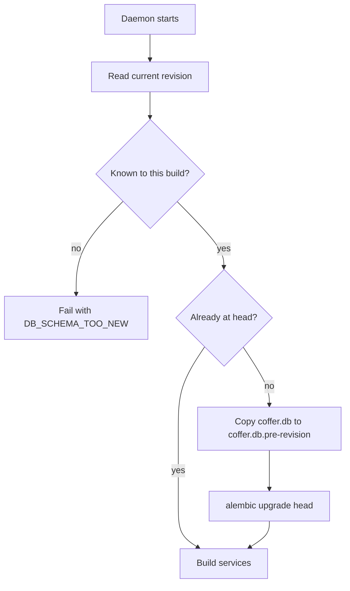

# Persistence

Coffer keeps its control-plane state in one SQLite database and its bulk content as plain files, all under `~/.coffer/`. This page covers the database engine and its settings, how schema changes are applied and recovered from, every table and its purpose, what deliberately does not live in the database, and the two small JSON files the daemon reads before any database exists. It is for engineers changing the schema, debugging a startup failure, or deciding where new state belongs.

## The problem it solves

Coffer's state has two very different shapes. Control-plane state — which resources exist, their config and reach, the audit trail, encrypted secrets, chat history, sync bookkeeping — is small, relational and written transactionally from many code paths. Bulk content — knowledge documents, memory notes, skill bundles — is large, human-readable, edited by people in their own editors and read by agents with their own file tools.

Putting both in one store would make one of them worse: a database is a poor editor, and a directory of files is a poor transactional store. So Coffer uses each for what it is good at, and draws the line explicitly.

## Design decisions

| Decision | Reason |
| --- | --- |
| SQLite, one file, in WAL mode. | No server to install or run; one file to back up; WAL lets readers proceed while the daemon writes. |
| The daemon is the only writer. | Every client — CLI, web UI, shim, desktop shell — goes through the daemon's HTTP API, so there is no cross-process locking to design. |
| SQLAlchemy 2.0 async ORM over aiosqlite. | The daemon is an asyncio application; database calls must not block the event loop. |
| Alembic with one central metadata, migrations run at every startup. | A daemon that starts is a daemon whose schema is current. Every kind registers its ORM models against the same metadata. |
| Back up before migrating; fail fast on a schema from the future. | A migration that goes wrong is a file rename away from recovery, and a downgrade is refused with a message rather than an opaque Alembic error. |
| JSON columns stored as `TEXT`, validated by Pydantic at the boundary. | Per-kind config varies by kind; one generic `resources` table with a validated JSON column is simpler than a table per kind. |
| Knowledge and memory are files, with no table. | Files are the only copy, live the moment they are saved, and need no reconciliation. See [Knowledge](/architecture/knowledge). |
| Pre-bind settings live in a JSON file, not the database. | The port must be known before the database is opened and migrated. |

## SQLite configuration

The database is `~/.coffer/coffer.db` (override with `COFFER_DB_URL`, a SQLAlchemy URL such as `sqlite+aiosqlite:////tmp/coffer.db`). Every connection the async engine opens runs this pragma suite ([`infrastructure/persistence/engine.py`](https://github.com/wyx-sg/Coffer/blob/main/backend/coffer/infrastructure/persistence/engine.py)):

| Pragma | Value | Why |
| --- | --- | --- |
| `journal_mode` | `WAL` | Concurrent readers during writes; the `-wal` and `-shm` files sit beside the database. |
| `foreign_keys` | `ON` | SQLite ignores foreign keys unless asked. Kind-owned tables cascade from `resources.id`. |
| `synchronous` | `NORMAL` | Safe with WAL, and much cheaper than `FULL`. |
| `busy_timeout` | `5000` | Wait up to five seconds for a lock instead of failing at once. |
| `cache_size` | `-64000` | About 64 MB of page cache. |
| `temp_store` | `MEMORY` | Temporary tables and indexes in memory. |

Sessions come from an `async_sessionmaker` with `expire_on_commit=False`, so objects stay readable after a commit.

### The one synchronous path

The encrypted credential store ([`infrastructure/credentials/encrypted_store.py`](https://github.com/wyx-sg/Coffer/blob/main/backend/coffer/infrastructure/credentials/encrypted_store.py)) deliberately uses the standard-library `sqlite3` module with a short-lived connection per call, because upstream spawning and register-time credential probing are synchronous code paths with no event loop. Async callers go through its `aget` / `aexists` / `aset` / `adelete` wrappers, which run each call in a worker thread. A synchronous call made on the event loop would deadlock against the aiosqlite connection holding the write lock, so the wrappers are mandatory there.

## Migrations

Schema changes are Alembic revisions under [`infrastructure/persistence/migrations/versions/`](https://github.com/wyx-sg/Coffer/tree/main/backend/coffer/infrastructure/persistence/migrations/versions), named `YYYYMMDD_NNNN_<slug>.py` with a four-digit revision id. Every kind's ORM models share one declarative `Base` ([`base.py`](https://github.com/wyx-sg/Coffer/blob/main/backend/coffer/infrastructure/persistence/base.py)); `migrations/env.py` imports them all, and is the one module allowed to see every kind's models at once. A schema change is always a migration, never an implicit `create_all`.

Migrations run in the daemon's lifespan, before any service is built ([`surfaces/http/migrations_runner.py`](https://github.com/wyx-sg/Coffer/blob/main/backend/coffer/surfaces/http/migrations_runner.py)):



### Pre-migration backups

When an upgrade is due, the runner first copies the database — with its `-wal` and `-shm` companions when present — to `coffer.db.pre-<revision>`, where `<revision>` is the revision the database was at (`base` for an empty one). An existing copy for the same revision is never overwritten; a later attempt lands beside it with a numeric suffix, because the earlier copy is the more trustworthy one if that attempt left the file half-migrated. Only the three newest copies are kept. Nothing is copied when the schema is already current, which is every start except the first after an upgrade.

To roll back a bad migration, stop the daemon, move `coffer.db` aside, rename the matching `coffer.db.pre-*` (and its companions) back to `coffer.db`, and start the previous build.

### A schema from a newer build

If the database's current revision is not in this build's migration tree — it was migrated by a newer release, or by a branch with a divergent migration lineage — the daemon refuses to start with `DB_SCHEMA_TOO_NEW`:

```text
database schema revision '0104' is newer than this Coffer build understands — it was created
by a newer or different version. Upgrade Coffer, or back up and remove
sqlite+aiosqlite:////Users/you/.coffer/coffer.db to start fresh.
```

This follows the principle of [detecting rather than guessing](/architecture/design-principles#detect-never-refuse): the runner cannot know what a revision it has never seen did, so it stops before touching anything.

Migrations always run, whatever the experimental-feature switches say, so switching a feature on never needs a schema change.

## JSON as TEXT

Several columns hold JSON as `TEXT`: `resources.config_json` and `scope_json`, `audit_log.details_json`, and the payload columns of the sync tables. The database does not interpret them. They are validated at the application boundary: a resource's config against its kind's Pydantic schema when it is written, its scope through `Scope.from_json` when it is read. A migration that changes the shape of JSON data rewrites the rows once and leaves no load-time compatibility shim behind.

## The tables

The ORM models live in [`infrastructure/persistence/models.py`](https://github.com/wyx-sg/Coffer/blob/main/backend/coffer/infrastructure/persistence/models.py) (kind-agnostic tables) and in each kind's infrastructure package.

### Kind-agnostic

| Table | Purpose |
| --- | --- |
| `resources` | One row per resource of every kind: `id`, `uid`, `kind`, `name` (unique per kind), `description`, `config_json`, `enabled`, `scope_json`, timestamps. See [Resource framework](/architecture/resource-framework). |
| `audit_log` | Every lifecycle change: time, event type, actor, the resource's `id` plus its kind and name at the time, and redacted details. |
| `retention_policies` | One row per prunable table: retention days, when it was last pruned and how many rows went. |
| `credentials` | `ref` → Fernet `ciphertext`. The only place a secret exists at rest. |
| `internal_engine_config` | A single row: the model Coffer's own passes run on, each unattended pass's switch and interval, the curation owner machine, and the per-call timeout. |

### Kind-owned

| Table | Kind | Purpose |
| --- | --- | --- |
| `mcp_capability_preferences` | `mcp_server` | Which of a server's tools, prompts and resources you switched off. Cascades from `resources.id`. |
| `mcp_server_health` | `mcp_server` | The last "test connection" result per server, keyed by uid. |
| `mcp_invocations` | `mcp_server` | One row per tool call through the gateway, written by a batched writer. Pruned after 30 days by default. |
| `skill_agent_bindings` | `skill` | Bookkeeping for each delivered copy of a skill in an agent. A record, not a switch: delivery is decided by `enabled` and scope. |
| `channel_peers` | `channel` | Paired identities per channel, including the owner. |
| `channel_thread_conversations` | `channel` | Which chat conversation an IM thread maps to. |
| `conversations`, `chat_messages` | chat | Conversation metadata and message history for the Chat page and every channel. Idle conversations are auto-archived after 7 days and archived ones deleted after 30, by default. |

### Sync bookkeeping

All four are machine-local. `coffer.db` is not part of the sync bundle, so none of this travels.

| Table | Purpose |
| --- | --- |
| `sync_remotes` | The one configured remote (a single-row table): URL, branch, interval, working-tree path (default `~/.coffer/sync`), whether credential ciphertext is carried, and the last round's result. |
| `sync_runs` | Every converge round this machine has run. Pruned after 90 days by default. |
| `sync_convergence_state` | The pointer — the commit this vault has provably absorbed — and any round the deletion guard is holding for confirmation. A single row. |
| `sync_held_paths` | Paths the exporter must not publish as deletions: ones that failed to apply (retried next round) and ones that cannot apply on this machine. |

::: details Tables no code reads
The migration chain also creates `workflow_runs`, `workflow_events`, `workflow_node_attempts` and `workflow_approvals`. No module in this build has a model for them or reads them; they exist because migrations are a single linear history and later revisions build on the ones that created them.
:::

The `alembic_version` table holds the current revision.

## Files versus SQLite

| Lives in SQLite | Lives on disk as files |
| --- | --- |
| Resource identity, config and reach | Knowledge documents and their `.inbox/` |
| Audit log and MCP invocation log | Memory partitions: `MEMORY.md`, `notes/`, `RETIRED.md`, `.raw/` |
| Credential ciphertext | Skill master folders |
| Chat history | Daemon and upstream logs |
| Sync pointer, history and held paths | The sync working tree (a git repository) |
| Channel pairings | Downloaded channel media |
| Coffer's own model settings | Pre-bind daemon settings (`daemon-config.json`) |

A knowledge collection or memory partition is still a `resources` row — that is what gives it a uid, an audit trail and an `enabled` switch — but its content is only ever the files. There is no documents table, no chunk table and no index to rebuild.

### The `~/.coffer` layout

```text
~/.coffer/
├── coffer.db                 # SQLite system of record (+ -wal, -shm)
├── coffer.db.pre-<revision>  # pre-migration backups, newest three kept
├── master.key                # Fernet master key, 0600 (default key storage)
├── daemon.json               # runtime discovery: pid, port, token; 0600, removed at exit
├── daemon-config.json        # pre-bind settings; 0600, survives restarts
├── daemon.lock               # spawn lock for detect-or-spawn
├── logs/                     # daemon.log and per-upstream logs
├── knowledge/<collection>/   # Markdown documents; hidden .inbox/ for new material
├── memory/<partition>/       # MEMORY.md, notes/, RETIRED.md, hidden .raw/
├── skills/<name>/            # skill master folders, incl. coffer-guide/
├── sync/                     # git working tree for vault sync (default location)
├── bin/                      # frozen builds: versioned binaries and public symlinks
├── upstream-pids/            # PIDs of spawned upstream servers, swept at startup
├── channel-media/            # inbound channel attachments
├── chat-media/               # files attached on the Chat page
├── workspace/                # default working directory for chat turns
├── cache/agent/              # derived caches of agents' own data
└── vendor/                   # operator-supplied SeaTalk SDK
```

Tests and development setups redirect the file trees with `COFFER_KNOWLEDGE_ROOT`, `COFFER_MEMORY_ROOT`, `COFFER_SKILLS_ROOT` and `COFFER_LOG_DIR`. The full reference is [Files and directories](/reference/filesystem).

::: warning Back up the key with the database
`coffer.db` holds credentials only as ciphertext. A copy of the database without the matching `master.key` (or, in keychain mode, the keychain entry) cannot decrypt any secret. Back up `~/.coffer/` as a whole.
:::

## Settings that live outside the database

Two small JSON files sit beside the database and deliberately stay out of it. `daemon.json` is runtime state the daemon writes at start and removes at exit (pid, port, token). `daemon-config.json` is configuration the daemon reads before it binds: the fixed port, the machine name and id, and the experimental-feature switches. The port has to be known before the database is opened and migrated, and the feature switches are a per-machine decision that must not ride along with synced state, so neither can be a table. Both are written atomically at mode `0600`.

Their contents, lifetimes and the reasoning behind each are described once, in [Daemon and processes](/architecture/daemon#two-files-configuration-in-runtime-state-out). The key-by-key reference is in [Configuration](/reference/configuration#daemon-config-json).

## Trade-offs

- **A single writer caps write throughput.** For one person's vault this is not a constraint, and it removes a class of locking bugs.
- **JSON in `TEXT` gives up database-level constraints** on config shape. Pydantic validation at every write path, and one-time rewrite migrations, take their place.
- **Migrations on startup make every upgrade a schema change in place.** The pre-migration copy and the too-new guard are what make that safe.
- **Leaving content as files means no query over content.** Coffer does not need one: retrieval is an agent reading files, and the catalogue is generated.

## Where it lives in the code

| Path | Contents |
| --- | --- |
| [`backend/coffer/infrastructure/persistence/engine.py`](https://github.com/wyx-sg/Coffer/blob/main/backend/coffer/infrastructure/persistence/engine.py) | Engine factory and pragmas. |
| [`backend/coffer/infrastructure/persistence/models.py`](https://github.com/wyx-sg/Coffer/blob/main/backend/coffer/infrastructure/persistence/models.py) | Kind-agnostic ORM models. |
| [`backend/coffer/infrastructure/persistence/repos.py`](https://github.com/wyx-sg/Coffer/blob/main/backend/coffer/infrastructure/persistence/repos.py) | Resource and audit repositories. |
| [`backend/coffer/infrastructure/persistence/migrations/`](https://github.com/wyx-sg/Coffer/tree/main/backend/coffer/infrastructure/persistence/migrations) | Alembic environment and revisions. |
| [`backend/coffer/surfaces/http/migrations_runner.py`](https://github.com/wyx-sg/Coffer/blob/main/backend/coffer/surfaces/http/migrations_runner.py) | Startup migration, backup and too-new guard. |
| [`backend/coffer/infrastructure/credentials/encrypted_store.py`](https://github.com/wyx-sg/Coffer/blob/main/backend/coffer/infrastructure/credentials/encrypted_store.py) | The synchronous credential store. |
| [`backend/coffer/infrastructure/daemon/config.py`](https://github.com/wyx-sg/Coffer/blob/main/backend/coffer/infrastructure/daemon/config.py) | `daemon-config.json`. |
| [`backend/coffer/infrastructure/daemon/pid_lock.py`](https://github.com/wyx-sg/Coffer/blob/main/backend/coffer/infrastructure/daemon/pid_lock.py) | `daemon.json`. |

## Related

- [Resource framework](/architecture/resource-framework)
- [Daemon and processes](/architecture/daemon)
- [Security model](/architecture/security)
- [Knowledge](/architecture/knowledge) and [Knowledge Is Plain Files](https://github.com/wyx-sg/Coffer/blob/main/docs/decisions/knowledge-is-plain-files.md)
- Spec: [daemon](https://github.com/wyx-sg/Coffer/blob/main/openspec/specs/daemon/spec.md)
