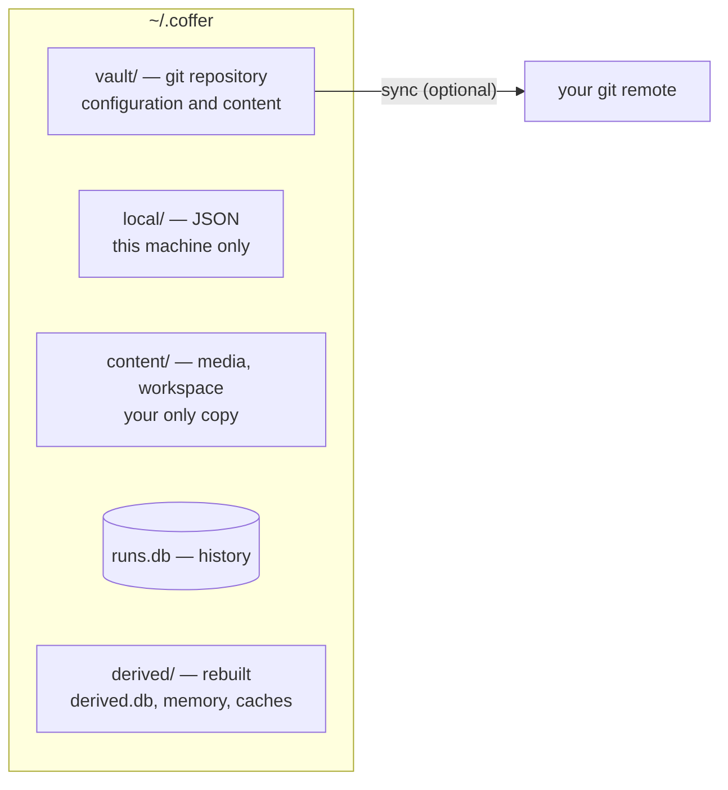
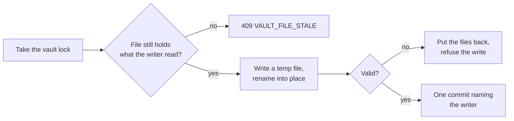
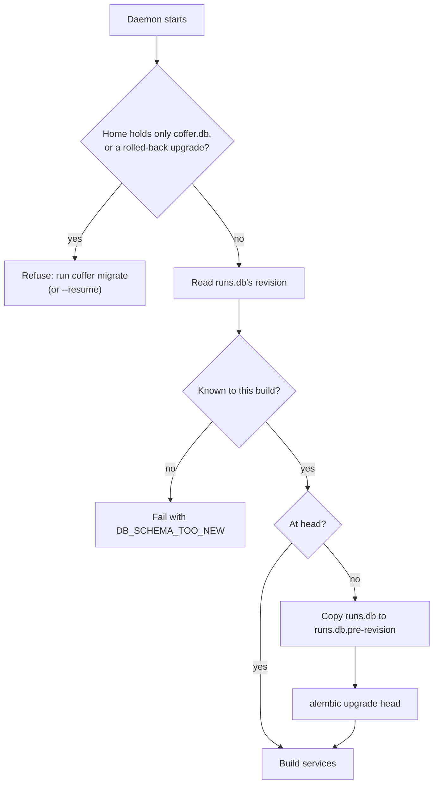

# Persistence

Coffer stores its state under `~/.coffer/` in five **storage classes**, one directory (or file) each, chosen by what the state *is*: your configuration and content, facts about this machine only, your media, history, and things Coffer can rebuild. This page covers what lives in each class, the one path every write into the vault takes, the history database and its migrations, and the two small JSON files the daemon reads before anything else. It is for engineers changing where state lives, debugging a startup failure, or deciding where new state belongs.

## The problem it solves

Coffer's state used to be stored by where the code that wrote it happened to put it. Configuration lived in one SQLite file, `coffer.db`, beside file trees for knowledge and skills. Reach, the sync pointer and chat history sat in the same database as the resources you wanted on every machine. Sync then had to serialize the database into files, translate them back, and remember a rule for every field that must not travel. Every such rule was a place to be wrong.

The state has five different natures, and each wants different treatment:

- **Your configuration and authored content** must be complete on every machine, editable with your own tools, versioned, and able to travel.
- **Facts about this machine** (which agents are enabled here, the sync remote, retention) must never travel, and can be set again if lost.
- **Media and the chat workspace** are your only copy, but large and not worth syncing.
- **History** (audit, invocations, conversations) is append-only and pruned.
- **Derived state** (health checks, caches, the memory tree) can be rebuilt from the rest.

So the class decides the directory, and the directory decides whether something can travel. "Reach never syncs" stops being a rule a translator has to remember and becomes a fact about where reach is stored.

## Design decisions

| Decision | Reason |
| --- | --- |
| Five classes, one directory each: `vault/`, `local/`, `content/`, `runs.db`, `derived/`. | Where a fact lives says whether it syncs, whether it has history, and whether deleting it is safe. |
| The vault is a git repository from the first use, whether or not it syncs. | Every change has a version, a writer and a diff; restoring is a commit; sync only adds a remote. |
| Vault documents are JSON files, one per resource or state area, with the uid inside. | You can read and edit them in any editor; unknown top-level fields are kept in place, while a config key the kind does not declare is refused; the uid, not the path, is the identity. |
| Every vault write goes through one writer: lock, compare-and-swap, validate, one commit naming the writer. | Three writers (you, the daemon, sync) change the vault and none waits for the others. None can silently overwrite another. |
| `runs.db` holds history only, as the one Alembic lineage, keyed by uid. | History is relational, append-only and pruned; it never travels. |
| `derived/` is rebuilt, never migrated. `derived.db` is recreated when its schema version differs. | Nothing there is the only copy of a fact, so deleting it is always safe. |
| Local state is small JSON files written atomically under a per-file lock. | It is read often, written rarely, and can be set again; a second migration lineage would cost more than it saves. |
| Pre-bind settings stay in `daemon-config.json` directly under `~/.coffer`. | The port must be known before anything else is opened or upgraded. |

## The five classes


```mermaid
flowchart LR
  subgraph home["~/.coffer"]
    V["vault/ — git repository<br/>configuration and content"]
    L["local/ — JSON<br/>this machine only"]
    C["content/ — media, workspace<br/>your only copy"]
    R[("runs.db — history")]
    D["derived/ — rebuilt<br/>derived.db, memory, caches"]
  end
  V -- "sync (optional)" --> Remote["your git remote"]
```

| Class | Where | What it holds | Syncs | History | Safe to delete |
| --- | --- | --- | --- | --- | --- |
| **vault** | `vault/` | Resource definitions, state documents, knowledge, skills, memory triggers, secret ciphertext, machine descriptors. | Yes, when a remote is set | Git | No: it is the only copy |
| **local** | `local/` | Machine-local resources (agents), reach, the sync remote, retention, the secret boundary's approvals, machine-local ciphertext. | Never | No | You lose settings you would set again |
| **content** | `content/` | Chat and channel attachments, the chat workspace. | Not yet | No | No: it is your only copy |
| **runs** | `runs.db` | Audit log, MCP invocations, conversations, channel threads and outbox, sync rounds, usage, quota. | Never | It *is* history | You lose history |
| **derived** | `derived/` | `derived.db`, the memory tree, the agent transcript cache, Coffer's own guide skill, editor copies of sync conflicts. | Never | No | Yes: it is rebuilt |

Which class a resource belongs to is declared by its kind, with a per-row refinement: most kinds live in the vault, `agent` is local (an agent's config directory is a fact about this machine), `memory` partitions are derived, and the builtin `coffer-guide` skill is derived because every machine renders its own.

### The vault

```text
~/.coffer/vault/
├── manifest.json                       {"schema_version": 3}
├── resources/<kind>/<name>.json        mcp_server, skill, channel, provider, knowledge
├── state/mcp-preferences/<server>.json the capabilities you switched off
├── state/channel-peers/<channel>.json  paired identities per channel
├── state/settings/internal-engine.json Coffer's model and upkeep settings (absent = defaults)
├── knowledge/<collection>/…            Markdown documents, hidden .inbox/ for new material
├── skills/<name>/…                     skill master folders
├── memory-triggers/<id>.md             triggers you wrote or armed
├── secret/<ref>.enc                    Fernet ciphertext, one file per secret
└── machines/<machine id>.json          one descriptor per machine that syncs
```

A resource file carries its identity, format version, name, description and config, and nothing machine-local:

```json
{
  "uid": "5f0c1e9a2b7d4c3e8a6f9b0d1c2e3f4a",
  "kind": "mcp_server",
  "format_version": 1,
  "name": "jira",
  "description": "Company Jira",
  "config": {
    "transport": {
      "type": "stdio",
      "command": "${HOME}/.local/bin/jira-mcp",
      "args": [],
      "secret_refs": { "JIRA_TOKEN": "jira-token" }
    }
  }
}
```

- **Identity is the `uid` inside the file.** The path is only where Coffer files it: you may move or rename the file and it is still the same resource. A file with no uid gets one in a daemon commit. Two files with one uid: the newcomer is refused and flagged, the original stays in effect.
- **Every document carries `format_version`.** A file older than the build is read through an in-memory upgrade chain and not rewritten on an ordinary write; a newer one is read-only, or flagged if this build cannot read it. Unknown fields are kept where they were. See [Every Vault File Carries Its Own Format Version](https://github.com/wyx-sg/Coffer/blob/main/docs/decisions/every-vault-file-carries-its-format-version.md).
- **Paths under your home** are written against `${HOME}` and expanded on each machine.
- **Reach is not in the file.** Whether a resource is enabled here, and for which agents, is in `local/reach.json`.
- **`updated_at` is not in the file.** It is the file's modification time on this machine; no revision counter or index is kept.

What Coffer ignores in the repository is written into `.git/info/exclude`, never into a tracked `.gitignore` another machine could change: editor and system litter, hidden entries inside collections (except `.inbox/`), and `secret/` unless your sync remote carries secrets.

### Local

```text
~/.coffer/local/
├── resources/agent/<name>.json   agents are machine-local resources
├── reach.json                    {uid: {enabled, agents, projects}}
├── tool-reach.json               custom tools' per-tool reach
├── engine.json                   when this machine last changed engine settings
├── retention.json                retention policy per prunable table
├── curation.json                 the content each knowledge document had when curation settled it
├── skill-source-status.json      what this machine last found at a Git-imported skill's source
├── secret/                       machine-local ciphertext (proxy tokens)
├── secret-boundary/              bindings, approvals, switches, first-stored times
├── sync/remote.json              the one sync remote
├── sync/round.json               a stopped round, a hold, a join's pending choices
└── migration.json                the record of the one-time upgrade
```

Each file is one JSON object, read whole, changed under a per-file lock and written back atomically (a sibling temp file, then a rename). A missing file reads as empty. A file that does not parse is moved aside as `<name>.unreadable-<n>`, logged, and read as empty: local state can be set again, and a daemon that refuses to start over a settings file is worse than one that forgets them.

### Content

`content/chat-media/` (files attached on the Conversations page), `content/channel-media/` (attachments downloaded from chat platforms) and `content/workspace/` (the default working directory for chat turns). Both media folders are pruned by age. Content is your only copy and does not sync.

### runs.db

`~/.coffer/runs.db` (with its `-wal` and `-shm` companions) is SQLite in WAL mode, written only by the daemon through SQLAlchemy's async ORM over aiosqlite. `COFFER_DB_URL` names another database. It holds history only, and every row that refers to a resource names its uid (`resource_uid`, `skill_uid`, `agent_uid`), never a row number:

| Table | Purpose |
| --- | --- |
| `audit_log` | Every lifecycle change: time, event type, actor, the resource's uid and its kind and name at the time, redacted details. |
| `mcp_invocations` | One row per tool call through the gateway, written by a batched writer. Pruned after 30 days by default. |
| `conversations`, `chat_messages` | Conversation metadata and message history for the Conversations page and every channel. Idle conversations are archived after 7 days and archived ones deleted after 30, by default. |
| `channel_thread_conversations`, `channel_thread_history` | Which conversation an IM thread maps to, and every conversation a thread has opened. |
| `channel_outbox` | Replies Coffer owes a chat and has not delivered yet. |
| `sync_runs` | Every sync round this machine has run. Pruned after 90 days by default. |
| `usage_requests`, `usage_daily` | Upstream attempts the model proxy spooled, and the per-day rollup the Usage page reads. |
| `quota_snapshots` | The latest official subscription quota each feed reported. |
| `attention_ignores` | The informational "needs you" items a person ignored on this machine, by item key, with when. The attention list leaves them out of its items and counts. |

::: details Tables no code reads
The migration chain also creates `workflow_runs`, `workflow_events`, `workflow_node_attempts` and `workflow_approvals`. No module in this build reads them; they exist because migrations are one linear history and later revisions build on the ones that created them.
:::

Every connection runs this pragma suite:

| Pragma | Value | Why |
| --- | --- | --- |
| `journal_mode` | `WAL` | Readers proceed while the daemon writes. |
| `foreign_keys` | `ON` | SQLite ignores foreign keys unless asked. |
| `synchronous` | `NORMAL` | Safe with WAL, and much cheaper than `FULL`. |
| `busy_timeout` | `5000` | Wait up to five seconds for a lock instead of failing at once. |
| `cache_size` | `-64000` | About 64 MB of page cache. |
| `temp_store` | `MEMORY` | Temporary tables and indexes in memory. |

### Derived

```text
~/.coffer/derived/
├── derived.db                   MCP server health, skill deliveries, capability first/last seen
├── memory/<partition>/          the memory tree (MEMORY.md, notes/, RETIRED.md, .raw/)
├── cache/agent/                 agent transcript cache
├── resources/                   derived resource files (memory partitions, coffer-guide)
├── skills/coffer-guide/         Coffer's own guide skill, rendered from the build
└── sync-conflicts/              editor copies of a stopped round's conflicting files
```

`derived.db` has no Alembic lineage. Its tables are created at open, and its `PRAGMA user_version` is compared with the build's: a file at any other version is deleted and created again. Deleting all of `derived/` with the daemon stopped is always safe; **Settings → Data** clears the caches for you.

## The one write path into the vault

Three writers change the vault: you (an editor, a shell, an agent's file tools), the daemon (a save in the web UI, a CLI or API change, a curation pass) and sync. Every change any of them makes is admitted the same way, by the one vault writer:


```mermaid
flowchart LR
  A["Take the vault lock"] --> B{"File still holds<br/>what the writer read?"}
  B -- no --> X["409 VAULT_FILE_STALE"]
  B -- yes --> C["Write a temp file,<br/>rename into place"]
  C --> D{"Valid?"}
  D -- no --> Y["Put the files back,<br/>refuse the write"]
  D -- yes --> E["One commit naming<br/>the writer"]
```

1. **Compare.** A write states what it expects the file to hold: the fingerprint of the bytes it read, "absent", or "what `HEAD` holds". Under the lock the file is re-read and compared. A mismatch is `VAULT_FILE_STALE` (409). There is no unconditional mode, and a modification time never decides anything. The content APIs (saving a skill file, a knowledge document, a restore) require the fingerprint.
2. **Write** a sibling temp file and rename it into place.
3. **Validate** every touched path with the same rules a hand edit and a sync merge meet. A blocking finding puts every file back.
4. **Commit** exactly the touched paths as one commit. Its trailers name the writer (`Coffer-Writer: user`, `disk`, `agent`, `daemon`, `curation` or `sync`), the operation, and where relevant the actor, the agent, the machine, or the version a restore came from.

A hand edit is found, not intercepted. File events are a hint (debounced until the path has been quiet for a second), a scan every 60 seconds and at boot is the truth. A valid edit is committed as a `disk` write and audited as `vault_file_edited` by a human. An invalid one stays in the working tree, uncommitted, and is flagged on the attention list and in `coffer vault problems`, while `HEAD` stays in effect. The effective state is always `HEAD`: the stores read documents from a cache loaded from `HEAD` and refreshed after each commit.

Every file and folder in the vault has a history you can read, diff and restore: `coffer vault history|diff|show|restore`, the REST routes under `/api/v1/vault/`, and the **History** tab of a skill. A restore is a new commit through the same checks. See [Edit the vault by hand](/guides/vault-files).

The vault needs `git`. A machine without it fails at startup with a message saying so. How git is installed depends on the machine, so the `GIT_MISSING` error names no installer. It carries the install hand-off for the person's agent in `details.handoff`, and the Sync status reports the problem `git_missing` with the same prompt.

## Migrations of runs.db

Schema changes to `runs.db` are Alembic revisions kept in the persistence package, one file per revision named `YYYYMMDD_NNNN_<slug>`. The head is `0138`, which dropped the unused `owner` column from `conversations`. `0137` added the correlation ids to the audit log, and `0136`, before it, turned the old database into `runs.db`: it re-keyed the history tables to uids and dropped every table whose state moved into files. A schema change is always a migration, never tables created implicitly from the models.

Migrations run in the daemon's lifespan, before any service is built:


```mermaid
flowchart TB
  A["Daemon starts"] --> H{"Home holds only coffer.db,<br/>or a rolled-back upgrade?"}
  H -- yes --> Z["Refuse: run coffer migrate<br/>(or --resume)"]
  H -- no --> B["Read runs.db's revision"]
  B --> C{"Known to this build?"}
  C -- no --> X["Fail with DB_SCHEMA_TOO_NEW"]
  C -- yes --> D{"At head?"}
  D -- yes --> G["Build services"]
  D -- no --> E["Copy runs.db to runs.db.pre-revision"]
  E --> F["alembic upgrade head"]
  F --> G
```

- **Backups.** Before an upgrade the runner copies the database, with its `-wal` and `-shm` companions, to `runs.db.pre-<revision>`. An existing copy is never overwritten, and only the three newest are kept. To undo a bad migration, stop the daemon, move `runs.db` aside, rename the matching copy back, and start the previous build.
- **A schema from a newer build.** A revision this build does not know stops the daemon with `DB_SCHEMA_TOO_NEW` before anything is touched, following the principle of [detecting rather than guessing](/architecture/design-principles#detect-never-refuse).
- **An old home.** A home that still holds only `coffer.db` is not migrated by the daemon. It refuses to start with `VAULT_MIGRATION_REQUIRED` and names `coffer migrate`, the one-time upgrade you run yourself. See [Upgrading an existing Coffer](/guides/upgrading).

## Secrets at rest

A secret's ciphertext is a file, `vault/secret/<ref>.enc`: the Fernet token and a trailing newline, mode `0600` in a `0700` directory. Machine-local refs such as the model proxy's tokens live in `local/secret/` instead and never enter the vault. Ciphertext is safe in the vault because the key is not: the master key stays in the OS secret store or the `0600` file `~/.coffer/master.key`. Whether `vault/secret/` is committed is decided by your sync remote's `include_secret` setting; until then it is excluded from the repository. The secret boundary's bindings, approvals and switches are in `local/secret-boundary/`. See [Security model](/architecture/security).

## Settings that live outside every class

Two small JSON files sit directly under `~/.coffer`. `daemon.json` is runtime state the daemon writes at start and removes at exit (pid, port, token): the rendezvous every surface reads to find the daemon. `daemon-config.json` is configuration the daemon reads before it binds: the fixed port, the model proxy's port, the machine name and id, and the experimental-feature switches. It must be readable before any upgrade runs, so it is neither vault nor local state. Both are written atomically at mode `0600`. Their contents are described in [Daemon and processes](/architecture/daemon#two-files-configuration-in-runtime-state-out) and, key by key, in [Configuration](/reference/configuration#daemon-config-json).

## Trade-offs

- **Configuration as files gives up database constraints.** One validator, run on every write whatever its source, takes their place, and an invalid file never reaches `HEAD`.
- **Every vault write is a git commit.** Commits are small and local; the cost is a git process per operation, which is why structured writes are batched into one commit per operation.
- **A person can edit any file.** That is the point, and it is why every write compares before it writes and an invalid edit is flagged rather than applied.
- **`runs.db` still migrates in place.** The pre-migration copy and the too-new guard make that safe, and history is the only thing left in it.
- **Leaving content as files means no query over content.** Coffer does not need one: retrieval is an agent reading files, and the catalogue is generated.

## Where it lives in the code

| Place | Contents |
| --- | --- |
| The `vault` package in the domain layer | Layout, documents, format versions, writers and trailers. |
| The `vault` package in the application layer | Validation rules, history and restore, problems. |
| The `vault` package in the infrastructure layer | The class roots under `~/.coffer`, the repository, the writer, the scanner, the resource and state stores, reach, local JSON, the one-time upgrade. |
| The `persistence` package in the infrastructure layer | The runs.db engine, models and Alembic revisions; `derived.db`; the migration runner (startup migration, backup, too-new guard, the refusal of an old home), which both the daemon's startup and `coffer migrate` call. |
| The `secret` package in the infrastructure layer | Secret ciphertext as files. |
| The `daemon` package in the infrastructure layer | `daemon-config.json`. |

## Related

- [Files and directories](/reference/filesystem) · [Vault sync](/architecture/vault-sync) · [Resource framework](/architecture/resource-framework) · [Security model](/architecture/security)
- Decision records: [Storage Is Five Classes by Nature](https://github.com/wyx-sg/Coffer/blob/main/docs/decisions/storage-is-five-classes-by-nature.md), [Identity Is the uid Inside the File](https://github.com/wyx-sg/Coffer/blob/main/docs/decisions/identity-is-the-uid-inside-the-file.md), [Every Vault Write Is a Validated Commit Naming Its Writer](https://github.com/wyx-sg/Coffer/blob/main/docs/decisions/every-vault-write-is-a-validated-commit-naming-its-writer.md)
- Spec: [daemon](https://github.com/wyx-sg/Coffer/blob/main/openspec/specs/daemon/spec.md)
