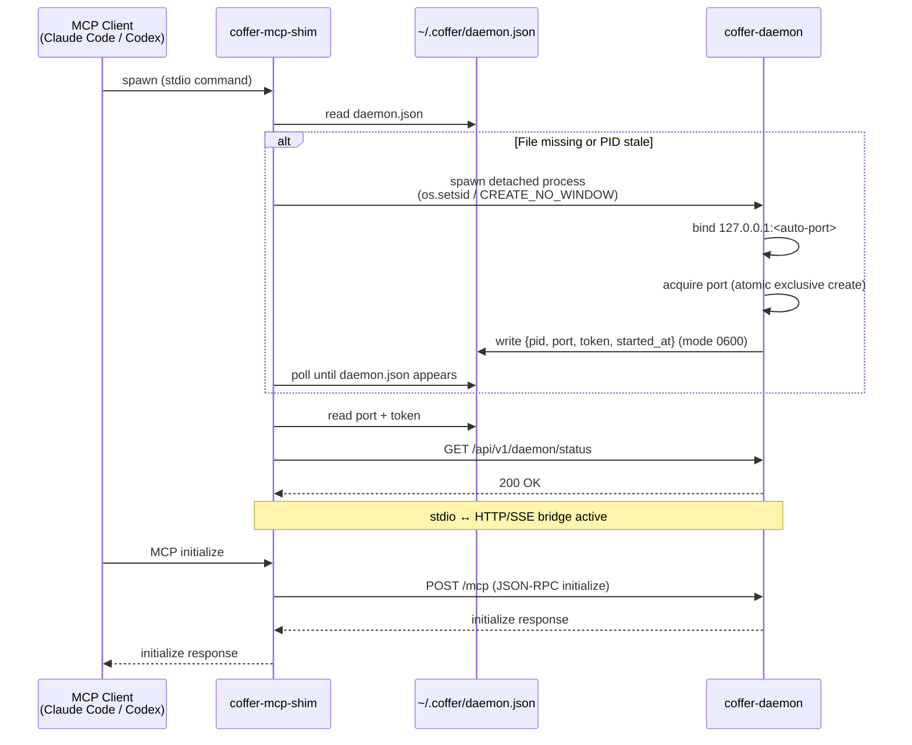

# Daemon & Processes

Coffer is built around a clear separation of concerns between processes: one long-lived daemon that owns all state, short-lived entry points that talk to it, and per-session subprocess trees for upstream MCP servers.

## The three process roles

### coffer-daemon

The daemon is the system's center of gravity. It is a FastAPI application bound to `127.0.0.1:<auto-port>` — default 8000, falling back to the next free port in a small bounded range if 8000 is taken. The daemon:

- Is the **single SQLite writer**. No other process opens the database for writes. This makes WAL-mode isolation trivially correct and eliminates the class of bugs caused by concurrent schema modifications.
- Owns all in-memory session state for connected MCP clients.
- Spawns and supervises upstream MCP server subprocesses (one set per connected client session — see [Upstream session model](#upstream-session-model) below).
- Persists control-plane state: resource registrations, capability preferences, audit log, retention policies.
- Does **not** auto-shutdown. The daemon keeps running until `coffer daemon stop` or a system shutdown. This is intentional: the daemon's job is to outlive any single client or CLI invocation.

### stdio shim (coffer-mcp-shim)

The shim is a lightweight bridge process, one per MCP client session. Its entire job is to translate between the MCP client's stdio interface (what tools like Claude Code and Codex expect) and the daemon's HTTP/SSE MCP endpoint. The shim:

- Is spawned by the MCP client on client startup, using the client's normal "command" configuration (e.g., `claude mcp add coffer coffer-mcp-shim`).
- Reads `~/.coffer/daemon.json` to find the running daemon's port and token.
- If no running daemon is found, spawns `coffer-daemon` as a detached background process, then waits briefly for `daemon.json` to appear and connects.
- Forwards stdin/stdout ↔ daemon HTTP/SSE for the duration of the MCP session.
- Exits when the MCP client exits. Its exit does **not** bring down the daemon — other shims and other clients continue unaffected.

### coffer CLI

The CLI (`coffer …`) is a short-lived child process. Users invoke it for management tasks: registering servers, listing tools, checking status. It calls the daemon over loopback HTTP, carrying the `X-Coffer-Token` from `~/.coffer/daemon.json`, and exits after each command. Like the shim, it uses detect-or-spawn to ensure a daemon is running before issuing its request.

## Detect-or-spawn (ADR-006)

The detect-or-spawn pattern ensures that any Coffer entry point can bootstrap the system — the user never sees "daemon not running" as a user-facing error.

::: tip Invariant
The daemon is never required to be started manually. Any `coffer` command and any `coffer-mcp-shim` invocation transparently starts the daemon if it is not already running.
:::

The discovery mechanism centers on `~/.coffer/daemon.json` — a JSON file written atomically by the daemon on startup, containing `{pid, port, token, started_at}`. The file has mode `0600` (owner-read-only), so only the local user account can read the token.

The detect-or-spawn algorithm, shared by both the shim and the CLI:

1. Attempt to read `~/.coffer/daemon.json`.
2. If the file exists and the PID listed in it is alive, connect to `127.0.0.1:<port>` with the token.
3. If the file does not exist, or the PID is stale (daemon crashed or was killed), spawn `coffer-daemon` as a detached process with stdio redirected to `~/.coffer/logs/daemon.log`, then wait briefly for `daemon.json` to appear.
4. Once `daemon.json` is present and the PID is live, connect.

A race condition is possible when two entry points simultaneously detect absence and both attempt to spawn. This is mitigated by the daemon writing `daemon.json` via an atomic exclusive create (`O_CREAT|O_EXCL`, mode 0600) and refusing to start if a valid `daemon.json` already contains a live PID.

## Startup sequence

The following diagram traces the full flow from an MCP client launching through to the shim being ready to forward requests:

## Upstream session model (ADR-005)

When a downstream MCP client connects (via the shim or directly to `/mcp`), the daemon creates a `MCPGatewaySession` that owns all upstream subprocess state for that connection.

**One set of subprocesses per downstream client session.** If Claude Code and Codex are both running simultaneously, the daemon maintains two independent sets of upstream subprocesses — one for each client. They do not share subprocess state.

This design choice preserves MCP protocol correctness. The MCP protocol begins every connection with an `initialize` handshake that negotiates protocol version and capabilities. Sharing one upstream subprocess across two client sessions would require the daemon to re-implement session multiplexing on top of a protocol not designed for it, creating a bookkeeping layer for notification routing (which client should receive `tools/list_changed`? which request ID maps to which client?) that is both complex and a source of subtle bugs.

::: tip Why per-session subprocesses?
Protocol correctness beats resource efficiency at single-user scale. N × M subprocesses (N clients × M upstreams) sounds large, but N rarely exceeds 3 for a developer and most stdio MCP servers start in under a second and use under 100 MB of memory.
:::

**Lazy spawn.** Subprocesses are not started when the session opens — they are started on first need (first `tools/list` or first call routed to that upstream). Only upstreams that are actually used in a session pay the spawn cost.

**Session teardown.** When the downstream client disconnects (shim exits, HTTP/SSE connection closes), the session is disposed and all its upstream subprocesses are reaped. Orphaned upstream subprocesses from a daemon crash are cleaned up at the next daemon startup using PID files in `~/.coffer/upstream-pids/`.

**Capability discovery.** Each session maintains a 60-second in-memory cache of capability lists (tools, resources, prompts) per upstream. Cache invalidation triggers: TTL expiry, an upstream `notifications/*/list_changed` notification, user-initiated refresh, or upstream session restart. Capability names and schemas are never persisted to the database — only user preference flags (enabled/disabled) are stored, keyed on the capability name. See [ADR-004](/reference/adr/ADR-004-capability-state-model).

## Rejected alternatives

**Manual daemon startup.** Requiring `coffer daemon start` before any client interaction was rejected because it forces users to remember a setup step before every MCP session. Detect-or-spawn eliminates this friction.

**Entry-point-owned daemon.** Tying the daemon's lifecycle to the shim or CLI process that started it was rejected because a second client's shim would lose its daemon when the first client exited. The daemon must outlive all entry points.

**Shared upstream subprocess pool.** A daemon-level singleton subprocess shared across all sessions was rejected for the same reasons as the multiplexing approach: protocol-level session semantics cannot be cleanly emulated, notification routing becomes a bug surface, and a daemon restart would invalidate all sessions simultaneously.

**Eager subprocess spawn.** Starting all registered upstream servers when a session opens was rejected because most sessions use only a subset of registered upstreams. Eager spawn adds latency at session start (the moment users notice most) and wastes resources on servers that are never called.

---

**See also:** [ADR-006: Daemon detect-or-spawn](/reference/adr/ADR-006-daemon-detect-or-spawn), [ADR-005: Session subprocess model](/reference/adr/ADR-005-session-subprocess-model)
