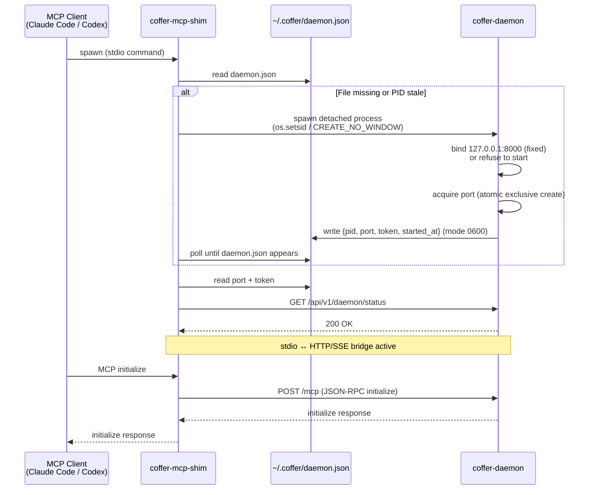

# Daemon & Processes

Coffer is built around a clear separation of concerns between processes: one long-lived daemon that owns all state, short-lived entry points that talk to it, per-session subprocess trees for upstream MCP servers, and — while a SeaTalk channel on webhook delivery is enabled — a daemon-spawned callback listener for inbound webhooks.

## The process roles

### coffer-daemon

The daemon is the system's center of gravity. It is a FastAPI application bound to `127.0.0.1:8000` — a **fixed** port, not the head of a scan (see [The port is fixed](#the-port-is-fixed) below). The daemon:

- Is the **single SQLite writer**. No other process opens the database for writes. This makes WAL-mode isolation trivially correct and eliminates the class of bugs caused by concurrent schema modifications.
- Owns all in-memory session state for connected MCP clients.
- Spawns and supervises upstream MCP server subprocesses (one set per connected client session — see [Upstream session model](#upstream-session-model-adr-session-subprocess-model) below).
- Persists all control-plane state: resource registrations, capability preferences, audit log, retention policies, the encrypted credential store, chat conversations and turns, channel bindings, and sync state. Knowledge and memory are **not** in that list: they are directories of Markdown files, with nothing in `coffer.db` mirroring or indexing them.
- Outlives any single client or CLI invocation. It keeps running until `coffer daemon stop`, a system shutdown, or a long enough stretch with nothing using it (see [Resident, but not forever](#resident-but-not-forever)).

### Resident, but not forever

The daemon can be installed as a **login service** — a per-user launchd agent — so it is already running before anything asks for it:

```bash
coffer daemon service install    # start at login, restart after a crash
coffer daemon service status
coffer daemon service uninstall
```

This matters because most of what talks to Coffer has no window: an agent in a terminal, an editor plugin, a chat channel. Started only on demand, the daemon is down at exactly those moments, and whoever asks first pays the five-to-fifteen seconds a cold start takes. The Settings → General page has the same switch.

A resident daemon needs a ceiling, or it survives every weekend nobody worked. So it **stands down after a long enough silence** — twelve hours by default:

```bash
coffer daemon idle show
coffer daemon idle set 4        # hours
coffer daemon idle never        # for a vault whose channels must answer at any hour
```

What counts as use is a request that reached the application — a request the loopback host guard refused is an attack, not use. Readiness counts too: while a channel listener is up the daemon is never idle, because the message that justifies it arrives the next morning. The clock is monotonic, so a laptop that slept did not thereby go unused. Standing down is a **clean exit**, which is why the launchd agent restarts only *unsuccessful* ones — otherwise the shutdown would be undone a second later. Whatever next needs a daemon starts one, as every client already knows how to do.

### The port is fixed

With nothing configured the daemon binds **exactly 8000**, and when it cannot have that port it **refuses to start** rather than moving — naming the process that holds it and the commands that resolve the conflict. The old behaviour, a scan forward through 8000–8009, survives only under the `COFFER_PORT_RANGE_*` environment override that the test harness uses.

A drifting origin is not merely a broken bookmark. Browser `localStorage` is keyed by origin, so the UI language, sidebar state, page size and preferred editor silently reset whenever the port moves, and nothing connects the two events for the user. Fixing a default and allowing it to be changed is also what comparable local services with a web UI do (Ollama, Syncthing, Grafana, Home Assistant); the tools that scan forward — Jupyter, Vite — print their real URL on every start and nobody bookmarks them.

The setting lives in **`~/.coffer/daemon-config.json`** (mode `0600`), and it has to, for two reasons that rule out every other home:

- It cannot be a database-backed setting, because the port is chosen before the database is opened and before migrations have created any table to read.
- It cannot be an environment variable, because the daemon is spawned *detached* by whichever surface first needs one — the CLI, an MCP shim, the desktop shell — and inherits **that caller's** environment. A shell profile reaches the user's own terminal and nothing else.

So it is a small file beside `daemon.json`, read with nothing but the standard library. The two files are deliberately a pair and deliberately distinguishable: `daemon-config.json` is configuration, goes *in*, and survives shutdown; `daemon.json` is runtime state, comes *out*, and is unlinked on exit. A hand-mangled config file does not stop the daemon — it warns and falls back to 8000, because an unreadable file that blocked startup would be unrecoverable from a UI that needs a running daemon to appear.

Its only surface is the CLI:

```bash
coffer daemon port show      # the port it will bind, and the port it is actually on
coffer daemon port set 8123  # pin one; takes effect at the next start
coffer daemon port clear     # back to 8000
coffer daemon restart        # apply it
```

`coffer daemon port` reads and writes that file **directly, with no daemon involved and none required** — which is the whole point, because the state this setting most needs changing from is "no daemon is running". It deliberately has no REST endpoint and no Settings panel: a port that is correct by default does not earn a place in the UI, and the escape hatch belongs where a squatted port is actually diagnosed. It is equally deliberately **outside the audit requirement** — the audit table is unreachable on exactly the path that matters most, and recording a change only when a daemon happened to be up would be less honest than recording none.

### stdio shim (coffer-mcp-shim)

The shim is a lightweight bridge process, one per MCP client session. Its entire job is to translate between the MCP client's stdio interface (what tools like Claude Code and Codex expect) and the daemon's HTTP/SSE MCP endpoint. The shim:

- Is spawned by the MCP client on client startup, using the client's normal "command" configuration (e.g., `claude mcp add coffer coffer-mcp-shim`).
- Reads `~/.coffer/daemon.json` to find the running daemon's port and token.
- If no running daemon is found, spawns `coffer-daemon` as a detached background process, then waits briefly for `daemon.json` to appear and connects.
- Forwards stdin/stdout ↔ daemon HTTP/SSE for the duration of the MCP session.
- Exits when the MCP client exits. Its exit does **not** bring down the daemon — other shims and other clients continue unaffected.

### coffer CLI

The CLI (`coffer …`) is a short-lived child process. Users invoke it for management tasks: registering servers, listing tools, checking status. It calls the daemon over loopback HTTP, carrying the `X-Coffer-Token` from `~/.coffer/daemon.json`, and exits after each command. Like the shim, it uses detect-or-spawn to ensure a daemon is running before issuing its request.

### desktop shell (Coffer.app)

The desktop shell is a native macOS process the *user* starts (Dock, Spotlight, Cmd-Tab), hosting the same web UI build in a webview. For the process model, what matters is that it is a **fourth detect-or-spawn caller** alongside the shim and the CLI, with one extra rule: it resolves a daemon in a fixed order — a live daemon named by `daemon.json`, then its own app bundle, then `~/.coffer/bin/`, then `PATH` — and the liveness probe comes **first**, so it takes over a running daemon rather than starting a second one. Under the fixed port that second daemon could not bind anyway, so getting the order wrong would turn "attach to what is already there" into a startup error. Quitting the app does not stop the daemon. See [Surfaces](/architecture/surfaces#desktop-shell-cofferapp) and [Distribution](/architecture/distribution#the-desktop-shell-and-what-it-owns).

### callback listener (coffer-callback)

The callback listener is a daemon-spawned child process that exists only to accept inbound SeaTalk webhooks. Unlike the shim and CLI — which the user (or an MCP client) starts — the listener is spawned and supervised by the daemon itself. It:

- Runs **only while a SeaTalk channel on webhook delivery is enabled**. The channel reconciler starts it when the first webhook SeaTalk channel comes up and stops it when the last one goes away. A channel on websocket delivery needs no listener: the daemon holds that channel's outbound connection on a worker thread of its own (ADR seatalk-websocket-inbound).
- Serves exactly one route, `POST /seatalk/{channel}`, on a loopback port (default `8787`, overridable via `COFFER_CALLBACK_PORT`). It holds no other state and can reach nothing but the daemon.
- Verifies each callback's SeaTalk signature, answers the platform's verification handshake, and forwards valid events to the daemon over loopback carrying the daemon token. A tunnel points at the listener's port — the managed `cloudflared` the daemon spawns and supervises for a channel that records a connector token, or one the owner runs (cloudflared/ngrok); the daemon itself stays loopback-only.
- Gets its signing secrets, the daemon URL, and the daemon token injected into its environment at spawn (the upstream-subprocess pattern — secrets land only in the child's env, never on disk). Its spawn is recorded in `~/.coffer/upstream-pids/` so a daemon crash leaves nothing behind: the startup orphan sweep reaps it. A daemon-token rotation respawns the listener.

## Supervised background workers

Beyond the subprocesses above, the daemon runs a set of in-process background workers — supervised asyncio tasks, not separate processes — that keep vault state converging without any user action. Six are started at composition time (`surfaces/http/background_workers.py`), in dependency order, plus the channel reconciler:

| Worker             | What it does                                                                                                   |
| ------------------ | -------------------------------------------------------------------------------------------------------------- |
| Retention          | Prunes log-style tables (audit log, invocation log, sync rounds) according to the configured retention policies. |
| Converge (sync)    | A converge round against the configured git remote on a timer, re-reading its interval from the remote. A no-op until the user configures one. Wired **first** among the vault rewriters: the curation worker takes its lock and state. |
| Curation           | The knowledge curation pass — a sweep every minute that merges each collection's inbox into its documents, then carries out-of-band edits outward. |
| Memory distil      | The distil pass over each memory partition — on by default, because the tree it rewrites is derived and rebuildable. |
| Memory aggregate   | Re-derives Coffer's memory tree from the agents' own native memory: a catch-up pass at startup, then hourly. It only reads the agents' memory and only writes the derived tree, so it waits on none of the vault rewriters above. |
| Transcript warm    | Warms the transcript-summary cache, so the first visit to an agent's Conversations tab is never the one that pays the cold read. |
| Channel reconciler | On every tick it diffs enabled channel resources against running adapters and starts/stops/restarts to match — and starts or stops the callback listener with the set of webhook SeaTalk channels. REST/CLI/UI never start or stop adapters directly; the reconciler owns all runtime state transitions, which keeps status truthful. |

Three of these — curation, distil and aggregate — are the **unattended passes**: each has its own on/off switch and interval under **Settings → Coffer's model** (`/settings/engine`), and what they are doing right now is readable at `GET /api/v1/upkeep/runs`. An unattended rewriter should be something the user turned on, never something they discover running.

Vault sync is emphatically *not* a request-scoped operation. `coffer sync now` forces a round, but the converge worker runs rounds on its own, and the vault converges **bidirectionally** with the remote under git's own three-way merge. One-shot export and import no longer exist.

## Detect-or-spawn (ADR daemon-detect-or-spawn)

The detect-or-spawn pattern ensures that any Coffer entry point can bootstrap the system — the user never sees "daemon not running" as a user-facing error.

::: tip Invariant
The daemon is never required to be started manually. Any `coffer` command and any `coffer-mcp-shim` invocation transparently starts the daemon if it is not already running.
:::

The discovery mechanism centers on `~/.coffer/daemon.json` — a JSON file written atomically by the daemon on startup, containing `{pid, port, token, started_at}`. The file has mode `0600` (owner-read-only), so only the local user account can read the token.

The detect-or-spawn algorithm, shared by both the shim and the CLI:

1. Attempt to read `~/.coffer/daemon.json`.
2. If the file exists and the PID listed in it is alive, connect to `127.0.0.1:<port>` with the token.
3. If the file does not exist, or the PID is stale (daemon crashed or was killed), spawn `coffer-daemon` as a detached process with stdio redirected to `~/.coffer/logs/daemon.log`, then wait briefly for `daemon.json` to appear.
4. Once `daemon.json` is present and the PID is live, connect.

A race condition is possible when two entry points simultaneously detect absence and both attempt to spawn. This is mitigated by the daemon writing `daemon.json` via an atomic exclusive create (`O_CREAT|O_EXCL`, mode 0600) and refusing to start if a valid `daemon.json` already contains a live PID.

## Startup sequence

The following diagram traces the full flow from an MCP client launching through to the shim being ready to forward requests:



## Upstream session model (ADR session-subprocess-model)

When a downstream MCP client connects (via the shim or directly to `/mcp`), the daemon creates a `MCPGatewaySession` that owns all upstream subprocess state for that connection.

**One set of subprocesses per downstream client session.** If Claude Code and Codex are both running simultaneously, the daemon maintains two independent sets of upstream subprocesses — one for each client. They do not share subprocess state.

This design choice preserves MCP protocol correctness. The MCP protocol begins every connection with an `initialize` handshake that negotiates protocol version and capabilities. Sharing one upstream subprocess across two client sessions would require the daemon to re-implement session multiplexing on top of a protocol not designed for it, creating a bookkeeping layer for notification routing (which client should receive `tools/list_changed`? which request ID maps to which client?) that is both complex and a source of subtle bugs.

::: tip Why per-session subprocesses?
Protocol correctness beats resource efficiency at single-user scale. N × M subprocesses (N clients × M upstreams) sounds large, but N rarely exceeds 3 for a developer and most stdio MCP servers start in under a second and use under 100 MB of memory.
:::

**Lazy spawn.** Subprocesses are not started when the session opens — they are started on first need (first `tools/list` or first call routed to that upstream). Only upstreams that are actually used in a session pay the spawn cost.

**Session teardown.** When the downstream client disconnects (shim exits, HTTP/SSE connection closes), the session is disposed and all its upstream subprocesses are reaped. Orphaned upstream subprocesses from a daemon crash are cleaned up at the next daemon startup using PID files in `~/.coffer/upstream-pids/`.

**Capability discovery.** Each session maintains a 60-second in-memory cache of capability lists (tools, resources, prompts) per upstream. Cache invalidation triggers: TTL expiry, an upstream `notifications/*/list_changed` notification, user-initiated refresh, or upstream session restart. Capability names and schemas are never persisted to the database — only user preference flags (enabled/disabled) are stored, keyed on the capability name.

## Rejected alternatives

**Manual daemon startup.** Requiring `coffer daemon start` before any client interaction was rejected because it forces users to remember a setup step before every MCP session. Detect-or-spawn eliminates this friction.

**Entry-point-owned daemon.** Tying the daemon's lifecycle to the shim or CLI process that started it was rejected because a second client's shim would lose its daemon when the first client exited. The daemon must outlive all entry points.

**Shared upstream subprocess pool.** A daemon-level singleton subprocess shared across all sessions was rejected for the same reasons as the multiplexing approach: protocol-level session semantics cannot be cleanly emulated, notification routing becomes a bug surface, and a daemon restart would invalidate all sessions simultaneously.

**Eager subprocess spawn.** Starting all registered upstream servers when a session opens was rejected because most sessions use only a subset of registered upstreams. Eager spawn adds latency at session start (the moment users notice most) and wastes resources on servers that are never called.
