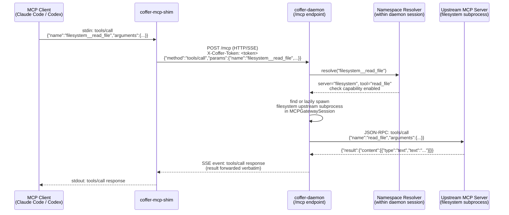

# Request Lifecycle

::: tip Mental model
Coffer now serves **several** request lifecycles, not one. The original — and still the load-bearing — path is the **MCP `tools/call`** lifecycle: MCP client → daemon → upstream server, with the shim translating stdio to HTTP/SSE at the entry and the namespace resolver splitting `filesystem__read_file` into server `filesystem` + tool `read_file` at dispatch. Alongside it run an **agent-chat turn** lifecycle, a **channel-inbound** lifecycle, and a **knowledge (material-in)** lifecycle. This page walks the MCP path in full detail first, then sketches the other three.
:::

## MCP tool-call lifecycle

This is one of Coffer's request lifecycles — the MCP gateway path. The remaining three are summarised at the end of the page.

### Three-step summary

1. **Arrival.** A tool call arrives at the daemon's `/mcp` HTTP/SSE endpoint, either directly (from the shim bridging an MCP client's stdio) or from any process with a valid `X-Coffer-Token`. The call is a JSON-RPC 2.0 `tools/call` request with a namespaced tool name, e.g. `{"method": "tools/call", "params": {"name": "filesystem__read_file", "arguments": {...}}}`.

2. **Namespace resolution.** The daemon splits the `<server-name>__<tool-name>` form to identify the originating upstream (`filesystem`) and the tool's original unprefixed name (`read_file`). It locates the `MCPGatewaySession` for this downstream client connection and finds or lazily spawns the subprocess (or HTTP connection) for the `filesystem` upstream within that session.

3. **Forwarding and return.** The daemon issues a JSON-RPC `tools/call` request to the upstream using the unprefixed tool name, correlates the request by ID, waits for the upstream's response, and returns it to the downstream client unchanged. The upstream's result — whether a successful content payload or a tool-level error — is forwarded verbatim.

## End-to-end sequence diagram



## The shim's role

MCP clients (Claude Code, Codex) expect to talk to MCP servers over stdio: they write JSON-RPC to the server's stdin and read responses from the server's stdout. The daemon, however, exposes MCP over HTTP/SSE (a long-lived SSE channel for server-to-client notifications, with client-to-server requests as HTTP POST). The stdio shim bridges this impedance:

- It is spawned by the MCP client as if it were the upstream MCP server.
- It connects to the daemon's `/mcp` endpoint over HTTP/SSE, authenticating with the token from `~/.coffer/daemon.json`.
- It reads JSON-RPC messages from stdin and issues them as HTTP POST requests to the daemon.
- It reads SSE events from the daemon (responses and notifications) and writes them back to stdout.

From the MCP client's perspective, the shim looks indistinguishable from any other stdio MCP server. From the daemon's perspective, the shim is just another HTTP client — its connection creates a `MCPGatewaySession`.

The `initialize` handshake that follows the connection is handled by the daemon, which presents itself as a single MCP server containing the union of all registered and enabled upstream capabilities.

## Namespacing

The central design choice for aggregating multiple upstream MCP servers without collision is the double-underscore namespace: every tool, resource, and prompt exposed through Coffer carries the originating server's registered name as a prefix.

| Upstream server                  | Upstream tool name    | Coffer-namespaced name        |
| -------------------------------- | --------------------- | ----------------------------- |
| `filesystem`                     | `read_file`           | `filesystem__read_file`       |
| `github`                         | `search_repositories` | `github__search_repositories` |
| `postgres`                       | `query`               | `postgres__query`             |
| `filesystem` (a second instance) | `read_file`           | `filesystem2__read_file`      |

The separator `__` (double underscore) was chosen because it is rare in natural MCP tool names and clearly visually distinct from a single underscore used in tool names by convention. The server name comes from the user-assigned registration name — the same name used in `coffer mcp add <name>`. This name is stable and persisted; changing it requires re-registration.

**Dispatch.** When a `tools/call` arrives with name `filesystem__read_file`, the daemon splits on the first `__` occurrence:

- `server_name = "filesystem"`
- `tool_name = "read_file"`

It then:

1. Looks up the `mcp_server` resource named `filesystem` in the database and verifies it is enabled.
2. Checks the capability preference for tool `read_file` on server `filesystem` — if the user has disabled this tool, the call is rejected with a `TOOL_DISABLED` error before the upstream is contacted.
3. Finds the `MCPGatewaySession` for this downstream client and obtains (or lazily spawns) the subprocess for the `filesystem` upstream.
4. Issues `{"method": "tools/call", "params": {"name": "read_file", "arguments": ...}}` to the upstream subprocess, with a fresh request ID.
5. Correlates the upstream's response by request ID and returns it to the downstream client.

**Resources and prompts.** The same namespacing applies. Resource URIs include a server prefix. Prompt names follow the same `<server>__<prompt>` convention. The dispatch logic is symmetric.

## Session model and lazy spawn

Each downstream client connection creates one `MCPGatewaySession` in the daemon. This session owns the upstream subprocesses for that connection. Subprocesses are not started at session creation — they are started lazily on first need, meaning the first `tools/list` or `tools/call` that routes to a given upstream pays the subprocess spawn and `initialize` handshake cost once. Subsequent calls in the same session reuse the running upstream.

Two MCP clients connected simultaneously (e.g., Claude Code and Codex both running) produce two independent `MCPGatewaySession` objects, each with their own upstream subprocess set. They share no state. This prevents a crash in one client's upstream from affecting the other client, and preserves MCP protocol correctness: each upstream `initialize` negotiates capabilities fresh for each session, without the daemon needing to multiplex or fabricate session state.

Each session also maintains a 60-second in-memory cache of each upstream's capability lists. The cache is invalidated by TTL expiry, a `notifications/tools/list_changed` notification from the upstream, or a user-initiated capability refresh. Capability schemas and descriptions are never written to the database — only the user's per-capability enable/disable preference flags are persisted, keyed by capability name.

## What the gateway does and does NOT do

::: tip What the gateway does

- Aggregates tools, resources, and prompts from all registered enabled upstream MCP servers into a single namespaced MCP surface.
- Splits namespaced names and routes calls to the correct upstream.
- Enforces per-capability enable/disable policies before forwarding any call.
- Resets the session inactivity timeout on each tool call or resource read (so long-running sessions stay alive during active use).
- Forwards the upstream's authorization token (when configured via credential refs) to the upstream at subprocess spawn time — the credential is never logged or stored.
- Records an invocation entry for each tool call (timestamp, target, duration, outcome) — without logging arguments or return contents.
  :::

::: warning What the gateway does NOT do
**No active streaming progress forwarding.** The MCP protocol includes progress notifications (`notifications/progress`) that an upstream can emit during a long-running tool call. The current Coffer gateway does not actively forward these mid-call progress notifications to the downstream client. This is a deliberate, explicit scope choice: implementing a correct progress-forwarding proxy requires per-notification routing based on progress tokens, which is additional bookkeeping complexity. For the single-user, latency-tolerant use case, returning the final result is sufficient. If your upstream emits progress notifications during a call, the client will not see them mid-call; it will receive the final result when the call completes.

**No response transformation.** The upstream's response is returned to the downstream client verbatim. The gateway does not inspect, rewrite, or filter the content of tool results. If the upstream returns a binary blob, the gateway forwards the binary blob.

**No argument rewriting.** Tool call arguments are forwarded to the upstream unchanged. The gateway does not add, remove, or rewrite arguments.
:::

## Error path

When something goes wrong, the daemon always returns a well-structured error to the downstream client. Errors never hang or return an unstructured response.

**Uniform error envelope.** All errors from the management API follow the shape:

```json
{
  "error": {
    "code": "TOOL_DISABLED",
    "message": "Tool filesystem__read_file is disabled",
    "details": { "server": "filesystem", "tool": "read_file" }
  }
}
```

The `X-Coffer-Trace` response header carries a correlation ID that appears in the structured log under `~/.coffer/logs/daemon.log`, linking the HTTP error response to the full request context in the log.

**Specific failure modes:**

| Scenario                                | What the daemon does                                                                                                                                                             |
| --------------------------------------- | -------------------------------------------------------------------------------------------------------------------------------------------------------------------------------- |
| Tool or capability is disabled          | Rejects with `TOOL_DISABLED` (JSON-RPC code -32000) before contacting the upstream.                                                                                              |
| Upstream server is unreachable on spawn | The call returns an upstream-unreachable error. The server is marked unhealthy in the daemon's session state. A subsequent call triggers a respawn attempt with bounded retries. |
| Upstream crashes mid-call               | The in-flight call returns an error. The session marks the upstream as unhealthy. The next call to that upstream triggers a respawn-with-backoff.                                |
| Upstream returns a tool error           | The error is forwarded verbatim to the downstream client. Coffer does not reinterpret or swallow upstream errors.                                                                |
| Call times out                          | The session's inactivity timeout is reset on each call. If the upstream does not respond within the configured per-call timeout, the daemon returns a timeout error.             |
| Daemon crash while shim is active       | The shim detects that the HTTP/SSE connection closed, returns a clean error to the MCP client (rather than hanging), and may attempt reconnect with detect-or-spawn.             |

**Invocation logging.** Every tool call, resource read, and prompt fetch is recorded in the `mcp_invocations` table: timestamp, target capability (namespaced form), duration, and outcome (success or error). Arguments and return contents are never stored. This gives the user an activity history and an audit trail for the gateway's I/O, without creating a privacy risk from sensitive argument values.

## Illustrative JSON-RPC exchange

A complete round-trip as seen at the shim's stdin/stdout boundary:

**Client → shim → daemon (`tools/call` request):**

```json
{
  "jsonrpc": "2.0",
  "id": 42,
  "method": "tools/call",
  "params": {
    "name": "filesystem__read_file",
    "arguments": {
      "path": "/tmp/example.txt"
    }
  }
}
```

**Daemon → shim → client (success response):**

```json
{
  "jsonrpc": "2.0",
  "id": 42,
  "result": {
    "content": [
      {
        "type": "text",
        "text": "Hello, world!\n"
      }
    ]
  }
}
```

**Daemon → shim → client (capability-disabled error):**

```json
{
  "jsonrpc": "2.0",
  "id": 43,
  "error": {
    "code": -32000,
    "message": "Tool filesystem__write_file is disabled"
  }
}
```

The daemon adds no wrapper or extra fields to the upstream's success result. The error structure follows JSON-RPC 2.0 with Coffer's own negative codes in the -32000 range.

## Agent-turn lifecycle

A turn drives a different lifecycle from a gateway call: instead of forwarding a single JSON-RPC call to an upstream, it runs a multi-step **agent turn** that may itself call several of Coffer's own gateway tools before producing a reply. The channel layer specifies this path — both the turn platform itself and the web Chat page that rides on it.

1. **Turn start.** A channel delivers a user message, or the web Chat page posts one. The `TurnOrchestrator` (`application/chat/turn_orchestrator.py`) creates or resumes the conversation, persists the user turn, and starts streaming. Only one turn runs per conversation at a time; a message arriving during a turn is enqueued rather than rejected.

2. **The agent adapter.** The orchestrator asks the **agent-provider registry** for the agent named on the conversation and hands it the history. The adapter is self-contained — it carries its own model, tools, and configuration. The shipped adapters drive an external coding-agent subprocess: Claude Code through the Claude Agent SDK (`infrastructure/chat/claude_sdk_agent.py`), Codex through `codex app-server` (`infrastructure/chat/codex_agent.py`). Each maps the tool's line-delimited JSON output onto the platform's typed turn events, and persists the upstream session id so the next turn continues the same session. Coffer's own aggregated MCP capabilities reach the driven agent the way they reach any session: through the Coffer MCP entry installed in that agent's own configuration.

3. **Streaming back.** Turn events publish to a per-conversation in-process bus as the run progresses; a subscriber that attaches mid-turn is replayed the events it missed. `interrupt_turn` stops an in-flight turn, keeping its partial output, and the final assistant turn is persisted on completion. The turn itself runs as a detached task, so it completes even if the subscriber that started it goes away.

### The chat REST/SSE surface

The web Chat page is the second client of that same seam, under `/api/v1/chat` — the routes exist so a browser can watch and steer a conversation the owner is driving from their phone:

| Route | What it does |
| --- | --- |
| `GET` / `POST /conversations`, `GET` / `PATCH` / `DELETE /conversations/{id}` | List, open, rename, and delete conversations. |
| `POST /conversations/{id}/archive`, `.../unarchive` | Move a conversation out of the active listing and back, without destroying it. |
| `GET` / `PATCH /conversations/{id}/agent-config` | Read and set the agent the conversation runs on and the model it runs with. |
| `GET /conversations/{id}/messages` | The persisted message history, tool-call blocks included. |
| `POST /conversations/{id}/messages` | **Fire-and-return** (`202`): starts or enqueues the turn and carries none of its output. |
| `GET /conversations/{id}/events` | The **SSE subscription**: replays the in-flight turn from its start, then streams live; holds open between turns and delivers the next one whoever starts it. |
| `PUT /conversations/{id}/pending` | Replaces the pending queue. |
| `POST /conversations/{id}/interrupt` | Stops the running turn and pauses the queue. |

Because sending and consuming are separate routes, "the turn I started" and "the turn my phone started" travel one code path — the sender is not a special case, and the bus's replay covers the events that streamed before the subscription attached.

## Channel-inbound lifecycle

Messaging channels (Telegram, SeaTalk) are how a user reaches an agent away from the desktop. Each delivers user messages into the **`TurnOrchestrator` seam** described above; once a message reaches the orchestrator, nothing downstream knows which platform it came from. The inbound transport differs per platform:

- **SeaTalk (websocket).** A worker thread inside the daemon holds one outbound websocket connection per SeaTalk channel, authenticated once from the app id and app secret; the platform pushes events down it, and each lands on the channel's one ingest entry point — deduplication, the owner gate and media download are the same for every event — which feeds it into the orchestrator. Nothing is exposed: no public URL, no listening port (ADR seatalk-websocket-inbound).

- **Telegram (long-poll).** Telegram inbound runs as a long-poll loop inside the daemon (no public endpoint), normalising each update into the same inbound shape before it reaches the orchestrator.

**Inbound documents become text.** An inbound channel attachment that is a document (a PDF, a docx) reaches the agent as extracted text rather than an opaque path (spec channels "Give documents to every agent as extracted text"), through `DocumentExtractor` in `infrastructure/chat/document_extract.py`, which imports MarkItDown lazily and optionally; when the library or the extraction fails it degrades to a plain file attachment. MarkItDown is imported in exactly two places — this extractor and the knowledge upload converter (`infrastructure/knowledge/converters/`) — which an importlinter contract enforces.

Progress is rendered from the transport's capabilities, not the adapter type: both transports keep one live surface updating during a turn — Telegram by editing a message, SeaTalk through its streaming API; the core asks `supports_live_text`, never the adapter type.

## Knowledge lifecycle

The knowledge layer is **a directory, not a database**, and a collection is **one tree of documents** under `~/.coffer/knowledge/<collection>/`, co-written by people and Coffer. A person edits a document in their own editor, an agent may edit one with its own file tools, and an internal-model **curation pass** rewrites documents as it merges new knowledge in. There is no `documents` table and no chunk table, so nothing has to be reconciled and a document edited in the user's own editor is live on the very next read (ADR knowledge-is-plain-files; see [Persistence → Knowledge is plain files](/architecture/persistence#knowledge-is-plain-files)).

A file's **path is its identity** — names are readable slugs, not ULIDs. Frontmatter carries `title`, `description`, `actor` and timestamps, plus `coffer_curated_at`: when curation last had the document in front of it, compared against the file's own mtime, which is how a sweep finds a document someone edited out of band without any state file or table. A collection describes itself in its own `README.md` rather than in a database row, so the person browsing the folder sees the same sentence the delivered skill does.

### Reading: no tool, no index

Knowledge has almost no read lifecycle, and that is the point. `coffer__list`, `grep`, `read`, `search` and `delete` are deleted: an audit of 448 Claude Code sessions found the delivered skill had never once been loaded and no knowledge tool had ever been called — a tool an agent does not remember to call is not retrieval, and every agent Coffer supports already has `Read` and `Grep`, which need no remembering. So an agent reads the documents with its own tools, at the absolute paths the `coffer-guide` skill carries, and Coffer is not in that path at all. Ripgrep survives inside the process only as the candidate selector a curation pass uses (`infrastructure/knowledge/grep.py`, with an identical Python walk in `grep_fallback.py` where `rg` is absent).

**Coffer embeds nothing.** Ranked semantic retrieval over a disposable vector sidecar was built, shipped and then removed (2026-09-14); the `~/.coffer/index` directory, the `/embeddings` client and every embedding setting are gone. What replaces conceptual recall is the model reading a catalogue, which works while the catalogue fits in context — into the hundreds of files. Literal matching is a **placeholder**, not a verdict: semantic retrieval is expected back once the knowledge and memory design settles, with the files still the only truth and any index a disposable sidecar outside the vault.

### The guide skill

The layer contributes **one** builtin tool, `coffer__write` (see [Surfaces → Builtin tools](/architecture/surfaces#builtin-tools)), because writing is where an agent genuinely needs Coffer: the collection, the inbox, the frontmatter and the audit entry are Coffer's to decide. Everything else rides **Coffer's own skill**, `coffer-guide` (ADR coffer-ships-its-own-skill). The knowledge layer renders its text — `application/knowledge/guide_render.py`, pure, with the hand-written half of the body shipped as package data in `skill_assets/` — and the skill kind writes, registers and delivers it like any other skill; the composition root (`surfaces/http/guide_wiring.py`) is the one place allowed to join the two, since kinds may not import each other. Its description names Coffer, its builtin tools and the subjects the enabled collections cover — the only part always in a model's context — and its body carries Coffer's manual followed by the knowledge root and every document's path, title and description. Nothing is injected into a session and no agent's own memory is written to.

The rendered file is **byte-identical for the same build over the same catalogue**, so an unchanged boot writes, audits and delivers nothing — hence the `~`-relative knowledge root and the fieldless `builtin` source (spec knowledge "Render the guide skill deterministically", spec skill-manager "Regenerate Coffer's builtin skill from the build"). It still differs between machines, because it lists the *enabled* collections and `enabled` is machine-local, so it does not converge (see [Vault sync → What travels](/architecture/sync#what-travels)).

### Writing: material in, curation merges

New knowledge arrives as **material**, never as a file in the tree, in three steps:

1. **Submit.** `coffer__write`, `POST /api/v1/knowledge/material`, an upload (converted to Markdown first) and a channel `/save` all write one item of material into the collection's hidden `.inbox/` — the one hidden directory Coffer writes — and record an audit event. With no internal model configured, the item is promoted to a document of its own on the spot, so nothing waits on a connection nobody set up. Neither an upload's original bytes nor its extracted text is kept as a file: the collection holds the knowledge, merged.
2. **Merge.** The curation pass is a bounded agentic rewrite of one collection's documents, driven by the internal-engine connection. It takes one pending item — inbox material, or a document edited since its `coffer_curated_at` stamp — plus at most five candidate documents, found by a literal `ripgrep` match, and the collection's whole catalogue of titles. Its tools are `list_documents`, `read_document`, `write_document` and `retire_document`; it may write at most eight files, and it may not record a reference to another knowledge file — enforced at the write, because 343 of the corpus's 398 internal references were already dead when the rule was introduced. Newer material wins over what a document says, and a person's edit stands: the pass carries it outward and never reverts it.
3. **Settle and re-render.** A completed pass deletes the inbox item (or stamps the edited document), and the catalogue in `coffer-guide` is re-rendered so every agent can reach what changed.

Curation is triggerable by hand (the UI, and `coffer knowledge curate`). The interval worker sweeps every minute by default, draining the inbox first and then edited documents; it is governed by one installation-wide setting on `internal_engine_config` that defaults **on** and names an owner machine, so that once a vault spans several machines only one of them rewrites.

Editing a document directly stays a complete way to add knowledge — no import, no registration, and the next sweep carries the edit into the rest of the collection. Upload is a human surface, not an agent tool; a person may delete any document, and no agent-facing tool deletes anything.

### Memory recall

`coffer__recall`, memory's pull tool, is the one retrieval call Coffer still serves: a case-insensitive literal scan across the memory notes, answering with paths the caller reads itself.

Two consequences follow from having no index at all. **Freshness is decided from the file**, so a document the user edited in their editor, an agent edited, or `git` pulled is readable the instant it lands, with nothing to update afterwards. And **matching is byte-level**, so CJK text matches without a tokenizer and the user can grep and edit the same content with ordinary tools.
