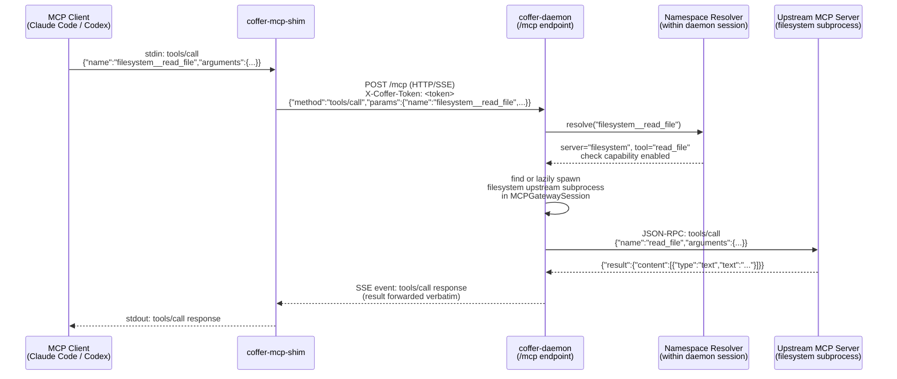

# Request Lifecycle

::: tip Mental model
Coffer now serves **several** request lifecycles, not one. The original — and still the load-bearing — path is the **MCP `tools/call`** lifecycle: MCP client → daemon → upstream server, with the shim translating stdio to HTTP/SSE at the entry and the namespace resolver splitting `filesystem__read_file` into server `filesystem` + tool `read_file` at dispatch. Alongside it run an **agent-chat turn** lifecycle, a **channel-inbound** lifecycle, and a **knowledge/memory retrieval** lifecycle. This page walks the MCP path in full detail first, then sketches the other three.
:::

## MCP tool-call lifecycle

This is one of Coffer's request lifecycles — the MCP gateway path. The remaining three are summarised at the end of the page.

### Three-step summary

1. **Arrival.** A tool call arrives at the daemon's `/mcp` HTTP/SSE endpoint, either directly (from the shim bridging an MCP client's stdio) or from any process with a valid `X-Coffer-Token`. The call is a JSON-RPC 2.0 `tools/call` request with a namespaced tool name, e.g. `{"method": "tools/call", "params": {"name": "filesystem__read_file", "arguments": {...}}}`.

2. **Namespace resolution.** The daemon splits the `<server-name>__<tool-name>` form to identify the originating upstream (`filesystem`) and the tool's original unprefixed name (`read_file`). It locates the `MCPGatewaySession` for this downstream client connection and finds or lazily spawns the subprocess (or HTTP connection) for the `filesystem` upstream within that session.

3. **Forwarding and return.** The daemon issues a JSON-RPC `tools/call` request to the upstream using the unprefixed tool name, correlates the request by ID, waits for the upstream's response, and returns it to the downstream client unchanged. The upstream's result — whether a successful content payload or a tool-level error — is forwarded verbatim.

## End-to-end sequence diagram



## The shim's role

MCP clients (Claude Code, Codex) expect to talk to MCP servers over stdio: they write JSON-RPC to the server's stdin and read responses from the server's stdout. The daemon, however, exposes MCP over HTTP/SSE (a long-lived SSE channel for server-to-client notifications, with client-to-server requests as HTTP POST). The stdio shim bridges this impedance:

- It is spawned by the MCP client as if it were the upstream MCP server.
- It connects to the daemon's `/mcp` endpoint over HTTP/SSE, authenticating with the token from `~/.coffer/daemon.json`.
- It reads JSON-RPC messages from stdin and issues them as HTTP POST requests to the daemon.
- It reads SSE events from the daemon (responses and notifications) and writes them back to stdout.

From the MCP client's perspective, the shim looks indistinguishable from any other stdio MCP server. From the daemon's perspective, the shim is just another HTTP client — its connection creates a `MCPGatewaySession`.

The `initialize` handshake that follows the connection is handled by the daemon, which presents itself as a single MCP server containing the union of all registered and enabled upstream capabilities.

## Namespacing

The central design choice for aggregating multiple upstream MCP servers without collision is the double-underscore namespace: every tool, resource, and prompt exposed through Coffer carries the originating server's registered name as a prefix.

| Upstream server                  | Upstream tool name    | Coffer-namespaced name        |
| -------------------------------- | --------------------- | ----------------------------- |
| `filesystem`                     | `read_file`           | `filesystem__read_file`       |
| `github`                         | `search_repositories` | `github__search_repositories` |
| `postgres`                       | `query`               | `postgres__query`             |
| `filesystem` (a second instance) | `read_file`           | `filesystem2__read_file`      |

The separator `__` (double underscore) was chosen because it is rare in natural MCP tool names and clearly visually distinct from a single underscore used in tool names by convention. The server name comes from the user-assigned registration name — the same name used in `coffer mcp add <name>`. This name is stable and persisted; changing it requires re-registration.

**Dispatch.** When a `tools/call` arrives with name `filesystem__read_file`, the daemon splits on the first `__` occurrence:

- `server_name = "filesystem"`
- `tool_name = "read_file"`

It then:

1. Looks up the `mcp_server` resource named `filesystem` in the database and verifies it is enabled.
2. Checks the capability preference for tool `read_file` on server `filesystem` — if the user has disabled this tool, the call is rejected with a `TOOL_DISABLED` error before the upstream is contacted.
3. Finds the `MCPGatewaySession` for this downstream client and obtains (or lazily spawns) the subprocess for the `filesystem` upstream.
4. Issues `{"method": "tools/call", "params": {"name": "read_file", "arguments": ...}}` to the upstream subprocess, with a fresh request ID.
5. Correlates the upstream's response by request ID and returns it to the downstream client.

**Resources and prompts.** The same namespacing applies. Resource URIs include a server prefix. Prompt names follow the same `<server>__<prompt>` convention. The dispatch logic is symmetric.

## Session model and lazy spawn

Each downstream client connection creates one `MCPGatewaySession` in the daemon (per [ADR-005](/reference/adr/ADR-005-session-subprocess-model)). This session owns the upstream subprocesses for that connection. Subprocesses are not started at session creation — they are started lazily on first need, meaning the first `tools/list` or `tools/call` that routes to a given upstream pays the subprocess spawn and `initialize` handshake cost once. Subsequent calls in the same session reuse the running upstream.

Two MCP clients connected simultaneously (e.g., Claude Code and Codex both running) produce two independent `MCPGatewaySession` objects, each with their own upstream subprocess set. They share no state. This prevents a crash in one client's upstream from affecting the other client, and preserves MCP protocol correctness: each upstream `initialize` negotiates capabilities fresh for each session, without the daemon needing to multiplex or fabricate session state.

Each session also maintains a 60-second in-memory cache of each upstream's capability lists. The cache is invalidated by TTL expiry, a `notifications/tools/list_changed` notification from the upstream, or a user-initiated capability refresh. Capability schemas and descriptions are never written to the database — only the user's per-capability enable/disable preference flags are persisted, keyed by capability name.

## What the gateway does and does NOT do

::: tip What the gateway does

- Aggregates tools, resources, and prompts from all registered enabled upstream MCP servers into a single namespaced MCP surface.
- Splits namespaced names and routes calls to the correct upstream.
- Enforces per-capability enable/disable policies before forwarding any call.
- Resets the session inactivity timeout on each tool call or resource read (so long-running sessions stay alive during active use).
- Forwards the upstream's authorization token (when configured via credential refs) to the upstream at subprocess spawn time — the credential is never logged or stored.
- Records an invocation entry for each tool call (timestamp, target, duration, outcome) — without logging arguments or return contents.
  :::

::: warning What the gateway does NOT do
**No active streaming progress forwarding.** The MCP protocol includes progress notifications (`notifications/progress`) that an upstream can emit during a long-running tool call. The current Coffer gateway does not actively forward these mid-call progress notifications to the downstream client. This is a deliberate, explicit scope choice: implementing a correct progress-forwarding proxy requires per-notification routing based on progress tokens, which is additional bookkeeping complexity. For the single-user, latency-tolerant use case, returning the final result is sufficient. If your upstream emits progress notifications during a call, the client will not see them mid-call; it will receive the final result when the call completes.

**No response transformation.** The upstream's response is returned to the downstream client verbatim. The gateway does not inspect, rewrite, or filter the content of tool results. If the upstream returns a binary blob, the gateway forwards the binary blob.

**No argument rewriting.** Tool call arguments are forwarded to the upstream unchanged. The gateway does not add, remove, or rewrite arguments.
:::

## Error path

When something goes wrong, the daemon always returns a well-structured error to the downstream client. Errors never hang or return an unstructured response.

**Uniform error envelope.** All errors from the management API follow the shape:

```json
{
  "error": {
    "code": "TOOL_DISABLED",
    "message": "Tool filesystem__read_file is disabled",
    "details": { "server": "filesystem", "tool": "read_file" }
  }
}
```

The `X-Coffer-Trace` response header carries a correlation ID that appears in the structured log under `~/.coffer/logs/daemon.log`, linking the HTTP error response to the full request context in the log.

**Specific failure modes:**

| Scenario                                | What the daemon does                                                                                                                                                             |
| --------------------------------------- | -------------------------------------------------------------------------------------------------------------------------------------------------------------------------------- |
| Tool or capability is disabled          | Rejects with `TOOL_DISABLED` (JSON-RPC code -32000) before contacting the upstream.                                                                                              |
| Upstream server is unreachable on spawn | The call returns an upstream-unreachable error. The server is marked unhealthy in the daemon's session state. A subsequent call triggers a respawn attempt with bounded retries. |
| Upstream crashes mid-call               | The in-flight call returns an error. The session marks the upstream as unhealthy. The next call to that upstream triggers a respawn-with-backoff.                                |
| Upstream returns a tool error           | The error is forwarded verbatim to the downstream client. Coffer does not reinterpret or swallow upstream errors.                                                                |
| Call times out                          | The session's inactivity timeout is reset on each call. If the upstream does not respond within the configured per-call timeout, the daemon returns a timeout error.             |
| Daemon crash while shim is active       | The shim detects that the HTTP/SSE connection closed, returns a clean error to the MCP client (rather than hanging), and may attempt reconnect with detect-or-spawn.             |

**Invocation logging.** Every tool call, resource read, and prompt fetch is recorded in the `mcp_invocations` table: timestamp, target capability (namespaced form), duration, and outcome (success or error). Arguments and return contents are never stored. This gives the user an activity history and an audit trail for the gateway's I/O, without creating a privacy risk from sensitive argument values.

## Illustrative JSON-RPC exchange

A complete round-trip as seen at the shim's stdin/stdout boundary:

**Client → shim → daemon (`tools/call` request):**

```json
{
  "jsonrpc": "2.0",
  "id": 42,
  "method": "tools/call",
  "params": {
    "name": "filesystem__read_file",
    "arguments": {
      "path": "/tmp/example.txt"
    }
  }
}
```

**Daemon → shim → client (success response):**

```json
{
  "jsonrpc": "2.0",
  "id": 42,
  "result": {
    "content": [
      {
        "type": "text",
        "text": "Hello, world!\n"
      }
    ]
  }
}
```

**Daemon → shim → client (capability-disabled error):**

```json
{
  "jsonrpc": "2.0",
  "id": 43,
  "error": {
    "code": -32000,
    "message": "Tool filesystem__write_file is disabled"
  }
}
```

The daemon adds no wrapper or extra fields to the upstream's success result. The error structure follows JSON-RPC 2.0 with Coffer-specific negative codes in the -32000 range.

## Agent-chat-turn lifecycle

The chat surface drives a different lifecycle: instead of forwarding a single JSON-RPC call to an upstream, it runs a multi-step **agent turn** that may itself call several of Coffer's own gateway tools before producing a reply. This path is specified by [spec 008](/reference/specs/008-agent-chat/spec).

1. **Turn start.** A chat client (web UI or a channel) posts a user message. The `TurnOrchestrator` (`application/chat/turn_orchestrator.py`) creates or resumes the conversation, persists the user turn, and starts streaming.

2. **In-process agent.** For the built-in agent, the orchestrator drives an in-process LangGraph agent (`infrastructure/chat/langgraph_agent.py`). The agent's tools are Coffer's own gateway tools, exposed to the model through the gateway tool provider (`infrastructure/chat/gateway_tool_provider.py`) — so the chat agent can call the same aggregated MCP capabilities that an external MCP client would, in-process and without a shim.

3. **Approval bridging.** When the agent wants to run a tool that requires confirmation, the LangGraph run is paused at an interrupt and an approval request is streamed to the client. The client resolves it via `submit_approval`; `interrupt_turn` cancels an in-flight turn. The orchestrator translates these into LangGraph resume/cancel signals.

4. **Streaming back.** Tokens, tool-call events, and approval prompts stream to the client over SSE as the run progresses; the final assistant turn is persisted on completion.

**CLI-agent variant.** Instead of the in-process LangGraph agent, a chat agent may drive an **external coding-agent subprocess** (Claude Code or Codex) through `infrastructure/chat/cli_agent.py` and `infrastructure/chat/cli_providers.py`. The orchestrator seam is identical — same turn persistence, same approval and streaming contract — but the model loop runs in the external CLI process rather than in-process.

## Channel-inbound lifecycle

Messaging channels (Telegram, SeaTalk) deliver user messages into the **same `TurnOrchestrator` seam** as the web UI — a channel turn is indistinguishable from a UI turn once it reaches the orchestrator. The inbound transport differs per platform (per [ADR-014](/reference/adr/ADR-014-channel-adapter-framework)):

- **SeaTalk (webhook).** SeaTalk delivers events only by public webhook. A separate **callback-listener process** (`coffer-callback`, spawned by the daemon while any SeaTalk channel is enabled) serves `POST /seatalk/{channel}` on a loopback port. It answers the platform's verification challenge, verifies the request signature (`sha256(body + signing_secret)`), normalises the event, and forwards it to the daemon — which feeds it into the orchestrator.

- **Telegram (long-poll).** Telegram inbound runs as a long-poll loop inside the daemon (no public endpoint), normalising each update into the same inbound shape before it reaches the orchestrator.

Progress is rendered from the agent's capabilities, not the adapter type: Telegram streams progress by editing one message, SeaTalk degrades to ack-then-final.

## Knowledge / memory retrieval lifecycle

Retrieval requests (KB search, and the `recall` / `remember` memory tools) follow a lifecycle anchored in [ADR-012](/reference/adr/ADR-012-files-as-truth-sqlite-retrieval): **markdown files are the source of truth**, and `coffer.db` holds only a derived index.

- **`grep`** — ripgrep over the raw files (zero index, language-agnostic).
- **keyword** — SQLite **FTS5** with `MATCH … ORDER BY bm25()`.
- **vector** — **sqlite-vec** KNN over chunk embeddings (opt-in; embeddings come from a user-configurable OpenAI-compatible endpoint).

A KB search fuses the enabled engines and returns ranked chunks; `recall` reads from the memory store and `remember` writes a fact file, after which the derived FTS5/vec index is regenerated from the files. Because files are truth, the index can always be rebuilt and the user can diff/grep/edit content with ordinary tools.

---

**See also:** [Spec 001: MCP Gateway](/reference/specs/001-mcp-gateway/spec), [ADR-005: Session subprocess model](/reference/adr/ADR-005-session-subprocess-model), [Spec 008: Agent chat](/reference/specs/008-agent-chat/spec), [ADR-014: Channel adapter framework](/reference/adr/ADR-014-channel-adapter-framework), [ADR-012: Files as truth, SQLite retrieval](/reference/adr/ADR-012-files-as-truth-sqlite-retrieval)
