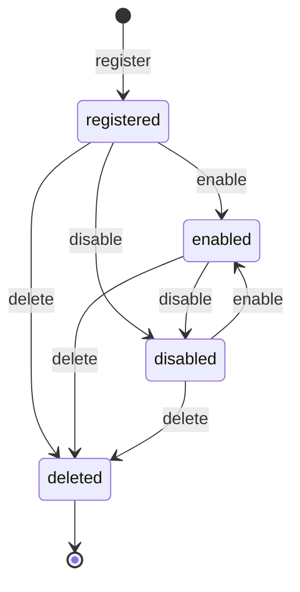

# Resource Framework

The Resource framework is Coffer's core abstraction. Understanding it is the key to understanding how the system scales gracefully as new managed entity types are added.

## Everything is a resource kind

Every user-managed entity in Coffer is a **Resource**, identified by a stable string of the form `<kind>:<name>`. **Seven** kinds are registered today — one `make_<kind>_kind()` factory each, under `application/<kind>/kind.py`:

| Kind             | Spec                                                   | Description                                                                                                       |
| ---------------- | ------------------------------------------------------ | ---------------------------------------------------------------------------------------------------------------- |
| `mcp_server`     | `mcp-gateway`         | A registered upstream MCP server: transport config, credential references, and the per-server gateway policies.  |
| `agent`          | `agent-registry`   | A registered local AI coding agent (e.g. Claude Code): its config directory, Coffer-MCP install state, and derived workspace facets. |
| `skill`          | `skill-manager`     | A master skill bundle Coffer delivers into one or more agents' skill directories.                                |
| `knowledge`      | `knowledge`             | One collection of what agents know: a directory of markdown files — entries they wrote plus any-format documents ingested to markdown — searched literally with `ripgrep`. |
| `memory`         | `memory`                   | One partition of the facts Coffer aggregated out of the agents' *own* native memory — `global` plus one per project — as files under `~/.coffer/memory/`. |
| `provider`       | `provider-switching` | A vendor endpoint and its key: `{protocol, base_url, credential_ref}`. One may be the internal default Coffer's own passes run on. |
| `channel`        | `channels`               | A messaging-channel binding (Telegram, SeaTalk): transport config, credential refs, and a default agent.         |

`knowledge` was once two kinds — a `knowledge_base` you could only read and a `memory` only agents wrote to — but they shared their storage from the start, so the split bought nothing and forced every caller to classify its own data before it could pick a tool. They are now one kind over one storage root: a knowledge resource **is** the directory `~/.coffer/knowledge/<name>/`, and the markdown files in it are the whole of its content. The kind adds no table of its own — the `resources` row carries the collection's identity and description, the files carry everything else. A knowledge resource is **co-managed**: both you and your agents write into it.

Today's `memory` kind is a different thing from that retired one, and the distinction is load-bearing: it is **derived, not co-managed**. Coffer reads each agent's native memory and normalises it into facts; it never writes back.

New kinds plug into the same framework without modifying it. The encrypted credential store and vault sync are deliberately **cross-cutting concerns, not kinds**: they serve every kind rather than being managed entities in their own right.

The framework provides four things, and only four things:

| Concern               | What the framework does                                                                                                           |
| --------------------- | --------------------------------------------------------------------------------------------------------------------------------- |
| **Identity**          | Assigns each resource a `kind`, a `name`, and the composite stable reference `<kind>:<name>`.                                     |
| **Lifecycle**         | Defines and enforces the states a resource can be in: registered, enabled, disabled, deleted.                                     |
| **Audit**             | Records every lifecycle change with a timestamp and an actor (`cli`, `api`, `ui`, `system`).                                      |
| **Schema validation** | Dispatches per-kind Pydantic schema validation at the application boundary, while the dispatch mechanism itself is kind-agnostic. |

::: warning What the framework does NOT do
The Resource framework does not unify invocation semantics. Each kind defines how its capabilities are used. There is no god `invoke()` method, no shared call path, no cross-kind behavior. The framework describes how a resource is registered, described, and curated — not what happens when you use it.
:::

## Why kind-agnostic upfront (ADR resource-framework-upfront)

The constitution normally defers cross-cutting abstractions until a second feature needs them ("extract on second feature"). The Resource framework is an explicit exception, and the reason is cost asymmetry.

The framework spans every layer: domain entities, database schema, audit table, retention framework, surface routing (REST API sub-routers, CLI subcommand groups). If this abstraction had been designed as an `mcp_server`-specific implementation in the first spec and then extracted when a second kind arrived, the refactoring cost would not be a modest extraction — it would require re-modeling the audit table, the surface routing, and the retention framework simultaneously. The "second feature" refactor would be a substantial, risky migration, not a clean module move.

The alternative of building per-kind silos with no shared abstraction was also rejected: with multiple kinds planned with high confidence (seven are registered today), building identity + lifecycle + audit + surface CRUD separately for each would produce more code and more drift than one framework.

The consequence is that the first spec (`mcp-gateway`) carries the framework's abstraction overhead with only one concrete kind to justify it. This is accepted as a known cost, explicitly balanced against the avoided refactor.

## Identifier format: `<kind>:<name>` (ADR resource-identifier-format)

Resources are referenced externally by the string `<kind>:<name>`:

- CLI: `coffer resource show mcp_server:filesystem`
- REST API URL: `/api/v1/resources/mcp_server/filesystem`
- Config references: an agent's `tools` field listing `mcp_server:filesystem`

The format is self-describing: the prefix tells you which kind to look in, eliminating one lookup in many code paths. It is human-readable and survives debugging without a decoder ring.

Internally, the database uses a surrogate `id INTEGER PRIMARY KEY AUTOINCREMENT` for joins and foreign keys, with a `UNIQUE (kind, name)` constraint enforcing the external identifier's uniqueness. A `ResourceRef(kind: str, name: str)` domain value object handles parsing and serialization at the application boundary — raw strings never enter the domain layer.

**Rejected alternatives:**

- **Full URN** (`urn:coffer:mcp_server:filesystem`): Rejected because Coffer is single-user local-first — there is no other Coffer installation to distinguish from, making the `urn:coffer:` prefix pure ceremony.
- **Pure UUID**: Rejected because opaque, not self-describing, and forces a separate `kind` field on every reference.
- **Path-style** (`mcp_server/filesystem`): Functionally equivalent but rejected because slashes are overloaded in URLs, file paths, and many DSLs; the colon makes the kind-namespace relationship clearer.

## Capability state model (ADR capability-state-model)

Each resource moves through a defined lifecycle. The state machine is intentionally simple:

**registered** — the resource exists in the database with its configuration. It has not yet been explicitly enabled or disabled.

**enabled** — the resource is active. For `mcp_server`, this means the daemon will connect to it and expose its tools to MCP clients.

**disabled** — the resource configuration is retained, but the daemon will not connect to it or expose its tools. Disabling is non-destructive: re-enabling brings it back without re-registration.

**deleted** — the resource is removed. This is a terminal state. Re-adding a server with the same name is a new registration.

Every state transition is recorded in the audit log with an actor. The audit log cannot be modified or deleted through the normal API — it is append-only.

For `mcp_server` specifically, there is a parallel capability-level state: each individual tool, resource, or prompt exposed by an upstream server can be individually enabled or disabled. The database stores only user preference flags for these capabilities — it does not cache capability schemas or descriptions. Those are fetched live from the upstream on each request and held in a per-session in-memory cache with a 60-second TTL.

## Kind registration at the composition root

The framework uses no global registry and no import side effects. Each kind exposes a factory — `make_<kind>_kind()` in `application/<kind>/kind.py` — that returns a frozen `Kind`, and the composition root wires the kind in explicitly: one `*_wiring.py` module per kind builds its services, registers its routers and returns a typed dataclass the root passes forward. The composition roots are `surfaces/http/app.py` (FastAPI wiring) and `surfaces/cli/main.py` (Typer wiring).

A `Kind` carries the small set of answers the framework needs and the kind alone can give: whether the generic `POST /api/v1/resources` may create one (`generic_create_allowed`), whether it has a per-agent activation scope (`supports_scope`), and whether its rows converge with the sync remote (`converges`). The last of those exists so the sync layer has one rule rather than a list of exceptions — `memory` is the only kind that answers no, because a partition row is derived from the agents installed on one machine. A kind nobody has declared anything about converges, so the flag can only ever withhold.

Adding a new kind is mechanical: create the kind's subdirectories in each layer (`domain/<kind>/`, `application/<kind>/`, `infrastructure/<kind>/`, `surfaces/http/<kind>/`, `surfaces/cli/<kind>/`), implement the kind-specific logic, write its `make_<kind>_kind()` factory, and add one wiring module the composition root calls. The audit, retention, and resource-list surfaces are inherited automatically.

## Why "everything is a resource kind" (ADR everything-is-a-resource-kind)

The information architecture follows the same principle as the domain model: there is a single-axis navigation model where every user-facing managed entity is a resource kind, surfaced through the same sidebar group. There is no separate "surface" concept sitting beside the resource concept.

This eliminates the question "is this new thing a kind or a surface?" for every future spec. Operational tooling — Activity, Sync, Settings — appears in a separate System group; everything the user manages appears in the Resources group, one entry per kind with a list UI.

A deliberate policy follows: **no "coming soon" placeholders**. A kind is not shown in the UI or sidebar until it actually works. The UI always reads as "here is what Coffer does", not "here is what Coffer plans to do."
