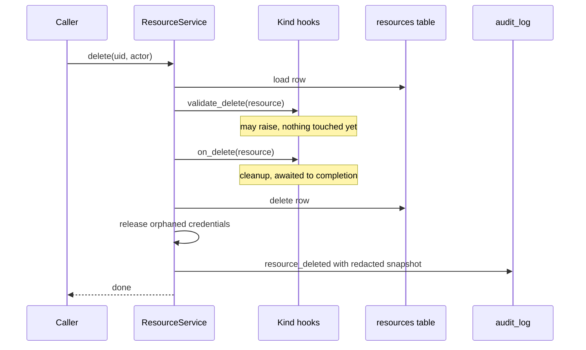

# Resource framework

Every entity you manage in Coffer — an MCP server, an agent, a skill, a knowledge collection, a memory partition, a channel, a model provider — is a **Resource** of some **kind**. This page explains the kind-agnostic core that gives all of them one identity, one lifecycle, one audit trail and one notion of reach, and the exact contract a kind implements to plug into it. It is for engineers adding a kind, changing lifecycle behaviour, or trying to understand why a write was refused.

## The problem it solves

Seven kinds of thing need the same operations: create, list, show, rename, edit, enable, disable, scope, delete, and a history of all of it. Built seven times, those operations drift — one kind renames and another cannot, one audits its config with the secrets in and another strips them. Built once without care, the shared layer grows a "god" interface that tries to unify things with nothing in common: invoking an MCP tool, delivering a skill and running a Telegram adapter are not the same operation.

The framework takes the first half and refuses the second:

- **Unified:** identity, lifecycle, audit, schema validation, reach (scope plus `enabled`), retention of log tables, and the REST and CLI surfaces for all of it.
- **Not unified:** invocation semantics. Each kind defines how its capability is used, and each kind *enforces* reach at its own choke point.

## Design decisions

| Decision | Reason |
| --- | --- |
| One frozen `Kind` descriptor per kind, holding data and callables. | A kind plugs in by value. The core looks fields up; it never imports a kind module. |
| Pre-write validators may refuse; post-write reactions may not. | A validator decides whether a change happens. A reaction catches up with a change that is already persisted and audited, so letting it raise would pretend to undo something it cannot. |
| Creation is the one operation not generalised. | A skill needs a master folder, an agent needs a detected config directory. Such kinds set `generic_create_allowed=False` and register through their own service. Everything after creation is generic. |
| Identity is an immutable `uid`, the name a label. | A synced vault needs an identity every machine agrees on and a rename cannot break. |
| The framework stores reach; kinds enforce it. | Enforcement belongs where the asking agent is known. A central gate would have to sit on every kind's read path. |
| The core is tested against a fake kind. | A core that needed a real kind to be testable would already have leaked. An import contract keeps it that way. |

## The mechanism

### Resource

[`Resource`](https://github.com/wyx-sg/Coffer/blob/main/backend/coffer/domain/resource.py) is a plain dataclass, one row of the `resources` table:

| Field | Meaning |
| --- | --- |
| `id` | Integer surrogate primary key. Internal and per-machine: it is the foreign key kind-owned tables hold, and it is never serialized or returned by any route. |
| `uid` | The identity. `uuid4().hex`, minted once in `ResourceService.register`, immutable, identical on every machine that holds the resource. |
| `kind` | The kind name, such as `mcp_server`. |
| `name` | A mutable label, unique within its kind. |
| `description` | Optional free text. |
| `config` | The kind's configuration, validated against the kind's Pydantic schema. Stored as JSON text in `config_json`. |
| `enabled` | The on/off switch. Half of the resource's reach. |
| `created_at`, `updated_at` | Timestamps. |
| `scope` | Optional agent allow-list (`Scope`), the other half of reach. `None` means every agent. |

Names are still constrained to `^[a-zA-Z0-9_.-]+$` and at most 64 characters (`validate_resource_name`), because three kinds — `skill`, `knowledge` and `memory` — turn the name into a directory. A kind may add a stricter rule of its own.

### Kind

[`Kind`](https://github.com/wyx-sg/Coffer/blob/main/backend/coffer/domain/resource.py) is a frozen dataclass. Every field below is real; everything other than `name`, `display_name` and `config_schema` is optional.

**Declarations**

| Field | Default | Meaning |
| --- | --- | --- |
| `name` | — | The kind key, such as `"skill"`. |
| `display_name` | — | Human label. |
| `config_schema` | — | Pydantic model the config must validate against. |
| `generic_create_allowed` | `True` | Whether `POST /api/v1/resources` (and a generic config update) may touch this kind. |
| `supports_scope` | `False` | Whether the kind carries a per-agent scope. A kind without it rejects any non-null scope (`SCOPE_INVALID`, 422). |
| `converges` | `True` | Whether the kind's rows travel to the sync remote. |
| `converges_row` | `None` | Per-row refinement of `converges`, a function of the config alone. |

**Pre-write validators — run before persistence; raising rejects the write**

| Field | Called by | Meaning |
| --- | --- | --- |
| `validate_name` | register, rename | Kind-specific name rule on top of the framework's. |
| `validate_config` | register only | Semantic validation beyond the schema (sync or async). Not run on update, so editing an unrelated field never re-probes the filesystem. |
| `on_update_config` | update | Sees the resource as it stands plus the proposed config; may reject. |
| `on_rename` | rename | Moves whatever the kind keeps under the old name. Runs before the row changes; if a racing writer then takes the name, the service calls it again to move things back. |
| `validate_scope_for` | scope update | Sees the resource as it stands plus the proposed scope; may reject. |
| `validate_delete` | delete | Refuses a deletion before anything is torn down. |

**Declarations the core consults — pure functions of the config**

| Field | Meaning |
| --- | --- |
| `credential_ref_extractor` | Returns `{key: credential_ref}` for a config. The core probes each ref before any write (`CREDENTIAL_MISSING`) and uses the same answer to refuse deleting a credential that is still cited, and to release credentials nothing cites after a delete. |
| `audit_redactor` | Returns an audit-safe copy of a config. |
| `default_scope` | The scope a newly registered row starts with, instead of "every agent". |

**Post-write reactions — run after persistence and audit; cannot undo the write**

| Field | Called after | Meaning |
| --- | --- | --- |
| `on_delete` | delete decided | Cleanup. The one reaction that runs *before* the row is removed, so it can still resolve the resource; it is awaited to completion, and an exception from it aborts the delete. |
| `on_scope_changed` | scope persisted | Reconcile with the new scope (for example, deliver or reclaim skills). |
| `on_enabled_changed` | `enabled` flipped | Reconcile with the new flag. Not fired when the value did not change. |

Import validation during a sync round is deliberately not a `Kind` field. It is an `ImportGate` port the sync slice declares and the composition root registers through `SyncContributions`, so the sync package imports no kind. Only the `agent` kind contributes one: an agent document whose config directory does not exist on this machine is held rather than applied. See [Vault sync](/architecture/vault-sync).

### What each kind sets

| Kind | Hooks and flags it supplies |
| --- | --- |
| `mcp_server` | `supports_scope`, `validate_name` (reserves `__`, the tool namespace separator), `audit_redactor` (strips `transport.env` and `transport.headers`), `credential_ref_extractor`, `on_update_config` (evicts live connections so the next call spawns with the new config), `on_rename` (releases live connections held under the old name), `on_delete`, `on_enabled_changed` (evicts live connections on disable) |
| `agent` | `generic_create_allowed=False`, `on_delete`, `on_enabled_changed` |
| `skill` | `generic_create_allowed=False`, `supports_scope`, `validate_name` (the `SKILL.md` frontmatter rule), `validate_delete` (refuses deleting the builtin `coffer-guide`), `converges_row` (withholds `coffer-guide`), `on_rename`, `on_delete`, `on_scope_changed`, `on_enabled_changed` |
| `knowledge` | `generic_create_allowed=False`, `on_rename` (moves the collection directory), `on_delete`, `on_enabled_changed` (re-renders the catalogue) |
| `memory` | `generic_create_allowed=False`, `converges=False`, `on_rename`, `on_delete` |
| `channel` | `supports_scope` (inverted, see below), `credential_ref_extractor`, `validate_config`, `on_update_config`, `validate_scope_for`, `on_delete` |
| `provider` | `supports_scope`, `default_scope`, `credential_ref_extractor`, `validate_config`, `on_update_config` |

### ResourceService

[`ResourceService`](https://github.com/wyx-sg/Coffer/blob/main/backend/coffer/application/resource_service.py) is constructed with the per-app `kinds` dict, a repository, the audit service and the credential store. It dispatches on `resource.kind` and never imports a kind module. Its operations, in the order each performs its steps:

| Operation | Steps |
| --- | --- |
| `register` | Refuse if the kind disallows generic creation and the caller did not opt in → framework and kind name rules → schema validation → `validate_config` → probe cited credentials → mint `uid` (or accept the one a sync document carries) → insert with `default_scope` → audit `resource_created` with the redacted config. |
| `update_config` | Same generic-create gate → schema → credential probe → `on_update_config` → write → audit `resource_updated` with redacted before and after. |
| `rename` | No-op if unchanged → name rules → collision check (`RESOURCE_ALREADY_EXISTS`, 409) → `on_rename` → write → audit `resource_renamed` with `from` and `to`. |
| `set_enabled` | No-op (and no audit) if unchanged → write → audit `resource_enabled` or `resource_disabled` → `on_enabled_changed`. |
| `update_scope` | `validate_scope` against `supports_scope` → `validate_scope_for` → write → audit `resource_scope_updated` → `on_scope_changed`. |
| `delete` | Resolve → `validate_delete` → `on_delete` → remove the row → release credentials no remaining resource cites → audit `resource_deleted` with a redacted snapshot. |

The delete path, which shows the validator/reaction split most clearly:



A kind's own route and the generic route call the same service method, so a refusal reads the same through both: deleting `coffer-guide` answers `409 RESOURCE_PROTECTED` from `DELETE /api/v1/skills/{uid}` and from `DELETE /api/v1/resources/{uid}` alike.

### The generic routes

[`surfaces/http/resource_routes.py`](https://github.com/wyx-sg/Coffer/blob/main/backend/coffer/surfaces/http/resource_routes.py) exposes the framework over REST. Every route requires the `X-Coffer-Token` header.

| Method and path | Purpose |
| --- | --- |
| `GET /api/v1/resources?kind=&name=` | List, optionally by kind and exact name. The name filter is how the CLI turns a label into a uid. |
| `POST /api/v1/resources` | Register a resource of a kind that allows generic creation. |
| `GET /api/v1/resources/{uid}` | Show one resource. |
| `PATCH /api/v1/resources/{uid}` | Edit `description`, `config` and `name`. Only fields present in the body change; a rename alone runs no config write, and the rename is applied last so a refused config leaves the name alone. |
| `DELETE /api/v1/resources/{uid}` | Delete. |
| `POST /api/v1/resources/{uid}/enable`, `/disable` | Flip `enabled`. |
| `GET /api/v1/resources/{uid}/scope` | The scope plus `supports_scope`. |
| `PUT /api/v1/resources/{uid}/scope` | Replace the scope. |

A kind that belongs to a switched-off experimental feature is refused on these routes with `404 FEATURE_DISABLED` and left out of lists; its rows are untouched. Kinds also mount their own routers (`/api/v1/skills`, `/api/v1/channels`, …) for behaviour the framework does not own.

The CLI mirrors the generic surface with names instead of uids:

```sh
coffer resource list
coffer resource show mcp_server github
coffer resource rename mcp_server github gh
coffer resource disable skill pdf-tools
coffer scope set mcp_server gh --agents claude-code
coffer scope set skill pdf-tools --no-agents   # dormant
coffer scope clear mcp_server gh               # every agent again
```

REST and CLI are parity surfaces answering through the same services, and a test over the whole CLI tree asserts that parity.

## Identity

Three values name a resource, and each has one job:

| Value | Scope | Used for |
| --- | --- | --- |
| `uid` | Global and permanent | URLs (`/api/v1/resources/{uid}`, web detail pages), cross-resource references (a scope's agent list, a channel's `default_agent`), the sync bundle path `resources/<kind>/<uid>.yaml`. |
| `name` | Unique within a kind, mutable | What people type and read. The CLI resolves names to uids. |
| `id` | One machine's database | Foreign key for `skill_agent_bindings`, `mcp_capability_preferences`, `channel_peers`, `channel_thread_conversations`, and `audit_log.resource_id`. |

A new resource always gets a random `uid`. The one exception is the sync applier, which registers a resource another machine created at the `uid` that machine already gave it. Because references hold uids and the audit log keys on `id`, renaming writes exactly one column and nothing else has to be repointed.

## Lifecycle events and audit

Every mutation writes one `audit_log` row through [`AuditService`](https://github.com/wyx-sg/Coffer/blob/main/backend/coffer/application/audit_service.py). The framework's own events are `resource_created`, `resource_updated`, `resource_renamed`, `resource_enabled`, `resource_disabled`, `resource_scope_updated` and `resource_deleted`; each kind adds its own event types to the same vocabulary in [`domain/audit.py`](https://github.com/wyx-sg/Coffer/blob/main/backend/coffer/domain/audit.py) (for example `skill_bound`, `channel_paired`, `provider_switched`).

An audit row records:

- the **actor**, from the `X-Coffer-Actor` header — a short lowercase identifier such as `cli`, `ui` or `system`, defaulting to `api` when absent and rejected with 400 when malformed;
- the resource's `id` plus its **kind and name at the time**, so a history survives a rename and old rows keep saying what was true then;
- **details**, with config passed through the kind's `audit_redactor`. Scope carries only agent uids and is recorded verbatim.

You read the log on the **Changes** tab of **Activity** in the web UI, with `coffer audit list`, or through `GET /api/v1/audit`.

## Schema validation

Each kind's `config_schema` is a Pydantic v2 model. `ResourceService` validates the incoming config and stores `model_dump(mode="json")`, so special types such as URLs are persisted as plain strings. A shape failure is `CONFIG_INVALID` (422). Semantic checks that need more than the shape — does this channel's `default_agent` name a registered agent, does this workspace directory exist — run in `validate_config` or `on_update_config`. Credential refs are probed against the encrypted store before the row is written, so a missing secret fails with `CREDENTIAL_MISSING` and leaves nothing behind.

## Reach

A resource's **reach** is its `enabled` flag together with its `scope`. Both are machine-local: they are set on the machine they apply to and never converge through sync.

[`domain/scope.py`](https://github.com/wyx-sg/Coffer/blob/main/backend/coffer/domain/scope.py) defines the shape and the one predicate every enforcement point calls:

| Stored scope | Meaning |
| --- | --- |
| `null` | Active for every agent. |
| `{"agents": ["<uid>", …]}` | Active only for those agents. A uid that matches no registered agent is legal and never matches. |
| `{"agents": []}` | Dormant: active for no agent. Not the same as disabled. |

```python
def is_active(scope: Scope | None, agent_uid: str | None) -> bool:
    if scope is None or scope.agents is None:
        return True
    return agent_uid is not None and agent_uid in scope.agents
```

An unidentified session — a shim configured by hand without `--agent-uid` — matches only an unrestricted scope, so it sees strictly less, never more.

### The inverted scope of channels

For every other kind, scope names the agents a resource is *delivered to*. A channel is consumed by no agent: it is an inbound surface. So a channel's scope names the agents the channel may **drive**. `/agent` in the chat lists, offers and accepts only those agents, and the channel's `default_agent` must stay inside a non-empty scope — enforced on both write paths, by `on_update_config` for the config and by `validate_scope_for` for the scope. A channel with `{"agents": []}` does not start its adapter at all. A dormant channel's config stays editable, so a wrong token can be fixed without reactivating it.

### The seven kinds

| Kind | Carries | Scope | Where reach is enforced |
| --- | --- | --- | --- |
| `mcp_server` | Transport (stdio or HTTP), credential refs, per-server gateway policy. | Yes | The MCP gateway filters the server's tools by the session's agent uid (`application/mcp/gateway_scope.py`). |
| `agent` | Agent type, config directory, Coffer-MCP install state. Everything else is read from the agent's own files. | No — it is the agent | — |
| `skill` | Its source, the `SKILL.md` description and a version hash of the master folder under `~/.coffer/skills/`. | Yes | Delivery: a skill reaches an agent if and only if it is enabled and `is_active(scope, agent)`; anything else is reclaimed. |
| `knowledge` | One collection, a directory under `~/.coffer/knowledge/`. | No | `enabled` alone decides whether the collection appears in the delivered catalogue. |
| `memory` | One partition (a repository, or `global`) under `~/.coffer/memory/`, derived from agents' native memory. Does not converge. | No | `enabled` alone decides whether the partition is served. |
| `channel` | Transport config, credential refs, `default_agent`, `runs_on` (the one machine whose daemon runs the adapter). | Yes, inverted | Agent routing (`/agent` and the default agent) and the channel runtime, which does not start a dormant channel. |
| `provider` | Wire protocol, base URL, one `credential_ref`. | Yes, pre-filled by `default_scope` from the wire | The projection seam `application/provider/targets.py`: the switch, per-agent key lookup, post-import reconcile and boot self-heal. |

`knowledge` and `memory` carry no scope because both serve files an agent is handed the path to: a scope could only ever hide them from a well-behaved lookup, never withhold them.

## Retention registry

Log-style tables are pruned by one worker against one registry, so no kind writes its own cleanup job. A table registers a [`PrunableTable`](https://github.com/wyx-sg/Coffer/blob/main/backend/coffer/application/retention_registry.py) at the composition root — its timestamp column, default retention in days, and an action (`delete`, or `archive`, which stamps a column instead). The registry is also the SQL allowlist: a table not registered cannot be pruned. Change a policy with `coffer retention set` or `PATCH /api/v1/retention/policies/{table_name}`; each change is audited as `retention_updated`.

The registered policies, their defaults and the worker's cadence are listed in [Observability](/architecture/observability#retention).

## Passes in flight

Long, model-driven rewrites — knowledge curation over a collection, memory distillation over a partition — are tracked in an in-process registry ([`application/upkeep_runs.py`](https://github.com/wyx-sg/Coffer/blob/main/backend/coffer/application/upkeep_runs.py)) keyed by kind and name, so a second start on the same target is refused with `UPKEEP_ALREADY_RUNNING` whichever surface asked. There is no table and no lease: a daemon restart ends every pass, and a persisted claim that outlived its runner would wedge its target forever. Read it with `GET /api/v1/upkeep/runs` or `coffer engine upkeep runs`.

## Trade-offs and alternatives

- **Extract the framework on the second kind.** Coffer's usual rule. Rejected here because pulling a generic resource model out of MCP-specific code would have meant re-modelling the audit table, the routes and retention at once.
- **A third-party plugin architecture.** Rejected: a usable plugin contract needs several concrete implementations to design against, and a single-user local tool has no plugin ecosystem to serve.
- **Per-kind silos.** Rejected: more code and more drift for operations every kind shares.
- **Keep per-agent scoping inside each kind.** Rejected after two kinds had already solved it two different ways; lifting it into the framework pays for the identity plumbing once.
- **A deny-list scope.** Rejected: a new agent would silently gain access to every scoped resource.
- **A central reach gate.** Rejected: it would sit on every kind's read path and still need each kind's notion of use.

## Where it lives in the code

| Path | Contents |
| --- | --- |
| [`backend/coffer/domain/resource.py`](https://github.com/wyx-sg/Coffer/blob/main/backend/coffer/domain/resource.py) | `Resource`, `Kind`, name validation. |
| [`backend/coffer/domain/scope.py`](https://github.com/wyx-sg/Coffer/blob/main/backend/coffer/domain/scope.py) | `Scope`, `is_active`, `validate_scope`. |
| [`backend/coffer/domain/audit.py`](https://github.com/wyx-sg/Coffer/blob/main/backend/coffer/domain/audit.py) | Audit event vocabulary and entry. |
| [`backend/coffer/application/resource_service.py`](https://github.com/wyx-sg/Coffer/blob/main/backend/coffer/application/resource_service.py) | Kind-agnostic CRUD, with `resource_*_ops.py` beside it. |
| [`backend/coffer/application/retention_registry.py`](https://github.com/wyx-sg/Coffer/blob/main/backend/coffer/application/retention_registry.py) | `PrunableTable` and the registry. |
| `backend/coffer/application/<kind>/kind.py` | Each kind's `make_<kind>_kind()` factory. |
| [`backend/coffer/surfaces/http/resource_routes.py`](https://github.com/wyx-sg/Coffer/blob/main/backend/coffer/surfaces/http/resource_routes.py) | The generic REST routes. |
| [`backend/coffer/surfaces/cli/resource_cmd.py`](https://github.com/wyx-sg/Coffer/blob/main/backend/coffer/surfaces/cli/resource_cmd.py), [`scope_cmd.py`](https://github.com/wyx-sg/Coffer/blob/main/backend/coffer/surfaces/cli/scope_cmd.py) | The generic CLI groups. |

## Related

- Spec: [resource-framework](https://github.com/wyx-sg/Coffer/blob/main/openspec/specs/resource-framework/spec.md)
- [Resource Framework Designed Upfront](https://github.com/wyx-sg/Coffer/blob/main/docs/decisions/resource-framework-upfront.md)
- [Resource Identity Is an Immutable `uid`](https://github.com/wyx-sg/Coffer/blob/main/docs/decisions/resource-identity-is-an-immutable-uid.md)
- [Per-Agent Resource Scope](https://github.com/wyx-sg/Coffer/blob/main/docs/decisions/per-agent-resource-scope.md)
- [The Resource Framework Is Core Domain, Designed Before the Second Kind](https://github.com/wyx-sg/Coffer/blob/main/docs/decisions/resource-framework-upfront.md)
- [Layering and code layout](/architecture/layering) — how kinds are wired at the composition root.
