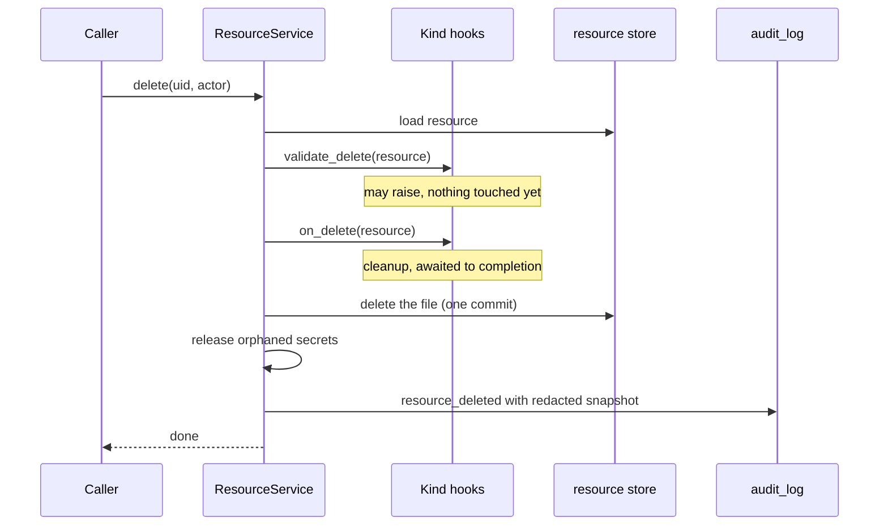

# Resource framework

Every entity you manage in Coffer — an MCP server, an agent, a skill, a knowledge collection, a memory partition, a channel, a model provider — is a **Resource** of some **kind**. This page explains the kind-agnostic core that gives all of them one identity, one lifecycle, one audit trail and one notion of reach, and the exact contract a kind implements to plug into it. It is for engineers adding a kind, changing lifecycle behaviour, or trying to understand why a write was refused.

## The problem it solves

Seven kinds of thing need the same operations: create, list, show, edit, enable, disable, scope, delete, and a history of all of it. Built seven times, those operations drift — one kind renames through its own route and another through none, one audits its config with the secrets in and another strips them. Built once without care, the shared layer grows a "god" interface that tries to unify things with nothing in common: invoking an MCP tool, delivering a skill and running a Telegram adapter are not the same operation.

The framework takes the first half and refuses the second:

- **Unified:** identity, lifecycle, audit, schema validation, reach (scope plus `enabled`), retention of log tables, and the REST and CLI surfaces for all of it.
- **Not unified:** invocation semantics. Each kind defines how its capability is used, and each kind *enforces* reach at its own choke point.

## Design decisions

| Decision | Reason |
| --- | --- |
| One frozen `Kind` descriptor per kind, holding data and callables. | A kind plugs in by value. The core looks fields up; it never imports a kind module. |
| Pre-write validators may refuse; post-write reactions may not. | A validator decides whether a change happens. A reaction catches up with a change that is already persisted and audited, so letting it raise would pretend to undo something it cannot. |
| Creation is the one operation not generalised. | A skill needs a master folder, an agent needs a detected config directory. Such kinds set `generic_create_allowed=False` and register through their own service. Everything after creation is generic. |
| Identity is an immutable `uid`, the name a label. | A synced vault needs an identity every machine agrees on and a rename cannot break. |
| A name agents quote is fixed; only the kinds whose name is free carry a `title`. | An MCP server's name prefixes every tool name an agent sees, and a skill's name is the folder an agent loads it from. Renaming either would break permission rules, skills and notes Coffer cannot see, so those kinds set `name_fixed`. An agent's name is its type, one per machine. None of the three carries a display title: a second label beside a fixed name only hides the name people and agents actually use. Providers, channels, knowledge collections and memory partitions keep an optional `title`. |
| The framework stores reach; kinds enforce it. | Enforcement belongs where the asking agent is known. A central gate would have to sit on every kind's read path. |
| The core is tested against a fake kind. | A core that needed a real kind to be testable would already have leaked. An import contract keeps it that way. |

## The mechanism

### Resource

[`Resource`](https://github.com/wyx-sg/Coffer/blob/main/backend/coffer/domain/resource.py) is a plain dataclass. Each resource is one JSON file, `resources/<kind>/<name>.json`, in the storage class its kind declares (the vault for most kinds; see [Persistence](/architecture/persistence)):

| Field | Meaning |
| --- | --- |
| `uid` | The identity, written inside the file. `uuid4().hex`, minted once in `ResourceService.register` (or into a hand-made file that lacks one), immutable, identical on every machine that holds the resource. Every reference, row and link keys on it. |
| `kind` | The kind name, such as `mcp_server`. |
| `name` | A label, unique within its kind. Mutable, except on a kind that declares it fixed (`name_fixed`). |
| `title` | Optional display label, at most 80 characters of free text, on a kind that carries one (`titled`). Surfaces show it in place of the name when it is set. Written in the resource file only when set. |
| `description` | Optional free text. |
| `config` | The kind's configuration, validated against the kind's Pydantic schema. Fields this build does not know are kept in the file and reported as a warning. |
| `enabled` | The on/off switch. Half of the resource's reach, stored in `~/.coffer/local/reach.json`, not in the file. Always true for a kind that is not `toggleable`. |
| `created_at`, `updated_at` | Timestamps. `updated_at` comes from the derived uid index, not from the file. |
| `scope` | Optional agent allow-list (`Scope`), the other half of reach, also in `local/reach.json`. `None` means every agent. |
| `rev` | A per-uid counter in the derived index (`derived/index/resources.json`), bumped when the file's content or this machine's reach changes. The event stream and the reconciler carry it. |

Names are still constrained to `^[a-zA-Z0-9_.-]+$` and at most 64 characters (`validate_resource_name`), because three kinds — `skill`, `knowledge` and `memory` — turn the name into a directory. A kind may add a stricter rule of its own.

### Kind

[`Kind`](https://github.com/wyx-sg/Coffer/blob/main/backend/coffer/domain/resource.py) is a frozen dataclass. Every field below is real; everything other than `name`, `display_name` and `config_schema` is optional.

**Declarations**

| Field | Default | Meaning |
| --- | --- | --- |
| `name` | — | The kind key, such as `"skill"`. |
| `display_name` | — | Human label. |
| `config_schema` | — | Pydantic model the config must validate against. |
| `generic_create_allowed` | `True` | Whether `POST /api/v1/resources` (and a generic config update) may touch this kind. |
| `supports_scope` | `False` | Whether the kind carries a per-agent scope. A kind without it rejects any non-null scope (`SCOPE_INVALID`, 422). |
| `toggleable` | `True` | Whether the kind has an enabled switch at all. `knowledge` and `memory` set it to `False`: every one of their resources is enabled and served, and enabling or disabling one is refused with `RESOURCE_NOT_TOGGLEABLE` (409), changing nothing. |
| `storage` | `vault` | The storage class the kind's resource files live in: `vault` (synced), `local` (`agent`) or `derived` (`memory`). The directory is the sync policy. |
| `storage_row` | `None` | Per-row refinement of `storage`, a function of the config alone. The `skill` kind files the builtin `coffer-guide` as `derived`. |
| `name_fixed` | `False` | Whether the name is fixed once registered because it is quoted outside Coffer, or derived from the config. A `PATCH` with a different name is refused with `409 NAME_IMMUTABLE`. |
| `name_fixed_resets` | `""` | What deleting and registering again resets, named in the `NAME_IMMUTABLE` message. |
| `name_from_config` | `None` | The one name a row may carry, derived from its config. `agent` sets it: an agent is named by its type (`claude_code` → `claude-code`), and registration refuses any other name. |
| `titled` | `True` | Whether rows of the kind carry the optional `title`. `False` for `agent`, `mcp_server` and `skill`; a non-empty title on those is refused with `CONFIG_INVALID` on register and on edit. |

**Pre-write validators — run before persistence; raising rejects the write**

| Field | Called by | Meaning |
| --- | --- | --- |
| `validate_name` | register, rename, every change to its file | Kind-specific name rule on top of the framework's; the vault judges a hand edit or a sync merge by it too. |
| `validate_config` | register only | Semantic validation beyond the schema (sync or async). Not run on update, so editing an unrelated field never re-probes the filesystem. |
| `on_update_config` | update | Sees the resource as it stands plus the proposed config; may reject. |
| `on_rename` | rename | Moves whatever a renamable kind (`knowledge`, `memory`) keeps under the old name. Runs before the row changes; if a racing writer then takes the name, the service calls it again to move things back. |
| `validate_scope_for` | scope update | Sees the resource as it stands plus the proposed scope; may reject. |
| `validate_delete` | delete | Refuses a deletion before anything is torn down. |

**Declarations the core consults — pure functions of the config**

| Field | Meaning |
| --- | --- |
| `secret_ref_extractor` | Returns `{key: secret_ref}` for a config. The core probes each ref before any write (`SECRET_MISSING`) and uses the same answer to refuse deleting a secret that is still cited, and to release secrets nothing cites after a delete. |
| `audit_redactor` | Returns an audit-safe copy of a config. |
| `default_scope` | The scope a newly registered row starts with, instead of "every agent". |

**Post-write reactions — run after persistence and audit; cannot undo the write**

| Field | Called after | Meaning |
| --- | --- | --- |
| `on_delete` | delete decided | Cleanup. The one reaction that runs *before* the row is removed, so it can still resolve the resource; it is awaited to completion, and an exception from it aborts the delete. |
| `on_scope_changed` | scope persisted | Reconcile with the new scope (for example, deliver or reclaim skills). |
| `on_enabled_changed` | `enabled` flipped | Reconcile with the new flag. Not fired when the value did not change. |

Sync has no hook into a kind. A resource file that arrives by sync, like one you edit by hand, meets the same validator every write meets before it is checked out, and after the round the reconciler re-projects what changed. Agents never arrive by sync at all: the `agent` kind is machine-local. See [Vault sync](/architecture/vault-sync).

### What each kind sets

| Kind | Hooks and flags it supplies |
| --- | --- |
| `mcp_server` | `name_fixed` (the name prefixes every tool name an agent sees), `titled=False`, `supports_scope`, `validate_name` (reserves `__`, the tool namespace separator, and caps the name at 24 characters), `audit_redactor` (strips `transport.env` and `transport.headers`), `secret_ref_extractor`, `on_update_config` (evicts live connections so the next call spawns with the new config), `on_delete`, `on_enabled_changed` (evicts live connections on disable) |
| `agent` | `generic_create_allowed=False`, `name_from_config` and `name_fixed` (one agent per type, named by it), `titled=False`, `storage=local`, `on_delete`, `on_enabled_changed` |
| `skill` | `generic_create_allowed=False`, `supports_scope`, `validate_name` (the `SKILL.md` frontmatter rule), `validate_delete` (refuses deleting the builtin `coffer-guide`), `storage_row` (files `coffer-guide` as derived), `name_fixed` (the name is the folder an agent loads it from), `titled=False`, `on_delete`, `on_scope_changed`, `on_enabled_changed` |
| `knowledge` | `generic_create_allowed=False`, `toggleable=False`, `on_rename` (moves the collection directory), `on_delete` |
| `memory` | `generic_create_allowed=False`, `toggleable=False`, `storage=derived`, `on_rename`, `on_delete` |
| `channel` | `supports_scope` (inverted, see below), `secret_ref_extractor`, `validate_config`, `on_update_config`, `validate_scope_for`, `on_delete` |
| `provider` | `supports_scope`, `default_scope`, `secret_ref_extractor`, `validate_config`, `on_update_config` |

### ResourceService

[`ResourceService`](https://github.com/wyx-sg/Coffer/blob/main/backend/coffer/application/resource_service.py) is constructed with the per-app `kinds` dict, a repository, the audit service and the secret store. It dispatches on `resource.kind` and never imports a kind module. Its operations, in the order each performs its steps:

| Operation | Steps |
| --- | --- |
| `register` | Refuse if the kind disallows generic creation and the caller did not opt in → framework and kind name rules (plus the derived name when the kind sets `name_from_config`) → title rule (at most 80 characters, and none on a kind that is not `titled`) → schema validation → `validate_config` → probe cited secrets → mint `uid` (or accept the one a sync document carries) → insert with `default_scope` → audit `resource_created` with the redacted config. |
| `update_config` | Same generic-create gate → schema → secret probe → `on_update_config` → write → audit `resource_updated` with redacted before and after. |
| `rename` | No-op if unchanged → refuse a kind with `name_fixed` (`NAME_IMMUTABLE`, 409, nothing audited) → name rules → collision check (`RESOURCE_ALREADY_EXISTS`, 409) → `on_rename` → write → audit `resource_renamed` with `from` and `to`. |
| `set_title` | No-op if unchanged → title rule (blank clears; over 80 characters, or any title on a kind that is not `titled`, is `CONFIG_INVALID`) → write → audit `resource_updated` with the title's `before` and `after`. Not gated on generic creation. |
| `set_enabled` | Refuse a kind that is not `toggleable` (`RESOURCE_NOT_TOGGLEABLE`, 409) → no-op (and no audit) if unchanged → write → audit `resource_enabled` or `resource_disabled` → `on_enabled_changed`. |
| `update_scope` | `validate_scope` against `supports_scope` → `validate_scope_for` → write → audit `resource_scope_updated` → `on_scope_changed`. |
| `delete` | Resolve → `validate_delete` → `on_delete` → remove the resource file in one vault commit → release secrets no remaining resource cites → audit `resource_deleted` with a redacted snapshot. |

The delete path, which shows the validator/reaction split most clearly:


```mermaid
sequenceDiagram
  participant C as Caller
  participant S as ResourceService
  participant K as Kind hooks
  participant R as resource store
  participant A as audit_log
  C->>S: delete(uid, actor)
  S->>R: load resource
  S->>K: validate_delete(resource)
  Note over K: may raise, nothing touched yet
  S->>K: on_delete(resource)
  Note over K: cleanup, awaited to completion
  S->>R: delete the file (one commit)
  S->>S: release orphaned secrets
  S->>A: resource_deleted with redacted snapshot
  S-->>C: done
```

A kind's own route and the generic route call the same service method, so a refusal reads the same through both: deleting `coffer-guide` answers `409 RESOURCE_PROTECTED` from `DELETE /api/v1/skills/{uid}` and from `DELETE /api/v1/resources/{uid}` alike.

### The generic routes

[`surfaces/http/resource_routes.py`](https://github.com/wyx-sg/Coffer/blob/main/backend/coffer/surfaces/http/resource_routes.py) exposes the framework over REST. Every route requires the `X-Coffer-Token` header.

| Method and path | Purpose |
| --- | --- |
| `GET /api/v1/resources?kind=&name=` | List, optionally by kind and exact name. The name filter is how the CLI turns a label into a uid. |
| `POST /api/v1/resources` | Register a resource of a kind that allows generic creation. |
| `GET /api/v1/resources/{uid}` | Show one resource. The answer carries the kind's `toggleable`, so a surface can leave the switch out rather than offer one that is refused. |
| `PATCH /api/v1/resources/{uid}` | Edit `description`, `config`, `title` (on a `titled` kind) and `name`. Only fields present in the body change; a rename alone runs no config write, and the rename is applied last so a refused config leaves the name alone. A changed name on a `name_fixed` kind is refused first (`409 NAME_IMMUTABLE`), so nothing in that request is written. |
| `DELETE /api/v1/resources/{uid}` | Delete. |
| `POST /api/v1/resources/{uid}/enable`, `/disable` | Flip `enabled`. Refused with `409 RESOURCE_NOT_TOGGLEABLE` for a kind that is not `toggleable`. |
| `GET /api/v1/resources/{uid}/scope` | The scope plus `supports_scope`. |
| `PUT /api/v1/resources/{uid}/scope` | Replace the scope. |

A kind that belongs to a switched-off experimental feature is refused on these routes with `404 FEATURE_DISABLED` and left out of lists; its rows are untouched. Kinds also mount their own routers (`/api/v1/skills`, `/api/v1/channels`, …) for behaviour the framework does not own.

The CLI mirrors the generic surface with names instead of uids. One factory ([`surfaces/cli/_kind_verbs.py`](https://github.com/wyx-sg/Coffer/blob/main/backend/coffer/surfaces/cli/_kind_verbs.py)) generates each kind's lifecycle verbs from its descriptor, and every group offers `list`, `show`, `edit` and `rm`. The rest appear only where they apply, and a verb the kind cannot support is left out rather than refused at run time: `enable` and `disable` only on a `toggleable` kind (so `knowledge` and `memory` have neither), `scope` only on a kind with `supports_scope` (`mcp`, `skill`, `channel`, `provider`), and `add` only where the kind registers an `add` of its own, because creating each kind takes something different (`memory` has none, because only aggregation creates a partition). Some groups write their own `list` or `show` too, where the kind's record is served by its own routes.

```sh
coffer mcp list
coffer mcp show github
coffer mcp edit github --description "Work org"  # the name itself is fixed
coffer channel edit tg --name telegram           # a channel stays renamable
coffer channel edit tg --title "Team Telegram"   # and carries a title
coffer skill disable pdf-tools
coffer mcp scope github --agents claude-code
coffer skill scope pdf-tools --none              # dormant
coffer mcp scope github --all                    # every agent again
```

REST and CLI are parity surfaces answering through the same services. Every mutation, and every read of state that is not a plain file, is reachable from both. For a plain file its owning spec declares directly readable or editable — a knowledge document, a memory note, a skill's folder, an agent's own config file, the daemon log — the CLI satisfies parity by naming the file with `coffer path`, and you read or edit it with ordinary tools; the REST routes that serve those files remain because a browser page cannot read the disk. A test over the whole CLI tree asserts that parity against a reviewed table, which lists every file-backed route `coffer path` answers.

## Identity

Three values name a resource, and each has one job. The file's path is none of them: it is only where Coffer filed the resource.

| Value | Scope | Used for |
| --- | --- | --- |
| `uid` | Global and permanent | URLs (`/api/v1/resources/{uid}`, web detail pages), cross-resource references (a scope's agent list, a channel's `default_agent`), every row of `runs.db` and `derived.db` that refers to a resource. It is written inside the resource file, so moving or renaming the file keeps the resource. |
| `name` | Unique within a kind; mutable unless the kind is `name_fixed` | What people type and what agents quote. The CLI resolves names to uids. An agent's name is its type. |
| `title` | Optional, free text, on the kinds that carry one | What surfaces display in place of the name when it is set. Agents, MCP servers and skills have none. |

A new resource always gets a random `uid`; a resource that arrives from another machine keeps the `uid` that machine gave it, because the uid is inside the file. Two files with one uid are refused: the newcomer is flagged and the original stays in effect. Because references and history rows hold uids, renaming changes the file's `name` (and moves it to `<new name>.json` in the same commit) and nothing else has to be repointed inside Coffer. What a uid cannot protect is a name quoted outside Coffer: an MCP server's name is the prefix of every tool name an agent sees (`mcp__coffer__<server>__<tool>` in Claude Code), and a skill's name is the directory an agent loads it from. Those two kinds set `name_fixed`; to use a different name you delete the resource and register it again, which resets the server's capability toggles and reach, or the skill's bindings. An agent's name is fixed for a different reason: there is one agent per type on a machine, so its type is its name. MCP server names are capped at 24 characters — on every register and rename, and on every change to the file, by hand or by a sync merge — so that tool names stay within the 64-character limit model provider APIs enforce; each capability row carries `client_name_length` and the **Tools** tab and `coffer mcp cap list` flag rows above 64. See [Names Visible to Agents Are Fixed](https://github.com/wyx-sg/Coffer/blob/main/docs/decisions/names-visible-to-agents-are-fixed.md).

## Lifecycle events and audit

Every mutation writes one `audit_log` row through [`AuditService`](https://github.com/wyx-sg/Coffer/blob/main/backend/coffer/application/audit_service.py). The framework's own events are `resource_created`, `resource_updated`, `resource_renamed`, `resource_enabled`, `resource_disabled`, `resource_scope_updated` and `resource_deleted`; each kind adds its own event types to the same vocabulary in [`domain/audit.py`](https://github.com/wyx-sg/Coffer/blob/main/backend/coffer/domain/audit.py) (for example `skill_bound`, `channel_paired`, `provider_switched`).

An audit row records:

- the **actor**, from the `X-Coffer-Actor` header — a short lowercase identifier such as `cli`, `ui` or `system`, defaulting to `api` when absent and rejected with 400 when malformed;
- the resource's `uid` plus its **kind and name at the time**, so a history survives a rename and old rows keep saying what was true then;
- **details**, with config passed through the kind's `audit_redactor`. Scope carries only agent uids and is recorded verbatim.

You read the log on the **Changes** tab of **Activity** in the web UI, with `coffer log audit`, or through `GET /api/v1/audit`.

## Schema validation

Each kind's `config_schema` is a Pydantic v2 model. `ResourceService` validates the incoming config and stores `model_dump(mode="json")`, so special types such as URLs are persisted as plain strings. A shape failure is `CONFIG_INVALID` (422). Semantic checks that need more than the shape — does this channel's `default_agent` name a registered agent, does this workspace directory exist — run in `validate_config` or `on_update_config`. Secret refs are probed against the encrypted store before the row is written, so a missing secret fails with `SECRET_MISSING` and leaves nothing behind.

## Reach

A resource's **reach** is its `enabled` flag together with its `scope`. A kind that is neither `toggleable` nor scoped — `knowledge`, `memory` — has no reach to set: it reaches every agent, and the web UI shows no reach or status control for it. Both are machine-local: they are set on the machine they apply to and never converge through sync.

[`domain/scope.py`](https://github.com/wyx-sg/Coffer/blob/main/backend/coffer/domain/scope.py) defines the shape and the one predicate every enforcement point calls:

| Stored scope | Meaning |
| --- | --- |
| `null` | Active for every agent. |
| `{"agents": ["<uid>", …]}` | Active only for those agents. A uid that matches no registered agent is legal and never matches. |
| `{"agents": []}` | Dormant: active for no agent. Not the same as disabled. |

```python
def is_active(scope: Scope | None, agent_uid: str | None) -> bool:
    if scope is None or scope.agents is None:
        return True
    return agent_uid is not None and agent_uid in scope.agents
```

An unidentified session — a shim configured by hand without `--agent-uid` — matches only an unrestricted scope, so it sees strictly less, never more.

### The inverted scope of channels

For every other kind, scope names the agents a resource is *delivered to*. A channel is consumed by no agent: it is an inbound surface. So a channel's scope names the agents the channel may **drive**. `/new <agent>` in the chat names and accepts only those agents, and the channel's `default_agent` must stay inside a non-empty scope — enforced on both write paths, by `on_update_config` for the config and by `validate_scope_for` for the scope. A channel with `{"agents": []}` does not start its adapter at all. A dormant channel's config stays editable, so a wrong token can be fixed without reactivating it.

### The seven kinds

| Kind | Carries | Scope | Where reach is enforced |
| --- | --- | --- | --- |
| `mcp_server` | Transport (stdio or HTTP), secret refs, per-server gateway policy. | Yes | The MCP gateway filters the server's tools by the session's agent uid (`application/mcp/gateway_scope.py`). |
| `agent` | Agent type, config directory, Coffer-MCP install state. Everything else is read from the agent's own files. | No — it is the agent | — |
| `skill` | Its source, the `SKILL.md` description and a version hash of the master folder under `~/.coffer/vault/skills/`. | Yes | Delivery: a skill reaches an agent if and only if it is enabled and `is_active(scope, agent)`; anything else is reclaimed. |
| `knowledge` | One collection, a directory under `~/.coffer/vault/knowledge/`. | No, and not `toggleable` | Nowhere: every collection appears in the delivered catalogue. |
| `memory` | One partition (a repository, or `global`) under `~/.coffer/derived/memory/`, derived from agents' native memory. Derived, never synced. | No, and not `toggleable` | Nowhere: every partition is served to every agent. |
| `channel` | Transport config, secret refs, `default_agent`, `runs_on` (the one machine whose daemon runs the adapter). | Yes, inverted | Agent routing (`/new <agent>` and the default agent) and the channel runtime, which does not start a dormant channel. |
| `provider` | Wire protocol, base URL, one `secret_ref`. | Yes, pre-filled by `default_scope` from the wire | The projection seam `application/provider/targets.py`: the switch, per-agent key lookup, post-import reconcile and boot self-heal. |

`knowledge` and `memory` carry no scope and no switch because both serve files an agent is handed the path to: a scope or a switch could only ever hide them from a well-behaved lookup, never withhold them.

## Retention registry

Log-style tables are pruned by one worker against one registry, so no kind writes its own cleanup job. A table registers a [`PrunableTable`](https://github.com/wyx-sg/Coffer/blob/main/backend/coffer/application/retention_registry.py) at the composition root — its timestamp column, default retention in days, and an action (`delete`, or `archive`, which stamps a column instead). The registry is also the SQL allowlist: a table not registered cannot be pruned. Change a policy with `coffer config set retention.<table>` or `PATCH /api/v1/retention/policies/{table_name}`; each change is audited as `retention_updated`.

The registered policies, their defaults and the worker's cadence are listed in [Observability](/architecture/observability#retention).

## Passes in flight

Long, model-driven rewrites — knowledge curation over a collection, memory distillation over a partition — are tracked in an in-process registry ([`application/upkeep_runs.py`](https://github.com/wyx-sg/Coffer/blob/main/backend/coffer/application/upkeep_runs.py)) keyed by kind and name, so a second pass never starts on the same target: a curation request is refused with `UPKEEP_ALREADY_RUNNING`, and Update memory and the timers skip a busy target. There is no table and no lease: a daemon restart ends every pass, and a persisted claim that outlived its runner would wedge its target forever. Read it with `GET /api/v1/upkeep/runs` or `coffer daemon status`.

## Trade-offs and alternatives

- **Extract the framework on the second kind.** Coffer's usual rule. Rejected here because pulling a generic resource model out of MCP-specific code would have meant re-modelling the audit table, the routes and retention at once.
- **A third-party plugin architecture.** Rejected: a usable plugin contract needs several concrete implementations to design against, and a single-user local tool has no plugin ecosystem to serve.
- **Per-kind silos.** Rejected: more code and more drift for operations every kind shares.
- **Keep per-agent scoping inside each kind.** Rejected after two kinds had already solved it two different ways; lifting it into the framework pays for the identity plumbing once.
- **A deny-list scope.** Rejected: a new agent would silently gain access to every scoped resource.
- **A central reach gate.** Rejected: it would sit on every kind's read path and still need each kind's notion of use.

## Where it lives in the code

| Path | Contents |
| --- | --- |
| [`backend/coffer/domain/resource.py`](https://github.com/wyx-sg/Coffer/blob/main/backend/coffer/domain/resource.py) | `Resource`, `Kind`, name validation. |
| [`backend/coffer/domain/scope.py`](https://github.com/wyx-sg/Coffer/blob/main/backend/coffer/domain/scope.py) | `Scope`, `is_active`, `validate_scope`. |
| [`backend/coffer/domain/audit.py`](https://github.com/wyx-sg/Coffer/blob/main/backend/coffer/domain/audit.py) | Audit event vocabulary and entry. |
| [`backend/coffer/application/resource_service.py`](https://github.com/wyx-sg/Coffer/blob/main/backend/coffer/application/resource_service.py) | Kind-agnostic CRUD, with `resource_*_ops.py` beside it. |
| [`backend/coffer/application/retention_registry.py`](https://github.com/wyx-sg/Coffer/blob/main/backend/coffer/application/retention_registry.py) | `PrunableTable` and the registry. |
| `backend/coffer/application/<kind>/kind.py` | Each kind's `make_<kind>_kind()` factory. |
| [`backend/coffer/surfaces/http/resource_routes.py`](https://github.com/wyx-sg/Coffer/blob/main/backend/coffer/surfaces/http/resource_routes.py) | The generic REST routes. |
| [`backend/coffer/surfaces/cli/_kind_verbs.py`](https://github.com/wyx-sg/Coffer/blob/main/backend/coffer/surfaces/cli/_kind_verbs.py) | The lifecycle-verb factory every kind's CLI group is built from. |

## Related

- Spec: [resource-framework](https://github.com/wyx-sg/Coffer/blob/main/openspec/specs/resource-framework/spec.md)
- [Resource Framework Designed Upfront](https://github.com/wyx-sg/Coffer/blob/main/docs/decisions/resource-framework-upfront.md)
- [Resource Identity Is an Immutable `uid`](https://github.com/wyx-sg/Coffer/blob/main/docs/decisions/resource-identity-is-an-immutable-uid.md)
- [Names Visible to Agents Are Fixed](https://github.com/wyx-sg/Coffer/blob/main/docs/decisions/names-visible-to-agents-are-fixed.md)
- [Per-Agent Resource Scope](https://github.com/wyx-sg/Coffer/blob/main/docs/decisions/per-agent-resource-scope.md)
- [The Resource Framework Is Core Domain, Designed Before the Second Kind](https://github.com/wyx-sg/Coffer/blob/main/docs/decisions/resource-framework-upfront.md)
- [Layering and code layout](/architecture/layering) — how kinds are wired at the composition root.
