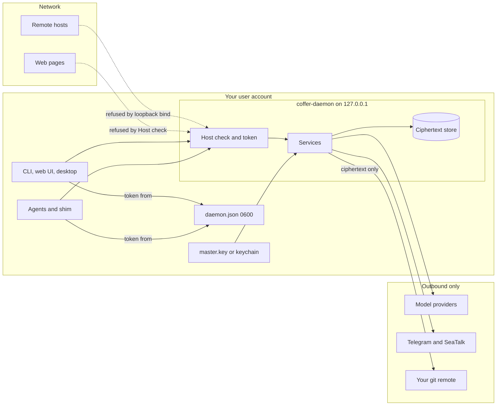

# Security model

This page states what Coffer defends against and what it does not, then walks through each mechanism that holds the line: the network boundary, API authentication, the credential store, outbound requests, agent identity, messaging channels, logging, and sync. It is for engineers reviewing Coffer's security posture and for anyone deciding whether to trust it with their API keys.

## Threat model

Coffer is a **single-user tool on one machine**. There is one owner, no accounts, no roles and no multi-tenancy. The daemon runs as you, and so does everything it starts.

### What Coffer defends against

| Threat | Defence |
| --- | --- |
| A host on the network reaching the daemon. | The daemon binds `127.0.0.1` only. The OS refuses remote connections before they reach Coffer. |
| A web page in your browser reaching the daemon — including through DNS rebinding. | Every request must carry the API token, and every request whose `Host` header is not a loopback authority is refused. |
| Another user account on the same machine. | `daemon.json`, `daemon-config.json` and `master.key` are mode `0600`. |
| Secrets leaking through ordinary artefacts: config files, logs, the audit trail, the sync remote, screenshots of a URL. | Secrets exist at rest only as Fernet ciphertext. Configs hold refs. Audit records refs, never values. Sync carries ciphertext only, and only when you opt in. The token is never put in a URL. |
| An offline copy of `~/.coffer/` (a stolen backup, a synced folder). | Only in keychain mode: the master key then lives in the OS keychain, so the copied database is ciphertext without its key. |
| A stranger messaging your Telegram or SeaTalk bot. | A channel obeys exactly one paired owner, bound by a single-use pairing code. Everyone else is ignored. |
| A provider base URL pointed at an internal address. | The provider introspector resolves the host and refuses loopback, private, link-local and similar ranges. |

### What Coffer does not defend against

Stated plainly, so nobody over-trusts the defaults:

- **Processes running as you.** Anything that can read `~/.coffer/daemon.json` has the API token, and the API can return any stored secret (`GET /api/v1/credentials/{ref}`). In the default key mode, anything that can read `~/.coffer/` also has the master key beside the ciphertext. Local-user isolation is the operating system's job.
- **The agents themselves.** Chat turns run Claude Code with `bypassPermissions` and Codex with `approvalPolicy = "never"` and `sandbox = "danger-full-access"`. Coffer does not gate individual tool calls: the paired owner issuing the instruction is the human in the loop. An agent can do anything you can do in its working directory.
- **Upstream MCP servers you register.** A stdio server is a program Coffer starts as you, with the environment you configured. Registering a server is trusting it.
- **Agent identity spoofing.** The shim reports which agent it serves; nothing verifies it cryptographically (see [Agent identity](#agent-identity)).
- **A compromised OS keychain, or a malicious Coffer binary.**

### Trust boundaries



## Loopback binding

The daemon binds `127.0.0.1` and nothing else ([`infrastructure/daemon/port_alloc.py`](https://github.com/wyx-sg/Coffer/blob/main/backend/coffer/infrastructure/daemon/port_alloc.py)). Uvicorn is handed the pre-bound socket rather than a host and port, so nothing downstream can widen the bind. It is the only socket Coffer listens on: Telegram is long-polled from inside the daemon, and each SeaTalk channel holds one outbound websocket connection. No channel needs a public URL, a tunnel or an inbound port.

## The Host check

Binding to loopback stops remote hosts. It does not stop a browser. A page on `evil.example` whose DNS name the attacker re-points at `127.0.0.1` is, to the browser, still same-origin with `evil.example`, so CORS never applies and the page can read the response body. Because the daemon puts its API token into the web UI's `index.html` (below), one `fetch("/")` from such a page would take the whole vault.

The defence is the `Host` header, which DNS rebinding does not change: a rebound request still says `Host: evil.example`. [`host_guard.py`](https://github.com/wyx-sg/Coffer/blob/main/backend/coffer/surfaces/http/host_guard.py) refuses every HTTP and websocket request whose `Host` is not `localhost` or a loopback IP literal (`127.0.0.1`, `::1`, with or without a port) — including a request with no `Host` at all — with:

```text
HTTP/1.1 421 Misdirected Request
{"error": {"code": "HOST_NOT_LOOPBACK", "message": "Coffer only answers requests addressed to its loopback address; this one named evil.example:8000.", "details": null}}
```

The guard is raw ASGI middleware (it does not buffer bodies, which would break the long-lived `/mcp` streams) and sits outside CORS in the middleware stack, so a rebound request is refused before CORS can bless it. `COFFER_ALLOWED_HOSTS` (comma-separated, or `*`) adds authorities; the backend test suite sets it because it drives the app in-process. A real deployment needs nothing there.

## The API token

### Minting and storage

At every start the daemon mints a fresh token with `secrets.token_urlsafe(32)` (256 bits) and writes it into `~/.coffer/daemon.json` along with the pid and port. The file is staged with `mkstemp` and moved into place atomically, so it never exists with a mode wider than `0600`. The token is not persisted across restarts, not placed in any environment variable, and not written into any agent's config: the shim reads it from `daemon.json` at runtime.

### Checking it

Every route under `/api/v1/*` and the `/mcp` endpoint require an `X-Coffer-Token` header, compared in constant time (`hmac.compare_digest`) against the daemon's in-process token. A missing or wrong token is `401`; a request that arrives before the daemon has published its token is `503`. The one unauthenticated API route is `GET /api/v1/daemon/status`, the readiness probe the CLI and shim call before they have a token; it returns lifecycle phase, version, executable, port, release channel, feature switches, machine name and an aggregate upstream health summary — nothing secret.

`coffer daemon rotate-token` (or `POST /api/v1/daemon/rotate-token`) mints a new token, rewrites `daemon.json`, invalidates the old token immediately, and records `token_rotated` in the audit log.

### Getting it into the page

The web UI needs the token too, and a URL is the wrong channel: it ends up in browser history, session restore, screenshots and pasted bug reports. So the daemon hands it over in the **response body**. Whenever it serves `index.html` — for `/` and for every client-side route through the SPA fallback — it injects `window.__COFFER_TOKEN__` as the first script in `<head>`, read from the same in-process variable the token check compares against, so what the page holds cannot drift from what the API accepts ([`webui.py`](https://github.com/wyx-sg/Coffer/blob/main/backend/coffer/surfaces/http/webui.py)).

- The document is served `Cache-Control: no-store`, with no ETag or Last-Modified, so a restarted daemon's browser never gets the previous daemon's token from a cache. Hashed files under `/assets` keep normal caching.
- The page persists nothing: reload after a daemon restart and it is authenticated against the new daemon.
- `coffer open` carries no credential. It reads the daemon's port from `daemon.json` and opens the browser there.

The token in the page is exactly what makes the [Host check](#the-host-check) mandatory; neither exists without the other.

The desktop shell loads the same frontend as a local asset that nobody served, so there is no `index.html` to inject into. It supplies the same two globals over a Tauri IPC command before first render instead. The Vite dev server does the same from `daemon.json` during development. Each host is a credential *supplier*; the page reads one pair of globals either way.

### CORS

CORS is not Coffer's security boundary — the token is — but the allowlist is kept tight. The browser-served UI is same-origin with the API and needs nothing. The desktop shell's page origin (`tauri://localhost`, or `http://tauri.localhost` on other platforms) is allowed by default, because its API calls to `http://127.0.0.1:<port>` are cross-origin. `COFFER_DEV_CORS=1` adds the Vite dev origins `http://localhost:5173` and `http://127.0.0.1:5173`; `COFFER_CORS_ORIGINS` replaces the list outright. `allow_credentials` is always false, so no cookie is ever attached; every request still needs the token.

## The credential store

### Envelope encryption

Secrets live only as **Fernet ciphertext** in the `credentials` table of `~/.coffer/coffer.db`, keyed by a **ref** — a name such as `github-token`. Everything else in Coffer holds refs:

- An MCP server's config maps environment variables or headers to refs in `transport.credential_refs`. Its schema rejects a static `env` or header value that looks like a secret (`Bearer …`, `ghp_…`, `github_pat_…`, `sk-…`, `xox?-…`, a JWT prefix) and tells you to move it into `credential_refs`.
- A channel's bot token or app secret, a provider's API key, and the sync remote's push credential are refs.
- When you switch a provider into Claude Code, Coffer writes an `apiKeyHelper` line (`coffer provider key --connection-uid <uid>`) into Claude Code's settings, never the key itself. Codex is pointed at an environment variable name, also never the key.

Plaintext exists in memory only between decrypt and the spawn or header injection that consumes it. Registration probes every cited ref before writing the resource, so a missing secret fails with `CREDENTIAL_MISSING` and leaves nothing behind; deleting a credential that a resource still cites is refused with `409`; and deleting a resource releases any credential no remaining resource cites.

The daemon is the only owner of secret material. The CLI and the web UI store and read secrets through `/api/v1/credentials`; an import contract forbids the CLI from importing the credential module at all, so each machine has exactly one reader of the key.

### The master key

The one secret outside the database is the Fernet master key, managed by [`MasterKeyManager`](https://github.com/wyx-sg/Coffer/blob/main/backend/coffer/infrastructure/credentials/master_key.py). It lives in exactly one of two places:

| Mode | Where | Defends against an offline copy of `~/.coffer/`? | Prompts |
| --- | --- | --- | --- |
| `file` (default) | `~/.coffer/master.key`, mode `0600` | No — the key sits beside the ciphertext. | None. |
| `keychain` | OS keychain, service `coffer`, ref `master-key` | Yes. | At most once per daemon start on macOS. |

Switch with **Settings → Security** or `coffer credentials storage --set keychain`. Switching **moves the key, never re-encrypts the data**; the old copy is deleted last, and resolution is file-first, so an interrupted move always resolves to a working key.

Startup is fail-closed. The daemon counts `credentials` rows *before* resolving the key, and creates a new key only when the table is empty. Ciphertext with no resolvable key stops the daemon with `MASTER_KEY_MISSING`, naming the path; a locked keychain that might hold the key stops it with `CREDENTIAL_LOCKED` rather than creating a second key that would shadow it.

`keyring` is imported by exactly one module, [`infrastructure/credentials/keyring_adapter.py`](https://github.com/wyx-sg/Coffer/blob/main/backend/coffer/infrastructure/credentials/keyring_adapter.py), and an import contract fails the build if surfaces or application code import it.

::: warning The macOS keychain and unsigned builds
macOS pins a keychain item's access list to the code signature of the binary that created it. Coffer's binaries are not signed with an Apple Developer Team ID, so each new build looks like a different application to the keychain. That is why the default keeps the master key in a file: with one key per vault instead of one keychain item per secret, keychain mode costs at most one prompt per daemon start rather than one per secret on every rebuild. Only a stable Team ID signature would remove the prompt entirely.
:::

::: tip Back up the key with the database
A copy of `coffer.db` without its master key yields no secrets. Back up `~/.coffer/` as a whole, or export the key with `coffer sync key export` and keep it somewhere safe.
:::

## Outbound requests

[`infrastructure/net/ssrf_guard.py`](https://github.com/wyx-sg/Coffer/blob/main/backend/coffer/infrastructure/net/ssrf_guard.py) resolves a URL's host and refuses it if any resolved address is loopback, private (RFC 1918, `fc00::/7`), link-local, carrier-grade NAT (`100.64.0.0/10`), multicast, unspecified or reserved. A name that fails to resolve counts as blocked.

It guards the one place Coffer fetches from a URL typed into a form to probe it: the provider introspector, which asks a configured provider endpoint for its model list. Protocols that are local by design (Ollama) are exempt. It is not applied to:

- **HTTP-transport MCP servers**, whose URL you registered — they commonly run on your own machine or network.
- **Coffer's own model calls** and **transcription**, which go to the providers you configured.
- **Telegram and SeaTalk**, fixed well-known hosts.
- **Vault sync**, which is a `git` subprocess against the remote you configured.

The guard resolves DNS at validation time and the HTTP client resolves again when it connects, so a host that re-points between the two can slip past. Pinning the resolved address through to the client would break TLS certificate verification; for a single-user daemon where you typed the URL yourself, that residual risk is accepted.

## Agent identity

When Coffer installs its MCP entry into an agent, it writes `coffer-mcp-shim --agent-uid <uid>`. The shim stamps that uid onto the MCP handshake as `_meta["coffer/agent-uid"]`, and the gateway uses it for two things:

1. **Reach.** Every scoped resource is filtered with `is_active(scope, agent_uid)`. A session with no identity — a shim you configured by hand — matches only unscoped resources, so it sees strictly less, never more. An older shim sending a name-based key is read as unidentified; there is no fallback that could match a stale label against a scope.
2. **Attribution.** Every builtin tool call carries an `agent` argument naming the caller, which tools such as `coffer__write` record. The gateway **always** sets it from the handshake identity (resolved to the agent's current name): a value the client supplied is dropped unconditionally, and with no identity the argument is simply absent. No builtin tool advertises the argument, so a model has nothing to fill in.

The identity is self-reported by a process running as you. It is not a security boundary against a malicious local process — any such process already holds the token — and the spec says so rather than implying stronger isolation.

## Channels and owner pairing

A channel is the one surface through which someone outside your machine can make an agent act, so it has exactly one gate: **owner pairing**.

- You issue a pairing code from the channel's page or with `coffer channel`. A code is 8 characters from an alphabet without look-alikes (no `0`, `O`, `1`, `I`), single-use, valid for one hour, allows 10 wrong guesses before it is invalidated, and lives only in memory — a daemon restart drops it.
- You send the code to the bot from your own account (or tap the start link that carries it). That binds your platform identity as the channel's owner and records `channel_paired` in the audit log.
- From then on the channel obeys only messages whose sender is the owner. In a group, a message addressed to the bot by anyone else gets a one-line refusal; in a paired chat, a message from a different member is ignored silently and cannot re-pair the channel; an unpaired direct chat can do nothing but present a pairing code. When a sender's identity cannot be established in a group, the message is refused, never assumed to be the owner's.
- A channel's **inverted scope** limits which agents it may drive at all, and a channel whose scope is empty does not start.

Channel secrets are refs, resolved from the credential store when the adapter starts.

## What goes into logs and audit

- **Logs** (`~/.coffer/logs/`, one JSON object per line) record events, identifiers and errors. No code path logs a secret value, a token or a decrypted credential.
- **Audit** records every lifecycle change with its actor. Credential events (`credential_set`, `credential_read`, `credential_deleted`, `credential_migrated`) record the **ref** only. Resource configs pass through the kind's `audit_redactor` first — the MCP kind strips `transport.env` and `transport.headers` entirely — so a value pasted into the wrong field still does not reach `audit_log`. Master-key events (`master_key_relocated`, `master_key_exported`, `master_key_imported`) record that the event happened, not the key.
- **The sync history** stores the remote's commit and errors after the push credential has been redacted out.

## Sync carries ciphertext only

Vault sync converges the vault with a git remote you own. It is off until you configure a remote, and its security rests on what does and does not travel:

- **Credentials travel only if you opt in** (`coffer sync remote set --with-credentials`), and then only as Fernet ciphertext, one `credentials/<ref>.enc` file per secret. What lands in the repository cannot be decrypted on its own.
- **The master key never travels with the data.** You carry it between machines yourself: `coffer sync key export` writes it out on one machine, `coffer sync key import` installs it on another, and `coffer sync key fingerprint` lets you compare the two. Importing a different key first backs the existing one up to a timestamped `master.key.bak-*` file, because it may be the only key that decrypts existing ciphertext.
- **A machine without the matching key** reports the refs it holds ciphertext for but cannot decrypt, rather than failing silently.
- **Reach does not travel.** Which resources are enabled, and for which agents, is decided on each machine, so another machine's round can never widen what this one exposes.
- **Deletions are guarded.** A round that would delete more than its configured share holds for your confirmation.

See [Vault sync](/architecture/vault-sync) for the full protocol.

## Trade-offs and alternatives

- **Keychain as the default secret store.** Rejected: under an unsigned, frequently rebuilt binary, macOS re-prompted for every secret on every rebuild. File-default with a keychain opt-in removes the prompts while still offering the stronger mode.
- **A passphrase-derived key.** Rejected for the default: a prompt at every daemon start, and a forgotten passphrase loses every secret.
- **Persisting the API token across restarts.** Rejected: a long-lived on-disk token that unlocks the credential endpoints is worse than a per-process one.
- **Putting the token in the URL.** Rejected: URLs leak into history, screenshots and bug reports; a response body does not.
- **Relying on loopback binding alone.** Rejected: that is exactly the gap DNS rebinding walks through.
- **Per-tool approval prompts for agents.** Not built: every instruction already comes from the paired owner, so a per-tool prompt would only re-confirm what the owner asked for.

## Where it lives in the code

| Path | Contents |
| --- | --- |
| [`surfaces/http/auth.py`](https://github.com/wyx-sg/Coffer/blob/main/backend/coffer/surfaces/http/auth.py) | Token check. |
| [`surfaces/http/host_guard.py`](https://github.com/wyx-sg/Coffer/blob/main/backend/coffer/surfaces/http/host_guard.py) | Loopback `Host` check. |
| [`surfaces/http/cors.py`](https://github.com/wyx-sg/Coffer/blob/main/backend/coffer/surfaces/http/cors.py), [`middleware.py`](https://github.com/wyx-sg/Coffer/blob/main/backend/coffer/surfaces/http/middleware.py) | CORS allowlist and middleware order. |
| [`surfaces/http/webui.py`](https://github.com/wyx-sg/Coffer/blob/main/backend/coffer/surfaces/http/webui.py) | Serving the UI with the injected token. |
| [`infrastructure/daemon/bootstrap.py`](https://github.com/wyx-sg/Coffer/blob/main/backend/coffer/infrastructure/daemon/bootstrap.py), [`atomic_write.py`](https://github.com/wyx-sg/Coffer/blob/main/backend/coffer/infrastructure/daemon/atomic_write.py) | Token minting, `daemon.json`, `0600` writes. |
| [`infrastructure/credentials/`](https://github.com/wyx-sg/Coffer/tree/main/backend/coffer/infrastructure/credentials) | Encrypted store, master key, keyring adapter. |
| [`infrastructure/net/ssrf_guard.py`](https://github.com/wyx-sg/Coffer/blob/main/backend/coffer/infrastructure/net/ssrf_guard.py) | SSRF guard. |
| [`application/mcp/gateway_parsing.py`](https://github.com/wyx-sg/Coffer/blob/main/backend/coffer/application/mcp/gateway_parsing.py), [`gateway_builtin.py`](https://github.com/wyx-sg/Coffer/blob/main/backend/coffer/application/mcp/gateway_builtin.py) | Handshake identity and the `agent` argument overwrite. |
| [`application/channel/pairing.py`](https://github.com/wyx-sg/Coffer/blob/main/backend/coffer/application/channel/pairing.py), [`inbound.py`](https://github.com/wyx-sg/Coffer/blob/main/backend/coffer/application/channel/inbound.py) | Pairing codes and the owner gate. |

## Related

- [Credentials guide](/guides/credentials)
- [Security policy](/contributing/security) — how to report a vulnerability.
- [Envelope-Encrypted Credential Store](https://github.com/wyx-sg/Coffer/blob/main/docs/decisions/envelope-encrypted-credential-store.md)
- [The Daemon Serves Its Token in the Page](https://github.com/wyx-sg/Coffer/blob/main/docs/decisions/daemon-serves-the-token-in-the-page.md)
- [Per-Agent Resource Scope](https://github.com/wyx-sg/Coffer/blob/main/docs/decisions/per-agent-resource-scope.md)
- [Remove the Tool-Approval System](https://github.com/wyx-sg/Coffer/blob/main/docs/decisions/remove-tool-approval.md)
- Specs: [credentials](https://github.com/wyx-sg/Coffer/blob/main/openspec/specs/credentials/spec.md), [daemon](https://github.com/wyx-sg/Coffer/blob/main/openspec/specs/daemon/spec.md), [channels](https://github.com/wyx-sg/Coffer/blob/main/openspec/specs/channels/spec.md)
