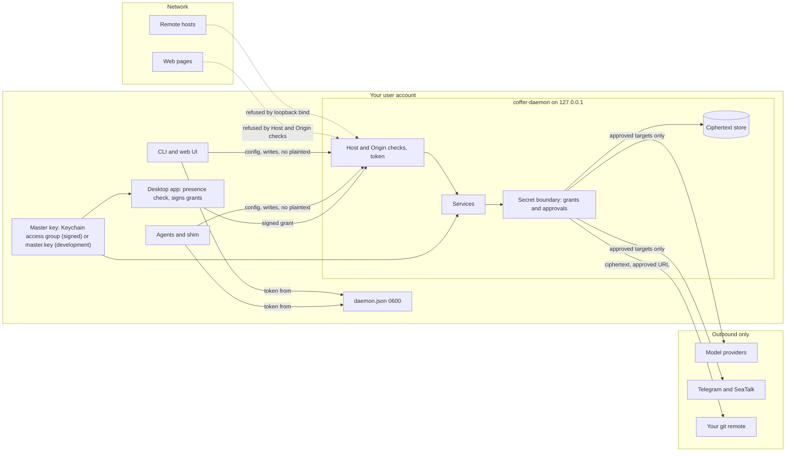

# Security model

This page states what Coffer defends against and what it does not, then walks through each mechanism that holds the line: the secret boundary, the network boundary, API authentication, the credential store and its master key, outbound requests, agent identity, messaging channels, logging, and sync. It is for engineers reviewing Coffer's security posture and for anyone deciding whether to trust it with their API keys. For day-to-day use of the boundary — `coffer run`, approvals, key backups — see [Secrets](/guides/secrets).

## Threat model

Coffer is a **single-user tool on one machine**. There is one owner, no accounts, no roles and no multi-tenancy. The daemon runs as you, and so does everything it starts — including the coding agents it serves.

### The adversary

The case that matters is a **prompt-injected agent running as you**: Claude Code or Codex read a hostile web page, issue, README or tool result, and now follows the attacker's instructions with your shell. It can run any command you can, read `~/.coffer/daemon.json` and call every management route with its token, run every `coffer` command, write its own configuration, and read the initial environment of any process you own. Coffer cannot take any of that away from it, and does not try to.

Second in line is **a web page in your browser**, which can send requests to `127.0.0.1` and, through DNS rebinding, read the answers.

Out of scope: a malicious program you installed yourself (nothing at user level stops that), and another user account on the machine (loopback binding and file modes keep that one out).

### The boundary is the secret

Because an agent can already do almost anything you can, Coffer does not gate *configuration*: agents may read and change Coffer's setup through the CLI, the REST API and MCP, exactly as you can. That is how an agent sets Coffer up for you. Coffer instead guards the two things an agent **cannot** do on its own:

1. **Learn a secret's plaintext.** No route, command or MCP tool returns a stored value or the master key. Plaintext reaches only a person present at the desktop app, after a presence check for that one operation. See [Plaintext reaches only a present human](#plaintext-reaches-only-a-present-human).
2. **Make Coffer send a secret somewhere new.** A secret does not have to be read to be stolen: an agent could register an MCP server whose environment cites your GitHub token and whose command is the attacker's script, and let Coffer deliver the token. So a secret goes to a new destination only after you approve it in the desktop app. See [A secret goes somewhere new only with your approval](#a-secret-goes-somewhere-new-only-with-your-approval).

Three rules keep those two honest:

3. **The protections are switched off only the same way** — by an approval in the desktop app. No environment variable, config key or CLI flag does it.
4. **Every listener checks `Host` and `Origin`**, which closes the browser vector. See [The Host and Origin checks](#the-host-and-origin-checks).
5. **Agents get capabilities, not keys.** The MCP gateway injects an HTTP upstream's headers itself, so an agent sees tool results and never the token.

This is the same pair of moves password managers and agent vendors settled on: a human-presence gate the agent cannot satisfy, and a broker that injects the credential so the agent never holds it.

::: danger The boundary holds only in a signed release
The presence grant that proves "a person approved this" is signed with a key derived from the master key, and only the signed desktop app can read that key — **once Coffer ships binaries signed with an Apple Developer ID**. It does not yet. Until then every build is a development build: the master key is the file `~/.coffer/master.key`, any process running as you can read it, and so a same-user process can forge a grant. **In a development build the secret boundary does not hold.** See [Development builds](#development-builds).
:::

### What Coffer defends against

| Threat | Defence |
| --- | --- |
| An agent asking Coffer for a secret's value — through REST, the CLI, MCP, or a master key export. | No route, command or tool returns a value or the key. Reveals and key backups exist only in the desktop app, behind a presence check. |
| An agent making Coffer deliver an existing secret to a program or URL of its choosing. | Every destination is checked at the moment of use. A secret goes to a target no person approved only after an approval in the desktop app, signed with a presence grant. |
| An agent swapping a secret's value (a channel's bot token for the attacker's bot) or switching the protection off. | Both wait for the same approval. |
| A secret pasted into a skill file, `.env` or script that syncs to git, or echoed into a transcript. | Standalone secrets are cited as `coffer://secret/<name>` and resolved by `coffer run` into one child's environment only, with exact values masked in its output. This guards against accidents, not against the agent (see below). |
| A web page in your browser reaching the daemon — including through DNS rebinding. | Every request whose `Host` is not the daemon's own loopback address and port is refused, and so is every request whose `Origin` is not one of Coffer's own. Every management call must also carry the API token. The browser UI offers no reveal, backup or approval. |
| A host on the network reaching the daemon. | The daemon binds `127.0.0.1` only. The OS refuses remote connections before they reach Coffer. |
| Another user account on the same machine. | `daemon.json`, `daemon-config.json` and, in a development build, `master.key` are mode `0600`. |
| Secrets leaking through ordinary artefacts: config files, logs, the audit trail, the sync remote, screenshots of a URL. | Secrets exist at rest only as Fernet ciphertext. Configs hold refs. Audit records refs, never values. Sync carries ciphertext only, and only when you opt in. The token is never put in a URL. |
| An offline copy of `~/.coffer/` (a stolen backup, a synced folder). | In a signed release the master key is in the Keychain, not in `~/.coffer/`, so the copy is ciphertext without its key. In a development build, only in keychain mode. |
| A stranger messaging your Telegram or SeaTalk bot. | A channel obeys exactly one paired owner, bound by a single-use pairing code. Everyone else is ignored. |
| A provider base URL pointed at an internal address. | The provider introspector resolves the host and refuses loopback, private, link-local and similar ranges. |

### What stays exposed

Stated plainly, so nobody over-trusts the boundary. Each is a consequence of running as the same user, and the UI labels the secrets they cover as readable by local processes rather than describing Coffer as protecting them.

- **A stdio MCP server's environment.** A third-party server that takes its token from an environment variable holds it in its initial environment, which any process running as you can read with `ps eww` — measured from inside Claude Code's sandbox too, and against a hardened-runtime binary. Coffer cannot fix a server it did not write. It marks such servers "readable by other processes on this Mac"; prefer an HTTP server with gateway-injected headers wherever the upstream offers one.
- **`coffer run` children.** A standalone secret resolved into a command's environment is readable by the agent that started the command: the agent is the parent, and `ps eww` works regardless. It can also simply run `coffer run --secret X -- env`. `coffer run` is an accident guard, and every standalone secret is listed as readable by local processes.
- **Computer-use agents.** An agent granted Accessibility or screen control can click an approval or type your password. The presence check holds against an agent with a shell, not one with the mouse.
- **The signed CLI shares the key's access group.** In a signed release the `coffer` CLI could read the master key. That is acceptable because no CLI code path returns plaintext, the key or a grant, and the hardened runtime keeps other processes from attaching to or injecting into Coffer's signed binaries.
- **Bypass modes.** An agent in `bypassPermissions`, `--yolo` or `danger-full-access` has no sandbox of its own. Nothing above depends on one; nothing above protects what such an agent reaches outside Coffer either. Coffer's own chat turns run agents this way (below).
- **Development builds.** Everything in [Development builds](#development-builds).

And, as before:

- **The agents' own actions.** Chat turns run Claude Code with `bypassPermissions` and Codex with `approvalPolicy = "never"` and `sandbox = "danger-full-access"`. Coffer does not gate individual tool calls: the paired owner issuing the instruction is the human in the loop. An agent can do anything you can do in its working directory.
- **Upstream MCP servers you register.** A stdio server is a program Coffer starts as you. Registering a server is trusting it.
- **Agent identity spoofing.** The shim reports which agent it serves; nothing verifies it cryptographically (see [Agent identity](#agent-identity)).
- **A compromised OS keychain, or a malicious Coffer binary.**

### Trust boundaries


```mermaid
flowchart LR
  subgraph net["Network"]
    REMOTE["Remote hosts"]
    WEBPAGE["Web pages"]
  end
  subgraph user["Your user account"]
    AGENTS["Agents and shim"]
    CLIENTS["CLI and web UI"]
    DJ["daemon.json 0600"]
    subgraph daemon["coffer-daemon on 127.0.0.1"]
      GUARD["Host and Origin checks, token"]
      CORE["Services"]
      GATE["Secret boundary: grants and approvals"]
      STORE[("Ciphertext store")]
    end
    APP["Desktop app: presence check, signs grants"]
    KEY["Master key: Keychain access group (signed) or master.key (development)"]
  end
  subgraph ext["Outbound only"]
    PROV["Model providers"]
    IM["Telegram and SeaTalk"]
    GIT["Your git remote"]
  end
  REMOTE -.->|"refused by loopback bind"| GUARD
  WEBPAGE -.->|"refused by Host and Origin checks"| GUARD
  CLIENTS -->|token from| DJ
  AGENTS -->|token from| DJ
  CLIENTS -->|"config, writes, no plaintext"| GUARD
  AGENTS -->|"config, writes, no plaintext"| GUARD
  APP -->|"signed grant"| GUARD
  GUARD --> CORE
  CORE --> GATE
  GATE --> STORE
  KEY --> CORE
  KEY --> APP
  GATE -->|"approved targets only"| PROV
  GATE -->|"approved targets only"| IM
  GATE -->|"ciphertext, approved URL"| GIT
```

## Plaintext reaches only a present human

Three operations let plaintext out, and all three live only in the desktop app: **revealing or copying a secret**, **writing a master key backup**, and **approving** an [approval](#a-secret-goes-somewhere-new-only-with-your-approval). Each runs the same way:

1. **A presence check first.** The app runs a LocalAuthentication check — Touch ID, or your login password — with a fresh context for this one operation and **no reuse window**: the next reveal asks again. The prompt macOS shows names the operation and its target ("reveal the secret github/token"), so it is the operating system, not the page, that tells you what you are approving. Cancelling sends nothing.
2. **A one-time challenge.** The app asks the daemon for a challenge bound to that operation and that target — this ref, this approval, this folder. A challenge expires within two minutes and is consumed by its first use, whether or not it verifies.
3. **A signed grant.** The app signs the challenge with a key derived from the master key, which only Coffer's signed binaries can read. The derived key is computed when needed and never stored.
4. **The operation.** The daemon checks the signature and acts only if it verifies — releasing the one value to the app's window, writing the backup into the folder you picked, or applying the approval. A grant for one operation authorises nothing else, and a missing, reused, expired or forged grant is refused with `PRESENCE_GRANT_INVALID`.

A process an agent controls cannot read the master key in a signed release, so it cannot sign a grant. The daemon releases a value to the app rather than letting the app decrypt ciphertext itself: there is one decryption path, and the app needs no access to the store.

Around the three operations:

- **No other path returns plaintext.** There is no plaintext read route and no `coffer credentials get --show`; `coffer credentials get` checks presence only. There is no key export command or route. The browser UI shows **Open in Coffer app** where these actions would be. The one other place plaintext leaves the daemon is `coffer run`'s resolve of standalone secrets, which is confined to the `secret/` namespace and covered under [What stays exposed](#what-stays-exposed).
- **The master key never crosses the API.** A key backup is written by the daemon into the folder you chose, as `coffer-master-key-<fingerprint>.key`, mode `0600`, never over an existing file; the response carries only the path and the fingerprint.
- **Every release is audited:** a reveal as `credential_revealed` with the ref only, a backup as `master_key_exported`, an approval as `secret_approval_approved`.
- **Writing stays open.** Any surface may store a secret: whoever supplies a value already has it.

## A secret goes somewhere new only with your approval

A **destination** is a place Coffer sends a secret's plaintext. Each one has a **target**: what actually receives the value, written so a person can judge it.

| Destination | Target |
| --- | --- |
| A stdio MCP server's environment variable | the full command line, its working directory and its non-secret environment — `NODE_OPTIONS=--require …` changes what the process does |
| An HTTP MCP server's header | the server's URL |
| A Telegram channel's bot token | the Telegram bot |
| A SeaTalk channel's app secret | the SeaTalk app id |
| The sync remote's push token | the git URL |

A provider connection's key goes through the same check against its base URL: the local model proxy and Coffer's own engine receive it only for an approved URL, and replacing a key in use waits for approval too. A custom tool's authentication will join when custom tools are built; a new destination type joins this list in the change that introduces it.

Every consumer asks the boundary before it resolves a secret, at the moment of use — spawning a server, starting a channel adapter, pushing a sync round. A secret approved for its current target is injected. Otherwise nothing is injected, the attempt fails with `SECRET_BINDING_PENDING`, and one pending approval is recorded per target; a newer target supersedes the approval for an older one. Because the check happens at use, a change made behind Coffer's back — a vault file edited by hand, a server another machine synced in — is caught where it matters.

Three things approve a binding without a person:

- **Adoption at upgrade.** The first start of a daemon with the boundary approves every binding already in use, once, so upgrading breaks nothing that worked.
- **A value supplied for it.** A ref that has never been sent anywhere, is not a standalone secret, and was stored within the last five minutes is used at once. Every "add" flow stores the pasted secret and cites it seconds later; a secret stored long ago, already sent elsewhere, or kept for `coffer run` is not fresh.
- **The protection switched off**, which itself waits for an approval.

Two more changes widen where a secret goes and wait for the same approval:

- **Replacing a value in use.** A new value for a ref an approved destination receives, or for any standalone secret, is held encrypted until you approve; the old value stays in use. Replacing a channel's bot token with the attacker's bot would redirect your conversations.
- **Switching the protection off** (`secrets.require_approval`). Switching it on applies at once.

Approving takes a presence grant. Rejecting does not — refusing only narrows what Coffer does — and works from every surface, including `coffer credentials reject`. The desktop app raises a notification for each new pending approval and opens a sheet to answer it; the CLI prints `waiting for approval in the Coffer app` and exits `9`, or waits with `--wait`. See [Secrets → Approvals](/guides/secrets#approvals).

## Development builds

The boundary rests on one fact: in a signed release, only Coffer's signed binaries can read the master key, so only the desktop app can sign a grant. Coffer does not ship such binaries yet, and a build from source never will. In those **development builds**:

- the master key is the file `~/.coffer/master.key` (or, opt-in, a login-keychain item), readable by any process running as you;
- that process can derive the grant key and forge a reveal, a key backup or an approval;
- so **the secret boundary does not hold**. The rules still run — no plaintext route, approvals, `coffer run` masking — and still catch accidents, but they do not stop a determined same-user agent.

A development build says so. The daemon reports itself as one, and the desktop app titles every presence prompt "Development build". Where a development machine has no LocalAuthentication, the app falls back to a confirmation dialog in its own window — never to no check.

The boundary holds only in a release signed with Coffer's Developer ID, under the hardened runtime and notarised, with the master key in a Keychain access group only those binaries can read.

## Loopback binding

The daemon binds `127.0.0.1` and nothing else ([`infrastructure/daemon/port_alloc.py`](https://github.com/wyx-sg/Coffer/blob/main/backend/coffer/infrastructure/daemon/port_alloc.py)). Uvicorn is handed the pre-bound socket rather than a host and port, so nothing downstream can widen the bind. Coffer listens on one other socket: the [local model proxy](/architecture/model-proxy), the daemon's sibling process, binds `127.0.0.1:8001` (`proxy_port` in `daemon-config.json`) and nothing else, and runs Host and Origin checks of its own (see [below](#the-model-proxy-listener)). Nothing else listens: Telegram is long-polled from inside the daemon, and each SeaTalk channel holds one outbound websocket connection. No channel needs a public URL, a tunnel or an inbound port.

## The Host and Origin checks

Binding to loopback stops remote hosts. It does not stop a browser, because any page you have open can send requests to `127.0.0.1`. Coffer runs two checks on every request before any route sees it. They cover the REST API, the `/mcp` endpoint, the `/api/v1/events` stream, websockets, the status probe and the served web UI. The daemon has one listener and every surface is on it, so there is no path to the daemon that skips the checks. This follows the MCP specification, which says an HTTP server must validate `Origin` on every connection. The same gap caused CVE-2025-49596 in the MCP Inspector, CVE-2024-28224 in Ollama and TS-2022-004/005 in Tailscale.

### Host: DNS rebinding

Suppose an attacker controls `evil.example` and re-points its DNS name at `127.0.0.1`. To the browser, the page is still same-origin with `evil.example`, so CORS never applies and the page can read the response body. The daemon puts its API token into the web UI's `index.html` (see below), so one `fetch("/")` from that page would take the token, and with it everything the API can do: change Coffer's configuration, register a server, run up your provider bill.

DNS rebinding does not change the `Host` header. A rebound request still says `Host: evil.example:8000`. So the daemon accepts a request only when `Host` names `127.0.0.1`, `localhost` or `[::1]` **and** the port the request arrived on. It refuses anything else, including a request with no `Host` and a loopback name on another port:

```text
HTTP/1.1 403 Forbidden
{"error": {"code": "HOST_NOT_ALLOWED", "message": "Coffer only answers requests addressed to 127.0.0.1:8000 or localhost:8000; this one named evil.example:8000.", "details": null}}
```

### Origin: requests from other sites

A page on another site can still *send* a request to the right address even though it cannot read the answer: a form post, an `EventSource`, or a `fetch` in `no-cors` mode. The token already makes such a request fail. The Origin check makes it fail without relying on the token. A request that carries an `Origin` header gets through only if the origin is one of Coffer's own:

| Origin | When it is allowed |
| --- | --- |
| `http://127.0.0.1:<port>`, `http://localhost:<port>`, `http://[::1]:<port>` | Always. This is the web UI the daemon serves, opened in a browser tab. |
| `tauri://localhost`, `http://tauri.localhost` | By default. This is the desktop app, which loads the UI from its own origin. |
| `http://localhost:5173`, `http://127.0.0.1:5173` | Only with `COFFER_DEV_CORS=1`. This is the Vite dev server. |
| Any origin listed in `COFFER_CORS_ORIGINS` | Only when that variable is set. The list replaces the desktop and Vite entries. |

Every other origin, including `null`, gets `403 ORIGIN_NOT_ALLOWED`. The check happens before the route runs, so it applies even when the request carries the right token.

A request with **no** `Origin` goes on to the token check. That is how the CLI, the shim, an agent's MCP client and `curl` send requests. Browsers are the only clients that send `Origin`, and a non-browser client can put whatever it likes there anyway.

The daemon logs each distinct refused `Host` or `Origin` once, as `http.request_refused`. A page that retries in a loop cannot flood the log.

### Allowing a development origin

You only need this when you serve the UI yourself instead of opening it from the daemon or the desktop app.

- **The Vite dev server on port 5173.** Start the daemon with `COFFER_DEV_CORS=1`. `make dev` does this for you.
- **Any other origin**, such as Vite on a spare port: set `COFFER_CORS_ORIGINS` to a comma-separated list of exact origins before you start the daemon, for example `COFFER_CORS_ORIGINS=http://localhost:5174,http://127.0.0.1:5174`. The list replaces the desktop and Vite entries, so include those too if you still need them. The daemon's own origins are always allowed.

Both variables are read when the daemon starts, so restart it after you change them. Never put a site you do not control on the list: any page on a listed origin can call the daemon.

`COFFER_ALLOWED_HOSTS` (comma-separated hostnames, or `*`) adds names that the Host check accepts. It never relaxes the Origin check. The backend test suite sets it because it drives the app in-process with made-up hostnames. A real installation does not need it.

### The model proxy listener

The [local model proxy](/architecture/model-proxy) is Coffer's second listener, and it runs its own checks before anything else ([`infrastructure/model_proxy/app.py`](https://github.com/wyx-sg/Coffer/blob/main/backend/coffer/infrastructure/model_proxy/app.py)). They are stricter than the daemon's. A request whose `Host` is not a loopback name on the port it arrived on gets 403, and `COFFER_ALLOWED_HOSTS` does not apply here. **Any** request that carries an `Origin` header gets 403 as well, because no browser page is a client of the proxy. Only then does a model route check the agent's local proxy token. The daemon's control routes are behind a separate control token from `~/.coffer/proxy.json`.

## The API token

### Minting and storage

At every start the daemon mints a fresh token with `secrets.token_urlsafe(32)` (256 bits) and writes it into `~/.coffer/daemon.json` along with the pid and port. The file is staged with `mkstemp` and moved into place atomically, so it never exists with a mode wider than `0600`. The token is not persisted across restarts, not placed in any environment variable, and not written into any agent's config: the shim reads it from `daemon.json` at runtime.

### Checking it

Every route under `/api/v1/*` and the `/mcp` endpoint require an `X-Coffer-Token` header, compared in constant time (`hmac.compare_digest`) against the daemon's in-process token. A missing or wrong token is `401`; a request that arrives before the daemon has published its token is `503`. The one unauthenticated API route is `GET /api/v1/daemon/status`, the readiness probe the CLI and shim call before they have a token; it returns lifecycle phase, version, executable, port, release channel, feature switches, machine name and an aggregate upstream health summary — nothing secret.

`coffer daemon rotate-token` (or `POST /api/v1/daemon/rotate-token`) mints a new token, rewrites `daemon.json`, invalidates the old token immediately, and records `token_rotated` in the audit log.

### Getting it into the page

The web UI needs the token too, and a URL is the wrong channel: it ends up in browser history, session restore, screenshots and pasted bug reports. So the daemon hands it over in the **response body**. Whenever it serves `index.html` — for `/` and for every client-side route through the SPA fallback — it injects `window.__COFFER_TOKEN__` as the first script in `<head>`, read from the same in-process variable the token check compares against, so what the page holds cannot drift from what the API accepts ([`webui.py`](https://github.com/wyx-sg/Coffer/blob/main/backend/coffer/surfaces/http/webui.py)).

- The document is served `Cache-Control: no-store`, with no ETag or Last-Modified, so a restarted daemon's browser never gets the previous daemon's token from a cache. Hashed files under `/assets` keep normal caching.
- The page persists nothing: reload after a daemon restart and it is authenticated against the new daemon.
- `coffer open` carries no credential. It reads the daemon's port from `daemon.json` and opens the browser there.

The token in the page is exactly what makes the [Host check](#host-dns-rebinding) mandatory; neither exists without the other.

The desktop shell loads the same frontend as a local asset that nobody served, so there is no `index.html` to inject into. It supplies the same two globals over a Tauri IPC command before first render instead. The Vite dev server does the same from `daemon.json` during development. Each host is a credential *supplier*; the page reads one pair of globals either way.

### CORS

CORS grants exactly the cross-origin entries of the [Origin table](#origin-requests-from-other-sites): the desktop app's origins by default, and the development origins when you opt in. The browser-served UI is same-origin with the API and needs no CORS. CORS never uses a wildcard, and `allow_credentials` is always false, so no cookie is ever attached. CORS and the Origin check read the same list, so they cannot disagree.

## The credential store

### Envelope encryption

Secrets live only as **Fernet ciphertext** in the `credentials` table of `~/.coffer/coffer.db`, keyed by a **ref** — a name such as `github-token`. Everything else in Coffer holds refs:

- An MCP server's config maps environment variables or headers to refs in `transport.credential_refs`. Its schema rejects a static `env` or header value that looks like a secret (`Bearer …`, `ghp_…`, `github_pat_…`, `sk-…`, `xox?-…`, a JWT prefix) and tells you to move it into `credential_refs`.
- A channel's bot token or app secret, a provider's API key, and the sync remote's push credential are refs.
- A **standalone secret** — one that belongs to no resource, such as a database password a skill needs — is a ref under `secret/<name>`, cited from files as `coffer://secret/<name>` and handed to a command by `coffer run` ([Secrets](/guides/secrets)).
- When you switch an agent onto a provider, the agent is pointed at the [local model proxy](/architecture/model-proxy) on loopback and authenticates with its own local proxy token (`coffer proxy token --agent-uid <uid>`, run by Claude Code's `apiKeyHelper` and Codex's provider `auth` command). The provider's key is never written into an agent's file or environment, and no route or command returns it: the daemon decrypts it and hands it to the proxy, which injects it upstream and holds it in memory only.

Plaintext exists in memory only between decrypt and the spawn or header injection that consumes it, and only after the [secret boundary](#a-secret-goes-somewhere-new-only-with-your-approval) has approved that destination. Registration probes every cited ref before writing the resource, so a missing secret fails with `CREDENTIAL_MISSING` and leaves nothing behind; deleting a credential that a resource still cites, or a standalone secret a skill cites, is refused with `409`; and deleting a resource releases any credential no remaining resource cites.

**The daemon is the sole credential-store owner.** Every surface — web UI, CLI, shim, desktop app — reaches secrets through the daemon's `/api/v1/credentials` routes; the CLI never touches the store in-process (an import contract forbids the CLI from importing the credential module or reaching the keychain), so each machine has exactly one reader of the key. Those routes store, list and delete; the only ones that release a value are the desktop app's presence-gated reveal and `coffer run`'s resolve of standalone secrets.

### The master key

The one secret outside the database is the Fernet master key, managed by [`MasterKeyManager`](https://github.com/wyx-sg/Coffer/blob/main/backend/coffer/infrastructure/credentials/master_key.py) behind a storage port. Which store it uses is fixed by how the build was made, never by a setting or an environment variable:

| Build | Where the key lives | Defends against an offline copy of `~/.coffer/`? | Defends against a same-user process? |
| --- | --- | --- | --- |
| Signed release | One data-protection Keychain item (service `coffer`, account `master-key`) in an access group limited to Coffer's Team ID, with no presence flag | Yes | Yes — any other binary gets no access and no "Always Allow" dialog to click |
| Development, `file` (default) | `~/.coffer/master.key`, mode `0600` | No | No |
| Development, `keychain` (opt-in) | The login keychain, service `coffer`, entry `master-key` | Yes | No — any process can ask, and one "Always Allow" opens it for good |

**Presence gates the operations, not the key.** The Keychain item carries no Touch ID flag, so the signed daemon reads the key silently at every start — including a login-service restart after a crash with nobody at the keyboard — and keeps it in memory for its lifetime. What needs a person is letting plaintext out or sending a secret somewhere new.

**Upgrade to a signed release.** At its first start a signed release moves a key found in `master.key` or in the old keychain item into its Keychain item: write, read back, compare, then delete the source, audited as `master_key_relocated`. An interruption leaves the source for the next start; two disagreeing keys stop the start, naming both fingerprints. A signed release refuses to move the key back to a file.

**In a development build** you switch between the file and the keychain with **Settings → Security** or `coffer config set credentials.storage keychain`. Switching **moves the key, never re-encrypts the data**; the old copy is deleted last, and resolution is file-first, so an interrupted move always resolves to a working key.

Startup is fail-closed in every build. The daemon counts `credentials` rows *before* resolving the key, and creates a new key only when the table is empty. Ciphertext with no resolvable key stops the daemon with `MASTER_KEY_MISSING`; a keychain that refuses the read stops it with `CREDENTIAL_LOCKED` rather than creating a second key that would shadow it.

`keyring` is imported by exactly one module, [`infrastructure/credentials/keyring_adapter.py`](https://github.com/wyx-sg/Coffer/blob/main/backend/coffer/infrastructure/credentials/keyring_adapter.py), and an import contract fails the build if surfaces or application code import it.

::: warning The signed-release Keychain backend is not yet proven on a real build
The access-group backend is built behind the storage port and tested against a fake Keychain. Whether a Developer-ID-signed `coffer-daemon` running as a bare binary outside an app bundle can claim the access group is still to be shown on a signed build; if it cannot, the daemon will run from inside the signed app bundle. Until the signed build exists, the development arrangement above is what runs.
:::

::: tip Back up the key
A copy of `coffer.db` without its master key yields no secrets, and in a signed release the Keychain is the key's only home. Back it up in the desktop app, which writes a key file into a folder you pick behind a presence check. No command or browser page can export the key. See [Secrets → The master key and its backup](/guides/secrets#the-master-key-and-its-backup).
:::

## Outbound requests

[`infrastructure/net/ssrf_guard.py`](https://github.com/wyx-sg/Coffer/blob/main/backend/coffer/infrastructure/net/ssrf_guard.py) resolves a URL's host and refuses it if any resolved address is loopback, private (RFC 1918, `fc00::/7`), link-local, carrier-grade NAT (`100.64.0.0/10`), multicast, unspecified or reserved. A name that fails to resolve counts as blocked.

The rule ([Principles → Network defaults](/architecture/principles)) is that a URL Coffer probes or fetches on your behalf from something typed into a form passes the guard, while an endpoint you configure as your own does not. Two adapters fetch from typed input. The first is the provider introspector ([`infrastructure/provider/introspector.py`](https://github.com/wyx-sg/Coffer/blob/main/backend/coffer/infrastructure/provider/introspector.py)), behind the three probes a connection editor runs before anything is saved — `POST /api/v1/models/list-models`, `/test-connection` and `/detect-protocol`. Each checks the base URL before its first request. Two cases skip the check:

- A connection whose protocol is local by design (`ollama`) is never checked, since its URL is loopback.
- `detect-protocol` classifies a loopback host (`localhost`, `127.0.0.1`, `::1`, `0.0.0.0`, `host.docker.internal`) as `ollama` without sending any request.

The OpenAPI import of [custom tools](/guides/custom-tools) is the second: a spec URL typed into the import form is checked before it is fetched, and so is every redirect it answers with (`infrastructure/mcp/openapi_fetch.py`, capped at 5 MiB and 20 seconds). A spec on a private host is imported as a file instead.

So a probe of a non-Ollama endpoint on a private or link-local address is refused. Saving and using a connection are not probes, and the guard is not applied to the endpoints you configure as your own:

- **HTTP-transport MCP servers**, whose URL you registered — they commonly run on your own machine or network.
- **Custom-tool groups**, whose base URL you configured. Their requests follow no redirect, so the auth header only ever goes to that base URL.
- **Coffer's own model calls** and **transcription**, which go to the providers you configured.
- **Telegram and SeaTalk**, the IM platforms' own hosts, including the media URLs they hand back.
- **Vault sync**, which is a `git` subprocess against the remote you configured.
- **A skill's Git repository**, also a `git` subprocess against a URL you typed, run with no prompt, only the `https`, `http`, `ssh`, `git` and `file` transports and no submodules; a company's own Git host usually sits on a private address (see [Skills](/architecture/skills#git-repositories)).

One outbound request goes to an address Coffer chose itself rather than one you typed or configured, and so is not guarded: the **daily price-list refresh** ([`infrastructure/usage/price_refresh.py`](https://github.com/wyx-sg/Coffer/blob/main/backend/coffer/infrastructure/usage/price_refresh.py)). Once shortly after the daemon starts and then every 24 hours it sends a read-only `GET` to the file pydantic/genai-prices publishes, `https://raw.githubusercontent.com/pydantic/genai-prices/refs/heads/main/prices/new_data/v2/data.json`, with a 10-second timeout, a 16 MiB cap, no redirects, no credentials and nothing about you or your usage. The answer is validated before it is cached, and prices are never looked up while a request is being costed. **Refresh model prices** in Settings › General (`coffer config set prices.refresh off`) turns it off on a firewalled machine; Coffer then prices from the list shipped in the build.

The guard resolves DNS at validation time and the HTTP client resolves again when it connects, so a host that re-points between the two can slip past. Pinning the resolved address through to the client would break TLS certificate verification; for a single-user daemon where you typed the URL yourself, that residual risk is accepted.

## Commands Coffer runs for skill requirements

A skill can declare the command-line tools it needs ([Skill requirements](/architecture/skill-requirements)), and checking them runs two things on your machine: `<command> --version`, and the skill's login check. Both are held to the command the skill names — a bare name looked up on your `PATH`, and a login check whose first word must be that same command — and run as argv, never through a shell, with `stdin` closed and a timeout. A login check's output is discarded unread, so an account name or token it prints is never captured, logged or shown; only its exit status counts. Installing runs `brew install|upgrade <formula>` as you, never with `sudo`, and only after a person confirmed that exact command. Coffer never runs a login command.

## Agent identity

When Coffer installs its MCP entry into an agent, it writes `coffer-mcp-shim --agent-uid <uid>`. The shim stamps that uid onto the MCP handshake as `_meta["coffer/agent-uid"]`, and the gateway uses it for two things:

1. **Reach.** Every scoped resource is filtered with `is_active(scope, agent_uid)`. A session with no identity — a shim you configured by hand — matches only unscoped resources, so it sees strictly less, never more. An older shim sending a name-based key is read as unidentified; there is no fallback that could match a stale label against a scope.
2. **Attribution.** Every builtin tool call carries an `agent` argument naming the caller, which tools such as `coffer__write` record. The gateway **always** sets it from the handshake identity (resolved to the agent's current name): a value the client supplied is dropped unconditionally, and with no identity the argument is simply absent. No builtin tool advertises the argument, so a model has nothing to fill in.

The identity is self-reported by a process running as you. It is not a security boundary against a malicious local process — any such process already holds the token — and the spec says so rather than implying stronger isolation.

## Channels and owner pairing

A channel is the one surface through which someone outside your machine can make an agent act, so it has exactly one gate: **owner pairing**.

- You issue a pairing code from the channel's page or with `coffer channel`. A code is 8 characters from an alphabet without look-alikes (no `0`, `O`, `1`, `I`), single-use, valid for one hour, allows 10 wrong guesses before it is invalidated, and lives only in memory — a daemon restart drops it.
- You send the code to the bot from your own account (or tap the start link that carries it). That binds your platform identity as the channel's owner and records `channel_paired` in the audit log.
- From then on the channel obeys only messages whose sender is the owner. In a group, a message addressed to the bot by anyone else gets a one-line refusal; in a paired chat, a message from a different member is ignored silently and cannot re-pair the channel; an unpaired direct chat can do nothing but present a pairing code. When a sender's identity cannot be established in a group, the message is refused, never assumed to be the owner's.
- A channel's **inverted scope** limits which agents it may drive at all, and a channel whose scope is empty does not start.

Channel secrets are refs, resolved from the credential store when the adapter starts.

## What goes into logs and audit

- **Logs** (`~/.coffer/logs/`, one JSON object per line) record events, identifiers and errors. No code path logs a secret value, a token or a decrypted credential.
- **Audit** records every lifecycle change with its actor. Credential events (`credential_set`, `credential_revealed`, `credential_deleted`, `credential_migrated`, `secret_resolved`, `secret_imported` and the `secret_approval_*` events) record the **ref**, the secret's name or the destination only. Resource configs pass through the kind's `audit_redactor` first — the MCP kind strips `transport.env` and `transport.headers` entirely — so a value pasted into the wrong field still does not reach `audit_log`. Master-key events (`master_key_relocated`, `master_key_exported`, `master_key_imported`) record that the event happened, not the key.
- **The sync history** stores the remote's commit and errors after the push credential has been redacted out.

## Sync carries ciphertext only

Vault sync converges the vault with a git remote you own. It is off until you configure a remote, and its security rests on what does and does not travel:

- **Credentials travel only if you opt in** (`coffer sync remote set --with-credentials`), and then only as Fernet ciphertext, one `credentials/<ref>.enc` file per secret. What lands in the repository cannot be decrypted on its own.
- **The master key never travels with the data.** You carry it between machines yourself: the desktop app writes a key backup on one machine behind a presence check, `coffer sync key import` installs it on another, and `coffer sync key fingerprint` lets you compare the two. Importing a different key first keeps the existing one as a backup — a timestamped `master.key.bak-*` file in a development build, a second Keychain item in a signed release — because it may be the only key that decrypts existing ciphertext.
- **The push token goes only to the URL it was approved for.** Pointing it at a new remote URL waits for an approval, like any new destination.
- **A machine without the matching key** reports the refs it holds ciphertext for but cannot decrypt, rather than failing silently.
- **Reach does not travel.** Which resources are enabled, and for which agents, is decided on each machine, so another machine's round can never widen what this one exposes.
- **Deletions are guarded.** A round that would delete more than its configured share holds for your confirmation.

See [Vault sync](/architecture/vault-sync) for the full protocol.

## Trade-offs and alternatives

- **Token scopes as the boundary** — an admin token for changes, per-agent tokens for the gateway. Rejected: the `coffer` CLI runs as you, so an agent that can run it holds the admin token, and registering an MCP server is running a command, which the agent can do with its own shell anyway. It guards "who may change config" and leaves "where may a secret go" open. Per-agent tokens remain useful for attribution, not as the boundary.
- **Read-deny rules on `~/.coffer` in every agent's config.** Rejected: agents are meant to read knowledge and memory there, and once no plaintext and no key lives there, the rule protects nothing. It does nothing in bypass mode.
- **Plaintext on the CLI with a Touch ID reuse window** (the password-manager CLI model). Rejected: a window is a gift to whoever acts next — an agent started from that terminal inherits the session — and the value lands in a terminal the agent may be reading.
- **A presence flag on the master key itself.** Rejected: the daemon would prompt at every start and run locked after an unattended crash restart. Presence belongs on the operations that let plaintext out.
- **The daemon as a separate OS user.** Rejected: an installer with privilege separation for a single-user tool, while upstream servers still run as you, which puts their environments back in reach.
- **Every secret as its own Keychain item.** Rejected: vault sync could no longer carry ciphertext between your machines, and one key in an access group already makes a copied store useless.
- **A file-default master key with a keychain opt-in** (the development arrangement). Kept only for development builds: under an unsigned, frequently rebuilt binary macOS re-prompts on every rebuild, and only a Team ID signature removes that.
- **A passphrase-derived key.** Rejected for the default: a prompt at every daemon start, and a forgotten passphrase loses every secret.
- **Persisting the API token across restarts.** Rejected: a long-lived on-disk token that unlocks the credential endpoints is worse than a per-process one.
- **Putting the token in the URL.** Rejected: URLs leak into history, screenshots and bug reports; a response body does not.
- **Relying on loopback binding alone.** Rejected: that is exactly the gap DNS rebinding walks through.
- **Per-tool approval prompts for agents.** Not built: every instruction already comes from the paired owner, so a per-tool prompt would only re-confirm what the owner asked for. Approvals are asked for only where a secret would go somewhere new.

## Where it lives in the code

| Path | Contents |
| --- | --- |
| [`surfaces/http/auth.py`](https://github.com/wyx-sg/Coffer/blob/main/backend/coffer/surfaces/http/auth.py) | Token check. |
| [`surfaces/http/host_guard.py`](https://github.com/wyx-sg/Coffer/blob/main/backend/coffer/surfaces/http/host_guard.py) | `Host` and `Origin` checks. |
| [`surfaces/http/cors.py`](https://github.com/wyx-sg/Coffer/blob/main/backend/coffer/surfaces/http/cors.py), [`middleware.py`](https://github.com/wyx-sg/Coffer/blob/main/backend/coffer/surfaces/http/middleware.py) | CORS allowlist and middleware order. |
| [`surfaces/http/webui.py`](https://github.com/wyx-sg/Coffer/blob/main/backend/coffer/surfaces/http/webui.py) | Serving the UI with the injected token. |
| [`infrastructure/daemon/bootstrap.py`](https://github.com/wyx-sg/Coffer/blob/main/backend/coffer/infrastructure/daemon/bootstrap.py), [`atomic_write.py`](https://github.com/wyx-sg/Coffer/blob/main/backend/coffer/infrastructure/daemon/atomic_write.py) | Token minting, `daemon.json`, `0600` writes. |
| [`infrastructure/credentials/`](https://github.com/wyx-sg/Coffer/tree/main/backend/coffer/infrastructure/credentials) | Encrypted store, master key and its storage backends, keyring adapter, binding and approval store, plaintext scan. |
| [`application/credentials/`](https://github.com/wyx-sg/Coffer/tree/main/backend/coffer/application/credentials) | The secret boundary (destinations, bindings, approvals), presence grants, the guarded resolver. |
| [`surfaces/http/credential_boundary_routes.py`](https://github.com/wyx-sg/Coffer/blob/main/backend/coffer/surfaces/http/credential_boundary_routes.py) | Presence-gated reveal and key backup, approvals, the `coffer run` resolve, scan and import. |
| [`surfaces/cli/run_cmd.py`](https://github.com/wyx-sg/Coffer/blob/main/backend/coffer/surfaces/cli/run_cmd.py) | `coffer run` and its output masking. |
| [`desktop/src/`](https://github.com/wyx-sg/Coffer/tree/main/desktop/src) | The desktop app's presence check, grant signing and approval notifications. |
| [`infrastructure/net/ssrf_guard.py`](https://github.com/wyx-sg/Coffer/blob/main/backend/coffer/infrastructure/net/ssrf_guard.py) | SSRF guard. |
| [`application/mcp/gateway_parsing.py`](https://github.com/wyx-sg/Coffer/blob/main/backend/coffer/application/mcp/gateway_parsing.py), [`gateway_builtin.py`](https://github.com/wyx-sg/Coffer/blob/main/backend/coffer/application/mcp/gateway_builtin.py) | Handshake identity and the `agent` argument overwrite. |
| [`application/channel/pairing.py`](https://github.com/wyx-sg/Coffer/blob/main/backend/coffer/application/channel/pairing.py), [`inbound.py`](https://github.com/wyx-sg/Coffer/blob/main/backend/coffer/application/channel/inbound.py) | Pairing codes and the owner gate. |

## Related

- [Secrets guide](/guides/secrets)
- [Credentials guide](/guides/credentials)
- [Security policy](/contributing/security) — how to report a vulnerability.
- [Agents May Configure Coffer; Only a Present Human Sees a Secret's Plaintext or Sends It Somewhere New](https://github.com/wyx-sg/Coffer/blob/main/docs/decisions/only-a-present-human-sees-a-secret-or-sends-it-somewhere-new.md)
- [The Master Key Lives in a Keychain Access Group Only Coffer's Signed Binaries Can Read](https://github.com/wyx-sg/Coffer/blob/main/docs/decisions/master-key-lives-in-the-macos-keychain.md)
- [Standalone Secrets Are Named `coffer://secret/` References, Injected Only Into One Child Process](https://github.com/wyx-sg/Coffer/blob/main/docs/decisions/standalone-secrets-are-named-references-injected-into-one-child.md)
- [Envelope-Encrypted Credential Store](https://github.com/wyx-sg/Coffer/blob/main/docs/decisions/envelope-encrypted-credential-store.md)
- [A Per-Start Token, Handed to the Page by Whoever Hosts It, Behind a Loopback Host Guard](https://github.com/wyx-sg/Coffer/blob/main/docs/decisions/daemon-auth-and-origin-guard.md)
- [Per-Agent Resource Scope](https://github.com/wyx-sg/Coffer/blob/main/docs/decisions/per-agent-resource-scope.md)
- [Managed Agents Run With Full Permissions; Owner Pairing Is the Gate](https://github.com/wyx-sg/Coffer/blob/main/docs/decisions/managed-agents-run-with-full-permissions.md)
- Specs: [credentials](https://github.com/wyx-sg/Coffer/blob/main/openspec/specs/credentials/spec.md), [desktop-app](https://github.com/wyx-sg/Coffer/blob/main/openspec/specs/desktop-app/spec.md), [daemon](https://github.com/wyx-sg/Coffer/blob/main/openspec/specs/daemon/spec.md), [channels](https://github.com/wyx-sg/Coffer/blob/main/openspec/specs/channels/spec.md)
