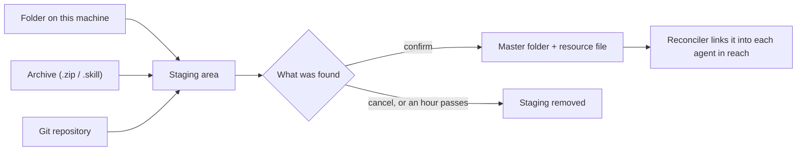

# Skills

A skill is a folder an agent loads when a task calls for it: a `SKILL.md` with instructions, plus whatever scripts and references it needs. Coffer keeps one master copy of each skill and hands it to every agent that should have it. This page explains how that works and why it is built this way. For how to use it, see the [Skills guide](/guides/skills).

## Principles

- **One copy, many readers.** Each skill lives once, in `~/.coffer/vault/skills/<name>/`. Agents receive a link to that folder, never a copy of their own, so an edit reaches every agent at once and nothing can drift apart silently.
- **Nothing is trusted before it is looked at.** A folder, an archive or a repository is read into a staging area first. Coffer says what it found and writes nothing until you confirm.
- **A source is a pin, not a subscription.** A skill taken from a Git repository stays exactly as it was at the commit it came from. A newer commit is an offer you review, never an automatic change.
- **The skill decides who gets it.** Whether an agent holds a skill depends on the skill's own switch and its reach, and on nothing stored on the agent.

## The master folder and delivery

Every managed skill is a `skill` resource, filed as `~/.coffer/vault/resources/skill/<name>.json`, and one folder under `~/.coffer/vault/skills/`. Both are in the vault repository, so every change to either is a commit with a history. The folder's name is the skill's name, taken from its `SKILL.md`, and it is fixed once the skill is registered: it is the directory an agent loads the skill from and the name an agent invokes it by.

Delivery is one rule: a skill reaches an agent if and only if the skill is enabled and the agent is inside its reach. The [reconciler](/architecture/reconciler) keeps every agent's skills directory equal to that rule. For each skill an agent should hold, it places a link at `<config_dir>/skills/<name>` pointing at the master folder — a symlink, a junction on Windows, or — only on Windows, on a filesystem that supports neither — a copy, which the repair pass replaces from master when it no longer matches — and it removes links the rule no longer grants. It never overwrites a folder someone else put where a link belongs; that is reported instead.

Because the delivered path is a link, a person editing a skill from inside an agent's folder is editing the master. Nothing needs to be re-delivered after an edit.

## History

The master folders are inside the vault repository, so a skill has a history: an edit made in an editor or by an agent's own file tools is committed as `disk` once the file has been quiet, and Coffer's own writes (an import, an update, a replace) are commits written by `user`. The web UI writes no file inside a skill's folder: the **Files** tab is read-only, with **Open in editor** and **Reveal in Finder**, so no save can race an edit made on disk. The skill's **⋯** menu has **History…**, which shows the folder's path in the vault, copies `git log -p` for it and hands the restore to an agent with a prompt the daemon builds; the agent writes the earlier content back as one new commit. Coffer lists no versions and restores none itself. See [Editing the vault by hand](/guides/vault-files).

Coffer's own `coffer-guide` is the exception: it is rendered from the running build, so it lives under `~/.coffer/derived/skills/coffer-guide/`, outside the vault, and has no history.

## Where a skill comes from

A skill enters the library from one of three sources. Each goes through the same steps: stage, look, confirm.

**Staging.** A stage is a directory in the system's temporary space, never inside `~/.coffer`, so vault sync cannot see it and a crash leaves nothing in the vault. The daemon remembers each stage for an hour; confirming or cancelling removes it at once. A stage that is never confirmed is swept on the next call.

**Finding the skill.** One rule for every source: a folder whose top holds `SKILL.md` is a skill. If the top of what you handed over is not one, each folder one level down that is becomes a candidate, and you choose which to add. Two levels down is not searched — a skill buried that deep is usually a repository's example or test fixture. Each candidate is checked like any imported folder (a valid `name` and `description`, no symlink that leaves the folder, at most 50 MB), and one that fails is shown with its reason rather than failing the rest.

**A name that is taken** is refused unless you choose Replace. Replacing swaps the master folder's content in place, so the skill keeps its reach and its delivered links.

### Archives

An archive is refused as a whole, with the offending entries named, before a byte of it is unpacked, when an entry could write outside the staging area (an absolute path, a `..` segment), when an entry is a symlink (its target was chosen by whoever made the archive), or when the sizes it declares already pass 50 MB. Declared sizes are only a promise, so unpacking also counts the bytes it actually writes and stops the moment the total passes the cap. The upload itself is capped the same way.

### Git repositories

Coffer runs this machine's own `git` to clone the repository into the staging area, resolves the ref you gave — a branch, then a tag, then a commit, or the default branch when you gave none — to one commit, and checks out only the folder you named. A GitHub folder address (`…/tree/<ref>/<path>`) is read as all three at once.

Git runs without a prompt and without a credential from Coffer. It can reach any public repository, and a private one when this machine's git already holds a credential for it — a credential helper, or SSH keys — because Coffer leaves the user's own git configuration in place. Coffer stores no Git secret of its own. Only the `https`, `http`, `ssh`, `git` and `file` transports are allowed, submodules are not fetched, hooks do not run, and a clone that takes too long is stopped. Any message git prints has secrets in a URL removed before it is shown. A URL typed with a user name or password is refused outright, because the source URL is stored in the vault, in the skill's own metadata and in API answers.

The repository address is not passed through the [SSRF guard](/architecture/security#outbound-requests): it is an endpoint you name yourself, fetched by a `git` subprocess the same way the vault sync remote is, and a company's own Git host usually sits on a private address the guard would refuse.

## Pinned to a commit

A skill added from a repository records where it came from: the URL, the ref you asked for, the folder inside the repository, the full commit it was copied from, and a **content hash** of that folder at that commit. The hash covers every file's path and bytes, and leaves out Coffer's own bookkeeping file. Comparing the master folder's hash with the pinned one is how Coffer knows you edited the skill since the pin, without keeping a checkout of the old commit around.

The pin travels with the skill to your other machines through vault sync; the skill's files travel with it, so every machine holds the same pinned content.

## Checking for updates

Coffer checks each Git-imported skill for newer commits when you ask, and on its own on this machine's schedule (every six hours by default; **Settings › General › Check skills for updates** also offers every day, every week or only on request, kept in `~/.coffer/daemon-config.json` and not synced). A check clones into staging again, resolves the ref, and counts the commits since the pin that change the skill's folder. A ref that moved without touching the folder is up to date. The result — when it ran, whether git reached the repository and git's message if not, what the ref points at, how many commits and files that is — is kept in `~/.coffer/local/skill-source-status.json`, on this machine only. It is an observation, not part of the vault, so sync never carries it. The background check skips a skill checked within the chosen interval, so a daemon that restarts often does not fetch every repository on every start.

An unreachable repository changes nothing: the skill keeps working from its pinned copy, and its page shows git's message and when the last check succeeded.

## Handing an update to an agent

Coffer applies no update itself. When a check finds an update, the skill offers **Hand off to &lt;Agent&gt; to update**, and the web UI asks the daemon for the prompt at the moment the button is pressed (`POST /api/v1/skills/{uid}/source/handoff`), so it is never stale. The daemon stages upstream as a check does, to list the commits between the pin and the new commit and the files edited in the master folder since the pin, builds the prompt from the one hand-off module every hand-off uses, and removes the stage. The prompt names the master folder as the only place to edit, the two commits with their subjects, the repository (without a credential), ref and folder to read upstream from, the local edits, or that there are none, and asks the agent to bring the new content in keeping those edits, to ask where the two disagree, and to show the diff. The route is refused with `SKILL_UPDATE_NOT_PENDING` when nothing newer changes the folder, and writes nothing to the master store or the pin. There is no update preview, no compare, no skipped-commit state and no apply: an update is no longer a conflict Coffer has to name.

Recording is the person's: **I merged it** (`POST /skills/{uid}/source/merged`, with the upstream commit) moves the pin to that commit without touching the master folder's files, and audits `skill_update_merged` with both commits. The pin's content hash becomes that commit's own content, so a folder that kept local edits still counts as locally edited against its new base, and the next hand-off lists exactly the edits carried over. Only an update that is waiting can be recorded; anything else is `SKILL_UPDATE_NOT_PENDING`.

## Resolving what repair will not touch

Automatic repair only puts back a missing or repointed link; it never overwrites a folder Coffer did not make and never picks between two versions. Those cases wait for a person, and each has a confirmed answer:

- **A folder in the way.** The drift report lists a real folder at an agent's link path, whether the delivery was made before or is only wanted now. Comparing it diffs the folder against the master; keeping master moves the folder under `~/.coffer/content/backup/skills/<agent>/` and links master again, and keeping the agent's version swaps its files into the master first. Only that one agent's copy changes.
- **A delete over a foreign copy.** Deleting a skill is refused, with nothing changed, while any agent's path holds a folder Coffer did not make — deleting would either leave it behind or remove someone else's files.
- **A folder no skill claims.** A folder in the skills store with no record can be registered in place or moved to `~/.coffer/content/backup/skills/orphans/`; it is never hard-deleted.
- **A missing master.** Every read of a skill says whether its master folder is on disk, so a skill that is off still shows that its folder is gone. The page offers a hand-off whose prompt points the agent at the backup folders, the agents' skill folders, the skill's source and the vault's git history, and **Delete skill…**; Coffer restores nothing itself.

A Git skill's source can also be changed: the new repository, ref and folder are staged like an add from Git and must hold one valid skill with the same name; the answer lists the names of the files that would be added, removed or changed against the current folder (no diff). Confirming swaps the folder in atomically, keeps reach and links, records the new source pinned to the new commit and audits an update; cancelling the stage changes nothing.

## What a skill says it needs

A `SKILL.md` may list the commands it relies on under `requires` — `jq`, `gh>=2.40`, or a mapping with a command and a version. Coffer reads that list from the master folder each time it shows the skill, so an edit is visible at once, and it links each command to its page on the CLIs page. Declaring a requirement changes nothing about delivery: a skill whose command is missing is still delivered, and the agent that follows it will fail at the step that needs the command.

## Related

- [Skills guide](/guides/skills) — adding, updating and delivering skills.
- [Reconciler](/architecture/reconciler) — the loop that keeps delivered links true.
- [Resource framework](/architecture/resource-framework) — identity, reach and audit every kind shares.
- [Security model](/architecture/security) — outbound requests and what the guard covers.
- Spec: [skill-manager](https://github.com/wyx-sg/Coffer/blob/main/openspec/specs/skill-manager/spec.md)
