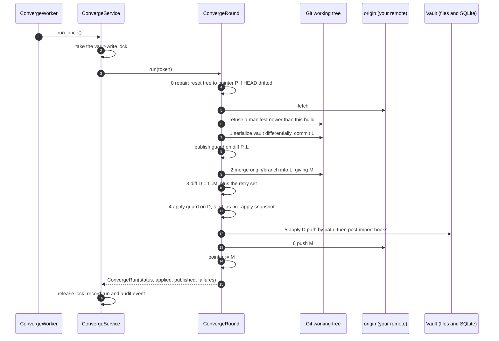
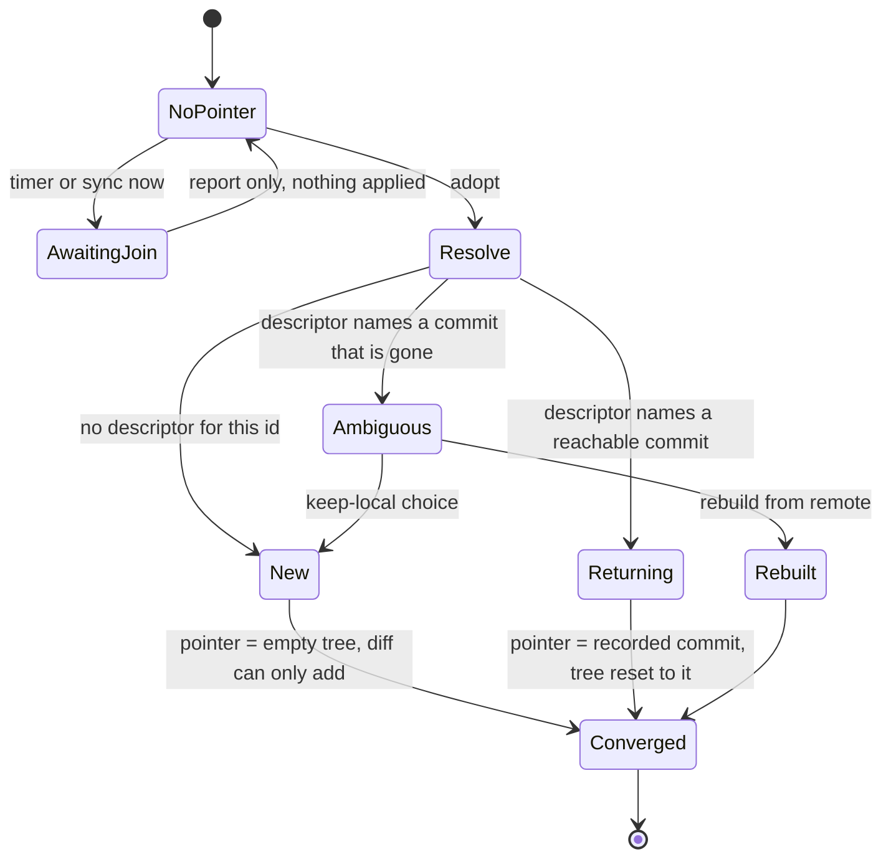
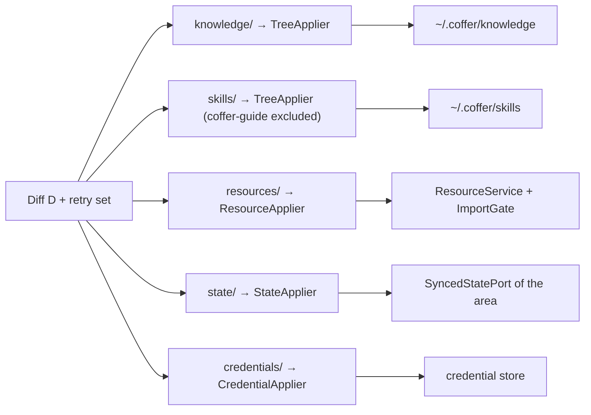

# Vault sync

Vault sync keeps one vault across several machines by converging each of them with a git repository you own. This page is for engineers who want the mechanism: what a converge round does step by step, why every diff is taken against a local pointer, how a new machine is told from a returning one, how each kind of document is applied, and which guards stop an unattended writer from doing damage. For setup and day-to-day use, see the [Vault sync guide](/guides/vault-sync).

## The problem

You work the same projects from a laptop and a desktop, and both produce vault state: knowledge documents, skills, MCP server registrations, agent configuration, provider profiles, credentials. Without convergence each machine is an island. Exporting from one and importing on the other is a chore nobody does often enough, and it is a wholesale overwrite with no base, so it cannot tell "this machine never had that document" from "this machine deleted it".

Convergence has to meet four constraints that pull against each other:

- **Local-first.** Each machine's vault stays complete and authoritative. The remote is a rendezvous, never a system of record: you can delete it and rebuild it from any single machine.
- **Deletions must propagate**, or the machines never agree, and **absence must never be mistaken for deletion**, or one stale machine erases what the others hold.
- **Secrets travel only as ciphertext**, and the master key never enters the repository.
- **Nothing is on by default.** Sync is an experimental feature (`vault_sync`) and does nothing until you configure a remote.

## The design in decisions

| Decision | Reason |
| --- | --- |
| Git is the transport and git's three-way merge is the arbiter | Git brings history, diff and merge for free, and your remote is an ordinary repository you can clone and inspect. Coffer writes no timestamp arbitration: "newest commit wins" is a fact about when a machine ran, not about what you meant. |
| The vault is serialized into a separate working tree, `~/.coffer/sync` by default | `~/.coffer` mixes vault truth with machine-local state (`coffer.db`, logs, `daemon-config.json`). A dedicated tree keeps git's diffs meaningful and leaves SQLite the local system of record. |
| Local state is committed before the merge | Committing first gives git all three inputs (base, local, remote), so the diff from the local commit to the merge result is exactly what the remote contributed. |
| Every diff is taken against a **pointer**: the last commit this vault provably absorbed | A deletion can only appear in the diff because some machine removed that document relative to a shared base. A machine that merely lacks a document has changed nothing relative to its own base. |
| The exporter writes differentially and never deletes a held path | A clear-and-rewrite export, or publishing a document this vault failed to apply, would turn "not absorbed" into "deleted". |
| A machine with no pointer is joining, and the remote's registry decides whether it is new or returning | A new machine can safely take the union. A returning machine taking the union would republish everything the others deleted while it was away. |
| A deletion guard holds oversized losses in both directions | The apply runs unattended. The guard bounds the damage of a defect here, on the machine that pushed, or on a machine whose disk was wiped. |
| Reach and derived output never travel | `enabled` and `scope` are answers each machine gives for itself; derived rows and the rendered `coffer-guide` skill differ per machine by construction. |

## The working tree

The working tree is a plain git repository. Its layout is versioned by `manifest.json` (`schema_version`, currently `2`):

```text
~/.coffer/sync/
├── manifest.json                    {"schema_version": 2}
├── knowledge/<collection>/…         mirrored from ~/.coffer/knowledge/, .inbox/ included
├── skills/<skill>/…                 mirrored from ~/.coffer/skills/, except skills/coffer-guide/
├── resources/<kind>/<uid>.yaml      one document per resource, keyed by its immutable uid
├── state/<area>/<doc>.yaml          module-owned shared state
├── credentials/<ref>.enc            Fernet ciphertext, only if the remote carries credentials
└── machines/<machine_id>.yaml       one descriptor per machine
```

A resource document carries identity, description and config, and nothing else. Keys are sorted and machine-local fields (`id`, `created_at`, `updated_at`) are excluded, so an unchanged vault serializes to byte-identical files on every machine and a round with nothing to say makes no commit:

```yaml
config:
  transport:
    args: []
    command: ${HOME}/.local/bin/jira-mcp
    credential_refs:
      JIRA_TOKEN: jira-token
    type: stdio
description: Company Jira
kind: mcp_server
name: jira
uid: 5f0c1e9a2b7d4c3e8a6f9b0d1c2e3f4a
```

Paths under your home directory are written against the `${HOME}` sentinel and expanded on the receiving machine (`domain/sync/portability.py`). Paths outside home travel verbatim and may simply not resolve elsewhere, which surfaces as a per-path failure rather than a silent mismatch.

Four state areas converge, each owned by the module that owns the state:

| Area | Directory | Provider |
| --- | --- | --- |
| MCP capability preferences | `state/mcp-preferences/` | `application/mcp/sync_state.py` |
| Internal-engine settings, including the curation switch and owner | `state/settings/internal-engine.yaml` | `application/engine_settings_sync.py` |
| Agent plugin inventory (recorded, never replicated into an agent) | `state/agent-plugins/` | `application/agent/plugin_sync_state.py` |
| Channel peer pairings (platform identity only) | `state/channel-peers/<channel_uid>/<chat>.yaml` | `application/channel/sync_state.py` |

An area publishes a document only while there is a decision to carry, never for its defaults. Otherwise a machine that reset a choice and a machine that never made one would add and delete the same document at each other on every round.

## The converge round

A round is seven steps, in this order. The order is the design.



**Step 0, repair.** If the working tree's HEAD is not the pointer (a crashed round left it elsewhere), the tree is reset to the pointer first. Serializing onto a drifted tree would turn "never absorbed" into "deleted" the moment the diff is taken. If the pointer names a commit the repository no longer has (the working tree was deleted or moved), the pointer is cleared and the round becomes a join.

**Fetch and layout check.** The fetch happens before anything compares against the remote. The remote's `manifest.json` is then read: a `schema_version` newer than this build's refuses the round with `SYNC_BUNDLE_TOO_NEW` before anything is serialized, merged, applied or pushed. Refusing matters on both sides, because an older build would not only half-apply a newer tree, it would publish into it, and every area it does not understand would leave as deletions nobody made. A manifest that is missing or unreadable is not a refusal, since no newer Coffer produces one.

**Step 1, serialize.** `SyncExporter` writes the vault into the tree and `MachineRegistry.publish_self` writes this machine's descriptor in the same step, so a descriptor always sits in the same commit as the state it describes. If `git add -A` stages nothing, no commit is made and `L` is the pointer. The **publish-side guard** runs here, right after the local commit and before any merge, over `P..L`: what this round would publish as deletions. Each direction is guarded at the first step that knows its diff, so a breach in either holds the round before the vault or the remote is touched.

**Step 2, merge.** `git merge --allow-unrelated-histories origin/<branch>` into `L` produces `M`. A remote with no branch yet (the first machine on a fresh repository) has nothing to merge, so `M = L`. Conflicts go to the arbiter described below; any conflict left unresolved aborts the merge, returns status `conflict`, leaves the vault untouched and does not move the pointer.

**Step 3, diff.** `D = git diff L..M` is exactly what the remote contributed. The retry set is appended: each held path is re-read from the working tree, and a path the tree has since dropped is carried as a deletion.

**Step 4, guard and snapshot.** The **apply-side guard** runs over `D` plus the retry set. If it passes, `L` is tagged `coffer/pre-apply/<UTC timestamp>`; the ten newest tags are kept.

**Step 5, apply.** Each path is applied independently by the applier that owns its prefix. A failure is reported, the path is held, and the round carries on. Then every kind's post-import hook runs once, from current state, to re-project the machine-local side of what changed (native agent config, shims, skill deliveries).

**Step 6, publish.** `M` is pushed and the pointer advances to `M`. If the push fails the local commit stays, the status is `push_failed`, and the next round carries the outstanding work. The pointer still advances because the vault did absorb `M`.

### Round outcomes

A round returns a `ConvergeRun` for every outcome, so the worker never has to decide what is survivable:

| Status | Meaning |
| --- | --- |
| `ok` | Something was published or applied. |
| `no_change` | Nothing to do on either side. A success, not a skip. |
| `conflict` | Git could not merge and nothing resolved it. Vault untouched, pointer unmoved. |
| `awaiting_confirmation` | The deletion guard held the round. |
| `awaiting_join` | This machine has no pointer; only `adopt` joins. |
| `push_failed` | Applied locally; the push did not land. |
| `failed` | The round could not complete, including the two refusals `SYNC_JOIN_AMBIGUOUS` and `SYNC_BUNDLE_TOO_NEW`. |
| `disabled` | No remote, or the remote is paused. |

### The pointer, the retry set and the not-applicable set

Three facts are machine-local and never travel. They live in SQLite (`sync_convergence_state` and `sync_held_paths`, through `infrastructure/persistence/convergence_state_repo.py`), because `coffer.db` is already outside the tree and cannot be published by accident:

- **The pointer** is the base of every diff. A pointer that travelled would be another machine's claim about what this vault absorbed.
- **The retry set** holds paths the tree has that this vault failed to apply. The exporter must not delete them, or a local failure becomes a published deletion. They are retried every round and leave the set on success.
- **The not-applicable set** holds paths that can never apply here, such as an `agent` document whose `config_dir` does not exist on this machine (error codes `AGENT_CONFIG_DIR_MISSING`, `KIND_NOT_APPLICABLE`). They are preserved like retry paths but neither retried nor reported as failures. Each round re-runs only the cheap precondition (the kind's import gate) and moves a path back to the retry set once it passes.

The same database also stores a held round's `PendingConfirmation` whole, so your "yes" means what you were shown.

## Joining: new and returning machines

A machine with no pointer is joining, and the two kinds of joiner need opposite treatment. `JoinResolver` reads `machines/<machine_id>.yaml` at `origin/<branch>` to decide:



- **New machine.** The pointer is git's empty tree, so `D` is a diff from nothing and can only contain additions. The machine takes everything the remote holds, keeps everything it had, and publishes the union. Deletion is structurally impossible rather than merely avoided.
- **Returning machine.** It converged before and lost its pointer to a reinstall or a wiped `~/.coffer`. Its descriptor names the commit it last absorbed; that becomes the pointer and the tree is reset to it, so the merge has a real common ancestor. The round is an ordinary stale-machine round: the remote's deletions apply, this machine's edits survive, nothing resurrects.
- **Ambiguous.** The descriptor exists but its commit is gone from history (the remote was rewritten). There is no safe default, so the round raises `SYNC_JOIN_AMBIGUOUS` until you choose: `coffer sync adopt --keep-local` joins as new and may resurrect deletions, or `coffer sync rebuild` makes this machine a copy of the remote.

Treating a returning machine as new looks conservative and is a data-loss bug: a union has no base to disagree with, so every deletion the fleet made while the machine was away comes back with no conflict raised. The mirror image is a returning machine whose vault was wiped: its recovered base is valid and its vault is empty, which the diff reads as "delete everything". The publish-side guard holds that round, and `rebuild` is offered as the honest answer.

Detection runs on every round without a pointer, not only in `adopt`, so reconfiguring a remote cannot route around it. Joining itself is explicit: the timer and `coffer sync now` report `awaiting_join` and apply nothing, and `adopt` states the case and the counts before it asks.

### Machine identity

`machine_id` must survive reinstalling Coffer, because only a surviving id can tell a returning machine from a new one. It is derived from the host (`infrastructure/sync/machine_id.py`): `IOPlatformUUID` on macOS, `/etc/machine-id` or `/var/lib/dbus/machine-id` on Linux. Only where neither exists is a UUID generated once into `~/.coffer/machine-id` (mode `0600`), and the registry reports that such an identity does not survive deleting `~/.coffer`.

The raw identifier never leaves the machine. What travels is `sha256("coffer-machine:" + raw)` truncated to 16 hex characters (`domain/sync/machine.py`). The machine **name** is a separate, freely changeable label stored inside the descriptor; nothing references it.

### The registry is a view, not a table

Each machine writes exactly one file, `machines/<machine_id>.yaml`, and never another machine's, so descriptors cannot conflict and git merges them trivially. The registry is whatever `machines/*.yaml` holds. A descriptor carries `name`, `os`, `hostname`, `coffer_version`, `last_converged_on`, `last_converged_commit`, `key_fingerprint` (a 12-character SHA-256 prefix of the master key, so another machine can say its credentials will not decrypt here) and the registered `agents`.

`last_converged_on` is a day, restamped at most once per calendar day, so an idle machine does not commit a heartbeat every interval. The one exception: a descriptor that has no commit yet is filled in as soon as there is one, so a machine reinstalled on the day it first converged can still be recognised as returning. Retiring a gone machine's descriptor (`coffer sync machine remove`) is the one deliberate write to another machine's path.

## Applying a diff

`ConvergeRound` routes each path to the applier whose prefix owns it. Every applier has exactly two operations, `upsert` and `remove`, because removal is the operation that had to be authorised and belongs visibly at the seam. `machines/` and `manifest.json` have no applier and are never applied.



- **Knowledge and skill files** (`TreeApplier`) are copied in or unlinked; an emptied collection directory is removed too. Symlinks in the working tree are refused. There is no index to rebuild, because [knowledge is plain files](/architecture/knowledge).
- **Resource documents** (`ResourceApplier`) go through the resource service, keyed by uid. A new uid is registered at that same uid, so both machines hold the same resource. An existing uid with a different name is applied as a rename through `ResourceService.rename`, which runs the kind's `on_rename` hook. Config and description are updated; the local `enabled` and `scope` are never touched, and a newly arrived resource takes this machine's default reach. Before any write the kind's `ImportGate` validates the config, and a kind may register an `ImportNormaliser` (the provider kind uses one to keep a single internal-engine default). A removal runs the real `ResourceService.delete`, whose cascade releases credentials no remaining resource cites. A document whose uid disagrees with its path is refused rather than guessed at.
- **State documents** (`StateApplier`) are handed to the `SyncedStatePort` that claims the area, with `${HOME}` expanded. Each area defines what deleting its document means: an un-pairing, capabilities re-enabled, engine settings back to defaults, or nothing at all for the plugin inventory. An area this build does not know is skipped rather than failed.
- **Credential blobs** (`CredentialApplier`) are written as ciphertext only, and only if the incoming blob was encrypted later than the one already held. A stale blob pushed cleanly by another machine is ignored rather than allowed to orphan a working secret.

After the apply, the round lists credential refs this machine holds ciphertext for but cannot decrypt and reports them as `locked_refs`, rather than letting them fail at first use. Keys move between machines out of band with `coffer sync key export` and `coffer sync key import`.

### Kinds reach sync through ports

The sync package imports no kind. Kinds contribute at the composition root through a `SyncContributions` collector (`surfaces/http/sync_contributions.py`):

| Port | Contributed by |
| --- | --- |
| `SyncedStatePort` | MCP preferences, engine settings, agent plugin inventory, channel peers |
| `ImportGate` | `agent` (its `config_dir` must exist here) |
| `ImportNormaliser` | `provider` |
| `PostImportHook` | `agent` (native config and skill delivery), `provider` (projection into this machine's agents) |

## What travels and what does not

| Travels | Stays on the machine |
| --- | --- |
| Knowledge documents and `.inbox/` material | Reach: every resource's `enabled` and `scope` |
| Skill folders | `skills/coffer-guide/` and its resource row (derived output) |
| Resource documents of every converging kind, `channel` included | `memory` partitions (`Kind.converges = False`) and `~/.coffer/memory/` |
| The four state areas | Conversations, the active conversation pointer, the audit log, MCP invocation records |
| Credential ciphertext, if the remote opts in | The master key, `coffer.db`, `daemon-config.json`, logs, PID files |
| One descriptor per machine | The pointer, retry set, not-applicable set and any held round |

**Reach** is a decision about this machine. Publishing it would let one machine silently re-answer a question another already answered: the laptop that left a server dark would find it live after the desktop's next round. See [Resource framework](/architecture/resource-framework).

**Derived output** is withheld in both halves. `Kind.converges_row` lets the `skill` kind decline the row for `coffer-guide`, which every machine renders from its own build and its own enabled collections. The exporter protects that row's path instead of publishing its absence, and both appliers ignore arriving documents for it in either direction. Otherwise a machine on an older build that still publishes the folder would overwrite the one this machine rendered, or delete it only for the next boot to bring it back.

**Channels** travel with a `runs_on` field naming the one `machine_id` whose daemon starts the adapter. The document, its credential references and its pairings converge, so taking over a bot on another machine is a rebind rather than a re-registration. Arrival starts nothing on a machine the channel does not name. See [Channels](/guides/channels).

## Conflicts

Most concurrent edits are not conflicts: git merges different hunks of one file on its own. What git cannot settle goes to `ConflictArbiter` (`application/sync/conflicts.py`), narrowest rule first:

1. **Credential blobs never reach a text merge.** A Fernet token carries its encryption time in cleartext, so two blobs for one ref are ordered without the key and the fresher one wins. Unreadable headers are refused rather than guessed.
2. **Delete versus edit in `knowledge/` and `skills/` resolves toward the edit.** A deletion there is usually a curation pass's housekeeping, which the next pass will redo; losing an edit is unrecoverable. This rule does not apply to `resources/`.
3. **An agent may attempt the rest** if an internal model is configured. `AgenticConflictResolver` works in the working tree only and never sees the vault. It is bounded (at most 20 files, 96 KiB per file, 90 s per call, 300 s per pass) and untrusted: each file it claims must exist, carry no conflict marker and, under `resources/` or `state/`, parse as a YAML mapping. Agent-resolved paths are reported on the round so you can review them.
4. **Otherwise the round stops** with status `conflict`. The merge is aborted, the vault is untouched and the pointer stays; you resolve in the working tree with your own git tools. Two machines waiting is better than two machines quietly disagreeing.

## The deletion guard

`DeletionGuard` (`domain/sync/diff.py`) holds a round when, in any area (`knowledge`, `skills`, `resources`, `state`, `credentials`), the losses are **20 or more** documents, **more than 20%** of the area's documents, or any at all from an area the base holds none of. The thresholds are fixed constants, not settings, and nothing can skip the guard. Area totals are read from the commit the diff starts from, so they cannot move mid-round.

It runs **in both directions**: over what the round would publish (`P..L`) and over what it would apply (`D` plus the retry set). The publish side is what stops a machine that lost its files to a reinstall, a failed restore or a stray `rm -rf` from publishing that loss and taking every other machine down with it.

### Counting losses, not deletions

A layout migration moves documents, and a guard that counted deletions would hold every one. So the guard counts only deletions with no destination in the **same area of the same diff**. There are two ways to show a destination:

- **The same content id reappears.** `git diff --raw` hands over a blob id for each side, so identical bytes are a fact to read, not a resemblance to guess. The empty blob never counts as evidence.
- **Git's own rename detection pairs the two sides.** This is asked as a separate `git diff -M --diff-filter=R` call, at git's default similarity, so the diff the vault applies stays rename-blind and still lands one path at a time. Pairings that cross areas are discarded.

The trade-off is explicit. A similarity pairing can only excuse a deletion when a similar addition exists in the same diff, and the losses the guard exists for (a wiped disk, a failed restore) come with no additions, so they are held exactly as before. A relocation that rewrites most documents past git's threshold is still held, which is the conservative half of the trade. A hold lists only the lost paths, not the moves.

### Holds are questions about one diff

A held round records its direction, the local commit, the remote tip at the time, the breached areas and the lost paths. Every later round re-derives the diff rather than short-circuiting on the hold:

- If the direction that tripped no longer breaches (a defect was fixed, a file came back), the hold is released and the round proceeds.
- If the same question stands, it is stored as the same hold, keeping the original time; the run history row is refreshed rather than duplicated and the log says it once.

`coffer sync confirm` re-runs the round with the guard waived **only for the direction you answered, and only while the remote tip is unchanged**. If the remote moved, the guard runs again and the round is held afresh, because a "yes" that outlived the diff it was given for is how accidents happen. `coffer sync reject` resets the working tree to the pointer; the vault was never touched, since the guard runs before the apply.

## Recovery

The history on the remote is the backup, and recovery reuses the round's own machinery:

| Command | What it does | Pointer |
| --- | --- | --- |
| `coffer sync rollback` | Applies the diff from the current state back to the newest `coffer/pre-apply/*` snapshot. | Unchanged, so the next round publishes the undo as a local change. |
| `coffer sync restore --at <sha, ref or YYYY-MM-DD>` | Brings back documents from an earlier revision, dropping that diff's deletions so later work survives. | Unchanged, so the recovered documents publish as additions. |
| `coffer sync rebuild` | Makes this vault the remote's tip, discarding what only this machine holds. Offered where the publish guard holds a wiped vault. | Set to the tip. |

Each refuses a remote layout newer than the build first.

## Sharing the lock with curation

The knowledge [curation pass](/architecture/knowledge) also rewrites vault content with no human approving the diff. Two rules keep it and sync apart:

- **One lock.** `ConvergeService` owns an `asyncio.Lock` that every round, confirm, reject, rollback, restore and rebuild takes. The composition root hands the same lock to the curation pass (`set_vault_write_lock`), so an export never captures a half-finished rewrite.
- **One owner machine.** Two machines folding the same inbox item into different documents would merge cleanly and hold the knowledge twice, and git would see nothing wrong. So the curation owner is a `machine_id` carried in the synced `internal-engine` settings document, and the pass is a no-op on every other machine. It is also skipped while a round holds a confirmation or last stopped on a conflict (`divergence_outstanding`), so a rewrite never moves documents underneath a question you are about to answer. With `vault_sync` switched off the vault is treated as single-machine and only curation's own switch is read.

An owner that names a machine the registry does not hold is reported as a fault, not folded into "runs elsewhere", because the pass then runs nowhere.

## Talking to git safely

`GitMirror` (`infrastructure/sync/git_mirror.py`) shells out to the real `git` binary so the remote stays an ordinary repository. `git_invoke.py` makes each invocation safe:

- The push credential is resolved from the credential store for one call and reaches git through a credential helper given with `-c` that reads `$COFFER_GIT_TOKEN` from the environment. It is never in the remote URL, argv, `.git/config` or any recorded error; failure text is redacted in the adapter and again in the service. A helper is used rather than `GIT_ASKPASS` because macOS's own git ignores the latter.
- `GIT_CONFIG_GLOBAL` and `GIT_CONFIG_SYSTEM` point at `/dev/null`, and the commit identity is supplied as `Coffer <coffer@localhost>`, so your own git configuration cannot change what a round does. `core.quotepath=false` keeps non-ASCII paths parseable.
- The remote URL may not start with `-`, the branch must pass `git check-ref-format --branch` rules, and positional arguments sit behind `--`, so no configured value can be read as an option.
- The working tree may not overlap the knowledge or skills roots, contain `~/.coffer`, or sit elsewhere inside `~/.coffer` than the default. A repository Coffer creates or adopts is marked `coffer.managed` in its local config.

## The worker

`ConvergeWorker` (`application/sync/worker.py`) runs one round 30 seconds after the daemon starts and then on the remote's interval, which defaults to one hour (`coffer sync remote set --interval`) and is never shorter than 60 seconds: every surface refuses a smaller value, and a remote stored with one before the floor existed loads as 60. With no remote configured, or with the remote paused, a round is a `disabled` no-op and the worker re-checks every 15 minutes. It checks the `vault_sync` feature at the top of every tick and skips the round while the feature is off. Quiet outcomes (`ok`, `no_change`, `awaiting_join`, a hold already reported) log at debug level; anything new that needs you logs a warning. Every recorded round also writes a `sync_run` audit event.

## Trade-offs and alternatives

- **Leave the file trees to your own git and sync only structured state.** If Coffer runs the pull it is convergence anyway; if you run it, the drift stays. It also splits `skill`, whose files and registry row are one thing.
- **Tombstones, timestamp arbitration and quarantine.** These are what a database projected into files needs. With knowledge and skills as plain files and the rest a few dozen deterministic documents, git's commit graph already records deletions, `git merge` already arbitrates, and a set of held paths replaces quarantine.
- **Commit `~/.coffer` in place.** It mixes machine-local state with vault truth, and `coffer.db` is binary and unmergeable.
- **A hosted sync service, peer-to-peer sync or an object store.** A hosted service would be a vendor system of record. Peer-to-peer and object stores have no history or three-way merge. Git suits an audience that already holds git credentials.
- **Manual convergence by default.** A vault that converges only when someone remembers is the island problem with an extra step. The interval is the knob, pausing the remote is the off switch, and `coffer sync now` avoids waiting.
- **Local export and import.** A bundle written to a directory and read back is a wholesale overwrite with no base. A new machine runs `coffer sync adopt`, an offline medium is a `file://` remote, and handing someone a copy is `git clone ~/.coffer/sync`.

The cost is real: Coffer writes your vault without a human in the loop. That is why the pointer, the snapshot and the guard are mandatory, and why an unresolved conflict blocks convergence on both machines until you settle it.

## Where it lives in the code

| Path | Responsibility |
| --- | --- |
| [`domain/sync/diff.py`](https://github.com/wyx-sg/Coffer/blob/main/backend/coffer/domain/sync/diff.py) | Changes, areas, `losses`, `DeletionGuard` and its constants |
| [`domain/sync/convergence.py`](https://github.com/wyx-sg/Coffer/blob/main/backend/coffer/domain/sync/convergence.py) | `ConvergeRun`, statuses, `JoinKind`, `PendingConfirmation` |
| [`domain/sync/manifest.py`](https://github.com/wyx-sg/Coffer/blob/main/backend/coffer/domain/sync/manifest.py) | Layout version and the too-new refusal |
| [`domain/sync/machine.py`](https://github.com/wyx-sg/Coffer/blob/main/backend/coffer/domain/sync/machine.py) | Machine id hashing and the descriptor |
| [`domain/sync/fernet_time.py`](https://github.com/wyx-sg/Coffer/blob/main/backend/coffer/domain/sync/fernet_time.py) | Ordering ciphertexts by encryption time |
| [`domain/sync/serialization.py`](https://github.com/wyx-sg/Coffer/blob/main/backend/coffer/domain/sync/serialization.py), [`portability.py`](https://github.com/wyx-sg/Coffer/blob/main/backend/coffer/domain/sync/portability.py) | Resource documents and `${HOME}` rewriting |
| [`application/sync/convergence.py`](https://github.com/wyx-sg/Coffer/blob/main/backend/coffer/application/sync/convergence.py), [`convergence_ops.py`](https://github.com/wyx-sg/Coffer/blob/main/backend/coffer/application/sync/convergence_ops.py) | The round and its steps |
| [`application/sync/service.py`](https://github.com/wyx-sg/Coffer/blob/main/backend/coffer/application/sync/service.py), [`worker.py`](https://github.com/wyx-sg/Coffer/blob/main/backend/coffer/application/sync/worker.py) | Lock, confirm/reject/rollback/restore/rebuild, audit, interval loop |
| [`application/sync/exporter.py`](https://github.com/wyx-sg/Coffer/blob/main/backend/coffer/application/sync/exporter.py) | Serialization into the tree |
| [`application/sync/appliers.py`](https://github.com/wyx-sg/Coffer/blob/main/backend/coffer/application/sync/appliers.py), [`appliers_resource.py`](https://github.com/wyx-sg/Coffer/blob/main/backend/coffer/application/sync/appliers_resource.py) | Per-area application |
| [`application/sync/joining.py`](https://github.com/wyx-sg/Coffer/blob/main/backend/coffer/application/sync/joining.py), [`machines.py`](https://github.com/wyx-sg/Coffer/blob/main/backend/coffer/application/sync/machines.py) | Join resolution and the machine registry |
| [`application/sync/conflicts.py`](https://github.com/wyx-sg/Coffer/blob/main/backend/coffer/application/sync/conflicts.py) | Conflict arbitration |
| [`application/sync/ports.py`](https://github.com/wyx-sg/Coffer/blob/main/backend/coffer/application/sync/ports.py) | `SyncedStatePort`, `ImportGate`, `VaultApplyPort`, `ConvergenceStatePort` and the rest |
| [`infrastructure/sync/`](https://github.com/wyx-sg/Coffer/tree/main/backend/coffer/infrastructure/sync) | Git mirror and invocation, differential tree mirror, bundle IO, machine id, agentic conflict resolver |
| [`infrastructure/persistence/convergence_state_repo.py`](https://github.com/wyx-sg/Coffer/blob/main/backend/coffer/infrastructure/persistence/convergence_state_repo.py) | Pointer, held paths, pending confirmation |
| [`surfaces/http/sync_wiring.py`](https://github.com/wyx-sg/Coffer/blob/main/backend/coffer/surfaces/http/sync_wiring.py), [`sync_routes.py`](https://github.com/wyx-sg/Coffer/blob/main/backend/coffer/surfaces/http/sync_routes.py) | Composition and the `/api/v1/sync` routes |

## Related

- Spec: [vault-sync](https://github.com/wyx-sg/Coffer/blob/main/openspec/specs/vault-sync/spec.md), and [channels](https://github.com/wyx-sg/Coffer/blob/main/openspec/specs/channels/spec.md) for `runs_on`
- Decision records: [Vault Sync](https://github.com/wyx-sg/Coffer/blob/main/docs/decisions/vault-sync.md), [Per-Agent Resource Scope](https://github.com/wyx-sg/Coffer/blob/main/docs/decisions/per-agent-resource-scope.md), [Resource Identity Is an Immutable uid](https://github.com/wyx-sg/Coffer/blob/main/docs/decisions/resource-identity-is-an-immutable-uid.md), [Envelope-Encrypted Credentials](https://github.com/wyx-sg/Coffer/blob/main/docs/decisions/envelope-encrypted-credential-store.md)
- [Vault sync guide](/guides/vault-sync) · [Knowledge architecture](/architecture/knowledge) · [Persistence](/architecture/persistence) · [Security model](/architecture/security) · [Experimental features](/guides/experimental-features)
