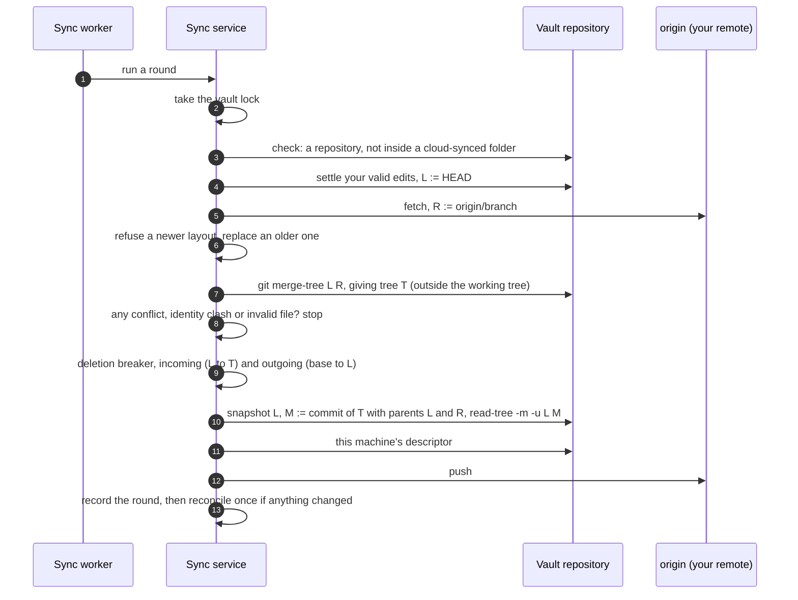

# Vault sync

Vault sync keeps one vault across several machines by pulling and pushing the vault's git repository to a remote you own. This page is for engineers who want the mechanism: what a round does step by step, why any conflict stops it, how a new machine is told from a returning one, which guards stop an unattended writer from doing damage, and how a round is undone. For setup and day-to-day use, see the [Vault sync guide](/guides/vault-sync).

## The problem

You work the same projects from a laptop and a desktop, and both change the vault: knowledge documents, skills, MCP server registrations, provider profiles, secrets. Without sync each machine is an island. Copying one onto the other is a wholesale overwrite with no base, so it cannot tell "this machine never had that document" from "this machine deleted it".

Sync has to meet four constraints that pull against each other:

- **Local-first.** Each machine's vault stays complete and authoritative. The remote is a rendezvous, never a system of record: you can delete it and rebuild it from any one machine.
- **Deletions must travel**, or the machines never agree, and **absence must never be mistaken for deletion**, or one stale machine erases what the others hold.
- **Secrets travel only as ciphertext, and only if you ask**, and the master key never enters the repository.
- **Nothing Coffer does on its own should need finding and undoing later.** An unattended writer may apply what git merges cleanly; everything else is your decision.

## The design in decisions

| Decision | Reason |
| --- | --- |
| The vault *is* the git repository; sync only adds a remote and runs fetch and push. | There is no second copy to serialize into and translate back. What you see in `~/.coffer/vault` is exactly what travels. See [Persistence](/architecture/persistence). |
| The merge is computed outside the working tree (`git merge-tree --write-tree`). | Nothing in the vault is touched until the round knows the merge is clean, valid and within the breaker. |
| **Any** conflict stops the whole round, with an answer per file. | Automatic resolvers change data without anyone deciding. A stopped round leaves the vault and the remote exactly as they were. |
| The checkout is a compare-and-swap over the whole tree. | An edit you have not saved into a commit is never overwritten; the round waits on it instead. |
| The deletion breaker holds oversized losses in both directions. | Rounds run unattended. The breaker bounds the damage of a defect, a wiped disk or a bad restore. |
| A safety snapshot before every checkout, and rollback as a new commit. | A clean merge you regret is one command away from undone, and later edits survive the undo. |
| Joining is explicit and previewed; a new machine takes the union. | A timer must never decide how an unknown vault meets a remote. A union deletes nothing. |
| Machine-local state lives outside the vault. | Reach, the remote, retention and agents are in `local/`, which is never committed, so they cannot travel by accident. |

## What travels

Everything committed in the vault repository, and nothing else:

| Travels (in `~/.coffer/vault`) | Stays on each machine |
| --- | --- |
| Resource files of `mcp_server`, `skill`, `channel`, `provider` and `knowledge` | Agents (`local/resources/agent/`): an agent's config directory is a fact about this machine |
| Knowledge documents and `.inbox/` material, skill master folders | Reach (`local/reach.json`), custom tools' reach, retention, the sync remote itself |
| MCP capability switches, channel pairings, Coffer's settings (`state/`: upkeep, the speech-to-text model) | The derived tree: memory, caches, `derived.db`, the rendered `coffer-guide` skill |
| Secret ciphertext (`secret/`), only with `include_secret` | Machine-local ciphertext (`local/secret/`), the secret boundary, the master key |
| One descriptor per machine (`machines/<id>.json`) | `runs.db` (conversations, audit, invocations, rounds), `content/`, logs, `daemon-config.json` |

**Reach** is a decision about this machine. Publishing it would let one machine silently re-answer a question another already answered. See [Resource framework](/architecture/resource-framework).

**Channels** travel with a `runs_on` field naming the one machine whose daemon starts the adapter. The document, its secret references and its pairings travel, so moving a bot to another machine is a rebind. Arrival starts nothing on a machine the channel does not name. See [Channels](/guides/channels).

**Secrets.** `secret/` is listed in the repository's `.git/info/exclude` until the remote's `include_secret` is on; then the ciphertext files are committed like any other. Ciphertext that has entered a pushed commit cannot be withdrawn: revocation is rotation.

## The round

A round is eight steps, in this order. The order is the design.

```mermaid
sequenceDiagram
    autonumber
    participant W as Sync worker
    participant S as Sync service
    participant V as Vault repository
    participant O as origin (your remote)
    W->>S: run a round
    S->>S: take the vault lock
    S->>V: check: a repository, not inside a cloud-synced folder
    S->>V: settle your valid edits, L := HEAD
    S->>O: fetch, R := origin/branch
    S->>S: refuse a newer layout, replace an older one
    S->>V: git merge-tree L R, giving tree T (outside the working tree)
    S->>S: any conflict, identity clash or invalid file? stop
    S->>S: deletion breaker, incoming (L to T) and outgoing (base to L)
    S->>V: snapshot L, M := commit of T with parents L and R, read-tree -m -u L M
    S->>V: this machine's descriptor
    S->>O: push
    S->>S: record the round, then reconcile once if anything changed
```

1. **Check.** The vault is a repository, and not inside a folder another tool synchronises (a Syncthing folder, Dropbox, iCloud Drive or a File Provider root). Two tools syncing one git repository corrupt it, so such a vault pauses with `paused_cloud_folder`.
2. **Local.** Your valid hand edits are committed first, so `L`, this machine's `HEAD`, holds everything accepted here. There is no separate export step: every accepted write is already a commit.
3. **Fetch.** `origin/<branch>` becomes `R`. A remote whose `manifest.json` names a newer layout is refused before anything is merged (`remote_too_new`: upgrade this machine). One at an older layout is replaced by this vault instead (see [Remote layout](#remote-layout)).
4. **Merge.** `git merge-tree --write-tree L R` computes the merged tree `T` in the object store. Nothing in the vault changes.
5. **Stop?** A content conflict, the same resource name with two different uids, or a merged file that fails validation stops the round, whole. Nothing is checked out and nothing is pushed.
6. **Guard.** The [deletion breaker](#the-deletion-breaker) runs over what the round would remove here and what this machine's own commits would remove from the shared history.
7. **Check out.** `L` is tagged `refs/tags/coffer/pre-apply/<timestamp>` (ten kept). `M` is committed with parents `L` and `R`, and `git read-tree -m -u L M` moves the vault to it under the vault's write lock. Git verifies every path it will change against `L` before it writes a file, so a path you are editing (an uncommitted or invalid edit) makes the round wait with `waiting_on_edit` and name the file.
8. **Publish.** This machine's descriptor is updated in its own commit. Before the push, every blob the push would publish (reachable from the commit being pushed and not from `R`, so every version in every unpushed commit) is read with Coffer's plaintext-secret detection (the bundled gitleaks rules plus Coffer's own, the same detector as the Secrets page; each place found names its rule); `secret/*.enc` is ciphertext and is skipped. A value a file still holds stops the round as `plaintext_found` with nothing pushed. A value only an earlier unpushed commit holds is folded out: the unpushed commits become one commit on `R` with the same tree, which is pushed instead, and the descriptor is written again on top of it so the pushed descriptor names a commit the remote holds. Then the result is pushed. A rejected push is `push_failed`: the vault already holds the merge, and the next round tries again.

After a round that changed the vault, the [reconciler](/architecture/reconciler) runs one pass, so each kind re-projects what arrived: agent config, shims, skill deliveries, provider projections. The round [holds the reconciler](/architecture/reconciler) from its first git call until that pass has run, so no pass judges the vault half applied. Sync itself imports no kind.

### Round outcomes

Every round is recorded in the round history in `runs.db` and audited, whatever its outcome:

| Status | Meaning |
| --- | --- |
| `nothing_to_do` | Nothing to pull and nothing to push. A success, not a skip. |
| `pulled`, `pushed`, `pulled_and_pushed` | What moved. |
| `push_failed` | Applied here; the remote refused the push. |
| `plaintext_found` | A file the push would publish holds a plaintext secret, as the bundled detection rules see it. Pulled and applied, nothing pushed. |
| `stopped` | A conflict. Nothing checked out, nothing pushed. |
| `held` | The deletion breaker held the round. |
| `waiting_on_edit` | An edit you have not finished is on a path the round would change. |
| `join_required`, `joined` | This machine has not joined the remote yet; it has now. |
| `unreachable`, `auth_failed` | The remote could not be reached, or refused to sign in. |
| `paused_cloud_folder` | The vault is inside a folder another tool synchronises. |
| `remote_too_new` | The remote is at a newer vault layout. |
| `rolled_back` | A round was rolled back. |
| `failed` | Anything else, with git's message. |

## Conflicts stop the round

Most concurrent edits are not conflicts: git merges different files, and different parts of one file, on its own, and a clean merge is applied unattended. What git cannot settle stops the round, and it stays stopped until you answer every file. The stopped round is kept in `local/sync/round.json`.

Each conflicting file gets one of three answers:

- **Keep this machine's** (`mine`).
- **Take the other's** (`theirs`), shown with what it changes here and the diff of it.
- **Edit.** Coffer writes a marked-up copy of git's merge under `derived/sync-conflicts/` and opens it in your editor. The vault's own file never receives a conflict marker. Marking it resolved is refused while a marker is left, and the refusal names the line.

A fourth way to reach the edit answer hands the merge to an agent, because merging two people's edits is judgement Coffer does not make (Principle IV). The person hands over every file an agent may merge, or one file (`POST /api/v1/sync/stop/handoff`), and Coffer records the hand-off with its time. The prompt states the goal and the constraints and carries no shell command: the vault to read, each file with when each machine changed it and the marked-up copy Coffer has already written for the merge, keep what each side added and ask where they contradict, and write only those copies, never the vault or its git history. An agent's merge is shown, never taken: a file reads `handed_off` until its copy holds a merge and no marker, then `merged_by_agent`, and stays unresolved until the person marks it resolved, which is the edit answer read from the copy and refused while a marker is left. Coffer shows neither the copy's text nor a diff of the merge: the person reads the copy in the editor (**Open in editor**) before answering. **Back to two choices** forgets the copy and the hand-off. The prompt is built by the sync domain. It never carries a secret: a `secret/*.enc` file in a stop offers only mine and theirs, gets no editor copy, refuses a hand-off or an edited answer (`SYNC_SECRET_NOT_EDITABLE`), and is only counted in the prompt.

A remote's refusal is handed over the same way. A rejected push, a refused sign-in and an unreachable remote put a prompt on the status's `problem`: the URL without credentials, the branch, the secret's name and git's message scrubbed of token shapes. A missing `git` is the problem `git_missing`, with the shared install hand-off.

Answers are recorded, not applied one by one. When every file has one, **Continue** takes the resolved tree through the same validation, breaker, snapshot, checkout and push. A stop is a question about one pair of commits: if either side moves before you answer, the round is derived again and asks again. Local writes keep being committed while a round is stopped; only sync waits.

Two cases never ask:

- **Secret ciphertext.** A Fernet token carries its encryption time in clear, so two ciphertexts for one ref are ordered without the key and the fresher wins. A two-choice prompt over two opaque blobs would be no choice at all.
- **Machine descriptors.** Each machine writes only its own file, so descriptors never conflict.

## The deletion breaker

A round is **held** when, in any area and in either direction, its losses reach **20 files**, or reach **5 files** that are more than **half** of what the area held before. The share starts at five files so tidying a small area — three of five MCP servers — goes through. An area is the first path segment, except that `resources/<kind>/` and `state/<area>/` are areas of their own, so a mass deletion of one kind is not diluted by the others. The thresholds are fixed, and nothing skips the breaker.

- **Incoming** is what the round would remove from this vault (`L` to `T`).
- **Outgoing** is what this machine's own commits remove from the shared history. This is what stops a machine that lost its files to a reinstall, a failed restore or a stray `rm -rf` from pushing that loss to every other machine.

It counts **losses, not deletions**. A resource file is lost only when its uid is gone from the other side, so a renamed or moved file is a move by construction. Any other file is a move when its exact bytes land elsewhere in the same area, or git's own rename detection pairs it with a file in the same area. The empty blob never pairs anything, and a pairing across areas is not a move. `machines/` and the manifest are never counted.

A hold is answered one of two ways, and either continues the round:

- **Confirm** applies the deletions (**Delete N files**).
- **Restore** keeps the files (**Keep the files**; the route is still `/sync/hold/restore`). Incoming, the merged tree takes this machine's versions of them, so they stay here and go back up. Outgoing, the deleted files are written back from the shared base as a commit of yours, and the next round pushes them.

## Joining

A machine that has never converged with the remote is **joining**. A timer never joins on its own: until you join, rounds end as `join_required` and move nothing — even when the remote you point it at shares history with the vault (a mirror, a renamed repository). Joining is always previewed first, from the same facts the join then uses, so what you are shown is what happens:

| Case | How it is recognised | What joining does |
| --- | --- | --- |
| **Empty** remote | The branch has no commits. | This machine is the first; the round pushes the whole vault. |
| **New** machine | The remote has no descriptor for this machine. | The union: files only the remote has come down, files only this machine has go up, identical files need nothing. A file both hold with different content is left exactly as it is here, not pushed, until you choose. Nothing is deleted on either side. |
| **Returning** machine | The remote holds this machine's descriptor, naming the commit it last converged at, and that commit is still in the remote's history. | An ordinary three-way merge from that commit, so what the others deleted while it was away is deleted here, its own edits survive, and nothing deleted comes back. Its own deletions since then are real deletions, guarded by the breaker. |

A file a new machine's join left different is settled per file or all at once: **keep mine**, **take theirs** or an edited merge. It is served in the shape of a stopped round's conflicting file, so it opens in the same Resolve page and can be handed to an agent the same way (`POST /api/v1/sync/join-choices/handoff`); an edited answer commits the merge as this machine's version, which the next round pushes. A same-name resource with a different uid stops the join and asks, like any conflict.

Treating a returning machine as new looks conservative and is a data-loss bug: a union has no base to disagree with, so every deletion the fleet made while the machine was away comes back. That is why the descriptor records the last converged commit.

## File diffs in the round drawer

A file the round listed as applied or pushed opens to its line-by-line diff in the drawer. Nothing is stored for it: `GET /api/v1/sync/runs/{id}/diff?path=&side=applied|pushed` reads two commits the round record already holds. `applied` compares `from_commit` with `to_commit`; `pushed` compares the remote tip the push went on top of (the newest commit the round pulled, or `from_commit` for a round that only pushed) with `to_commit`. The path must be one the round lists for that side (`SYNC_ROUND_FILE_NOT_LISTED`), so the route never reads an arbitrary vault file. A file under `secret/` answers `kind: "secret"` with no content, a non-text file `binary`, one over 200 KB or a diff over 2000 lines `too_large`; commits that are gone answer `SYNC_ROUND_DIFF_UNAVAILABLE`.

## Rollback

**Roll back to before this round** in the round's drawer puts back what one round changed, from its snapshot, as a new `user` commit on this machine that the next round pushes. Only the paths that round changed are touched, and a file edited since the round is kept and listed. The plan is shown first. A round that applied nothing, and a rollback itself, cannot be rolled back.

Rolling back never moves `HEAD` backwards: history only grows, so the other machines follow the undo like any other change.

## Machines

Each machine writes exactly one file, `machines/<machine id>.json`, and never another machine's. The registry is whatever `machines/` holds. A descriptor carries its format version, the machine id, a name, the OS and hostname, the Coffer version, when it last ran a round that moved something, the commit it last converged at, a fingerprint of its master key (so another machine can say its secrets will not decrypt here), and its agents with their plugins. The plugin list is an inventory: it is recorded, never installed into any agent.

- **Identity.** The machine id is derived from the host (`IOPlatformUUID` on macOS, `/etc/machine-id` on Linux) and hashed before it is published, so it survives reinstalling Coffer. Only where neither exists is a random id stored in `~/.coffer/machine-id`, which does not survive deleting `~/.coffer`.
- **Name.** A label. Renaming is free, nothing keys on it, and the new name is committed at once.
- **Retire.** Deleting another machine's descriptor is an ordinary commit of yours that the next round pushes. A machine that syncs again comes back. Retiring runs at once and can be undone: `POST /api/v1/sync/machines/{id}/restore` writes the descriptor back exactly as the vault's history held it before it was retired (`SYNC_MACHINE_NOT_FOUND` for a machine the vault never held).
- **Stop syncing.** Forgetting the remote runs at once and can be undone: this machine keeps, on itself only, the remote's settings (the push secret as a name, never its value), whether it had joined, a round waiting for a person and a join's differing files, and `POST /api/v1/sync/remote/restore` puts them back. It is refused with `SYNC_NOTHING_TO_RESTORE` when nothing was stopped or another remote was set since, and with `SYNC_REMOTE_EXISTS` while a remote is set.
- **The master key.** Secrets whose ciphertext arrived but whose key did not are reported as locked, rather than failing at first use. Keys move between machines out of band: the desktop app writes a passphrase-protected key backup behind a presence check, and **Settings › Security › Import a master key** installs it on the other machine after showing whose key the file holds beside this machine's (`POST /api/v1/sync/key/import/preview`). The key it replaces is kept as a second Keychain item, and the running daemon seals every secret stored afterwards under the imported key.

## Problems a round reports

| Problem | Round status | What it means | What to do |
| --- | --- | --- | --- |
| Unreachable | `unreachable` | Git could not reach the repository. | Nothing is lost; changes wait and go up with the next round that gets through. |
| Sign-in failed | `auth_failed` | The remote refused the secret, or a token pointed at a new URL is waiting for approval. | Check the token, or approve it in the desktop app. |
| Push rejected | `push_failed` | Applied here; the remote refused the push. | Check the branch's protection and the token's rights. |
| Plaintext secret | `plaintext_found` | A file the push would publish holds a plaintext secret; the file, line, key and the rule that found it are named, never the value, and each place opens to its surrounding lines with every value masked. | Move into secrets (the Secrets page's move, scoped to the flagged files; never an agent hand-off) and sync again, or Push anyway, which is audited. |
| Cloud folder | `paused_cloud_folder` | The vault is inside a folder another tool synchronises. | Move the vault out of that folder: **Move the vault…** (`POST /api/v1/sync/vault/move`) pauses rounds and agent writes, moves the folder (or copies it when the target is on another filesystem), checks the repository at the new place and leaves `~/.coffer/vault` leading to it. A target that is relative, overlapping, inside another synchronised folder or not empty is refused (`SYNC_VAULT_TARGET_INVALID`, `_IN_CLOUD`, `_NOT_EMPTY`), and a failed move puts the vault back (`SYNC_VAULT_MOVE_FAILED`). |
| Layout | `remote_too_new` | The remote was written with a newer vault layout. | Upgrade this machine. |

Each problem is shown as a banner on the **Sync** page (with an **×** that ignores it, shared with Overview, which brings it back when the situation changes), marks the **Sync** entry in the sidebar.

### Remote layout

The vault's `manifest.json` carries one number, `schema_version`, currently `3`. A remote at the same number is converged with. A remote at a newer number was written by a newer Coffer and is refused until this machine is upgraded. A remote at an older number is never converted in place: this machine's vault is the source of truth, so it replaces the remote. The push is a fast-forward of one commit whose tree is exactly this machine's content, with this machine's commit and the old tip as parents, so the old history stays reachable in git. Files only the old remote had go away on purpose (the deletion breaker does not apply; the plaintext check still does). A person previews it first, and the round records `join: "replace"`. The other machines upgrade and then join the replaced remote as new machines.

## Talking to git safely

Coffer shells out to the real `git`, so the remote stays an ordinary repository you can clone and inspect.

- **The push token** is resolved from the secret store for one call and reaches git through a credential helper given on the command line that reads it from the environment. It is never in the URL, argv, `.git/config` or any recorded error. The username sent with it follows the remote's host: `x-token-auth` for `bitbucket.org`, `oauth2` for a host whose name contains `gitlab`, and `coffer` for any other (GitHub and Azure DevOps ignore it). A token pointed at a URL it has not been approved for waits for a person's approval, and rounds report `auth_failed` until then.
- **Your git configuration cannot change what a round does.** Global and system config point at `/dev/null`, hooks are off, signing is off, and the commit identity is supplied by Coffer.
- **Git is looked up once.** The `git` on your `PATH` may be a launcher rather than git itself: the one macOS puts in `/usr/bin` looks up the developer tools on every call, which can take most of a second on a busy machine. A round makes hundreds of calls, so Coffer asks that `git` once where its own binary lives and runs that binary from then on.
- **No value can be read as an option.** The remote URL may not start with `-`, the branch must pass git's ref-name rules, and positional arguments sit behind `--`.

## The worker

The sync worker runs one round 30 seconds after the daemon starts and then on the remote's interval, one hour by default and never shorter than 60 seconds. The interval is re-read before each wait, so a change needs no restart. With no remote, or a paused one, nothing runs; **Sync now** still runs a round on request.

## Trade-offs and alternatives

- **Full automatic convergence** (the previous design): a second working tree, a translation layer from the database to files and back, a pointer table, a retry set and automatic conflict resolvers, one of them an agent. It never stopped for a person, and every piece of it was a place where Coffer changed data nobody had decided on. Thin sync deletes all of it.
- **Backup only** (push, never pull) gives up the reason to have more than one machine.
- **A hosted sync service, peer-to-peer sync or an object store.** A hosted service would be a vendor system of record; peer-to-peer tools and object stores have no three-way merge. Git suits an audience that already holds git credentials.
- **Commit all of `~/.coffer`.** It would carry machine-local state and binary databases. The five storage classes put only the vault under git.

The cost is real: a genuine conflict stops sync on this machine until you answer it. That is surfaced where you already are: the sidebar mark and the desktop notification.

## Where it lives in the code

| Package | Responsibility |
| --- | --- |
| `domain/sync/` | Round statuses and records, stops and answers, the agent hand-off prompt, joins, the deletion breaker, the machine descriptor, the remote |
| `application/sync/` | The round; validation, the breaker, identity clashes, descriptors and ciphertext in a merged tree; answers to a stop, a hold and a join, and continuing the round; join preview and join; rollback plan and rollback; the lock, recording and auditing rounds, the remote, machines; the interval loop |
| `infrastructure/sync/` | Git over the vault, machine id and descriptor, cloud-folder detection, local sync state |
| `infrastructure/vault/` | One safe `git` process; the merge and the checkout |
| `surfaces/http/` | Composition and the `/api/v1/sync` routes |

All paths are under `backend/coffer/`.

## Related

- Spec: [vault-sync](https://github.com/wyx-sg/Coffer/blob/main/openspec/specs/vault-sync/spec.md), and [channels](https://github.com/wyx-sg/Coffer/blob/main/openspec/specs/channels/spec.md) for `runs_on`
- Decision records: [Sync Only Pulls and Pushes the Vault Repository](https://github.com/wyx-sg/Coffer/blob/main/docs/decisions/sync-applies-clean-merges-and-stops-on-any-conflict.md), [A Sync Round That Would Lose Too Much Is Held](https://github.com/wyx-sg/Coffer/blob/main/docs/decisions/sync-deletion-breaker.md), [Storage Is Five Classes by Nature](https://github.com/wyx-sg/Coffer/blob/main/docs/decisions/storage-is-five-classes-by-nature.md), [Secrets Cross Machines Only as Ciphertext; the Master Key and the Push Token Never Enter the Repository](https://github.com/wyx-sg/Coffer/blob/main/docs/decisions/secrets-cross-machines-only-as-ciphertext.md)
- [Vault sync guide](/guides/vault-sync) · [Persistence](/architecture/persistence) · [Knowledge architecture](/architecture/knowledge) · [Security model](/architecture/security)
