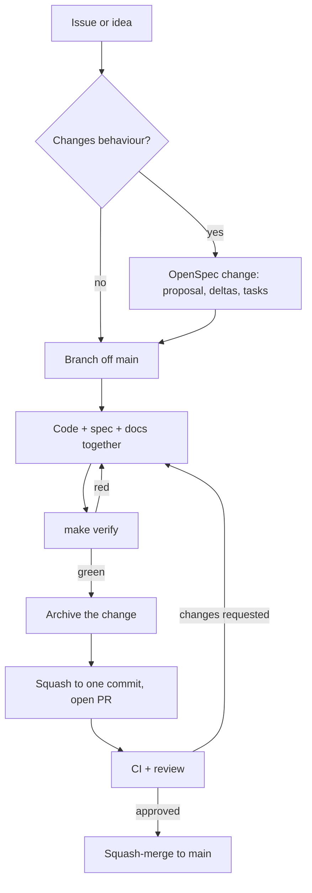

# Contributing

This section is for anyone who wants to change Coffer: fix a bug, add a feature, improve the docs or review a pull request. It applies equally to human contributors and to AI coding agents working on the repository. This page explains how the project runs and the path a change takes. The pages after it cover the details.

| Page | Read it when you want to |
| --- | --- |
| [Development setup](/contributing/development) | Clone, install, run the daemon and web UI from source without touching your own vault |
| [Spec-driven workflow](/contributing/spec-workflow) | Change behaviour: write or update an OpenSpec change, cite requirements, write an ADR |
| [Testing](/contributing/testing) | Pick the right test tier, tag acceptance scenarios, understand every gate `make verify` runs |
| [Frontend](/contributing/frontend) | Touch `frontend/src`: API client, query keys, design system, i18n |
| [Security policy](/contributing/security) | Report a vulnerability, or check that a change respects the security invariants |

## How the project runs

Coffer is a single-maintainer, MIT-licensed project developed in the open at [github.com/wyx-sg/Coffer](https://github.com/wyx-sg/Coffer). Five rules shape almost every contribution.

### Specs are the contract

The product contract lives in [`openspec/specs/`](https://github.com/wyx-sg/Coffer/tree/main/openspec/specs), written with [OpenSpec](https://github.com/Fission-AI/OpenSpec). A spec is not documentation that trails the code. It states what the code must do, and if the two disagree the code is wrong. A pull request that changes externally visible behaviour carries an OpenSpec change that says what will be true afterwards. That change is archived into `openspec/specs/` in the same pull request, so the specs on `main` always describe the code on `main`. See [Spec-driven workflow](/contributing/spec-workflow).

The lasting invariants sit one level above the specs, in [`docs/principles.md`](https://github.com/wyx-sg/Coffer/blob/main/docs/principles.md): local-first, loopback only, secrets only as ciphertext, layered architecture. When any two sources disagree, the principles win.

### AI-assisted development is the default

Most of Coffer is written with AI coding agents, mainly Claude Code and Codex. The repository is set up for that:

- [`AGENTS.md`](https://github.com/wyx-sg/Coffer/blob/main/AGENTS.md) is the operating manual an agent reads at session start. Humans can read it too, and the same rules apply.
- [`.agents/`](https://github.com/wyx-sg/Coffer/tree/main/.agents) holds one convention file per topic: `workflow.md`, `openspec.md`, `stack.md`, `frontend.md`, `visual-language.md`, `testing.md` and `harness.md`. The pages in this section summarise them and link to them for the fine print.
- `.claude/` is a checked-in control layer. It holds permissions, hooks that auto-format edited files, a hook that blocks destructive shell commands, a hook that warns when you commit while `make verify` is stale, and the `/opsx:*` OpenSpec commands. [`.agents/harness.md`](https://github.com/wyx-sg/Coffer/blob/main/.agents/harness.md) describes each one.

When an AI agent contributes substantively to a commit, the commit carries a `Co-Authored-By` footer that names the model, for example `Co-Authored-By: Claude Opus 5 <noreply@anthropic.com>`.

### One line of development

Everything lands on `main`, and a release is a tagged `main`. Work that is not ready for users still lands there, gated behind an entry in the experimental-feature registry (`backend/coffer/domain/features.py`). Such work is off in a `stable` build and on in every `dev` build, including yours. Gate every surface the work adds through that one entry. When the feature is ready, remove it from the registry and delete its gates in the same pull request. Do not keep a long-lived side branch. See [Experimental features](/guides/experimental-features) for how the gate behaves.

### Conventional Commits, one commit per pull request

Commit subjects and pull request titles follow [Conventional Commits 1.0](https://www.conventionalcommits.org/). The rules that actually reject a message live in [`.commitlintrc.yaml`](https://github.com/wyx-sg/Coffer/blob/main/.commitlintrc.yaml). The local `commit-msg` hook (installed by `make hooks`) and the `pr-title` workflow both enforce them.

| Rule | Value |
| --- | --- |
| Types | `feat`, `fix`, `docs`, `refactor`, `perf`, `test`, `build`, `ci`, `chore`, `revert` |
| Scope | The affected capability or area by name: `mcp-gateway`, `channels`, `ui`, `ci` |
| Subject | Imperative, no trailing period, at most 120 characters, no case rule |
| Header | `type(scope): subject` at most 150 characters |
| Body | Lines wrap at 100 characters |

```text
fix(mcp-gateway): route a tool call to the upstream that owns it

Adds a regression test for the mcp-gateway scenario
"route a tool call to the correct upstream".

Fixes #42
```

Branch names use one of five prefixes, in kebab case: `feature/`, `fix/`, `docs/`, `refactor/` or `chore/`. Squash your branch to one commit before the final push, and keep the pull request title identical to that commit's subject. The title becomes the squash-merge commit on `main`.

### The merge policy

- Every change reaches `main` through a pull request. Nobody pushes to `main` directly, and nobody force-pushes it.
- CI must be green. A red pull request is never merged, whoever approves it.
- Pull requests are squash-merged so `main` stays linear.
- An AI agent stops once it has opened the pull request. It merges only when a human has told it to directly ("merge it", "merge PR #N"). "Looks good" is not an instruction to merge.
- A defect on `main` is fixed with a new pull request (a `git revert` if needed), never by rewriting history.

## The lifecycle of a change



1. **Start from an issue.** For anything larger than a small fix, open or comment on a [GitHub issue](https://github.com/wyx-sg/Coffer/issues) first, so the approach can be agreed before you invest in it. Adding or removing a whole capability always needs the maintainer's agreement.
2. **Write the OpenSpec change** if behaviour changes. Run `/opsx:propose` or write `openspec/changes/<change-id>/` by hand: a proposal, spec deltas, a task list and a design note when a reviewer needs one. A pure refactor, a tooling change or a one-line fix needs no change folder.
3. **Branch off an up-to-date `main`:**

   ```sh
   git checkout main && git pull --ff-only
   git checkout -b feature/<short-name>
   ```

4. **Change code, spec and docs together.** When behaviour changes, update in the same pull request, never as a follow-up: the spec deltas, the OpenAPI contract, `docs/architecture.md`, the relevant ADR, `docs-site/` pages and any `.agents/` convention it touches. Add tests in the right tier, and tag each scenario the change covers with an acceptance marker.
5. **Run `make verify`** until it is green. Run `make verify-all` too when you touched a surface: a web page, an HTTP route, the CLI or the MCP shim.
6. **Archive the change** with `/opsx:archive` or `npx openspec archive <change-id> --yes`. This merges its deltas into `openspec/specs/`.
7. **Squash and open the pull request:**

   ```sh
   git reset --soft main && git commit      # one commit, Conventional Commits subject
   git push -u origin feature/<short-name>
   gh pr create --fill --base main
   ```

   The [pull request template](https://github.com/wyx-sg/Coffer/blob/main/.github/PULL_REQUEST_TEMPLATE.md) asks for what changed, why, how to test it (name the acceptance scenarios it covers), the capabilities it touches, screenshots for UI changes and any breaking change.

8. **Respond to review.** Keep the title, body and squashed commit in step every time you force-push. When the reviewer is satisfied and CI is green, the maintainer squash-merges.

::: tip Keep pull requests small
One logical change per pull request reviews fastest. When a feature needs a refactor first, send the refactor as its own `refactor/` pull request.
:::

## Dependencies and the lockfile

`backend/pyproject.toml` declares minimum versions. `backend/uv.lock` pins the exact version and hash of every transitive dependency. CI and the release workflow install with `uv sync --frozen`, so they fail if the lockfile has drifted from `pyproject.toml`. When you add, bump or remove a Python dependency, edit `pyproject.toml`, run `make lock`, and commit both files together. Never hand-edit `uv.lock`.

The repository receives Dependabot security updates only, with no routine version-bump pull requests. Bump a dependency by hand in an ordinary `chore(deps)` pull request.

## Licence and conduct

Coffer is released under the [MIT License](https://github.com/wyx-sg/Coffer/blob/main/LICENSE). By contributing, you agree that your contributions are licensed under it too.

The repository has no separate code of conduct document. Keep discussion technical and courteous, and assume good faith in issues and reviews.

## Where to ask

- **Questions, bugs and proposals:** [GitHub Issues](https://github.com/wyx-sg/Coffer/issues).
- **Security findings:** never a public issue. Follow the [security policy](/contributing/security).
- **How something works:** start with the [architecture overview](/architecture/) and the [decision records](/architecture/decisions). They explain why the code is shaped as it is.

## Related

- [Development setup](/contributing/development)
- [Spec-driven workflow](/contributing/spec-workflow)
- [Design principles](/architecture/design-principles)
- [`.agents/workflow.md`](https://github.com/wyx-sg/Coffer/blob/main/.agents/workflow.md): the full branch, commit and merge rules
