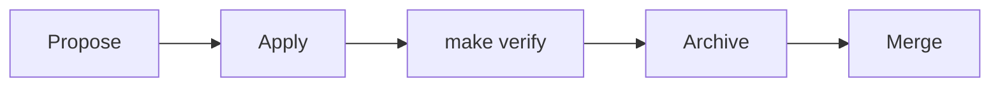

# Spec-driven workflow

Coffer's product contract is written with [OpenSpec](https://github.com/Fission-AI/OpenSpec). This page explains how the specs are laid out, how to write a requirement, how a behaviour change moves through the propose, apply and archive workflow, and how scenarios link to tests. Read it before you change anything a user can observe. The full convention is in [`.agents/openspec.md`](https://github.com/wyx-sg/Coffer/blob/main/.agents/openspec.md).

## The two halves of `openspec/`

- `openspec/specs/` says what the system does **now**.
- `openspec/changes/` holds work that will change it. Each shipped change is kept under `changes/archive/`.

Every pull request that changes externally visible behaviour carries a change folder and archives it before it merges. The specs on `main` therefore always describe the code on `main`. If the code and a spec disagree, the code is wrong.

```text
openspec/
  config.yaml                        project context + writing rules the CLI injects
  specs/<capability>/
    spec.md                          purpose, requirements, scenarios (required)
    data-model.md                    entities and fields, when the capability has state
    contracts/api.openapi.yaml       the hand-written wire contract, when it has endpoints
    <child>/spec.md                  a child capability, id <capability>/<child>
  changes/<change-id>/
    .openspec.yaml                   schema and creation date (+ skip_specs for no-delta work)
    proposal.md                      why, and what changes
    design.md                        how, when the change is not obvious
    tasks.md                         the checklist /opsx:apply works through
    specs/<capability>/spec.md       deltas: ADDED / MODIFIED / REMOVED / RENAMED
  changes/archive/YYYY-MM-DD-<change-id>/
```

## The capabilities

A capability is named and never numbered. Its id is its path under `openspec/specs/`, so a child's id is `<parent>/<child>`. Acceptance markers name capabilities by that id.

| Capability | What it owns |
| --- | --- |
| [`agent-registry`](https://github.com/wyx-sg/Coffer/blob/main/openspec/specs/agent-registry/spec.md) | Registered agents, their config files, MCP install, plugins, model catalogue, native memory and transcripts |
| `agent-registry/claude-code`, `agent-registry/codex` | How each agent type realises those facets |
| [`channels`](https://github.com/wyx-sg/Coffer/blob/main/openspec/specs/channels/spec.md) | Messaging channels to agents, independent of platform |
| `channels/telegram`, `channels/seatalk` | The per-platform mechanics |
| [`chat`](https://github.com/wyx-sg/Coffer/blob/main/openspec/specs/chat/spec.md) | The turn platform (agent adapters, conversations, the event stream) and the web Chat page |
| [`credentials`](https://github.com/wyx-sg/Coffer/blob/main/openspec/specs/credentials/spec.md) | The encrypted credential store and the rule that everything else holds references |
| [`daemon`](https://github.com/wyx-sg/Coffer/blob/main/openspec/specs/daemon/spec.md) | The Coffer process: one per vault, discovery, the loopback HTTP guard, serving the UI, logs, terminal install |
| [`desktop-app`](https://github.com/wyx-sg/Coffer/blob/main/openspec/specs/desktop-app/spec.md) | The macOS shell: window, tray, handshake, detect-or-spawn, the `.dmg` |
| [`experimental-features`](https://github.com/wyx-sg/Coffer/blob/main/openspec/specs/experimental-features/spec.md) | Release channels, the feature registry, per-machine switches, closing surfaces |
| [`internal-engine`](https://github.com/wyx-sg/Coffer/blob/main/openspec/specs/internal-engine/spec.md) | The model Coffer itself thinks with and its unattended passes |
| [`knowledge`](https://github.com/wyx-sg/Coffer/blob/main/openspec/specs/knowledge/spec.md) | Plain-file knowledge collections and curation |
| [`mcp-gateway`](https://github.com/wyx-sg/Coffer/blob/main/openspec/specs/mcp-gateway/spec.md) | Upstream MCP servers aggregated behind one endpoint |
| [`memory`](https://github.com/wyx-sg/Coffer/blob/main/openspec/specs/memory/spec.md) | Aggregating each agent's native memory into Coffer's own notes |
| [`provider-switching`](https://github.com/wyx-sg/Coffer/blob/main/openspec/specs/provider-switching/spec.md) | Model provider connections projected into each agent's config |
| [`resource-framework`](https://github.com/wyx-sg/Coffer/blob/main/openspec/specs/resource-framework/spec.md) | The kind-agnostic resource model, scope, audit log, retention, REST/CLI parity |
| [`skill-manager`](https://github.com/wyx-sg/Coffer/blob/main/openspec/specs/skill-manager/spec.md) | The master skill store and delivery to agents |
| [`vault-sync`](https://github.com/wyx-sg/Coffer/blob/main/openspec/specs/vault-sync/spec.md) | Converging the vault with a git remote the user owns |
| [`web-ui`](https://github.com/wyx-sg/Coffer/blob/main/openspec/specs/web-ui/spec.md) | The application shell, information architecture, shared list and detail conventions, i18n |

A capability covers one behaviour across every layer and surface that delivers it: backend, CLI, MCP, REST and web. Coffer never splits one behaviour into per-surface specs. When a capability varies by type, the parent holds what every type shares and each child holds only what differs. [`.agents/openspec.md`](https://github.com/wyx-sg/Coffer/blob/main/.agents/openspec.md#deciding-what-is-a-capability) has the five-test gate for deciding whether something new deserves its own capability. Usually the answer is to update an existing one.

## Writing requirements and scenarios

Every requirement states its rule with **SHALL** or **MUST** and owns at least one scenario, written as GIVEN, WHEN, THEN and AND steps. This excerpt is from [`experimental-features`](https://github.com/wyx-sg/Coffer/blob/main/openspec/specs/experimental-features/spec.md):

```markdown
### Requirement: Stamp every build with a release channel
Every build MUST carry exactly one release channel: `stable` for a build made by
the release workflow from a tag, `dev` for every other build, including a local
`make desktop` and a source install. `GET /api/v1/daemon/status` MUST report the
channel as `channel`, and `coffer daemon status` MUST print it.

#### Scenario: a source build reports the dev channel
- **GIVEN** a daemon started from a source checkout
- **WHEN** the status is requested
- **THEN** it reports `channel: "dev"`

#### Scenario: the release workflow stamps the stable channel
- **GIVEN** the channel stamp script run with `stable`
- **WHEN** the build channel is read
- **THEN** it is `stable`
```

The rules, which `openspec/config.yaml` also feeds to the CLI when it plans a change:

- A requirement title is a short imperative phrase, unique within its spec. Requirements have no numbers. A requirement is identified by its title.
- A scenario name is unique within its spec, because acceptance markers quote it.
- State user-observable behaviour. Internal mechanics belong in the change's `design.md`, in the [architecture pages](/architecture/) or in an ADR, not in `spec.md`.
- Write plain English with no time annotations such as "Day 3" or "last updated".

`openspec validate --all --strict` fails any requirement without a scenario. `make verify-acceptance` runs it.

## Citing a requirement

Because a requirement has no number, you cite it by its capability and its exact title. From Markdown, link the spec and quote the title. From a code comment, write:

```python
# spec experimental-features "Stamp every build with a release channel"
```

`scripts/check_spec_citations.py` runs in `make lint` and scans every tracked file, including this site. It resolves each citation against the `### Requirement:` headings under `openspec/specs/`. A citation whose capability or title does not exist fails the gate. So renaming a requirement fails until every citation of the old title follows it. A title that an in-flight change adds or renames is accepted until that change is archived. The gate also rejects retired id forms, such as numbered requirement, spec or ADR ids, and `scripts/check_doc_numbering.py` keeps spec directories and ADR filenames free of numbers.

## The change workflow



The OpenSpec CLI is pinned in the root `package.json`, and `make install` fetches it. Run it as `npx openspec …`. Its Claude Code commands are checked in under `.claude/commands/opsx/`, with matching skills under `.claude/skills/openspec-*`:

| Command | What it does |
| --- | --- |
| `/opsx:explore` | Think through a problem or requirement before committing to a change |
| `/opsx:propose` | Create a change folder and generate its proposal, deltas, design and tasks. Planning only: it writes no code |
| `/opsx:apply` | Implement a change task by task, ticking `tasks.md` as each lands |
| `/opsx:update` | Revise an in-flight change's artifacts |
| `/opsx:sync` | Merge a change's deltas into the main specs without archiving it |
| `/opsx:archive` | Merge the deltas into `openspec/specs/` and move the folder to `changes/archive/` |

The skills call a bare `openspec`, so either put `node_modules/.bin` on your `PATH` or install the pinned version globally. Without Claude Code, the same steps are plain files and CLI calls.

### 1. Propose

```sh
npx openspec list                 # changes in flight; "No active changes found." when none
```

Create `openspec/changes/<change-id>/`. The id is kebab-case and verb-led, for example `add-telegram-topics` or `tighten-skill-import`.

- **`proposal.md`** has two sections: *Why* and *What Changes*. Name every capability whose requirements change. Describe what the change does, not what it leaves out.
- **`specs/<capability>/spec.md`** holds deltas under `## ADDED Requirements`, `## MODIFIED Requirements`, `## REMOVED Requirements` or `## RENAMED Requirements`. A modified requirement is restated in full, scenarios included.
- **`design.md`** is needed whenever a reviewer would want a choice explained, including the alternatives you rejected.
- **`tasks.md`** is the implementation checklist.

A change that alters no requirement, such as a refactor, a tooling change or a docs change, gets a folder only when it has a plan worth reviewing. It then sets `skip_specs: true` in `.openspec.yaml`. A one-line fix needs no folder.

### 2. Apply

Implement task by task and tick each task in `tasks.md` as it lands. Strike through a dropped task and give the reason. Do not delete it. Write the tests for each new or changed scenario as you go (see [acceptance markers](#acceptance-scenarios-and-markers)).

### 3. Archive in the same pull request

When the code is done and `make verify` passes:

```sh
npx openspec archive <change-id> --yes
```

The deltas merge into `openspec/specs/` and the folder moves to `changes/archive/YYYY-MM-DD-<change-id>/`. Nothing is deleted: the archive records why each behaviour is the way it is. Archive **before** the pull request merges, in the same pull request, so `main` never holds a spec that runs ahead of or behind its code.

## Acceptance scenarios and markers

Every scenario must be covered by at least one test, in any tier. The test names the scenario it covers with a marker:

::: code-group

```python [pytest]
@pytest.mark.acceptance(
    spec="experimental-features", scenario="a source build reports the dev channel"
)
async def test_status_reports_the_dev_channel_and_every_feature_unauthenticated(client):
    r = await client.get("/api/v1/daemon/status", headers={"X-Coffer-Token": ""})
    assert r.json()["channel"] == "dev"
```

```ts [Vitest / Playwright]
import { acceptance } from "@/test/acceptance"; // e2e specs import ./_acceptance

acceptance("web-ui", "legacy /audit redirects to activity", async ({ page }) => {
  // ...
});
```

```rust [Rust]
// acceptance(spec = "desktop-app", scenario = "a spawned daemon outlives the app")
#[test]
fn a_spawned_daemon_leaves_the_apps_process_group() { /* ... */ }
```

:::

`scripts/audit_acceptance.py` runs in `make verify-acceptance` and in CI. It scans every `spec.md` and every test file, and fails on any of these:

- a scenario that no marker covers
- a marker that names a capability or scenario that does not exist, usually after a rename
- a marker on a test that can never run (`@pytest.mark.skip`, Rust `#[ignore]`)
- a scenario name used twice in one spec

A passing run prints a summary line:

```text
audit_acceptance: OK — 854 scenario(s) across 20 spec(s) all covered.
```

The pytest marker is registered with `--strict-markers`, so a typo in the marker name fails collection. The TypeScript audit strips comments before matching, so a commented-out `acceptance(...)` call does not count as coverage. A Rust marker counts only when a `#[test]` or `#[tokio::test]` follows it before the next `fn`. See [Testing](/contributing/testing#acceptance-markers) for how the tiers use these markers.

## The end-to-end deliverable rule

A capability ships only when a user can really operate it. That means backend persistence plus every surface that exposes it (CLI, MCP through `coffer-mcp-shim`, REST and, where it has one, the web UI), all wired together, with every scenario covered by a passing test. A backend with no surface, or a page with no backend, is not done.

One rule applies across every spec: **every management operation is reachable from both REST and the `coffer` CLI**, with the same daemon and the same error model. The [`resource-framework`](https://github.com/wyx-sg/Coffer/blob/main/openspec/specs/resource-framework/spec.md) spec tests it across the whole command tree. A spec that cannot honour the rule records the gap in its `## Purpose`.

## Docs change with the code

When a change alters behaviour, the same pull request updates:

- the spec deltas, archived into `openspec/specs/`
- `contracts/api.openapi.yaml`, when an endpoint or schema changes. Then run `make frontend-codegen`
- `data-model.md`, when an entity changes
- The architecture pages under [`docs-site/architecture/`](/architecture/). `scripts/check_architecture_doc.py` fails if its code-layout tree or its built-in tool roster drifts from the code
- the affected ADR, the pages of this site, and any `.agents/` convention

A pure refactor, or a frontend-only change with no contract impact, needs no spec edit.

## Architecture decision records

The specs say *what* Coffer does. ADRs in [`docs/decisions/`](https://github.com/wyx-sg/Coffer/tree/main/docs/decisions) say *why* it is built that way. Write an ADR for a decision that is:

- hard to change later without breaking compatibility or rewriting large areas;
- structural, meaning it affects more than one module or constrains future work;
- a trade-off that future readers will question; or
- a departure from a default, a popular convention, a principle or an earlier ADR.

Do not write one for a version bump, a routine bug fix, naming or formatting, or a scope decision that belongs in a spec's `## Purpose`.

An ADR states **one** decision and argues every serious option, the chosen one included. Its file name is its title in kebab case with no number, for example `experimental-features-instead-of-a-release-branch.md`:

```markdown
# Experimental Features Instead of a Release Branch

**Status**: Accepted
**Date**: YYYY-MM-DD
**Deciders**: <who decided>
**Related**: spec [experimental-features](../../openspec/specs/experimental-features/spec.md)

## Context
## Options Considered
### Option A — <name> (chosen)
### Option B — <name>
## Decision
## Consequences
```

The directory records the **live** design, not a chronological log. When a decision changes, rewrite the ADR that owns it so it reads as if written today, with the design it replaced argued as one of its options. When the thing it decided is removed, delete the ADR. Git history keeps the rest. Add each new ADR to the index in [`docs/decisions/README.md`](https://github.com/wyx-sg/Coffer/blob/main/docs/decisions/README.md), which `check_doc_numbering.py` keeps in step with the files. A change to [Principles](/architecture/principles) itself is an amendment. It needs its own proposal pull request that explains motivation, impact and alternatives.

The site's [decision records](/architecture/decisions) page summarises the current ADRs.

## Related

- [Testing](/contributing/testing)
- [Contributing overview](/contributing/)
- [Resource framework](/architecture/resource-framework)
- [`.agents/openspec.md`](https://github.com/wyx-sg/Coffer/blob/main/.agents/openspec.md)
