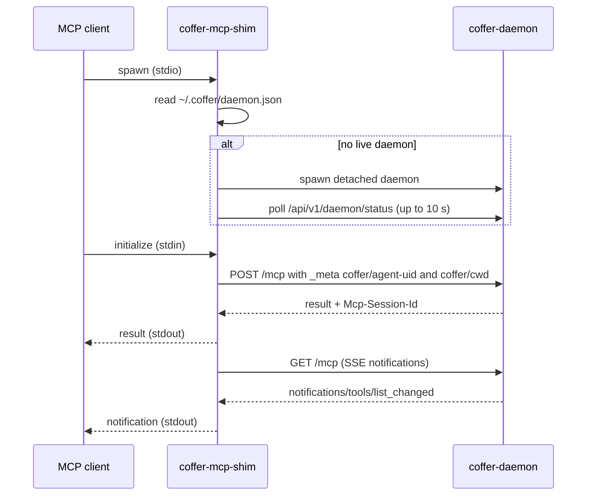

# Connect a client

Coffer presents itself to MCP clients as one MCP server. This page explains the two ways a client reaches it — the `coffer-mcp-shim` stdio bridge and the daemon's HTTP endpoint — how the client's agent identity is established, and how to check and fix the connection.

## Two ways in

| | `coffer-mcp-shim` (stdio) | `/mcp` (HTTP) |
| --- | --- | --- |
| Client config | a command | a URL plus a token header |
| Finds the daemon | reads `~/.coffer/daemon.json` | you supply port and token |
| Starts the daemon if it is down | yes | no |
| Survives a daemon restart | yes — re-reads the discovery file and re-handshakes | no — the token changes on every start |
| Reports an agent identity | `--agent-uid <uid>` | only if the client sets `_meta` itself |
| Recommended for | every client that can launch a command | clients that can only speak HTTP |

Both end at the same gateway: each client session gets its own set of upstream server processes, sees the same namespaced tools (`<server>__<tool>`), and is logged in the same invocation log.

## Claude Code and Codex: let Coffer write the entry

For a registered [agent](/guides/agents), install the entry from Coffer instead of writing it by hand:

::: code-group

```sh [CLI]
coffer agent mcp install claude-code
coffer agent mcp install codex
```

```text [Web UI]
Agents → (agent) → Install Coffer MCP
```

:::

Coffer writes the shim's absolute path and the agent's uid:

::: code-group

```json [Claude Code: ~/.claude.json]
{
  "mcpServers": {
    "coffer": {
      "command": "/Users/you/.coffer/bin/coffer-mcp-shim",
      "args": ["--agent-uid", "9a006a32d0bf5787955c43d54e4b44e9"]
    }
  }
}
```

```toml [Codex: ~/.codex/config.toml]
[mcp_servers.coffer]
command = "/Users/you/.coffer/bin/coffer-mcp-shim"
args = ["--agent-uid", "bc0eff325c015d279faab81ce63e50b2"]
```

:::

For a Claude Code agent registered with a custom config directory, the entry goes into `<config_dir>/.claude.json` instead — the file Claude Code reads when started with `CLAUDE_CONFIG_DIR`. The write is atomic, keeps a `.bak`, and is audited. Restart the agent afterwards.

Installing through Coffer is better than a hand-written entry for two reasons: the path is absolute, so it works for agents launched from a GUI that does not inherit your shell `PATH`; and `--agent-uid` identifies the agent, so [per-agent reach](#agent-identity) applies. See [Agents](/guides/agents#install-coffer-s-mcp-entry) for how the shim path is resolved.

## Any other MCP client: the stdio shim

Any client that launches stdio MCP servers can run the shim. Use the absolute path of the installed binary:

```json
{
  "mcpServers": {
    "coffer": {
      "command": "/Users/you/.coffer/bin/coffer-mcp-shim"
    }
  }
}
```

The shim accepts one flag of its own, `--agent-uid <uid>`, and ignores any other arguments a client passes. Without `--agent-uid` the session is unidentified (see below). To make a hand-configured client count as a registered agent, add `"args": ["--agent-uid", "<uid>"]` with the uid from `coffer agent show <name>`.

### What the shim does



- **Detect or spawn.** The shim reads `~/.coffer/daemon.json` (port and token, mode `0600`) and checks the daemon answers. If none does, it starts one in the background and waits up to 10 seconds. If the daemon still does not come up, the shim writes `daemon did not come up within 10s; check ~/.coffer/logs/daemon.log` to stderr and exits with code 3.
- **Bridge.** Each JSON-RPC line on stdin becomes a `POST /mcp`; replies go back on stdout. Requests are dispatched concurrently, so one slow tool call does not block pings or other calls. Server notifications arrive over a `GET /mcp` SSE stream and are written to stdout; the stream reconnects with backoff if it drops.
- **Handshake stamping.** On `initialize`, the shim adds `params._meta["coffer/cwd"]` (its working directory) and, when given, `params._meta["coffer/agent-uid"]`.
- **Daemon restarts.** If a request fails to connect, the shim re-reads `daemon.json`. When a live daemon is there at a different port or with a new token, it rebinds, replays the original `initialize` to open a fresh session, and retries the request once. The client does not see a second `initialize` reply.
- **Version check.** When the daemon that answers is a different Coffer version, the shim prints one warning to stderr and carries on:

  ```text
  coffer-mcp-shim: WARNING: attached to a Coffer daemon at version 0.1.1 (/Applications/Coffer.app/Contents/MacOS/coffer-daemon) but this coffer-mcp-shim is 0.1.2; run `coffer daemon restart` to serve the current build
  ```

- **Diagnostics.** The shim never writes logs to stdout, which is the MCP wire. It writes to `~/.coffer/logs/shim-<pid>-<timestamp>.log`, created only when there is something to record.

## Any other MCP client: HTTP

A client that can only speak HTTP MCP connects to the daemon directly:

| | Value |
| --- | --- |
| URL | `http://127.0.0.1:<port>/mcp` — port `8000` unless you changed it (`coffer daemon port`) |
| Auth header | `X-Coffer-Token: <token>`, the `token` field of `~/.coffer/daemon.json` |
| Session | the daemon returns `Mcp-Session-Id` on the first response; send it on every later request |
| Requests | JSON-RPC over `POST /mcp` |
| Notifications | `GET /mcp` with `Mcp-Session-Id`, as a server-sent event stream |

```sh
TOKEN=$(python3 -c 'import json,os;print(json.load(open(os.path.expanduser("~/.coffer/daemon.json")))["token"])')
curl -s http://127.0.0.1:8000/mcp \
  -H "X-Coffer-Token: $TOKEN" -H 'Content-Type: application/json' \
  -d '{"jsonrpc":"2.0","id":1,"method":"initialize","params":{"protocolVersion":"2025-06-18","capabilities":{},"clientInfo":{"name":"curl","version":"0"}}}'
```

::: warning The token changes on every daemon start
The daemon mints a fresh token each time it starts, and `coffer daemon rotate-token` replaces it on demand. A client configured with a literal token stops working after the next restart. Prefer the shim wherever the client can run a command.
:::

The daemon listens on loopback only and refuses requests whose `Host` is not a loopback name. Use `127.0.0.1` or `localhost`. An idle HTTP session is dropped after 30 minutes without traffic (`COFFER_MCP_SESSION_IDLE_S` changes this).

## Agent identity

The gateway decides what a session may see from the identity reported at the handshake — the agent's uid in `params._meta["coffer/agent-uid"]`. That identity is fixed for the session and applies to every list and call.

| Session | Sees |
| --- | --- |
| Reports the uid of a registered agent | every enabled server whose reach is every agent, plus servers whose reach names that agent |
| Reports nothing (hand-written entry, plain HTTP client) | only servers whose reach is every agent |
| Reports a uid no registered agent has (for example, after the agent was removed) | only servers whose reach is every agent |

An unidentified session always sees less, never more. A call to a server outside the session's reach fails with the same error a disabled tool gets (`TOOL_DISABLED`, JSON-RPC `-32000`) and is logged as `denied`. A name-based `_meta` key such as `coffer/agent` is ignored; only the uid counts.

Coffer's own tools that act per agent (for example `coffer__write` and `coffer__recall`) receive the session's identity from the gateway. Any `agent` argument a client puts in a call is overwritten, so a client cannot claim a different agent per call.

::: info Trust boundary
The identity is self-reported, not cryptographically verified. Any local process that can read `~/.coffer/daemon.json` can open a session and claim any uid. This is acceptable for a single-user daemon bound to loopback; it is not an access-control mechanism between users.
:::

## Verify the connection

1. **Check the entry.**

   ```sh
   coffer agent mcp status claude-code
   # installed: True
   # command: /Users/you/.coffer/bin/coffer-mcp-shim
   ```

2. **Check the daemon.**

   ```sh
   coffer daemon status
   ```

3. **List the tools in the client.** In Claude Code, the `/mcp` command shows the `coffer` server and its tools. You should see Coffer's own `coffer__…` tools and your upstream tools as `<server>__<tool>`. When you have many upstream tools, only a budgeted slice is listed; the rest stay callable and `coffer__search_tools` finds them (see [MCP servers](/guides/mcp-servers#many-tools-tiering-and-tool-search)).

4. **Make a call and find it in the log.**

   ```sh
   coffer mcp invocations --limit 5
   ```

   The call appears with its server, tool, duration and status. The **Activity** page shows the same log.

## Troubleshooting

| Symptom | Likely cause | Fix |
| --- | --- | --- |
| The client says the `coffer` server failed to start, or `command not found` | The entry names a shim that does not exist at that path | Re-run `coffer agent mcp install <agent>`; for a hand-written entry, use the absolute path `~/.coffer/bin/coffer-mcp-shim`. |
| Shim exits with code 3 | No daemon could be started within 10 seconds | Read `~/.coffer/logs/daemon.log`. A common cause is another process holding the daemon's port; `coffer daemon port` shows which port it wants. |
| Every call fails with `All connection attempts failed` | The shim lost the daemon and no live daemon is reachable | Start the daemon (`coffer daemon start`), then restart the MCP server in the client so a fresh shim starts. |
| Tools from one server are missing for one agent only | The server's reach excludes that agent, or the entry has no `--agent-uid` | Check reach with `coffer scope show mcp_server <server>`; re-install the entry with `coffer agent mcp install`. |
| A tool is missing from the list but works when called by name | Tool tiering left it unlisted | Use `coffer__search_tools`, or raise the budget (see [MCP servers](/guides/mcp-servers#many-tools-tiering-and-tool-search)). |
| stderr shows a version mismatch warning | An older daemon is still running after an upgrade | `coffer daemon restart`. |
| HTTP client gets `401 bad token` | The token changed when the daemon restarted | Read the current token from `~/.coffer/daemon.json`, or switch to the shim. |
| A disabled tool still appears | The client cached its tool list | Reload MCP servers in the client, or restart it. |

## Related

- [Agents](/guides/agents) — registering agents and installing the entry
- [MCP servers](/guides/mcp-servers) — what the gateway serves
- [Running the daemon](/guides/daemon) — ports, service mode, restarts
- [MCP gateway](/architecture/mcp-gateway) — sessions, routing and tiering in depth
- [Detect-or-spawn](https://github.com/wyx-sg/Coffer/blob/main/docs/decisions/daemon-detect-or-spawn.md), [Session Subprocess Model](https://github.com/wyx-sg/Coffer/blob/main/docs/decisions/session-subprocess-model.md), [Per-Agent Resource Scope](https://github.com/wyx-sg/Coffer/blob/main/docs/decisions/per-agent-resource-scope.md)
