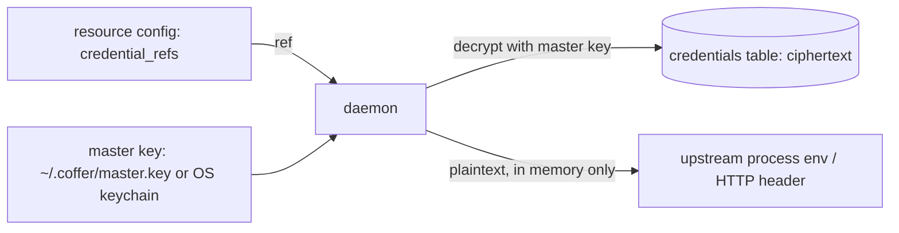

# Credentials

Coffer keeps every secret it needs — an MCP server's token, a provider's API key, a channel bot's token, a sync remote's push token — in one encrypted store, and everything else refers to a secret by name. This page covers storing and citing credentials, rotating and deleting them, where the master key lives, and how to back it up or move it to another machine.

## How secrets are stored

- Each secret is encrypted with [Fernet](https://cryptography.io/en/latest/fernet/) and stored as ciphertext in the `credentials` table of `~/.coffer/coffer.db`. A row holds the ref, the ciphertext and two timestamps — nothing else.
- One **master key** decrypts them all. It lives in exactly one place: a file beside the database (`~/.coffer/master.key`, mode `0600`, the default) or your OS keychain (opt-in).
- Resource configuration — MCP servers, providers, channels, the sync remote — holds only **refs**. A ref is resolved to plaintext at the moment of use: when an MCP server is started or an HTTP header is sent, when a provider key is fetched.
- The daemon is the only process that opens the store. The CLI and web UI reach secrets through the daemon's `/api/v1/credentials` routes; neither touches the key.



## Store a credential

A ref is a slash-separated name of letters, digits, `.`, `_` and `-` — for example `github/token` or `brave/api-key`. The name carries no meaning to the store; choose one you will recognise in a listing.

```sh
# From stdin, so the value never reaches your shell history
printf '%s' "$GITHUB_TOKEN" | coffer credentials set github/token
# stored: github/token

# Or at a hidden prompt
coffer credentials set github/token
```

An empty value is rejected. `--value <secret>` also works but prints a warning, because the value lands in your shell history.

Most of the time you do not create refs by hand. The dialogs that ask for a secret — **Add MCP server**, the MCP server **Edit** dialog's credentials, **Add model provider**, a channel's token field, the sync remote's push credential — write the secret to the store first and save only the generated ref (for example `mcp_server/<uuid>/GITHUB_TOKEN` or `provider/<uuid>/key`). If the registration that follows fails, the just-written credential is deleted again.

## Cite a credential

| Where | How the ref is cited |
| --- | --- |
| stdio MCP server | `coffer mcp add … --credential ENV_VAR=<ref>` — becomes an environment variable of the server process |
| HTTP MCP server | `coffer mcp add … --credential Header-Name=<ref>` — becomes a request header; the secret is the header's whole value |
| Adopting an agent's MCP entry | `coffer agent mcp adopt … --secret KEY=<ref>` — Coffer stores the entry's current value under `<ref>` |
| Model provider | `coffer provider add … --credential-ref <ref>` |
| Channel | the channel's token fields (see [Channels](/guides/channels)) |
| Sync remote | `coffer sync remote set … --credential-ref <ref>` |

Registering a resource that cites a ref the store does not hold fails, naming the missing credential, and nothing is saved. Several resources may cite the same ref.

## List and inspect

```sh
coffer credentials list
```

```text
                      Known credential refs
┏━━━━━━━━━━━━━━━━━━━━━━━━━━━━━━━┳━━━━━━━━━━━━━━━━━━┳━━━━━━━━━━━━━━━━━━━┓
┃ Ref                           ┃ Present in store ┃ Cited by          ┃
┡━━━━━━━━━━━━━━━━━━━━━━━━━━━━━━━╇━━━━━━━━━━━━━━━━━━╇━━━━━━━━━━━━━━━━━━━┩
│ github/token                  │ yes              │ mcp_server github │
│ provider/7f3c…/key            │ no               │ provider deepseek │
└───────────────────────────────┴──────────────────┴───────────────────┘
```

The list shows every ref any registered resource cites, whether the store holds it, and who cites it. It decrypts nothing and is not audited. After restoring a vault without its secrets, the `no` rows are the ones to set again. `--json` gives the same data.

```sh
coffer credentials get github/token          # [redacted] — a presence check, not audited
coffer credentials get github/token --show   # prints the value — an audited read
```

## Rotate a credential

Store a new value under the same ref:

```sh
printf '%s' "$NEW_TOKEN" | coffer credentials set github/token
```

The row is re-encrypted in place and keeps its creation time. Everything that cites the ref uses the new value the next time it resolves it — for an MCP server, the next time a session starts it. For a provider, `coffer provider edit <name> --secret <value>` does the same through the provider's own ref.

## Delete a credential

```sh
coffer credentials delete github/token       # asks first; --force skips the prompt
```

Deletion is refused while any resource still cites the ref, and the message names each one by kind and current name:

```text
credential 'github/token' is still used by: mcp_server 'github'; detach or delete those resources before deleting the credential
```

You rarely need this command: deleting a resource releases the refs nothing else cites. Deleting a ref that does not exist succeeds and does nothing.

## Where the master key lives

| | File (default) | OS keychain (opt-in) |
| --- | --- | --- |
| Location | `~/.coffer/master.key`, mode `0600` | service `coffer`, entry `master-key` |
| Prompts | none | macOS may ask to allow access once per daemon start |
| Protects against | — | someone who copies `~/.coffer/` without your keychain |

**Web UI:** **Settings → Security**, the **Credential encryption** card. Toggle **Store master key in OS keychain**, then **Move key** in the confirmation.

**CLI:**

```sh
coffer credentials storage                  # master key storage: file
coffer credentials storage --set keychain
coffer credentials storage --set file
```

A move writes the key to its destination and reads it back before removing the source, so an interruption leaves the key where it was. Every stored secret stays readable in both directions, and the move is audited as `master_key_relocated`. The key can be moved but not rotated: Coffer does not re-encrypt the store under a new key.

At startup the daemon looks for the key in the file first, then the keychain. It creates a new key only when the credential store is empty.

::: danger Keep a copy of the master key
Without the master key, every stored secret is unrecoverable. If ciphertext exists and neither location holds a usable key, the daemon refuses to start with `MASTER_KEY_MISSING`, naming the path it expected, and it never writes a replacement key over existing ciphertext. Restoring the original key restores every secret.
:::

## Back up the key

- **File storage:** copy `~/.coffer/master.key` somewhere safe, such as your password manager. Copying all of `~/.coffer/` with the daemon stopped also captures it.
- **Keychain storage:** the key is in your keychain under service `coffer`, entry `master-key`. Move it to the file first (`coffer credentials storage --set file`) if you want a file to back up.
- **With vault sync on:** `coffer sync key export <path>` writes the key to a file (mode `0600`) wherever it is stored.

## Carry the key to another machine

[Vault sync](/guides/vault-sync) can carry credentials to your other machines, but only as ciphertext, and only when you turn it on (`coffer sync remote set <url> --with-credentials`, or **Include credentials** on the Sync page). The master key is never pushed under any setting. A machine that receives ciphertext without the key reports those refs as locked rather than failing quietly.

To let a second machine decrypt them, move the key yourself, over a channel you trust:

```sh
# Machine A
coffer sync key export ~/coffer-master.key
coffer sync key fingerprint

# Machine B, after copying the file across
coffer sync key import ~/coffer-master.key
coffer sync key fingerprint     # must match machine A
rm ~/coffer-master.key
```

The **Sync** page offers the same as **Export key** and **Import key**, and its machine list shows whether each machine holds the **Same key**. Importing a different key keeps the previous one as a timestamped `master.key.bak-*` beside it.

::: info Vault sync is an experimental feature
The `coffer sync key` commands and the Sync page need the `vault_sync` feature, which is off by default in stable releases. Turn it on with `coffer daemon features enable vault_sync` (see [Experimental features](/guides/experimental-features)).
:::

## What never gets logged

- Secret values never appear in the database outside the ciphertext column, in log files, in the audit log, or in the MCP invocation log.
- Credential audit events — `credential_set`, `credential_read`, `credential_deleted`, `credential_migrated`, `master_key_relocated` — carry the ref (or the key's location), never a value. `credential_read` is recorded only for an explicit read of the value (`--show`, `GET /api/v1/credentials/{ref}`); presence checks and listings are not audited.
- Plaintext exists only in the daemon's memory, between decryption and the process spawn or HTTP request that uses it.
- A stdio MCP server receives only its own credentials. It does not inherit the daemon's environment, so it cannot read other secrets the daemon was started with.
- An HTTP upstream's connection errors are reported by exception type only, so a URL or header carrying a secret is not echoed into a message.

## Troubleshooting

| Error | Meaning | Fix |
| --- | --- | --- |
| `MASTER_KEY_MISSING` at startup | Ciphertext exists but no usable key was found | Restore `~/.coffer/master.key` (or the keychain entry) from your backup. |
| `CREDENTIAL_LOCKED` at startup | The keychain could not be read — it is locked or the prompt was dismissed | Unlock the keychain and start the daemon again. |
| `CREDENTIAL_UNREADABLE` naming a ref | The ciphertext does not decrypt with the current key — usually a key from another machine | Import the matching key, or set the ref again with its value. |
| `CREDENTIAL_IN_USE` | A resource still cites the ref | Detach or delete the resources the message names. |
| An MCP server fails to start naming a missing credential | The cited ref is not in the store | `coffer credentials set <ref>`. |

## Related

- [MCP servers](/guides/mcp-servers) — citing credentials from env vars and headers
- [Model providers](/guides/providers) — provider keys and `apiKeyHelper`
- [Vault sync](/guides/vault-sync) — carrying ciphertext between machines
- [Security model](/architecture/security) — the threat model behind these choices
- [Envelope-Encrypted Credential Store](https://github.com/wyx-sg/Coffer/blob/main/docs/decisions/envelope-encrypted-credential-store.md)
- Spec: [credentials](https://github.com/wyx-sg/Coffer/blob/main/openspec/specs/credentials/spec.md)
