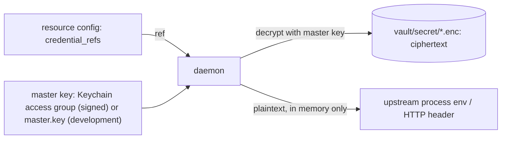

# Credentials

Coffer keeps every secret it needs — an MCP server's token, a provider's API key, a channel bot's token, a sync remote's push token — in one encrypted store, and everything else refers to a secret by name. This page covers storing and citing credentials, rotating and deleting them, where the master key lives, and how to back it up or move it to another machine.

No command, route or MCP tool prints a stored value. You see a value only in the desktop app, after Touch ID or your login password, and a secret goes somewhere it has not gone before only after you approve it there. [Secrets](/guides/secrets) explains that boundary, how approvals work, and how to hand a secret to a command you run with `coffer run`.

## How secrets are stored

- Each secret is encrypted with [Fernet](https://cryptography.io/en/latest/fernet/) and stored as ciphertext in its own file, `~/.coffer/vault/secret/<ref>.enc` (mode `0600`), holding the Fernet token and nothing else. The token carries its own encryption time; when this machine first stored the ref is kept in `~/.coffer/local/secret-boundary/times.json`. The vault's git repository leaves `secret/` out of its commits until a sync remote carries secrets.
- One **master key** decrypts them all. It lives in exactly one place. A signed release keeps it in a Keychain item only Coffer's signed binaries can read. A development build — every build from source, and every build until signed releases exist — keeps it in a file (`~/.coffer/master.key`, mode `0600`, the default) or your OS keychain (opt-in). See [Where the master key lives](#where-the-master-key-lives).
- Resource configuration — MCP servers, providers, channels, the sync remote — holds only **refs**. A ref is resolved to plaintext at the moment of use: when an MCP server is started or an HTTP header is sent, when a provider key is fetched.
- The daemon is the only process that opens the store. The CLI and web UI write and list secrets through the daemon's `/api/v1/credentials` routes; neither touches the key, and no route hands a value back.


```mermaid
flowchart LR
    CFG["resource config: credential_refs"] -->|ref| D["daemon"]
    D -->|decrypt with master key| DB[("vault/secret/*.enc: ciphertext")]
    D -->|plaintext, in memory only| UP["upstream process env / HTTP header"]
    MK["master key: Keychain access group (signed) or master.key (development)"] --> D
```

## Store a credential

A ref is a slash-separated name of letters, digits, `.`, `_` and `-` — for example `github/token` or `brave/api-key`. The name carries no meaning to the store; choose one you will recognise in a listing.

```sh
# From stdin, so the value never reaches your shell history
printf '%s' "$GITHUB_TOKEN" | coffer credentials set github/token
# stored: github/token

# Or at a hidden prompt
coffer credentials set github/token
```

An empty value is rejected. `--value <secret>` also works but prints a warning, because the value lands in your shell history.

Most of the time you do not create refs by hand. The dialogs that ask for a secret — **Add server** on the MCP servers page, the MCP server **Edit** dialog's credentials, **Add model provider**, a channel's token field, the sync remote's push credential — write the secret to the store first and save only the generated ref (for example `mcp_server/<uuid>/GITHUB_TOKEN` or `provider/<uuid>/key`). If the registration that follows fails, the just-written credential is deleted again.

## Cite a credential

| Where | How the ref is cited |
| --- | --- |
| stdio MCP server | `coffer mcp add … --credential ENV_VAR=<ref>` — becomes an environment variable of the server process |
| HTTP MCP server | `coffer mcp add … --credential Header-Name=<ref>` — becomes a request header; the secret is the header's whole value |
| Adopting an agent's MCP entry | `coffer adopt mcp <agent>:<entry> --secret KEY=<ref>` — Coffer stores the entry's current value under `<ref>` |
| Model provider | `coffer provider add … --credential-ref <ref>` |
| Channel | the channel's token fields (see [Channels](/guides/channels)) |
| Sync remote | `coffer sync remote set … --credential-ref <ref>` |
| A command you run, a skill, an env file | `coffer://secret/<name>`, for a standalone secret stored as `secret/<name>` — see [Secrets](/guides/secrets) |

Registering a resource that cites a ref the store does not hold fails, naming the missing credential, and nothing is saved.

Several resources may cite the same ref, but a ref already sent to one place goes to a second place only after you approve it in the desktop app. A value you store and then cite within five minutes is used at once, because you just supplied it. Citing an older secret from a new resource, or changing where a resource sends one (a stdio server's command, an HTTP server's URL, the sync remote's URL), saves the change and holds the secret: the command prints `waiting for approval in the Coffer app` and exits `9`. See [Secrets → Approvals](/guides/secrets#approvals).

## List and inspect

```sh
coffer credentials list
```

```text
                                   Credentials
┏━━━━━━━━━━━━━━━━━━━━┳━━━━━━━━━━━━━━━━━━┳━━━━━━━━━━━━━━━━━━━━━━━━━┳━━━━━━━━━━━━━━━━━━━━━━━━━━━━━┓
┃ Ref                ┃ Present in store ┃ Used by                 ┃ Readable by local processes ┃
┡━━━━━━━━━━━━━━━━━━━━╇━━━━━━━━━━━━━━━━━━╇━━━━━━━━━━━━━━━━━━━━━━━━━╇━━━━━━━━━━━━━━━━━━━━━━━━━━━━━┩
│ github/token       │ yes              │ mcp_server github       │ yes                         │
│ provider/7f3c…/key │ no               │ provider deepseek       │ no                          │
│ secret/orders-db   │ yes              │ skill coffer-database   │ yes                         │
│ secret/old-api     │ yes              │ (unreferenced)          │ yes                         │
└────────────────────┴──────────────────┴─────────────────────────┴─────────────────────────────┘
```

The list shows every ref the store holds and every ref a registered resource cites:

- **Present in store** — whether the store holds a value. After restoring a vault without its secrets, the `no` rows are the ones to set again.
- **Used by** — the resources that cite the ref, the skills whose files cite a standalone secret's `coffer://secret/<name>`, and how many destinations wait for approval. `(unreferenced)` marks a secret nothing uses: a candidate to delete.
- **Readable by local processes** — whether another program running as you can read the value where Coffer puts it: a stdio MCP server's environment, or a standalone secret handed to a command. See [what stays exposed](/architecture/security#what-stays-exposed).

It decrypts nothing and is not audited. `--json` gives the same data, with the approved and pending destinations of each ref. The [Secrets page](/guides/secrets#the-secrets-page) in the web UI shows the same list.

```sh
coffer credentials get github/token          # [redacted] — a presence check, not audited
```

`get` only tells you whether a value is stored: it prints `[redacted]`, or exits `4` when the ref is missing. No option prints the value. To see or copy one, choose **Reveal value…** on the [Secrets page](/guides/secrets#the-secrets-page) in the desktop app, which asks for Touch ID or your login password each time.

## Rotate a credential

Store a new value under the same ref:

```sh
printf '%s' "$NEW_TOKEN" | coffer credentials set github/token
```

The row is re-encrypted in place and keeps its creation time. Everything that cites the ref uses the new value the next time it resolves it — for an MCP server, the next time a session starts it. For a provider, `coffer provider edit <name> --secret <value>` does the same through the provider's own ref. On the Secrets page, the row's **Replace value…** does it for any ref.

Replacing a value that something already receives — or any standalone `secret/<name>` — waits for your approval in the desktop app, because swapping a channel's bot token for someone else's, say, would redirect your conversations. Until you approve, the old value stays in use and the new one waits encrypted; `set` prints `waiting for approval in the Coffer app` and exits `9`, or waits with `--wait`. A new ref, or one nothing receives, is stored at once.

## Delete a credential

```sh
coffer credentials rm github/token           # asks first; --force skips the prompt
```

Deletion is refused while any resource still cites the ref, or while a skill's files cite a standalone secret's `coffer://secret/<name>`, and the message names each one by kind and current name:

```text
credential 'github/token' is still used by: mcp_server 'github'; detach or delete those resources before deleting the credential
```

On the Secrets page, **Delete…** on the row does the same, and for a ref still in use it lists what uses it, each with a link to its page, instead of deleting.

You rarely need this command: deleting a resource releases the refs nothing else cites (standalone `secret/` names are never released this way). Deleting a ref forgets the destinations it was approved for, so a new value stored under the same ref later is treated as a new secret. Deleting a ref that does not exist succeeds and does nothing.

## Where the master key lives

Where the key lives is fixed by how Coffer was built, not by a setting.

| Build | Where the key lives | Who can read it |
| --- | --- | --- |
| **Signed release** | One item in the macOS data-protection Keychain, in an access group limited to Coffer's Apple Team ID | Only Coffer's signed binaries. Any other program — an agent's script, `/usr/bin/security` — gets no access and no "Allow" dialog to click. The daemon reads it silently at every start. |
| **Development build** | `~/.coffer/master.key`, mode `0600` (default), or the OS keychain (opt-in) | Any program running as you can read the file. |

At the first start of a signed release, a key found in `master.key` or in the old keychain item is moved into the Keychain item — written, read back and compared, then the source is deleted — and audited as `master_key_relocated`. If the two disagree the daemon stops and names both fingerprints rather than guessing.

::: warning Signed releases do not exist yet
Coffer does not yet ship binaries signed with an Apple Developer ID, so every build today is a development build and keeps the key in a file. In a development build the [secret boundary](/guides/secrets) does not hold: any process running as you can read the key and forge the desktop app's approval. The desktop app says "Development build" on every presence prompt. See [Security model → Development builds](/architecture/security#development-builds).
:::

In a development build you can still choose between the file and the OS keychain:

| | File (default) | OS keychain (opt-in) |
| --- | --- | --- |
| Location | `~/.coffer/master.key`, mode `0600` | service `coffer`, entry `master-key` |
| Prompts | none | macOS may ask to allow access once per daemon start |
| Protects against | — | someone who copies `~/.coffer/` without your keychain |

**Web UI:** **Settings › Security**, the **Encryption** section. Toggle **Store master key in OS keychain**, then **Move key** in the confirmation.

**CLI:**

```sh
coffer config get credentials.storage       # file
coffer config set credentials.storage keychain
coffer config set credentials.storage file
```

A move writes the key to its destination and reads it back before removing the source, so an interruption leaves the key where it was. Every stored secret stays readable in both directions, and the move is audited as `master_key_relocated`. The key can be moved but not rotated: Coffer does not re-encrypt the store under a new key. A signed release refuses to move its key out of the Keychain.

At startup a development build looks for the key in the file first, then the keychain. Either build creates a new key only when the credential store is empty.

::: danger Keep a copy of the master key
Without the master key, every stored secret is unrecoverable. If ciphertext exists and no usable key is found, the daemon refuses to start with `MASTER_KEY_MISSING`, and it never writes a replacement key over existing ciphertext. Restoring the original key restores every secret. In a signed release the Keychain is the only copy, so a reset login keychain or a new Mac without migration loses every secret unless you made a backup.
:::

**Back up the master key** is on **Settings › Security** in the [desktop app](/guides/desktop-app#presence-checks-and-approvals): after a Touch ID or password check it asks for a folder and writes the key there as a file only you can read, recorded as `master_key_exported` in Activity. Move that file off the Mac — a password manager or a USB drive — and delete the copy. A browser tab shows **Open in Coffer app** instead, because the key never crosses the daemon's API.

### Settings › Security

Settings › Security holds what belongs to this Mac only: **Encryption** (where the master key lives, and its backup), **Access** (the daemon's access token — hidden until **Show**, with **Copy**, and **Rotate…**, which installs the new token in the page at once and is recorded as `token_rotated`; other tabs and clients using the old token stop until they load the new one) and **Approvals** (whether a secret waits for your approval before it goes somewhere new, with **Review** for what waits). Stored secrets are listed and managed on the [Secrets](/guides/secrets) page, linked from the tab as **Manage in Secrets**.

## Back up the key

Open the **desktop app** and back up the master key: pick a folder, confirm with Touch ID or your login password, and the app writes `coffer-master-key-<fingerprint>.key` into that folder with mode `0600`. It never overwrites an existing file, the key itself never passes through the page, and the backup is audited as `master_key_exported`. Keep the file somewhere safe, such as your password manager.

No command, REST route or browser page writes a key backup. An agent can run any command you can, so a command that exported the key would hand every secret to it.

In a development build the key is also simply the file `~/.coffer/master.key` (or the keychain entry, service `coffer`, entry `master-key`), and copying all of `~/.coffer/` with the daemon stopped captures it.

## Carry the key to another machine

[Vault sync](/guides/vault-sync) can carry credentials to your other machines, but only as ciphertext, and only when you turn it on (`coffer sync remote set <url> --with-secret`, or **Include encrypted secrets** on the Sync page). The master key is never pushed under any setting. A machine that receives ciphertext without the key reports those refs as locked rather than failing quietly.

To let a second machine decrypt them, move the key yourself, over a channel you trust:

1. On machine A, back up the key in the desktop app (above), and note its fingerprint (`coffer sync key fingerprint`).
2. Copy the backup file to machine B.
3. On machine B:

   ```sh
   coffer sync key import ~/coffer-master-key-<fingerprint>.key
   coffer sync key fingerprint     # must match machine A
   rm ~/coffer-master-key-<fingerprint>.key
   ```

Importing needs no presence check — whoever holds the file already holds the key. The **Sync** page offers **Import key** as well, and its machine list shows whether each machine holds the **Same key**. Importing a different key keeps the previous one as a backup beside it: a timestamped `master.key.bak-*` file in a development build, a second Keychain item in a signed release.

## What never gets logged

- Secret values never appear in plaintext in the vault, in `runs.db`, in log files, in the audit log, or in the MCP invocation log.
- Credential audit events — `credential_set`, `credential_revealed`, `credential_deleted`, `credential_migrated`, `master_key_relocated`, `master_key_exported`, `secret_resolved`, `secret_imported` and the `secret_approval_*` events — carry the ref, the secret's name or the destination, never a value. `credential_revealed` records a reveal or copy in the desktop app; presence checks (`get`) and listings are not audited.
- Plaintext exists only in the daemon's memory, between decryption and the process spawn or HTTP request that uses it — and in the desktop app's window while you look at a revealed value.
- A stdio MCP server receives only its own credentials. It does not inherit the daemon's environment, so it cannot read other secrets the daemon was started with. Its own credentials sit in its environment, where other programs running as you can read them; the listing marks such refs "readable by local processes".
- An HTTP upstream's connection errors are reported by exception type only, so a URL or header carrying a secret is not echoed into a message.

## Troubleshooting

| Error | Meaning | Fix |
| --- | --- | --- |
| `MASTER_KEY_MISSING` at startup | Ciphertext exists but no usable key was found | Import your key backup with `coffer sync key import <file>`, or in a development build restore `~/.coffer/master.key` (or the keychain entry). |
| `CREDENTIAL_LOCKED` at startup | The keychain could not be read — it is locked or the prompt was dismissed | Unlock the keychain and start the daemon again. |
| `CREDENTIAL_UNREADABLE` naming a ref | The ciphertext does not decrypt with the current key — usually a key from another machine | Import the matching key, or set the ref again with its value. |
| `CREDENTIAL_IN_USE` | A resource still cites the ref | Detach or delete the resources the message names. |
| `waiting for approval in the Coffer app`, exit `9` | A secret in the change goes somewhere it has not gone before, or replaces a value in use | Approve it in the desktop app; `coffer credentials approvals` lists what waits. See [Secrets → Approvals](/guides/secrets#approvals). |
| `PRESENCE_GRANT_INVALID` | A reveal, key backup or approval was attempted outside the desktop app | Do it in the desktop app. |
| An MCP server fails to start naming a missing credential | The cited ref is not in the store | `coffer credentials set <ref>`. |

## Related

- [Secrets](/guides/secrets) — the secret boundary, approvals, `coffer run` and standalone secrets
- [MCP servers](/guides/mcp-servers) — citing credentials from env vars and headers
- [Model providers](/guides/providers) — provider keys and `apiKeyHelper`
- [Vault sync](/guides/vault-sync) — carrying ciphertext between machines
- [Security model](/architecture/security) — the threat model behind these choices
- [Envelope-Encrypted Credential Store](https://github.com/wyx-sg/Coffer/blob/main/docs/decisions/envelope-encrypted-credential-store.md)
- [Agents May Configure Coffer; Only a Present Human Sees a Secret's Plaintext or Sends It Somewhere New](https://github.com/wyx-sg/Coffer/blob/main/docs/decisions/only-a-present-human-sees-a-secret-or-sends-it-somewhere-new.md)
- Spec: [credentials](https://github.com/wyx-sg/Coffer/blob/main/openspec/specs/credentials/spec.md)
