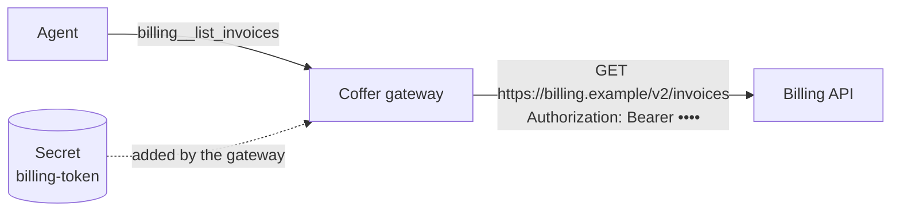

# Custom tools

A **custom tool** is one HTTP request that Coffer makes for your agents. There is no MCP server to write or run: you describe the request — method, path, headers, body and arguments — and Coffer's gateway makes it whenever an agent calls the tool, adding your API key on the way out. Agents see custom tools exactly like the tools of any MCP server.

Custom tools live in **groups**. A group is one API: it has a name that agents see as a prefix, one base URL, a list of headers (some of which may hold a stored secret) and a default reach. Each tool in it adds its own path to the base URL.

## Prerequisites

- The daemon is running and at least one agent is connected to Coffer (see [Agents](/guides/agents#connect-an-agent-to-coffer)).
- If the API needs a key, have it ready. Secrets live only in Coffer: the group form picks a stored secret from the [Secrets page](/guides/secrets) or takes a pasted value and saves it there. The value never leaves the secret store except inside the request Coffer sends.

## Add a group from an OpenAPI spec

On **Custom tools**, choose **Add custom tool**. The group comes first: pick **New group**, then **Import an OpenAPI spec** and **Continue**. (An OpenAPI import always makes a new group; an existing group only takes requests added by hand.)

1. Name the group — agents see its tools as `<group>__<tool>`, and the name is fixed once the group exists.
2. Give the spec as a **URL** or a **File** (JSON or YAML, OpenAPI 3.0 or 3.1, up to 5 MB) and press **Load**. Coffer lists every operation it found, grouped by the spec's tags. A spec it cannot read is reported with the line where it breaks; a URL it cannot reach is reported with the host and why (the name did not resolve, the connection was refused, the request timed out), so you can check the URL, your network, VPN or proxy, or switch to **File** and choose a local copy.
3. Tick the **operations** that become tools. Reads start ticked; operations that change data start unticked. **Reads only** goes back to that choice; the filter narrows a long list.
4. Check the **Headers** the spec's security scheme fills in (an `Authorization` header for a Bearer scheme): the value is a stored secret that holds the whole header value, or you paste one and Coffer saves it to Secrets with the group. Then set **Available to**: the agents the group reaches by default. The base URL comes from the spec's `servers`; if the spec names none, the form asks for it.
5. Optionally **Try an operation**: run one ticked operation once against the spec's base URL, before anything exists (see [Test before you save](#test-before-you-save)).
6. **Review N tools** shows the group as it will be made, the ticked operations as its tools, each with the piece of the spec it comes from, and the rest as **Skipped**. Nothing is saved until **Create group with N tools**.

Each operation becomes a tool named from its `operationId` — `listInvoices` becomes `billing__list_invoices`. Path and query parameters become arguments; a JSON request body becomes one `body` argument.

A spec URL is fetched only from a public address: Coffer refuses to fetch from loopback, private or link-local hosts on your behalf (see [Security → Outbound requests](/architecture/security#outbound-requests)). For a spec on an internal host, download it and import it as a file.

### Re-import when the spec changes

A group made by an import shows its spec and when it was fetched, with **Re-import** (also in the group's **⋯** menu). Re-import reads the spec again and shows every change as a preview, with the spec text before and after where Coffer kept it: operations to **add** — a read becomes a tool, switched on; an operation that changes data is listed but not added — tools the spec **changed** (a new required argument, a moved path), and tools it would **remove** because their operation is gone. Nothing changes until **Apply N changes**. Unchanged tools keep their on/off switch and their changes-data flag; tools you added by hand are never removed. A group imported from a file asks for the file again.

## Add a request by hand

Choose **Add custom tool** and pick the group it goes in:

- **An existing group** — **Continue** opens **Add a request**, which uses that group's base URL and secret. A group's own **Add request** button, in the row above its tools table, opens the same form.
- **New group** — pick **Add one request by hand**, then fill in the group: name, base URL, headers (the auth header is a row whose value is a stored secret), and default reach. **Create group** moves on to its first request; the group is saved together with that request.

The request form asks for:

- **Tool name** — agents see it as `<group>__<tool>`; fixed once added.
- **Request** — the method and a path template added to the group's base URL. Holes in braces are filled from the arguments: `/services/{service}/deploys?env={env}`. A value is always encoded, so it can never change the path or the host; a query pair whose argument is not given is left out.
- **Tool description** — what the agent reads to decide when to call it.
- **Changes data** — on by default for POST, PUT, PATCH and DELETE (see [below](#tools-that-change-data)).
- **Headers** — the group's auth header is shown from the group; add headers for this request, which may use holes.
- **Body template** — for POST, PUT or PATCH, JSON with holes: `{"service": {service}, "note": "rollback by {user}"}`. A hole outside quotes becomes the argument's JSON value; inside quotes it becomes text. With no template, the arguments the path and headers did not use are sent as a JSON object.
- **Arguments** — name, type, whether it is required, and a description for the agent. Every hole must be an argument.

Nothing is saved until **Add to `<group>`**. A saved tool opens in a drawer on the group's page, where the same fields (except the name) are edited, with its **Available to**, an **On** switch and **Delete tool**; nothing changes until **Save**.

## Test before you save

Every request form ends with **Test**: fill in a sample value for each argument and press **Run**. It runs the request once as the form holds it and shows the status, time, size and body — or the API's error body, a timeout (the group's), a connection that failed, or a response cut short at 1 MiB, which is what an agent would get too. A 401 or 403 says the API rejected the secret. Nothing is saved and nothing is recorded as an agent's call.

A request of a group that is **not saved yet** is tested without its secret: a stored secret goes only to a saved group, after you approve it (see below). Its base URL is typed into the form, so Coffer tests it only on a public address it can resolve; a loopback, private or unresolvable host is reported as not tested — add the tool, then test it from the group.

## Secrets and approval

A group header is a name and a value. The auth header is a header row like any other: its value is a stored secret that holds the **whole** header value — store `Bearer <token>`, not the token alone, because Coffer puts nothing in front of it. Pick the secret with the row's 🔑 button, or paste a new value and it is saved to Secrets with the group. Coffer adds each secret header to every request after the tool's own headers, so no tool can replace it. The secret is never in a tool's description or arguments, never in what an agent receives — an echo of it in a response is shown as `***` — and never in any log.

::: warning A group made before this change needs its secret replaced
Coffer no longer puts `Bearer ` in front of a secret. A group whose secret held only the token must have that secret's value replaced with the full header value, for example `Bearer <token>`, on the [Secrets page](/guides/secrets); until then the API is likely to reject the call, typically with a 401.
:::

Sending a stored secret to a group is sending it somewhere new, so the first time a group uses it, the secret **waits for your approval in the Coffer desktop app** (see [Secrets → Approvals](/guides/secrets#approvals)). Until you approve, the group shows *waiting for approval* and its calls send nothing. Changing the group's base URL or a secret header asks again.

## Tools that change data

Every tool carries a **changes data** flag, on by default for every method but GET. Coffer passes it to agents as the tool's MCP annotations — `readOnlyHint: true` for a tool that only reads, `readOnlyHint: false` with `destructiveHint: true` for one that writes — so each agent's own approval prompt applies to the tools that change something. Turn it off for a POST that only searches; turn it on for a GET that has side effects.

## Choose which agents reach each tool

A group has a reach, like any MCP server: the **Reach** button in its header (**Off**, **All agents** or **Chosen agents**, saved as you change it). A tool has no reach of its own: every tool that is on reaches exactly the agents its group reaches. To keep one tool from some agents — the one dangerous operation among many harmless ones — switch it off, or move it to a group of its own with a narrower reach. **All agents** on a group covers agents you add later, and, like every reach, stays on this machine.

Each tool also has an on/off switch (**All on · All off** switches every tool of the group). A tool that is off, or in a group outside an agent's reach, is not listed to that agent and a call to it is refused.

## The Custom tools page

With no group yet, the page shows only how custom tools work and the two ways in, with **Add custom tool** in the header and the page. Once there are groups, the list puts groups that **need attention** first — a group whose last call failed, whose secret is missing or waits for approval — then healthy ones, then the ones switched off. Under the search box, **Reach** narrows the list to the groups one agent can use (an agent's **Open Custom tools ›** link lands here with that agent chosen). Groups can be ticked: a selection bar replaces the search, reading "N of M selected" with **Reach**, **Delete** and **×** (a select-all row and **Esc** also clear or extend the selection), so reach or deletion applies to every ticked group at once. A group's page has a header and three tabs, each at its own address (`/custom-tools/billing`, `/custom-tools/billing/tools`, `/custom-tools/billing/invocations`):

- the **header** carries three fixed buttons, **Reach**, **Edit group** and **⋯** (Delete group), and a one-line summary of the last 24 hours: calls and errors. When the group's calls fail, a banner under it offers **View calls** (the Invocations tab) and the daemon's hand-off, **Ask an agent ▾**;
- **Overview** — the group's **definition**: what agents see (`billing__<tool>`), the base URL, the auth header with the secret's name, the timeout and the spec it came from, with **Re-import** for an imported group;
- **Tools** — the **tools table**, with a search by tool name and **Add request** in one row above it — each tool's switch, method and path, changes-data flag, and its calls and errors in 24 hours. Choosing a tool opens its editor in a 640-wide drawer, with the test result under the fields;
- **Invocations** — the group's calls in the last 24 hours, newest first: time, tool, who called it, the result and how long it took, with an **Errors** filter. A row opens the call's details; like everywhere in Coffer, the arguments and the response are never recorded.

## How a call is made

When an agent calls a tool, the gateway renders the request from the arguments, sends it with the group's timeout (30 seconds unless you change it, up to 300), **does not follow redirects** — a redirect is returned to the agent with its location, so the secret never travels to a host you did not configure — and reads at most 1 MiB of the response. The agent receives `HTTP <status> <reason>` followed by the body; a status of 400 or more is returned as a tool error. Every call is recorded in Activity with its tool, time, duration and outcome, never its arguments or response.

## Command line

The command line carries only what a program, an offline daemon or an agent hand-off needs; managing custom tools is the web UI, on the **Custom tools** page.

## Related

- [MCP servers](/guides/mcp-servers) — the gateway every custom tool runs through.
- [Secrets](/guides/secrets) — storing the API key a group uses.
- [MCP gateway → Custom tools](/architecture/mcp-gateway#custom-tools-the-http-api-transport) — how the transport works.
