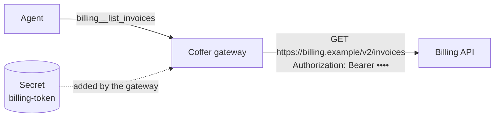

# Custom tools

A **custom tool** is one HTTP request that Coffer makes for your agents. There is no MCP server to write or run: you describe the request — method, path, headers, body and arguments — and Coffer's gateway makes it whenever an agent calls the tool, adding your API key on the way out. Agents see custom tools exactly like the tools of any MCP server.

Custom tools live in **groups**. A group is one API: it has a name that agents see as a prefix, a description of what the API is for, one set of tools, a default reach and one or more **environments** — the places the same tools are sent, such as `test` and `live`, each with its own base URL and headers (some of which may hold a stored secret). Each tool adds its own path to the base URL of the environment a call names (see [Environments](#environments)).

Write the group's description for the agent: what this API is and when to use it. When an agent searches for a tool with `coffer__search_tools`, a group's tools are matched against the group's description as well as their own, and each tool found comes back with the group's description beside it. An agent's tool list keeps each tool's own description.



## Prerequisites

- The daemon is running and at least one agent is connected to Coffer (see [Agents](/guides/agents#connect-an-agent-to-coffer)).
- If the API needs a key, have it ready. Secrets live only in Coffer: the group form picks a stored secret from the [Secrets page](/guides/secrets) or takes a pasted value and saves it there. The value never leaves the secret store except inside the request Coffer sends.

## Add a group from an OpenAPI spec

On **Custom tools**, choose **Add custom tool**. The group comes first, in a select you can type into to find a group by name; it starts on **New group**. Keep it, pick **Import an OpenAPI spec** and **Continue**. (An OpenAPI import always makes a new group; an existing group only takes requests added by hand.)

1. Name the group — agents see its tools as `<group>__<tool>`, and the name is fixed once the group exists.
2. Give the spec as a **URL** or a **File** (JSON or YAML, OpenAPI 3.0 or 3.1, up to 5 MB) and press **Load**. Coffer lists every operation it found, grouped by the spec's tags. A spec it cannot read is reported with the line where it breaks; a URL it cannot reach is reported with the host and why (the name did not resolve, the connection was refused, the request timed out), so you can check the URL, your network, VPN or proxy, or switch to **File** and choose a local copy.
3. Check the group's **Description**: it starts as the spec's own description (`info.description`), which you can rewrite for the agent.
4. Tick the **operations** that become tools. Reads start ticked; operations that change data start unticked. **Reads only** goes back to that choice; the filter narrows a long list.
5. Check the **Headers** the spec's security scheme fills in (an `Authorization` header for a Bearer scheme): the value is a stored secret that holds the key, or you paste the key and Coffer saves it to Secrets with the group; a Bearer scheme starts as **Bearer**. Then set **Available to**: the agents the group reaches by default. The base URL comes from the spec's `servers`; if the spec names none, the form asks for it. The group starts with one environment, `default`, holding that base URL and those headers; add others on its page (see [Environments](#environments)).
6. Optionally **Try an operation**: run one ticked operation once against the spec's base URL, before anything exists (see [Test before you save](#test-before-you-save)).
7. **Review N tools** shows the group as it will be made, the ticked operations as its tools, each with the piece of the spec it comes from, and the rest as **Skipped**. Nothing is saved until **Create group with N tools**.

Each operation becomes a tool named from its `operationId` — `listInvoices` becomes `billing__list_invoices`. Path and query parameters become arguments; a JSON request body becomes one `body` argument.

A spec URL is fetched only from a public address: Coffer refuses to fetch from loopback, private or link-local hosts on your behalf (see [Security → Outbound requests](/architecture/security#outbound-requests)). For a spec on an internal host, download it and import it as a file.

### Re-import when the spec changes

A group made by an import shows its spec and when it was fetched, with **Re-import** (also in the group's **⋯** menu). Re-import reads the spec again and shows every change as a preview, with the spec text before and after where Coffer kept it: operations to **add** — a read becomes a tool, switched on; an operation that changes data is listed but not added — tools the spec **changed** (a new required argument, a moved path), and tools it would **remove** because their operation is gone. Nothing changes until **Apply N changes**. Unchanged tools keep their on/off switch and their changes-data flag; tools you added by hand are never removed, and every environment stays as it is. A group imported from a file asks for the file again.

## Add a request by hand

Choose **Add custom tool** and pick the group it goes in from the select (type to narrow it):

- **An existing group** — **Continue** opens **Add a request**, which uses that group's environments and their secrets. A group's own **Add request** button, in the row above its tools table, opens the same form.
- **New group** — pick **Add one request by hand**, then fill in the group: name, description, base URL, headers (the auth header is a row whose value is a stored secret, with an auth scheme), and default reach. The base URL and headers become the group's first environment, `default`. **Create group** moves on to its first request; the group is saved together with that request.

The request form asks for:

- **Tool name** — agents see it as `<group>__<tool>`; fixed once added.
- **Request** — the method and a path template added to the environment's base URL. Holes in braces are filled from the arguments: `/services/{service}/deploys?env={env}`. A value is always encoded, so it can never change the path or the host; a query pair whose argument is not given is left out. `{env:NAME}` is filled from the environment's [variables](#variables) instead.
- **Tool description** — what the agent reads to decide when to call it.
- **Changes data** — on by default for POST, PUT, PATCH and DELETE (see [below](#tools-that-change-data)).
- **Headers** — the group's auth header is shown from the group; add headers for this request, which may use holes.
- **Body template** — for POST, PUT or PATCH, JSON with holes: `{"service": {service}, "note": "rollback by {user}"}`. A hole outside quotes becomes the argument's JSON value; inside quotes it becomes text. With no template, the arguments the path and headers did not use are sent as a JSON object.
- **Arguments** — name, type, whether it is required, and a description for the agent. Every hole must be an argument. The arguments are a JSON Schema, checked when you save; `coffer_environment` is reserved and cannot be one of them (see [Arguments are checked before any request](#arguments-are-checked-before-any-request)).

Nothing is saved until **Add to `<group>`**. A saved tool opens in a drawer on the group's page, where the same fields (except the name) are edited, with its **Available to**, an **On** switch and **Delete tool**; nothing changes until **Save**.

## Test before you save

Every request form ends with **Test**: fill in a sample value for each argument and press **Run**. In a saved group the form works in **one environment** at a time: it starts at the first one that is on, and with more than one on, an **Environment** picker beside **Run** changes it. Everything the form says about where the request goes follows that choice — the base URL under **Request**, the headers it already adds, and a **preview** above the result: the method and URL with the environment's variables filled in (argument holes such as `{id}` stay until the run), the headers as they would be sent (a secret header by its secret's name and whether it is set, never its value), the variables and the timeout that applies. Picking an environment saves nothing. If the environment is switched off or deleted while the form is open, Test says so and **Run** stays off until you pick another; it never runs somewhere else instead. The result says **Ran in &lt;environment&gt;**. It runs the request once as the form holds it and shows the status, time, size and body — or the API's error body, a timeout (the environment's own, else the group's), a connection that failed, or a response cut short at 1 MiB, which is what an agent would get too. Under the URL it lists the response headers that name the request on the API's side — request and trace ids, `server`, `date` — so you can quote them to the API's owners; cookies, auth challenges and other headers are never shown. A 401 or 403 says the API rejected the secret. Arguments that break the tool's schema are listed field by field and nothing is sent. Nothing is saved and nothing is recorded as an agent's call.

A request of a group that is **not saved yet** is tested without its secret: a stored secret goes only to a saved group, after you approve it (see below). Its base URL is typed into the form, so Coffer tests it only on a public address it can resolve; a loopback, private or unresolvable host is reported as not tested — add the tool, then test it from the group.

## Secrets and approval

A group header is a name and a value. The auth header is a header row like any other: its value is a stored secret that holds **only the key** the API gave you, and the row has an **auth scheme**: **Bearer**, **Token** or **None**. Coffer sends `<scheme> <key>`, so `Authorization: Bearer <key>` for Bearer; with **None** (for a header such as `X-Api-Key`) the key goes out as is. A new `Authorization` row starts on **Bearer**. See [Auth scheme](/guides/mcp-servers#register-an-http-server) for why the key is stored without the word `Bearer`. Pick the secret with the row's 🔑 button, or paste a new value and it is saved to Secrets with the group. Coffer adds each secret header to every request after the tool's own headers, so no tool can replace it. The secret is never in a tool's description or arguments, never in what an agent receives — an echo of it in a response is shown as `***` — and never in any log.

::: tip A group whose secret already says `Bearer …` keeps working
A header with no scheme sends its secret unchanged, so an older secret that holds `Bearer <key>` still works. To switch it over, open the group's edit dialog, set the `Authorization` row's scheme to **Bearer** and **Replace** the value with the raw key in the same save. Doing only one of the two sends `Bearer Bearer …` or no `Bearer` at all, and the API usually answers 401.
:::

Sending a stored secret to a group is sending it somewhere new, so the first time a group uses it, the secret **waits for your approval in the Coffer desktop app** (see [Secrets → Approvals](/guides/secrets#approvals)). Until you approve, the group shows *waiting for approval* and its calls send nothing. Each environment is a destination of its own: approving a secret for `live` approves nothing for `test`, and moving one environment's base URL or changing one of its secret headers asks again for that environment only. A call made in an environment whose secret waits fails with `SECRET_BINDING_PENDING`, naming the approval ids and `coffer approval approve <id>`, which an agent can run to bring the prompt to your screen; the group's other environments keep working. If you reject the approval, the group says the secret was **refused** rather than waiting, and its calls fail with `SECRET_BINDING_REJECTED`; the banner's **Ask again** puts the request back (in the desktop app it asks for Touch ID at once and approves it), as does `coffer approval ask-again <id>`.

## Environments

One API often comes in several copies — a sandbox, a staging server, the live service — that take the same requests at different addresses, with different keys. A group keeps **one set of tools** and lists those copies as **environments**. A tool is never copied per environment: `billing__list_invoices`, its switch and its reach are the same in each, and only where the request goes changes.

The **Environments** section of the group's Overview has a row per environment with its switch, base URL, the state of its secrets (**Secrets set**, **Secret missing**, **Waiting for approval**, **Refused** or **No secret**) and its variables, with **Edit…** and **Delete** on each and **Add environment** below. An environment has:

- **Name** — any name you choose, such as `test`, `uat` or `live`; none is special. It is unique in the group, and agents pass it as `coffer_environment`. Renaming one keeps its approvals.
- **Base URL** — where its requests go; a tool's path is added to it.
- **Headers** — sent with every request in it, plain or a stored secret with an auth scheme, as in [Secrets and approval](#secrets-and-approval).
- **Variables** — see [below](#variables).
- **On** — a switched-off environment cannot be chosen; a call naming it is refused.
- **Timeout** — empty to use the group's.

A group keeps at least one environment, so the last one cannot be deleted. A group made before environments existed reads as one environment named `default`, with its base URL, headers and approved secrets as they were.

### Choosing the environment of a call

Nothing keeps a current environment that one agent's choice could change for another. Every call names its own: each custom tool is listed to agents with an extra argument, `coffer_environment`, whose allowed values are the group's environments that are on. With one environment on, the argument may be left out; with two or more, it is required, and a call without it is refused (`CUSTOM_TOOL_ENVIRONMENT_REQUIRED`). A name the group does not have, or an environment that is off, is refused too (`CUSTOM_TOOL_ENVIRONMENT_UNKNOWN`, `CUSTOM_TOOL_ENVIRONMENT_DISABLED`), before any request. Coffer removes `coffer_environment` from the arguments before it builds the request, so the API never sees it, and no argument can change an environment's base URL, headers or secret. Calls made at the same time in different environments each use only their own. A region, tenant or customer id stays an ordinary argument of the tool.

### Variables

A variable is plain, non-secret text an environment defines, such as `region` = `eu-1`, and a tool uses as `{env:region}` in its path, query, headers or body: `GET /v1/{env:region}/items` goes to `/v1/eu-1/items` in one environment and `/v1/us-1/items` in another. A variable is never part of a base URL, so the host a secret goes to is the environment's base URL alone. A value that looks like a credential is refused — store it as a secret header instead — and a tool that names a variable some environment that is on does not define is refused when you save it.

## Tools that change data

Every tool carries a **changes data** flag, on by default for every method but GET. Coffer passes it to agents as the tool's MCP annotations — `readOnlyHint: true` for a tool that only reads, `readOnlyHint: false` with `destructiveHint: true` for one that writes — so each agent's own approval prompt applies to the tools that change something. Turn it off for a POST that only searches; turn it on for a GET that has side effects. On the command line it is `--changes-data` or `--read-only` on `coffer custom-tool tool add` and `tool update`.

## Choose which agents reach each tool

A group has a reach, like any MCP server: the **Reach** button in its header (**Off**, **All agents** or **Chosen agents**, saved as you change it). A tool has no reach of its own: every tool that is on reaches exactly the agents its group reaches. To keep one tool from some agents — the one dangerous operation among many harmless ones — switch it off, or move it to a group of its own with a narrower reach. **All agents** on a group covers agents you add later, and, like every reach, stays on this machine.

Each tool also has an on/off switch. Tick tools (the header box ticks every one the filter shows) and a selection bar offers **Turn on**, **Turn off** and **Exposure** for them. A tool that is off, or in a group outside an agent's reach, is not listed to that agent and a call to it is refused.

## The Custom tools page

With no group yet, the page shows only how custom tools work and the two ways in, with **Add custom tool** in the header and the page. Once there are groups, the list puts groups that **need attention** first — a group whose last call failed, whose secret is missing, waits for approval or was refused — then healthy ones, then the ones switched off. Under the search box, **Reach** narrows the list to the groups one agent can use (an agent's **Open Custom tools ›** link lands here with that agent chosen). Groups can be ticked: a selection bar replaces the search, reading "N of M selected" with **Reach**, **Delete** and **×** (a select-all row and **Esc** also clear or extend the selection), so reach or deletion applies to every ticked group at once. A group's page has a header and two tabs, each at its own address (`/custom-tools/billing`, `/custom-tools/billing/tools`), laid out like an MCP server's page:

- the **header** carries three fixed buttons, **Reach**, **Edit group** and **⋯** (Delete group), and a one-line summary of the last 24 hours: calls and errors. When the group's calls fail, a banner under it offers **View calls** (the Activity page, searching the group's name) and the daemon's hand-off, **Hand off to &lt;Agent&gt; ▾**;
- **Overview** — the group's **definition** (its description, what agents see, `billing__<tool>`, the base URL, the auth header with the secret's name as a link to its page, the timeout and the spec it came from, with **Re-import** for an imported group), the group's **Environments** (see [Environments](#environments)), then the blocks an MCP server's Overview has: **Last 24 hours** (calls and errors, and per calling agent its calls, errors and last call; **View in Activity** opens the Activity page already searching the group's name), **Requires** (each secret the group's headers cite, by the secret's own name, linking to its page — set, missing, refused or waiting for approval — with **Replace key…**, where **Use another secret** repoints that header; a group starts no program, so no CLI is listed) and **Most-called tools** (the busiest four, read-only, with **Show all N in Tools**);
- **Tools** — the **tools table**, with a search by tool name and **Add request** in one row above it — each tool's switch, method and path, changes-data flag, its **Exposure** and its calls and errors in 24 hours. Choosing a tool opens its editor in a 640-wide drawer, with the test result under the fields.

### How each tool reaches agents

A custom tool is listed to agents the way an MCP server's tool is (see [Many tools: tiering and tool search](/guides/mcp-servers#many-tools-tiering-and-tool-search)): while the catalogue is over the listing budget, the most-used tools are listed and the rest are found through `coffer__search_tools`. The **Exposure** column on the Tools tab sets this per tool, with the same choice as an MCP server's Tools tab: **Auto** (the budget decides; the row reads **Auto · Listed** or **Auto · Behind search**), **Always listed** or **Search only**. The choice is saved with the group, recorded in Activity, and works from the moment the group exists — no agent has to have listed it first. It never decides whether a tool can be called: a tool that is on stays callable by name; to keep a tool from agents, switch it off.

## How a call is made

When an agent calls a tool, the gateway picks the environment the call names, checks the arguments, renders the request, sends it to that environment's base URL with its timeout (the group's 30 seconds unless you change it, up to 300), **does not follow redirects** — a redirect is returned to the agent with its location, so the secret never travels to a host you did not configure — and reads at most 1 MiB of the response. The agent receives `HTTP <status> <reason>` followed by the body; a status of 400 or more is returned as a tool error. Every call is recorded in Activity with its tool, environment, time, duration and outcome, never its arguments, headers or response.

### Arguments are checked before any request

A tool's arguments are a JSON Schema, and every call — an agent's, a test on this page, a test from the command line — is checked against all of it by the same validator before anything is sent: types (and OpenAPI's `nullable`), `enum` and `const`, numeric ranges and `multipleOf`, string length and `pattern`, array items, length and uniqueness, `required` and `additionalProperties`, `allOf`, `anyOf`, `oneOf`, `not`, `if`/`then`/`else` and local `$ref`. Arguments that do not match are refused as `CUSTOM_TOOL_ARGUMENTS_INVALID`, with one entry per field naming its path, the rule it broke and why, and the API receives no request. An agent gets the same list as a tool error, so it can correct the call. A schema that is not valid itself — `minimum` given as text, a `pattern` that is not a regular expression, a `$ref` to nothing — is refused when you save the tool. A missing secret, a secret waiting for approval, and an unknown or switched-off environment are likewise refused before any request.

## From the command line

Everything on the Custom tools page has a `coffer custom-tool` command that calls the same route, so an agent can set a group up end to end without the page. No script, local proxy or MCP wrapper takes part: the commands talk to the daemon, and the gateway calls the API itself.

```sh
# A group with two environments, one key per environment
coffer custom-tool group create billing --env test=https://test.billing.example --description "Invoices and payments"
coffer custom-tool env add billing live --base-url https://billing.example
coffer custom-tool env set-header billing test Authorization --secret billing-test-token --scheme Bearer
coffer custom-tool env set-var billing test region eu-1

# A tool from a JSON file (method, path, headers, body template, argument schema, changes_data)
coffer custom-tool tool add billing --data @search.json

# Who reaches it, and a test in one environment
coffer custom-tool group reach billing --agent claude-code
coffer custom-tool tool test billing search --env test --args '{"q": "x"}' --json
```

| On the page | Command |
| --- | --- |
| The list, a group's page | `coffer custom-tool group list`, `group show <group>` |
| **Add custom tool** › new group, **Edit group**, **⋯** › Delete group | `coffer custom-tool group create`, `group update`, `group delete` |
| The group's switch, **Reach** | `coffer custom-tool group enable` / `disable`, `group reach --agent <agent>` (repeat) or `--all` |
| **Environments** | `coffer custom-tool env list`, `env add`, `env update` (`--rename`, `--base-url`, `--timeout`), `env enable` / `disable`, `env delete` |
| An environment's headers and variables | `coffer custom-tool env set-header` (`--value`, or `--secret` with `--scheme`), `env unset-header`, `env set-var`, `env unset-var` |
| **Add request**, the tool drawer, a tool's switch, **Delete tool** | `coffer custom-tool tool add`, `tool show`, `tool update`, `tool enable` / `disable`, `tool delete` |
| **Test** on a saved tool, on a draft, on a group not saved yet | `coffer custom-tool tool test`, `tool test-draft`, `tool test-unsaved` |
| **Import an OpenAPI spec** | `coffer custom-tool import read --file <spec>`, then `group create <group> --from-openapi <spec> --operation <op>` (repeat) |
| **Re-import** | `coffer custom-tool reimport preview <group>`, `reimport apply <group> --add <op>` |

To see what a call would send without sending it, add `--dry-run` to `tool test` or `tool test-draft`: it picks the environment and checks the arguments exactly as a test does, then prints the method, the final URL, every header, the rendered body and the timeout (and whose it is). A secret header shows `***` in place of its value, with the secret's name, id, scheme and whether it is set, missing or waiting for approval; no secret is read and no request is made.

```sh
coffer custom-tool tool test billing search --env test --args '{"q": "x"}' --dry-run
```

A real test also prints the response headers that identify the request (`x-request-id`, `server`, `date` and the like) after the status line, and lists them under `response_headers` with `--json`.

A tool's definition, request template and argument schema come from flags, from a file (`--data @search.json`) or from standard input (`--data -`), and `--set key=value` changes one field on top. Every command takes `--json`. `--env` chooses the environment of a test and is needed once more than one is on; `--args` takes the arguments as JSON (text, `@file` or `-`). A test or a dry run whose arguments break the schema exits `6` with one error per field and sends nothing, and so does a dry run whose request cannot be built in that environment (`CUSTOM_TOOL_REQUEST_INVALID`); a test the API answers with an error status exits `7`.

A command whose change leaves a secret waiting — binding a stored secret to an environment's header, or moving an environment's base URL — saves the change, prints the approval ids and `next: coffer approval approve <id>`, and exits `9`. Running that command shows you the Touch ID or password prompt in the desktop app; see [Secrets → On the command line](/guides/secrets#on-the-command-line). The [`coffer custom-tool` reference](/reference/cli/custom-tool) lists every option.

## Related

- [MCP servers](/guides/mcp-servers) — the gateway every custom tool runs through.
- [Secrets](/guides/secrets) — storing the API key a group uses.
- [MCP gateway → Custom tools](/architecture/mcp-gateway#custom-tools-the-http-api-transport) — how the transport works.
