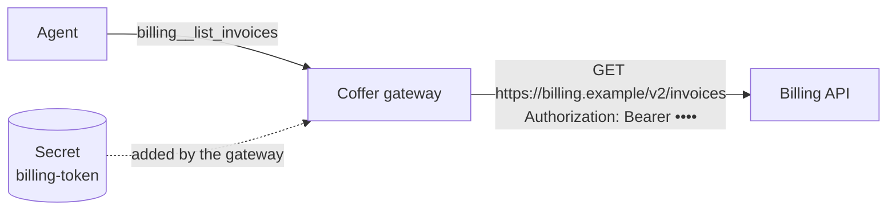

# Custom tools

A **custom tool** is one HTTP request that Coffer makes for your agents. There is no MCP server to write or run: you describe the request — method, path, headers, body and arguments — and Coffer's gateway makes it whenever an agent calls the tool, adding your API key on the way out. Agents see custom tools exactly like the tools of any MCP server.

Custom tools live in **groups**. A group is one API: it has a name that agents see as a prefix, one base URL, one secret for authentication and a default reach. Each tool in it adds its own path to the base URL.



## Prerequisites

- The daemon is running and at least one agent is connected to Coffer (see [Agents](/guides/agents#connect-an-agent-to-coffer)).
- If the API needs a key, store it on the [Secrets page](/guides/secrets) first. A group names its secret by that name; the value never leaves the secret store except inside the request Coffer sends.

## Add a group from an OpenAPI spec

On **Custom tools**, choose **Add custom tool**, pick **New group** and name it, then choose **Import an OpenAPI spec**.

1. Give the spec as a **URL** or a **File** (JSON or YAML, OpenAPI 3.0 or 3.1, up to 5 MB) and press **Load**. Coffer lists every operation it found.
2. Check the **Base URL** (taken from the spec's `servers`) and the **Auth** header (taken from its security scheme, e.g. `Authorization: Bearer`), and pick the **Secret** that goes in it.
3. Choose **Available to**: the agents the group reaches.
4. **Review tools**: tick the operations that become tools. Read operations are ticked for you; operations that change data start unticked. Press **Create group**.

Each operation becomes a tool named from its `operationId` — `listInvoices` becomes `billing__list_invoices`. Path and query parameters become arguments; a JSON request body becomes one `body` argument.

A spec URL is fetched only from a public address: Coffer refuses to fetch from loopback, private or link-local hosts on your behalf (see [Security → Outbound requests](/architecture/security#outbound-requests)). For a spec on an internal host, download it and import it as a file.

On the command line:

```sh
coffer tool add billing --openapi https://billing.example/openapi.json \
  --secret billing-token                      # the GET operations
coffer tool add billing --openapi ./billing.yaml --all-operations \
  --base-url https://billing.example/v2 --secret billing-token
coffer tool add billing --openapi ./billing.yaml \
  --operation "GET /invoices" --operation "POST /refunds"
```

### Re-import when the spec changes

A group made by an import shows its spec and when it was fetched, with **Re-import**. Re-import reads the spec again and shows a preview first: the operations it would **add**, the tools it would **remove** because their operation is gone, and how many it keeps. Nothing changes until you confirm. Kept tools keep their on/off switch, their changes-data flag and their reach override; tools you added by hand are never removed. A group imported from a file asks for the file again.

```sh
coffer tool reimport billing                    # preview, then confirm
coffer tool reimport billing --add-all --yes    # take every new operation
coffer tool reimport billing --file ./billing.yaml --add "GET /charges"
```

## Add a request by hand

Choose **Add custom tool**, pick an existing group (or create a new one: name, base URL, auth header, secret and reach), then **Add one request by hand**. The tool opens in the editor:

- **Request** — the method and a path template added to the group's base URL. Holes in braces are filled from the arguments: `/services/{service}/deploys?env={env}`. A value is always encoded, so it can never change the path or the host; a query pair whose argument is not given is left out.
- **Tool description** — what the agent reads to decide when to call it.
- **Changes data** — on by default for POST, PUT, PATCH and DELETE (see [below](#tools-that-change-data)).
- **Headers** — the group's auth header is shown from the group; add headers for this request, which may use holes.
- **Body template** — for POST, PUT or PATCH, JSON with holes: `{"service": {service}, "note": "rollback by {user}"}`. A hole outside quotes becomes the argument's JSON value; inside quotes it becomes text. With no template, the arguments the path and headers did not use are sent as a JSON object.
- **Arguments** — name, type, whether it is required, and a description for the agent. Every hole must be an argument.

```sh
coffer tool op add deploy rollback --method POST \
  --path "/services/{service}/rollback" \
  --arg service:string:required:"Service name, e.g. web"
```

## Test before you save

The editor's **Test** runs the request once with sample argument values, using the group's base URL and secret, and shows the status, time, size and body. Nothing is saved and nothing is recorded as an agent's call. `coffer tool op test <group> <tool> --arg-value key=value` does the same from a terminal.

## Secrets and approval

The auth header's value is the secret you chose; Coffer adds it to every request after the tool's own headers, so no tool can replace it. The secret is never in a tool's description or arguments, never in what an agent receives — an echo of it in a response is shown as `***` — and never in any log.

Sending a stored secret to a group is sending it somewhere new, so the first time a group uses it, the secret **waits for your approval in the Coffer desktop app** (see [Secrets → Approvals](/guides/secrets#approvals)). Until you approve, the group shows *waiting for approval* and its calls send nothing. Changing the group's base URL or its auth header asks again. `coffer tool add` and `coffer tool edit` print "waiting for approval in the Coffer app" and exit `9`, or wait with `--wait`.

## Tools that change data

Every tool carries a **changes data** flag, on by default for every method but GET. Coffer passes it to agents as the tool's MCP annotations — `readOnlyHint: true` for a tool that only reads, `readOnlyHint: false` with `destructiveHint: true` for one that writes — so each agent's own approval prompt applies to the tools that change something. Turn it off for a POST that only searches; turn it on for a GET that has side effects.

## Choose which agents reach each tool

A group has a reach, like any MCP server: **Available to** on its page, or `coffer tool scope <group> --agents claude-code`. Each tool follows it unless you **override** it in the tool's editor (or with `coffer tool op scope <group> <tool> --agents …`). An override narrows the group's reach for that one tool — useful for the one dangerous operation among many harmless ones — and, like every reach, stays on this machine.

Each tool also has an on/off switch (**All on · All off** switches every tool of the group). A tool that is off, or outside an agent's reach, is not listed to that agent and a call to it is refused.

## The Custom tools page

The list puts groups that **need attention** first — a group whose last call failed, whose secret is missing or waits for approval — then healthy ones, then the ones switched off. A group's page shows, on one page:

- its **definition** — what agents see (`billing__<tool>`), the reach, the base URL, the auth header with the secret's name, and the spec it came from;
- a one-line summary of the last 24 hours: calls, errors and a link to Activity;
- the **tools table** — each tool's switch, method and path, changes-data flag, reach (group default or override), and its calls and errors in 24 hours. Choosing a tool opens its editor in a drawer.

## How a call is made

When an agent calls a tool, the gateway renders the request from the arguments, sends it with the group's timeout (30 seconds unless you change it, up to 300), **does not follow redirects** — a redirect is returned to the agent with its location, so the secret never travels to a host you did not configure — and reads at most 1 MiB of the response. The agent receives `HTTP <status> <reason>` followed by the body; a status of 400 or more is returned as a tool error. Every call is recorded in Activity with its tool, time, duration and outcome, never its arguments or response.

## Command reference

| Command | Does |
| --- | --- |
| `coffer tool list [--json]` | Every group, failing ones first |
| `coffer tool show <group> [--json]` | One group with its tools and last 24 hours |
| `coffer tool add <group> …` | Create a group, empty or with `--openapi` |
| `coffer tool edit <group> …` | Change its description, base URL, headers, auth or timeout |
| `coffer tool rm <group>` | Remove a group and its tools (the secret stays) |
| `coffer tool enable\|disable <group>` | Switch a group on or off |
| `coffer tool scope <group>` | Show or set the group's reach |
| `coffer tool reimport <group>` | Preview and apply a re-import |
| `coffer tool op add\|edit\|rm <group> <tool>` | Manage one tool |
| `coffer tool op enable\|disable <group> <tool>…` | Switch tools on or off |
| `coffer tool op scope <group> <tool>` | Show, narrow or clear one tool's reach |
| `coffer tool op test <group> <tool>` | Call a tool once with sample arguments |

Every option is in the [CLI reference](/reference/cli#coffer-tool).

## Related

- [MCP servers](/guides/mcp-servers) — the gateway every custom tool runs through.
- [Secrets](/guides/secrets) — storing the API key a group uses.
- [MCP gateway → Custom tools](/architecture/mcp-gateway#custom-tools-the-http-api-transport) — how the transport works.
